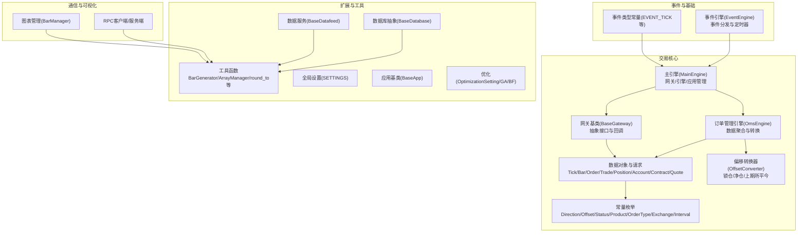
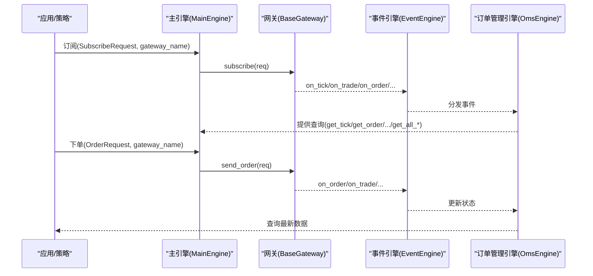
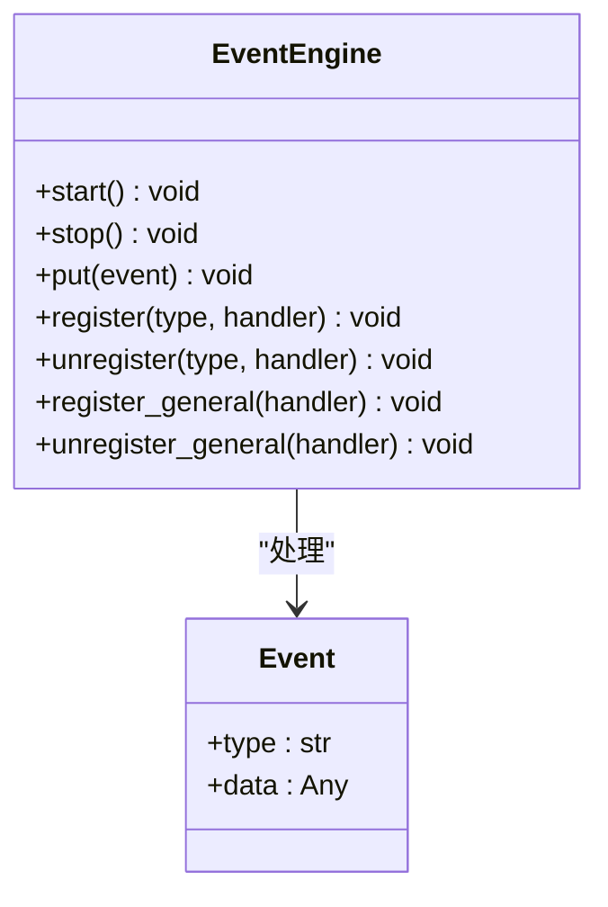
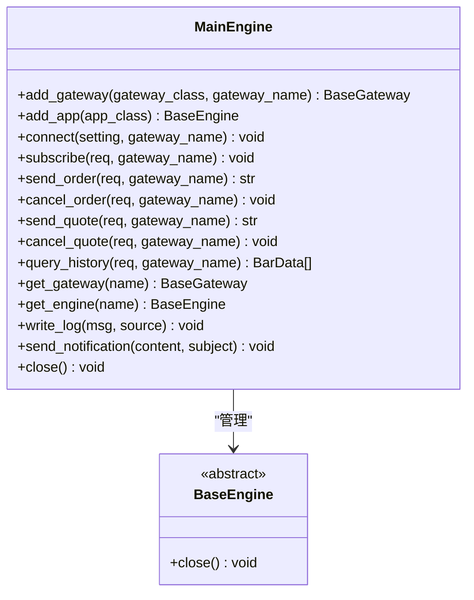
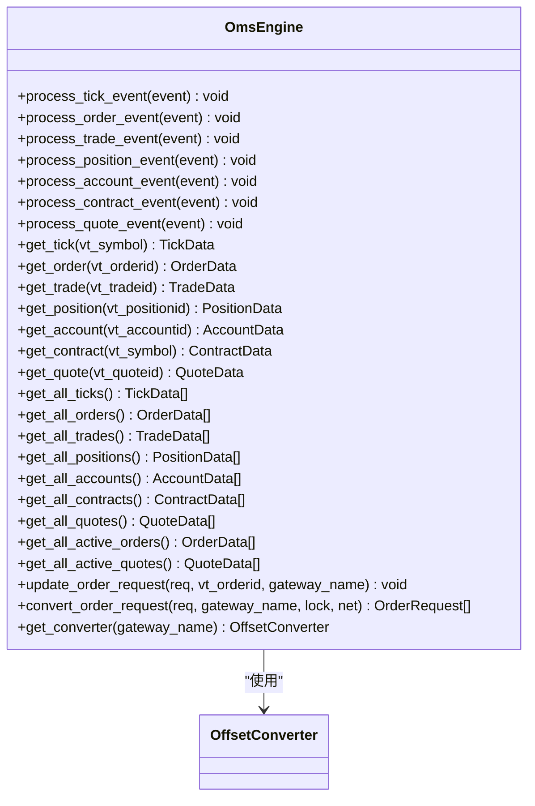
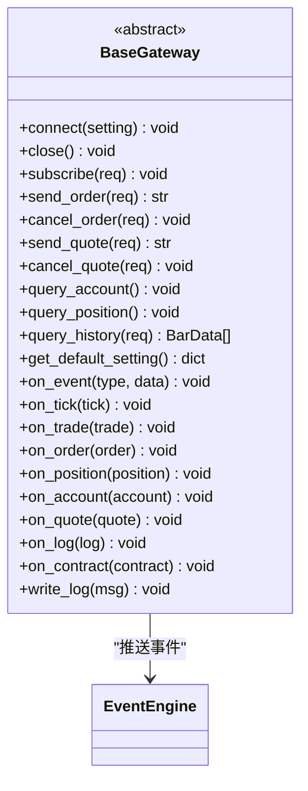
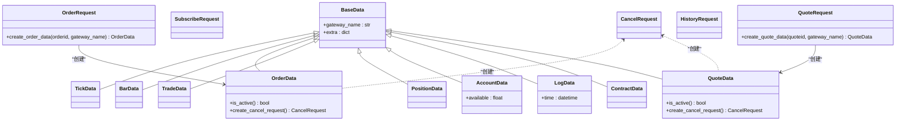
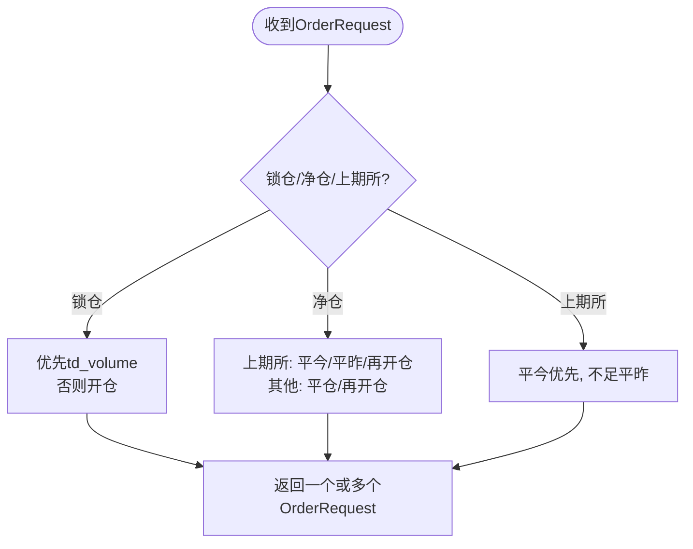
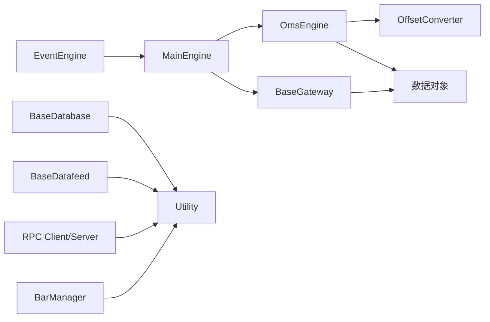

# API参考手册

<cite>
**本文档引用的文件**
- [vnpy/event/engine.py](file://vnpy/event/engine.py)
- [vnpy/trader/engine.py](file://vnpy/trader/engine.py)
- [vnpy/trader/gateway.py](file://vnpy/trader/gateway.py)
- [vnpy/trader/object.py](file://vnpy/trader/object.py)
- [vnpy/trader/event.py](file://vnpy/trader/event.py)
- [vnpy/trader/constant.py](file://vnpy/trader/constant.py)
- [vnpy/trader/converter.py](file://vnpy/trader/converter.py)
- [vnpy/trader/utility.py](file://vnpy/trader/utility.py)
- [vnpy/trader/app.py](file://vnpy/trader/app.py)
- [vnpy/trader/database.py](file://vnpy/trader/database.py)
- [vnpy/trader/setting.py](file://vnpy/trader/setting.py)
- [vnpy/trader/optimize.py](file://vnpy/trader/optimize.py)
- [vnpy/trader/datafeed.py](file://vnpy/trader/datafeed.py)
- [vnpy/rpc/client.py](file://vnpy/rpc/client.py)
- [vnpy/rpc/server.py](file://vnpy/rpc/server.py)
- [vnpy/chart/manager.py](file://vnpy/chart/manager.py)
- [vnpy/__init__.py](file://vnpy/__init__.py)
- [README.md](file://README.md)
</cite>

## 目录
1. [简介](#简介)
2. [项目结构](#项目结构)
3. [核心组件](#核心组件)
4. [架构总览](#架构总览)
5. [详细组件分析](#详细组件分析)
6. [依赖关系分析](#依赖关系分析)
7. [性能考量](#性能考量)
8. [故障排查指南](#故障排查指南)
9. [结论](#结论)
10. [附录](#附录)

## 简介
本API参考手册面向VeighNa量化交易框架的开发者，系统梳理事件引擎、交易引擎、网关接口、数据对象、数据库抽象、数据服务、RPC通信与图表管理等核心模块的公共接口，覆盖类与方法的职责、参数说明、返回值类型与典型使用路径，并提供类继承关系图与方法调用序列图，帮助读者快速理解并正确使用VeighNa 4.4.0版本的API。

## 项目结构
VeighNa采用分层与模块化组织，核心交易层由事件驱动引擎、交易引擎、网关抽象、数据对象与常量构成；上层提供应用引擎、数据库抽象、数据服务、RPC通信与图表模块；底层提供工具函数与配置管理。

**图表来源**
- [vnpy/event/engine.py](file://vnpy/event/engine.py#L33-L146)
- [vnpy/trader/event.py](file://vnpy/trader/event.py#L7-L15)
- [vnpy/trader/engine.py](file://vnpy/trader/engine.py#L81-L324)
- [vnpy/trader/gateway.py](file://vnpy/trader/gateway.py#L33-L273)
- [vnpy/trader/object.py](file://vnpy/trader/object.py#L17-L428)
- [vnpy/trader/constant.py](file://vnpy/trader/constant.py#L10-L161)
- [vnpy/trader/converter.py](file://vnpy/trader/converter.py#L17-L403)
- [vnpy/trader/database.py](file://vnpy/trader/database.py#L52-L160)
- [vnpy/trader/datafeed.py](file://vnpy/trader/datafeed.py#L10-L69)
- [vnpy/trader/utility.py](file://vnpy/trader/utility.py#L166-L800)
- [vnpy/trader/setting.py](file://vnpy/trader/setting.py#L11-L44)
- [vnpy/trader/app.py](file://vnpy/trader/app.py#L10-L22)
- [vnpy/trader/optimize.py](file://vnpy/trader/optimize.py#L26-L251)
- [vnpy/rpc/client.py](file://vnpy/rpc/client.py#L29-L170)
- [vnpy/rpc/server.py](file://vnpy/rpc/server.py#L11-L141)
- [vnpy/chart/manager.py](file://vnpy/chart/manager.py#L9-L171)

**章节来源**
- [vnpy/event/engine.py](file://vnpy/event/engine.py#L1-L146)
- [vnpy/trader/engine.py](file://vnpy/trader/engine.py#L1-L839)
- [vnpy/trader/gateway.py](file://vnpy/trader/gateway.py#L1-L273)
- [vnpy/trader/object.py](file://vnpy/trader/object.py#L1-L428)
- [vnpy/trader/constant.py](file://vnpy/trader/constant.py#L1-L161)
- [vnpy/trader/converter.py](file://vnpy/trader/converter.py#L1-L403)
- [vnpy/trader/utility.py](file://vnpy/trader/utility.py#L1-L1282)
- [vnpy/trader/database.py](file://vnpy/trader/database.py#L1-L160)
- [vnpy/trader/datafeed.py](file://vnpy/trader/datafeed.py#L1-L69)
- [vnpy/trader/setting.py](file://vnpy/trader/setting.py#L1-L44)
- [vnpy/trader/app.py](file://vnpy/trader/app.py#L1-L22)
- [vnpy/trader/optimize.py](file://vnpy/trader/optimize.py#L1-L251)
- [vnpy/rpc/client.py](file://vnpy/rpc/client.py#L1-L170)
- [vnpy/rpc/server.py](file://vnpy/rpc/server.py#L1-L141)
- [vnpy/chart/manager.py](file://vnpy/chart/manager.py#L1-L171)
- [vnpy/__init__.py](file://vnpy/__init__.py#L1-L25)
- [README.md](file://README.md#L1-L343)

## 核心组件
- 事件引擎(EventEngine)：事件队列、处理器注册、通用处理器、定时器事件（eTimer）。
- 主引擎(MainEngine)：集中管理网关、引擎、应用；提供统一的交易入口（订阅、下单、撤单、查询历史等）。
- 订单管理引擎(OmsEngine)：聚合Tick/Order/Trade/Position/Account/Contract/Quote，维护活跃委托/报价，提供查询与转换器。
- 网关基类(BaseGateway)：抽象网关接口，定义连接、订阅、下单、撤单、查询账户/持仓/历史等方法，提供事件推送。
- 数据对象与请求：TickData、BarData、OrderData、TradeData、PositionData、AccountData、ContractData、QuoteData、SubscribeRequest、OrderRequest、CancelRequest、HistoryRequest、QuoteRequest。
- 常量枚举：Direction、Offset、Status、Product、OrderType、OptionType、Exchange、Currency、Interval。
- 偏移转换器(OffsetConverter)：根据合约属性与交易所规则，将委托请求转换为符合规则的多个请求（锁仓/净仓/上期所平今）。
- 工具函数：BarGenerator（K线合成）、ArrayManager（技术指标容器）、数值取整与精度工具、路径与JSON读写。
- 数据库抽象(BaseDatabase)：统一保存/加载/删除K线/Tick与概览查询。
- 数据服务(BaseDatafeed)：统一历史数据查询接口。
- 应用基类(BaseApp)：应用元信息与引擎类声明。
- 优化(OptimizationSetting/GA/BF)：参数空间生成、穷举与遗传算法优化。
- RPC客户端/服务端：基于ZeroMQ的远程过程调用。
- 图表管理(BarManager)：K线数据索引与范围查询。

**章节来源**
- [vnpy/event/engine.py](file://vnpy/event/engine.py#L33-L146)
- [vnpy/trader/engine.py](file://vnpy/trader/engine.py#L81-L324)
- [vnpy/trader/gateway.py](file://vnpy/trader/gateway.py#L33-L273)
- [vnpy/trader/object.py](file://vnpy/trader/object.py#L17-L428)
- [vnpy/trader/constant.py](file://vnpy/trader/constant.py#L10-L161)
- [vnpy/trader/converter.py](file://vnpy/trader/converter.py#L310-L403)
- [vnpy/trader/utility.py](file://vnpy/trader/utility.py#L166-L800)
- [vnpy/trader/database.py](file://vnpy/trader/database.py#L52-L160)
- [vnpy/trader/datafeed.py](file://vnpy/trader/datafeed.py#L10-L69)
- [vnpy/trader/app.py](file://vnpy/trader/app.py#L10-L22)
- [vnpy/trader/optimize.py](file://vnpy/trader/optimize.py#L26-L251)
- [vnpy/rpc/client.py](file://vnpy/rpc/client.py#L29-L170)
- [vnpy/rpc/server.py](file://vnpy/rpc/server.py#L11-L141)
- [vnpy/chart/manager.py](file://vnpy/chart/manager.py#L9-L171)

## 架构总览
VeighNa采用事件驱动架构，MainEngine作为中枢协调各网关与引擎；OmsEngine负责数据聚合与状态管理；Gateway负责与外部系统交互并通过事件引擎推送数据；应用层通过MainEngine提供的统一接口进行业务编排。

**图表来源**
- [vnpy/trader/engine.py](file://vnpy/trader/engine.py#L244-L308)
- [vnpy/trader/gateway.py](file://vnpy/trader/gateway.py#L160-L267)
- [vnpy/event/engine.py](file://vnpy/event/engine.py#L55-L146)
- [vnpy/trader/converter.py](file://vnpy/trader/converter.py#L367-L388)

**章节来源**
- [vnpy/trader/engine.py](file://vnpy/trader/engine.py#L81-L324)
- [vnpy/trader/gateway.py](file://vnpy/trader/gateway.py#L86-L159)
- [vnpy/event/engine.py](file://vnpy/event/engine.py#L33-L146)

## 详细组件分析

### 事件引擎(EventEngine)
- 职责：事件队列、处理器注册/注销、通用处理器、定时器事件（默认1秒）。
- 关键方法：
  - start()/stop()：启动/停止事件循环与定时器线程。
  - put(event)：入队事件。
  - register(type, handler)/unregister(type, handler)：按事件类型注册/注销处理器。
  - register_general(handler)/unregister_general(handler)：注册/注销通用处理器（监听所有事件）。
- 事件类型：EVENT_TIMER（定时器）。

**图表来源**
- [vnpy/event/engine.py](file://vnpy/event/engine.py#L33-L146)

**章节来源**
- [vnpy/event/engine.py](file://vnpy/event/engine.py#L33-L146)

### 主引擎(MainEngine)
- 职责：管理网关、引擎、应用；提供统一的交易接口；初始化日志、邮件、微信通知引擎。
- 关键方法：
  - add_gateway/add_app：注册网关/应用并创建对应引擎。
  - connect/subscribe/send_order/cancel_order/send_quote/cancel_quote/query_history：统一交易入口。
  - get_gateway/get_engine/get_default_setting/get_all_gateway_names/get_all_apps/get_all_exchanges：查询与配置。
  - write_log/send_notification/close：日志与通知。
- 初始化：自动创建LogEngine/OmsEngine，并将OmsEngine的查询与转换方法绑定到MainEngine实例上，便于直接调用。

**图表来源**
- [vnpy/trader/engine.py](file://vnpy/trader/engine.py#L81-L324)

**章节来源**
- [vnpy/trader/engine.py](file://vnpy/trader/engine.py#L81-L324)

### 订单管理引擎(OmsEngine)
- 职责：聚合与存储Tick/Order/Trade/Position/Account/Contract/Quote；维护活跃委托/报价；提供查询接口；与OffsetConverter协作。
- 关键方法：
  - process_*_event：接收事件并更新内部字典。
  - get_*：按ID或符号查询最新数据。
  - get_all_*：查询全量数据。
  - get_all_active_orders/get_all_active_quotes：查询活跃委托/报价。
  - update_order_request/convert_order_request/get_converter：与偏移转换器交互。
- 活跃状态：基于Status集合判断。

**图表来源**
- [vnpy/trader/engine.py](file://vnpy/trader/engine.py#L360-L588)
- [vnpy/trader/converter.py](file://vnpy/trader/converter.py#L310-L403)

**章节来源**
- [vnpy/trader/engine.py](file://vnpy/trader/engine.py#L360-L588)
- [vnpy/trader/converter.py](file://vnpy/trader/converter.py#L17-L403)

### 网关基类(BaseGateway)
- 职责：定义与外部系统的连接、订阅、下单、撤单、查询账户/持仓/历史等抽象接口；提供事件推送（Tick/Trade/Order/Position/Account/Contract/Log/Quote）。
- 关键方法：
  - connect/close/subscribe/send_order/cancel_order/send_quote/cancel_quote/query_account/query_position/query_history/get_default_setting。
  - on_event/on_tick/on_trade/on_order/on_position/on_account/on_quote/on_log/on_contract/write_log：事件推送。
- 默认设置与交易所列表：default_setting/default_name/exchanges。

**图表来源**
- [vnpy/trader/gateway.py](file://vnpy/trader/gateway.py#L33-L273)

**章节来源**
- [vnpy/trader/gateway.py](file://vnpy/trader/gateway.py#L33-L273)

### 数据对象与请求
- 基础数据：BaseData（gateway_name、extra）。
- 行情与K线：TickData、BarData（vt_symbol生成）。
- 交易数据：OrderData（vt_symbol/vt_orderid、is_active、create_cancel_request）、TradeData（vt_symbol/vt_orderid/vt_tradeid）。
- 持仓与账户：PositionData（vt_symbol/vt_positionid）、AccountData（available计算）。
- 日志与合约：LogData（time生成）、ContractData（option相关字段、vt_symbol）。
- 报价：QuoteData（vt_symbol/vt_quoteid、is_active、create_cancel_request）。
- 请求：SubscribeRequest、OrderRequest（create_order_data）、CancelRequest、HistoryRequest、QuoteRequest（create_quote_data）。

**图表来源**
- [vnpy/trader/object.py](file://vnpy/trader/object.py#L17-L428)

**章节来源**
- [vnpy/trader/object.py](file://vnpy/trader/object.py#L17-L428)

### 常量枚举
- 方向/开平：Direction（LONG/SHORT/NET）、Offset（NONE/OPEN/CLOSE/CLOSETODAY/CLOSEYESTERDAY）。
- 状态：Status（SUBMITTING/NOTTRADED/PARTTRADED/ALLTRADED/CANCELLED/REJECTED）。
- 产品：Product（EQUITY/FUTURES/OPTION/INDEX/FOREX/SPOT/ETF/BOND/WARRANT/SPREAD/FUND/CFD/SWAP）。
- 订单类型：OrderType（LIMIT/MARKET/STOP/FAK/FOK/RFQ/ETF）。
- 期权类型：OptionType（CALL/PUT）。
- 交易所：Exchange（中国/全球/特殊）。
- 货币：Currency（USD/HKD/CNY/CAD）。
- 时间粒度：Interval（MINUTE/HOUR/DAILY/WEEKLY/TICK）。

**章节来源**
- [vnpy/trader/constant.py](file://vnpy/trader/constant.py#L10-L161)

### 偏移转换器(OffsetConverter)
- 职责：根据合约属性与交易所规则，将委托请求转换为符合规则的多个请求。
- 转换模式：
  - 锁仓(lock=True)：优先使用td_volume，否则开仓。
  - 净仓(net=True)：上期所/国际能源交易所优先平今/平昨/再开仓；其他交易所优先平仓/再开仓。
  - 上期所(Exchange.SHFE/INE)：平仓优先平今，不足再平昨。
- 关键方法：convert_order_request(req, lock, net)、update_*、get_converter。

**图表来源**
- [vnpy/trader/converter.py](file://vnpy/trader/converter.py#L367-L403)

**章节来源**
- [vnpy/trader/converter.py](file://vnpy/trader/converter.py#L17-L403)

### 工具函数
- 路径与配置：extract_vt_symbol/generate_vt_symbol、TRADER_DIR/TEMP_DIR、get_file_path/get_folder_path/get_icon_path、load_json/save_json。
- 数值工具：round_to/floor_to/ceil_to、get_digits。
- K线合成：BarGenerator（分钟/小时/日线窗口、回调触发）。
- 技术指标：ArrayManager（基于TA-Lib，提供SMA/EMA/KAMA/WMA/APO/CMO/PPO/MOM/ROC/ROCR/ROCP/TRIX/STD等）。

**章节来源**
- [vnpy/trader/utility.py](file://vnpy/trader/utility.py#L23-L800)

### 数据库抽象(BaseDatabase)
- 职责：统一保存/加载/删除K线/Tick与概览查询。
- 关键方法：save_bar_data/save_tick_data/load_bar_data/load_tick_data/delete_bar_data/delete_tick_data/get_bar_overview/get_tick_overview。
- 时区转换：convert_tz。
- BarOverview/TickOverview：数据库概览数据结构。
- get_database：动态加载数据库适配器（默认SQLite）。

**章节来源**
- [vnpy/trader/database.py](file://vnpy/trader/database.py#L17-L160)

### 数据服务(BaseDatafeed)
- 职责：统一历史数据查询接口。
- 关键方法：init/query_bar_history/query_tick_history。
- get_datafeed：动态加载数据服务适配器（默认BaseDatafeed）。

**章节来源**
- [vnpy/trader/datafeed.py](file://vnpy/trader/datafeed.py#L10-L69)

### 应用基类(BaseApp)
- 职责：声明应用元信息（app_name/app_module/app_path/display_name/engine_class/widget_name/icon_name）。

**章节来源**
- [vnpy/trader/app.py](file://vnpy/trader/app.py#L10-L22)

### 优化(OptimizationSetting/GA/BF)
- OptimizationSetting：参数空间生成、目标设置、组合生成。
- run_bf_optimization：穷举优化（多进程）。
- run_ga_optimization：遗传算法优化（多进程+缓存）。
- ga_evaluate：GA评估函数包装。

**章节来源**
- [vnpy/trader/optimize.py](file://vnpy/trader/optimize.py#L26-L251)

### RPC客户端/服务端
- RpcClient：REQ/REP请求响应、SUB/PUB订阅推送、心跳检测、异常封装。
- RpcServer：REP响应、PUB推送、心跳发布、函数注册。

**章节来源**
- [vnpy/rpc/client.py](file://vnpy/rpc/client.py#L29-L170)
- [vnpy/rpc/server.py](file://vnpy/rpc/server.py#L11-L141)

### 图表管理(BarManager)
- 职责：K线数据索引、范围查询、缓存清理。
- 关键方法：update_history/update_bar/get_count/get_index/get_datetime/get_bar/get_all_bars/get_price_range/get_volume_range/clear_all。

**章节来源**
- [vnpy/chart/manager.py](file://vnpy/chart/manager.py#L9-L171)

## 依赖关系分析
- 事件驱动：EventEngine是所有数据流的中枢，MainEngine与各引擎均依赖其事件分发。
- 网关抽象：BaseGateway定义统一接口，具体网关实现需遵循线程安全与非阻塞要求。
- 数据转换：OmsEngine聚合数据并交由OffsetConverter进行偏移转换，确保符合交易所规则。
- 工具与配置：Utility提供路径与数值工具，Setting提供全局配置，Database/Datafeed提供数据持久化与历史数据查询。
- 通信与可视化：RPC提供跨进程通信，Chart提供K线管理。

**图表来源**
- [vnpy/event/engine.py](file://vnpy/event/engine.py#L33-L146)
- [vnpy/trader/engine.py](file://vnpy/trader/engine.py#L81-L324)
- [vnpy/trader/gateway.py](file://vnpy/trader/gateway.py#L33-L273)
- [vnpy/trader/converter.py](file://vnpy/trader/converter.py#L310-L403)
- [vnpy/trader/database.py](file://vnpy/trader/database.py#L52-L160)
- [vnpy/trader/datafeed.py](file://vnpy/trader/datafeed.py#L10-L69)
- [vnpy/rpc/client.py](file://vnpy/rpc/client.py#L29-L170)
- [vnpy/rpc/server.py](file://vnpy/rpc/server.py#L11-L141)
- [vnpy/chart/manager.py](file://vnpy/chart/manager.py#L9-L171)
- [vnpy/trader/utility.py](file://vnpy/trader/utility.py#L166-L800)

**章节来源**
- [vnpy/trader/engine.py](file://vnpy/trader/engine.py#L81-L324)
- [vnpy/trader/gateway.py](file://vnpy/trader/gateway.py#L33-L273)
- [vnpy/trader/converter.py](file://vnpy/trader/converter.py#L310-L403)
- [vnpy/trader/database.py](file://vnpy/trader/database.py#L52-L160)
- [vnpy/trader/datafeed.py](file://vnpy/trader/datafeed.py#L10-L69)
- [vnpy/rpc/client.py](file://vnpy/rpc/client.py#L29-L170)
- [vnpy/rpc/server.py](file://vnpy/rpc/server.py#L11-L141)
- [vnpy/chart/manager.py](file://vnpy/chart/manager.py#L9-L171)
- [vnpy/trader/utility.py](file://vnpy/trader/utility.py#L166-L800)

## 性能考量
- 事件引擎：基于队列与线程，定时器默认1秒间隔，可根据需求调整interval。
- K线合成：BarGenerator按分钟/小时/日线窗口合并，注意避免频繁回调导致的CPU占用。
- 技术指标：ArrayManager基于TA-Lib，大量计算时建议合理设置size与数组复用。
- 数据库：批量保存/加载时建议分批处理，避免单次过大事务。
- RPC：请求超时可配置，默认30秒；订阅端需处理心跳丢失回调。
- 多进程优化：优化模块使用ProcessPoolExecutor与多进程上下文，合理设置max_workers。

[本节为通用指导，不涉及特定文件分析]

## 故障排查指南
- 网关连接失败：检查default_setting与连接参数；关注write_log输出；确认网关实现是否正确推送contracts/account/position/order/trade。
- 订单状态异常：检查OrderData.status与is_active逻辑；确认OmsEngine是否正确更新活跃委托。
- 偏移转换问题：核对合约net_position与交易所属性；验证OffsetConverter转换结果。
- 数据库驱动缺失：get_database会回退至SQLite；确认SETTINGS["database.name"]与驱动模块安装。
- 数据服务未配置：get_datafeed返回BaseDatafeed；确认SETTINGS["datafeed.name"]。
- RPC断连：RpcClient会打印心跳超时提示；检查网络与服务端心跳发布。

**章节来源**
- [vnpy/trader/gateway.py](file://vnpy/trader/gateway.py#L160-L267)
- [vnpy/trader/engine.py](file://vnpy/trader/engine.py#L360-L588)
- [vnpy/trader/converter.py](file://vnpy/trader/converter.py#L367-L403)
- [vnpy/trader/database.py](file://vnpy/trader/database.py#L139-L160)
- [vnpy/trader/datafeed.py](file://vnpy/trader/datafeed.py#L39-L69)
- [vnpy/rpc/client.py](file://vnpy/rpc/client.py#L164-L170)

## 结论
本API参考手册系统梳理了VeighNa 4.4.0的核心模块与接口，明确了事件驱动架构下的数据流与职责边界，提供了类关系与调用流程图，便于开发者快速定位接口、理解参数与返回值，并在实际项目中正确使用VeighNa提供的统一交易与数据接口。

[本节为总结性内容，不涉及特定文件分析]

## 附录

### API版本兼容性与迁移指导
- 版本信息：当前框架版本号为4.4.0。
- 兼容性原则：4.0版本强调优先兼容性，多数模块可直接使用；涉及C++封装的接口需升级后方可使用。
- 迁移建议：
  - 若从旧版本升级，优先检查MainEngine与OmsEngine的查询接口是否被直接调用；4.4.0已将OmsEngine的部分方法绑定到MainEngine实例上，可直接使用。
  - 网关实现需满足线程安全与非阻塞要求；回调数据对象应保持不可变。
  - 数据库与数据服务模块通过get_database/get_datafeed动态加载，升级时需确保对应驱动模块可用。
  - RPC模块基于ZeroMQ，升级时注意客户端/服务端版本一致性与心跳参数。

**章节来源**
- [vnpy/__init__.py](file://vnpy/__init__.py#L24-L25)
- [vnpy/trader/engine.py](file://vnpy/trader/engine.py#L142-L167)
- [vnpy/trader/database.py](file://vnpy/trader/database.py#L139-L160)
- [vnpy/trader/datafeed.py](file://vnpy/trader/datafeed.py#L39-L69)
- [README.md](file://README.md#L76-L77)