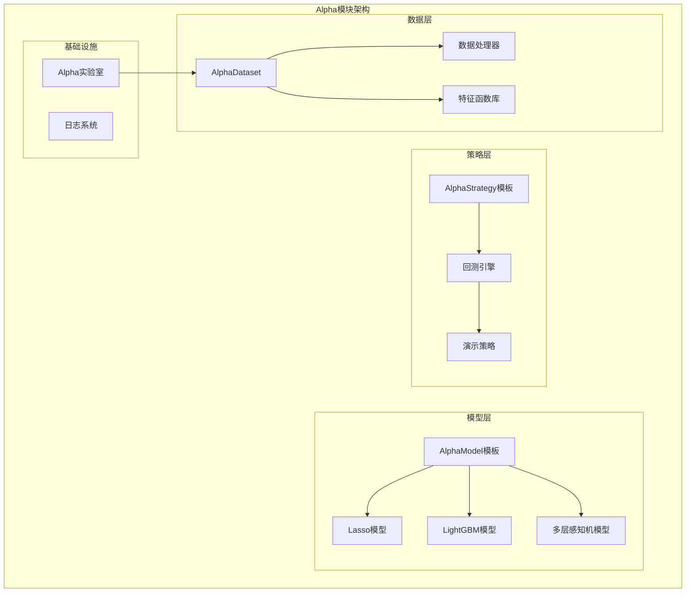
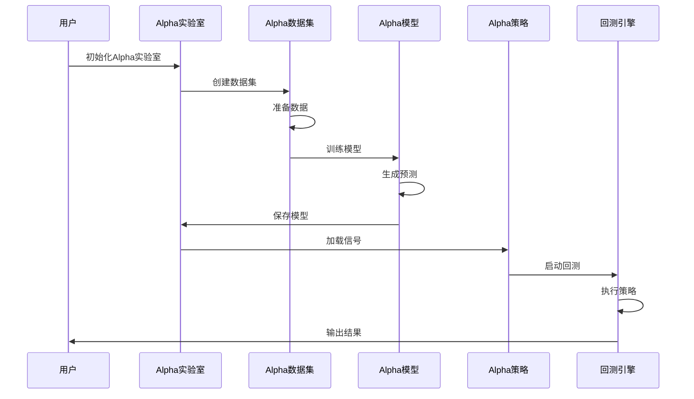
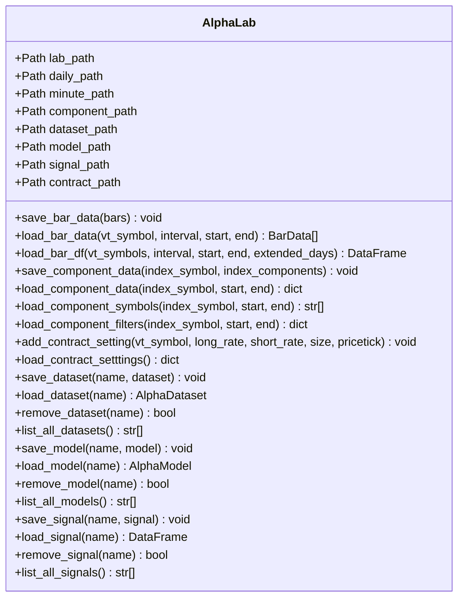
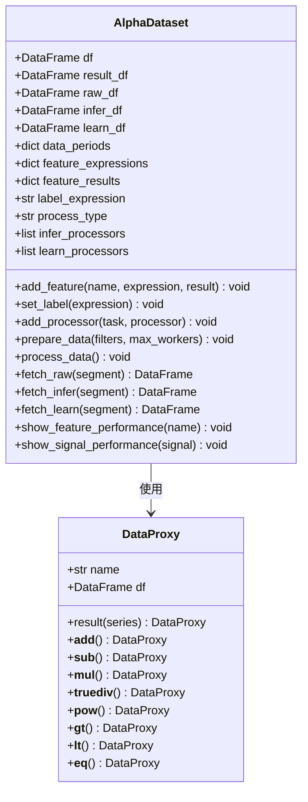
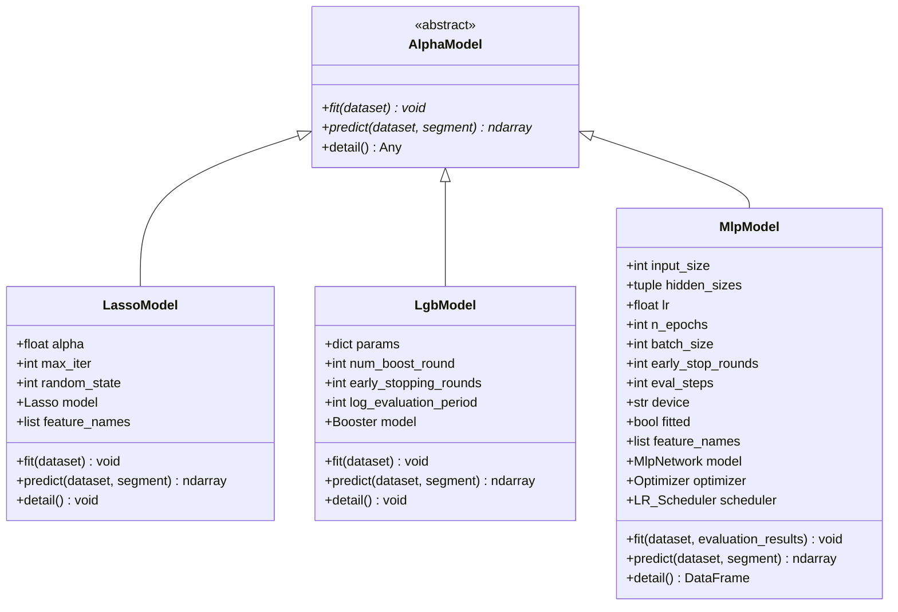
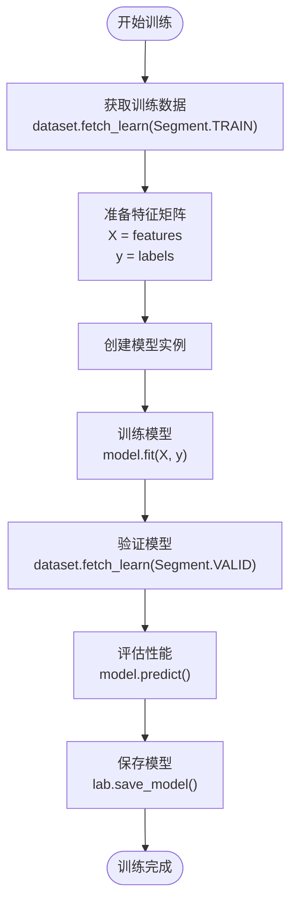
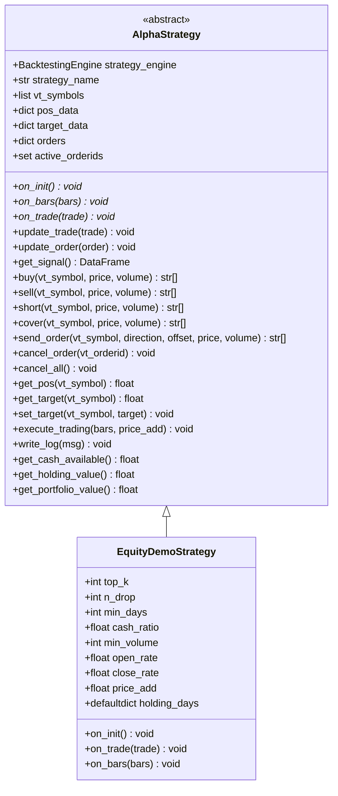
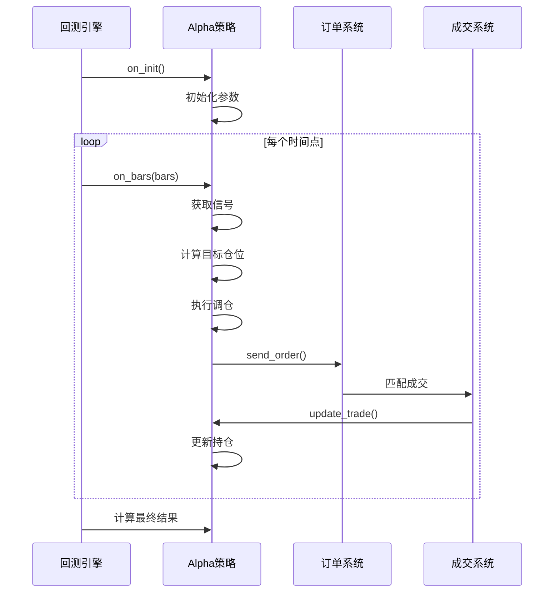
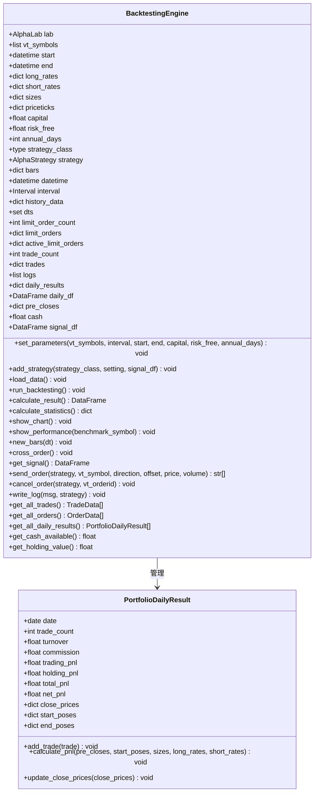
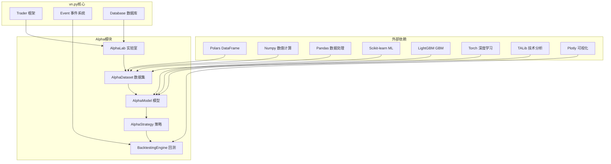

# Alpha模块API

<cite>
**本文档引用的文件**
- [vnpy/alpha/__init__.py](file://vnpy/alpha/__init__.py)
- [vnpy/alpha/lab.py](file://vnpy/alpha/lab.py)
- [vnpy/alpha/logger.py](file://vnpy/alpha/logger.py)
- [vnpy/alpha/dataset/template.py](file://vnpy/alpha/dataset/template.py)
- [vnpy/alpha/dataset/utility.py](file://vnpy/alpha/dataset/utility.py)
- [vnpy/alpha/dataset/cs_function.py](file://vnpy/alpha/dataset/cs_function.py)
- [vnpy/alpha/dataset/math_function.py](file://vnpy/alpha/dataset/math_function.py)
- [vnpy/alpha/dataset/ta_function.py](file://vnpy/alpha/dataset/ta_function.py)
- [vnpy/alpha/dataset/ts_function.py](file://vnpy/alpha/dataset/ts_function.py)
- [vnpy/alpha/dataset/processor.py](file://vnpy/alpha/dataset/processor.py)
- [vnpy/alpha/model/template.py](file://vnpy/alpha/model/template.py)
- [vnpy/alpha/model/models/lasso_model.py](file://vnpy/alpha/model/models/lasso_model.py)
- [vnpy/alpha/model/models/lgb_model.py](file://vnpy/alpha/model/models/lgb_model.py)
- [vnpy/alpha/model/models/mlp_model.py](file://vnpy/alpha/model/models/mlp_model.py)
- [vnpy/alpha/strategy/template.py](file://vnpy/alpha/strategy/template.py)
- [vnpy/alpha/strategy/backtesting.py](file://vnpy/alpha/strategy/backtesting.py)
- [vnpy/alpha/strategy/strategies/equity_demo_strategy.py](file://vnpy/alpha/strategy/strategies/equity_demo_strategy.py)
</cite>

## 目录
1. [简介](#简介)
2. [项目结构](#项目结构)
3. [核心组件](#核心组件)
4. [架构概览](#架构概览)
5. [详细组件分析](#详细组件分析)
6. [依赖关系分析](#依赖关系分析)
7. [性能考虑](#性能考虑)
8. [故障排除指南](#故障排除指南)
9. [结论](#结论)
10. [附录](#附录)

## 简介
Alpha模块是vn.py框架中的机器学习研究与交易系统，提供了一套完整的量化研究工作流，包括数据处理、特征工程、模型训练、信号生成和策略回测等功能。该模块采用模块化设计，支持多种机器学习算法和策略实现，为量化研究人员和交易员提供了灵活而强大的工具集。

## 项目结构
Alpha模块采用分层架构设计，主要包含以下核心层次：



**图表来源**
- [vnpy/alpha/__init__.py](file://vnpy/alpha/__init__.py#L1-L19)
- [vnpy/alpha/lab.py](file://vnpy/alpha/lab.py#L20-L50)
- [vnpy/alpha/dataset/template.py](file://vnpy/alpha/dataset/template.py#L23-L57)
- [vnpy/alpha/model/template.py](file://vnpy/alpha/model/template.py#L9-L31)

**章节来源**
- [vnpy/alpha/__init__.py](file://vnpy/alpha/__init__.py#L1-L19)

## 核心组件
Alpha模块的核心组件包括Alpha实验室、Alpha数据集、Alpha模型、Alpha策略和回测引擎。每个组件都提供了丰富的API接口和扩展能力。

### Alpha实验室 (AlphaLab)
Alpha实验室作为整个模块的基础设施，负责数据存储、管理和访问。它提供了统一的数据接口，支持多种数据格式和存储方式。

**主要功能特性：**
- 多时间级别数据管理（日线、分钟线）
- 持久化存储机制（Parquet、Pickle、Shelve）
- 合约配置管理
- 数据集和模型的生命周期管理

### Alpha数据集 (AlphaDataset)
Alpha数据集是特征工程的核心组件，提供了完整的数据处理流水线。它支持表达式驱动的特征计算、多进程并行处理和灵活的数据过滤机制。

**核心API接口：**
- `add_feature()`: 添加特征表达式或结果
- `set_label()`: 设置标签表达式
- `add_processor()`: 注册数据处理器
- `prepare_data()`: 生成数据
- `process_data()`: 处理数据
- `fetch_*()`: 获取不同阶段的数据

### Alpha模型 (AlphaModel)
Alpha模型模板定义了机器学习算法的标准接口，支持多种主流算法的实现。所有具体模型都必须实现fit和predict方法。

**支持的模型类型：**
- Lasso回归模型
- LightGBM集成模型  
- 多层感知机神经网络模型

### Alpha策略 (AlphaStrategy)
Alpha策略模板提供了策略开发的基础框架，包含了订单管理、仓位控制、资金管理和回测支持等核心功能。

**关键功能：**
- 订单发送和取消
- 仓位目标管理
- 资金和持仓查询
- 回测引擎集成

## 架构概览
Alpha模块采用分层架构设计，各层之间职责清晰，耦合度低，便于扩展和维护。



**图表来源**
- [vnpy/alpha/lab.py](file://vnpy/alpha/lab.py#L389-L481)
- [vnpy/alpha/dataset/template.py](file://vnpy/alpha/dataset/template.py#L90-L194)
- [vnpy/alpha/model/template.py](file://vnpy/alpha/model/template.py#L12-L24)
- [vnpy/alpha/strategy/backtesting.py](file://vnpy/alpha/strategy/backtesting.py#L150-L169)

## 详细组件分析

### Alpha实验室 (AlphaLab) API详解

Alpha实验室提供了完整的数据管理接口，支持多种数据操作模式：



**图表来源**
- [vnpy/alpha/lab.py](file://vnpy/alpha/lab.py#L20-L481)

**核心数据操作API：**

1. **数据保存接口**
   - `save_bar_data()`: 保存K线数据，自动去重和排序
   - `save_dataset()`: 保存Alpha数据集
   - `save_model()`: 保存训练好的模型
   - `save_signal()`: 保存信号数据

2. **数据加载接口**
   - `load_bar_data()`: 加载指定时间段的K线数据
   - `load_bar_df()`: 加载DataFrame格式的批量数据
   - `load_dataset()`: 加载Alpha数据集
   - `load_model()`: 加载机器学习模型
   - `load_signal()`: 加载信号数据

3. **索引成分管理**
   - `save_component_data()`: 保存指数成分数据
   - `load_component_data()`: 加载指数成分历史
   - `load_component_symbols()`: 获取成分股票列表
   - `load_component_filters()`: 生成成分过滤器

**章节来源**
- [vnpy/alpha/lab.py](file://vnpy/alpha/lab.py#L51-L481)

### Alpha数据集 (AlphaDataset) API详解

Alpha数据集提供了完整的特征工程流水线，支持表达式驱动的特征计算和多进程并行处理。



**图表来源**
- [vnpy/alpha/dataset/template.py](file://vnpy/alpha/dataset/template.py#L23-L306)
- [vnpy/alpha/dataset/utility.py](file://vnpy/alpha/dataset/utility.py#L19-L201)

**特征表达式系统：**

Alpha数据集采用表达式驱动的方式构建特征，支持多种运算符和函数：

1. **数学运算符**
   - 基本运算：+, -, *, /, //, %
   - 幂运算：**
   - 比较运算：>, <, >=, <=, ==, !=
   - 绝对值：abs()

2. **时间序列函数 (ts_*)**
   - 移位：ts_delay(window)
   - 滚动统计：ts_min, ts_max, ts_mean, ts_std
   - 排序和排名：ts_rank, ts_argmax, ts_argmin
   - 回归分析：ts_slope, ts_rsquare, ts_resi
   - 相关性：ts_corr, ts_cov
   - 其他：ts_log, ts_abs, ts_delta, ts_decay_linear, ts_product

3. **横截面函数 (cs_*)**
   - 排名：cs_rank
   - 统计：cs_mean, cs_std, cs_sum
   - 规模化：cs_scale

4. **技术分析函数 (ta_*)**
   - RSI指标：ta_rsi(window)
   - ATR指标：ta_atr(high, low, close, window)

**章节来源**
- [vnpy/alpha/dataset/template.py](file://vnpy/alpha/dataset/template.py#L58-L272)
- [vnpy/alpha/dataset/utility.py](file://vnpy/alpha/dataset/utility.py#L203-L265)

### Alpha模型 (AlphaModel) API详解

Alpha模型模板定义了机器学习算法的标准接口，确保不同模型的一致性和互换性。



**图表来源**
- [vnpy/alpha/model/template.py](file://vnpy/alpha/model/template.py#L9-L31)
- [vnpy/alpha/model/models/lasso_model.py](file://vnpy/alpha/model/models/lasso_model.py#L13-L140)
- [vnpy/alpha/model/models/lgb_model.py](file://vnpy/alpha/model/models/lgb_model.py#L12-L171)
- [vnpy/alpha/model/models/mlp_model.py](file://vnpy/alpha/model/models/mlp_model.py#L22-L684)

**模型训练流程：**



**图表来源**
- [vnpy/alpha/model/models/lasso_model.py](file://vnpy/alpha/model/models/lasso_model.py#L40-L74)
- [vnpy/alpha/model/models/lgb_model.py](file://vnpy/alpha/model/models/lgb_model.py#L84-L112)

**章节来源**
- [vnpy/alpha/model/template.py](file://vnpy/alpha/model/template.py#L12-L31)
- [vnpy/alpha/model/models/lasso_model.py](file://vnpy/alpha/model/models/lasso_model.py#L40-L140)
- [vnpy/alpha/model/models/lgb_model.py](file://vnpy/alpha/model/models/lgb_model.py#L84-L171)
- [vnpy/alpha/model/models/mlp_model.py](file://vnpy/alpha/model/models/mlp_model.py#L137-L410)

### Alpha策略 (AlphaStrategy) API详解

Alpha策略模板提供了策略开发的完整框架，支持复杂的交易逻辑和风险管理。



**图表来源**
- [vnpy/alpha/strategy/template.py](file://vnpy/alpha/strategy/template.py#L15-L206)
- [vnpy/alpha/strategy/strategies/equity_demo_strategy.py](file://vnpy/alpha/strategy/strategies/equity_demo_strategy.py#L12-L102)

**策略执行流程：**



**图表来源**
- [vnpy/alpha/strategy/backtesting.py](file://vnpy/alpha/strategy/backtesting.py#L150-L169)
- [vnpy/alpha/strategy/template.py](file://vnpy/alpha/strategy/template.py#L133-L186)

**章节来源**
- [vnpy/alpha/strategy/template.py](file://vnpy/alpha/strategy/template.py#L43-L206)
- [vnpy/alpha/strategy/strategies/equity_demo_strategy.py](file://vnpy/alpha/strategy/strategies/equity_demo_strategy.py#L25-L102)

### 回测引擎 (BacktestingEngine) API详解

回测引擎提供了完整的策略回测功能，支持多品种、多时间周期的自动化回测。



**图表来源**
- [vnpy/alpha/strategy/backtesting.py](file://vnpy/alpha/strategy/backtesting.py#L22-L798)

**回测统计指标：**

回测引擎计算多种关键统计指标来评估策略表现：

1. **基础指标**
   - 总交易日数、盈利交易日、亏损交易日
   - 起始资金、结束资金、总收益率
   - 年化收益、日均收益率、收益标准差

2. **风险指标**
   - 最大回撤、百分比最大回撤
   - 最长回撤天数、收益回撤比
   - Sharpe比率

3. **交易指标**
   - 总手续费、总成交金额、总成交笔数
   - 日均手续费、日均成交金额、日均成交笔数

**章节来源**
- [vnpy/alpha/strategy/backtesting.py](file://vnpy/alpha/strategy/backtesting.py#L170-L402)

## 依赖关系分析

Alpha模块的依赖关系清晰明确，各组件之间的耦合度低，便于独立开发和测试。



**图表来源**
- [vnpy/alpha/dataset/template.py](file://vnpy/alpha/dataset/template.py#L8-L14)
- [vnpy/alpha/model/models/lasso_model.py](file://vnpy/alpha/model/models/lasso_model.py#L1-L11)
- [vnpy/alpha/model/models/lgb_model.py](file://vnpy/alpha/model/models/lgb_model.py#L1-L10)
- [vnpy/alpha/model/models/mlp_model.py](file://vnpy/alpha/model/models/mlp_model.py#L1-L19)

**依赖特点：**
- **数据处理**：主要依赖Polars进行高性能数据操作
- **机器学习**：支持多种算法库，提供灵活性
- **可视化**：使用Plotly进行交互式图表展示
- **技术分析**：集成TALib提供专业的技术指标

**章节来源**
- [vnpy/alpha/dataset/template.py](file://vnpy/alpha/dataset/template.py#L1-L20)
- [vnpy/alpha/model/models/lasso_model.py](file://vnpy/alpha/model/models/lasso_model.py#L1-L11)
- [vnpy/alpha/model/models/lgb_model.py](file://vnpy/alpha/model/models/lgb_model.py#L1-L10)
- [vnpy/alpha/model/models/mlp_model.py](file://vnpy/alpha/model/models/mlp_model.py#L1-L19)

## 性能考虑

Alpha模块在设计时充分考虑了性能优化，采用了多种技术和策略来提升运行效率：

### 数据处理性能优化

1. **并行计算**
   - Alpha数据集使用多进程池并行计算特征表达式
   - 支持自定义进程数配置
   - 进程间通信采用队列和管道

2. **内存管理**
   - 使用Polars进行内存高效的DataFrame操作
   - 支持延迟计算和惰性求值
   - 自动垃圾回收和内存清理

3. **数据缓存**
   - LRU缓存机制用于频繁访问的数据
   - 文件系统缓存减少重复读取
   - 内存映射文件支持大文件处理

### 机器学习性能优化

1. **模型训练优化**
   - Lasso模型使用坐标下降算法
   - LightGBM使用梯度提升框架
   - MLP模型支持GPU加速

2. **特征工程优化**
   - 向量化操作避免Python循环
   - 缓存中间结果减少重复计算
   - 批量处理提高吞吐量

### 回测性能优化

1. **数据加载优化**
   - 分批加载历史数据
   - 内存映射文件支持大数据集
   - 预加载机制减少I/O等待

2. **订单匹配优化**
   - 优先队列管理待成交订单
   - 批量订单处理减少遍历开销
   - 价格限制检查提前过滤

## 故障排除指南

### 常见问题及解决方案

**1. 数据加载失败**
- 检查文件路径和权限
- 验证数据格式兼容性
- 确认时间范围的有效性

**2. 特征计算错误**
- 检查表达式语法正确性
- 验证数据类型兼容性
- 确认函数参数范围

**3. 模型训练异常**
- 检查特征矩阵维度
- 验证标签数据质量
- 调整超参数设置

**4. 回测结果异常**
- 核对交易成本设置
- 检查滑点和冲击成本
- 验证市场数据完整性

### 调试技巧

1. **日志分析**
   - 启用详细日志输出
   - 分析关键节点耗时
   - 监控内存使用情况

2. **性能分析**
   - 使用性能分析工具
   - 识别瓶颈环节
   - 优化热点代码

3. **数据验证**
   - 检查数据完整性
   - 验证数据分布
   - 确认时间序列连续性

**章节来源**
- [vnpy/alpha/logger.py](file://vnpy/alpha/logger.py#L1-L13)
- [vnpy/alpha/lab.py](file://vnpy/alpha/lab.py#L64-L65)
- [vnpy/alpha/dataset/template.py](file://vnpy/alpha/dataset/template.py#L104-L105)

## 结论

Alpha模块为量化研究和交易系统提供了完整而强大的工具集。通过模块化的架构设计和丰富的API接口，用户可以快速构建从数据处理到策略回测的完整工作流程。

**主要优势：**
- **模块化设计**：清晰的职责分离和低耦合度
- **高性能实现**：基于Polars和多进程的高效数据处理
- **灵活扩展**：支持自定义特征函数和机器学习模型
- **完整生态**：从数据到回测的全栈解决方案

**适用场景：**
- 量化研究员的因子挖掘和模型开发
- 交易员的策略测试和优化
- 金融机构的风险管理和投资组合构建

随着量化金融领域的不断发展，Alpha模块将继续演进，为用户提供更加先进和实用的功能。

## 附录

### API使用示例

以下是一个完整的机器学习工作流程示例：

```python
# 1. 初始化Alpha实验室
lab = AlphaLab("path/to/lab")

# 2. 加载历史数据
bars = lab.load_bar_data("AAPL", "daily", "20200101", "20231231")

# 3. 创建Alpha数据集
dataset = AlphaDataset(df, ("20200101", "20221231"), ("20230101", "20230630"), ("20230701", "20231231"))

# 4. 定义特征表达式
dataset.add_feature("alpha_101", "ts_delay(close, 1) / close - 1")
dataset.add_feature("alpha_158", "ts_rank(ts_mean(volume, 5), 10)")

# 5. 设置标签
dataset.set_label("ts_delay(return, -1)")

# 6. 准备数据
dataset.prepare_data()

# 7. 训练模型
model = LgbModel()
model.fit(dataset)

# 8. 生成信号
signal = model.predict(dataset, Segment.TEST)

# 9. 回测策略
engine = BacktestingEngine(lab)
engine.set_parameters(["AAPL"], "daily", "20230701", "20231231", 1000000)
engine.add_strategy(EquityDemoStrategy, {}, signal)
engine.load_data()
engine.run_backtesting()
```

### 配置选项参考

**Alpha实验室配置：**
- `lab_path`: 实验室根目录路径
- `daily_path`: 日线数据存储路径
- `minute_path`: 分钟线数据存储路径
- `component_path`: 指数成分数据存储路径

**数据集配置：**
- `process_type`: 数据处理类型（"append"等）
- `max_workers`: 并行计算进程数
- `data_periods`: 数据时间段划分

**模型配置：**
- `alpha`: Lasso正则化参数
- `num_leaves`: LightGBM叶子节点数
- `hidden_sizes`: MLP隐藏层大小
- `batch_size`: 训练批次大小

**策略配置：**
- `top_k`: 持仓股票数量上限
- `cash_ratio`: 现金利用率
- `price_add`: 订单价格调整比例
- `min_volume`: 最小交易单位