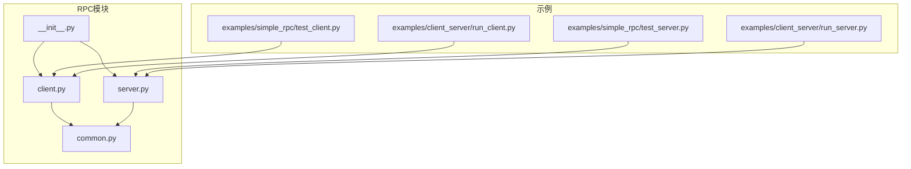
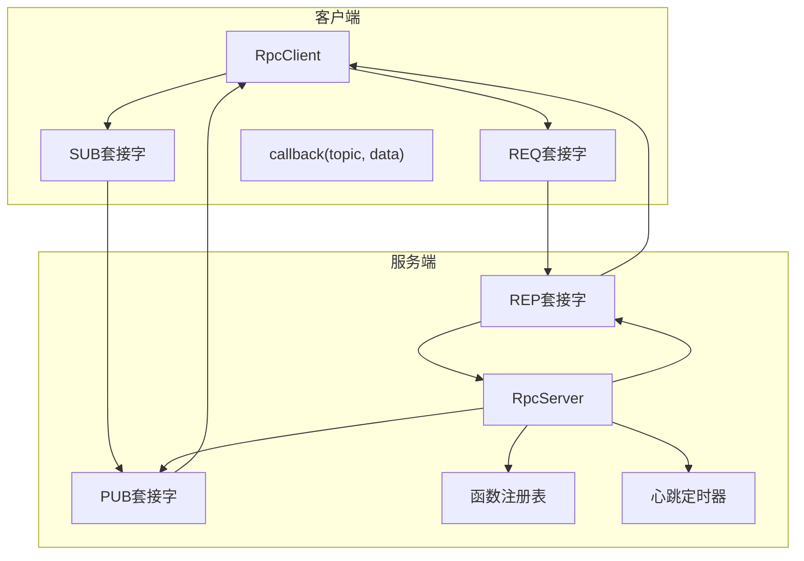
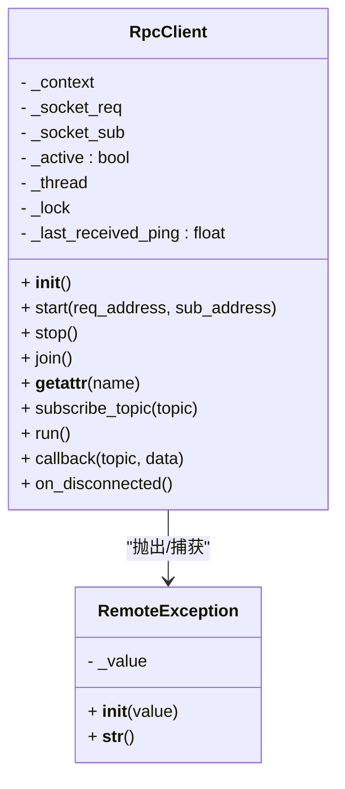
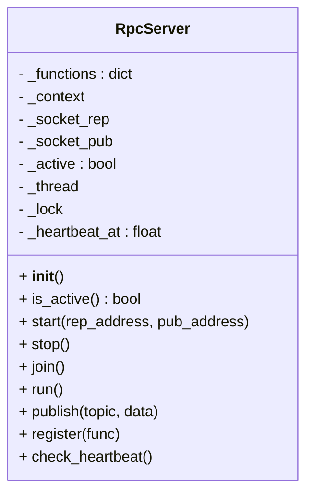
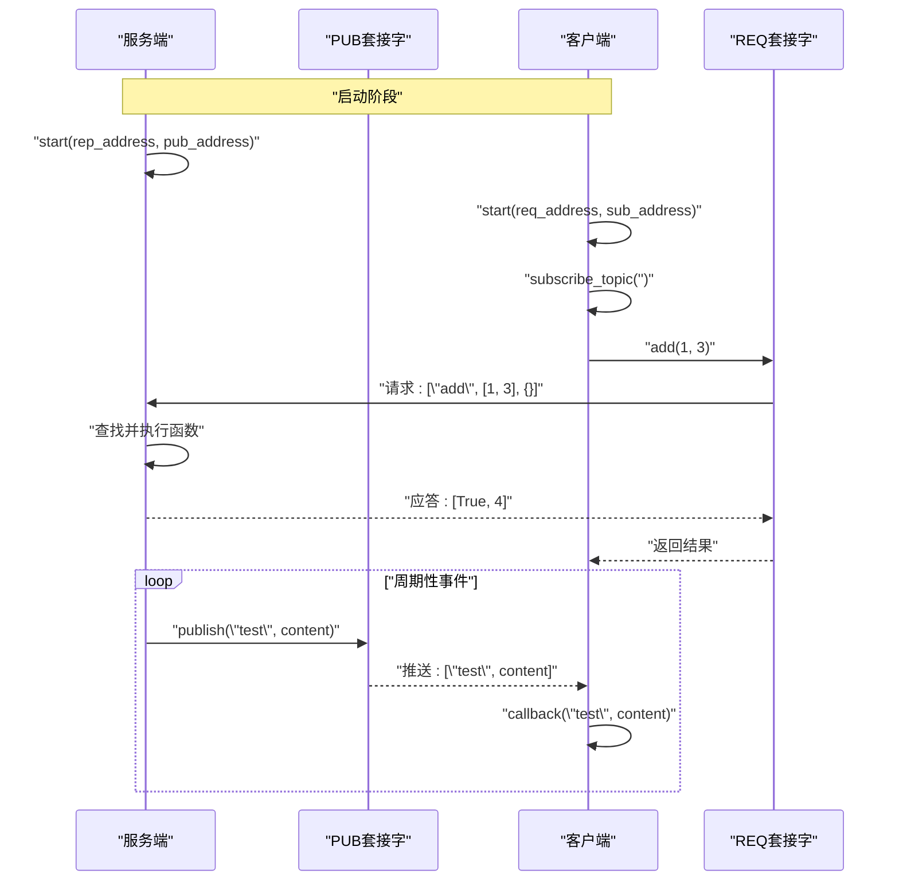
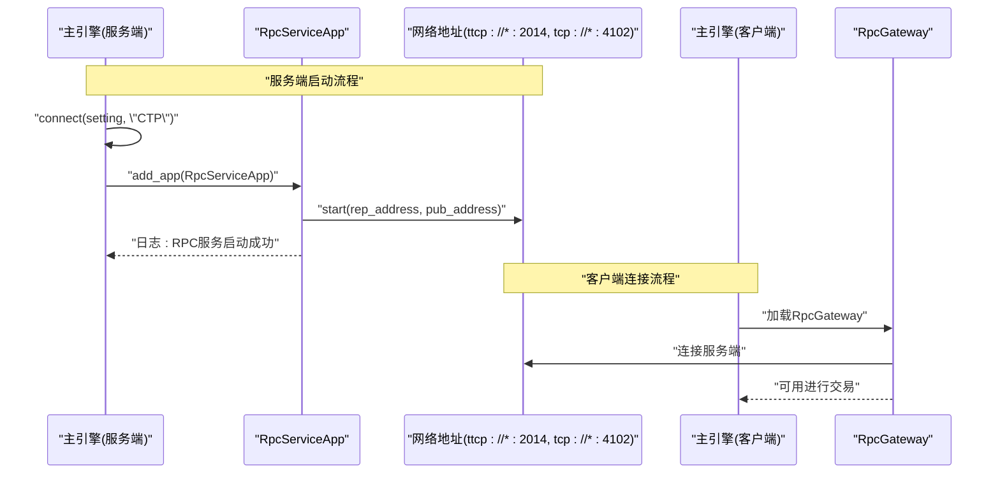
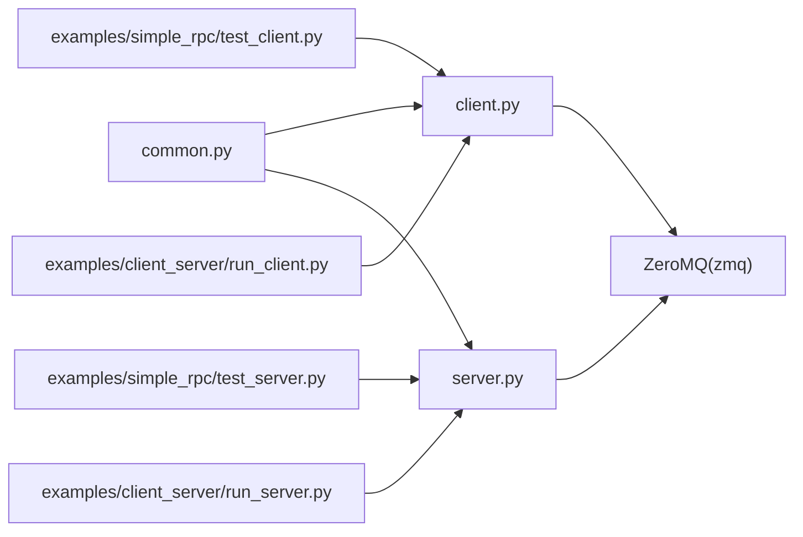

# RPC通信API

<cite>
**本文引用的文件列表**
- [vnpy/rpc/__init__.py](file://vnpy/rpc/__init__.py)
- [vnpy/rpc/client.py](file://vnpy/rpc/client.py)
- [vnpy/rpc/server.py](file://vnpy/rpc/server.py)
- [vnpy/rpc/common.py](file://vnpy/rpc/common.py)
- [examples/simple_rpc/test_server.py](file://examples/simple_rpc/test_server.py)
- [examples/simple_rpc/test_client.py](file://examples/simple_rpc/test_client.py)
- [examples/client_server/run_server.py](file://examples/client_server/run_server.py)
- [examples/client_server/run_client.py](file://examples/client_server/run_client.py)
- [docs/community/app/rpc_service.md](file://docs/community/app/rpc_service.md)
</cite>

## 目录
1. [简介](#简介)
2. [项目结构](#项目结构)
3. [核心组件](#核心组件)
4. [架构总览](#架构总览)
5. [详细组件分析](#详细组件分析)
6. [依赖关系分析](#依赖关系分析)
7. [性能考量](#性能考量)
8. [故障排查指南](#故障排查指南)
9. [结论](#结论)
10. [附录](#附录)

## 简介
本文件为vnpy项目中的RPC分布式通信模块提供详细的API文档，覆盖RPC服务器与客户端的公共接口、服务注册、远程调用、连接管理、消息格式与协议规范、错误处理、分布式部署示例及最佳实践。读者可据此快速理解并集成RPC能力，实现跨进程或跨网络的远程过程调用与事件推送。

## 项目结构
RPC模块位于vnpy/rpc目录，包含以下核心文件：
- __init__.py：导出RpcClient与RpcServer类
- client.py：客户端实现，负责远程调用、订阅事件、心跳检测与断线回调
- server.py：服务端实现，负责函数注册、请求处理、发布事件与心跳
- common.py：通用常量（心跳主题、心跳间隔、容忍度）

示例位于examples/simple_rpc与examples/client_server，演示了最小化RPC示例与基于vnpy_rpcservice的完整服务端/客户端集成。

图表来源
- [vnpy/rpc/__init__.py](file://vnpy/rpc/__init__.py#L1-L9)
- [vnpy/rpc/client.py](file://vnpy/rpc/client.py#L1-L170)
- [vnpy/rpc/server.py](file://vnpy/rpc/server.py#L1-L141)
- [vnpy/rpc/common.py](file://vnpy/rpc/common.py#L1-L11)
- [examples/simple_rpc/test_server.py](file://examples/simple_rpc/test_server.py#L1-L39)
- [examples/simple_rpc/test_client.py](file://examples/simple_rpc/test_client.py#L1-L35)
- [examples/client_server/run_server.py](file://examples/client_server/run_server.py#L1-L74)
- [examples/client_server/run_client.py](file://examples/client_server/run_client.py#L1-L28)

章节来源
- [vnpy/rpc/__init__.py](file://vnpy/rpc/__init__.py#L1-L9)
- [vnpy/rpc/client.py](file://vnpy/rpc/client.py#L1-L170)
- [vnpy/rpc/server.py](file://vnpy/rpc/server.py#L1-L141)
- [vnpy/rpc/common.py](file://vnpy/rpc/common.py#L1-L11)
- [examples/simple_rpc/test_server.py](file://examples/simple_rpc/test_server.py#L1-L39)
- [examples/simple_rpc/test_client.py](file://examples/simple_rpc/test_client.py#L1-L35)
- [examples/client_server/run_server.py](file://examples/client_server/run_server.py#L1-L74)
- [examples/client_server/run_client.py](file://examples/client_server/run_client.py#L1-L28)

## 核心组件
- RpcClient：客户端，提供远程调用、订阅事件、心跳检测、断线回调等能力
- RpcServer：服务端，提供函数注册、请求处理、事件发布、心跳机制等能力
- 公共常量：心跳主题、心跳间隔、容忍度

章节来源
- [vnpy/rpc/__init__.py](file://vnpy/rpc/__init__.py#L1-L9)
- [vnpy/rpc/client.py](file://vnpy/rpc/client.py#L29-L170)
- [vnpy/rpc/server.py](file://vnpy/rpc/server.py#L11-L141)
- [vnpy/rpc/common.py](file://vnpy/rpc/common.py#L8-L11)

## 架构总览
RPC采用ZeroMQ实现双通道通信：
- 请求-应答通道（REQ/REP）：用于客户端发起远程调用，服务端执行并返回结果
- 发布-订阅通道（PUB/SUB）：用于服务端向客户端推送事件或心跳

图表来源
- [vnpy/rpc/client.py](file://vnpy/rpc/client.py#L32-L170)
- [vnpy/rpc/server.py](file://vnpy/rpc/server.py#L14-L141)
- [vnpy/rpc/common.py](file://vnpy/rpc/common.py#L8-L11)

## 详细组件分析

### RpcClient 客户端API
- 类型：RpcClient
- 主要职责：远程调用、订阅事件、心跳检测、断线回调、生命周期管理

关键方法与行为
- __init__：初始化ZMQ上下文、REQ与SUB套接字，设置TCP保活参数，准备工作线程与状态标志
- start(req_address, sub_address)：建立与服务端的连接，启动工作线程，开始接收事件
- stop()/join()：停止客户端并等待线程退出
- __getattr__(name)：动态生成远程调用函数，支持超时控制（毫秒）
- subscribe_topic(topic)：订阅指定主题
- run()：工作线程循环，轮询SUB套接字，处理心跳与业务事件
- callback(topic, data)：抽象方法，子类需实现以处理推送事件
- on_disconnected()：心跳超时触发的断线回调，默认打印提示信息

异常类型
- RemoteException：封装远端异常，构造时保存原始值，字符串化时输出原始值

消息格式
- 请求格式：[函数名, 参数元组, 关键字参数字典]
- 应答格式：[是否成功, 返回值或异常栈文本]
- 推送格式：[主题, 数据]

超时与并发
- 远程调用通过poll设置超时，避免阻塞
- 使用锁保护REQ套接字发送，确保线程安全

章节来源
- [vnpy/rpc/client.py](file://vnpy/rpc/client.py#L29-L170)
- [vnpy/rpc/common.py](file://vnpy/rpc/common.py#L8-L11)

#### 类图

图表来源
- [vnpy/rpc/client.py](file://vnpy/rpc/client.py#L11-L170)

### RpcServer 服务端API
- 类型：RpcServer
- 主要职责：函数注册、请求处理、事件发布、心跳机制、生命周期管理

关键方法与行为
- __init__：初始化ZMQ上下文、REP与PUB套接字，准备工作线程与状态标志
- start(rep_address, pub_address)：绑定地址，启动工作线程与心跳定时器
- stop()/join()：停止服务端并等待线程退出
- run()：工作线程循环，轮询REP套接字，执行注册函数并返回结果
- register(func)：将函数注册到函数表
- publish(topic, data)：发布事件到订阅者
- check_heartbeat()：按间隔发布心跳

消息格式
- 请求/应答与推送格式同客户端

线程模型
- 单线程事件循环，使用poll避免忙等
- 发布操作加锁保证线程安全

章节来源
- [vnpy/rpc/server.py](file://vnpy/rpc/server.py#L11-L141)
- [vnpy/rpc/common.py](file://vnpy/rpc/common.py#L8-L11)

#### 类图

图表来源
- [vnpy/rpc/server.py](file://vnpy/rpc/server.py#L11-L141)

### 消息格式与协议规范
- ZeroMQ传输层：采用REQ/REP与PUB/SUB模式
- 地址格式：tcp://host:port 或 ipc://path（仅限Linux）
- 请求格式：[函数名, 参数元组, 关键字参数字典]
- 应答格式：[是否成功, 返回值或异常栈文本]
- 推送格式：[主题, 数据]
- 心跳主题：固定主题名，按心跳间隔周期发布

章节来源
- [vnpy/rpc/common.py](file://vnpy/rpc/common.py#L8-L11)
- [docs/community/app/rpc_service.md](file://docs/community/app/rpc_service.md#L44-L73)

### 错误处理
- RemoteException：客户端侧封装远端异常，便于上层捕获与处理
- 服务端异常：捕获并返回异常栈文本，避免崩溃
- 心跳超时：客户端在超过容忍时间未收到心跳时触发断线回调

章节来源
- [vnpy/rpc/client.py](file://vnpy/rpc/client.py#L11-L27)
- [vnpy/rpc/server.py](file://vnpy/rpc/server.py#L106-L107)
- [vnpy/rpc/client.py](file://vnpy/rpc/client.py#L164-L170)

### 分布式部署示例

#### 最小化示例（简单RPC）
- 服务端：启动RpcServer，注册测试函数，周期性发布自定义主题事件
- 客户端：继承RpcClient，实现callback，订阅空主题（全部主题），发起远程调用

图表来源
- [examples/simple_rpc/test_server.py](file://examples/simple_rpc/test_server.py#L27-L39)
- [examples/simple_rpc/test_client.py](file://examples/simple_rpc/test_client.py#L24-L35)
- [vnpy/rpc/server.py](file://vnpy/rpc/server.py#L116-L121)
- [vnpy/rpc/client.py](file://vnpy/rpc/client.py#L152-L156)

章节来源
- [examples/simple_rpc/test_server.py](file://examples/simple_rpc/test_server.py#L1-L39)
- [examples/simple_rpc/test_client.py](file://examples/simple_rpc/test_client.py#L1-L35)

#### 基于vnpy_rpcservice的完整示例
- 服务端：在主引擎中加载RpcServiceApp，连接交易接口后启动RPC服务，发布交易相关事件
- 客户端：加载RpcGateway，连接服务端后进行交易与策略交互

图表来源
- [examples/client_server/run_server.py](file://examples/client_server/run_server.py#L37-L66)
- [examples/client_server/run_client.py](file://examples/client_server/run_client.py#L9-L24)
- [docs/community/app/rpc_service.md](file://docs/community/app/rpc_service.md#L15-L96)

章节来源
- [examples/client_server/run_server.py](file://examples/client_server/run_server.py#L1-L74)
- [examples/client_server/run_client.py](file://examples/client_server/run_client.py#L1-L28)
- [docs/community/app/rpc_service.md](file://docs/community/app/rpc_service.md#L1-L111)

## 依赖关系分析
- 模块内依赖：client.py与server.py均依赖common.py的心跳常量
- 外部依赖：ZeroMQ（zmq）库，用于网络通信
- 示例依赖：simple_rpc示例直接使用RpcClient/RpcServer；client_server示例使用vnpy_rpcservice提供的RpcServiceApp与RpcGateway

图表来源
- [vnpy/rpc/common.py](file://vnpy/rpc/common.py#L1-L11)
- [vnpy/rpc/client.py](file://vnpy/rpc/client.py#L1-L10)
- [vnpy/rpc/server.py](file://vnpy/rpc/server.py#L1-L10)
- [examples/simple_rpc/test_server.py](file://examples/simple_rpc/test_server.py#L1-L4)
- [examples/simple_rpc/test_client.py](file://examples/simple_rpc/test_client.py#L1-L4)
- [examples/client_server/run_server.py](file://examples/client_server/run_server.py#L1-L11)
- [examples/client_server/run_client.py](file://examples/client_server/run_client.py#L1-L6)

章节来源
- [vnpy/rpc/common.py](file://vnpy/rpc/common.py#L1-L11)
- [vnpy/rpc/client.py](file://vnpy/rpc/client.py#L1-L10)
- [vnpy/rpc/server.py](file://vnpy/rpc/server.py#L1-L10)
- [examples/simple_rpc/test_server.py](file://examples/simple_rpc/test_server.py#L1-L4)
- [examples/simple_rpc/test_client.py](file://examples/simple_rpc/test_client.py#L1-L4)
- [examples/client_server/run_server.py](file://examples/client_server/run_server.py#L1-L11)
- [examples/client_server/run_client.py](file://examples/client_server/run_client.py#L1-L6)

## 性能考量
- 轮询与阻塞：服务端使用poll避免忙等；客户端订阅轮询配合心跳容忍度平衡实时性与CPU占用
- 超时控制：远程调用支持毫秒级超时，防止长时间阻塞
- 并发安全：发布与请求发送使用锁保护，避免竞态
- 心跳机制：服务端按固定间隔发布心跳，客户端根据容忍度判断断线
- 传输层选择：TCP适用于跨主机与跨平台；IPC在Linux下可降低延迟但仅限本机

章节来源
- [vnpy/rpc/server.py](file://vnpy/rpc/server.py#L88-L93)
- [vnpy/rpc/client.py](file://vnpy/rpc/client.py#L132-L137)
- [vnpy/rpc/client.py](file://vnpy/rpc/client.py#L62-L76)
- [docs/community/app/rpc_service.md](file://docs/community/app/rpc_service.md#L62-L73)

## 故障排查指南
- 连接失败
  - 检查地址格式与端口是否正确（tcp://或ipc://）
  - 确认防火墙与网络连通性
- 超时异常
  - 调整远程调用超时参数（毫秒）
  - 检查服务端是否繁忙或阻塞
- 断线与心跳丢失
  - 客户端触发on_disconnected回调，检查网络稳定性与服务端心跳定时器
- 异常传播
  - 服务端异常会返回异常栈文本，客户端捕获RemoteException查看详细信息

章节来源
- [vnpy/rpc/client.py](file://vnpy/rpc/client.py#L72-L76)
- [vnpy/rpc/server.py](file://vnpy/rpc/server.py#L106-L107)
- [vnpy/rpc/client.py](file://vnpy/rpc/client.py#L164-L170)

## 结论
vnpy的RPC模块以简洁的API与稳定的ZeroMQ实现，提供了可靠的远程调用与事件推送能力。通过函数注册、请求-应答与发布-订阅双通道、心跳与断线处理，满足跨进程与跨网络的分布式通信需求。结合示例与最佳实践，可在实际项目中快速落地。

## 附录

### API速查表

- RpcClient
  - 构造：无参
  - start(req_address, sub_address)：启动并连接
  - stop()/join()：停止与等待
  - subscribe_topic(topic)：订阅主题
  - callback(topic, data)：处理推送事件（需子类实现）
  - on_disconnected()：断线回调（默认打印提示）
  - __getattr__(name)：动态生成远程调用函数（支持timeout参数）

- RpcServer
  - 构造：无参
  - start(rep_address, pub_address)：启动并绑定
  - stop()/join()：停止与等待
  - register(func)：注册可远程调用函数
  - publish(topic, data)：发布事件
  - check_heartbeat()：心跳检查与发布
  - is_active()：查询运行状态

- 常量（来自common.py）
  - HEARTBEAT_TOPIC：心跳主题名
  - HEARTBEAT_INTERVAL：心跳间隔（秒）
  - HEARTBEAT_TOLERANCE：心跳容忍时间（秒）

章节来源
- [vnpy/rpc/client.py](file://vnpy/rpc/client.py#L29-L170)
- [vnpy/rpc/server.py](file://vnpy/rpc/server.py#L11-L141)
- [vnpy/rpc/common.py](file://vnpy/rpc/common.py#L8-L11)