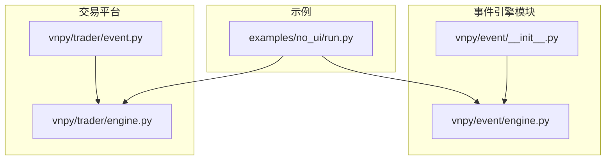
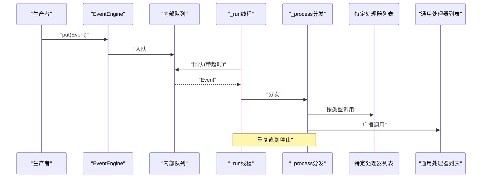
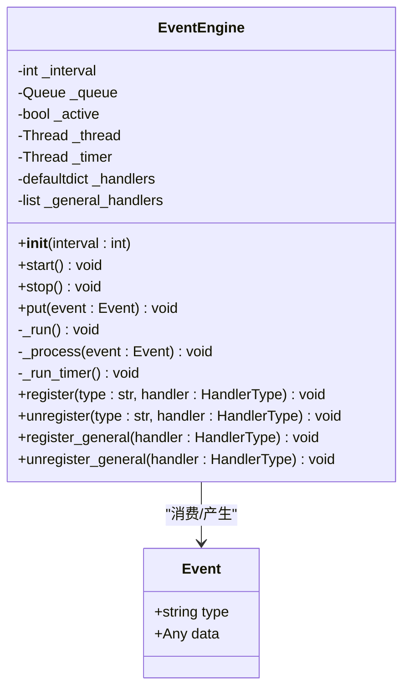
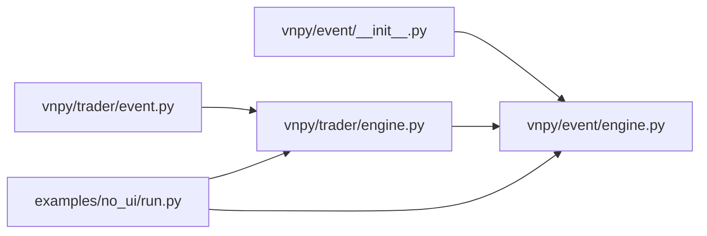

# 事件引擎API

<cite>
**本文引用的文件**
- [vnpy/event/engine.py](file://vnpy/event/engine.py)
- [vnpy/event/__init__.py](file://vnpy/event/__init__.py)
- [vnpy/trader/event.py](file://vnpy/trader/event.py)
- [vnpy/trader/engine.py](file://vnpy/trader/engine.py)
- [examples/no_ui/run.py](file://examples/no_ui/run.py)
</cite>

## 目录
1. [简介](#简介)
2. [项目结构](#项目结构)
3. [核心组件](#核心组件)
4. [架构总览](#架构总览)
5. [详细组件分析](#详细组件分析)
6. [依赖关系分析](#依赖关系分析)
7. [性能考量](#性能考量)
8. [故障排查指南](#故障排查指南)
9. [结论](#结论)
10. [附录：完整使用示例与最佳实践](#附录完整使用示例与最佳实践)

## 简介
本文件为事件引擎模块的详细API文档，覆盖EventEngine类与Event类的公共方法与属性、事件类型常量、处理器类型定义、线程安全机制、生命周期管理、性能与最佳实践，并提供可直接定位到源码位置的使用示例路径。

## 项目结构
事件引擎位于vnpy/event目录，对外通过vnpy/event/__init__.py导出Event、EventEngine、EVENT_TIMER；交易平台在vnpy/trader/event.py中定义了常用事件类型常量；在vnpy/trader/engine.py中，MainEngine默认持有并启动EventEngine；示例工程examples/no_ui/run.py展示了在实际业务中如何注册事件处理器与发送事件。

图表来源
- [vnpy/event/engine.py](file://vnpy/event/engine.py#L1-L146)
- [vnpy/event/__init__.py](file://vnpy/event/__init__.py#L1-L9)
- [vnpy/trader/event.py](file://vnpy/trader/event.py#L1-L15)
- [vnpy/trader/engine.py](file://vnpy/trader/engine.py#L81-L93)
- [examples/no_ui/run.py](file://examples/no_ui/run.py#L62-L70)

章节来源
- [vnpy/event/engine.py](file://vnpy/event/engine.py#L1-L146)
- [vnpy/event/__init__.py](file://vnpy/event/__init__.py#L1-L9)
- [vnpy/trader/event.py](file://vnpy/trader/event.py#L1-L15)
- [vnpy/trader/engine.py](file://vnpy/trader/engine.py#L81-L93)
- [examples/no_ui/run.py](file://examples/no_ui/run.py#L62-L70)

## 核心组件
- Event：事件载体，包含type（事件类型字符串）与data（任意数据对象）
- EventEngine：事件分发引擎，负责事件队列、定时器、处理器注册/注销、线程调度与生命周期控制
- EVENT_TIMER：内置定时器事件类型常量
- HandlerType：处理器函数类型别名，签名形如Callable[[Event], None]

章节来源
- [vnpy/event/engine.py](file://vnpy/event/engine.py#L16-L31)
- [vnpy/event/engine.py](file://vnpy/event/engine.py#L33-L146)
- [vnpy/event/engine.py](file://vnpy/event/engine.py#L13-L13)
- [vnpy/event/engine.py](file://vnpy/event/engine.py#L29-L30)

## 架构总览
事件引擎采用“生产者-消费者”模型：外部通过EventEngine.put将Event放入内部队列；后台线程从队列取出事件并调用分发逻辑；分发时先按事件类型匹配特定处理器列表，再广播给“通用处理器”。同时，另一个后台线程按固定间隔生成定时事件EVENT_TIMER，供周期性任务使用。

图表来源
- [vnpy/event/engine.py](file://vnpy/event/engine.py#L55-L88)
- [vnpy/event/engine.py](file://vnpy/event/engine.py#L105-L109)
- [vnpy/event/engine.py](file://vnpy/event/engine.py#L66-L78)

## 详细组件分析

### Event 类
- 字段
  - type: str，事件类型标识
  - data: Any，事件载荷
- 构造函数
  - 参数：type: str，data: Any = None
- 用途
  - 作为事件载体在系统内传递

章节来源
- [vnpy/event/engine.py](file://vnpy/event/engine.py#L16-L27)

### EventEngine 类
- 字段
  - _interval: int，定时器间隔（秒）
  - _queue: Queue，事件队列
  - _active: bool，引擎运行标志
  - _thread: Thread，事件处理线程
  - _timer: Thread，定时器线程
  - _handlers: defaultdict[str, list]，事件类型到处理器列表映射
  - _general_handlers: list，通用处理器列表
- 构造函数
  - 参数：interval: int = 1
  - 初始化队列、线程、映射表，不自动启动
- 生命周期方法
  - start(): 启动引擎，启动两个后台线程
  - stop(): 停止引擎，等待定时器与处理线程结束
- 事件分发与队列
  - put(event: Event): 将事件入队
  - _run(): 后台线程循环，从队列取事件并调用_process
  - _process(event: Event): 先按类型分发至对应处理器，再广播至通用处理器
- 定时器
  - _run_timer(): 按_interval睡眠后生成EVENT_TIMER事件并入队
  - EVENT_TIMER: 内置常量，用于周期性任务
- 处理器注册/注销
  - register(type: str, handler: HandlerType): 为指定类型注册处理器（去重）
  - unregister(type: str, handler: HandlerType): 从指定类型移除处理器，若列表为空则删除该类型键
  - register_general(handler: HandlerType): 注册通用处理器（去重）
  - unregister_general(handler: HandlerType): 移除通用处理器
- 线程安全
  - 使用Queue保证入队/出队线程安全
  - 处理器列表在注册/注销时进行存在性检查与去重，避免重复注册
  - 停止流程中join等待线程结束，确保资源释放

图表来源
- [vnpy/event/engine.py](file://vnpy/event/engine.py#L16-L31)
- [vnpy/event/engine.py](file://vnpy/event/engine.py#L33-L146)

章节来源
- [vnpy/event/engine.py](file://vnpy/event/engine.py#L33-L146)

### 事件类型常量
- EVENT_TIMER: 定时器事件类型
- 在交易平台中，还定义了如EVENT_TICK、EVENT_TRADE、EVENT_ORDER、EVENT_POSITION、EVENT_ACCOUNT、EVENT_QUOTE、EVENT_CONTRACT、EVENT_LOG等事件类型常量，便于在各引擎间统一使用

章节来源
- [vnpy/event/engine.py](file://vnpy/event/engine.py#L13-L13)
- [vnpy/trader/event.py](file://vnpy/trader/event.py#L7-L14)

### 处理器类型定义
- HandlerType = Callable[[Event], None]，即接收Event并返回None的函数类型别名

章节来源
- [vnpy/event/engine.py](file://vnpy/event/engine.py#L29-L30)

### 线程安全机制
- 队列访问：通过Queue的线程安全入队/出队保证事件在多线程下的正确传递
- 注册/注销：在注册/注销时检查处理器是否已在列表中，避免重复注册
- 停止流程：stop中先置_active为False，再join两个后台线程，确保有序停止

章节来源
- [vnpy/event/engine.py](file://vnpy/event/engine.py#L55-L103)

## 依赖关系分析
- 导出入口：vnpy/event/__init__.py导出Event、EventEngine、EVENT_TIMER
- 交易平台集成：vnpy/trader/engine.py的MainEngine默认创建并启动EventEngine；写日志时构造EVENT_LOG事件并通过EventEngine.put发送
- 事件类型：vnpy/trader/event.py提供常用事件类型常量
- 示例使用：examples/no_ui/run.py演示了在业务中注册事件处理器与发送事件的基本流程

图表来源
- [vnpy/event/__init__.py](file://vnpy/event/__init__.py#L1-L9)
- [vnpy/event/engine.py](file://vnpy/event/engine.py#L1-L146)
- [vnpy/trader/event.py](file://vnpy/trader/event.py#L1-L15)
- [vnpy/trader/engine.py](file://vnpy/trader/engine.py#L81-L93)
- [examples/no_ui/run.py](file://examples/no_ui/run.py#L62-L70)

章节来源
- [vnpy/event/__init__.py](file://vnpy/event/__init__.py#L1-L9)
- [vnpy/trader/engine.py](file://vnpy/trader/engine.py#L81-L93)
- [examples/no_ui/run.py](file://examples/no_ui/run.py#L62-L70)

## 性能考量
- 队列阻塞与超时：事件出队设置超时，避免线程长期阻塞，提高响应性
- 分发顺序：先按类型分发，再广播通用处理器，减少不必要的调用
- 定时器粒度：interval越小，定时事件越密集，CPU占用越高；应根据实际需求调整
- 处理器数量：通用处理器与特定处理器列表都会被逐一调用，建议控制数量并保持处理器轻量
- 数据结构：defaultdict与list在注册/注销时进行存在性检查，避免重复注册带来的额外开销

章节来源
- [vnpy/event/engine.py](file://vnpy/event/engine.py#L55-L88)
- [vnpy/event/engine.py](file://vnpy/event/engine.py#L111-L131)

## 故障排查指南
- 事件未到达
  - 检查是否已调用start()启动引擎
  - 检查是否正确注册了对应类型的处理器
  - 检查是否将事件通过put()入队
- 处理器重复注册
  - register/unregister与register_general/unregister_general均包含去重逻辑，确认未误用相同函数引用
- 停止后仍残留线程
  - 确保调用stop()并等待线程join完成
- 定时器无效
  - 检查interval参数与是否正确生成EVENT_TIMER事件

章节来源
- [vnpy/event/engine.py](file://vnpy/event/engine.py#L89-L103)
- [vnpy/event/engine.py](file://vnpy/event/engine.py#L111-L145)

## 结论
事件引擎提供了简洁高效的事件分发能力，结合定时器支持周期性任务；通过统一的事件类型常量与线程安全设计，可在复杂交易系统中实现松耦合、高扩展的模块通信。遵循本文的最佳实践与排障建议，可获得稳定且高性能的事件处理体验。

## 附录：完整使用示例与最佳实践

### 基本使用步骤
- 创建事件引擎并启动
  - 参考路径：[创建与启动引擎](file://vnpy/trader/engine.py#L86-L92)
- 注册事件处理器
  - 示例：注册日志事件处理器
  - 参考路径：[注册处理器示例](file://examples/no_ui/run.py#L69-L70)
- 发送事件
  - 示例：写日志时构造EVENT_LOG事件并入队
  - 参考路径：[发送事件示例](file://vnpy/trader/engine.py#L172-L174)
- 停止引擎
  - 参考路径：[停止引擎示例](file://examples/no_ui/run.py#L93-L94)

### 最佳实践
- 在应用启动阶段统一创建并启动EventEngine，避免中途反复启停
- 将处理器函数设计为无副作用、快速返回，避免阻塞事件线程
- 对高频事件类型，尽量减少通用处理器数量，优先使用特定类型处理器
- 合理设置interval，平衡定时任务频率与系统负载
- 使用统一的事件类型常量，避免字符串拼写错误

章节来源
- [vnpy/trader/engine.py](file://vnpy/trader/engine.py#L86-L92)
- [examples/no_ui/run.py](file://examples/no_ui/run.py#L69-L70)
- [vnpy/trader/engine.py](file://vnpy/trader/engine.py#L172-L174)
- [examples/no_ui/run.py](file://examples/no_ui/run.py#L93-L94)