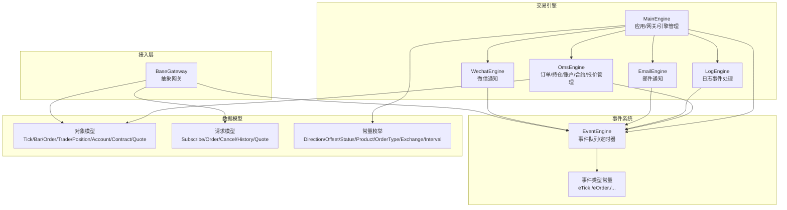
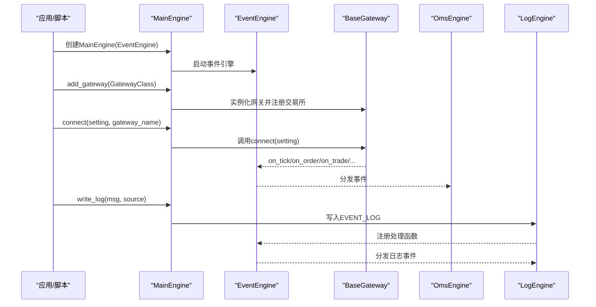
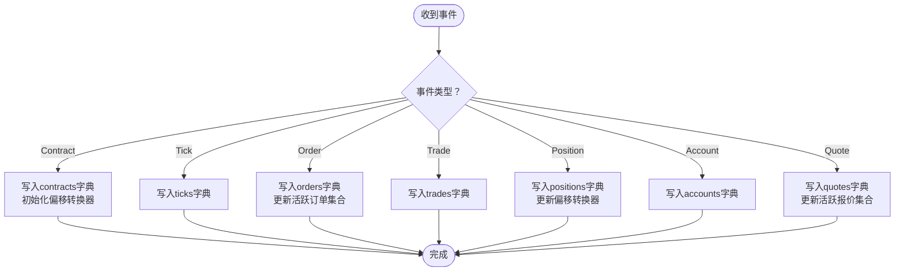
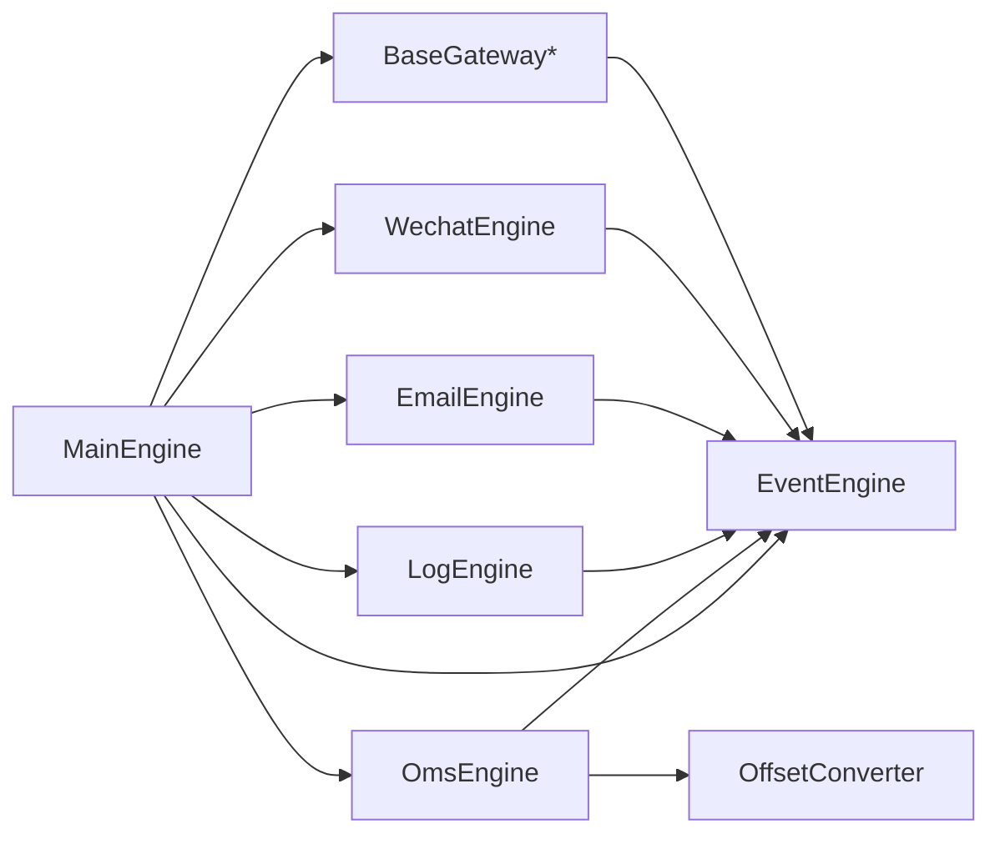

# 交易引擎API

<cite>
**本文引用的文件**
- [vnpy/trader/engine.py](file://vnpy/trader/engine.py)
- [vnpy/event/engine.py](file://vnpy/event/engine.py)
- [vnpy/trader/object.py](file://vnpy/trader/object.py)
- [vnpy/trader/gateway.py](file://vnpy/trader/gateway.py)
- [vnpy/trader/converter.py](file://vnpy/trader/converter.py)
- [vnpy/trader/setting.py](file://vnpy/trader/setting.py)
- [vnpy/trader/logger.py](file://vnpy/trader/logger.py)
- [vnpy/trader/event.py](file://vnpy/trader/event.py)
- [vnpy/trader/app.py](file://vnpy/trader/app.py)
- [vnpy/trader/constant.py](file://vnpy/trader/constant.py)
- [examples/no_ui/run.py](file://examples/no_ui/run.py)
- [examples/veighna_trader/run.py](file://examples/veighna_trader/run.py)
</cite>

## 目录
1. [简介](#简介)
2. [项目结构](#项目结构)
3. [核心组件](#核心组件)
4. [架构总览](#架构总览)
5. [详细组件分析](#详细组件分析)
6. [依赖关系分析](#依赖关系分析)
7. [性能考虑](#性能考虑)
8. [故障排查指南](#故障排查指南)
9. [结论](#结论)
10. [附录](#附录)

## 简介
本文件为交易引擎模块的完整API文档，聚焦于MainEngine类及其子引擎（如OmsEngine、LogEngine、EmailEngine、WechatEngine）的公共接口与职责，涵盖应用管理、网关管理、数据订阅、事件分发、通知推送、日志记录、配置管理等能力，并提供启动、停止、配置加载与持久化的流程说明及使用示例路径。

## 项目结构
交易引擎位于vnpy/trader目录下，围绕事件驱动框架构建，核心由MainEngine协调多个功能引擎（如日志、订单管理、邮件、微信），并通过BaseGateway对接不同交易接口。事件系统由独立的vnpy.event提供，统一承载tick、order、trade、position、account、contract、quote、log等事件类型。

**图示来源**
- [vnpy/trader/engine.py](file://vnpy/trader/engine.py#L81-L324)
- [vnpy/event/engine.py](file://vnpy/event/engine.py#L33-L146)
- [vnpy/trader/object.py](file://vnpy/trader/object.py#L17-L428)
- [vnpy/trader/gateway.py](file://vnpy/trader/gateway.py#L33-L273)
- [vnpy/trader/event.py](file://vnpy/trader/event.py#L7-L15)
- [vnpy/trader/constant.py](file://vnpy/trader/constant.py#L10-L161)

**章节来源**
- [vnpy/trader/engine.py](file://vnpy/trader/engine.py#L81-L324)
- [vnpy/event/engine.py](file://vnpy/event/engine.py#L33-L146)
- [vnpy/trader/object.py](file://vnpy/trader/object.py#L17-L428)
- [vnpy/trader/gateway.py](file://vnpy/trader/gateway.py#L33-L273)
- [vnpy/trader/event.py](file://vnpy/trader/event.py#L7-L15)
- [vnpy/trader/constant.py](file://vnpy/trader/constant.py#L10-L161)

## 核心组件
- MainEngine：平台核心，负责事件引擎初始化、网关/引擎/应用的注册与生命周期管理、对外API入口（连接、订阅、下单、撤单、查询历史、日志、通知等）。
- OmsEngine：订单管理子系统，维护市场数据、订单、成交、持仓、账户、合约、报价的内存缓存与活跃状态集合，并提供查询与转换接口。
- LogEngine：日志事件处理器，将EVENT_LOG事件输出到控制台与文件。
- EmailEngine：异步邮件发送引擎，基于SMTP发送邮件。
- WechatEngine：异步微信推送引擎，支持凭据绑定、消息队列与限速控制。
- BaseGateway：抽象网关，定义连接、订阅、下单、撤单、查询等接口，并通过事件引擎向平台推送数据事件。
- EventEngine：事件驱动内核，提供事件入队、分发、通用处理器注册、定时器事件生成。
- 数据与请求模型：TickData、BarData、OrderData、TradeData、PositionData、AccountData、ContractData、QuoteData；SubscribeRequest、OrderRequest、CancelRequest、HistoryRequest、QuoteRequest。
- 常量与枚举：Direction、Offset、Status、Product、OrderType、Exchange、Interval等。

**章节来源**
- [vnpy/trader/engine.py](file://vnpy/trader/engine.py#L59-L324)
- [vnpy/event/engine.py](file://vnpy/event/engine.py#L33-L146)
- [vnpy/trader/object.py](file://vnpy/trader/object.py#L17-L428)
- [vnpy/trader/gateway.py](file://vnpy/trader/gateway.py#L33-L273)
- [vnpy/trader/constant.py](file://vnpy/trader/constant.py#L10-L161)

## 架构总览
MainEngine在初始化时启动EventEngine，注册并实例化各类引擎（日志、订单、邮件、微信）。应用通过add_app注册，自动创建对应引擎类并挂载到MainEngine。网关通过add_gateway注册，连接后由网关回调事件写入EventEngine，再由各引擎订阅相应事件类型进行数据更新与业务处理。

**图示来源**
- [vnpy/trader/engine.py](file://vnpy/trader/engine.py#L86-L101)
- [vnpy/trader/engine.py](file://vnpy/trader/engine.py#L102-L126)
- [vnpy/trader/engine.py](file://vnpy/trader/engine.py#L234-L243)
- [vnpy/trader/gateway.py](file://vnpy/trader/gateway.py#L86-L158)
- [vnpy/event/engine.py](file://vnpy/event/engine.py#L89-L103)
- [vnpy/trader/engine.py](file://vnpy/trader/engine.py#L346-L357)

**章节来源**
- [vnpy/trader/engine.py](file://vnpy/trader/engine.py#L86-L101)
- [vnpy/trader/engine.py](file://vnpy/trader/engine.py#L102-L126)
- [vnpy/trader/engine.py](file://vnpy/trader/engine.py#L234-L243)
- [vnpy/trader/gateway.py](file://vnpy/trader/gateway.py#L86-L158)
- [vnpy/event/engine.py](file://vnpy/event/engine.py#L89-L103)

## 详细组件分析

### MainEngine API
- 初始化与生命周期
  - __init__(event_engine=None)：启动EventEngine，设置工作目录，初始化引擎（日志、订单、邮件、微信）。
  - close()：停止EventEngine，依次调用各引擎与网关的close方法。
- 应用管理
  - add_app(app_class)：注册应用，返回其引擎实例。
  - get_all_apps()：返回所有应用对象列表。
- 网关管理
  - add_gateway(gateway_class, gateway_name="")：注册网关，自动扩展支持的交易所列表。
  - get_gateway(gateway_name)：按名称获取网关。
  - get_all_gateway_names()：返回所有网关名称。
  - get_default_setting(gateway_name)：获取网关默认配置字典。
  - get_all_exchanges()：返回所有交易所集合。
- 事件与日志
  - write_log(msg, source="MainEngine")：封装LogData并派发EVENT_LOG。
  - send_notification(content, subject=None)：通过邮件与微信通道推送通知。
- 网关交互
  - connect(setting, gateway_name)：启动指定网关连接。
  - subscribe(req, gateway_name)：订阅行情。
  - send_order(req, gateway_name)：发送委托。
  - cancel_order(req, gateway_name)：撤单。
  - send_quote(req, gateway_name)：发送报价。
  - cancel_quote(req, gateway_name)：撤报价。
  - query_history(req, gateway_name)：查询K线历史。
- 引擎访问
  - get_engine(engine_name)：按名称获取引擎实例。
  - init_engines()：内部初始化日志、订单、邮件、微信引擎，并将OmsEngine的部分查询与转换方法“代理”到MainEngine上，便于直接调用。

典型使用路径参考：
- [examples/no_ui/run.py](file://examples/no_ui/run.py#L62-L78)
- [examples/veighna_trader/run.py](file://examples/veighna_trader/run.py#L44-L77)

**章节来源**
- [vnpy/trader/engine.py](file://vnpy/trader/engine.py#L86-L101)
- [vnpy/trader/engine.py](file://vnpy/trader/engine.py#L128-L136)
- [vnpy/trader/engine.py](file://vnpy/trader/engine.py#L189-L226)
- [vnpy/trader/engine.py](file://vnpy/trader/engine.py#L234-L308)
- [vnpy/trader/engine.py](file://vnpy/trader/engine.py#L310-L324)
- [vnpy/trader/engine.py](file://vnpy/trader/engine.py#L188-L205)
- [vnpy/trader/engine.py](file://vnpy/trader/engine.py#L138-L167)

### OmsEngine API
- 订阅与事件处理
  - register_event()：注册EVENT_TICK、EVENT_ORDER、EVENT_TRADE、EVENT_POSITION、EVENT_ACCOUNT、EVENT_CONTRACT、EVENT_QUOTE事件处理器。
  - process_*_event：将事件数据写入对应内存表（ticks、orders、trades、positions、accounts、contracts、quotes），并维护活跃订单/报价集合。
- 查询接口
  - get_tick/get_order/get_trade/get_position/get_account/get_contract/get_quote/get_all_*：提供按标识或全量查询。
  - get_all_active_orders/get_all_active_quotes：获取活跃订单/报价列表。
- 订单转换与偏移处理
  - update_order_request(req, vt_orderid, gateway_name)：更新偏移转换器中的订单。
  - convert_order_request(req, gateway_name, lock, net)：根据锁仓/净仓/上期所特殊规则拆分订单请求。
  - get_converter(gateway_name)：获取指定网关的偏移转换器。

**图示来源**
- [vnpy/trader/engine.py](file://vnpy/trader/engine.py#L384-L461)
- [vnpy/trader/engine.py](file://vnpy/trader/engine.py#L462-L587)
- [vnpy/trader/converter.py](file://vnpy/trader/converter.py#L310-L403)

**章节来源**
- [vnpy/trader/engine.py](file://vnpy/trader/engine.py#L384-L461)
- [vnpy/trader/engine.py](file://vnpy/trader/engine.py#L462-L587)
- [vnpy/trader/converter.py](file://vnpy/trader/converter.py#L310-L403)

### LogEngine API
- 初始化与注册
  - __init__(main_engine, event_engine)：读取全局日志开关，注册EVENT_LOG处理器。
  - register_log(event_type)：注册日志事件处理回调。
- 处理逻辑
  - process_log_event(event)：过滤禁用级别，将日志写入logger（含gateway_name上下文）。

**章节来源**
- [vnpy/trader/engine.py](file://vnpy/trader/engine.py#L325-L358)
- [vnpy/trader/logger.py](file://vnpy/trader/logger.py#L22-L56)
- [vnpy/trader/setting.py](file://vnpy/trader/setting.py#L15-L18)

### EmailEngine API
- 发送与队列
  - send_email(subject, content, receiver=None)：首次发送时启动后台线程，将邮件消息入队。
  - run()：从队列取出EmailMessage，使用SMTP_SSL发送，异常时写入日志。
  - start()/close()：启动/停止后台线程。
- 配置来源
  - 服务器、端口、用户名、密码、发件人、收件人来自全局设置。

**章节来源**
- [vnpy/trader/engine.py](file://vnpy/trader/engine.py#L590-L655)
- [vnpy/trader/setting.py](file://vnpy/trader/setting.py#L20-L25)

### WechatEngine API
- 绑定与配置
  - load_setting()/save_setting()：从JSON文件读取/保存凭据与用户ID、发送间隔。
  - bind(creds, user_id)/unbind()：绑定/解绑微信凭据并激活/停用。
- 推送与限速
  - send_wechat(msg)：将文本消息入队。
  - run()：消费队列消息，合并待发送列表，按间隔限制发送。
  - start()/stop()：启动/停止后台线程。

**章节来源**
- [vnpy/trader/engine.py](file://vnpy/trader/engine.py#L657-L804)
- [vnpy/trader/setting.py](file://vnpy/trader/setting.py#L11-L38)

### BaseGateway API
- 事件推送
  - on_event/type：封装通用事件推送，如on_tick/on_order/on_trade/on_position/on_account/on_contract/on_quote/on_log。
  - write_log(msg)：便捷写入日志事件。
- 连接与交互
  - connect(setting)/close()：建立/断开连接。
  - subscribe(req)/send_order(req)/cancel_order(req)：订阅/下单/撤单。
  - send_quote(req)/cancel_quote(req)：报价/撤报价（可选实现）。
  - query_account()/query_position()：查询账户/持仓。
  - query_history(req)：查询K线历史（可选实现）。
  - get_default_setting()：返回默认配置字典。

**章节来源**
- [vnpy/trader/gateway.py](file://vnpy/trader/gateway.py#L86-L158)
- [vnpy/trader/gateway.py](file://vnpy/trader/gateway.py#L160-L273)

### 事件系统与数据模型
- 事件类型
  - EVENT_TICK/ORDER/TRADE/POSITION/ACCOUNT/CONTRACT/QUOTE/LOG：事件字符串常量。
- 事件引擎
  - EventEngine：事件队列、分发、通用处理器、定时器事件。
- 数据模型
  - TickData/BarData/OrderData/TradeData/PositionData/AccountData/ContractData/QuoteData。
  - SubscribeRequest/OrderRequest/CancelRequest/HistoryRequest/QuoteRequest。
- 常量枚举
  - Direction/Offset/Status/Product/OrderType/Exchange/Interval。

**章节来源**
- [vnpy/trader/event.py](file://vnpy/trader/event.py#L7-L15)
- [vnpy/event/engine.py](file://vnpy/event/engine.py#L33-L146)
- [vnpy/trader/object.py](file://vnpy/trader/object.py#L17-L428)
- [vnpy/trader/constant.py](file://vnpy/trader/constant.py#L10-L161)

## 依赖关系分析
- MainEngine依赖EventEngine进行事件调度，依赖Gateways进行外部系统接入，依赖Engines提供功能扩展。
- OmsEngine依赖EventEngine接收各类市场与账户事件，依赖OffsetConverter进行偏移转换。
- LogEngine/EmailEngine/WechatEngine均依赖EventEngine进行事件处理与线程安全。
- Gateway通过EventEngine向平台推送标准化数据对象，供各引擎消费。

**图示来源**
- [vnpy/trader/engine.py](file://vnpy/trader/engine.py#L86-L101)
- [vnpy/trader/engine.py](file://vnpy/trader/engine.py#L360-L383)
- [vnpy/trader/converter.py](file://vnpy/trader/converter.py#L310-L318)

**章节来源**
- [vnpy/trader/engine.py](file://vnpy/trader/engine.py#L86-L101)
- [vnpy/trader/engine.py](file://vnpy/trader/engine.py#L360-L383)
- [vnpy/trader/converter.py](file://vnpy/trader/converter.py#L310-L318)

## 性能考虑
- 事件驱动与非阻塞：Gateway与引擎均要求非阻塞实现，避免阻塞事件线程。
- 活跃状态集合：OmsEngine对订单与报价维护活跃集合，减少无效遍历。
- 日志与网络：日志输出与邮件/微信推送采用异步队列与线程，降低主线程压力。
- 配置与IO：日志文件与微信设置通过JSON持久化，避免重复初始化成本。

[本节为通用指导，不直接分析具体文件]

## 故障排查指南
- 网关未找到
  - 现象：get_gateway返回None并写日志。
  - 排查：确认add_gateway是否执行、gateway_name是否一致。
- 引擎未找到
  - 现象：get_engine返回None并写日志。
  - 排查：确认引擎是否在init_engines中注册。
- 连接失败
  - 现象：connect后无事件到达。
  - 排查：检查网关默认设置、用户名/密码、服务器地址；查看网关write_log输出。
- 下单/撤单无效
  - 现象：send_order/cancel_order无响应。
  - 排查：确认网关connect成功、vt_orderid生成、事件回调正常。
- 日志不显示
  - 现象：write_log无输出。
  - 排查：检查SETTINGS["log.active"/"console"/"file"]，确认LogEngine已注册。
- 邮件发送失败
  - 现象：send_email异常日志。
  - 排查：检查SMTP服务器、端口、用户名、密码、发件人/收件人配置。
- 微信推送失败
  - 现象：send_wechat无效果。
  - 排查：检查凭据绑定、用户ID、发送间隔设置。

**章节来源**
- [vnpy/trader/engine.py](file://vnpy/trader/engine.py#L189-L205)
- [vnpy/trader/engine.py](file://vnpy/trader/engine.py#L234-L243)
- [vnpy/trader/engine.py](file://vnpy/trader/engine.py#L590-L655)
- [vnpy/trader/engine.py](file://vnpy/trader/engine.py#L657-L804)
- [vnpy/trader/logger.py](file://vnpy/trader/logger.py#L44-L55)

## 结论
MainEngine以事件驱动为核心，通过统一的网关接口与引擎扩展机制，实现了从行情接入、订单管理到通知推送的完整闭环。开发者可通过add_app/add_gateway灵活扩展功能与接入方式，结合配置管理与日志/邮件/微信通道，快速搭建生产级交易环境。

[本节为总结性内容，不直接分析具体文件]

## 附录

### API清单与职责摘要
- MainEngine
  - 应用管理：add_app、get_all_apps
  - 网关管理：add_gateway、get_gateway、get_all_gateway_names、get_default_setting、get_all_exchanges
  - 事件与日志：write_log、send_notification
  - 网关交互：connect、subscribe、send_order、cancel_order、send_quote、cancel_quote、query_history
  - 引擎访问：get_engine、init_engines
- OmsEngine
  - 事件处理：register_event、process_*_event
  - 查询：get_*、get_all_*、get_all_active_*
  - 转换：update_order_request、convert_order_request、get_converter
- LogEngine
  - 注册：register_log
  - 处理：process_log_event
- EmailEngine
  - 发送：send_email
  - 生命周期：start、close、run
- WechatEngine
  - 绑定：load_setting、save_setting、bind、unbind
  - 推送：send_wechat、start、stop、run
- BaseGateway
  - 事件：on_event、on_tick、on_order、on_trade、on_position、on_account、on_contract、on_quote、on_log、write_log
  - 交互：connect、close、subscribe、send_order、cancel_order、send_quote、cancel_quote、query_account、query_position、query_history、get_default_setting

**章节来源**
- [vnpy/trader/engine.py](file://vnpy/trader/engine.py#L128-L136)
- [vnpy/trader/engine.py](file://vnpy/trader/engine.py#L189-L226)
- [vnpy/trader/engine.py](file://vnpy/trader/engine.py#L234-L308)
- [vnpy/trader/engine.py](file://vnpy/trader/engine.py#L310-L324)
- [vnpy/trader/engine.py](file://vnpy/trader/engine.py#L384-L461)
- [vnpy/trader/engine.py](file://vnpy/trader/engine.py#L462-L587)
- [vnpy/trader/engine.py](file://vnpy/trader/engine.py#L346-L357)
- [vnpy/trader/engine.py](file://vnpy/trader/engine.py#L603-L620)
- [vnpy/trader/engine.py](file://vnpy/trader/engine.py#L776-L782)
- [vnpy/trader/gateway.py](file://vnpy/trader/gateway.py#L86-L158)
- [vnpy/trader/gateway.py](file://vnpy/trader/gateway.py#L160-L273)

### 使用示例路径
- 无UI模式启动与策略运行
  - [examples/no_ui/run.py](file://examples/no_ui/run.py#L62-L95)
- 图形界面模式启动与应用添加
  - [examples/veighna_trader/run.py](file://examples/veighna_trader/run.py#L44-L77)

**章节来源**
- [examples/no_ui/run.py](file://examples/no_ui/run.py#L62-L95)
- [examples/veighna_trader/run.py](file://examples/veighna_trader/run.py#L44-L77)