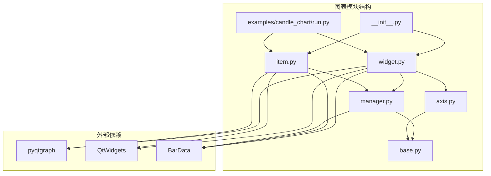
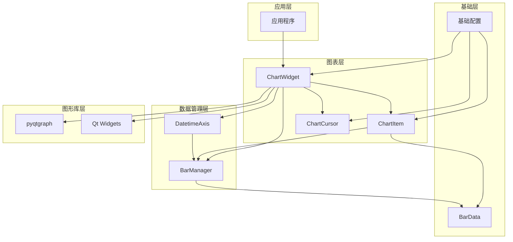
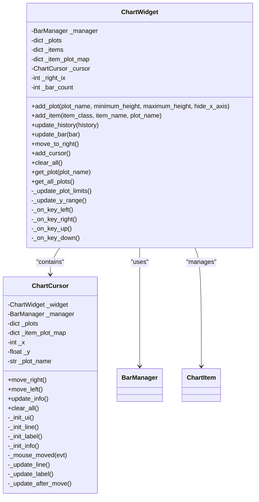
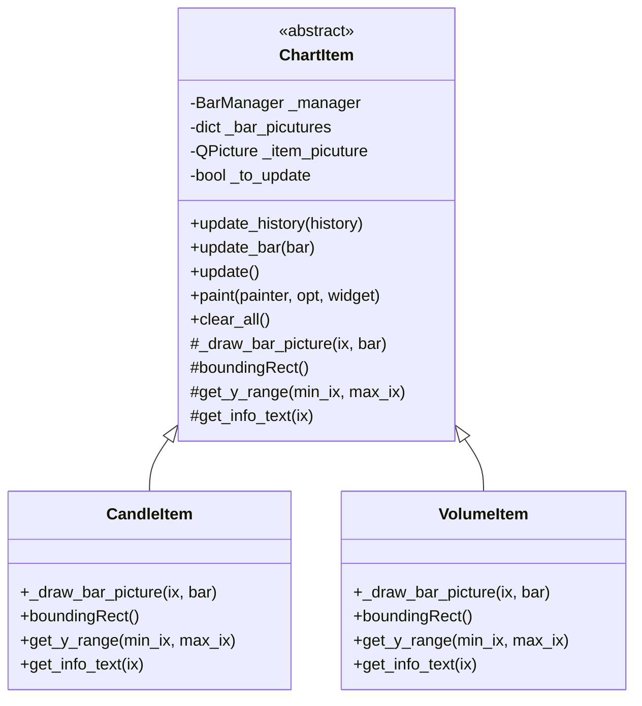
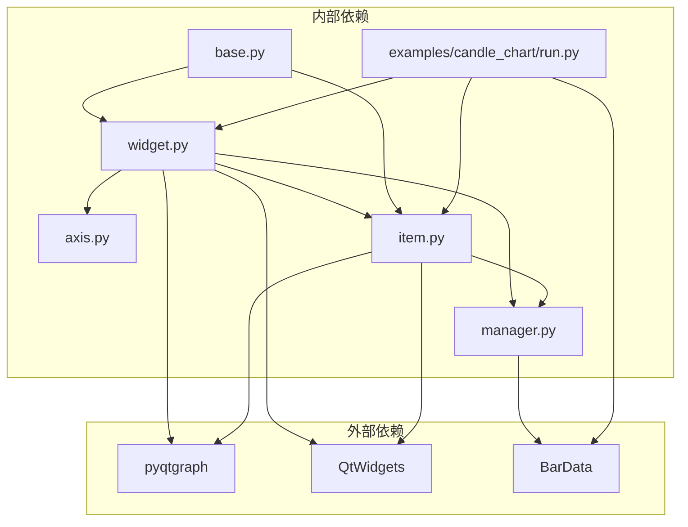

# 图表API

<cite>
**本文档引用的文件**
- [vnpy/chart/__init__.py](file://vnpy/chart/__init__.py)
- [vnpy/chart/widget.py](file://vnpy/chart/widget.py)
- [vnpy/chart/manager.py](file://vnpy/chart/manager.py)
- [vnpy/chart/base.py](file://vnpy/chart/base.py)
- [vnpy/chart/item.py](file://vnpy/chart/item.py)
- [vnpy/chart/axis.py](file://vnpy/chart/axis.py)
- [examples/candle_chart/run.py](file://examples/candle_chart/run.py)
- [vnpy/trader/object.py](file://vnpy/trader/object.py)
</cite>

## 目录
1. [简介](#简介)
2. [项目结构](#项目结构)
3. [核心组件](#核心组件)
4. [架构概览](#架构概览)
5. [详细组件分析](#详细组件分析)
6. [依赖关系分析](#依赖关系分析)
7. [性能考虑](#性能考虑)
8. [故障排除指南](#故障排除指南)
9. [结论](#结论)
10. [附录](#附录)

## 简介

图表可视化模块是vnpy量化交易平台中的核心组件，提供了高性能的金融图表绘制功能。该模块基于pyqtgraph构建，支持实时K线图、成交量图等多种金融图表类型，具备流畅的交互体验和丰富的自定义能力。

本模块主要面向量化交易开发者，提供完整的API文档，涵盖图表组件的所有公共接口，包括ChartWidget、ChartManager、ChartData、Axis等核心类的方法和属性。文档详细说明了图表绘制、数据更新、交互控制等功能的API使用方法，并提供K线图、成交量图等常用图表类型的创建和配置示例。

## 项目结构

图表模块采用清晰的分层架构设计，主要包含以下核心文件：



**图表来源**
- [vnpy/chart/__init__.py](file://vnpy/chart/__init__.py#L1-L10)
- [vnpy/chart/widget.py](file://vnpy/chart/widget.py#L1-L557)
- [vnpy/chart/manager.py](file://vnpy/chart/manager.py#L1-L171)

**章节来源**
- [vnpy/chart/__init__.py](file://vnpy/chart/__init__.py#L1-L10)
- [vnpy/chart/widget.py](file://vnpy/chart/widget.py#L1-L50)

## 核心组件

图表模块包含以下核心组件，每个组件都有明确的职责分工：

### ChartWidget（图表控件）
ChartWidget是整个图表系统的核心控制器，继承自pyqtgraph的PlotWidget，负责管理图表的整体布局、数据流和用户交互。

### ChartItem（图表项基类）
ChartItem是所有具体图表元素的抽象基类，定义了统一的绘图接口和数据更新机制。

### BarManager（数据管理器）
BarManager负责管理历史数据和实时数据，提供高效的数据查询和范围计算功能。

### DatetimeAxis（时间轴）
DatetimeAxis自定义坐标轴，专门用于显示时间序列数据的时间标签。

### ChartCursor（光标控件）
ChartCursor提供交互式光标功能，支持鼠标悬停显示详细信息和键盘导航。

**章节来源**
- [vnpy/chart/widget.py](file://vnpy/chart/widget.py#L20-L557)
- [vnpy/chart/item.py](file://vnpy/chart/item.py#L12-L334)
- [vnpy/chart/manager.py](file://vnpy/chart/manager.py#L9-L171)
- [vnpy/chart/axis.py](file://vnpy/chart/axis.py#L10-L45)

## 架构概览

图表模块采用分层架构设计，各层之间职责清晰，耦合度低：



**图表来源**
- [vnpy/chart/widget.py](file://vnpy/chart/widget.py#L20-L557)
- [vnpy/chart/item.py](file://vnpy/chart/item.py#L12-L334)
- [vnpy/chart/manager.py](file://vnpy/chart/manager.py#L9-L171)
- [vnpy/chart/axis.py](file://vnpy/chart/axis.py#L10-L45)

## 详细组件分析

### ChartWidget 组件分析

ChartWidget是图表系统的核心控制器，负责管理整个图表的生命周期和交互逻辑。

#### 主要属性
- `_manager`: BarManager实例，管理数据
- `_plots`: 图表区域字典
- `_items`: 图表项字典
- `_item_plot_map`: 图表项与图表区域的映射
- `_cursor`: ChartCursor实例，处理交互
- `_right_ix`: 右侧可见数据索引
- `_bar_count`: 当前显示的条目数量

#### 核心方法

##### 构造函数
```python
def __init__(self, parent: QtWidgets.QWidget | None = None) -> None:
```
初始化ChartWidget，设置默认配置和UI布局。

##### 添加图表区域
```python
def add_plot(
    self,
    plot_name: str,
    minimum_height: int = 80,
    maximum_height: int | None = None,
    hide_x_axis: bool = False
) -> None:
```
添加新的图表区域，支持自定义高度和轴显示选项。

##### 添加图表项
```python
def add_item(
    self,
    item_class: type[ChartItem],
    item_name: str,
    plot_name: str
) -> None:
```
添加具体的图表元素到指定的图表区域。

##### 数据更新
```python
def update_history(self, history: list[BarData]) -> None:
def update_bar(self, bar: BarData) -> None:
```
更新历史数据或单个数据点，自动处理视图更新和滚动。

##### 用户交互
```python
def keyPressEvent(self, event: QtGui.QKeyEvent) -> None:
def wheelEvent(self, event: QtGui.QWheelEvent) -> None:
```
处理键盘和鼠标滚轮事件，实现平移和缩放功能。

**章节来源**
- [vnpy/chart/widget.py](file://vnpy/chart/widget.py#L20-L322)

#### ChartWidget 类图



**图表来源**
- [vnpy/chart/widget.py](file://vnpy/chart/widget.py#L20-L557)

### ChartItem 抽象基类分析

ChartItem是所有具体图表元素的抽象基类，定义了统一的绘图接口。

#### 抽象方法
- `_draw_bar_picture(ix, bar)`: 绘制单个数据点的图形
- `boundingRect()`: 返回包围矩形
- `get_y_range(min_ix, max_ix)`: 获取Y轴范围
- `get_info_text(ix)`: 获取光标信息文本

#### 核心功能
- **增量绘制**: 只重绘可见部分，提高性能
- **缓存机制**: 缓存已绘制的图形对象
- **数据绑定**: 通过BarManager获取数据

**章节来源**
- [vnpy/chart/item.py](file://vnpy/chart/item.py#L12-L166)

#### ChartItem 继承关系图



**图表来源**
- [vnpy/chart/item.py](file://vnpy/chart/item.py#L12-L334)

### BarManager 数据管理器分析

BarManager负责管理历史数据和实时数据，提供高效的数据查询和范围计算功能。

#### 主要功能
- **数据存储**: 使用字典存储BarData，支持快速查找
- **索引管理**: 维护时间戳到索引的双向映射
- **范围计算**: 高效计算指定范围内的价格和成交量范围
- **缓存机制**: 缓存计算结果，避免重复计算

#### 关键方法
```python
def update_history(self, history: list[BarData]) -> None:
def update_bar(self, bar: BarData) -> None:
def get_price_range(self, min_ix: float | None = None, max_ix: float | None = None) -> tuple[float, float]:
def get_volume_range(self, min_ix: float | None = None, max_ix: float | None = None) -> tuple[float, float]:
```

**章节来源**
- [vnpy/chart/manager.py](file://vnpy/chart/manager.py#L9-L171)

### DatetimeAxis 时间轴分析

DatetimeAxis自定义坐标轴，专门用于显示时间序列数据的时间标签。

#### 特殊功能
- **智能格式化**: 根据时间粒度选择合适的显示格式
- **性能优化**: 跳过过于密集的标签显示
- **数据绑定**: 通过BarManager获取对应的时间戳

**章节来源**
- [vnpy/chart/axis.py](file://vnpy/chart/axis.py#L10-L45)

## 依赖关系分析

图表模块的依赖关系清晰，遵循单一职责原则：



**图表来源**
- [vnpy/chart/widget.py](file://vnpy/chart/widget.py#L1-L15)
- [vnpy/chart/item.py](file://vnpy/chart/item.py#L1-L10)
- [vnpy/chart/manager.py](file://vnpy/chart/manager.py#L1-L7)

### 外部依赖说明

- **pyqtgraph**: 图形绘制库，提供高性能的2D图形渲染
- **QtWidgets**: Qt图形界面框架，提供UI组件和事件处理
- **BarData**: 交易数据结构，包含开盘价、收盘价、最高价、最低价、成交量等字段

**章节来源**
- [vnpy/chart/widget.py](file://vnpy/chart/widget.py#L1-L15)
- [vnpy/chart/item.py](file://vnpy/chart/item.py#L1-L10)
- [vnpy/chart/manager.py](file://vnpy/chart/manager.py#L1-L7)

## 性能考虑

图表模块在设计时充分考虑了性能优化：

### 渲染优化
- **增量绘制**: 只重绘可见区域，避免全量重绘
- **图形缓存**: 缓存已绘制的QPicture对象，减少重复绘制
- **可见性检查**: 在paint事件中只处理暴露的矩形区域

### 数据优化
- **索引映射**: 使用字典存储时间戳到索引的映射，O(1)查找
- **范围缓存**: 缓存计算结果，避免重复计算相同范围的数据
- **增量更新**: 只更新发生变化的数据点

### 内存管理
- **垃圾回收**: 及时清理不再使用的图形对象
- **内存池**: 复用QPicture对象，减少内存分配

## 故障排除指南

### 常见问题及解决方案

#### 图表不显示数据
1. **检查数据完整性**: 确保BarData对象包含完整的OHLCV字段
2. **验证时间顺序**: 确保历史数据按时间顺序排列
3. **检查索引映射**: 确认BarManager正确建立了时间戳到索引的映射

#### 性能问题
1. **数据量过大**: 考虑使用更长的时间间隔或限制显示的数据量
2. **频繁更新**: 减少update_bar调用频率，批量更新数据
3. **图形复杂度**: 简化图表项，移除不必要的视觉效果

#### 交互问题
1. **鼠标事件**: 确保ChartWidget正确接收鼠标事件
2. **键盘事件**: 检查焦点设置，确保键盘事件能够到达ChartWidget
3. **光标显示**: 验证ChartCursor的初始化和显示逻辑

**章节来源**
- [vnpy/chart/widget.py](file://vnpy/chart/widget.py#L224-L322)
- [vnpy/chart/item.py](file://vnpy/chart/item.py#L107-L158)

## 结论

图表可视化模块为vnpy平台提供了强大而灵活的图表绘制能力。通过清晰的分层架构和精心设计的API，开发者可以轻松创建各种类型的金融图表，包括K线图、成交量图等。

模块的主要优势包括：
- **高性能**: 通过增量绘制和缓存机制实现流畅的图表渲染
- **易用性**: 简洁的API设计，易于理解和使用
- **可扩展性**: 基于抽象基类的设计，支持自定义图表项
- **交互性**: 完善的用户交互功能，支持鼠标和键盘操作

对于需要在vnpy平台上进行技术分析和数据可视化的开发者来说，这个图表模块是一个非常有价值的工具。

## 附录

### API使用示例

#### 基础K线图创建
```python
# 创建图表控件
widget = ChartWidget()

# 添加图表区域
widget.add_plot("candle", hide_x_axis=True)
widget.add_plot("volume", maximum_height=200)

# 添加图表项
widget.add_item(CandleItem, "candle", "candle")
widget.add_item(VolumeItem, "volume", "volume")

# 添加交互光标
widget.add_cursor()

# 更新历史数据
widget.update_history(bars)
```

#### 自定义图表项
```python
class MyCustomItem(ChartItem):
    def _draw_bar_picture(self, ix, bar):
        # 实现自定义绘制逻辑
        pass
    
    def boundingRect(self):
        # 返回包围矩形
        pass
    
    def get_y_range(self, min_ix=None, max_ix=None):
        # 计算Y轴范围
        pass
    
    def get_info_text(self, ix):
        # 返回光标信息
        pass
```

#### 高级配置
- **样式定制**: 通过修改base.py中的颜色常量来自定义图表样式
- **交互配置**: 通过ChartWidget的构造参数配置交互行为
- **数据源**: 支持从数据库或其他数据源加载历史数据

**章节来源**
- [examples/candle_chart/run.py](file://examples/candle_chart/run.py#L9-L44)
- [vnpy/chart/base.py](file://vnpy/chart/base.py#L4-L16)