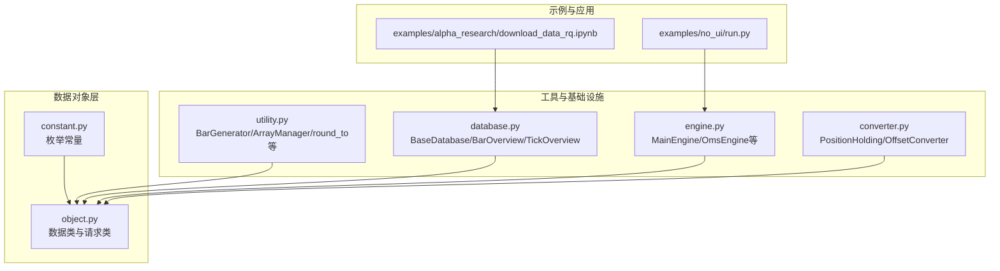
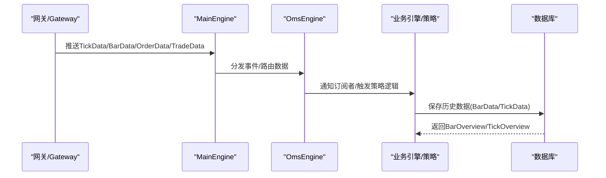
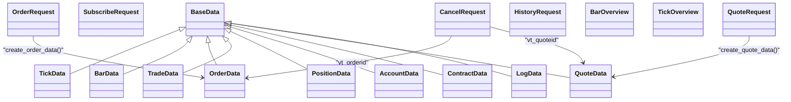

# 数据对象API

<cite>
**本文引用的文件列表**
- [vnpy/trader/object.py](file://vnpy/trader/object.py)
- [vnpy/trader/constant.py](file://vnpy/trader/constant.py)
- [vnpy/trader/utility.py](file://vnpy/trader/utility.py)
- [vnpy/trader/database.py](file://vnpy/trader/database.py)
- [vnpy/trader/engine.py](file://vnpy/trader/engine.py)
- [vnpy/trader/converter.py](file://vnpy/trader/converter.py)
- [examples/no_ui/run.py](file://examples/no_ui/run.py)
- [examples/alpha_research/download_data_rq.ipynb](file://examples/alpha_research/download_data_rq.ipynb)
</cite>

## 目录
1. [简介](#简介)
2. [项目结构与定位](#项目结构与定位)
3. [核心数据对象总览](#核心数据对象总览)
4. [架构概览](#架构概览)
5. [详细组件分析](#详细组件分析)
6. [依赖关系分析](#依赖关系分析)
7. [性能与序列化特性](#性能与序列化特性)
8. [故障排查指南](#故障排查指南)
9. [结论](#结论)
10. [附录：常用工具与示例路径](#附录常用工具与示例路径)

## 简介
本文件为vnpy交易框架中“数据对象模块”的完整API参考文档，聚焦于核心数据类的结构、字段语义、类型约束、业务逻辑、验证规则、序列化与比较等实用能力，并提供创建、修改与使用的示例路径指引。重点覆盖以下对象：
- TickData：逐笔行情与五档报价
- BarData：K线周期数据
- OrderData：委托订单状态
- TradeData：成交回报
- PositionData：持仓明细
- AccountData：账户资金
- 其他请求与数据载体：SubscribeRequest、OrderRequest、CancelRequest、HistoryRequest、QuoteRequest、ContractData、QuoteData、LogData、BarOverview、TickOverview

同时，文档给出与常量枚举（Direction、Offset、Status、Product、OrderType、OptionType、Exchange、Interval、Currency）的关系说明，以及在引擎、转换器、数据库层的典型用法。

## 项目结构与定位
数据对象位于vnpy/trader/object.py，配合常量定义（vnpy/trader/constant.py）、工具函数（vnpy/trader/utility.py）、数据库抽象（vnpy/trader/database.py）、引擎入口（vnpy/trader/engine.py）与仓位/偏移转换（vnpy/trader/converter.py）共同构成数据流与业务处理的基础。

图表来源
- [vnpy/trader/object.py](file://vnpy/trader/object.py#L1-L428)
- [vnpy/trader/constant.py](file://vnpy/trader/constant.py#L1-L161)
- [vnpy/trader/utility.py](file://vnpy/trader/utility.py#L1-L800)
- [vnpy/trader/database.py](file://vnpy/trader/database.py#L1-L160)
- [vnpy/trader/engine.py](file://vnpy/trader/engine.py#L1-L200)
- [vnpy/trader/converter.py](file://vnpy/trader/converter.py#L1-L200)
- [examples/no_ui/run.py](file://examples/no_ui/run.py#L1-L126)
- [examples/alpha_research/download_data_rq.ipynb](file://examples/alpha_research/download_data_rq.ipynb#L1-L195)

章节来源
- [vnpy/trader/object.py](file://vnpy/trader/object.py#L1-L428)
- [vnpy/trader/constant.py](file://vnpy/trader/constant.py#L1-L161)
- [vnpy/trader/utility.py](file://vnpy/trader/utility.py#L1-L800)
- [vnpy/trader/database.py](file://vnpy/trader/database.py#L1-L160)
- [vnpy/trader/engine.py](file://vnpy/trader/engine.py#L1-L200)
- [vnpy/trader/converter.py](file://vnpy/trader/converter.py#L1-L200)
- [examples/no_ui/run.py](file://examples/no_ui/run.py#L1-L126)
- [examples/alpha_research/download_data_rq.ipynb](file://examples/alpha_research/download_data_rq.ipynb#L1-L195)

## 核心数据对象总览
- 基类：BaseData（统一网关标识gateway_name与扩展字典extra）
- 行情与K线：TickData、BarData
- 订单与成交：OrderData、TradeData、QuoteData、QuoteRequest
- 持仓与账户：PositionData、AccountData
- 请求与数据载体：SubscribeRequest、OrderRequest、CancelRequest、HistoryRequest、ContractData、LogData、BarOverview、TickOverview

章节来源
- [vnpy/trader/object.py](file://vnpy/trader/object.py#L17-L428)

## 架构概览
数据对象通过__post_init__生成跨系统通用标识（如vt_symbol、vt_orderid、vt_tradeid、vt_accountid等），并在引擎与数据库层被广泛消费。工具模块提供BarGenerator用于从Tick合成Bar，ArrayManager用于技术指标计算；数据库抽象定义了BarOverview/TickOverview以描述存储概览。

图表来源
- [vnpy/trader/engine.py](file://vnpy/trader/engine.py#L81-L200)
- [vnpy/trader/database.py](file://vnpy/trader/database.py#L52-L160)
- [vnpy/trader/object.py](file://vnpy/trader/object.py#L29-L428)

## 详细组件分析

### TickData（逐笔行情与五档报价）
- 字段与含义
  - 标识：symbol、exchange、datetime
  - 名称与统计：name、volume、turnover、open_interest
  - 价格与涨跌停：last_price、last_volume、limit_up、limit_down
  - 开高收低与昨收：open_price、high_price、low_price、pre_close
  - 五档买/卖价与量：bid_price_1..5、ask_price_1..5、bid_volume_1..5、ask_volume_1..5
  - 本地时间：localtime
- 类型与取值范围
  - 所有数值字段为浮点数；时间字段为datetime；exchange为Exchange枚举
  - 五档价格与量均为非负数；last_volume通常非负
- 业务逻辑
  - __post_init__生成vt_symbol（symbol.exchange.value）
- 验证与约束
  - 无显式校验装饰器或断言，建议上层在接入时确保价格与成交量非负
- 序列化与比较
  - 使用dataclass，默认支持相等性比较与哈希（若未自定义），可直接用于集合/字典键
- 实用功能
  - 可作为BarGenerator.update_tick输入，参与K线合成
- 示例路径
  - 创建与使用：见示例notebook中HistoryRequest构造与数据查询流程
  - 参考路径：[examples/alpha_research/download_data_rq.ipynb](file://examples/alpha_research/download_data_rq.ipynb#L140-L153)

章节来源
- [vnpy/trader/object.py](file://vnpy/trader/object.py#L29-L85)
- [vnpy/trader/utility.py](file://vnpy/trader/utility.py#L204-L261)
- [examples/alpha_research/download_data_rq.ipynb](file://examples/alpha_research/download_data_rq.ipynb#L140-L153)

### BarData（K线周期数据）
- 字段与含义
  - 标识：symbol、exchange、datetime、interval
  - 成交量与资金：volume、turnover、open_interest
  - 开高收低：open_price、high_price、low_price、close_price
- 类型与取值范围
  - 数值字段为浮点数；interval为Interval枚举
- 业务逻辑
  - __post_init__生成vt_symbol
- 验证与约束
  - 无显式校验装饰器或断言
- 序列化与比较
  - dataclass默认支持相等性比较与哈希
- 实用功能
  - 由BarGenerator按分钟/小时/日聚合生成；可作为ArrayManager输入进行技术指标计算
- 示例路径
  - BarGenerator使用：[vnpy/trader/utility.py](file://vnpy/trader/utility.py#L166-L486)

章节来源
- [vnpy/trader/object.py](file://vnpy/trader/object.py#L87-L109)
- [vnpy/trader/utility.py](file://vnpy/trader/utility.py#L166-L486)

### OrderData（委托订单状态）
- 字段与含义
  - 标识：symbol、exchange、orderid
  - 报单：type（OrderType）、direction（Direction）、offset（Offset）、price、volume
  - 成交与状态：traded、status（Status）、datetime、reference
- 类型与取值范围
  - 数值字段为浮点数；各枚举字段为对应枚举类型
- 业务逻辑
  - __post_init__生成vt_symbol与vt_orderid（gateway_name.orderid）
  - is_active()判断是否处于活跃状态（SUBMITTING、NOTTRADED、PARTTRADED）
  - create_cancel_request()基于当前订单生成CancelRequest
- 验证与约束
  - 无显式校验装饰器或断言
- 序列化与比较
  - dataclass默认支持相等性比较与哈希
- 实用功能
  - 与PositionHolding配合，跟踪冻结量与可用量
- 示例路径
  - 订单创建与取消：见OrderRequest.create_order_data与CancelRequest
  - 参考路径：[vnpy/trader/object.py](file://vnpy/trader/object.py#L112-L151)

章节来源
- [vnpy/trader/object.py](file://vnpy/trader/object.py#L112-L151)
- [vnpy/trader/converter.py](file://vnpy/trader/converter.py#L54-L70)

### TradeData（成交回报）
- 字段与含义
  - 标识：symbol、exchange、orderid、tradeid
  - 成交：direction、offset、price、volume、datetime
- 类型与取值范围
  - 数值字段为浮点数；各枚举字段为对应枚举类型
- 业务逻辑
  - __post_init__生成vt_symbol、vt_orderid、vt_tradeid
- 验证与约束
  - 无显式校验装饰器或断言
- 序列化与比较
  - dataclass默认支持相等性比较与哈希
- 实用功能
  - 与PositionHolding配合更新多空头寸与冻结量
- 示例路径
  - 参考路径：[vnpy/trader/object.py](file://vnpy/trader/object.py#L153-L176)

章节来源
- [vnpy/trader/object.py](file://vnpy/trader/object.py#L153-L176)
- [vnpy/trader/converter.py](file://vnpy/trader/converter.py#L71-L111)

### PositionData（持仓明细）
- 字段与含义
  - 标识：symbol、exchange、direction
  - 持仓：volume、frozen、price、pnl、yd_volume
- 类型与取值范围
  - 数值字段为浮点数；direction为Direction枚举
- 业务逻辑
  - __post_init__生成vt_symbol与vt_positionid（gateway_name.symbol.exchange.direction.value）
- 验证与约束
  - 无显式校验装饰器或断言
- 序列化与比较
  - dataclass默认支持相等性比较与哈希
- 实用功能
  - 与PositionHolding配合维护总仓、今昨仓与冻结量
- 示例路径
  - 参考路径：[vnpy/trader/object.py](file://vnpy/trader/object.py#L178-L198)

章节来源
- [vnpy/trader/object.py](file://vnpy/trader/object.py#L178-L198)
- [vnpy/trader/converter.py](file://vnpy/trader/converter.py#L43-L53)

### AccountData（账户资金）
- 字段与含义
  - 标识：accountid
  - 资金：balance、frozen
  - 计算：available（balance - frozen）
- 类型与取值范围
  - 数值字段为浮点数
- 业务逻辑
  - __post_init__生成available与vt_accountid（gateway_name.accountid）
- 验证与约束
  - 无显式校验装饰器或断言
- 序列化与比较
  - dataclass默认支持相等性比较与哈希
- 示例路径
  - 参考路径：[vnpy/trader/object.py](file://vnpy/trader/object.py#L200-L216)

章节来源
- [vnpy/trader/object.py](file://vnpy/trader/object.py#L200-L216)

### ContractData（合约基础信息）
- 字段与含义
  - 基本：symbol、exchange、name、product（Product）、size、pricetick
  - 交易限制：min_volume、max_volume、stop_supported、net_position、history_data
  - 期权特有：option_strike、option_underlying、option_type、option_listed、option_expiry、option_portfolio、option_index
- 类型与取值范围
  - 数值字段为浮点数；枚举字段为对应枚举类型
- 业务逻辑
  - __post_init__生成vt_symbol
- 验证与约束
  - 无显式校验装饰器或断言
- 序列化与比较
  - dataclass默认支持相等性比较与哈希
- 示例路径
  - 参考路径：[vnpy/trader/object.py](file://vnpy/trader/object.py#L233-L262)

章节来源
- [vnpy/trader/object.py](file://vnpy/trader/object.py#L233-L262)

### QuoteData与QuoteRequest（报价与报价请求）
- 字段与含义
  - QuoteData：symbol、exchange、quoteid、bid_price、bid_volume、ask_price、ask_volume、bid_offset、ask_offset、status、datetime、reference
  - QuoteRequest：与报价对应的请求字段
- 类型与取值范围
  - 数值字段为浮点数/整数；各枚举字段为对应枚举类型
- 业务逻辑
  - __post_init__生成vt_symbol与vt_quoteid
  - is_active()判断是否处于活跃状态
  - create_cancel_request()基于当前报价生成CancelRequest
  - create_quote_data()从请求生成报价数据
- 验证与约束
  - 无显式校验装饰器或断言
- 序列化与比较
  - dataclass默认支持相等性比较与哈希
- 示例路径
  - 参考路径：[vnpy/trader/object.py](file://vnpy/trader/object.py#L265-L304)

章节来源
- [vnpy/trader/object.py](file://vnpy/trader/object.py#L265-L304)

### 请求类与数据载体
- SubscribeRequest：订阅请求（symbol、exchange）
- OrderRequest：下单请求（含方向、类型、价格、数量、偏移等）
- CancelRequest：撤单请求（orderid、symbol、exchange）
- HistoryRequest：历史数据请求（symbol、exchange、start、end、interval）
- LogData：日志数据（msg、level）
- BarOverview/TickOverview：数据库存储概览（用于查询已有数据范围）

章节来源
- [vnpy/trader/object.py](file://vnpy/trader/object.py#L307-L428)
- [vnpy/trader/database.py](file://vnpy/trader/database.py#L25-L133)

## 依赖关系分析
- 常量枚举：Direction、Offset、Status、Product、OrderType、OptionType、Exchange、Interval、Currency
- 工具函数：round_to、floor_to、ceil_to、get_digits、BarGenerator、ArrayManager
- 引擎与转换：MainEngine、OmsEngine、PositionHolding、OffsetConverter
- 数据库：BaseDatabase、BarOverview、TickOverview

图表来源
- [vnpy/trader/object.py](file://vnpy/trader/object.py#L17-L428)

章节来源
- [vnpy/trader/object.py](file://vnpy/trader/object.py#L17-L428)
- [vnpy/trader/constant.py](file://vnpy/trader/constant.py#L1-L161)
- [vnpy/trader/utility.py](file://vnpy/trader/utility.py#L166-L800)
- [vnpy/trader/engine.py](file://vnpy/trader/engine.py#L81-L200)
- [vnpy/trader/converter.py](file://vnpy/trader/converter.py#L1-L200)
- [vnpy/trader/database.py](file://vnpy/trader/database.py#L52-L160)

## 性能与序列化特性
- 性能
  - dataclass默认实现高效相等性比较与哈希，适合作为集合/字典键
  - BarGenerator在update_tick中仅做必要字段更新，避免重复分配
  - ArrayManager使用numpy数组批量更新，适合大规模技术指标计算
- 序列化
  - dataclass对象可直接用于JSON序列化（需确保枚举与datetime可序列化）
  - 建议在持久化前将枚举转为字符串、datetime转为ISO字符串
- 时间处理
  - 数据库层提供convert_tz与DB_TZ，统一时间时区转换

章节来源
- [vnpy/trader/utility.py](file://vnpy/trader/utility.py#L166-L800)
- [vnpy/trader/database.py](file://vnpy/trader/database.py#L17-L23)

## 故障排查指南
- vt_symbol不一致
  - 现象：跨模块匹配不到数据
  - 处理：确认symbol与exchange拼接规则一致（symbol.exchange.value）
- 订单状态误判
  - 现象：is_active返回异常
  - 处理：检查Status是否为SUBMITTING/NOTTRADED/PARTTRADED之一
- 冻结量超限
  - 现象：平仓冻结量超过可用量
  - 处理：使用PositionHolding.calculate_frozen与sum_pos_frozen进行修正
- 价格精度问题
  - 现象：下单价格与最小变动单位不匹配
  - 处理：使用round_to/floor_to/ceil_to进行价格对齐
- 历史数据缺失
  - 现象：查询不到指定区间数据
  - 处理：检查HistoryRequest的时间范围与Interval；确认数据库驱动可用

章节来源
- [vnpy/trader/object.py](file://vnpy/trader/object.py#L14-L15)
- [vnpy/trader/converter.py](file://vnpy/trader/converter.py#L112-L167)
- [vnpy/trader/utility.py](file://vnpy/trader/utility.py#L120-L148)
- [vnpy/trader/database.py](file://vnpy/trader/database.py#L72-L133)

## 结论
数据对象模块以dataclass为核心，结合常量枚举与工具函数，提供了清晰、可扩展的数据模型与处理链路。通过vt_*标识统一跨模块引用，配合BarGenerator与ArrayManager实现高效的数据处理与分析。建议在实际使用中：
- 明确字段语义与取值范围，确保数据质量
- 使用工具函数进行价格对齐与时区转换
- 利用PositionHolding与Active状态管理控制风险
- 在持久化前完成序列化适配

## 附录：常用工具与示例路径
- vt_symbol生成与解析
  - 生成：generate_vt_symbol(symbol, exchange)
  - 解析：extract_vt_symbol(vt_symbol)
  - 参考路径：[vnpy/trader/utility.py](file://vnpy/trader/utility.py#L23-L36)
- 价格对齐
  - round_to、floor_to、ceil_to
  - 参考路径：[vnpy/trader/utility.py](file://vnpy/trader/utility.py#L120-L148)
- K线合成
  - BarGenerator.update_tick/update_bar
  - 参考路径：[vnpy/trader/utility.py](file://vnpy/trader/utility.py#L166-L486)
- 技术指标
  - ArrayManager.sma/ema/kama/wma等
  - 参考路径：[vnpy/trader/utility.py](file://vnpy/trader/utility.py#L488-L800)
- 历史数据查询
  - HistoryRequest + 数据库接口
  - 参考路径：[examples/alpha_research/download_data_rq.ipynb](file://examples/alpha_research/download_data_rq.ipynb#L140-L153)
- 引擎集成
  - MainEngine初始化与事件分发
  - 参考路径：[examples/no_ui/run.py](file://examples/no_ui/run.py#L62-L95)