# 网关接口API

<cite>
**本文引用的文件**
- [vnpy/trader/gateway.py](file://vnpy/trader/gateway.py)
- [vnpy/trader/object.py](file://vnpy/trader/object.py)
- [vnpy/trader/event.py](file://vnpy/trader/event.py)
- [vnpy/trader/constant.py](file://vnpy/trader/constant.py)
- [vnpy/trader/engine.py](file://vnpy/trader/engine.py)
</cite>

## 目录
1. [引言](#引言)
2. [项目结构](#项目结构)
3. [核心组件](#核心组件)
4. [架构总览](#架构总览)
5. [详细组件分析](#详细组件分析)
6. [依赖关系分析](#依赖关系分析)
7. [性能与并发特性](#性能与并发特性)
8. [故障排查指南](#故障排查指南)
9. [结论](#结论)
10. [附录：标准实现模板与最佳实践](#附录标准实现模板与最佳实践)

## 引言
本文件面向希望基于 vn.py 平台开发“网关（Gateway）”的开发者，系统化梳理 BaseGateway 抽象类及其扩展接口规范，覆盖连接管理、行情订阅、委托下单、资金与持仓查询、历史数据查询、报价（Quoting）等核心能力，并给出异常处理、自动重连、心跳检测等高级主题的接口约束与实现建议。同时提供标准实现模板与最佳实践，帮助快速、安全地完成高质量网关接入。

## 项目结构
围绕网关接口的关键文件组织如下：
- 抽象基类与接口规范：vnpy/trader/gateway.py
- 数据对象与请求/响应载体：vnpy/trader/object.py
- 事件类型常量：vnpy/trader/event.py
- 枚举与常量：vnpy/trader/constant.py
- 主引擎与网关注册：vnpy/trader/engine.py

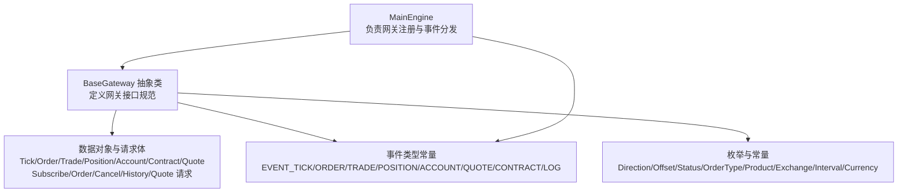

图表来源
- [vnpy/trader/gateway.py](file://vnpy/trader/gateway.py#L33-L273)
- [vnpy/trader/object.py](file://vnpy/trader/object.py#L17-L428)
- [vnpy/trader/event.py](file://vnpy/trader/event.py#L7-L15)
- [vnpy/trader/constant.py](file://vnpy/trader/constant.py#L10-L161)
- [vnpy/trader/engine.py](file://vnpy/trader/engine.py#L81-L137)

章节来源
- [vnpy/trader/gateway.py](file://vnpy/trader/gateway.py#L1-L273)
- [vnpy/trader/object.py](file://vnpy/trader/object.py#L1-L428)
- [vnpy/trader/event.py](file://vnpy/trader/event.py#L1-L15)
- [vnpy/trader/constant.py](file://vnpy/trader/constant.py#L1-L161)
- [vnpy/trader/engine.py](file://vnpy/trader/engine.py#L1-L200)

## 核心组件
本节聚焦 BaseGateway 的抽象方法、回调函数、默认行为与扩展点，帮助理解“必须实现”和“可选扩展”的接口边界。

- 必须实现的方法
  - 连接建立：connect(setting: dict) -> None
  - 连接关闭：close() -> None
  - 行情订阅：subscribe(req: SubscribeRequest) -> None
  - 委托下单：send_order(req: OrderRequest) -> str
  - 撤单：cancel_order(req: CancelRequest) -> None
  - 资金查询：query_account() -> None
  - 持仓查询：query_position() -> None
  - 历史数据查询：query_history(req: HistoryRequest) -> list[BarData]
  - 报价（可选）：send_quote(req: QuoteRequest) -> str；cancel_quote(req: CancelRequest) -> None

- 可选扩展的方法
  - query_history：默认返回空列表，具体网关按需实现
  - send_quote/cancel_quote：默认空实现，仅在支持报价时覆盖

- 回调与事件推送
  - on_tick/on_trade/on_order/on_position/on_account/on_quote/on_log/on_contract
  - write_log：统一写日志入口，内部通过事件引擎推送

- 默认配置与支持交易所
  - default_name：默认网关名称
  - default_setting：连接所需参数字典
  - exchanges：该网关支持的交易所集合

- 线程模型与非阻塞要求
  - 所有方法必须线程安全且非阻塞
  - 回调传递的数据对象应视为不可变，避免共享可变状态

章节来源
- [vnpy/trader/gateway.py](file://vnpy/trader/gateway.py#L33-L273)

## 架构总览
下图展示“主引擎-网关-事件引擎-外部系统”的交互关系，以及网关内部的回调与事件推送路径。

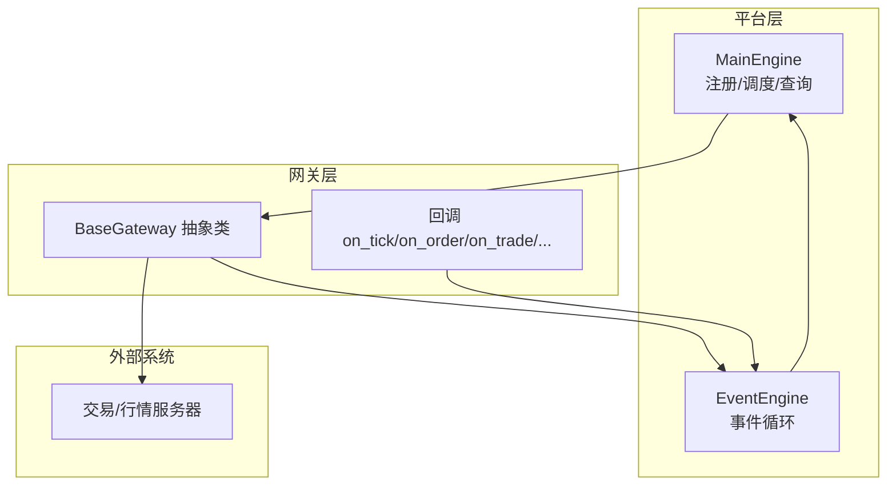

图表来源
- [vnpy/trader/engine.py](file://vnpy/trader/engine.py#L81-L137)
- [vnpy/trader/gateway.py](file://vnpy/trader/gateway.py#L81-L159)

## 详细组件分析

### BaseGateway 类与接口规范
- 角色定位：所有具体网关实现的抽象基类，统一对外接口与事件语义
- 关键字段
  - default_name：默认网关名
  - default_setting：连接参数字典模板
  - exchanges：支持的交易所列表
  - event_engine：事件引擎实例
  - gateway_name：实例级网关名
- 关键方法
  - connect(setting: dict)：建立连接、拉取初始数据、推送事件
  - close()：断开连接
  - subscribe(req: SubscribeRequest)：订阅行情
  - send_order(req: OrderRequest) -> str：下单并返回本地订单号
  - cancel_order(req: CancelRequest)：撤单
  - query_account()/query_position()：查询资金/持仓
  - query_history(req: HistoryRequest) -> list[BarData]：历史K线查询
  - send_quote/cancel_quote：报价相关（可选）
  - on_* 回调：推送各类事件
  - write_log：统一写日志

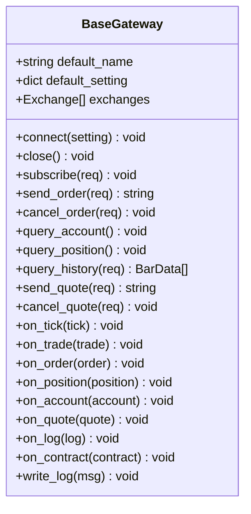

图表来源
- [vnpy/trader/gateway.py](file://vnpy/trader/gateway.py#L33-L273)

章节来源
- [vnpy/trader/gateway.py](file://vnpy/trader/gateway.py#L33-L273)

### 数据对象与请求/响应载体
- 基础数据：BaseData（携带 gateway_name 与额外扩展字段）
- 行情/K线：TickData、BarData
- 委托/成交/持仓/账户：OrderData、TradeData、PositionData、AccountData
- 合约信息：ContractData
- 报价：QuoteData
- 请求体：SubscribeRequest、OrderRequest、CancelRequest、HistoryRequest、QuoteRequest
- 状态与枚举：Direction、Offset、Status、OrderType、Product、OptionType、Exchange、Interval、Currency

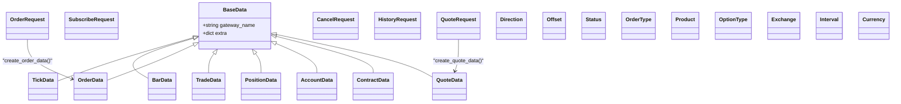

图表来源
- [vnpy/trader/object.py](file://vnpy/trader/object.py#L17-L428)
- [vnpy/trader/constant.py](file://vnpy/trader/constant.py#L10-L161)

章节来源
- [vnpy/trader/object.py](file://vnpy/trader/object.py#L17-L428)
- [vnpy/trader/constant.py](file://vnpy/trader/constant.py#L10-L161)

### 事件类型与推送机制
- 事件类型常量：EVENT_TICK、EVENT_ORDER、EVENT_TRADE、EVENT_POSITION、EVENT_ACCOUNT、EVENT_QUOTE、EVENT_CONTRACT、EVENT_LOG
- BaseGateway 内部封装了 on_event 通用推送与 on_* 专用推送（含按 vt_symbol/vt_orderid/vt_accountid 的定向事件）
- write_log 统一日志推送入口

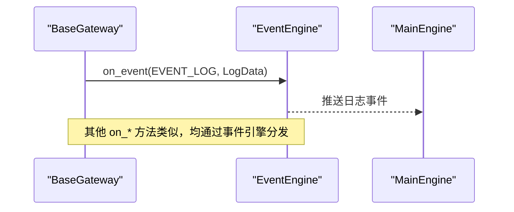

图表来源
- [vnpy/trader/gateway.py](file://vnpy/trader/gateway.py#L86-L159)
- [vnpy/trader/event.py](file://vnpy/trader/event.py#L7-L15)

章节来源
- [vnpy/trader/gateway.py](file://vnpy/trader/gateway.py#L86-L159)
- [vnpy/trader/event.py](file://vnpy/trader/event.py#L7-L15)

### 订单生命周期与下单流程
- 输入：OrderRequest（含 symbol/exchange/direction/type/volume/price/offset/reference）
- 输出：本地 vt_orderid（由网关分配）
- 状态流转：提交中 -> 未成交/部分成交/全部成交/撤销/拒单
- 关键步骤：创建 OrderData、分配唯一 orderid、发送至服务器、根据结果设置状态、推送 on_order、返回 vt_orderid

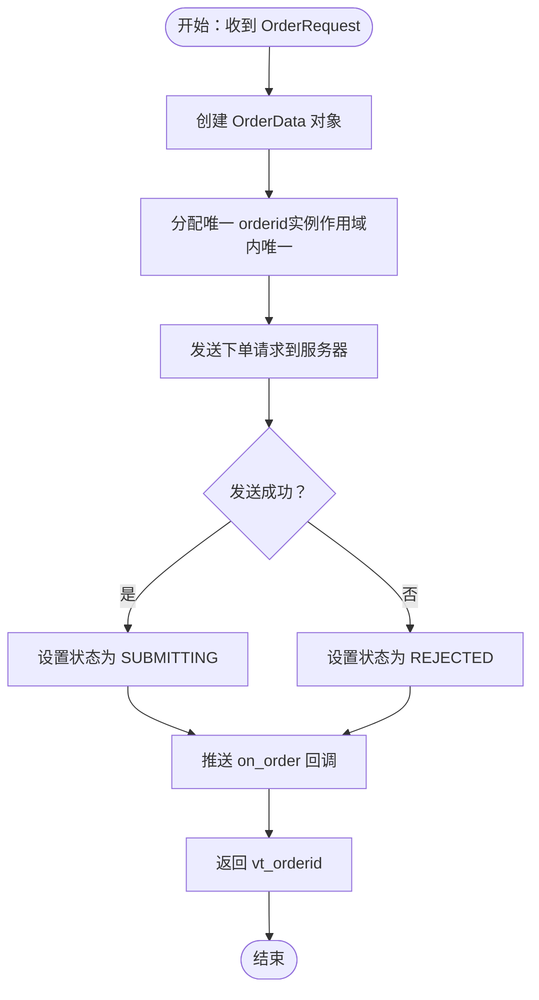

图表来源
- [vnpy/trader/gateway.py](file://vnpy/trader/gateway.py#L196-L212)
- [vnpy/trader/object.py](file://vnpy/trader/object.py#L112-L151)

章节来源
- [vnpy/trader/gateway.py](file://vnpy/trader/gateway.py#L196-L212)
- [vnpy/trader/object.py](file://vnpy/trader/object.py#L112-L151)

### 历史数据查询流程
- 输入：HistoryRequest（symbol/exchange/start/end/interval）
- 输出：BarData 列表
- 默认行为：返回空列表（不支持历史数据时）
- 实现建议：按 interval 分片请求，合并响应，注意时间范围与频率限制

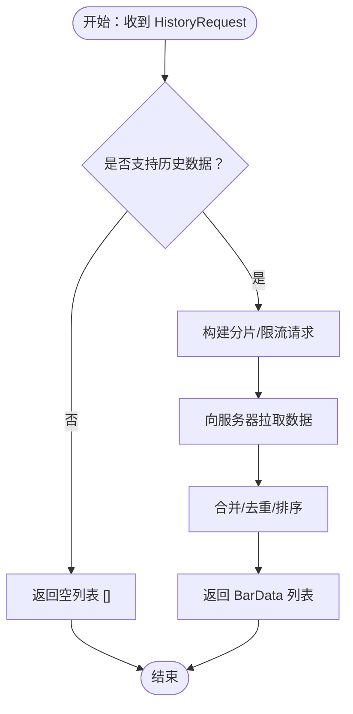

图表来源
- [vnpy/trader/gateway.py](file://vnpy/trader/gateway.py#L262-L267)
- [vnpy/trader/object.py](file://vnpy/trader/object.py#L374-L388)

章节来源
- [vnpy/trader/gateway.py](file://vnpy/trader/gateway.py#L262-L267)
- [vnpy/trader/object.py](file://vnpy/trader/object.py#L374-L388)

### 报价（Quoting）接口
- send_quote：创建 QuoteData、分配唯一 quoteid、发送请求、设置状态、推送 on_quote、返回 vt_quoteid
- cancel_quote：发送撤价请求（若支持）

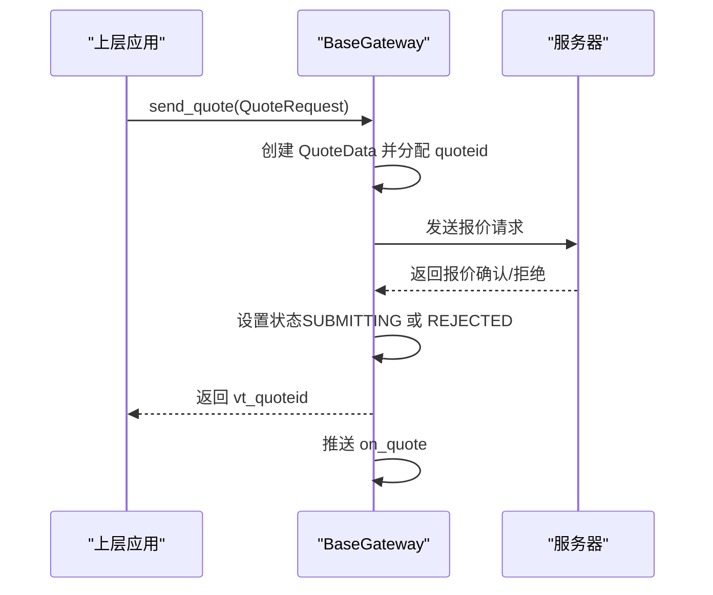

图表来源
- [vnpy/trader/gateway.py](file://vnpy/trader/gateway.py#L223-L246)
- [vnpy/trader/object.py](file://vnpy/trader/object.py#L391-L428)

章节来源
- [vnpy/trader/gateway.py](file://vnpy/trader/gateway.py#L223-L246)
- [vnpy/trader/object.py](file://vnpy/trader/object.py#L391-L428)

### 连接管理与自动重连
- connect 需要完成：建立连接、拉取合约/账户/持仓/委托/成交等初始数据、推送对应 on_* 事件、失败时写日志
- 自动重连：要求在连接丢失后自动尝试重连（在实现中体现）
- close：确保资源释放与连接断开

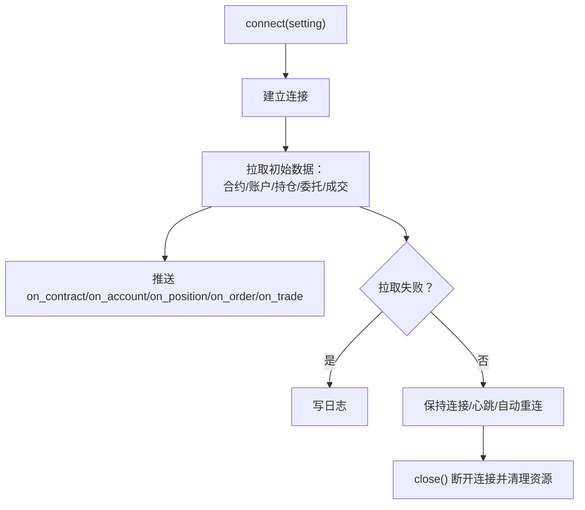

图表来源
- [vnpy/trader/gateway.py](file://vnpy/trader/gateway.py#L160-L187)

章节来源
- [vnpy/trader/gateway.py](file://vnpy/trader/gateway.py#L160-L187)

### 主引擎与网关注册
- MainEngine 负责：
  - 初始化事件引擎并启动
  - 注册网关实例（add_gateway），维护 gateway_name -> Gateway 映射
  - 汇聚各网关支持的交易所集合
  - 提供统一日志写入与通知通道

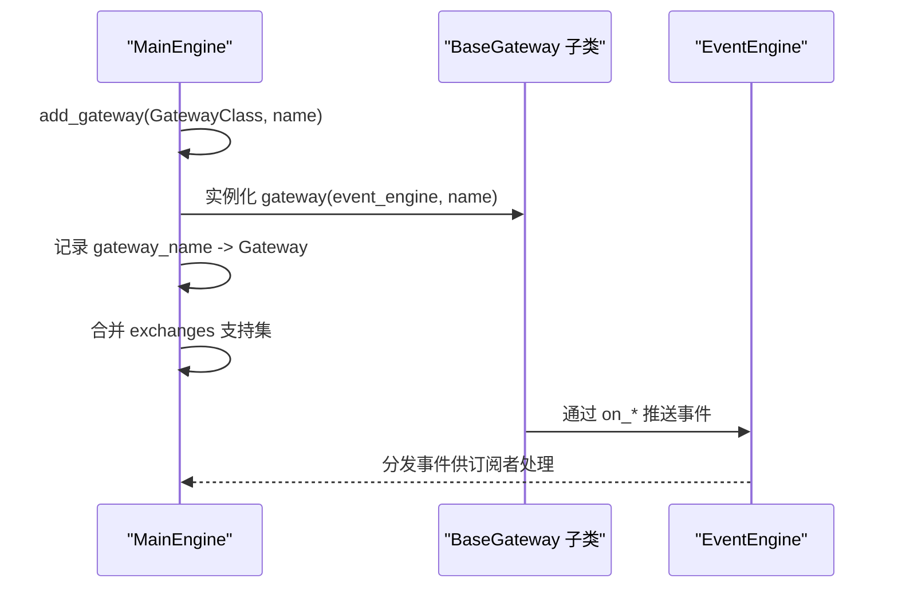

图表来源
- [vnpy/trader/engine.py](file://vnpy/trader/engine.py#L110-L127)

章节来源
- [vnpy/trader/engine.py](file://vnpy/trader/engine.py#L81-L137)

## 依赖关系分析
- BaseGateway 依赖
  - 事件类型常量（EVENT_*）
  - 数据对象（TickData/OrderData/TradeData/PositionData/AccountData/ContractData/QuoteData）
  - 请求对象（SubscribeRequest/OrderRequest/CancelRequest/HistoryRequest/QuoteRequest）
  - 枚举（Direction/Offset/Status/OrderType/Product/OptionType/Exchange/Interval/Currency）
- MainEngine 依赖 BaseGateway 以进行注册与查询，依赖事件引擎进行事件分发

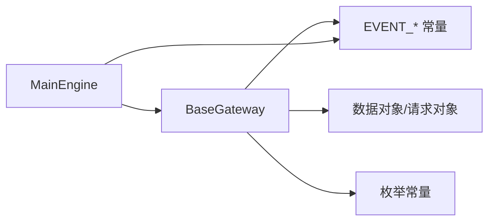

图表来源
- [vnpy/trader/gateway.py](file://vnpy/trader/gateway.py#L3-L30)
- [vnpy/trader/event.py](file://vnpy/trader/event.py#L7-L15)
- [vnpy/trader/object.py](file://vnpy/trader/object.py#L17-L428)
- [vnpy/trader/constant.py](file://vnpy/trader/constant.py#L10-L161)
- [vnpy/trader/engine.py](file://vnpy/trader/engine.py#L81-L137)

章节来源
- [vnpy/trader/gateway.py](file://vnpy/trader/gateway.py#L3-L30)
- [vnpy/trader/event.py](file://vnpy/trader/event.py#L7-L15)
- [vnpy/trader/object.py](file://vnpy/trader/object.py#L17-L428)
- [vnpy/trader/constant.py](file://vnpy/trader/constant.py#L10-L161)
- [vnpy/trader/engine.py](file://vnpy/trader/engine.py#L81-L137)

## 性能与并发特性
- 线程安全：所有方法必须线程安全，避免跨对象共享可变状态
- 非阻塞：所有方法不得阻塞事件循环或主线程
- 事件驱动：通过事件引擎异步分发，降低耦合
- 历史数据：合理分片与限流，避免触发服务端限频
- 日志：使用 write_log 统一输出，便于集中监控

[本节为通用指导，无需特定文件引用]

## 故障排查指南
- 连接失败
  - 检查 connect 中的初始化流程与错误日志
  - 确认 default_setting 参数完整
- 订单状态异常
  - 核对 send_order 的状态设置逻辑与 on_order 推送时机
- 行情缺失
  - 确认 subscribe 是否正确调用，on_tick 是否被触发
- 资金/持仓不同步
  - 检查 query_account/query_position 的实现与 on_account/on_position 推送
- 历史数据为空
  - 确认 query_history 的实现与时间区间/粒度参数

章节来源
- [vnpy/trader/gateway.py](file://vnpy/trader/gateway.py#L160-L187)
- [vnpy/trader/gateway.py](file://vnpy/trader/gateway.py#L262-L267)
- [vnpy/trader/object.py](file://vnpy/trader/object.py#L112-L151)

## 结论
BaseGateway 为 vn.py 网关生态提供了统一而严谨的接口契约：既保证了与平台事件系统的无缝对接，又通过严格的线程安全与非阻塞约束确保了整体系统的稳定性。遵循本文档的接口规范与最佳实践，可高效、可靠地完成各类交易与行情网关的接入与维护。

[本节为总结性内容，无需特定文件引用]

## 附录：标准实现模板与最佳实践

- 标准实现模板
  - 在子类中填充 default_name/default_setting/exchanges
  - 实现 connect/close/subscribe/send_order/cancel_order/query_account/query_position
  - 若支持历史数据与报价，实现 query_history/send_quote/cancel_quote
  - 在合适时机调用 on_* 与 write_log 推送事件与日志
  - 使用事件引擎进行异步分发，避免阻塞

- 最佳实践
  - 自动重连：在连接断开后周期性尝试重连，并在成功后重新订阅与同步状态
  - 心跳检测：按协议要求维持心跳，超时未响应则主动断开并重连
  - 状态机：严格维护订单/报价状态机，确保状态转换合法且幂等
  - 错误处理：捕获网络/解析/业务异常，写入日志并适当回滚或补偿
  - 并发控制：使用锁或无锁队列保护共享资源，避免竞态条件
  - 历史数据：分片请求、缓存去重、按需限速，避免触发风控

[本节为通用指导，无需特定文件引用]