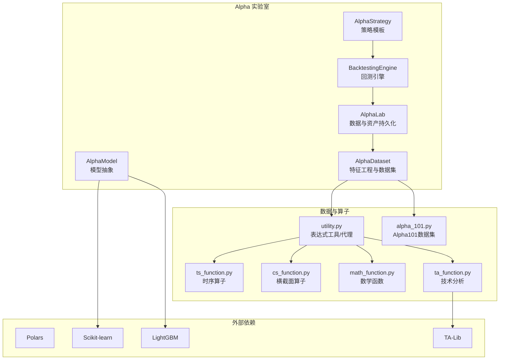
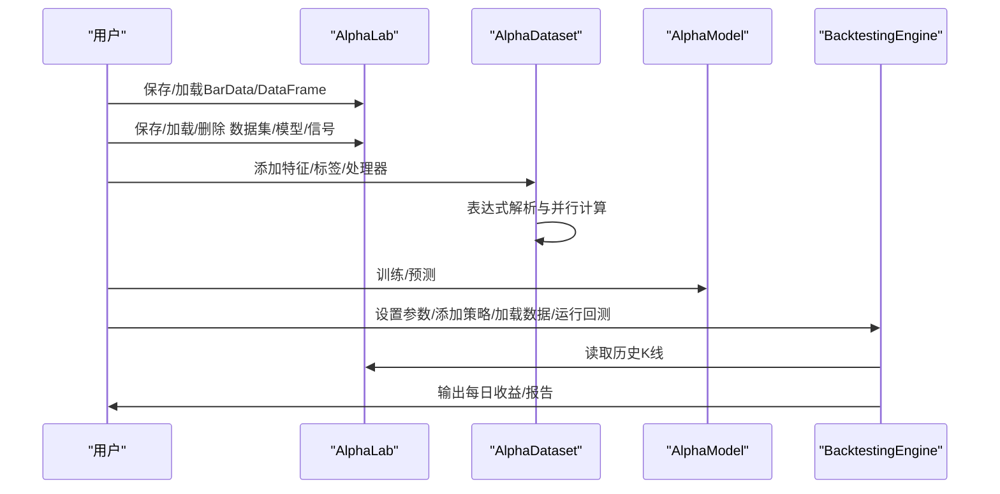
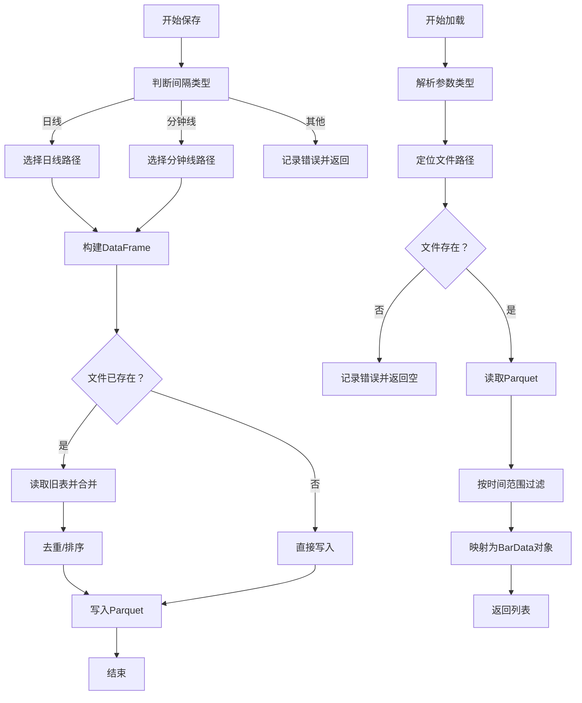
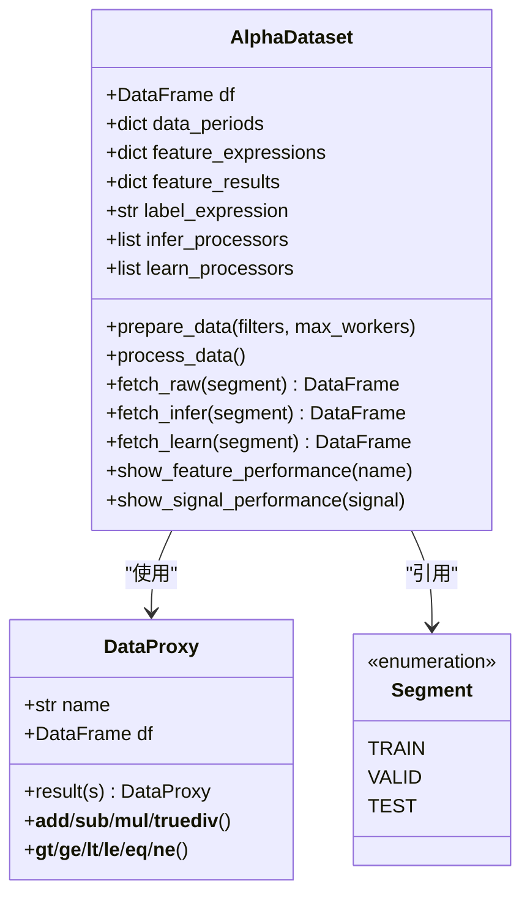
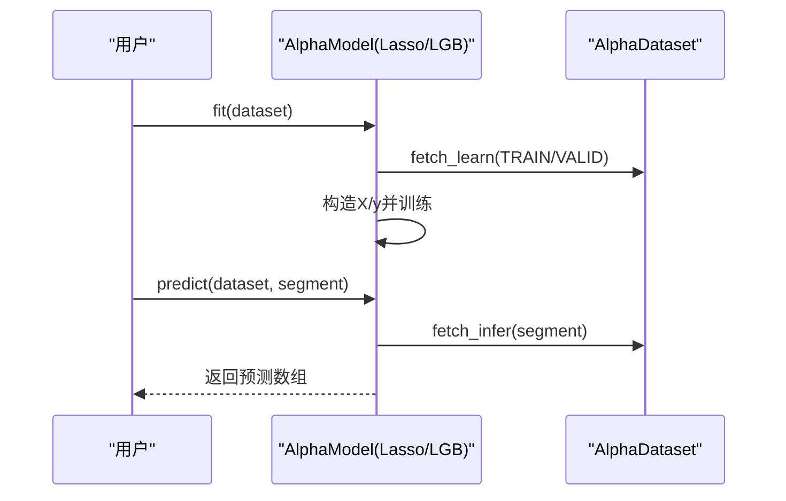
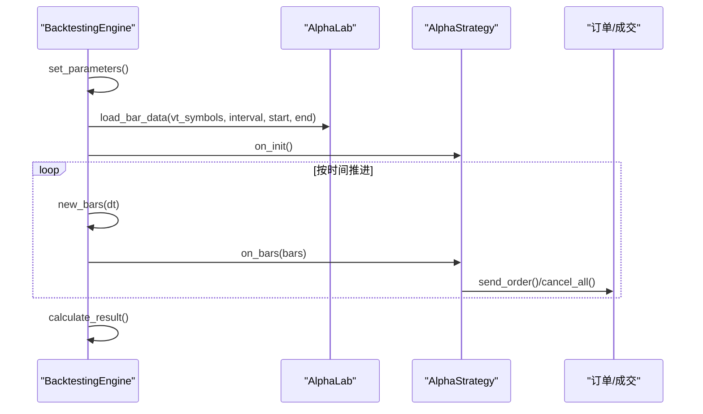
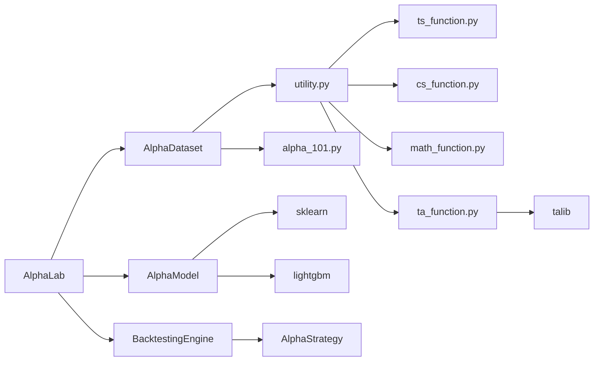

# Alpha实验室核心

<cite>
**本文引用的文件**
- [vnpy/alpha/lab.py](file://vnpy/alpha/lab.py)
- [vnpy/alpha/__init__.py](file://vnpy/alpha/__init__.py)
- [vnpy/alpha/dataset/template.py](file://vnpy/alpha/dataset/template.py)
- [vnpy/alpha/dataset/utility.py](file://vnpy/alpha/dataset/utility.py)
- [vnpy/alpha/dataset/ts_function.py](file://vnpy/alpha/dataset/ts_function.py)
- [vnpy/alpha/dataset/cs_function.py](file://vnpy/alpha/dataset/cs_function.py)
- [vnpy/alpha/dataset/math_function.py](file://vnpy/alpha/dataset/math_function.py)
- [vnpy/alpha/dataset/ta_function.py](file://vnpy/alpha/dataset/ta_function.py)
- [vnpy/alpha/dataset/datasets/alpha_101.py](file://vnpy/alpha/dataset/datasets/alpha_101.py)
- [vnpy/alpha/model/template.py](file://vnpy/alpha/model/template.py)
- [vnpy/alpha/model/models/lasso_model.py](file://vnpy/alpha/model/models/lasso_model.py)
- [vnpy/alpha/model/models/lgb_model.py](file://vnpy/alpha/model/models/lgb_model.py)
- [vnpy/alpha/strategy/template.py](file://vnpy/alpha/strategy/template.py)
- [vnpy/alpha/strategy/backtesting.py](file://vnpy/alpha/strategy/backtesting.py)
- [vnpy/alpha/logger.py](file://vnpy/alpha/logger.py)
</cite>

## 目录
1. [简介](#简介)
2. [项目结构](#项目结构)
3. [核心组件](#核心组件)
4. [架构总览](#架构总览)
5. [详细组件分析](#详细组件分析)
6. [依赖关系分析](#依赖关系分析)
7. [性能与扩展性考虑](#性能与扩展性考虑)
8. [故障排查指南](#故障排查指南)
9. [结论](#结论)
10. [附录：API参考与使用示例](#附录api参考与使用示例)

## 简介
本文件面向量化研究人员，系统化梳理Alpha实验室核心能力：以AlphaLab为中心的数据与实验管理、AlphaDataset的表达式驱动特征工程、AlphaModel的可插拔建模框架、以及基于信号的回测引擎。文档覆盖以下主题：
- AlphaLab：数据存储与加载（BarData、DataFrame）、指数成分管理、合同设置、数据集/模型/信号的持久化与生命周期管理
- AlphaDataset：表达式解析、跨时序/跨截面算子、并行特征计算、分段数据提取与性能分析
- 模型与信号：LASSO与LightGBM示例模型、信号DataFrame的保存与加载
- 回测：策略模板、订单执行、资金与头寸管理、每日收益统计

## 项目结构
Alpha实验室位于vnpy/alpha目录下，采用按领域分层的组织方式：
- lab：核心实验室类，负责数据与资产的持久化与加载
- dataset：特征工程与数据集模板，含表达式解析器与各类算子
- model：模型抽象与具体实现（LASSO、LightGBM）
- strategy：策略模板与回测引擎
- logger：统一日志输出

图表来源
- [vnpy/alpha/lab.py](file://vnpy/alpha/lab.py#L20-L481)
- [vnpy/alpha/dataset/template.py](file://vnpy/alpha/dataset/template.py#L23-L306)
- [vnpy/alpha/dataset/utility.py](file://vnpy/alpha/dataset/utility.py#L19-L286)
- [vnpy/alpha/dataset/ts_function.py](file://vnpy/alpha/dataset/ts_function.py#L12-L330)
- [vnpy/alpha/dataset/cs_function.py](file://vnpy/alpha/dataset/cs_function.py#L10-L65)
- [vnpy/alpha/dataset/math_function.py](file://vnpy/alpha/dataset/math_function.py#L10-L168)
- [vnpy/alpha/dataset/ta_function.py](file://vnpy/alpha/dataset/ta_function.py#L12-L44)
- [vnpy/alpha/dataset/datasets/alpha_101.py](file://vnpy/alpha/dataset/datasets/alpha_101.py#L6-L331)
- [vnpy/alpha/model/template.py](file://vnpy/alpha/model/template.py#L9-L31)
- [vnpy/alpha/model/models/lasso_model.py](file://vnpy/alpha/model/models/lasso_model.py#L13-L140)
- [vnpy/alpha/model/models/lgb_model.py](file://vnpy/alpha/model/models/lgb_model.py#L12-L171)
- [vnpy/alpha/strategy/template.py](file://vnpy/alpha/strategy/template.py#L15-L206)
- [vnpy/alpha/strategy/backtesting.py](file://vnpy/alpha/strategy/backtesting.py#L22-L200)

章节来源
- [vnpy/alpha/__init__.py](file://vnpy/alpha/__init__.py#L1-L19)

## 核心组件
- AlphaLab：统一的数据与资产入口，提供BarData的Parquet存取、DataFrame批量处理、指数成分管理、合同设置JSON、数据集/模型/信号的序列化持久化与列表查询。
- AlphaDataset：表达式驱动的特征工程流水线，支持并行计算、跨时序/跨截面算子、分段数据提取、信号与因子性能分析。
- AlphaModel：机器学习模型抽象，定义fit/predict接口；提供LASSO与LightGBM实现。
- 回测引擎：基于AlphaStrategy模板，管理历史数据加载、订单执行、资金与头寸、每日收益统计。

章节来源
- [vnpy/alpha/lab.py](file://vnpy/alpha/lab.py#L20-L481)
- [vnpy/alpha/dataset/template.py](file://vnpy/alpha/dataset/template.py#L23-L306)
- [vnpy/alpha/model/template.py](file://vnpy/alpha/model/template.py#L9-L31)
- [vnpy/alpha/strategy/backtesting.py](file://vnpy/alpha/strategy/backtesting.py#L22-L200)

## 架构总览
AlphaLab作为中枢，向上承载AlphaDataset与AlphaModel的生命周期管理，向下对接数据源与外部库。表达式解析器通过utility.py将字符串或Polars表达式转换为DataFrame列，再由时序/横截面/数学/技术分析算子组合生成特征。回测引擎通过策略模板与AlphaLab交互，读取历史K线与信号，驱动下单与收益统计。

图表来源
- [vnpy/alpha/lab.py](file://vnpy/alpha/lab.py#L51-L481)
- [vnpy/alpha/dataset/template.py](file://vnpy/alpha/dataset/template.py#L90-L194)
- [vnpy/alpha/model/template.py](file://vnpy/alpha/model/template.py#L9-L31)
- [vnpy/alpha/strategy/backtesting.py](file://vnpy/alpha/strategy/backtesting.py#L70-L200)

## 详细组件分析

### AlphaLab：数据与资产持久化中心
职责与能力
- 数据存储与加载
  - 保存/加载日线/分钟线BarData，使用Parquet格式，自动去重与排序
  - 批量加载多标的DataFrame，标准化价格、处理停牌日NaN、拼接vt_symbol列
- 指数成分管理
  - 使用shelve保存/缓存指数成分字典（日期->成分列表），支持时间范围过滤与持续持有期提取
- 合同设置
  - JSON文件保存/读取每只合约的手续费率、乘数、最小跳价等
- 资产持久化
  - 数据集（pickle）、模型（pickle）、信号（Parquet）的保存/加载/删除/列举

关键流程图：BarData保存与加载

图表来源
- [vnpy/alpha/lab.py](file://vnpy/alpha/lab.py#L51-L154)

章节来源
- [vnpy/alpha/lab.py](file://vnpy/alpha/lab.py#L20-L481)

### AlphaDataset：表达式驱动的特征工程
设计要点
- 表达式注册与解析：utility.py提供DataProxy与表达式函数注册，支持字符串表达式与Polars Expr两种输入
- 算子体系：时序（ts_*）、横截面（cs_*）、数学（math_*）、技术分析（ta_*）四大类，覆盖延迟、动量、协整、RSI/ATR等
- 并行计算：使用多进程池并行计算多个特征表达式，提升大规模数据处理效率
- 分段数据：按训练/验证/测试时间段提取数据，支持过滤特定成分股持有期
- 性能分析：内置因子与信号的Alphalens兼容分析接口

类关系图

图表来源
- [vnpy/alpha/dataset/template.py](file://vnpy/alpha/dataset/template.py#L23-L306)
- [vnpy/alpha/dataset/utility.py](file://vnpy/alpha/dataset/utility.py#L19-L286)

章节来源
- [vnpy/alpha/dataset/template.py](file://vnpy/alpha/dataset/template.py#L23-L306)
- [vnpy/alpha/dataset/utility.py](file://vnpy/alpha/dataset/utility.py#L19-L286)
- [vnpy/alpha/dataset/ts_function.py](file://vnpy/alpha/dataset/ts_function.py#L12-L330)
- [vnpy/alpha/dataset/cs_function.py](file://vnpy/alpha/dataset/cs_function.py#L10-L65)
- [vnpy/alpha/dataset/math_function.py](file://vnpy/alpha/dataset/math_function.py#L10-L168)
- [vnpy/alpha/dataset/ta_function.py](file://vnpy/alpha/dataset/ta_function.py#L12-L44)

### AlphaModel：可插拔建模框架
- 抽象接口：fit与predict定义训练与推理规范
- 示例实现：
  - LASSO：合并训练与验证数据，特征名提取，系数重要性输出
  - LightGBM：构造lgb.Dataset，早停与日志回调，特征重要性可视化

序列图：模型训练与预测

图表来源
- [vnpy/alpha/model/template.py](file://vnpy/alpha/model/template.py#L9-L31)
- [vnpy/alpha/model/models/lasso_model.py](file://vnpy/alpha/model/models/lasso_model.py#L40-L111)
- [vnpy/alpha/model/models/lgb_model.py](file://vnpy/alpha/model/models/lgb_model.py#L84-L147)

章节来源
- [vnpy/alpha/model/template.py](file://vnpy/alpha/model/template.py#L9-L31)
- [vnpy/alpha/model/models/lasso_model.py](file://vnpy/alpha/model/models/lasso_model.py#L13-L140)
- [vnpy/alpha/model/models/lgb_model.py](file://vnpy/alpha/model/models/lgb_model.py#L12-L171)

### 回测引擎：策略模板与执行
- 参数设置：标的、周期、资金、无风险利率、交易日历等
- 历史数据加载：通过AlphaLab按标的与周期拉取BarData，构建历史快照
- 策略执行：策略初始化后按时间推进，接收K线切片，根据目标仓位与滑点执行交易
- 收益统计：按日汇总交易，计算资金曲线与风险指标

序列图：回测主循环

图表来源
- [vnpy/alpha/strategy/backtesting.py](file://vnpy/alpha/strategy/backtesting.py#L70-L200)
- [vnpy/alpha/strategy/template.py](file://vnpy/alpha/strategy/template.py#L44-L133)

章节来源
- [vnpy/alpha/strategy/backtesting.py](file://vnpy/alpha/strategy/backtesting.py#L22-L200)
- [vnpy/alpha/strategy/template.py](file://vnpy/alpha/strategy/template.py#L15-L206)

### Alpha101数据集：经典因子集合
- 提供101个WorldQuant基础因子的表达式定义，统一设置标签（未来收益率）
- 可直接用于AlphaDataset的特征注册与训练

章节来源
- [vnpy/alpha/dataset/datasets/alpha_101.py](file://vnpy/alpha/dataset/datasets/alpha_101.py#L6-L331)

## 依赖关系分析
- 内部耦合
  - AlphaLab与AlphaDataset/AlphaModel/BacktestingEngine形成清晰边界：前者专注数据与资产，后者专注建模与回测
  - AlphaDataset内部通过utility.py桥接表达式解析与算子模块，保持高内聚低耦合
- 外部依赖
  - Polars：高性能结构化计算与窗口函数
  - Scikit-learn/LightGBM：传统机器学习与梯度提升
  - TA-Lib：技术分析指标
  - shelve：指数成分键值存储

图表来源
- [vnpy/alpha/lab.py](file://vnpy/alpha/lab.py#L20-L481)
- [vnpy/alpha/dataset/template.py](file://vnpy/alpha/dataset/template.py#L23-L306)
- [vnpy/alpha/dataset/utility.py](file://vnpy/alpha/dataset/utility.py#L19-L286)
- [vnpy/alpha/model/template.py](file://vnpy/alpha/model/template.py#L9-L31)
- [vnpy/alpha/strategy/backtesting.py](file://vnpy/alpha/strategy/backtesting.py#L22-L200)

## 性能与扩展性考虑
- 存储与IO
  - Parquet格式具备高压缩比与列式存储优势，适合大规模行情数据；建议按vt_symbol分文件，避免单文件过大
  - DataFrame批量加载时进行时间扩展与价格归一化，注意内存峰值控制
- 特征计算
  - 表达式并行计算默认启用多进程池，合理设置max_workers；注意进程间通信开销与GIL影响
  - 窗口函数与滚动聚合在Polars上高效，但需关注窗口大小对内存与CPU的影响
- 模型训练
  - LASSO适合稀疏特征选择；LightGBM支持早停与日志回调，建议结合验证集动态调整轮次
- 回测
  - 订单执行模拟中考虑滑点与手续费，建议在策略层暴露参数化开关
  - 日收益统计按日汇总，注意跨日切换与前收盘价的衔接

[本节为通用指导，无需列出章节来源]

## 故障排查指南
- 文件不存在
  - 加载BarData/DataSet/Model/Signal时若文件缺失，会记录错误并返回空/失败，检查路径与命名
- 不支持的周期
  - 仅支持日线/分钟线，其他周期将被拒绝
- 指数成分为空
  - 若指定时间范围内无成分记录，返回空字典；检查shelve文件与日期范围
- 模型未训练
  - 预测前需先fit，否则抛出异常提示未拟合
- 合约设置缺失
  - 回测时若未配置合约费率/乘数/最小跳价，会发出警告；请先通过AlphaLab添加

章节来源
- [vnpy/alpha/lab.py](file://vnpy/alpha/lab.py#L64-L65)
- [vnpy/alpha/lab.py](file://vnpy/alpha/lab.py#L117-L118)
- [vnpy/alpha/lab.py](file://vnpy/alpha/lab.py#L266-L279)
- [vnpy/alpha/model/models/lasso_model.py](file://vnpy/alpha/model/models/lasso_model.py#L96-L98)
- [vnpy/alpha/strategy/backtesting.py](file://vnpy/alpha/strategy/backtesting.py#L92-L102)

## 结论
Alpha实验室提供了从数据准备、特征工程、模型训练到回测评估的全链路方案。通过表达式驱动的特征工程与可插拔的模型/策略模板，研究者可以快速迭代因子与策略，并以统一的资产与数据管理机制保障实验的可重复性与可追溯性。

[本节为总结性内容，无需列出章节来源]

## 附录：API参考与使用示例

### AlphaLab API
- 数据存取
  - save_bar_data(bars: list[BarData]) -> None
  - load_bar_data(vt_symbol: str, interval: Interval | str, start: datetime | str, end: datetime | str) -> list[BarData]
  - load_bar_df(vt_symbols: list[str], interval: Interval | str, start: datetime | str, end: datetime | str, extended_days: int) -> pl.DataFrame | None
- 指数成分
  - save_component_data(index_symbol: str, index_components: dict[str, list[str]]) -> None
  - load_component_data(index_symbol: str, start: datetime | str, end: datetime | str) -> dict[datetime, list[str]]
  - load_component_symbols(index_symbol: str, start: datetime | str, end: datetime | str) -> list[str]
  - load_component_filters(index_symbol: str, start: datetime | str, end: datetime | str) -> dict[str, list[tuple[datetime, datetime]]]
- 合同设置
  - add_contract_setting(vt_symbol: str, long_rate: float, short_rate: float, size: float, pricetick: float) -> None
  - load_contract_setttings() -> dict
- 资产持久化
  - save_dataset(name: str, dataset: AlphaDataset) -> None
  - load_dataset(name: str) -> AlphaDataset | None
  - remove_dataset(name: str) -> bool
  - list_all_datasets() -> list[str]
  - save_model(name: str, model: AlphaModel) -> None
  - load_model(name: str) -> AlphaModel | None
  - remove_model(name: str) -> bool
  - list_all_models() -> list[str]
  - save_signal(name: str, signal: pl.DataFrame) -> None
  - load_signal(name: str) -> pl.DataFrame | None
  - remove_signal(name: str) -> bool
  - list_all_signals() -> list[str]

章节来源
- [vnpy/alpha/lab.py](file://vnpy/alpha/lab.py#L51-L481)

### AlphaDataset API
- 构造与配置
  - __init__(df: pl.DataFrame, train_period: tuple[str, str], valid_period: tuple[str, str], test_period: tuple[str, str], process_type: str = "append")
  - add_feature(name: str, expression: str | pl.Expr | None = None, result: pl.DataFrame | None = None) -> None
  - set_label(expression: str) -> None
  - add_processor(task: str, processor: Callable[[pl.DataFrame], None]) -> None
- 数据准备与处理
  - prepare_data(filters: dict | None = None, max_workers: int | None = None) -> None
  - process_data() -> None
- 数据提取与分析
  - fetch_raw(segment: Segment) -> pl.DataFrame
  - fetch_infer(segment: Segment) -> pl.DataFrame
  - fetch_learn(segment: Segment) -> pl.DataFrame
  - show_feature_performance(name: str) -> None
  - show_signal_performance(signal: pl.DataFrame) -> None

章节来源
- [vnpy/alpha/dataset/template.py](file://vnpy/alpha/dataset/template.py#L23-L306)

### AlphaModel API
- 抽象接口
  - fit(dataset: AlphaDataset) -> None
  - predict(dataset: AlphaDataset, segment: Segment) -> np.ndarray
  - detail() -> Any
- 示例实现
  - LassoModel(alpha: float = 0.0005, max_iter: int = 1000, random_state: int | None = None)
  - LgbModel(learning_rate: float = 0.1, num_leaves: int = 31, num_boost_round: int = 1000, early_stopping_rounds: int = 50, log_evaluation_period: int = 1, seed: int | None = None)

章节来源
- [vnpy/alpha/model/template.py](file://vnpy/alpha/model/template.py#L9-L31)
- [vnpy/alpha/model/models/lasso_model.py](file://vnpy/alpha/model/models/lasso_model.py#L13-L140)
- [vnpy/alpha/model/models/lgb_model.py](file://vnpy/alpha/model/models/lgb_model.py#L12-L171)

### 回测引擎 API
- 参数设置
  - set_parameters(vt_symbols: list[str], interval: Interval, start: datetime, end: datetime, capital: int = 1_000_000, risk_free: float = 0, annual_days: int = 240) -> None
- 策略与数据
  - add_strategy(strategy_class: type, setting: dict, signal_df: pl.DataFrame) -> None
  - load_data() -> None
  - run_backtesting() -> None
- 收益与日志
  - calculate_result() -> pl.DataFrame | None
  - write_log(msg: str) -> None

章节来源
- [vnpy/alpha/strategy/backtesting.py](file://vnpy/alpha/strategy/backtesting.py#L70-L200)

### 使用示例（步骤说明）
- 准备数据
  - 使用AlphaLab.save_bar_data保存日线/分钟线
  - 使用AlphaLab.load_bar_df批量读取多标的DataFrame，进行价格归一化与停牌处理
- 构建数据集
  - 初始化AlphaDataset，传入DataFrame与训练/验证/测试区间
  - 通过add_feature添加表达式或已有特征DataFrame，set_label设置标签
  - 调用prepare_data并行计算，process_data应用预处理
- 训练与预测
  - 选择LassoModel或LgbModel，fit传入AlphaDataset
  - predict在指定Segment上获取预测数组
- 信号与回测
  - 将预测结果转为信号DataFrame，使用AlphaLab.save_signal保存
  - 在BacktestingEngine中设置参数、加载数据、添加策略、运行回测并查看收益

[本节为操作指引，无需列出章节来源]