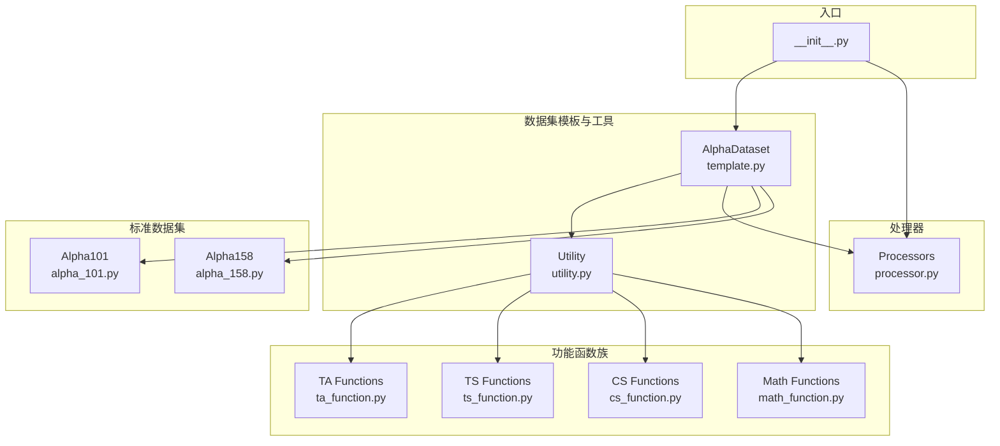
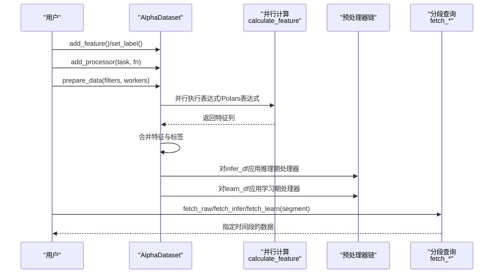
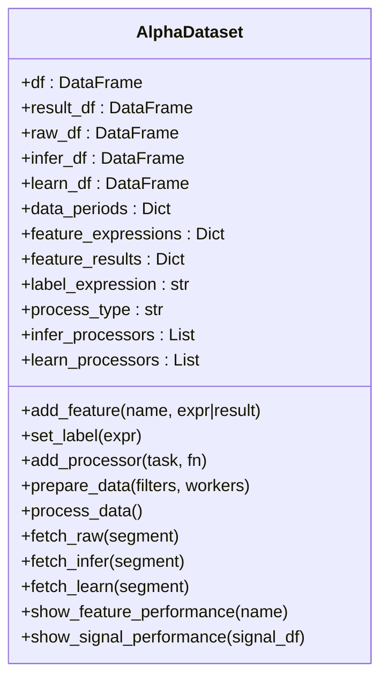
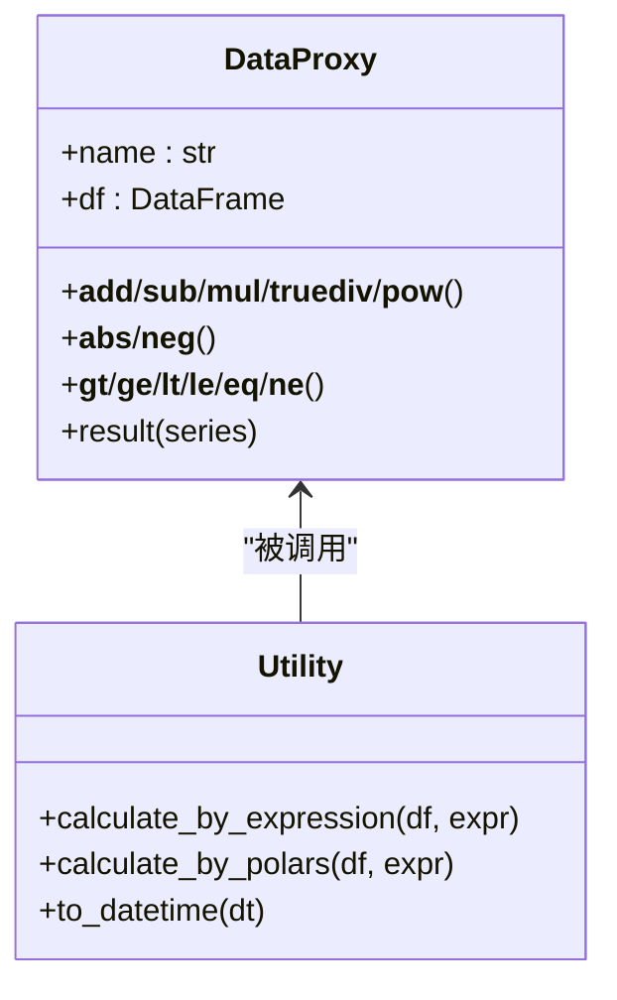
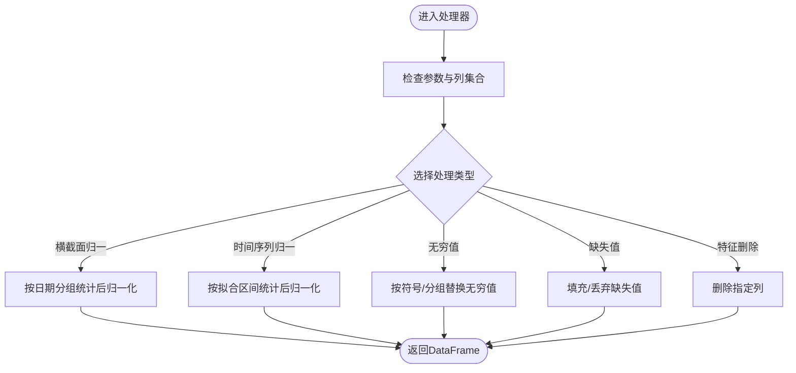
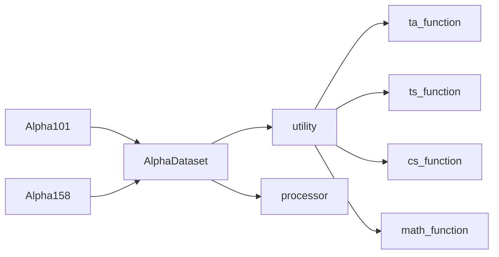

# Alpha数据集模块

<cite>
**本文引用的文件列表**
- [template.py](file://vnpy/alpha/dataset/template.py)
- [processor.py](file://vnpy/alpha/dataset/processor.py)
- [ta_function.py](file://vnpy/alpha/dataset/ta_function.py)
- [ts_function.py](file://vnpy/alpha/dataset/ts_function.py)
- [cs_function.py](file://vnpy/alpha/dataset/cs_function.py)
- [math_function.py](file://vnpy/alpha/dataset/math_function.py)
- [utility.py](file://vnpy/alpha/dataset/utility.py)
- [alpha_101.py](file://vnpy/alpha/dataset/datasets/alpha_101.py)
- [alpha_158.py](file://vnpy/alpha/dataset/datasets/alpha_158.py)
- [__init__.py](file://vnpy/alpha/dataset/__init__.py)
- [test_alpha101.py](file://tests/test_alpha101.py)
- [test_dataproxy.py](file://tests/alpha/test_dataproxy.py)
- [research_workflow_alpha101.ipynb](file://examples/alpha_research/research_workflow_alpha101.ipynb)
</cite>

## 目录
1. [简介](#简介)
2. [项目结构](#项目结构)
3. [核心组件](#核心组件)
4. [架构总览](#架构总览)
5. [详细组件分析](#详细组件分析)
6. [依赖关系分析](#依赖关系分析)
7. [性能考量](#性能考量)
8. [故障排查指南](#故障排查指南)
9. [结论](#结论)
10. [附录](#附录)

## 简介
本文件面向Alpha数据集模块，系统性梳理AlphaDataset模板类的设计与继承体系，详解数据处理器(Processor)工作机制与预处理流程，阐述技术分析函数(TA Functions)、时间序列函数(TS Functions)、横截面函数(CS Functions)的实现细节与应用场景，并说明数学函数库与实用工具函数的功能特性。最后给出Alpha101与Alpha158标准数据集的特征定义与使用方法，提供完整的特征工程示例与最佳实践指导，帮助读者快速上手并高效构建量化研究工作流。

## 项目结构
该模块位于 vnpy/alpha/dataset 下，采用“功能域+分层”的组织方式：
- 模板与工具：template.py（核心模板）、utility.py（工具与DataProxy）
- 数据集实现：datasets/alpha_101.py、datasets/alpha_158.py
- 功能函数族：ta_function.py（技术分析）、ts_function.py（时间序列）、cs_function.py（横截面）、math_function.py（数学运算）
- 处理器：processor.py（标准化、缺失值、无穷值等处理）
- 导出入口：__init__.py（统一导出）

图表来源
- [template.py](file://vnpy/alpha/dataset/template.py#L23-L306)
- [utility.py](file://vnpy/alpha/dataset/utility.py#L19-L286)
- [processor.py](file://vnpy/alpha/dataset/processor.py#L1-L202)
- [ta_function.py](file://vnpy/alpha/dataset/ta_function.py#L1-L44)
- [ts_function.py](file://vnpy/alpha/dataset/ts_function.py#L1-L330)
- [cs_function.py](file://vnpy/alpha/dataset/cs_function.py#L1-L65)
- [math_function.py](file://vnpy/alpha/dataset/math_function.py#L1-L168)
- [alpha_101.py](file://vnpy/alpha/dataset/datasets/alpha_101.py#L1-L331)
- [alpha_158.py](file://vnpy/alpha/dataset/datasets/alpha_158.py#L1-L131)
- [__init__.py](file://vnpy/alpha/dataset/__init__.py#L1-L31)

章节来源
- [template.py](file://vnpy/alpha/dataset/template.py#L23-L306)
- [__init__.py](file://vnpy/alpha/dataset/__init__.py#L1-L31)

## 核心组件
- AlphaDataset：数据集模板，负责特征表达式注册、标签设置、并行特征计算、数据筛选与分段查询、性能分析接口。
- DataProxy：特征数据代理，封装Polars DataFrame，支持表达式字符串与Polars表达式两种计算路径，提供丰富的算子重载与比较操作。
- Processor系列：标准化、缺失值填充、无穷值替换、时间序列/横截面归一化、特征删除等预处理函数。
- 功能函数族：TS/CS/TA/Math函数，覆盖滚动窗口统计、排名、协整、幂运算、条件选择等常用因子构建操作。
- 标准数据集：Alpha101与Alpha158，内置大量经典因子表达式与标签定义，便于直接复用。

章节来源
- [template.py](file://vnpy/alpha/dataset/template.py#L23-L306)
- [utility.py](file://vnpy/alpha/dataset/utility.py#L19-L286)
- [processor.py](file://vnpy/alpha/dataset/processor.py#L1-L202)
- [alpha_101.py](file://vnpy/alpha/dataset/datasets/alpha_101.py#L6-L331)
- [alpha_158.py](file://vnpy/alpha/dataset/datasets/alpha_158.py#L6-L131)

## 架构总览
下图展示AlphaDataset从特征表达式到最终学习数据的端到端流程，以及各功能函数族在其中的角色。

图表来源
- [template.py](file://vnpy/alpha/dataset/template.py#L90-L194)
- [utility.py](file://vnpy/alpha/dataset/utility.py#L203-L264)
- [processor.py](file://vnpy/alpha/dataset/processor.py#L1-L202)

## 详细组件分析

### AlphaDataset模板类
- 设计要点
  - 统一管理特征表达式字典与已计算结果字典，支持表达式字符串与Polars表达式混合。
  - 提供标签设置接口，便于后续建模阶段使用。
  - 分段数据管理：训练/验证/测试三段，通过Segment枚举与时间范围控制。
  - 并行特征计算：利用多进程池并行执行表达式，提升大规模数据处理效率。
  - 预处理管线：推理期(infer)与学习期(learn)分别维护处理器列表，支持“追加”模式。
  - 性能分析：基于Alphalens进行特征与信号的多维度表现评估。
- 关键方法
  - add_feature(name, expression|result)：注册特征或直接注入DataFrame结果。
  - set_label(expr)：设置预测标签表达式。
  - add_processor(task, fn)：向推理期或学习期添加处理器。
  - prepare_data(filters, max_workers)：并行计算特征，合并标签，按过滤器筛选，生成raw/infer/learn三套数据。
  - process_data()：依次应用推理期与学习期处理器。
  - fetch_raw/fetch_infer/fetch_learn(segment)：按时间段切片返回数据。
  - show_feature_performance(name)/show_signal_performance(signal_df)：调用Alphalens进行特征/信号分析。

图表来源
- [template.py](file://vnpy/alpha/dataset/template.py#L23-L194)

章节来源
- [template.py](file://vnpy/alpha/dataset/template.py#L23-L306)

### DataProxy与表达式计算
- DataProxy
  - 封装单列特征数据，自动重命名最后一列为"data"，保持索引列datetime与vt_symbol不变。
  - 提供丰富的算子重载（加减乘除、幂、取反、绝对值）与比较操作（>, <, == 等），返回新的DataProxy。
  - result()辅助将Series转换为DataProxy，便于链式表达式。
- 表达式计算
  - calculate_by_expression：在本地作用域动态导入TS/CS/TA/Math函数，将输入DataFrame的每列包装为DataProxy，再通过eval执行表达式。
  - calculate_by_polars：直接对DataFrame执行Polars表达式，返回新列。
  - to_datetime：统一时间格式解析。

图表来源
- [utility.py](file://vnpy/alpha/dataset/utility.py#L19-L286)

章节来源
- [utility.py](file://vnpy/alpha/dataset/utility.py#L19-L286)

### 处理器(Processor)工作机制
- 常用处理器
  - 缺失值处理：process_drop_na、process_fill_na、process_cs_fill_na
  - 无穷值处理：process_replace_inf
  - 归一化：process_cs_norm（横截面Z-Score/稳健）、process_ts_norm（时间序列Z-Score）、process_robust_zscore_norm（稳健Z-Score）、process_cs_rank_norm（横截面秩归一）
  - 特征选择：process_drop_feature
- 设计原则
  - 所有处理器均接收DataFrame与可选参数，返回清洗后的DataFrame。
  - 横截面处理基于“按日期分组”的窗口内统计；时间序列处理可限定拟合区间。
  - 支持对指定列集合进行处理，未指定时默认对除索引列外的数值列生效。

图表来源
- [processor.py](file://vnpy/alpha/dataset/processor.py#L9-L202)

章节来源
- [processor.py](file://vnpy/alpha/dataset/processor.py#L1-L202)

### 技术分析函数(TA Functions)
- 能力概述
  - 基于talib封装RSI、ATR等指标，按合约维度计算并返回DataProxy。
  - 内置DataProxy与pandas互转工具，便于与talib兼容。
- 典型场景
  - 在表达式中直接调用ta_rsi、ta_atr，作为特征或标签的一部分参与建模。

章节来源
- [ta_function.py](file://vnpy/alpha/dataset/ta_function.py#L1-L44)

### 时间序列函数(TS Functions)
- 能力概述
  - 滚动窗口统计：delay/min/max/argmax/argmin/rank/sum/mean/std/slope/rsquare/resi/corr/cov/product等。
  - 数学变换：log、abs、delta（差分）、quantile、decay_linear（线性衰减）。
  - 条件与比较：less/greater等。
- 性能优化
  - 斜率与决定系数等函数通过预计算常量与向量化表达式减少重复计算。
  - 使用rolling_map与over("vt_symbol")确保按股票分组的正确性。

章节来源
- [ts_function.py](file://vnpy/alpha/dataset/ts_function.py#L1-L330)

### 横截面函数(CS Functions)
- 能力概述
  - 横截面排名、均值、标准差、求和、缩放（按日期维度绝对值和归一化）。
- 应用场景
  - 将时序特征转换为跨股票的相对位置或规模，常用于因子中性化与标准化。

章节来源
- [cs_function.py](file://vnpy/alpha/dataset/cs_function.py#L1-L65)

### 数学函数库(Math Functions)
- 能力概述
  - 基础算子：less/greater、log、abs、sign、pow1/pow2（幂运算，含负基底与非整数指数的特殊处理）、quesval/quesval2（条件选择）。
- 设计要点
  - pow1针对单侧负值的安全处理；pow2支持DataProxy与DataProxy之间的幂运算，考虑NaN与整数指数判断。
  - quesval系列支持阈值比较与分支选择，便于构建分段逻辑。

章节来源
- [math_function.py](file://vnpy/alpha/dataset/math_function.py#L1-L168)

### Alpha101与Alpha158标准数据集
- Alpha101
  - 继承自AlphaDataset，构造函数中注册101个经典因子表达式，涵盖横截面、时间序列、技术分析与数学组合。
  - 设置标签为未来3日/1日回报率的比值形式，便于多步预测建模。
- Alpha158
  - 继承自AlphaDataset，提供K线形态、价格变化、时间序列统计、相关性与波动率等基础特征族。
  - 窗口长度统一为[5,10,20,30,60]，便于对比不同时间尺度的特征有效性。

章节来源
- [alpha_101.py](file://vnpy/alpha/dataset/datasets/alpha_101.py#L6-L331)
- [alpha_158.py](file://vnpy/alpha/dataset/datasets/alpha_158.py#L6-L131)

## 依赖关系分析
- 模块耦合
  - AlphaDataset依赖utility中的DataProxy与表达式计算函数，以及processor中的各类预处理函数。
  - 标准数据集Alpha101/Alpha158直接依赖AlphaDataset模板与utility中的表达式计算能力。
  - 功能函数族彼此独立，通过utility的动态导入在表达式计算时聚合。
- 外部依赖
  - Polars用于高性能数据结构与表达式计算。
  - Alphalens用于因子与信号的性能分析。
  - talib用于技术指标计算。

图表来源
- [template.py](file://vnpy/alpha/dataset/template.py#L1-L306)
- [utility.py](file://vnpy/alpha/dataset/utility.py#L1-L286)
- [alpha_101.py](file://vnpy/alpha/dataset/datasets/alpha_101.py#L1-L331)
- [alpha_158.py](file://vnpy/alpha/dataset/datasets/alpha_158.py#L1-L131)

章节来源
- [__init__.py](file://vnpy/alpha/dataset/__init__.py#L1-L31)

## 性能考量
- 并行计算
  - prepare_data内部使用多进程池并行执行表达式计算，建议根据CPU核数合理设置max_workers。
- 窗口与分组
  - 横截面与时间序列函数广泛使用over("vt_symbol")与over("datetime")，注意避免过大的窗口导致内存压力。
- 缺失值与无穷值
  - 建议在推理期先做缺失值与无穷值处理，学习期再做标准化，避免异常值影响统计量估计。
- 表达式复杂度
  - 复杂嵌套表达式可能带来计算开销，建议拆分为中间步骤或使用Polars表达式直接计算。

[本节为通用指导，无需特定文件来源]

## 故障排查指南
- 表达式报错
  - 确认表达式中使用的列名与DataFrame一致，且所有函数已在utility中动态导入。
  - 使用calculate_by_polars直接调试复杂表达式，定位语法问题。
- 缺失值与无穷值
  - 先用process_replace_inf替换无穷值，再用process_fill_na或process_drop_na处理缺失值。
  - 横截面归一化前建议先做fillna，避免分组统计异常。
- 性能瓶颈
  - 大窗口函数（如ts_rank、ts_corr、ts_resi）会显著增加计算成本，优先尝试Polars原生表达式或降低窗口。
- 分段数据不一致
  - 确保fetch_*使用相同的时间段与Segment枚举，避免索引列datetime与vt_symbol不匹配。

章节来源
- [utility.py](file://vnpy/alpha/dataset/utility.py#L203-L264)
- [processor.py](file://vnpy/alpha/dataset/processor.py#L1-L202)

## 结论
Alpha数据集模块以AlphaDataset为核心模板，结合DataProxy与功能函数族，提供了从特征表达式到标准化数据的完整流水线。通过标准数据集Alpha101/Alpha158，用户可以快速复用经典因子并开展建模实验。配合Processor系列与Alphalens分析能力，模块既满足学术研究的严谨性，也兼顾工程落地的可扩展性。

[本节为总结，无需特定文件来源]

## 附录

### Alpha101特征与标签定义
- 特征：101个经典因子表达式，覆盖横截面排名、时间序列动量、波动率、相关性、数学变换等。
- 标签：未来3日/1日回报率的比值形式，便于多步预测建模。

章节来源
- [alpha_101.py](file://vnpy/alpha/dataset/datasets/alpha_101.py#L6-L331)

### Alpha158特征与标签定义
- 特征：K线形态、价格变化、时间序列统计（ROC、MA、STD、BETA、RSQ、RESI等）、相关性与波动率等基础特征族。
- 标签：未来3日/1日回报率的比值形式。

章节来源
- [alpha_158.py](file://vnpy/alpha/dataset/datasets/alpha_158.py#L6-L131)

### 特征工程示例与最佳实践
- 示例参考
  - Jupyter示例展示了从加载数据、创建Alpha101数据集、添加预处理器、应用过滤器到分段获取数据的完整流程。
- 最佳实践
  - 先在推理期做缺失值与无穷值处理，再在学习期做标准化。
  - 使用Polars表达式直接计算复杂表达式，减少中间步骤。
  - 对高成本窗口函数进行降维或缓存中间结果。
  - 利用show_feature_performance与show_signal_performance进行回测前的特征质量评估。

章节来源
- [research_workflow_alpha101.ipynb](file://examples/alpha_research/research_workflow_alpha101.ipynb#L1-L200)
- [test_alpha101.py](file://tests/test_alpha101.py#L1-L677)
- [test_dataproxy.py](file://tests/alpha/test_dataproxy.py#L1-L107)