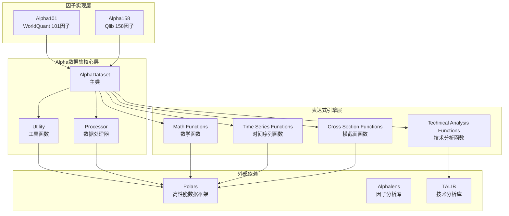
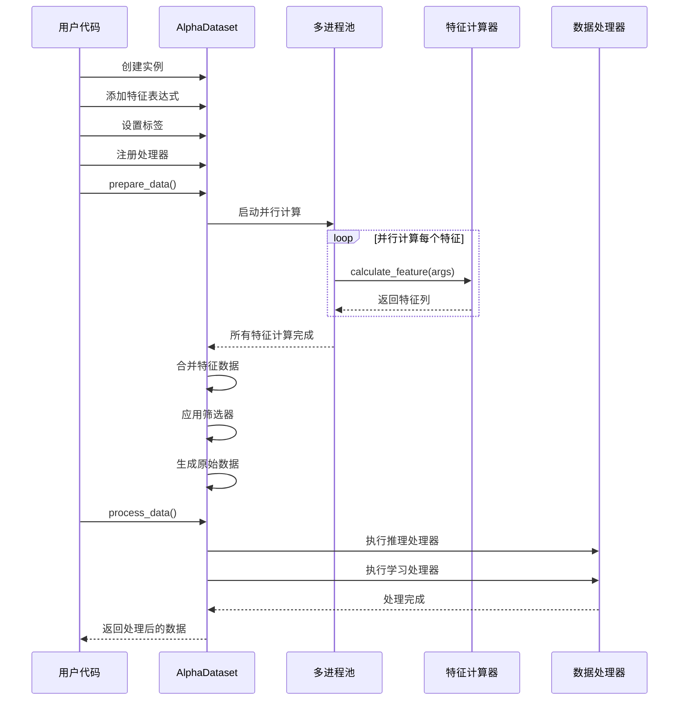
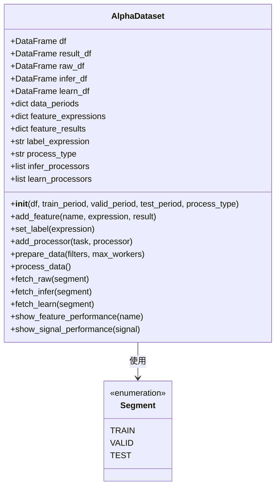
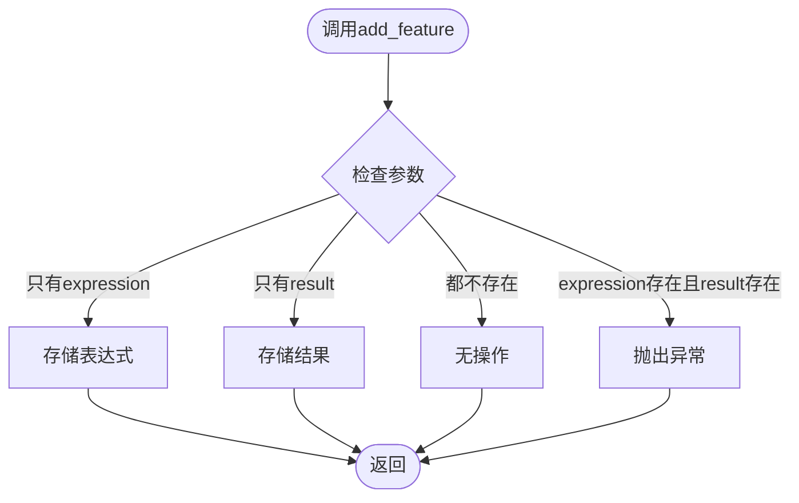
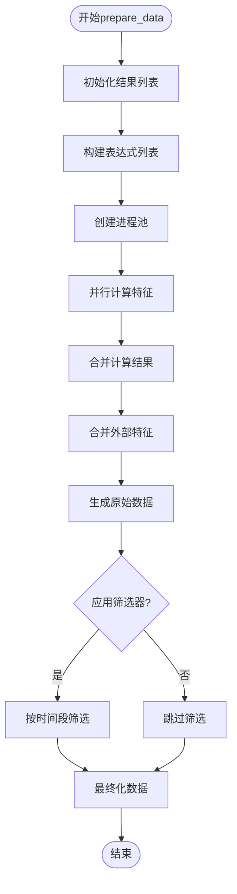
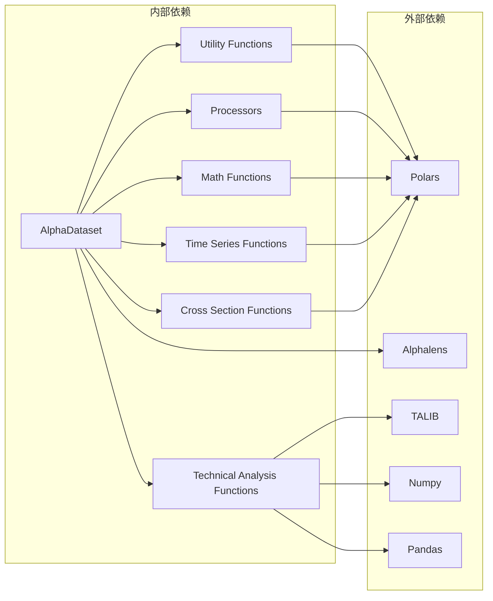
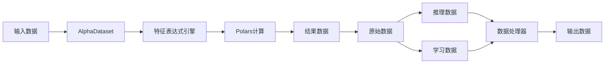

# Alpha数据集模板类

<cite>
**本文档引用的文件**
- [template.py](file://vnpy/alpha/dataset/template.py)
- [__init__.py](file://vnpy/alpha/dataset/__init__.py)
- [utility.py](file://vnpy/alpha/dataset/utility.py)
- [processor.py](file://vnpy/alpha/dataset/processor.py)
- [math_function.py](file://vnpy/alpha/dataset/math_function.py)
- [ts_function.py](file://vnpy/alpha/dataset/ts_function.py)
- [cs_function.py](file://vnpy/alpha/dataset/cs_function.py)
- [ta_function.py](file://vnpy/alpha/dataset/ta_function.py)
- [alpha_101.py](file://vnpy/alpha/dataset/datasets/alpha_101.py)
- [alpha_158.py](file://vnpy/alpha/dataset/datasets/alpha_158.py)
- [test_dataproxy.py](file://tests/alpha/test_dataproxy.py)
</cite>

## 目录
1. [简介](#简介)
2. [项目结构](#项目结构)
3. [核心组件](#核心组件)
4. [架构概览](#架构概览)
5. [详细组件分析](#详细组件分析)
6. [依赖关系分析](#依赖关系分析)
7. [性能考虑](#性能考虑)
8. [故障排除指南](#故障排除指南)
9. [结论](#结论)
10. [附录：完整使用示例](#附录完整使用示例)

## 简介

Alpha数据集模板类是vn.py量化框架中用于构建和管理Alpha因子研究数据集的核心组件。该类提供了完整的数据准备、特征工程、数据处理和分析功能，支持并行计算、跨时序和跨截面操作，以及丰富的技术分析指标。

本类特别适用于量化研究员进行因子开发、回测验证和性能评估，支持多种Alpha因子族（如WorldQuant Alpha101、Qlib Alpha158）的标准实现。

## 项目结构

Alpha数据集模块采用分层架构设计，主要包含以下层次：



**图表来源**
- [template.py](file://vnpy/alpha/dataset/template.py#L23-L306)
- [utility.py](file://vnpy/alpha/dataset/utility.py#L1-L286)
- [processor.py](file://vnpy/alpha/dataset/processor.py#L1-L202)

**章节来源**
- [template.py](file://vnpy/alpha/dataset/template.py#L1-L306)
- [__init__.py](file://vnpy/alpha/dataset/__init__.py#L1-L31)

## 核心组件

### AlphaDataset主类

AlphaDataset是整个系统的核心类，提供了完整的Alpha因子数据管理功能：

#### 主要特性
- **多阶段数据管理**：支持原始数据、推理数据、学习数据的分离管理
- **并行计算支持**：利用多进程并行计算特征表达式
- **灵活的数据处理**：支持自定义数据处理器链
- **完整的因子分析**：集成Alphalens进行因子性能分析

#### 关键属性
- `df`: 原始输入数据框
- `result_df`: 完成所有特征计算的结果数据
- `raw_df`: 清洗后的原始数据
- `infer_df`: 推理阶段数据
- `learn_df`: 学习阶段数据
- `data_periods`: 数据时间段配置

**章节来源**
- [template.py](file://vnpy/alpha/dataset/template.py#L23-L57)

## 架构概览

Alpha数据集模板类采用分层架构，从底层的数据处理到上层的因子分析形成完整的数据流水线：



**图表来源**
- [template.py](file://vnpy/alpha/dataset/template.py#L90-L173)
- [template.py](file://vnpy/alpha/dataset/template.py#L289-L305)

## 详细组件分析

### 1. 构造函数与初始化

构造函数负责初始化Alpha数据集的基本配置和状态：



**图表来源**
- [template.py](file://vnpy/alpha/dataset/template.py#L23-L57)
- [utility.py](file://vnpy/alpha/dataset/utility.py#L280-L286)

**章节来源**
- [template.py](file://vnpy/alpha/dataset/template.py#L26-L57)

### 2. 特征表达式添加机制

特征表达式添加机制支持两种模式：表达式计算和直接结果导入。

#### add_feature方法实现原理



**图表来源**
- [template.py](file://vnpy/alpha/dataset/template.py#L58-L74)

#### 表达式计算引擎

表达式计算通过动态表达式引擎实现，支持多种运算符和函数：

**章节来源**
- [template.py](file://vnpy/alpha/dataset/template.py#L58-L74)
- [utility.py](file://vnpy/alpha/dataset/utility.py#L203-L256)

### 3. 标签设置机制

标签设置用于定义预测目标变量，支持字符串表达式和Polars表达式两种格式。

**章节来源**
- [template.py](file://vnpy/alpha/dataset/template.py#L75-L79)

### 4. 处理器注册机制

处理器注册机制允许用户注册自定义的数据处理函数，支持推理阶段和学习阶段的不同处理策略。

**章节来源**
- [template.py](file://vnpy/alpha/dataset/template.py#L81-L88)

### 5. 数据准备流程

prepare_data方法实现了完整的数据准备流程，包括并行计算、数据合并和筛选逻辑。



**图表来源**
- [template.py](file://vnpy/alpha/dataset/template.py#L90-L157)

**章节来源**
- [template.py](file://vnpy/alpha/dataset/template.py#L90-L157)

### 6. 数据处理机制

process_data方法负责执行数据处理流程，支持推理和学习两个阶段的独立处理。

**章节来源**
- [template.py](file://vnpy/alpha/dataset/template.py#L159-L173)

### 7. 因子性能分析

Alpha数据集提供了完整的因子性能分析功能，包括单因子分析和信号分析。

**章节来源**
- [template.py](file://vnpy/alpha/dataset/template.py#L195-L272)

## 依赖关系分析

### 核心依赖关系



**图表来源**
- [template.py](file://vnpy/alpha/dataset/template.py#L1-L20)
- [processor.py](file://vnpy/alpha/dataset/processor.py#L1-L6)

**章节来源**
- [template.py](file://vnpy/alpha/dataset/template.py#L1-L20)
- [processor.py](file://vnpy/alpha/dataset/processor.py#L1-L6)

### 数据流依赖



**图表来源**
- [template.py](file://vnpy/alpha/dataset/template.py#L90-L173)

## 性能考虑

### 并行计算优化

Alpha数据集采用了多进程并行计算来加速特征表达式的计算：

1. **进程池管理**：使用Python的multiprocessing模块创建进程池
2. **内存共享**：通过spawn上下文确保进程间数据安全传递
3. **进度监控**：使用tqdm显示计算进度

### 内存管理

1. **延迟计算**：特征表达式采用延迟计算策略
2. **数据类型优化**：使用Polars的高效数据类型
3. **垃圾回收**：及时释放中间计算结果

### 计算复杂度

- **特征计算**：O(n × m × w)，其中n为样本数，m为特征数量，w为窗口大小
- **数据合并**：O(n × m)，其中m为特征数量
- **筛选操作**：O(n × k)，其中k为时间段数量

## 故障排除指南

### 常见问题及解决方案

#### 1. 特征计算错误

**问题**：特征表达式计算失败
**原因**：表达式语法错误或数据类型不匹配
**解决**：
- 检查表达式语法是否正确
- 确保数据类型兼容性
- 使用简单的表达式进行调试

#### 2. 内存不足

**问题**：大量特征计算导致内存溢出
**解决**：
- 减少同时计算的特征数量
- 调整max_workers参数
- 使用更高效的特征表达式

#### 3. 数据处理异常

**问题**：数据处理器执行失败
**解决**：
- 检查数据格式是否符合预期
- 验证处理器函数的输入参数
- 添加适当的错误处理逻辑

**章节来源**
- [template.py](file://vnpy/alpha/dataset/template.py#L90-L173)

## 结论

Alpha数据集模板类是一个功能完整、设计合理的量化数据管理框架。它提供了：

1. **完整的数据生命周期管理**：从数据准备到分析的全流程支持
2. **灵活的特征工程能力**：支持复杂的表达式计算和自定义处理器
3. **高性能的计算架构**：基于多进程并行和Polars优化
4. **丰富的分析工具**：集成Alphalens进行因子性能分析

该类特别适合量化研究人员进行Alpha因子的开发和验证工作，为构建专业的量化交易系统奠定了坚实的数据基础。

## 附录：完整使用示例

### 基础使用示例

```python
# 创建Alpha101数据集
from vnpy.alpha import Alpha101
import polars as pl

# 准备示例数据
df = pl.DataFrame({
    "datetime": ["2023-01-01", "2023-01-02", "2023-01-03"],
    "vt_symbol": ["AAPL", "AAPL", "AAPL"],
    "open": [150, 152, 148],
    "high": [155, 158, 152],
    "low": [148, 150, 146],
    "close": [152, 148, 150],
    "volume": [1000, 1200, 800],
    "vwap": [151, 151, 148]
})

# 创建数据集实例
dataset = Alpha101(
    df=df,
    train_period=("2023-01-01", "2023-01-15"),
    valid_period=("2023-01-16", "2023-01-31"),
    test_period=("2023-02-01", "2023-02-15")
)

# 准备数据
dataset.prepare_data()

# 处理数据
dataset.process_data()

# 获取训练数据
train_data = dataset.fetch_learn(Segment.TRAIN)
```

### 高级使用示例

```python
# 自定义数据处理器
def custom_processor(df):
    """自定义数据处理器示例"""
    return df.with_columns([
        pl.col("alpha1").fill_null(0).alias("alpha1_filled")
    ])

# 注册自定义处理器
dataset.add_processor("infer", custom_processor)
dataset.add_processor("learn", custom_processor)

# 使用自定义表达式函数
def custom_function(x):
    """自定义函数示例"""
    return x * 2

# 注册自定义函数
register_functions([custom_function])

# 添加自定义特征
dataset.add_feature("custom_feature", "custom_function(close)")
```

### 最佳实践指导

1. **数据质量保证**：
   - 确保输入数据的时间序列完整性
   - 处理缺失值和异常值
   - 验证数据范围和合理性

2. **性能优化建议**：
   - 合理设置max_workers参数
   - 优先使用Polars表达式而非字符串表达式
   - 分批处理大规模数据集

3. **代码组织规范**：
   - 将特征表达式定义在单独的模块中
   - 使用清晰的命名约定
   - 添加适当的注释和文档

4. **调试和测试**：
   - 先用小数据集验证逻辑正确性
   - 使用单元测试验证关键功能
   - 定期检查内存使用情况

**章节来源**
- [alpha_101.py](file://vnpy/alpha/dataset/datasets/alpha_101.py#L1-L331)
- [alpha_158.py](file://vnpy/alpha/dataset/datasets/alpha_158.py#L1-L131)
- [test_dataproxy.py](file://tests/alpha/test_dataproxy.py#L1-L107)