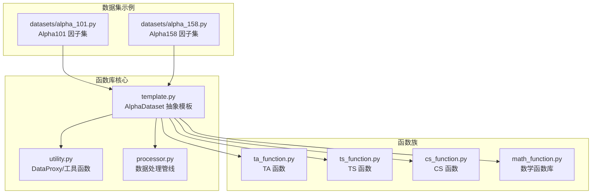
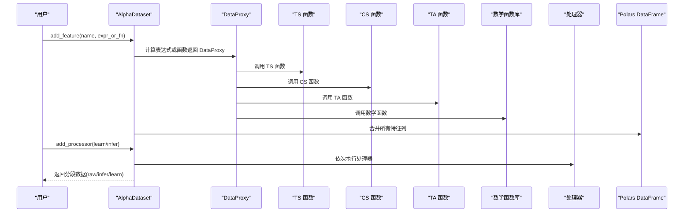
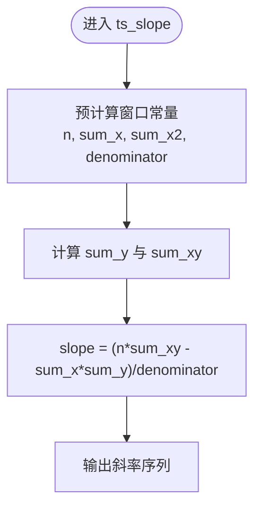
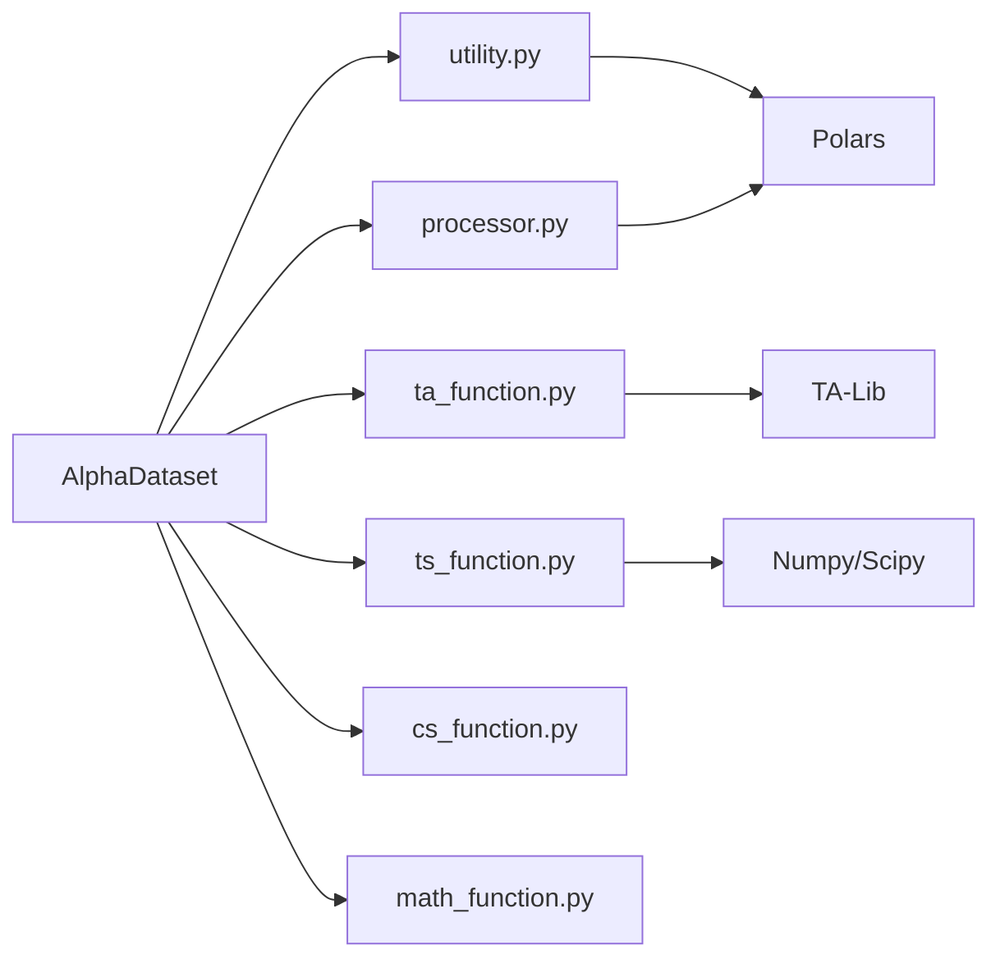

# 函数库集合

<cite>
**本文引用的文件列表**
- [vnpy/alpha/dataset/__init__.py](file://vnpy/alpha/dataset/__init__.py)
- [vnpy/alpha/dataset/template.py](file://vnpy/alpha/dataset/template.py)
- [vnpy/alpha/dataset/utility.py](file://vnpy/alpha/dataset/utility.py)
- [vnpy/alpha/dataset/ta_function.py](file://vnpy/alpha/dataset/ta_function.py)
- [vnpy/alpha/dataset/ts_function.py](file://vnpy/alpha/dataset/ts_function.py)
- [vnpy/alpha/dataset/cs_function.py](file://vnpy/alpha/dataset/cs_function.py)
- [vnpy/alpha/dataset/math_function.py](file://vnpy/alpha/dataset/math_function.py)
- [vnpy/alpha/dataset/processor.py](file://vnpy/alpha/dataset/processor.py)
- [vnpy/alpha/dataset/datasets/alpha_101.py](file://vnpy/alpha/dataset/datasets/alpha_101.py)
- [vnpy/alpha/dataset/datasets/alpha_158.py](file://vnpy/alpha/dataset/datasets/alpha_158.py)
- [tests/test_alpha101.py](file://tests/test_alpha101.py)
- [vnpy/alpha/lab.py](file://vnpy/alpha/lab.py)
- [examples/alpha_research/download_data_rq.ipynb](file://examples/alpha_research/download_data_rq.ipynb)
</cite>

## 目录
1. [简介](#简介)
2. [项目结构](#项目结构)
3. [核心组件](#核心组件)
4. [架构总览](#架构总览)
5. [详细组件分析](#详细组件分析)
6. [依赖关系分析](#依赖关系分析)
7. [性能考量](#性能考量)
8. [故障排查指南](#故障排查指南)
9. [结论](#结论)
10. [附录](#附录)

## 简介
本文件面向Alpha数据集函数库，系统化梳理技术分析函数(TA Functions)、时间序列函数(TS Functions)、横截面函数(CS Functions)与数学函数库(math_function)的实现与使用方法。文档从数据结构、算法原理、参数配置、输入输出格式、性能特性到实践示例与组合应用进行全面阐述，帮助使用者快速掌握特征工程与因子研究流程。

## 项目结构
该函数库位于 vnpy/alpha/dataset 目录下，围绕 AlphaDataset 抽象模板构建，通过 DataProxy 对 Polars 数据进行表达式与函数式封装，并提供多种处理器用于标准化与清洗。

图表来源
- [vnpy/alpha/dataset/template.py](file://vnpy/alpha/dataset/template.py#L23-L306)
- [vnpy/alpha/dataset/utility.py](file://vnpy/alpha/dataset/utility.py#L19-L286)
- [vnpy/alpha/dataset/processor.py](file://vnpy/alpha/dataset/processor.py#L1-L202)
- [vnpy/alpha/dataset/ta_function.py](file://vnpy/alpha/dataset/ta_function.py#L1-L44)
- [vnpy/alpha/dataset/ts_function.py](file://vnpy/alpha/dataset/ts_function.py#L1-L330)
- [vnpy/alpha/dataset/cs_function.py](file://vnpy/alpha/dataset/cs_function.py#L1-L65)
- [vnpy/alpha/dataset/math_function.py](file://vnpy/alpha/dataset/math_function.py#L1-L168)
- [vnpy/alpha/dataset/datasets/alpha_101.py](file://vnpy/alpha/dataset/datasets/alpha_101.py#L1-L331)
- [vnpy/alpha/dataset/datasets/alpha_158.py](file://vnpy/alpha/dataset/datasets/alpha_158.py#L1-L131)

章节来源
- [vnpy/alpha/dataset/__init__.py](file://vnpy/alpha/dataset/__init__.py#L1-L31)
- [vnpy/alpha/dataset/template.py](file://vnpy/alpha/dataset/template.py#L23-L306)

## 核心组件
- AlphaDataset：统一的因子生成与数据管理抽象，支持表达式与函数式特征添加、标签设置、分段查询与性能分析。
- DataProxy：对单变量特征进行封装，提供算术、比较、逻辑运算与链式调用能力，兼容 Polars 表达式与字符串表达式两种计算路径。
- 处理器(Processor)：提供缺失值填充、无穷替换、跨时序/跨截面归一化、去极值等标准化流程。
- 函数族：按领域划分的函数集合，覆盖 TA、TS、CS、数学运算四类。

章节来源
- [vnpy/alpha/dataset/template.py](file://vnpy/alpha/dataset/template.py#L23-L306)
- [vnpy/alpha/dataset/utility.py](file://vnpy/alpha/dataset/utility.py#L19-L286)
- [vnpy/alpha/dataset/processor.py](file://vnpy/alpha/dataset/processor.py#L1-L202)

## 架构总览
整体采用“表达式/函数式特征 + DataProxy 封装 + AlphaDataset 统一调度”的架构。表达式与函数式两种路径最终都产出 DataProxy，再由 AlphaDataset 合并为统一的特征表。

图表来源
- [vnpy/alpha/dataset/template.py](file://vnpy/alpha/dataset/template.py#L58-L194)
- [vnpy/alpha/dataset/utility.py](file://vnpy/alpha/dataset/utility.py#L203-L264)
- [vnpy/alpha/dataset/ts_function.py](file://vnpy/alpha/dataset/ts_function.py#L12-L330)
- [vnpy/alpha/dataset/cs_function.py](file://vnpy/alpha/dataset/cs_function.py#L10-L65)
- [vnpy/alpha/dataset/ta_function.py](file://vnpy/alpha/dataset/ta_function.py#L24-L44)
- [vnpy/alpha/dataset/math_function.py](file://vnpy/alpha/dataset/math_function.py#L10-L168)
- [vnpy/alpha/dataset/processor.py](file://vnpy/alpha/dataset/processor.py#L9-L202)

## 详细组件分析

### AlphaDataset 抽象模板
- 责任边界：统一管理特征表达式/结果、标签表达式、训练/验证/测试分段、推理/学习阶段的数据处理管线。
- 关键流程：
  - 特征准备：并行计算表达式或直接注入结果，合并为统一 DataFrame。
  - 过滤与筛选：按成分股范围过滤，仅保留特征列。
  - 分段查询：按时间段返回 raw/infer/learn 数据。
  - 性能分析：基于 alphalens 的因子与收益分析。
- 输入输出：
  - 输入：DataFrame(含 datetime, vt_symbol, OHLCV 等字段)、训练/验证/测试时间段、可选过滤条件。
  - 输出：raw_df、infer_df、learn_df 三类分段数据；支持导出性能分析图谱。

章节来源
- [vnpy/alpha/dataset/template.py](file://vnpy/alpha/dataset/template.py#L23-L306)

### DataProxy 数据代理
- 设计要点：将单变量特征封装为 DataProxy，提供算术/比较/逻辑运算重载，支持与数值或另一个 DataProxy 混合运算。
- 计算路径：
  - 字符串表达式：通过 calculate_by_expression 动态导入函数并执行。
  - Polars 表达式：通过 calculate_by_polars 直接执行。
- 典型用法：在表达式中以变量名引用已存在的列，自动包装为 DataProxy 参与运算。

章节来源
- [vnpy/alpha/dataset/utility.py](file://vnpy/alpha/dataset/utility.py#L19-L286)

### 时间序列函数(TS Functions)
- 能力概览：滚动窗口统计、回归拟合、相关性/协方差、排名/量化、延迟/差分、线性衰减加权等。
- 数学原理与优化：
  - ts_slope/ts_rsquare/ts_resi：预计算窗口内常量，避免重复计算，提升性能。
  - ts_corr：利用 Polars rolling_corr 与窗口化 over("vt_symbol") 实现分合约滚动相关。
  - ts_rank：使用 percentileofscore 计算分位排名。
  - ts_quantile：线性插值计算分位数。
  - ts_decay_linear：线性权重求和，权重为递减整数序列。
- 参数与输入输出：
  - window：滚动窗口大小，整数。
  - feature1/feature2：DataProxy 或数值常量。
  - quantile：分位数阈值，0~1。
- 使用场景：动量、反转、动量斜率、波动率、择时信号等。

图表来源
- [vnpy/alpha/dataset/ts_function.py](file://vnpy/alpha/dataset/ts_function.py#L102-L127)

章节来源
- [vnpy/alpha/dataset/ts_function.py](file://vnpy/alpha/dataset/ts_function.py#L12-L330)

### 横截面函数(CS Functions)
- 能力概览：跨日(按日期)对同一时刻所有股票进行排序、均值/标准差/求和、绝对值求和缩放。
- 数学原理：
  - cs_rank：按日期分组进行秩变换。
  - cs_scale：按日期分组对特征做绝对值求和，非零则归一化。
- 参数与输入输出：
  - 无额外参数，直接对 DataProxy 执行。
- 使用场景：跨市场风格因子、行业/风格中性化、IC 分析前的去极值与标准化。

章节来源
- [vnpy/alpha/dataset/cs_function.py](file://vnpy/alpha/dataset/cs_function.py#L10-L65)

### 技术分析函数(TA Functions)
- 能力概览：基于 TA-Lib 的指标封装，如 RSI、ATR。
- 实现方式：将 DataProxy 转为 pandas Series，调用 TA-Lib 计算后转回 Polars DataFrame。
- 注意事项：TA-Lib 返回的 Series 会丢失索引，需重新以 datetime/vt_symbol 重建索引。
- 使用场景：传统技术指标作为特征或信号源。

章节来源
- [vnpy/alpha/dataset/ta_function.py](file://vnpy/alpha/dataset/ta_function.py#L12-L44)

### 数学函数库(math_function)
- 能力概览：基础数学运算与条件选择函数，包括最小/最大、对数、绝对值、符号、幂次、条件选择等。
- 特殊处理：
  - pow1/pow2：对负底数幂的边界情况做安全处理，避免非法域。
  - quesval/quesval2：三元条件选择，支持阈值与特征的混合比较。
- 使用场景：因子构造中的非线性变换、分段映射、符号提取等。

章节来源
- [vnpy/alpha/dataset/math_function.py](file://vnpy/alpha/dataset/math_function.py#L10-L168)

### 数据处理管线(Processor)
- 能力概览：缺失值处理、无穷替换、跨截面/时间序列归一化、去极值、特征删除等。
- 关键函数：
  - process_fill_na/process_drop_na：按列或全表处理缺失值。
  - process_cs_norm/process_robust_zscore_norm：跨日分组归一化，支持鲁棒与 z-score。
  - process_ts_norm：按时间窗口统计量归一化。
  - process_cs_rank_norm：跨日秩归一化。
  - process_replace_inf：按合约替换无穷值为均值。
  - process_cs_fill_na：按日期分组用均值填充缺失。
- 使用场景：特征工程标准化、异常值处理、模型训练前的数据清洗。

章节来源
- [vnpy/alpha/dataset/processor.py](file://vnpy/alpha/dataset/processor.py#L9-L202)

### 数据集示例：Alpha101 与 Alpha158
- Alpha101：实现 WorldQuant 101 个经典因子，大量使用 TS/CS/数学函数与 TA 函数组合。
- Alpha158：实现 Qlib 基础因子集，涵盖蜡烛图形态、价格变化率、多周期滚动统计与相关性等。
- 使用方式：继承 AlphaDataset，在 __init__ 中通过 add_feature/add_label 注册表达式，最终由 AlphaDataset 统一生成特征表。

章节来源
- [vnpy/alpha/dataset/datasets/alpha_101.py](file://vnpy/alpha/dataset/datasets/alpha_101.py#L6-L331)
- [vnpy/alpha/dataset/datasets/alpha_158.py](file://vnpy/alpha/dataset/datasets/alpha_158.py#L6-L131)

## 依赖关系分析
- 模块耦合：
  - AlphaDataset 依赖 utility(DataProxy、表达式计算)、processor(数据处理)、ta/ts/cs/math 函数族。
  - DataProxy 作为统一数据载体，被各函数族广泛使用。
  - 处理器独立于函数族，但依赖 Polars 进行高效计算。
- 外部依赖：
  - Polars：高性能结构化数据分析与表达式引擎。
  - TA-Lib：技术分析指标库。
  - Scipy/Numpy：统计与数值计算。
  - alphalens：因子分析与收益评估。

图表来源
- [vnpy/alpha/dataset/template.py](file://vnpy/alpha/dataset/template.py#L15-L20)
- [vnpy/alpha/dataset/ta_function.py](file://vnpy/alpha/dataset/ta_function.py#L5-L9)
- [vnpy/alpha/dataset/ts_function.py](file://vnpy/alpha/dataset/ts_function.py#L5-L7)
- [vnpy/alpha/dataset/processor.py](file://vnpy/alpha/dataset/processor.py#L3-L6)

## 性能考量
- 并行计算：AlphaDataset 在准备阶段使用多进程池并行计算表达式，显著缩短特征生成时间。
- 窗口计算优化：TS 函数中对线性回归斜率、R²、残差等进行常量预计算，减少重复开销。
- 内存与类型：统一使用 Float64 类型，避免隐式转换带来的性能损耗；NaN/Inf 处理采用向量化操作。
- I/O：建议使用 Parquet 存储，加载/写入高效；注意索引与分区策略。

[本节为通用指导，不直接分析具体文件]

## 故障排查指南
- 表达式解析错误：
  - 确认表达式中变量名与 DataFrame 列名一致，且已在当前作用域注册为 DataProxy。
  - 使用 register_functions 注册自定义函数。
- 缺失值与无穷值：
  - 使用 process_fill_na/process_drop_na/process_replace_inf 处理 NaN/Inf。
  - 对于时间序列归一化，确保 fit 时间窗有效。
- 归一化异常：
  - 若标准差为 0，process_ts_norm 会回退为原值；必要时检查数据是否单调。
  - 鲁棒归一化中 MAD 会加上极小值防止除零。
- 性能问题：
  - 大窗口滚动函数可能成为瓶颈，优先考虑降窗或缓存中间结果。
  - 使用 Polars 表达式而非 Python 循环，充分利用向量化。

章节来源
- [vnpy/alpha/dataset/processor.py](file://vnpy/alpha/dataset/processor.py#L80-L185)
- [vnpy/alpha/dataset/utility.py](file://vnpy/alpha/dataset/utility.py#L13-L17)

## 结论
该函数库以 AlphaDataset 为核心，结合 DataProxy 与多类函数族，提供了从表达式到特征表的一站式解决方案。通过标准化的处理管线与高效的 Polars 引擎，能够快速构建高质量的因子数据集，并支持后续建模与回测。建议在实际使用中遵循“先表达式、后函数、再处理器”的流程，配合测试用例与性能监控，确保结果稳定可靠。

[本节为总结性内容，不直接分析具体文件]

## 附录

### 函数使用示例与组合应用
- 示例一：构建 Alpha101 中的 Alpha#1
  - 表达式路径：通过 Alpha101.add_feature 注册表达式，内部调用 calculate_by_expression。
  - 组合要点：ts_delay、ts_std、ts_argmax、cs_rank、pow1、quesval 等函数组合。
  - 参考路径：[vnpy/alpha/dataset/datasets/alpha_101.py](file://vnpy/alpha/dataset/datasets/alpha_101.py#L27)
- 示例二：构建 Alpha158 的多周期滚动统计
  - 表达式路径：通过循环添加多个窗口的 ts_mean/ts_std/ts_slope/ts_rsquare 等。
  - 组合要点：ts_mean/ts_std/ts_slope/ts_rsquare/ts_resi/ts_rank/ts_corr 等。
  - 参考路径：[vnpy/alpha/dataset/datasets/alpha_158.py](file://vnpy/alpha/dataset/datasets/alpha_158.py#L40-L127)
- 示例三：跨截面标准化与去极值
  - 处理器路径：process_cs_norm/process_robust_zscore_norm/process_cs_rank_norm。
  - 组合要点：先按日期分组进行秩/鲁棒归一化，再对特定列进行 clip。
  - 参考路径：[vnpy/alpha/dataset/processor.py](file://vnpy/alpha/dataset/processor.py#L34-L201)

### 数据准备与加载
- 使用 AlphaLab 读取/保存日线数据，自动拼接与去重，生成包含 vwap 的 DataFrame。
- 支持按扩展天数加载历史窗口，便于滚动计算。
- 参考路径：
  - [vnpy/alpha/lab.py](file://vnpy/alpha/lab.py#L156-L243)
  - [examples/alpha_research/download_data_rq.ipynb](file://examples/alpha_research/download_data_rq.ipynb#L1-L195)

### 测试与验证
- 单元测试覆盖 Alpha101 的全部因子表达式，确保计算稳定性与一致性。
- 参考路径：[tests/test_alpha101.py](file://tests/test_alpha101.py#L69-L677)