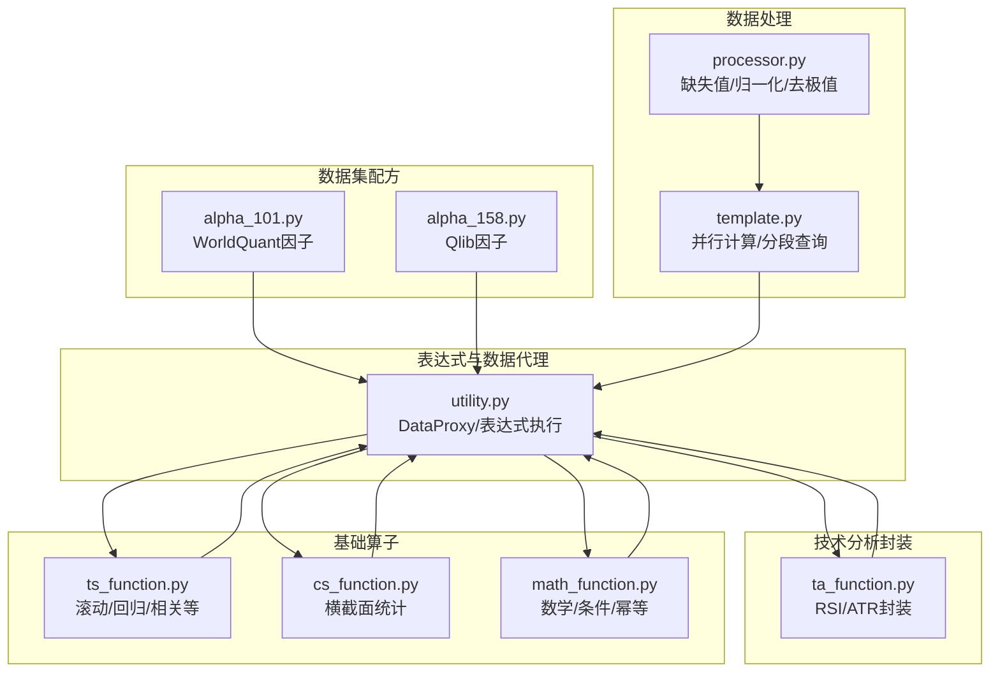
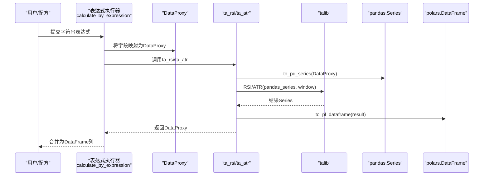
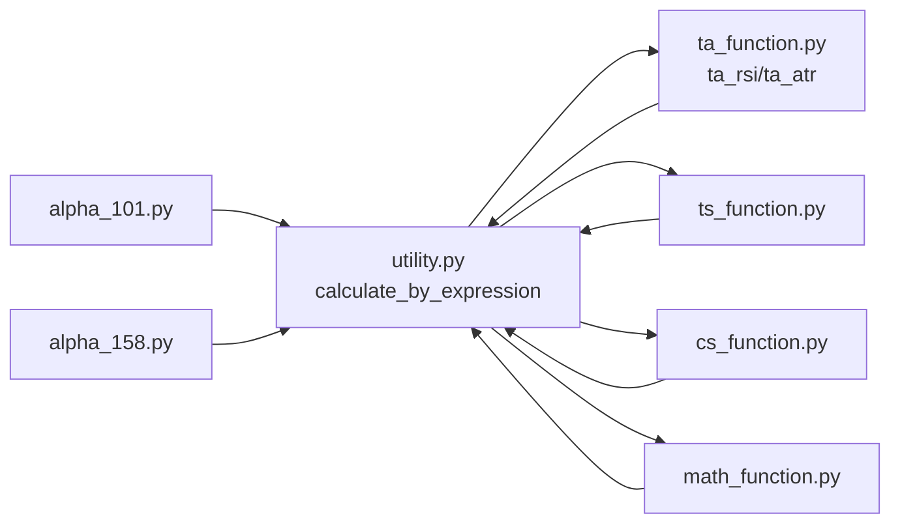

# 技术分析函数

<cite>
**本文引用的文件**
- [ta_function.py](file://vnpy/alpha/dataset/ta_function.py)
- [utility.py](file://vnpy/alpha/dataset/utility.py)
- [ts_function.py](file://vnpy/alpha/dataset/ts_function.py)
- [cs_function.py](file://vnpy/alpha/dataset/cs_function.py)
- [math_function.py](file://vnpy/alpha/dataset/math_function.py)
- [alpha_101.py](file://vnpy/alpha/dataset/datasets/alpha_101.py)
- [alpha_158.py](file://vnpy/alpha/dataset/datasets/alpha_158.py)
- [processor.py](file://vnpy/alpha/dataset/processor.py)
- [template.py](file://vnpy/alpha/dataset/template.py)
- [download_data_rq.ipynb](file://examples/alpha_research/download_data_rq.ipynb)
</cite>

## 目录
1. [引言](#引言)
2. [项目结构](#项目结构)
3. [核心组件](#核心组件)
4. [架构总览](#架构总览)
5. [详细组件分析](#详细组件分析)
6. [依赖关系分析](#依赖关系分析)
7. [性能考量](#性能考量)
8. [故障排查指南](#故障排查指南)
9. [结论](#结论)
10. [附录](#附录)

## 引言
本文件面向技术分析函数库的使用者与开发者，系统性梳理vn.py Alpha子系统中的技术分析函数实现与使用方法。重点覆盖以下内容：
- RSI（相对强弱指数）、ATR（平均真实波幅）等经典技术指标的实现原理、参数配置与计算逻辑
- 与talib库的集成方式与数据转换机制
- 在Alpha数据集（如Alpha101、Alpha158）中的使用范式：数据预处理、函数调用与结果解释
- 性能特点、适用场景与最佳实践

## 项目结构
Alpha技术分析功能位于vnpy/alpha/dataset目录下，围绕“表达式驱动”的特征工程体系组织：
- 数据代理与表达式执行：utility.py
- 时间序列操作：ts_function.py
- 横截面操作：cs_function.py
- 数学运算：math_function.py
- 技术分析封装：ta_function.py
- 数据集配方：datasets/alpha_101.py、datasets/alpha_158.py
- 数据处理流水线：processor.py
- 数据集模板与并行计算：template.py
- 示例数据准备：examples/alpha_research/download_data_rq.ipynb

图表来源
- [utility.py](file://vnpy/alpha/dataset/utility.py#L19-L286)
- [ta_function.py](file://vnpy/alpha/dataset/ta_function.py#L1-L44)
- [ts_function.py](file://vnpy/alpha/dataset/ts_function.py#L1-L330)
- [cs_function.py](file://vnpy/alpha/dataset/cs_function.py#L1-L65)
- [math_function.py](file://vnpy/alpha/dataset/math_function.py#L1-L168)
- [alpha_101.py](file://vnpy/alpha/dataset/datasets/alpha_101.py#L1-L331)
- [alpha_158.py](file://vnpy/alpha/dataset/datasets/alpha_158.py#L1-L131)
- [processor.py](file://vnpy/alpha/dataset/processor.py#L1-L202)
- [template.py](file://vnpy/alpha/dataset/template.py#L1-L306)

章节来源
- [ta_function.py](file://vnpy/alpha/dataset/ta_function.py#L1-L44)
- [utility.py](file://vnpy/alpha/dataset/utility.py#L19-L286)
- [ts_function.py](file://vnpy/alpha/dataset/ts_function.py#L1-L330)
- [cs_function.py](file://vnpy/alpha/dataset/cs_function.py#L1-L65)
- [math_function.py](file://vnpy/alpha/dataset/math_function.py#L1-L168)
- [alpha_101.py](file://vnpy/alpha/dataset/datasets/alpha_101.py#L1-L331)
- [alpha_158.py](file://vnpy/alpha/dataset/datasets/alpha_158.py#L1-L131)
- [processor.py](file://vnpy/alpha/dataset/processor.py#L1-L202)
- [template.py](file://vnpy/alpha/dataset/template.py#L1-L306)

## 核心组件
- DataProxy：统一特征数据容器，支持与数值、DataProxy对象的四则运算、比较、幂次等，并内置按合约分组的窗口化算子结果封装。
- 表达式执行器：通过字符串表达式或Polars表达式对特征进行组合与计算，自动注入基础算子与ta封装函数。
- 技术分析封装：ta_rsi、ta_atr基于talib实现，负责将DataProxy转换为pandas Series后调用talib，再转回DataProxy。
- 基础算子：ts_*（滚动统计/回归/相关/量化）、cs_*（横截面统计/缩放）、math_*（数学/条件/幂）。

章节来源
- [utility.py](file://vnpy/alpha/dataset/utility.py#L19-L286)
- [ta_function.py](file://vnpy/alpha/dataset/ta_function.py#L24-L44)
- [ts_function.py](file://vnpy/alpha/dataset/ts_function.py#L12-L330)
- [cs_function.py](file://vnpy/alpha/dataset/cs_function.py#L10-L65)
- [math_function.py](file://vnpy/alpha/dataset/math_function.py#L10-L168)

## 架构总览
技术分析函数在表达式层以“函数调用”的形式出现，底层由DataProxy承载数据，通过utility.py的表达式执行器完成解析与并行计算；ta封装函数负责与talib的桥接与数据类型转换。

图表来源
- [utility.py](file://vnpy/alpha/dataset/utility.py#L203-L256)
- [ta_function.py](file://vnpy/alpha/dataset/ta_function.py#L12-L44)

章节来源
- [utility.py](file://vnpy/alpha/dataset/utility.py#L203-L256)
- [ta_function.py](file://vnpy/alpha/dataset/ta_function.py#L12-L44)

## 详细组件分析

### RSI（相对强弱指数）
- 实现位置与调用
  - ta_rsi函数封装了talib.RSI，接收DataProxy类型的close与整型窗口window。
  - 内部通过to_pd_series/pandas Series/talib.RSI/to_pl_dataframe完成数据桥接与转换。
- 参数与计算逻辑
  - 输入：DataProxy(close)、window（整数周期）
  - 计算：对每个合约分组，按时间序列计算RSI(window)。
- 使用示例（在Alpha数据集中的配方写法）
  - 可参考Alpha101/Alpha158中对ta_rsi的间接使用方式（配方中通过表达式组合调用），例如在Alpha158中使用ts_*系列构建RSI相关特征时，可类比引入ta_rsi作为基础。
- 结果解释
  - 输出为DataProxy，对应每条记录的RSI值，可用于后续标准化、分位排名或与其他因子合成。

章节来源
- [ta_function.py](file://vnpy/alpha/dataset/ta_function.py#L24-L31)
- [alpha_101.py](file://vnpy/alpha/dataset/datasets/alpha_101.py#L1-L331)
- [alpha_158.py](file://vnpy/alpha/dataset/datasets/alpha_158.py#L1-L131)

### ATR（平均真实波幅）
- 实现位置与调用
  - ta_atr函数封装了talib.ATR，接收DataProxy类型的high、low、close与整型窗口window。
  - 同样通过to_pd_series/pandas Series/talib.ATR/to_pl_dataframe完成桥接。
- 参数与计算逻辑
  - 输入：DataProxy(high)、DataProxy(low)、DataProxy(close)、window
  - 计算：对每个合约分组，按时间序列计算ATR(window)。
- 使用示例（在Alpha数据集中的配方写法）
  - 可在配方中直接以表达式形式调用ta_atr，结合ts_*（如ts_mean、ts_std）进行进一步加工，形成波动率类因子。

章节来源
- [ta_function.py](file://vnpy/alpha/dataset/ta_function.py#L34-L44)
- [alpha_101.py](file://vnpy/alpha/dataset/datasets/alpha_101.py#L1-L331)
- [alpha_158.py](file://vnpy/alpha/dataset/datasets/alpha_158.py#L1-L131)

### 与talib的集成与数据转换机制
- 类型桥接
  - DataProxy → pandas.Series：用于兼容talib输入要求
  - talib输出Series → polars.DataFrame：保持统一的数据结构
- 分组与窗口
  - 所有ta封装函数均在内部将DataProxy转换为Series后进行计算，未显式传入分组键，因此默认按DataProxy内部索引（datetime, vt_symbol）进行分组计算。
- 注意事项
  - 若输入存在NaN或不完整序列，需配合数据预处理（如填充、去极值、缺失值处理）以保证talib计算稳定。

章节来源
- [ta_function.py](file://vnpy/alpha/dataset/ta_function.py#L12-L44)
- [utility.py](file://vnpy/alpha/dataset/utility.py#L19-L286)

### 在Alpha数据集中的使用范式
- Alpha101与Alpha158均采用“配方式”定义特征表达式，通过字符串表达式组合基础算子与ta封装函数，最终由表达式执行器生成DataFrame列。
- 典型流程
  - 定义特征表达式（字符串或Polars表达式）
  - 调用prepare_data并行计算
  - 可选：添加数据处理器（缺失值、归一化、去极值等）
  - 分段查询训练/验证/测试集
- 示例路径
  - Alpha101配方：[alpha_101.py](file://vnpy/alpha/dataset/datasets/alpha_101.py#L24-L331)
  - Alpha158配方：[alpha_158.py](file://vnpy/alpha/dataset/datasets/alpha_158.py#L24-L131)
  - 表达式执行入口：[utility.py](file://vnpy/alpha/dataset/utility.py#L203-L256)
  - 并行计算与模板：[template.py](file://vnpy/alpha/dataset/template.py#L90-L132)

章节来源
- [alpha_101.py](file://vnpy/alpha/dataset/datasets/alpha_101.py#L24-L331)
- [alpha_158.py](file://vnpy/alpha/dataset/datasets/alpha_158.py#L24-L131)
- [utility.py](file://vnpy/alpha/dataset/utility.py#L203-L256)
- [template.py](file://vnpy/alpha/dataset/template.py#L90-L132)

### 数据预处理与结果解释
- 缺失值与异常值处理
  - 处理NaN/Inf：process_drop_na、process_fill_na、process_replace_inf
  - 归一化：process_cs_norm（鲁棒/z-score）、process_ts_norm、process_robust_zscore_norm、process_cs_rank_norm
  - 横截面填充：process_cs_fill_na
- 结果解释
  - DataProxy输出为每条记录的单列数值，可直接参与后续表达式计算或作为模型输入。
  - 与Alphalens结合可进行因子收益性分析（模板中已提供接口）。

章节来源
- [processor.py](file://vnpy/alpha/dataset/processor.py#L9-L202)
- [template.py](file://vnpy/alpha/dataset/template.py#L195-L272)

## 依赖关系分析
- 表达式执行器依赖基础算子与ta封装函数，通过局部导入将函数注入执行环境。
- DataProxy贯穿所有算子，提供统一的二元运算、比较与幂次能力。
- Alpha数据集配方依赖表达式执行器与基础算子，ta封装函数作为可选增强。

图表来源
- [utility.py](file://vnpy/alpha/dataset/utility.py#L203-L256)
- [ta_function.py](file://vnpy/alpha/dataset/ta_function.py#L24-L44)
- [ts_function.py](file://vnpy/alpha/dataset/ts_function.py#L12-L330)
- [cs_function.py](file://vnpy/alpha/dataset/cs_function.py#L10-L65)
- [math_function.py](file://vnpy/alpha/dataset/math_function.py#L10-L168)
- [alpha_101.py](file://vnpy/alpha/dataset/datasets/alpha_101.py#L24-L331)
- [alpha_158.py](file://vnpy/alpha/dataset/datasets/alpha_158.py#L24-L131)

章节来源
- [utility.py](file://vnpy/alpha/dataset/utility.py#L203-L256)
- [ta_function.py](file://vnpy/alpha/dataset/ta_function.py#L24-L44)
- [ts_function.py](file://vnpy/alpha/dataset/ts_function.py#L12-L330)
- [cs_function.py](file://vnpy/alpha/dataset/cs_function.py#L10-L65)
- [math_function.py](file://vnpy/alpha/dataset/math_function.py#L10-L168)
- [alpha_101.py](file://vnpy/alpha/dataset/datasets/alpha_101.py#L24-L331)
- [alpha_158.py](file://vnpy/alpha/dataset/datasets/alpha_158.py#L24-L131)

## 性能考量
- 并行计算
  - prepare_data通过多进程池并行计算多个表达式，显著提升大规模数据特征生成效率。
- 窗口计算优化
  - ts_slope、ts_rsquare等滚动回归类函数采用预计算常量与向量化表达式，减少重复计算。
- 数据类型与内存
  - DataProxy统一使用浮点列，避免频繁类型转换；表达式执行器在局部作用域导入算子，降低全局命名空间开销。
- I/O与缓存
  - 建议在生成特征后尽早落盘或复用中间结果，避免重复计算。

章节来源
- [template.py](file://vnpy/alpha/dataset/template.py#L104-L118)
- [ts_function.py](file://vnpy/alpha/dataset/ts_function.py#L102-L127)
- [utility.py](file://vnpy/alpha/dataset/utility.py#L203-L256)

## 故障排查指南
- NaN/Inf导致的异常
  - 使用process_replace_inf替换无穷大，使用process_fill_na或process_cs_fill_na填充缺失。
- 窗口过长导致的空值过多
  - 调整窗口大小或先做ts_mean/ts_std等平滑处理，再进行ta封装。
- 表达式执行报错
  - 确认字段名一致且已在表达式中正确引用；检查DataProxy是否包含所需索引列。
- 性能瓶颈
  - 对高频特征优先使用ts_*优化版本；减少不必要的跨表join；必要时拆分时间段并行处理。

章节来源
- [processor.py](file://vnpy/alpha/dataset/processor.py#L80-L151)
- [template.py](file://vnpy/alpha/dataset/template.py#L104-L118)

## 结论
本技术分析函数库以表达式为核心，结合DataProxy与基础算子，提供了简洁而强大的特征工程能力。ta_rsi与ta_atr通过talib桥接，既保证了算法稳定性，又保持了与vn.py生态的一致性。配合Alpha数据集配方与数据处理流水线，可在实际研究与回测中高效产出高质量因子。

## 附录

### 使用示例（基于配方与数据准备）
- 数据准备（示例：下载Alpha研究所需数据）
  - 参考Notebook：[download_data_rq.ipynb](file://examples/alpha_research/download_data_rq.ipynb#L1-L195)
- 在Alpha数据集配方中使用ta封装函数
  - Alpha101配方：[alpha_101.py](file://vnpy/alpha/dataset/datasets/alpha_101.py#L24-L331)
  - Alpha158配方：[alpha_158.py](file://vnpy/alpha/dataset/datasets/alpha_158.py#L24-L131)
- 表达式执行与并行计算
  - 表达式执行器：[utility.py](file://vnpy/alpha/dataset/utility.py#L203-L256)
  - 并行计算与模板：[template.py](file://vnpy/alpha/dataset/template.py#L90-L132)