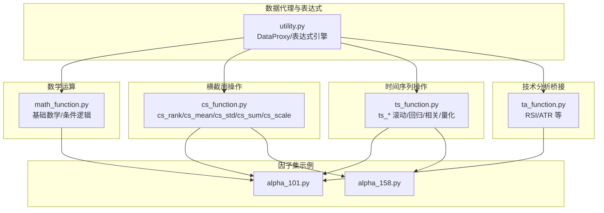
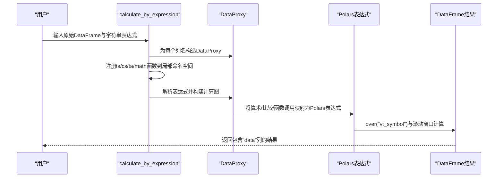
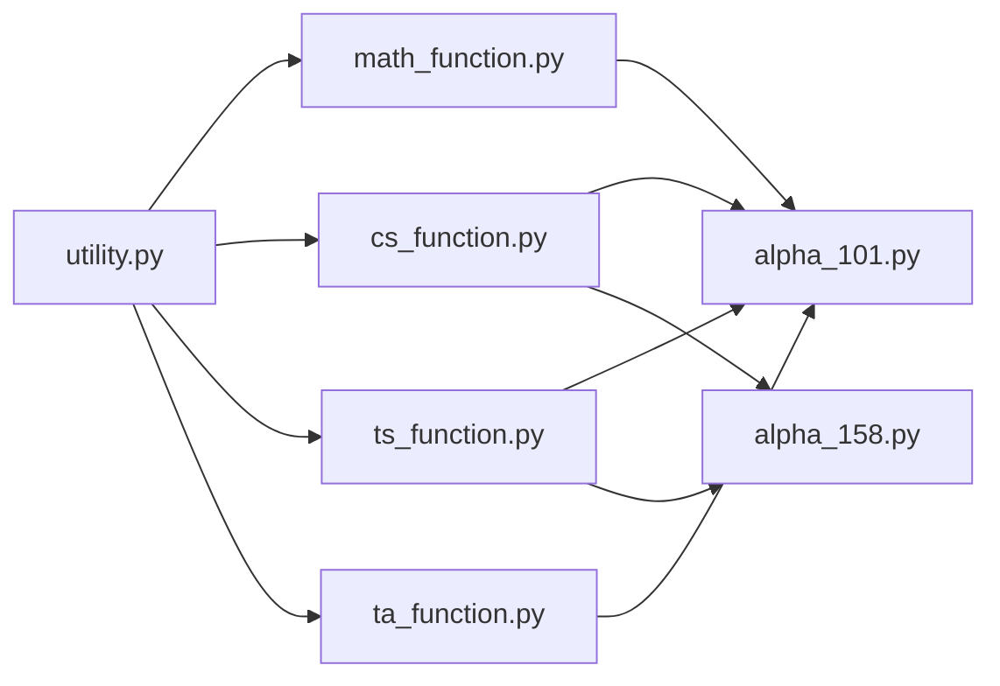

# 数学函数库

<cite>
**本文引用的文件列表**
- [math_function.py](file://vnpy/alpha/dataset/math_function.py)
- [cs_function.py](file://vnpy/alpha/dataset/cs_function.py)
- [ts_function.py](file://vnpy/alpha/dataset/ts_function.py)
- [ta_function.py](file://vnpy/alpha/dataset/ta_function.py)
- [utility.py](file://vnpy/alpha/dataset/utility.py)
- [alpha_101.py](file://vnpy/alpha/dataset/datasets/alpha_101.py)
- [alpha_158.py](file://vnpy/alpha/dataset/datasets/alpha_158.py)
- [test_alpha101.py](file://tests/test_alpha101.py)
- [README.md](file://README.md)
</cite>

## 目录
1. [简介](#简介)
2. [项目结构](#项目结构)
3. [核心组件](#核心组件)
4. [架构总览](#架构总览)
5. [详细组件分析](#详细组件分析)
6. [依赖关系分析](#依赖关系分析)
7. [性能考量](#性能考量)
8. [故障排查指南](#故障排查指南)
9. [结论](#结论)
10. [附录](#附录)

## 简介
本数学函数库是 vnpy.alpha 模块中“因子特征工程”子系统的一部分，面向机器学习预处理与多因子研究场景，提供高效的向量化数学运算与时间序列/横截面操作。其核心目标是：
- 提供基础数学运算（算术、取整、符号、幂次、对数、绝对值等）
- 提供条件选择与阈值判断逻辑
- 提供横截面与时间序列层面的统计与变换操作
- 提供与技术分析库的桥接能力
- 通过表达式引擎与 DataProxy 抽象，实现可读性强、可组合的特征工程流水线

该库广泛应用于 Alpha 101、Alpha 158 等因子集，支撑机器学习模型训练前的数据清洗、特征变换与归一化等关键步骤。

## 项目结构
数学函数库位于 vnpy/alpha/dataset 下，主要文件与职责如下：
- math_function.py：基础数学运算与条件逻辑
- cs_function.py：横截面（cross-section）操作（排名、均值、标准差、求和、缩放）
- ts_function.py：时间序列（time-series）滚动窗口与统计
- ta_function.py：技术分析指标桥接（RSI、ATR 等）
- utility.py：DataProxy 数据代理、表达式执行引擎、辅助工具
- datasets/alpha_*.py：因子集示例，展示数学函数的实际应用
- tests/test_alpha101.py：数学函数与表达式引擎的测试用例

图示来源
- [utility.py](file://vnpy/alpha/dataset/utility.py#L19-L256)
- [math_function.py](file://vnpy/alpha/dataset/math_function.py#L10-L168)
- [cs_function.py](file://vnpy/alpha/dataset/cs_function.py#L10-L65)
- [ts_function.py](file://vnpy/alpha/dataset/ts_function.py#L12-L330)
- [ta_function.py](file://vnpy/alpha/dataset/ta_function.py#L12-L44)
- [alpha_101.py](file://vnpy/alpha/dataset/datasets/alpha_101.py#L6-L331)
- [alpha_158.py](file://vnpy/alpha/dataset/datasets/alpha_158.py#L6-L131)

章节来源
- [README.md](file://README.md#L37-L43)

## 核心组件
- DataProxy：对 DataFrame 的轻量封装，提供算术、比较、幂次等运算符重载，以及 over("vt_symbol") 的分组向量化语义，使数学函数天然具备向量化能力。
- 表达式执行引擎：通过 calculate_by_expression 将字符串表达式解析为 DataProxy 计算图，自动注入 ts_*、cs_*、ta_*、math_* 函数，实现“声明式特征工程”。

章节来源
- [utility.py](file://vnpy/alpha/dataset/utility.py#L19-L256)

## 架构总览
数学函数库围绕 DataProxy 与 Polars 表达式生态构建，形成“函数库 + 表达式引擎 + 因子集”的完整链路。表达式引擎负责把字符串特征公式转换为 DataProxy 计算图，再由 DataProxy 将计算映射到 Polars 的 over 分组与滚动窗口操作，最终输出统一的 DataFrame 结果。

图示来源
- [utility.py](file://vnpy/alpha/dataset/utility.py#L203-L256)

## 详细组件分析

### 基础数学运算与条件逻辑（math_function.py）
- less(a, b) / greater(a, b)：逐点取最小/最大，支持与 DataProxy 或标量比较
- log(x)：自然对数，基于 Polars.log over 分组
- abs(x) / sign(x)：绝对值与符号函数
- quesval(threshold, true_val, false_val) / quesval2(threshold_dp, cond, true_val, false_val)：条件选择，支持阈值与条件均为 DataProxy 或标量
- pow1(base, exp)：安全幂次，处理负底数的符号保留
- pow2(base_dp, exp_dp)：双 DataProxy 幂次，考虑底数为负、指数为整数等边界

数值稳定性与边界处理要点
- 对数：内部使用 over 分组，避免跨分组污染；对非正值输入需谨慎，建议在表达式中配合阈值或平滑项
- 幂次：pow1/pow2 对负底数与非整数指数做了显式分支处理，返回 None/0 以避免非法值传播
- 条件选择：quesval/quesval2 对 DataProxy 参与的 join/suffix 处理，确保列名不冲突

向量化与性能
- 所有函数均基于 Polars 表达式与 over 分组，天然向量化
- pow2 中使用 floor 判断整数指数，避免 NaN 转整数导致错误

章节来源
- [math_function.py](file://vnpy/alpha/dataset/math_function.py#L10-L168)

### 横截面操作（cs_function.py）
- cs_rank(x)：按日期分组内的排名
- cs_mean/std/sum(x)：按日期分组内的统计
- cs_scale(x)：按日期分组内对绝对值求和后的缩放，避免除零

应用场景
- 特征归一化：cs_scale 常用于将特征按截面绝对值和进行缩放，便于跨股票比较
- 截面去极值：cs_rank 可用于将变量映射到 0~1 区间，缓解异常值影响

章节来源
- [cs_function.py](file://vnpy/alpha/dataset/cs_function.py#L10-L65)

### 时间序列操作（ts_function.py）
- ts_delay(x, w) / ts_delta(x, w)：滞后与差分
- ts_min/max/argmax/argmin：滚动窗口极值与索引
- ts_rank(x, w)：滚动百分位排名
- ts_sum/mean/std：滚动求和/均值/标准差
- ts_slope(x, w)：滚动线性回归斜率（预计算常数优化）
- ts_quantile(x, w, q)：滚动分位数
- ts_rsquare(x, w)：滚动回归决定系数（R²）
- ts_resi(x, w)：滚动回归残差
- ts_corr(x, y, w)：滚动相关系数
- ts_less/greater/log/abs：滚动窗口内的逐点比较与数学变换
- ts_cov(x, y, w)：滚动协方差（基于相关与标准差）
- ts_decay_linear(x, w)：线性衰减加权平均
- ts_product(x, w)：滚动乘积

性能优化策略
- ts_slope/ts_rsquare/ts_resi：预计算窗口期常数（如 sum_x、sum_x2、denominator），避免重复计算
- ts_corr：使用 Polars rolling_corr 并过滤无穷值
- ts_decay_linear：使用自定义权重函数，避免显式循环

章节来源
- [ts_function.py](file://vnpy/alpha/dataset/ts_function.py#L12-L330)

### 技术分析桥接（ta_function.py）
- ta_rsi / ta_atr：基于 TA-Lib 的指标计算，通过 DataProxy 与 Polars 的互操作实现
- to_pd_series / to_pl_dataframe：Pandas 与 Polars 的双向转换

注意事项
- TA-Lib 依赖需满足安装要求
- 转换过程保持索引结构一致，避免时序错位

章节来源
- [ta_function.py](file://vnpy/alpha/dataset/ta_function.py#L12-L44)

### 表达式执行与 DataProxy（utility.py）
- DataProxy：重载 + - * / // % ** 以及比较运算，支持与标量与 DataProxy 混合运算
- calculate_by_expression：将字符串表达式解析为 DataProxy 计算图，自动注入函数命名空间
- calculate_by_polars：直接传入 Polars 表达式，返回 DataFrame

章节来源
- [utility.py](file://vnpy/alpha/dataset/utility.py#L19-L256)

## 依赖关系分析
- math_function.cs_function.ts_function.ta_function 均依赖 utility.DataProxy 与 Polars
- 表达式引擎在运行时动态注入函数，避免全局命名空间污染
- Alpha 101/158 通过 add_feature 将字符串表达式注册为特征，体现声明式工程优势

图示来源
- [utility.py](file://vnpy/alpha/dataset/utility.py#L203-L256)
- [math_function.py](file://vnpy/alpha/dataset/math_function.py#L10-L168)
- [cs_function.py](file://vnpy/alpha/dataset/cs_function.py#L10-L65)
- [ts_function.py](file://vnpy/alpha/dataset/ts_function.py#L12-L330)
- [ta_function.py](file://vnpy/alpha/dataset/ta_function.py#L12-L44)
- [alpha_101.py](file://vnpy/alpha/dataset/datasets/alpha_101.py#L6-L331)
- [alpha_158.py](file://vnpy/alpha/dataset/datasets/alpha_158.py#L6-L131)

## 性能考量
- 向量化优先：所有函数基于 Polars over 分组与滚动表达式，避免 Python 循环
- 常量预计算：ts_slope/ts_rsquare/ts_resi 预计算窗口期统计常量，显著降低重复计算
- 缺失值与无穷值处理：ts_corr/ts_rsquare 对无穷值进行过滤，避免影响下游模型
- 线性衰减：ts_decay_linear 使用显式权重与求和，避免复杂 lambda 的额外开销
- 表达式编译：表达式引擎在运行时构建计算图，减少重复解析成本

[本节为通用性能讨论，不直接分析具体文件]

## 故障排查指南
常见问题与定位思路
- 表达式解析失败：检查函数是否在表达式引擎注入范围内，确认列名与括号匹配
- NaN/无穷值传播：在涉及对数、除法、相关系数等操作时，关注缺失值与无穷值处理
- 跨分组污染：确认 over 分组键（如 "vt_symbol"）是否正确，避免跨股票混叠
- 负底数幂次：pow2 对非整数指数返回 None/0，必要时在表达式中增加阈值或平滑项
- TA-Lib 依赖：ta_rsi/ta_atr 需要 TA-Lib 正确安装，否则转换阶段会报错

章节来源
- [utility.py](file://vnpy/alpha/dataset/utility.py#L203-L256)
- [ts_function.py](file://vnpy/alpha/dataset/ts_function.py#L226-L240)
- [ta_function.py](file://vnpy/alpha/dataset/ta_function.py#L12-L44)

## 结论
该数学函数库以 DataProxy 为核心抽象，结合 Polars 的向量化表达式与 over 分组能力，提供了高效、可读、可组合的特征工程能力。通过表达式引擎与 Alpha 101/158 的实践，证明其在机器学习预处理阶段具有良好的稳定性与扩展性。建议在实际应用中：
- 在表达式中显式处理 NaN/无穷值与边界条件
- 使用 cs_scale、ts_rank 等函数进行稳健的特征缩放与排名
- 对高阶幂次与对数操作，结合阈值与平滑项提升数值稳定性
- 利用 ts_slope/ts_rsquare 等优化函数，兼顾精度与性能

[本节为总结性内容，不直接分析具体文件]

## 附录

### 使用示例与最佳实践（基于仓库示例）
- Alpha 101/158 中大量使用 math、cs、ts、ta 函数组合，体现“声明式特征工程”的优势
- 常见模式：对数变换（log）、条件选择（quesval/quesval2）、横截面缩放（cs_scale）、滚动统计（ts_mean/std/slope）、技术指标（ta_rsi/ta_atr）

章节来源
- [alpha_101.py](file://vnpy/alpha/dataset/datasets/alpha_101.py#L24-L331)
- [alpha_158.py](file://vnpy/alpha/dataset/datasets/alpha_158.py#L24-L131)
- [test_alpha101.py](file://tests/test_alpha101.py#L69-L677)