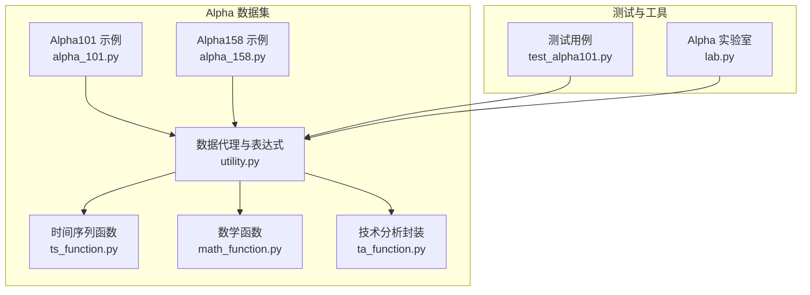
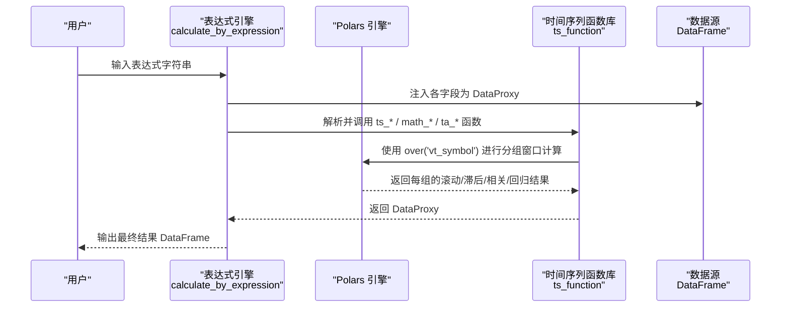
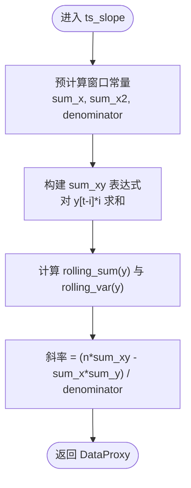
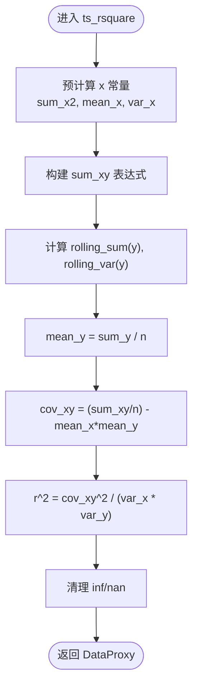
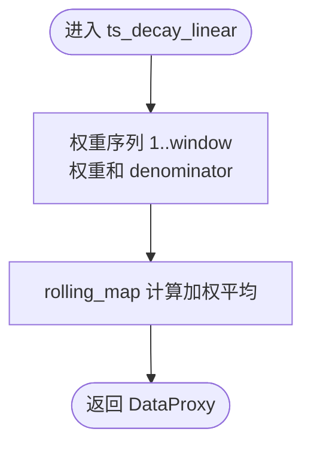
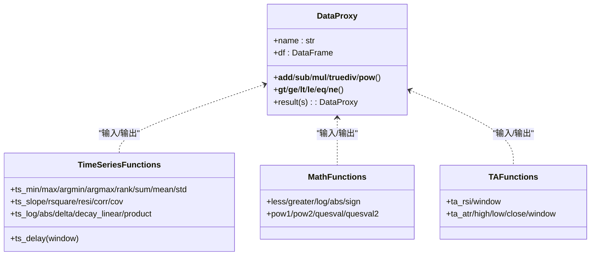
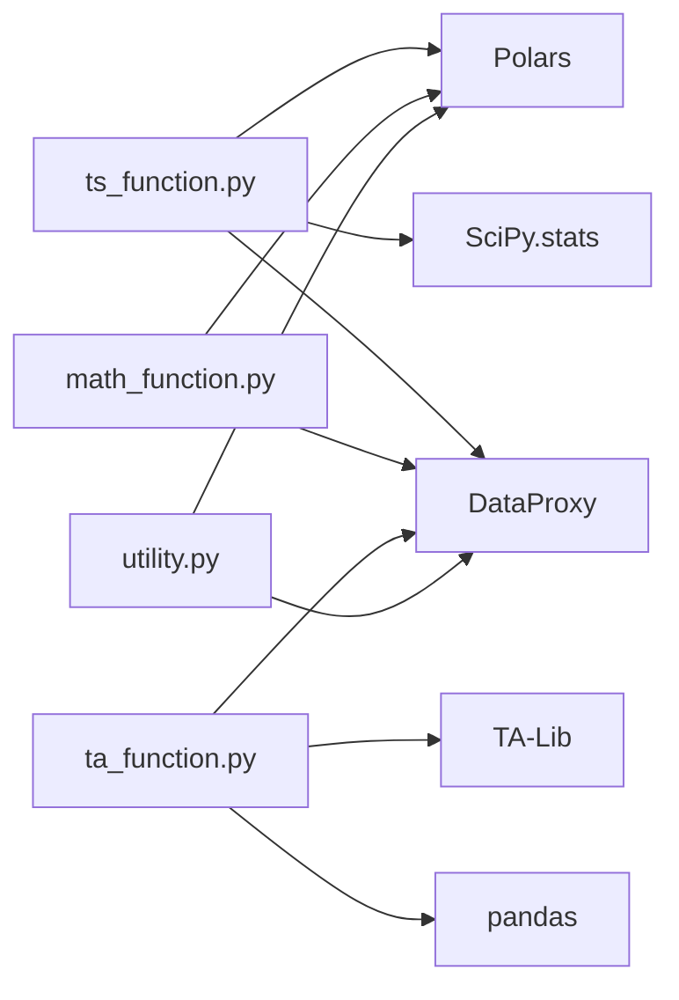

# 时间序列函数

<cite>
**本文引用的文件**
- [ts_function.py](file://vnpy/alpha/dataset/ts_function.py)
- [math_function.py](file://vnpy/alpha/dataset/math_function.py)
- [ta_function.py](file://vnpy/alpha/dataset/ta_function.py)
- [utility.py](file://vnpy/alpha/dataset/utility.py)
- [alpha_101.py](file://vnpy/alpha/dataset/datasets/alpha_101.py)
- [alpha_158.py](file://vnpy/alpha/dataset/datasets/alpha_158.py)
- [test_alpha101.py](file://tests/test_alpha101.py)
- [lab.py](file://vnpy/alpha/lab.py)
</cite>

## 目录
1. [简介](#简介)
2. [项目结构](#项目结构)
3. [核心组件](#核心组件)
4. [架构总览](#架构总览)
5. [详细组件分析](#详细组件分析)
6. [依赖关系分析](#依赖关系分析)
7. [性能考量](#性能考量)
8. [故障排查指南](#故障排查指南)
9. [结论](#结论)
10. [附录](#附录)

## 简介
本技术文档系统性梳理了 vn.py 项目中“时间序列函数”的完整实现与使用方法，覆盖滞后函数、变化率函数、滚动统计函数、相关性与回归函数、线性衰减加权平均、对数与绝对值变换、以及多资产对齐与窗口计算等关键能力。文档不仅解释数学原理与统计意义，还结合实际量化投资场景给出特征工程应用示例，并提供参数设置、性能优化与内存管理建议。

## 项目结构
时间序列函数主要位于 vnpy/alpha/dataset 子模块中，围绕 DataProxy 数据代理与表达式计算框架组织：
- 时间序列函数：ts_function.py
- 数学通用函数：math_function.py
- 技术分析封装：ta_function.py（基于 TA-Lib）
- 数据代理与表达式执行：utility.py
- 经典因子集示例：datasets/alpha_101.py、datasets/alpha_158.py
- 测试用例：tests/test_alpha101.py
- 实验室工具：alpha/lab.py（数据加载与特征生成）

图表来源
- [ts_function.py](file://vnpy/alpha/dataset/ts_function.py#L1-L330)
- [math_function.py](file://vnpy/alpha/dataset/math_function.py#L1-L168)
- [ta_function.py](file://vnpy/alpha/dataset/ta_function.py#L1-L44)
- [utility.py](file://vnpy/alpha/dataset/utility.py#L1-L286)
- [alpha_101.py](file://vnpy/alpha/dataset/datasets/alpha_101.py#L1-L331)
- [alpha_158.py](file://vnpy/alpha/dataset/datasets/alpha_158.py#L1-L131)
- [test_alpha101.py](file://tests/test_alpha101.py#L1-L677)
- [lab.py](file://vnpy/alpha/lab.py#L1-L481)

章节来源
- [ts_function.py](file://vnpy/alpha/dataset/ts_function.py#L1-L330)
- [utility.py](file://vnpy/alpha/dataset/utility.py#L1-L286)

## 核心组件
- DataProxy：统一的时间序列数据代理，支持算子重载与跨资产对齐，是所有时间序列函数的基础容器。
- 表达式执行器：通过 calculate_by_expression 将字符串表达式解析为可执行的 Polars 查询计划，自动注入时间序列与数学函数。
- 时间序列函数族：提供滚动窗口统计、滞后、变化率、相关性与回归、线性衰减加权等能力。
- 技术分析封装：基于 TA-Lib 的 RSI、ATR 等指标，按合约维度输出结果。
- 示例数据集：Alpha101 与 Alpha158 提供大量真实因子组合，覆盖多窗口与多资产场景。

章节来源
- [utility.py](file://vnpy/alpha/dataset/utility.py#L19-L256)
- [ts_function.py](file://vnpy/alpha/dataset/ts_function.py#L12-L330)
- [ta_function.py](file://vnpy/alpha/dataset/ta_function.py#L12-L44)
- [alpha_101.py](file://vnpy/alpha/dataset/datasets/alpha_101.py#L6-L331)
- [alpha_158.py](file://vnpy/alpha/dataset/datasets/alpha_158.py#L6-L131)

## 架构总览
时间序列函数的调用链路如下：
- 用户通过表达式字符串定义特征组合（如 ts_mean、ts_corr、ts_slope 等）
- calculate_by_expression 将表达式解析为 Polars Expr，并自动注入 DataProxy 列
- Polars 在每个 vt_symbol 分组上执行滚动窗口与对齐操作
- 结果以 DataProxy 返回，供后续特征工程或建模使用

图表来源
- [utility.py](file://vnpy/alpha/dataset/utility.py#L203-L256)
- [ts_function.py](file://vnpy/alpha/dataset/ts_function.py#L12-L330)
- [ta_function.py](file://vnpy/alpha/dataset/ta_function.py#L12-L44)

## 详细组件分析

### 时间序列函数族（滚动与滞后）
- 滞后与差分
  - ts_delay：固定期数的历史值对齐（按 vt_symbol 分组 shift）
  - ts_delta：当前值与滞后值之差（delta = current - delay）
- 滚动极值与排名
  - ts_min / ts_max：滚动窗口内的最小/最大
  - ts_argmin / ts_argmax：滚动窗口内最小/最大发生的位置索引（从1开始）
  - ts_rank：当前值在窗口内的百分位秩（0~1）
- 滚动统计
  - ts_sum / ts_mean：滚动求和/均值（min_samples 控制）
  - ts_std：滚动总体标准差（ddof=0）
  - ts_quantile：滚动分位数（线性插值）
  - ts_product：滚动乘积
- 回归与相关
  - ts_slope：滚动线性回归斜率（预计算常量优化）
  - ts_rsquare：滚动线性回归决定系数（R²）
  - ts_resi：滚动线性回归残差
  - ts_corr：两特征滚动皮尔逊相关（按 vt_symbol 分组）
  - ts_cov：滚动协方差（相关×两标准差）
- 线性衰减加权
  - ts_decay_linear：权重为 1..window 的线性递减加权平均
- 变换与比较
  - ts_log：自然对数
  - ts_abs：绝对值
  - ts_less / ts_greater：逐元素取较小/较大值（支持与标量或另一特征比较）

章节来源
- [ts_function.py](file://vnpy/alpha/dataset/ts_function.py#L12-L330)

### 数学通用函数（与时间序列配合）
- less / greater：元素级最小/最大（支持 DataProxy 或标量）
- log / abs / sign：基础数值变换
- pow1 / pow2：幂运算（处理负底数与整数指数等边界）
- 条件选择：quesval / quesval2（阈值条件分支）

章节来源
- [math_function.py](file://vnpy/alpha/dataset/math_function.py#L10-L168)

### 技术分析封装（TA-Lib）
- ta_rsi：RSI 指标（按 vt_symbol 分组）
- ta_atr：ATR 指标（按 vt_symbol 分组）
- 中间转换：to_pd_series / to_pl_dataframe（Polars 与 pandas 互转）

章节来源
- [ta_function.py](file://vnpy/alpha/dataset/ta_function.py#L12-L44)

### 数据代理与表达式执行
- DataProxy：统一的特征容器，支持 + - * / // % ** 与比较运算，自动对齐 vt_symbol
- calculate_by_expression：将表达式字符串注入函数命名空间，自动构造 DataProxy 列，返回结果 DataFrame
- calculate_by_polars：直接传入 Polars Expr 执行

章节来源
- [utility.py](file://vnpy/alpha/dataset/utility.py#L19-L256)

### 典型使用示例（来自 Alpha101/Alpha158）
- Alpha101：大量复合表达式，包含 ts_delay、ts_corr、ts_mean、ts_std、ts_slope、ts_rsquare、ts_resi、ts_decay_linear、ts_rank 等
- Alpha158：标准化窗口特征族（ROC、MA、STD、BETA、RSQR、RESI、MAX/MIN、QUANTILE、RANK、RSV、ARGMAX/ARGMIN、CORR 等）

章节来源
- [alpha_101.py](file://vnpy/alpha/dataset/datasets/alpha_101.py#L24-L331)
- [alpha_158.py](file://vnpy/alpha/dataset/datasets/alpha_158.py#L39-L131)
- [test_alpha101.py](file://tests/test_alpha101.py#L66-L677)

### 关键算法流程图

#### ts_slope（滚动线性回归斜率）优化流程

图表来源
- [ts_function.py](file://vnpy/alpha/dataset/ts_function.py#L102-L127)

#### ts_rsquare（滚动 R²）优化流程

图表来源
- [ts_function.py](file://vnpy/alpha/dataset/ts_function.py#L140-L183)

#### ts_decay_linear（线性衰减加权平均）流程

图表来源
- [ts_function.py](file://vnpy/alpha/dataset/ts_function.py#L306-L319)

### 类关系图（代码级）

图表来源
- [utility.py](file://vnpy/alpha/dataset/utility.py#L19-L201)
- [ts_function.py](file://vnpy/alpha/dataset/ts_function.py#L12-L330)
- [math_function.py](file://vnpy/alpha/dataset/math_function.py#L10-L168)
- [ta_function.py](file://vnpy/alpha/dataset/ta_function.py#L12-L44)

## 依赖关系分析
- ts_function 依赖：
  - Polars（rolling_map、rolling_corr、shift、over 分组）
  - SciPy（percentileofscore）
  - DataProxy（统一数据容器）
- math_function 依赖：Polars（element-wise 运算）
- ta_function 依赖：TA-Lib、Polars、pandas（中间转换）
- utility 依赖：Polars、typing、collections、numbers

图表来源
- [ts_function.py](file://vnpy/alpha/dataset/ts_function.py#L3-L9)
- [math_function.py](file://vnpy/alpha/dataset/math_function.py#L5-L7)
- [ta_function.py](file://vnpy/alpha/dataset/ta_function.py#L5-L7)
- [utility.py](file://vnpy/alpha/dataset/utility.py#L1-L8)

章节来源
- [ts_function.py](file://vnpy/alpha/dataset/ts_function.py#L3-L9)
- [math_function.py](file://vnpy/alpha/dataset/math_function.py#L5-L7)
- [ta_function.py](file://vnpy/alpha/dataset/ta_function.py#L5-L7)
- [utility.py](file://vnpy/alpha/dataset/utility.py#L1-L8)

## 性能考量
- 分组窗口计算
  - 所有滚动函数均使用 over("vt_symbol") 进行分组，避免跨资产数据混合，确保多资产并行处理。
- 预计算常量
  - ts_slope、ts_rsquare 对窗口长度 n 的常量进行一次性预计算，减少重复计算开销。
- 滚动映射与向量化
  - 使用 rolling_map 与 Polars 向量化操作，避免 Python 循环；对需要自定义聚合的函数（如线性衰减）采用 rolling_map。
- 内存与类型
  - DataProxy 内部统一列名为 "data"，避免重复列名冲突；表达式执行器仅注入必要列，减少中间 DataFrame 大小。
- I/O 与缓存
  - AlphaLab 提供 Parquet 缓存与 LRU 缓存（load_component_data），降低重复读取成本。

章节来源
- [ts_function.py](file://vnpy/alpha/dataset/ts_function.py#L102-L127)
- [utility.py](file://vnpy/alpha/dataset/utility.py#L203-L256)
- [lab.py](file://vnpy/alpha/lab.py#L256-L279)

## 故障排查指南
- 空值与异常值
  - ts_rank、ts_corr 等函数可能产生 inf/nan，需在表达式中进行清洗（例如使用 when().then().otherwise()）。
- 窗口长度与样本数
  - 某些函数（如 ts_rsquare、ts_resi、ts_std(ddof=0)）要求 min_samples 达到窗口长度，否则结果为空。
- 跨资产对齐
  - 确保输入数据包含 "datetime" 与 "vt_symbol" 两列，且两者作为分组键正确对齐。
- 表达式语法
  - 使用 calculate_by_expression 时，确保表达式字符串中引用的列名与 DataFrame 列一致，且函数名在命名空间中可见。
- TA-Lib 依赖
  - 若 ta_rsi/ta_atr 报错，请检查 TA-Lib 安装与版本兼容性。

章节来源
- [ts_function.py](file://vnpy/alpha/dataset/ts_function.py#L176-L183)
- [utility.py](file://vnpy/alpha/dataset/utility.py#L203-L256)
- [ta_function.py](file://vnpy/alpha/dataset/ta_function.py#L12-L44)

## 结论
vn.py 的时间序列函数体系以 DataProxy 为核心，结合 Polars 的高效分组窗口计算与表达式执行器，提供了面向多资产、多时间窗口的特征工程能力。通过 Alpha101/Alpha158 的示例，可以看到这些函数在量化研究中的广泛应用。建议在生产环境中充分利用分组窗口与预计算常量策略，合理设置窗口长度与样本数，以获得稳定且高性能的特征输出。

## 附录

### 参数与默认行为速查
- 窗口参数：window（正整数），用于滚动函数与相关/回归函数
- 样本控制：min_samples（滚动函数常用，默认 1 或窗口长度）
- 方差自由度：ts_std、ts_rsquare、ts_resi、ts_cov 等使用总体方差（ddof=0）
- 对齐键：按 "vt_symbol" 分组，按 "datetime" 排序
- 表达式注入：calculate_by_expression 自动注入 ts_*、cs_*、ta_*、math_* 函数

章节来源
- [ts_function.py](file://vnpy/alpha/dataset/ts_function.py#L22-L330)
- [utility.py](file://vnpy/alpha/dataset/utility.py#L203-L256)

### 量化投资典型应用场景
- 趋势与动量：ts_slope、ts_rsquare、ts_resi、ts_decay_linear
- 波动与风险：ts_std、ts_quantile、ts_rank
- 成交量与价格关系：ts_corr、ts_cov、ta_rsi、ta_atr
- 价格形态与信号：ts_delay、ts_delta、ts_greater、ts_less
- 多资产对齐与跨期比较：按 vt_symbol 分组的滚动与滞后

章节来源
- [alpha_101.py](file://vnpy/alpha/dataset/datasets/alpha_101.py#L24-L331)
- [alpha_158.py](file://vnpy/alpha/dataset/datasets/alpha_158.py#L39-L131)
- [ta_function.py](file://vnpy/alpha/dataset/ta_function.py#L24-L44)