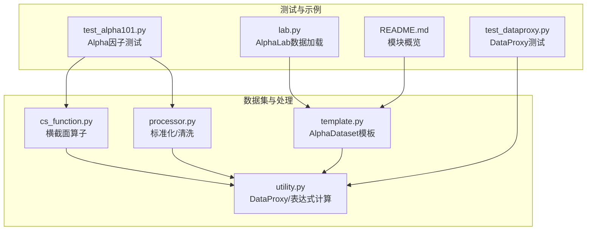
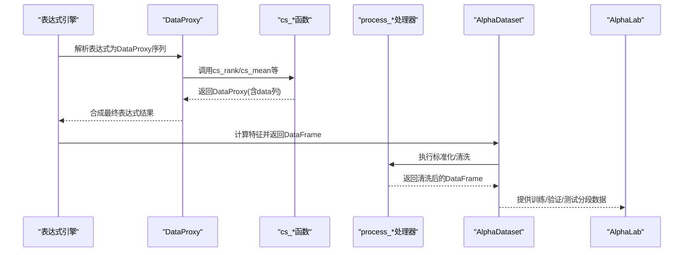
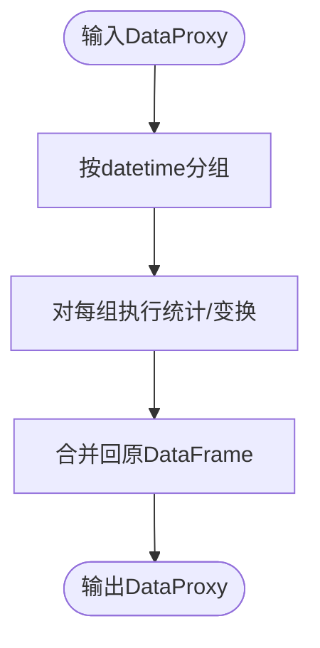
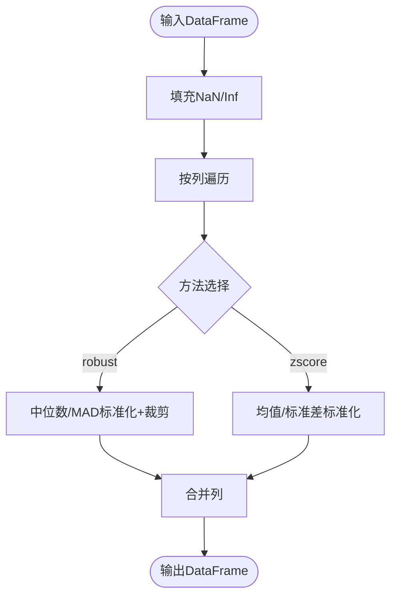
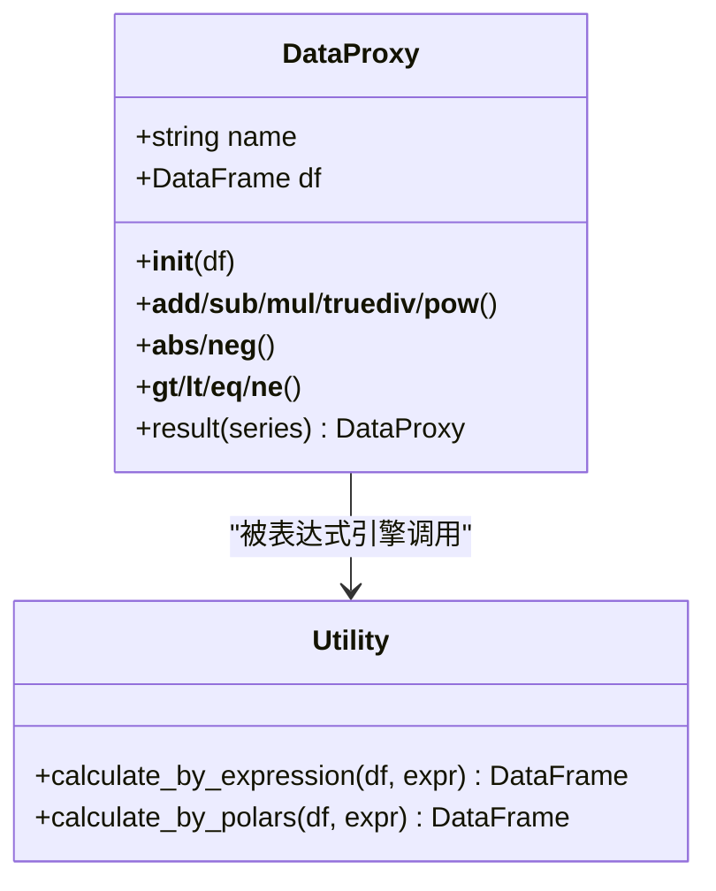
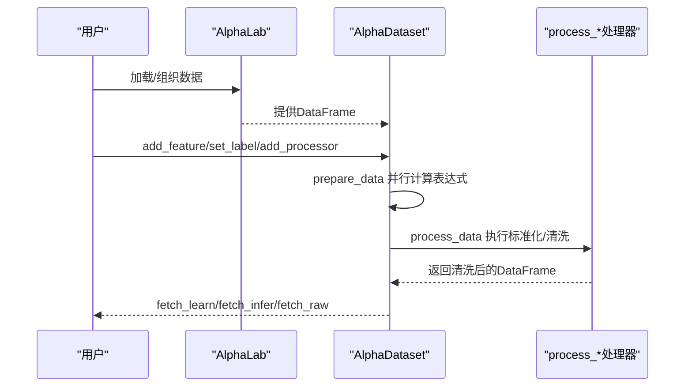
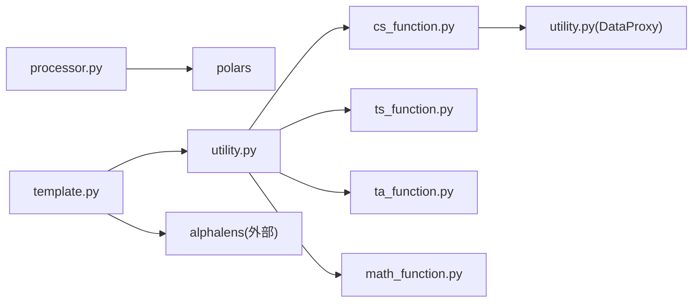

# 横截面函数

<cite>
**本文引用的文件列表**
- [cs_function.py](file://vnpy/alpha/dataset/cs_function.py)
- [processor.py](file://vnpy/alpha/dataset/processor.py)
- [utility.py](file://vnpy/alpha/dataset/utility.py)
- [template.py](file://vnpy/alpha/dataset/template.py)
- [test_alpha101.py](file://tests/test_alpha101.py)
- [test_dataproxy.py](file://tests/alpha/test_dataproxy.py)
- [lab.py](file://vnpy/alpha/lab.py)
- [README.md](file://README.md)
</cite>

## 目录
1. [简介](#简介)
2. [项目结构](#项目结构)
3. [核心组件](#核心组件)
4. [架构总览](#架构总览)
5. [详细组件分析](#详细组件分析)
6. [依赖关系分析](#依赖关系分析)
7. [性能考量](#性能考量)
8. [故障排查指南](#故障排查指南)
9. [结论](#结论)
10. [附录](#附录)

## 简介
本文件聚焦于vnpy.alpha模块中的“横截面函数”，系统阐述其设计理念、实现细节与工程实践。横截面函数用于在多资产（股票、期货等）数据上执行跨时点的统计与变换，典型包括：跨时点排序、均值、标准差、求和、绝对值归一化缩放等。这些函数在因子研究与投资组合构建中至关重要，能够：
- 消除时间趋势影响：通过按时间切片（datetime）进行统计，使各时点的变量在同一时点内部进行比较，从而弱化跨时间的系统性趋势。
- 标准化与稳健化：提供z-score标准化与鲁棒标准化（MAD）两类方法，便于不同尺度与分布的变量在同一基准下比较。
- 构建稳健因子：通过排名、缩放等操作，降低极端值与异常值的影响，提升因子稳定性与可解释性。

本文件将结合代码实现、测试用例与实际应用场景，给出数学原理、适用条件、注意事项与最佳实践。

## 项目结构
围绕横截面函数的相关模块与文件如下：
- 数据集与处理：cs_function.py（横截面算子）、processor.py（标准化与清洗）、utility.py（DataProxy与表达式计算）、template.py（AlphaDataset模板）
- 示例与测试：test_alpha101.py（大量Alpha因子表达式测试，广泛使用cs_*函数）、test_dataproxy.py（DataProxy运算与比较测试）
- 实战集成：lab.py（AlphaLab数据加载与组织）、README.md（模块定位与功能概览）

**图示来源**
- [cs_function.py](file://vnpy/alpha/dataset/cs_function.py#L1-L65)
- [processor.py](file://vnpy/alpha/dataset/processor.py#L1-L202)
- [utility.py](file://vnpy/alpha/dataset/utility.py#L1-L286)
- [template.py](file://vnpy/alpha/dataset/template.py#L1-L306)
- [test_alpha101.py](file://tests/test_alpha101.py#L1-L677)
- [test_dataproxy.py](file://tests/alpha/test_dataproxy.py#L1-L107)
- [lab.py](file://vnpy/alpha/lab.py#L1-L481)
- [README.md](file://README.md#L31-L71)

**章节来源**
- [README.md](file://README.md#L31-L71)
- [cs_function.py](file://vnpy/alpha/dataset/cs_function.py#L1-L65)
- [processor.py](file://vnpy/alpha/dataset/processor.py#L1-L202)
- [utility.py](file://vnpy/alpha/dataset/utility.py#L1-L286)
- [template.py](file://vnpy/alpha/dataset/template.py#L1-L306)
- [test_alpha101.py](file://tests/test_alpha101.py#L1-L677)
- [test_dataproxy.py](file://tests/alpha/test_dataproxy.py#L1-L107)
- [lab.py](file://vnpy/alpha/lab.py#L1-L481)

## 核心组件
- 横截面算子（cs_*）：提供跨时点的统计与变换，如排名、均值、标准差、求和、绝对值归一化缩放。
- 标准化处理器（process_cs_norm、process_robust_zscore_norm、process_cs_rank_norm等）：提供z-score与鲁棒标准化、跨时点排名标准化等。
- DataProxy：将DataFrame包装为可参与表达式的代理对象，支持算术、比较与布尔运算，内部以“datetime”和“vt_symbol”为索引上下文。
- AlphaDataset：统一的因子工程流水线，负责特征表达式计算、数据过滤与分段（训练/验证/测试）。

**章节来源**
- [cs_function.py](file://vnpy/alpha/dataset/cs_function.py#L10-L65)
- [processor.py](file://vnpy/alpha/dataset/processor.py#L34-L202)
- [utility.py](file://vnpy/alpha/dataset/utility.py#L19-L286)
- [template.py](file://vnpy/alpha/dataset/template.py#L23-L306)

## 架构总览
横截面函数在工程上的位置与交互如下：
- 表达式层：通过utility.calculate_by_expression将字符串表达式解析为DataProxy序列，再由cs_*与ts_*等函数组合。
- 数据层：AlphaDataset.prepare_data并行计算多个表达式，得到多列特征；随后通过process_*进行标准化与清洗。
- 应用层：AlphaLab负责数据加载与组织，配合AlphaDataset完成因子工程与回测分析。

**图示来源**
- [utility.py](file://vnpy/alpha/dataset/utility.py#L203-L256)
- [cs_function.py](file://vnpy/alpha/dataset/cs_function.py#L10-L65)
- [processor.py](file://vnpy/alpha/dataset/processor.py#L34-L202)
- [template.py](file://vnpy/alpha/dataset/template.py#L88-L194)
- [lab.py](file://vnpy/alpha/lab.py#L156-L244)

## 详细组件分析

### 横截面算子（cs_*）
cs_*函数以“datetime”为分组键，对同一时点内的所有资产（vt_symbol）执行统计或变换，从而实现跨时点的标准化与可比性。

- cs_rank：对同一时点内的数据进行排名，常用于将原始变量转换为秩次，消除量纲差异。
- cs_mean：计算同一时点内数据的均值，用于中心化或作为基准。
- cs_std：计算同一时点内数据的标准差，用于尺度标准化。
- cs_sum：计算同一时点内数据的和，常用于绝对值归一化（见cs_scale）。
- cs_scale：将同一时点内的数据按绝对值之和进行归一化，避免总量为零时的除零问题。

**图示来源**
- [cs_function.py](file://vnpy/alpha/dataset/cs_function.py#L10-L65)

**章节来源**
- [cs_function.py](file://vnpy/alpha/dataset/cs_function.py#L10-L65)

### 标准化处理器（process_cs_norm/process_robust_zscore_norm/process_cs_rank_norm）
这些处理器在AlphaDataset的预处理阶段使用，确保特征在跨时点层面具备可比性与稳健性。

- process_cs_norm(method="robust"|"zscore")：对每个特征列在每个时点内进行标准化。
  - robust：使用中位数与MAD（Median Absolute Deviation）进行稳健标准化，并裁剪至[-3,3]范围。
  - zscore：使用均值与标准差进行标准化。
- process_robust_zscore_norm：在指定训练期内计算中位数与MAD，然后对全量数据进行标准化，可选裁剪。
- process_cs_rank_norm：对每个时点内的特征进行秩次归一化，映射到[-1.73,1.73]区间（约±3σ近似）。

**图示来源**
- [processor.py](file://vnpy/alpha/dataset/processor.py#L34-L78)
- [processor.py](file://vnpy/alpha/dataset/processor.py#L153-L186)
- [processor.py](file://vnpy/alpha/dataset/processor.py#L188-L202)

**章节来源**
- [processor.py](file://vnpy/alpha/dataset/processor.py#L34-L78)
- [processor.py](file://vnpy/alpha/dataset/processor.py#L153-L186)
- [processor.py](file://vnpy/alpha/dataset/processor.py#L188-L202)

### DataProxy与表达式计算（utility）
DataProxy是横截面函数与表达式引擎之间的桥梁，它：
- 将DataFrame重命名为包含“datetime”、“vt_symbol”与“data”的三列结构。
- 支持与标量、另一个DataProxy进行四则运算、幂运算、取绝对值、取负等。
- 支持比较运算（>, <, ==, != 等），返回Int32类型的比较结果，便于后续条件构造。

表达式计算通过utility.calculate_by_expression将字符串表达式解析为DataProxy序列，再合成最终结果。

**图示来源**
- [utility.py](file://vnpy/alpha/dataset/utility.py#L19-L286)

**章节来源**
- [utility.py](file://vnpy/alpha/dataset/utility.py#L19-L286)

### AlphaDataset与AlphaLab（工程集成）
AlphaDataset负责：
- 添加特征表达式或直接结果，统一生成多列特征。
- 通过process_*处理器对推理与学习数据分别进行处理。
- 提供训练/验证/测试分段数据的查询接口。

AlphaLab负责：
- 数据加载与组织，将多标的日线数据拼接为统一的DataFrame。
- 与AlphaDataset协作，完成因子工程与回测分析。

**图示来源**
- [template.py](file://vnpy/alpha/dataset/template.py#L58-L194)
- [lab.py](file://vnpy/alpha/lab.py#L156-L244)

**章节来源**
- [template.py](file://vnpy/alpha/dataset/template.py#L23-L306)
- [lab.py](file://vnpy/alpha/lab.py#L156-L244)

## 依赖关系分析
- cs_function依赖utility.DataProxy，用于封装与返回结果。
- processor依赖polars进行高效分组与向量化计算。
- utility依赖ts_function、cs_function、ta_function、math_function等模块，通过局部导入在表达式计算时注入可用函数。
- template依赖utility与alphalens进行因子分析与可视化。

**图示来源**
- [cs_function.py](file://vnpy/alpha/dataset/cs_function.py#L7-L8)
- [utility.py](file://vnpy/alpha/dataset/utility.py#L206-L236)
- [processor.py](file://vnpy/alpha/dataset/processor.py#L1-L7)
- [template.py](file://vnpy/alpha/dataset/template.py#L11-L12)

**章节来源**
- [cs_function.py](file://vnpy/alpha/dataset/cs_function.py#L7-L8)
- [utility.py](file://vnpy/alpha/dataset/utility.py#L206-L236)
- [processor.py](file://vnpy/alpha/dataset/processor.py#L1-L7)
- [template.py](file://vnpy/alpha/dataset/template.py#L11-L12)

## 性能考量
- 向量化优先：cs_*与process_*均基于polars的over("datetime")与group_by聚合，避免显式循环，提升吞吐。
- 并行计算：AlphaDataset.prepare_data使用多进程池并行计算多个表达式，显著缩短特征生成时间。
- 内存与I/O：建议在大规模数据上使用分区存储（如Parquet），并在表达式中尽量减少中间列的冗余。
- 标准化成本：robust标准化涉及中位数与MAD，z-score标准化涉及均值与标准差，两者均为O(N)扫描，注意数据稀疏与缺失值处理。

[本节为通用性能建议，不直接分析具体文件]

## 故障排查指南
- 缺失值与无穷值：
  - 使用process_fill_na与process_cs_fill_na进行缺失值填充。
  - 使用process_replace_inf将无穷值替换为按股票分组的均值，避免影响后续标准化。
- 除零与分母为零：
  - cs_scale在分母为零时返回0，避免异常；如需更严格的控制，可在表达式中显式判断。
- 分组键一致性：
  - 确保“datetime”和“vt_symbol”列名一致，否则join与over操作会失败。
- 表达式解析错误：
  - 检查表达式中是否正确使用cs_*与ts_*函数名，避免大小写与拼写错误。
- 结果列命名冲突：
  - AlphaDataset在合并结果时会保留“datetime”和“vt_symbol”，其余列为特征列，注意避免重复命名。

**章节来源**
- [processor.py](file://vnpy/alpha/dataset/processor.py#L9-L31)
- [processor.py](file://vnpy/alpha/dataset/processor.py#L80-L99)
- [cs_function.py](file://vnpy/alpha/dataset/cs_function.py#L50-L65)
- [template.py](file://vnpy/alpha/dataset/template.py#L118-L132)

## 结论
横截面函数在vnpy.alpha中承担着“跨时点可比性”的关键角色。通过cs_*算子与process_*标准化处理器，能够在多资产数据上稳定地生成可解释、可复现的因子特征，为因子研究与投资组合构建提供坚实基础。结合AlphaDataset与AlphaLab，用户可以高效完成从数据加载、特征工程到回测分析的全流程。

[本节为总结性内容，不直接分析具体文件]

## 附录

### 数学原理与适用条件
- 排名标准化（cs_rank）：将同一时点内的观测按升序排名，消除量纲与分布差异，适用于非线性关系与异常值较多的场景。
- z-score标准化（process_cs_norm method=zscore）：减去时点均值并除以标准差，要求数据近似正态且方差非零。
- 鲁棒标准化（process_cs_norm method=robust 或 process_robust_zscore_norm）：使用中位数与MAD替代均值与标准差，对异常值更稳健，适合厚尾分布。
- 绝对值归一化（cs_scale）：将同一时点内的数据按绝对值之和归一化，常用于方向性因子，避免总量为零导致的除零问题。

**章节来源**
- [cs_function.py](file://vnpy/alpha/dataset/cs_function.py#L10-L65)
- [processor.py](file://vnpy/alpha/dataset/processor.py#L34-L78)
- [processor.py](file://vnpy/alpha/dataset/processor.py#L153-L186)

### 使用注意事项
- 时间维度：cs_*与process_*均以“datetime”为分组键，确保数据按日或按分钟有序。
- 资产维度：以“vt_symbol”为资产标识，确保同一时点内资产唯一。
- 表达式嵌套：在表达式中合理嵌套cs_*与ts_*函数，避免过度复杂导致计算缓慢。
- 可解释性：cs_rank与cs_scale常用于提升因子的跨时点稳定性与可解释性，但可能损失部分原始尺度信息。

**章节来源**
- [utility.py](file://vnpy/alpha/dataset/utility.py#L203-L256)
- [cs_function.py](file://vnpy/alpha/dataset/cs_function.py#L10-L65)
- [processor.py](file://vnpy/alpha/dataset/processor.py#L34-L78)

### 代码示例路径（不展示具体代码）
- 在多资产数据上应用cs_rank与cs_scale的表达式示例可参考：
  - [test_alpha101.py](file://tests/test_alpha101.py#L236-L262)
- DataProxy的运算与比较示例可参考：
  - [test_dataproxy.py](file://tests/alpha/test_dataproxy.py#L40-L107)
- AlphaDataset特征添加与处理示例可参考：
  - [template.py](file://vnpy/alpha/dataset/template.py#L58-L194)

**章节来源**
- [test_alpha101.py](file://tests/test_alpha101.py#L236-L262)
- [test_dataproxy.py](file://tests/alpha/test_dataproxy.py#L40-L107)
- [template.py](file://vnpy/alpha/dataset/template.py#L58-L194)