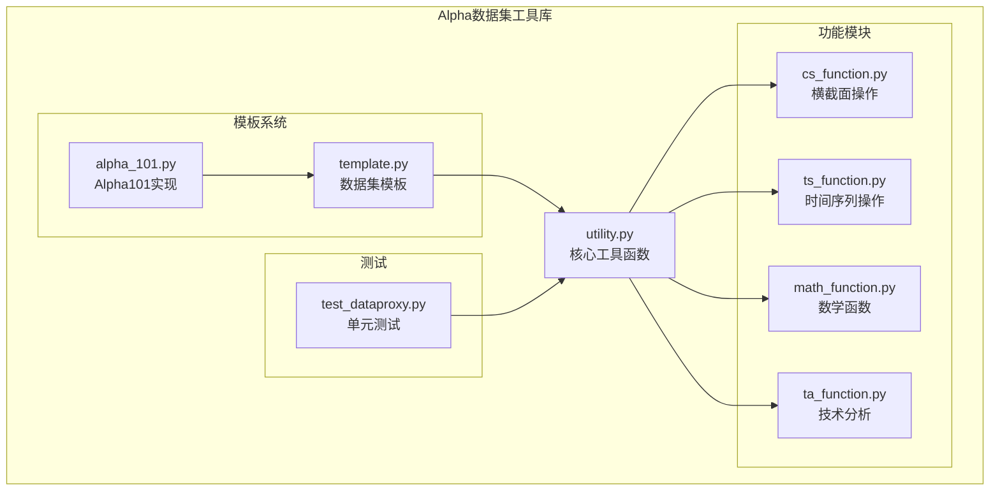
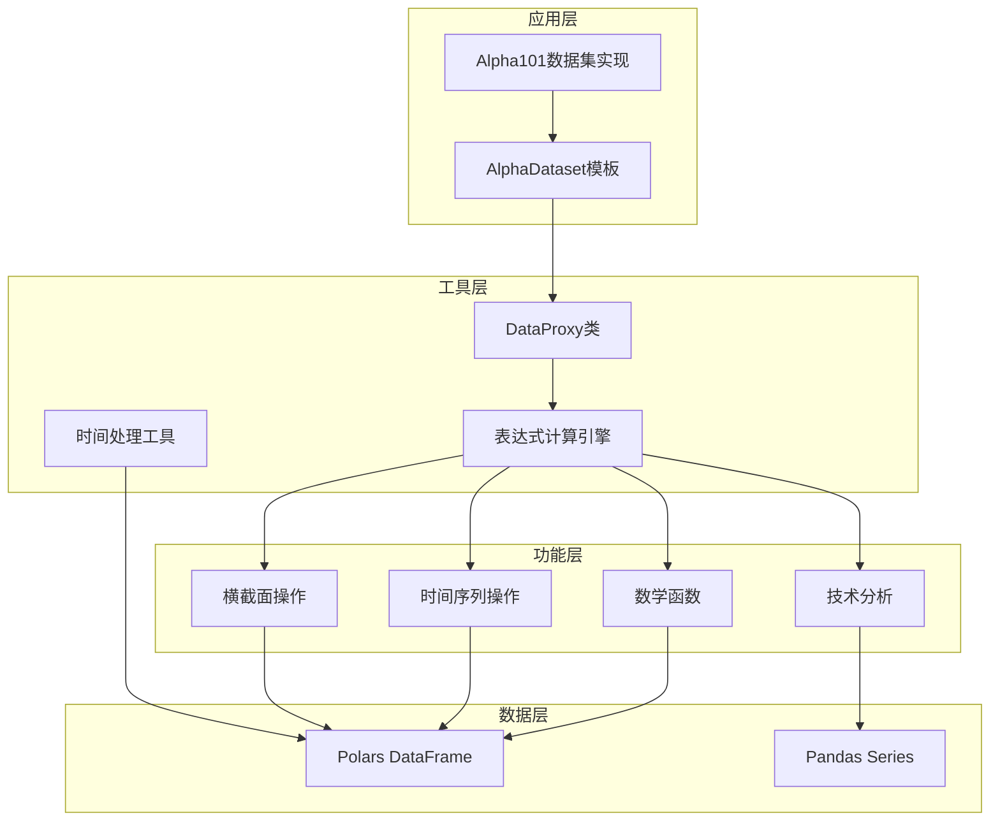
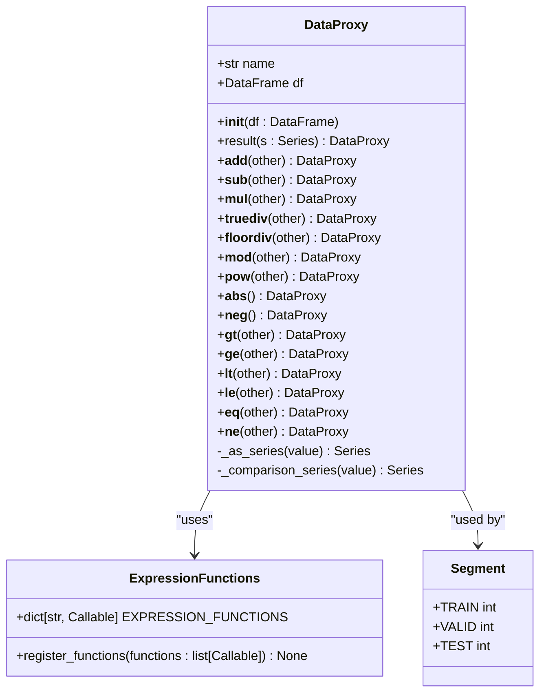
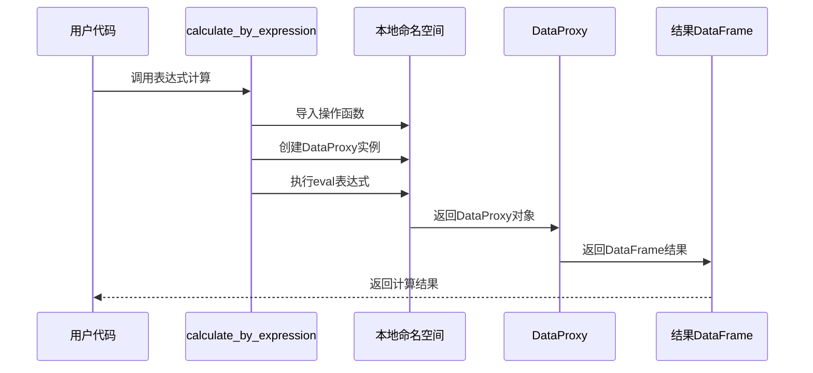
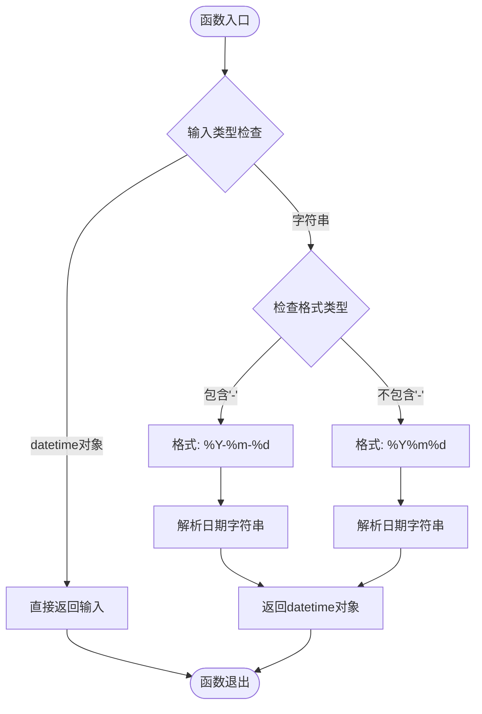
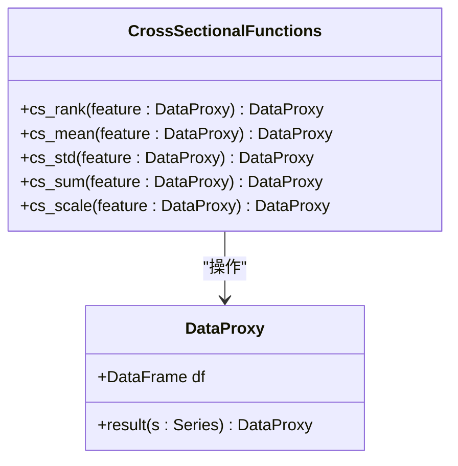
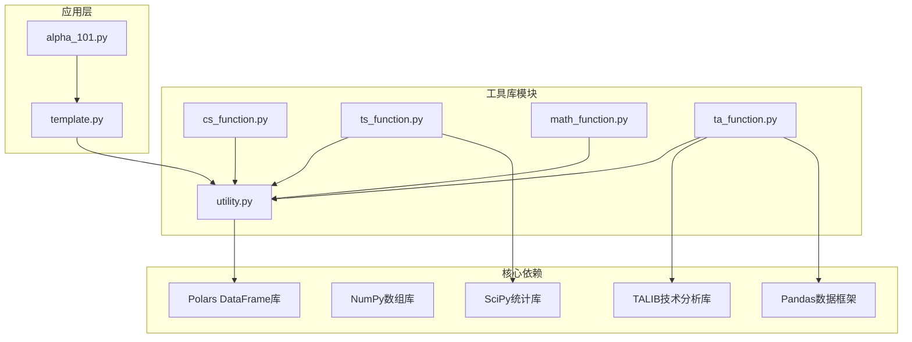

# 实用工具函数

<cite>
**本文档引用的文件**
- [utility.py](file://vnpy/alpha/dataset/utility.py)
- [cs_function.py](file://vnpy/alpha/dataset/cs_function.py)
- [math_function.py](file://vnpy/alpha/dataset/math_function.py)
- [ts_function.py](file://vnpy/alpha/dataset/ts_function.py)
- [ta_function.py](file://vnpy/alpha/dataset/ta_function.py)
- [template.py](file://vnpy/alpha/dataset/template.py)
- [alpha_101.py](file://vnpy/alpha/dataset/datasets/alpha_101.py)
- [test_dataproxy.py](file://tests/alpha/test_dataproxy.py)
</cite>

## 目录
1. [简介](#简介)
2. [项目结构](#项目结构)
3. [核心组件](#核心组件)
4. [架构概览](#架构概览)
5. [详细组件分析](#详细组件分析)
6. [依赖关系分析](#依赖关系分析)
7. [性能考虑](#性能考虑)
8. [故障排除指南](#故障排除指南)
9. [结论](#结论)

## 简介

Alpha数据集实用工具函数库是vn.py框架中用于量化研究和特征工程的核心模块。该库提供了丰富的数据转换、时间处理和表达式计算功能，专门针对金融数据的特征工程需求进行了优化。本文档深入介绍了工具函数库中提供的各种辅助功能，包括数据转换、时间处理、表达式计算等核心工具，并详细说明了to_datetime函数的时间格式转换机制、Segment枚举的时间段管理、calculate_by_expression和calculate_by_polars的表达式计算功能。

这些工具函数在特征工程中发挥着重要作用，为量化研究人员提供了直观、高效的特征构建工具。通过这些工具，用户可以轻松地进行时间序列分析、横截面操作、数学变换和技术分析，从而构建高质量的特征矩阵。

## 项目结构

Alpha数据集实用工具函数库采用模块化设计，按照功能域进行组织：



**图表来源**
- [utility.py](file://vnpy/alpha/dataset/utility.py#L1-L286)
- [cs_function.py](file://vnpy/alpha/dataset/cs_function.py#L1-L65)
- [ts_function.py](file://vnpy/alpha/dataset/ts_function.py#L1-L330)
- [math_function.py](file://vnpy/alpha/dataset/math_function.py#L1-L168)
- [ta_function.py](file://vnpy/alpha/dataset/ta_function.py#L1-L44)
- [template.py](file://vnpy/alpha/dataset/template.py#L1-L306)
- [alpha_101.py](file://vnpy/alpha/dataset/datasets/alpha_101.py#L1-L331)

**章节来源**
- [utility.py](file://vnpy/alpha/dataset/utility.py#L1-L286)
- [cs_function.py](file://vnpy/alpha/dataset/cs_function.py#L1-L65)
- [ts_function.py](file://vnpy/alpha/dataset/ts_function.py#L1-L330)
- [math_function.py](file://vnpy/alpha/dataset/math_function.py#L1-L168)
- [ta_function.py](file://vnpy/alpha/dataset/ta_function.py#L1-L44)
- [template.py](file://vnpy/alpha/dataset/template.py#L1-L306)
- [alpha_101.py](file://vnpy/alpha/dataset/datasets/alpha_101.py#L1-L331)

## 核心组件

### DataProxy类

DataProxy是整个工具库的核心类，它封装了Polars DataFrame并提供了类似Python原生数据类型的运算能力。DataProxy支持多种算术运算、比较运算和类型转换，使得复杂的特征计算可以通过直观的语法表达。

主要特性：
- 支持与标量和另一个DataProxy对象的运算
- 提供完整的比较运算符（>, <, >=, <=, ==, !=）
- 自动处理Series类型转换和归一化
- 维护时间索引和合约符号的完整性

### 表达式计算引擎

工具库提供了两种表达式计算方式：

1. **字符串表达式计算**：通过`calculate_by_expression`函数执行字符串形式的表达式
2. **Polars表达式计算**：通过`calculate_by_polars`函数直接使用Polars表达式语法

### 时间处理工具

提供统一的时间格式转换功能，支持多种日期字符串格式的自动识别和转换。

### 数据段管理

通过Segment枚举提供标准化的数据分割管理，支持训练集、验证集和测试集的划分。

**章节来源**
- [utility.py](file://vnpy/alpha/dataset/utility.py#L19-L286)

## 架构概览

Alpha数据集实用工具函数库采用了分层架构设计，确保了功能的模块化和可扩展性：



**图表来源**
- [utility.py](file://vnpy/alpha/dataset/utility.py#L203-L286)
- [cs_function.py](file://vnpy/alpha/dataset/cs_function.py#L10-L65)
- [ts_function.py](file://vnpy/alpha/dataset/ts_function.py#L12-L330)
- [math_function.py](file://vnpy/alpha/dataset/math_function.py#L10-L168)
- [ta_function.py](file://vnpy/alpha/dataset/ta_function.py#L12-L44)
- [template.py](file://vnpy/alpha/dataset/template.py#L23-L306)

## 详细组件分析

### DataProxy类详细分析

DataProxy类实现了完整的运算符重载，提供了类似Python原生数据类型的使用体验：



**图表来源**
- [utility.py](file://vnpy/alpha/dataset/utility.py#L19-L201)
- [utility.py](file://vnpy/alpha/dataset/utility.py#L10-L17)

#### 运算符重载机制

DataProxy类实现了完整的二元运算符重载，包括算术运算和比较运算：

**算术运算符**：
- 加法 (`__add__`, `__radd__`)：支持与标量和DataProxy对象相加
- 减法 (`__sub__`, `__rsub__`)：支持减法运算
- 乘法 (`__mul__`, `__rmul__`)：支持乘法运算
- 除法 (`__truediv__`, `__rtruediv__`)：支持除法运算
- 整除 (`__floordiv__`)：支持整除运算
- 取模 (`__mod__`)：支持取模运算
- 幂运算 (`__pow__`)：支持幂运算

**比较运算符**：
- 大于 (`__gt__`)：返回Int32类型的比较结果
- 小于等于 (`__ge__`, `__lt__`, `__le__`)：返回Int32类型的比较结果
- 等于 (`__eq__`)：返回Int32类型的比较结果
- 不等于 (`__ne__`)：返回Int32类型的比较结果

**章节来源**
- [utility.py](file://vnpy/alpha/dataset/utility.py#L56-L201)

### 表达式计算功能

#### calculate_by_expression函数

`calculate_by_expression`函数提供了基于字符串表达式的特征计算能力：



**图表来源**
- [utility.py](file://vnpy/alpha/dataset/utility.py#L203-L255)

#### calculate_by_polars函数

`calculate_by_polars`函数提供了基于Polars表达式的高效计算能力：

**章节来源**
- [utility.py](file://vnpy/alpha/dataset/utility.py#L258-L264)

### 时间处理工具

#### to_datetime函数

`to_datetime`函数提供了统一的时间格式转换功能，支持多种日期字符串格式：



**图表来源**
- [utility.py](file://vnpy/alpha/dataset/utility.py#L267-L277)

**章节来源**
- [utility.py](file://vnpy/alpha/dataset/utility.py#L267-L277)

### Segment枚举

Segment枚举提供了标准化的数据分割管理：

**章节来源**
- [utility.py](file://vnpy/alpha/dataset/utility.py#L280-L286)

### 横截面操作函数

横截面操作函数提供了按时间维度进行数据处理的能力：



**图表来源**
- [cs_function.py](file://vnpy/alpha/dataset/cs_function.py#L10-L65)

**章节来源**
- [cs_function.py](file://vnpy/alpha/dataset/cs_function.py#L10-L65)

### 时间序列操作函数

时间序列操作函数提供了丰富的滚动窗口计算能力：

**章节来源**
- [ts_function.py](file://vnpy/alpha/dataset/ts_function.py#L12-L330)

### 数学函数库

数学函数库提供了基础的数学运算和条件判断功能：

**章节来源**
- [math_function.py](file://vnpy/alpha/dataset/math_function.py#L10-L168)

### 技术分析函数

技术分析函数提供了与talib库集成的指标计算能力：

**章节来源**
- [ta_function.py](file://vnpy/alpha/dataset/ta_function.py#L12-L44)

## 依赖关系分析

Alpha数据集实用工具函数库具有清晰的依赖层次结构：



**图表来源**
- [utility.py](file://vnpy/alpha/dataset/utility.py#L1-L8)
- [ts_function.py](file://vnpy/alpha/dataset/ts_function.py#L1-L8)
- [ta_function.py](file://vnpy/alpha/dataset/ta_function.py#L1-L8)
- [template.py](file://vnpy/alpha/dataset/template.py#L1-L14)

**章节来源**
- [utility.py](file://vnpy/alpha/dataset/utility.py#L1-L8)
- [ts_function.py](file://vnpy/alpha/dataset/ts_function.py#L1-L8)
- [ta_function.py](file://vnpy/alpha/dataset/ta_function.py#L1-L8)
- [template.py](file://vnpy/alpha/dataset/template.py#L1-L14)

## 性能考虑

### 内存优化策略

1. **延迟计算**：所有操作都是惰性执行的，只有在需要时才计算结果
2. **类型优化**：比较运算返回Int32类型，减少内存占用
3. **缓存机制**：DataProxy对象内部维护DataFrame缓存，避免重复计算

### 并行处理能力

AlphaDataset模板类支持多进程并行计算特征：

```python
# 并行计算示例
with context.Pool(processes=max_workers) as pool:
    it = pool.imap(calculate_feature, args)
    for result in tqdm(it, total=len(args)):
        results.append(result)
```

### 性能优化建议

1. **选择合适的表达式类型**：
   - 对于简单表达式，优先使用Polars表达式
   - 对于复杂逻辑，使用字符串表达式

2. **合理使用窗口大小**：
   - 避免过大的窗口导致计算开销过大
   - 根据数据频率调整窗口参数

3. **内存管理**：
   - 及时清理不需要的中间结果
   - 使用适当的过滤条件减少数据量

## 故障排除指南

### 常见问题及解决方案

#### 类型转换错误

当DataProxy对象与其他类型进行运算时，可能出现类型不匹配的问题。确保所有参与运算的DataProxy对象都来自相同的时间索引和合约符号。

#### 内存不足问题

对于大规模数据集，可能遇到内存不足的情况。建议：
- 分批处理大数据集
- 使用适当的过滤条件
- 及时释放不需要的变量

#### 表达式解析错误

字符串表达式中的语法错误会导致计算失败。检查表达式的括号匹配和运算符使用。

**章节来源**
- [test_dataproxy.py](file://tests/alpha/test_dataproxy.py#L1-L107)

## 结论

Alpha数据集实用工具函数库为量化研究提供了强大而灵活的特征工程工具。通过模块化的架构设计和丰富的功能集合，该库能够满足从简单的数据转换到复杂的特征计算的各种需求。

主要优势包括：
- **易用性**：提供直观的API和自然的语言表达方式
- **性能**：基于Polars的高性能计算引擎
- **扩展性**：支持自定义函数注册和扩展
- **可靠性**：完善的测试覆盖和错误处理机制

该工具库在Alpha101等经典量化因子的实现中得到了充分验证，为量化研究人员提供了可靠的基础设施。通过合理使用这些工具函数，用户可以高效地构建高质量的特征矩阵，为后续的机器学习模型训练和回测分析奠定坚实基础。