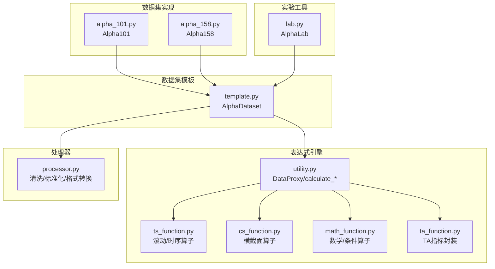
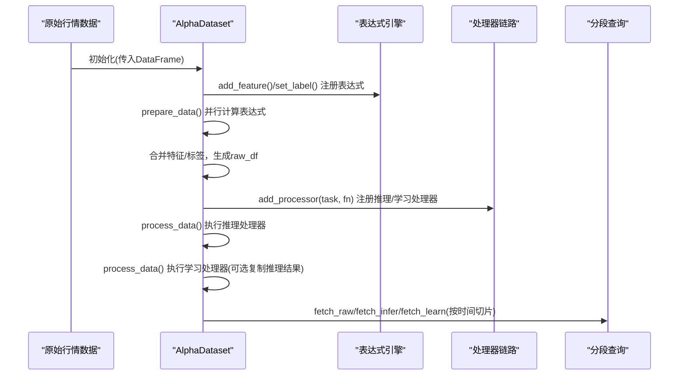
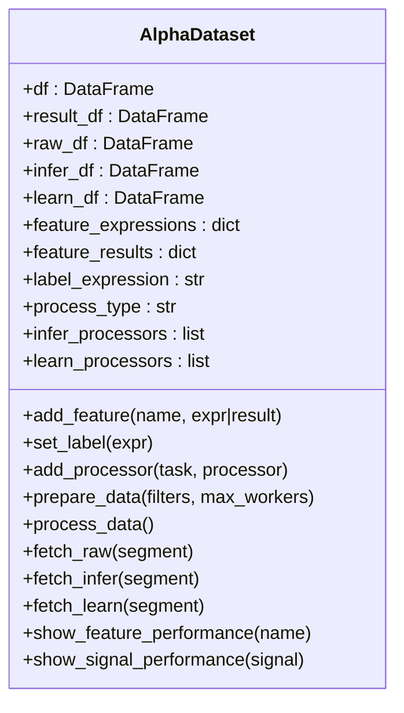
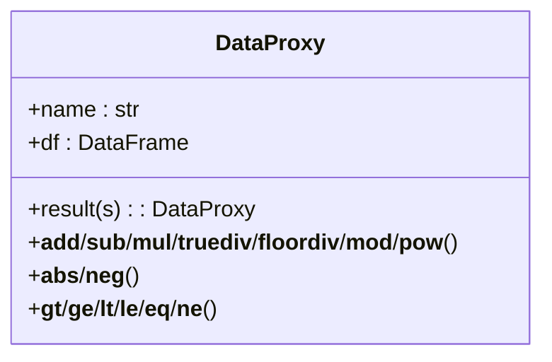
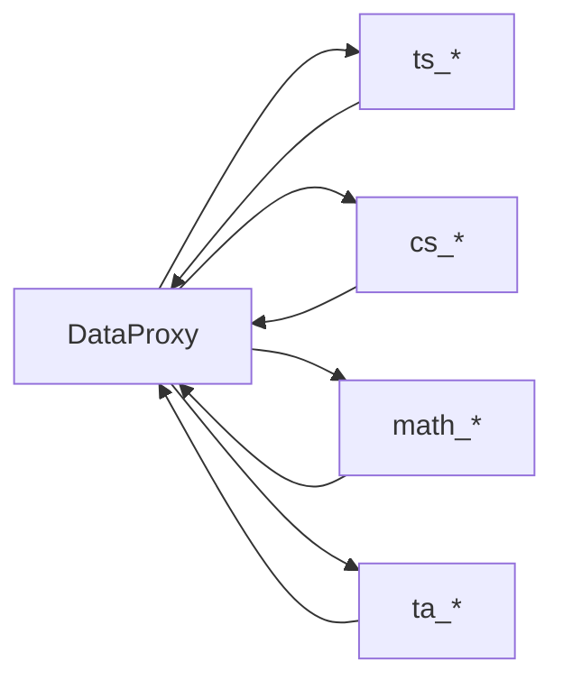
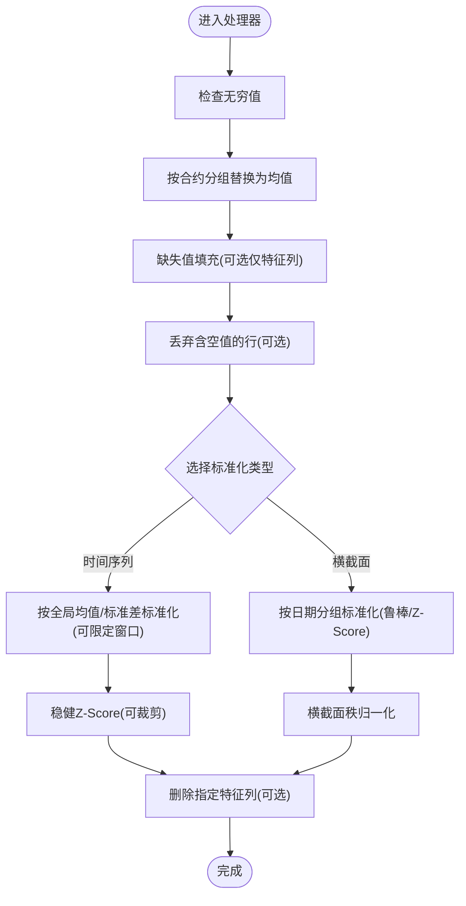
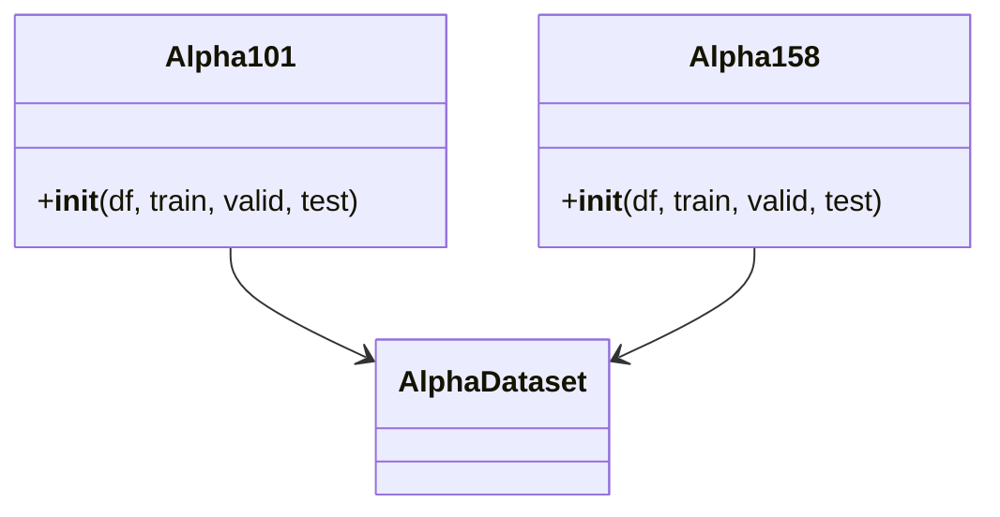
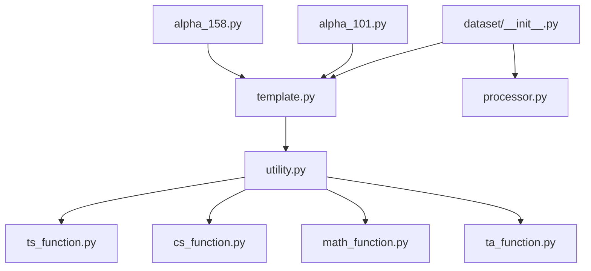

# 数据处理器

<cite>
**本文引用的文件**
- [processor.py](file://vnpy/alpha/dataset/processor.py)
- [template.py](file://vnpy/alpha/dataset/template.py)
- [utility.py](file://vnpy/alpha/dataset/utility.py)
- [ts_function.py](file://vnpy/alpha/dataset/ts_function.py)
- [cs_function.py](file://vnpy/alpha/dataset/cs_function.py)
- [math_function.py](file://vnpy/alpha/dataset/math_function.py)
- [ta_function.py](file://vnpy/alpha/dataset/ta_function.py)
- [alpha_101.py](file://vnpy/alpha/dataset/datasets/alpha_101.py)
- [alpha_158.py](file://vnpy/alpha/dataset/datasets/alpha_158.py)
- [test_dataproxy.py](file://tests/alpha/test_dataproxy.py)
- [lab.py](file://vnpy/alpha/lab.py)
- [__init__.py](file://vnpy/alpha/dataset/__init__.py)
</cite>

## 目录
1. [简介](#简介)
2. [项目结构](#项目结构)
3. [核心组件](#核心组件)
4. [架构总览](#架构总览)
5. [详细组件分析](#详细组件分析)
6. [依赖关系分析](#依赖关系分析)
7. [性能考虑](#性能考虑)
8. [故障排查指南](#故障排查指南)
9. [结论](#结论)
10. [附录](#附录)

## 简介
本文件面向Alpha数据集处理器，系统化阐述其设计原理与实现机制，覆盖数据预处理、特征工程、数据清洗与格式转换等关键能力；解释处理器的注册与执行流程，说明推理与学习阶段的差异化应用；总结处理器组合使用模式与性能优化策略，并提供可复用的实现示例与自定义处理器开发指南。

## 项目结构
该模块围绕“数据集模板 + 表达式引擎 + 处理器集合”组织，核心目录如下：
- 模板层：定义数据准备、分段查询、性能分析等通用流程
- 表达式引擎：提供跨时序、横截面、技术分析与数学运算函数
- 处理器层：提供缺失值、无穷值、标准化、去特征等数据清洗与格式转换功能
- 数据集实现：内置Alpha101、Alpha158等经典因子集，展示表达式与标签设置
- 实验工具：AlphaLab提供数据加载、保存与持久化，便于研究与回测

图表来源
- [template.py](file://vnpy/alpha/dataset/template.py#L23-L306)
- [utility.py](file://vnpy/alpha/dataset/utility.py#L19-L286)
- [ts_function.py](file://vnpy/alpha/dataset/ts_function.py#L1-L330)
- [cs_function.py](file://vnpy/alpha/dataset/cs_function.py#L1-L65)
- [math_function.py](file://vnpy/alpha/dataset/math_function.py#L1-L168)
- [ta_function.py](file://vnpy/alpha/dataset/ta_function.py#L1-L44)
- [processor.py](file://vnpy/alpha/dataset/processor.py#L1-L202)
- [alpha_101.py](file://vnpy/alpha/dataset/datasets/alpha_101.py#L1-L331)
- [alpha_158.py](file://vnpy/alpha/dataset/datasets/alpha_158.py#L1-L131)
- [lab.py](file://vnpy/alpha/lab.py#L20-L200)

章节来源
- [template.py](file://vnpy/alpha/dataset/template.py#L23-L306)
- [__init__.py](file://vnpy/alpha/dataset/__init__.py#L1-L31)

## 核心组件
- AlphaDataset：统一的数据集生命周期管理，负责特征表达式计算、标签设置、按时间分段取数、推理/学习数据分离与性能分析。
- DataProxy：表达式引擎的中间载体，支持与标量或另一个DataProxy进行四则、比较、幂等运算，并自动保持索引列（datetime, vt_symbol）。
- 表达式函数族：时序（滚动窗口）、横截面（按日期分组）、技术分析（基于TA-Lib）、数学/条件（最小/最大、log、abs、sign、三元条件等）。
- 处理器函数：缺失值填充/丢弃、无穷值替换、时间序列/横截面标准化、稳健Z-Score、特征列删除、按日期分位排名归一化等。
- 数据集实现：Alpha101/Alpha158通过表达式声明因子，统一设置标签，便于后续建模与回测。

章节来源
- [template.py](file://vnpy/alpha/dataset/template.py#L23-L306)
- [utility.py](file://vnpy/alpha/dataset/utility.py#L19-L286)
- [ts_function.py](file://vnpy/alpha/dataset/ts_function.py#L1-L330)
- [cs_function.py](file://vnpy/alpha/dataset/cs_function.py#L1-L65)
- [math_function.py](file://vnpy/alpha/dataset/math_function.py#L1-L168)
- [ta_function.py](file://vnpy/alpha/dataset/ta_function.py#L1-L44)
- [processor.py](file://vnpy/alpha/dataset/processor.py#L1-L202)
- [alpha_101.py](file://vnpy/alpha/dataset/datasets/alpha_101.py#L1-L331)
- [alpha_158.py](file://vnpy/alpha/dataset/datasets/alpha_158.py#L1-L131)

## 架构总览
下图展示了从原始行情到可用训练/推理数据的端到端流程：表达式计算生成特征与标签 → 合并结果 → 原始数据构建 → 推理/学习数据分离 → 处理器链路执行 → 分段取数用于分析与回测。

图表来源
- [template.py](file://vnpy/alpha/dataset/template.py#L90-L194)
- [utility.py](file://vnpy/alpha/dataset/utility.py#L203-L265)
- [processor.py](file://vnpy/alpha/dataset/processor.py#L1-L202)

## 详细组件分析

### AlphaDataset：数据集模板与生命周期
- 特征与标签管理：add_feature(name, expression|result)、set_label(expression) 支持表达式或外部结果注入；最终合并到统一结果表。
- 并行表达式计算：prepare_data内部以多进程并行调用calculate_feature，提升大规模因子计算效率。
- 数据分段与过滤：支持按时间段切片与成分股过滤，确保训练/验证/测试周期清晰可控。
- 推理/学习分离：process_data先对推理数据执行推理专用处理器，再对学习数据执行学习专用处理器；process_type为“append”时学习数据直接复用推理结果。
- 性能分析：show_feature_performance与show_signal_performance对接Alphalens，输出因子/信号的分位表现与收益分析。

图表来源
- [template.py](file://vnpy/alpha/dataset/template.py#L23-L306)

章节来源
- [template.py](file://vnpy/alpha/dataset/template.py#L23-L306)

### DataProxy：表达式中间载体与算子重载
- 作用：将单列数值封装为DataProxy，支持与标量或另一个DataProxy进行加减乘除、整除、取模、幂、比较等运算，自动保持datetime与vt_symbol索引列。
- 结果归一化：比较类操作返回Int32类型，保证逻辑判断的数值一致性。
- 与表达式引擎协作：calculate_by_expression/calculate_by_polars将表达式字符串或Polars Expr编译为Series，再封装为DataProxy参与后续运算。

图表来源
- [utility.py](file://vnpy/alpha/dataset/utility.py#L19-L201)

章节来源
- [utility.py](file://vnpy/alpha/dataset/utility.py#L19-L286)
- [test_dataproxy.py](file://tests/alpha/test_dataproxy.py#L1-L107)

### 表达式函数族：时序/横截面/技术分析/数学
- 时序算子（ts_*）：延迟、滚动最小/最大/求和/均值/标准差、斜率/决定系数/残差、相关性、量化分位、线性衰减、乘积、差分等，均按股票分组滚动计算。
- 横截面算子（cs_*）：按日期分组的排序、均值/标准差/求和、向量缩放（按绝对值和归一化）。
- 技术分析（ta_*）：基于TA-Lib的RSI、ATR，封装为DataProxy以便与表达式无缝拼接。
- 数学/条件（math_*）：最小/最大、log、abs、sign、幂（含安全负基幂处理）、三元条件quesval/quesval2等。

图表来源
- [ts_function.py](file://vnpy/alpha/dataset/ts_function.py#L12-L330)
- [cs_function.py](file://vnpy/alpha/dataset/cs_function.py#L10-L65)
- [math_function.py](file://vnpy/alpha/dataset/math_function.py#L10-L168)
- [ta_function.py](file://vnpy/alpha/dataset/ta_function.py#L24-L44)

章节来源
- [ts_function.py](file://vnpy/alpha/dataset/ts_function.py#L1-L330)
- [cs_function.py](file://vnpy/alpha/dataset/cs_function.py#L1-L65)
- [math_function.py](file://vnpy/alpha/dataset/math_function.py#L1-L168)
- [ta_function.py](file://vnpy/alpha/dataset/ta_function.py#L1-L44)

### 处理器函数：数据清洗与格式转换
- 缺失值处理：丢弃含空值的行，或按列填充固定值；支持仅对特征列填充。
- 无穷值替换：按合约分组计算有限值均值，将无穷替换为对应均值。
- 时间序列标准化：可指定训练期窗口，按全局均值/标准差标准化，避免泄漏；零方差时原样保留。
- 横截面标准化：按交易日分组，支持鲁棒中位数/标准差或Z-Score标准化，并裁剪异常值。
- 稳健Z-Score：按日期分组中位数与MAD估计，可选裁剪3σ。
- 特征列删除：按名称批量删除特征列。
- 横截面填充：按日期分组用均值填充缺失。
- 横截面秩归一化：按日期分组rank后线性映射到中心化区间。

图表来源
- [processor.py](file://vnpy/alpha/dataset/processor.py#L9-L202)

章节来源
- [processor.py](file://vnpy/alpha/dataset/processor.py#L1-L202)

### 数据集实现：Alpha101 与 Alpha158
- Alpha101：基于WorldQuant 101个基础因子的表达式集合，统一设置未来N期收益率作为标签。
- Alpha158：基于Qlib的158个基础因子集合，涵盖K线形态、价格变化、多种滚动窗口统计与动量/波动率指标，同样设置未来收益率标签。

图表来源
- [alpha_101.py](file://vnpy/alpha/dataset/datasets/alpha_101.py#L6-L331)
- [alpha_158.py](file://vnpy/alpha/dataset/datasets/alpha_158.py#L6-L131)

章节来源
- [alpha_101.py](file://vnpy/alpha/dataset/datasets/alpha_101.py#L1-L331)
- [alpha_158.py](file://vnpy/alpha/dataset/datasets/alpha_158.py#L1-L131)

### AlphaLab：数据加载与持久化
- 提供BarData的读写（Parquet），支持日线/分钟线扩展天数与范围过滤。
- 与AlphaDataset结合，便于在实验室环境中快速加载历史数据、构建数据集并进行因子分析与模型训练。

章节来源
- [lab.py](file://vnpy/alpha/lab.py#L51-L200)

## 依赖关系分析
- 模块导出：通过dataset/__init__.py统一导出AlphaDataset、Segment、to_datetime、register_functions以及全部处理器函数，便于上层直接引用。
- 表达式引擎与处理器解耦：表达式计算独立于清洗/标准化流程，二者通过DataFrame接口衔接，利于灵活组合。
- 数据集实现依赖模板：Alpha101/Alpha158继承AlphaDataset，复用统一的生命周期与分段取数能力。

图表来源
- [__init__.py](file://vnpy/alpha/dataset/__init__.py#L1-L31)
- [template.py](file://vnpy/alpha/dataset/template.py#L23-L306)
- [utility.py](file://vnpy/alpha/dataset/utility.py#L19-L286)
- [ts_function.py](file://vnpy/alpha/dataset/ts_function.py#L1-L330)
- [cs_function.py](file://vnpy/alpha/dataset/cs_function.py#L1-L65)
- [math_function.py](file://vnpy/alpha/dataset/math_function.py#L1-L168)
- [ta_function.py](file://vnpy/alpha/dataset/ta_function.py#L1-L44)
- [alpha_101.py](file://vnpy/alpha/dataset/datasets/alpha_101.py#L1-L331)
- [alpha_158.py](file://vnpy/alpha/dataset/datasets/alpha_158.py#L1-L131)

章节来源
- [__init__.py](file://vnpy/alpha/dataset/__init__.py#L1-L31)

## 性能考虑
- 并行表达式计算：prepare_data使用多进程池并行计算多个表达式，显著缩短大规模因子生成耗时。
- 滚动窗口优化：时序算子（如ts_slope、ts_rsquare、ts_resi）采用预计算常量与向量化表达式，减少Python循环开销。
- 内存与I/O：建议在prepare_data前尽量缩小数据范围（按时间/成分股过滤），并在AlphaLab中使用Parquet存储以降低I/O成本。
- 处理器顺序：将昂贵的滚动/分组操作放在推理阶段，学习阶段优先使用轻量标准化与裁剪，避免重复计算。

## 故障排查指南
- 表达式运行错误
  - 症状：eval执行时报未定义变量或函数名错误。
  - 排查：确认所有使用的函数已在calculate_by_expression中导入，或通过register_functions注册到EXPRESSION_FUNCTIONS。
- 无穷值导致NaN传播
  - 症状：标准化后出现大量NaN。
  - 排查：先执行process_replace_inf，再进行标准化；检查是否存在全为无穷的分组。
- 标准化零方差
  - 症状：时间序列标准化列保持原值。
  - 排查：process_ts_norm对std为0的情况直接返回原值，属预期行为；若需抑制，可在表达式侧加入噪声或调整窗口。
- 横截面分组为空
  - 症状：按日期分组的均值/中位数计算失败。
  - 排查：确认datetime列已正确解析；检查是否进行了过严的时间/成分股过滤。
- 多进程卡死
  - 症状：prepare_data长时间无响应。
  - 排查：检查max_workers设置与系统资源；确保表达式计算不依赖不可序列化对象。

章节来源
- [utility.py](file://vnpy/alpha/dataset/utility.py#L13-L17)
- [processor.py](file://vnpy/alpha/dataset/processor.py#L80-L128)
- [template.py](file://vnpy/alpha/dataset/template.py#L90-L157)

## 结论
该数据处理器以“表达式引擎 + 模板 + 处理器集合”的架构实现了从原始行情到可建模数据的完整流水线。通过并行表达式计算、丰富的时序/横截面/技术分析与数学算子，以及完善的清洗与标准化能力，既满足学术研究的探索需求，也便于工业级的模型训练与回测集成。

## 附录

### 处理器注册与执行流程
- 注册：通过add_processor(task, processor)将处理器函数注册到推理或学习链路。
- 执行：process_data按顺序依次对推理/学习数据应用处理器；process_type为“append”时学习数据复用推理结果。

章节来源
- [template.py](file://vnpy/alpha/dataset/template.py#L81-L173)

### 推理与学习阶段的应用差异
- 推理阶段：侧重稳定、可解释且无未来信息泄露的特征；常用横截面标准化、稳健Z-Score、特征删除与秩归一化。
- 学习阶段：在推理基础上进一步裁剪异常值、统一特征范围；必要时复制推理结果以避免重复计算。

章节来源
- [template.py](file://vnpy/alpha/dataset/template.py#L159-L194)
- [processor.py](file://vnpy/alpha/dataset/processor.py#L34-L185)

### 组合使用模式与最佳实践
- 典型链路：replace_inf → cs_fill_na → cs_norm/robust_zscore_norm → drop_feature → ts_norm（可选）
- 条件链路：先做fillna/replace_inf，再做rank_norm或robust_zscore_norm，最后裁剪outlier
- 分段策略：先在训练期fit参数（如robust_zscore_norm/ts_norm），再对全样本应用

章节来源
- [processor.py](file://vnpy/alpha/dataset/processor.py#L80-L185)

### 自定义处理器开发指南
- 函数签名：接收DataFrame并返回DataFrame，保持datetime与vt_symbol不变。
- 注意事项：使用with_columns/over("datetime"/"vt_symbol")确保按组计算；对可能产生无穷/NaN的运算进行显式处理。
- 注册与测试：将自定义函数加入processor模块，通过AlphaDataset.add_processor注册；使用小规模数据集验证结果。

章节来源
- [processor.py](file://vnpy/alpha/dataset/processor.py#L1-L202)
- [template.py](file://vnpy/alpha/dataset/template.py#L81-L88)