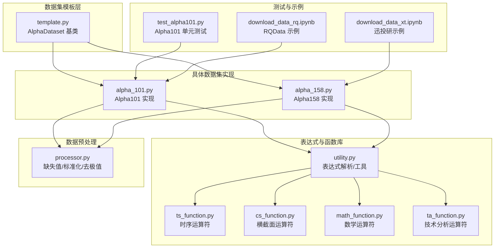
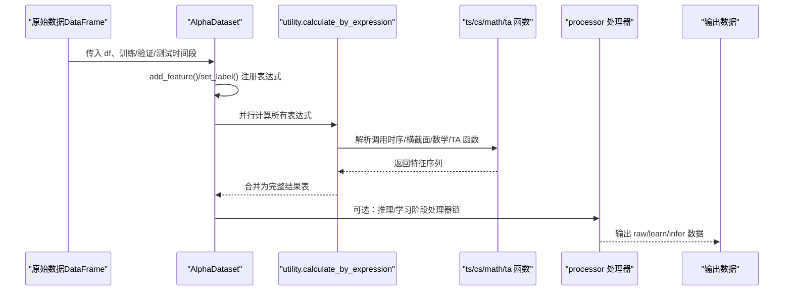
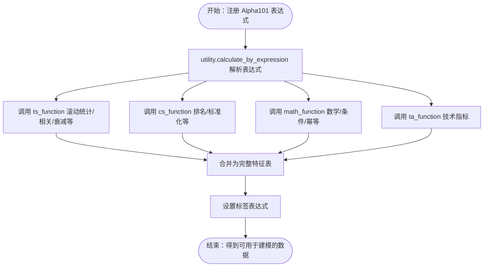
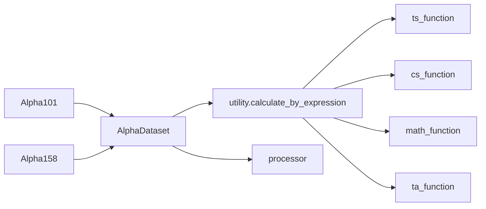

# 标准数据集

<cite>
**本文引用的文件**
- [alpha_101.py](file://vnpy/alpha/dataset/datasets/alpha_101.py)
- [alpha_158.py](file://vnpy/alpha/dataset/datasets/alpha_158.py)
- [template.py](file://vnpy/alpha/dataset/template.py)
- [processor.py](file://vnpy/alpha/dataset/processor.py)
- [utility.py](file://vnpy/alpha/dataset/utility.py)
- [ts_function.py](file://vnpy/alpha/dataset/ts_function.py)
- [cs_function.py](file://vnpy/alpha/dataset/cs_function.py)
- [math_function.py](file://vnpy/alpha/dataset/math_function.py)
- [ta_function.py](file://vnpy/alpha/dataset/ta_function.py)
- [test_alpha101.py](file://tests/test_alpha101.py)
- [__init__.py](file://vnpy/alpha/__init__.py)
- [download_data_rq.ipynb](file://examples/alpha_research/download_data_rq.ipynb)
- [download_data_xt.ipynb](file://examples/alpha_research/download_data_xt.ipynb)
</cite>

## 目录
1. [引言](#引言)
2. [项目结构](#项目结构)
3. [核心组件](#核心组件)
4. [架构总览](#架构总览)
5. [详细组件分析](#详细组件分析)
6. [依赖关系分析](#依赖关系分析)
7. [性能考虑](#性能考虑)
8. [故障排查指南](#故障排查指南)
9. [结论](#结论)
10. [附录](#附录)

## 引言
本技术文档围绕 vnpy 项目中的 Alpha 标准数据集，系统性介绍 Alpha101 与 Alpha158 两大标准数据集的设计理念、特征构成、计算逻辑与应用场景，并结合数据处理流水线、标准化流程与质量保障机制，帮助读者快速理解与高效使用该套数据集进行量化研究。

## 项目结构
Alpha 标准数据集位于 vnpy.alpha 子模块中，采用“模板 + 具体实现 + 工具函数”的分层设计：
- 数据集模板与生命周期管理：template.py 提供 AlphaDataset 基类，统一特征注册、表达式计算、数据准备、训练/验证/测试划分与后处理流程。
- 具体数据集实现：datasets/alpha_101.py 与 datasets/alpha_158.py 分别实现 WorldQuant 的 101 个因子与 Qlib 的 158 个因子集合。
- 表达式与函数库：utility.py 定义表达式解析与 DataProxy 运算符重载；ts_function.py、cs_function.py、math_function.py、ta_function.py 提供时序、横截面、数学与技术分析运算符。
- 数据预处理：processor.py 提供缺失值填充、无穷值替换、标准化、去极值等常用处理流程。
- 测试与示例：tests/test_alpha101.py 提供 Alpha101 的单元测试样例；examples/alpha_research 下提供数据下载与使用的示例笔记本。

图表来源
- [template.py](file://vnpy/alpha/dataset/template.py#L23-L306)
- [alpha_101.py](file://vnpy/alpha/dataset/datasets/alpha_101.py#L6-L331)
- [alpha_158.py](file://vnpy/alpha/dataset/datasets/alpha_158.py#L6-L131)
- [utility.py](file://vnpy/alpha/dataset/utility.py#L19-L286)
- [ts_function.py](file://vnpy/alpha/dataset/ts_function.py#L1-L330)
- [cs_function.py](file://vnpy/alpha/dataset/cs_function.py#L1-L65)
- [math_function.py](file://vnpy/alpha/dataset/math_function.py#L1-L168)
- [ta_function.py](file://vnpy/alpha/dataset/ta_function.py#L1-L44)
- [processor.py](file://vnpy/alpha/dataset/processor.py#L1-L202)
- [test_alpha101.py](file://tests/test_alpha101.py#L1-L677)
- [download_data_rq.ipynb](file://examples/alpha_research/download_data_rq.ipynb#L1-L195)
- [download_data_xt.ipynb](file://examples/alpha_research/download_data_xt.ipynb#L1-L800)

章节来源
- [template.py](file://vnpy/alpha/dataset/template.py#L23-L306)
- [alpha_101.py](file://vnpy/alpha/dataset/datasets/alpha_101.py#L6-L331)
- [alpha_158.py](file://vnpy/alpha/dataset/datasets/alpha_158.py#L6-L131)

## 核心组件
- AlphaDataset（模板基类）
  - 负责特征表达式注册、标签设置、并行计算表达式、按时间切片生成训练/验证/测试数据、以及可插拔的推理/学习阶段处理器链。
  - 关键接口：add_feature、set_label、prepare_data、process_data、fetch_raw/fetch_infer/fetch_learn。
- Alpha101 与 Alpha158
  - Alpha101：实现 WorldQuant 101 个基础因子，覆盖动量、动量平滑、波动率、换手、价格形态、量价关系、趋势与动量等主题。
  - Alpha158：实现 Qlib 158 个特征，涵盖蜡烛图形态、价格相对水平、多周期动量/均值/波动率/回归残差、分位数/排名、RSV、最高最低位置占比、价量相关性与变化强度等。
- 表达式与函数库
  - utility.py：通过 DataProxy 将字符串表达式映射为可执行的特征序列，支持跨列运算、比较、条件选择、幂运算等。
  - ts_function.py/cs_function.py/math_function.py/ta_function.py：提供滚动窗口统计、相关/协方差、排名/标准化、线性衰减平均、RSQ/残差、TA 指标等。
- 数据预处理
  - processor.py：提供缺失值处理、无穷值替换、横截面/时序标准化、鲁棒 Z-Score、交叉段归一化、特征删除等。

章节来源
- [template.py](file://vnpy/alpha/dataset/template.py#L23-L306)
- [utility.py](file://vnpy/alpha/dataset/utility.py#L19-L286)
- [ts_function.py](file://vnpy/alpha/dataset/ts_function.py#L1-L330)
- [cs_function.py](file://vnpy/alpha/dataset/cs_function.py#L1-L65)
- [math_function.py](file://vnpy/alpha/dataset/math_function.py#L1-L168)
- [ta_function.py](file://vnpy/alpha/dataset/ta_function.py#L1-L44)
- [processor.py](file://vnpy/alpha/dataset/processor.py#L1-L202)

## 架构总览
下图展示 Alpha 数据集从原始行情数据到特征矩阵与标签的完整流程，包括表达式解析、并行计算、数据拼接与切片。

图表来源
- [template.py](file://vnpy/alpha/dataset/template.py#L90-L194)
- [utility.py](file://vnpy/alpha/dataset/utility.py#L203-L265)
- [ts_function.py](file://vnpy/alpha/dataset/ts_function.py#L12-L330)
- [cs_function.py](file://vnpy/alpha/dataset/cs_function.py#L10-L65)
- [math_function.py](file://vnpy/alpha/dataset/math_function.py#L10-L168)
- [ta_function.py](file://vnpy/alpha/dataset/ta_function.py#L12-L44)
- [processor.py](file://vnpy/alpha/dataset/processor.py#L9-L202)

## 详细组件分析

### Alpha101 数据集
- 设计理念
  - 基于 WorldQuant 的 101 个经典 Alpha 因子，覆盖动量、波动率、量价关系、价格形态、动量平滑、趋势与动量等主题，适合作为因子挖掘与模型训练的基准数据集。
- 特征数量与类型
  - 共计 101 个因子，均为纯数值型特征，部分包含条件选择与符号变换。
- 计算逻辑概览
  - 使用表达式语言注册每个因子，内部通过 utility.calculate_by_expression 解析并调用 ts/cs/math/ta 函数完成滚动窗口统计、相关/协方差、排名、线性衰减、幂/对数/绝对值等操作。
  - 标签为未来一段时间的收益率（通常为滞后若干交易日的回报率），用于监督学习与回测评估。
- 应用场景
  - 因子有效性检验、IC/IR 分析、多因子模型构建、机器学习/深度学习模型训练与验证。
- 未实现与限制
  - 部分因子涉及行业因子中性化（IndNeutralize），当前未实现，标注为注释保留。

图表来源
- [alpha_101.py](file://vnpy/alpha/dataset/datasets/alpha_101.py#L6-L331)
- [utility.py](file://vnpy/alpha/dataset/utility.py#L203-L265)
- [ts_function.py](file://vnpy/alpha/dataset/ts_function.py#L12-L330)
- [cs_function.py](file://vnpy/alpha/dataset/cs_function.py#L10-L65)
- [math_function.py](file://vnpy/alpha/dataset/math_function.py#L10-L168)
- [ta_function.py](file://vnpy/alpha/dataset/ta_function.py#L12-L44)

章节来源
- [alpha_101.py](file://vnpy/alpha/dataset/datasets/alpha_101.py#L6-L331)
- [test_alpha101.py](file://tests/test_alpha101.py#L69-L677)

### Alpha158 数据集
- 设计理念
  - 基于 Qlib 的 158 个特征，强调多周期窗口的动量、均值、波动率、回归拟合、分位数与排名、RSV、最高/最低位置占比、价量相关性与变化强度等，便于构建多维度的因子空间。
- 特征数量与类型
  - 共计约 158 个特征，以数值型为主，包含多个窗口大小（如 5/10/20/30/60）的重复组合。
- 计算逻辑概览
  - 通过循环批量注册多个窗口的 ROC、MA、STD、Beta、RSQR、RESI、MAX/MIN、分位数、RANK、RSV、IMAX/IMIN/IMXD、CORR/CORD、涨跌计数与强度等。
  - 标签同样为未来一段时间的收益率。
- 应用场景
  - 因子空间探索、多周期特征融合、风险模型构建、信号合成与回测。

章节来源
- [alpha_158.py](file://vnpy/alpha/dataset/datasets/alpha_158.py#L6-L131)

### AlphaDataset 模板与生命周期
- 生命周期关键步骤
  - 构造：传入原始 DataFrame 与训练/验证/测试时间段，初始化特征表达式字典与结果缓存。
  - 注册：add_feature/set_label 注册表达式或直接注入特征结果。
  - 准备：prepare_data 并行计算表达式，合并特征与标签，按时间段切片，生成 raw/learn/infer 数据。
  - 处理：process_data 应用推理/学习阶段处理器链（如缺失值填充、标准化、去极值等）。
  - 查询：fetch_raw/fetch_infer/fetch_learn 按时间段返回对应数据。
- 性能与并发
  - 使用多进程池并行计算表达式，显著提升大规模数据集的特征生成效率。

章节来源
- [template.py](file://vnpy/alpha/dataset/template.py#L23-L306)

### 表达式与函数库
- DataProxy 与表达式解析
  - utility.calculate_by_expression 将字符串表达式映射为 DataProxy 对象链式运算，支持加减乘除、比较、条件选择、幂/对数/绝对值、符号等。
- 时序/横截面/数学/TA 运算符
  - ts_function：ts_delay、ts_min/max、ts_argmax/argmin、ts_rank、ts_sum/mean/std、ts_slope、ts_quantile、ts_rsquare、ts_resi、ts_corr、ts_less/greater、ts_log/abs、ts_delta、ts_cov、ts_decay_linear、ts_product。
  - cs_function：cs_rank、cs_mean、cs_std、cs_sum、cs_scale。
  - math_function：less、greater、log、abs、sign、quesval、quesval2、pow1、pow2。
  - ta_function：ta_rsi、ta_atr（基于 TA-Lib）。

章节来源
- [utility.py](file://vnpy/alpha/dataset/utility.py#L19-L286)
- [ts_function.py](file://vnpy/alpha/dataset/ts_function.py#L1-L330)
- [cs_function.py](file://vnpy/alpha/dataset/cs_function.py#L1-L65)
- [math_function.py](file://vnpy/alpha/dataset/math_function.py#L1-L168)
- [ta_function.py](file://vnpy/alpha/dataset/ta_function.py#L1-L44)

### 数据预处理与质量保障
- 缺失值处理
  - drop_na、fill_na、cs_fill_na：支持整体/按列/按字段填充，以及跨截面均值填充。
- 无穷值处理
  - replace_inf：按股票分组用均值替换无穷值，避免极端值影响模型稳定性。
- 标准化与去极值
  - cs_norm（robust/zscore）、ts_norm、robust_zscore_norm、cs_rank_norm：支持横截面/时序标准化与排名标准化。
- 特征选择
  - drop_feature：按名称删除不需要的特征列。

章节来源
- [processor.py](file://vnpy/alpha/dataset/processor.py#L1-L202)

## 依赖关系分析
- 组件耦合
  - AlphaDataset 是核心枢纽，依赖 utility 的表达式解析与 DataProxy 运算符，间接依赖 ts/cs/math/ta 函数库。
  - 具体数据集（Alpha101/Alpha158）仅负责表达式注册与标签设置，不直接参与计算细节，降低耦合度。
- 外部依赖
  - Polars 作为高性能数据框架，支撑表达式与窗口计算。
  - TA-Lib 用于技术指标（RSI/ATR）。
  - Alphalens 用于因子分析与回测报告（在模板中引入，用于性能分析接口）。

图表来源
- [template.py](file://vnpy/alpha/dataset/template.py#L23-L306)
- [utility.py](file://vnpy/alpha/dataset/utility.py#L203-L265)
- [ts_function.py](file://vnpy/alpha/dataset/ts_function.py#L12-L330)
- [cs_function.py](file://vnpy/alpha/dataset/cs_function.py#L10-L65)
- [math_function.py](file://vnpy/alpha/dataset/math_function.py#L10-L168)
- [ta_function.py](file://vnpy/alpha/dataset/ta_function.py#L12-L44)
- [processor.py](file://vnpy/alpha/dataset/processor.py#L1-L202)

## 性能考虑
- 并行计算
  - prepare_data 使用多进程池并行计算表达式，建议根据 CPU 核心数合理设置 max_workers。
- 内存与 IO
  - 大规模特征矩阵建议分批写盘或使用内存映射；注意 Polars 的列式存储与窗口计算的中间结果占用。
- 窗口长度与频率
  - Alpha158 的多窗口组合会显著增加特征数量，需权衡模型复杂度与过拟合风险。
- 标签滞后
  - 标签通常为未来一段时间的收益，需确保时间对齐与样本外测试区间正确划分。

## 故障排查指南
- 表达式语法错误
  - 确认变量名与列名一致，避免大小写与空格差异；检查括号匹配与函数参数顺序。
- 窗口长度越界
  - 当前数据长度不足时，滚动窗口可能返回空值；可通过填充或调整窗口长度解决。
- 缺失值与无穷值
  - 使用 fill_na/replace_inf/robust_zscore_norm 等处理器清理异常值。
- 并行进程卡死
  - 检查表达式是否包含不可序列化对象；必要时改用 Polars 表达式（calculate_by_polars）路径。
- 因子无序号/全零
  - 检查 cs_rank/corr 等对稳定性要求高的运算是否被极端值破坏；先做去极值再排序。

章节来源
- [template.py](file://vnpy/alpha/dataset/template.py#L90-L194)
- [processor.py](file://vnpy/alpha/dataset/processor.py#L9-L202)

## 结论
Alpha101 与 Alpha158 作为量化研究的标准数据集，提供了系统化的因子空间与统一的数据处理管线。借助 AlphaDataset 模板与表达式函数库，用户可以快速扩展新因子、集成外部数据源并进行稳健的质量控制与性能评估。建议在实际应用中结合业务场景选择合适的数据集与预处理策略，并通过严格的样本外测试与回测报告验证因子的有效性与稳定性。

## 附录

### Alpha101 特征列表与计算要点（节选）
- Alpha1 至 Alpha101：覆盖动量、波动率、量价关系、价格形态、趋势与动量等主题；部分因子包含条件选择与符号变换；标签为未来一段时间的收益率。
- 未实现因子：标注包含 IndNeutralize 的 Alpha48、Alpha56、Alpha58、Alpha59、Alpha62、Alpha63、Alpha67、Alpha70、Alpha71、Alpha76、Alpha79、Alpha80、Alpha82、Alpha87、Alpha89、Alpha90、Alpha91、Alpha93、Alpha97、Alpha100 等，当前未实现。

章节来源
- [alpha_101.py](file://vnpy/alpha/dataset/datasets/alpha_101.py#L6-L331)
- [test_alpha101.py](file://tests/test_alpha101.py#L69-L677)

### Alpha158 特征列表与计算要点（节选）
- 蜡烛图形态：kmid/klen/kmid_2/kup/kup_2/klow/klow_2/ksft/ksft_2 等。
- 价格相对水平：open_0/high_0/low_0/vwap_0 等。
- 多周期特征：ROC/MA/STD/Beta/RSQR/RESI/Max/Min/Quantile/Rank/RSV/IMAX/IMIN/IMXD/CORR/CORD/涨跌计数/强度/VMA/VSTD/WVMA/VSUM* 等，窗口为 5/10/20/30/60。
- 标签：未来一段时间的收益率。

章节来源
- [alpha_158.py](file://vnpy/alpha/dataset/datasets/alpha_158.py#L6-L131)

### 使用方法与数据格式说明
- 数据格式
  - 必须包含索引列：datetime、vt_symbol；以及基础价格与成交量：open、high、low、close、volume、vwap。
- 使用步骤
  - 构造 AlphaLab 或直接使用 AlphaDataset，传入 DataFrame 与训练/验证/测试时间段。
  - 选择数据集：Alpha101 或 Alpha158，调用 add_feature/set_label 注册表达式。
  - 调用 prepare_data 并行计算，process_data 应用预处理，最后通过 fetch_learn/fetch_infer 获取数据。
- 示例参考
  - RQData 数据下载与保存：download_data_rq.ipynb
  - 迅投研数据下载与保存：download_data_xt.ipynb

章节来源
- [template.py](file://vnpy/alpha/dataset/template.py#L90-L194)
- [download_data_rq.ipynb](file://examples/alpha_research/download_data_rq.ipynb#L1-L195)
- [download_data_xt.ipynb](file://examples/alpha_research/download_data_xt.ipynb#L1-L800)

### 质量保证机制
- 表达式测试
  - tests/test_alpha101.py 提供 Alpha101 的逐项表达式测试，覆盖极端值与边界情况。
- 因子分析接口
  - show_feature_performance/show_signal_performance：基于 Alphalens 进行因子 IC/IR 与分位数组合收益分析，辅助质量评估。

章节来源
- [test_alpha101.py](file://tests/test_alpha101.py#L1-L677)
- [template.py](file://vnpy/alpha/dataset/template.py#L195-L272)