# Alpha机器学习模块

<cite>
**本文档引用的文件**
- [vnpy/alpha/__init__.py](file://vnpy/alpha/__init__.py)
- [vnpy/alpha/lab.py](file://vnpy/alpha/lab.py)
- [vnpy/alpha/logger.py](file://vnpy/alpha/logger.py)
- [vnpy/alpha/dataset/template.py](file://vnpy/alpha/dataset/template.py)
- [vnpy/alpha/dataset/utility.py](file://vnpy/alpha/dataset/utility.py)
- [vnpy/alpha/dataset/processor.py](file://vnpy/alpha/dataset/processor.py)
- [vnpy/alpha/dataset/datasets/alpha_101.py](file://vnpy/alpha/dataset/datasets/alpha_101.py)
- [vnpy/alpha/dataset/datasets/alpha_158.py](file://vnpy/alpha/dataset/datasets/alpha_158.py)
- [vnpy/alpha/model/template.py](file://vnpy/alpha/model/template.py)
- [vnpy/alpha/model/models/lasso_model.py](file://vnpy/alpha/model/models/lasso_model.py)
- [vnpy/alpha/model/models/lgb_model.py](file://vnpy/alpha/model/models/lgb_model.py)
- [vnpy/alpha/model/models/mlp_model.py](file://vnpy/alpha/model/models/mlp_model.py)
- [vnpy/alpha/strategy/template.py](file://vnpy/alpha/strategy/template.py)
- [vnpy/alpha/strategy/backtesting.py](file://vnpy/alpha/strategy/backtesting.py)
- [vnpy/alpha/strategy/strategies/equity_demo_strategy.py](file://vnpy/alpha/strategy/strategies/equity_demo_strategy.py)
- [examples/alpha_research/download_data_rq.ipynb](file://examples/alpha_research/download_data_rq.ipynb)
- [examples/alpha_research/download_data_xt.ipynb](file://examples/alpha_research/download_data_xt.ipynb)
</cite>

## 目录
1. [简介](#简介)
2. [项目结构](#项目结构)
3. [核心组件](#核心组件)
4. [架构概览](#架构概览)
5. [详细组件分析](#详细组件分析)
6. [依赖关系分析](#依赖关系分析)
7. [性能考虑](#性能考虑)
8. [故障排除指南](#故障排除指南)
9. [结论](#结论)
10. [附录](#附录)

## 简介

vnpy.alpha是vn.py量化框架中的机器学习模块，专为量化研究人员提供从数据处理到策略开发的一站式解决方案。该模块基于Polars数据处理引擎和丰富的机器学习算法库，支持Alpha因子研究、模型训练和策略回测的完整工作流程。

本模块的核心价值在于：
- **统一的数据管理**：通过AlphaLab提供数据存储、索引和访问的统一接口
- **灵活的特征工程**：支持表达式驱动的特征计算和多维数据处理
- **标准化的模型框架**：提供统一的机器学习模型接口和训练流程
- **完整的策略回测**：内置策略模板和回测引擎，支持实盘模拟交易

## 项目结构

vnpy.alpha模块采用清晰的分层架构设计，主要包含以下核心目录：

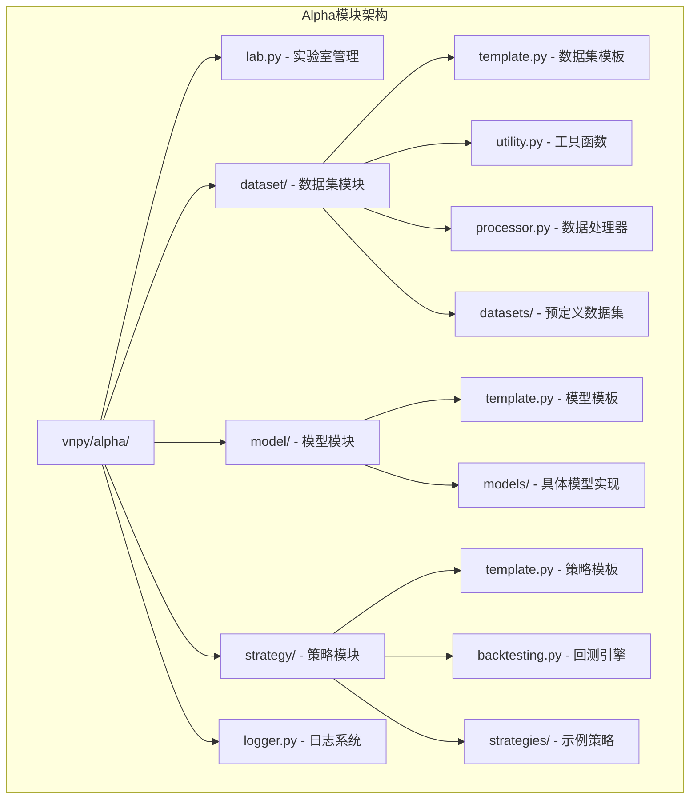

**图表来源**
- [vnpy/alpha/__init__.py](file://vnpy/alpha/__init__.py#L1-L19)
- [vnpy/alpha/lab.py](file://vnpy/alpha/lab.py#L20-L50)

**章节来源**
- [vnpy/alpha/__init__.py](file://vnpy/alpha/__init__.py#L1-L19)
- [vnpy/alpha/lab.py](file://vnpy/alpha/lab.py#L20-L50)

## 核心组件

### AlphaLab - 实验室管理中心

AlphaLab是整个模块的核心协调者，负责管理数据存储、模型管理和信号输出的统一接口。

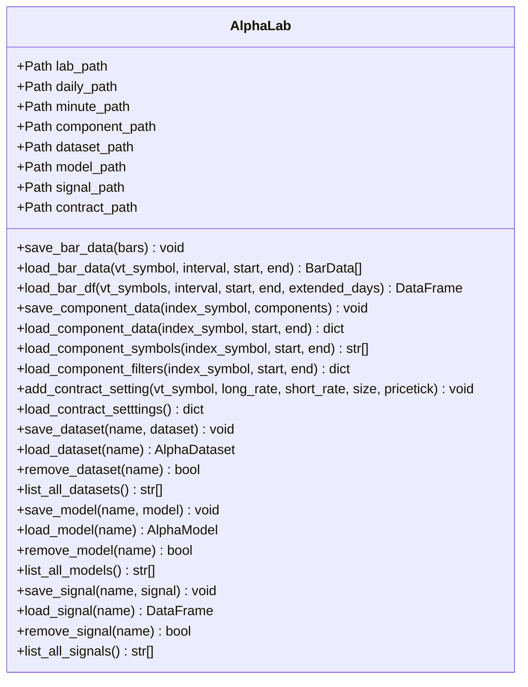

**图表来源**
- [vnpy/alpha/lab.py](file://vnpy/alpha/lab.py#L20-L481)

### AlphaDataset - 数据集模板

AlphaDataset提供了统一的数据处理框架，支持表达式驱动的特征计算和多阶段数据处理。

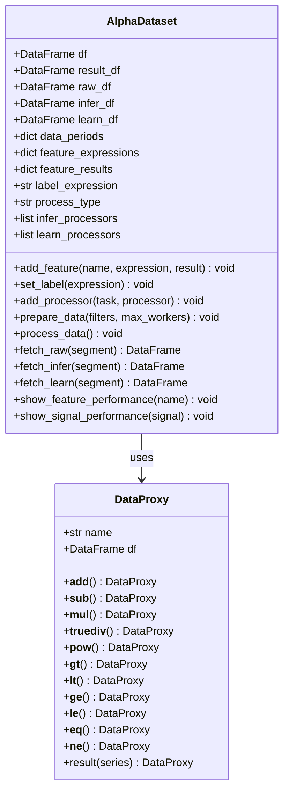

**图表来源**
- [vnpy/alpha/dataset/template.py](file://vnpy/alpha/dataset/template.py#L23-L306)
- [vnpy/alpha/dataset/utility.py](file://vnpy/alpha/dataset/utility.py#L19-L286)

**章节来源**
- [vnpy/alpha/dataset/template.py](file://vnpy/alpha/dataset/template.py#L23-L306)
- [vnpy/alpha/dataset/utility.py](file://vnpy/alpha/dataset/utility.py#L19-L286)

### AlphaModel - 模型模板

AlphaModel定义了统一的机器学习模型接口，支持多种算法的标准化训练和预测流程。

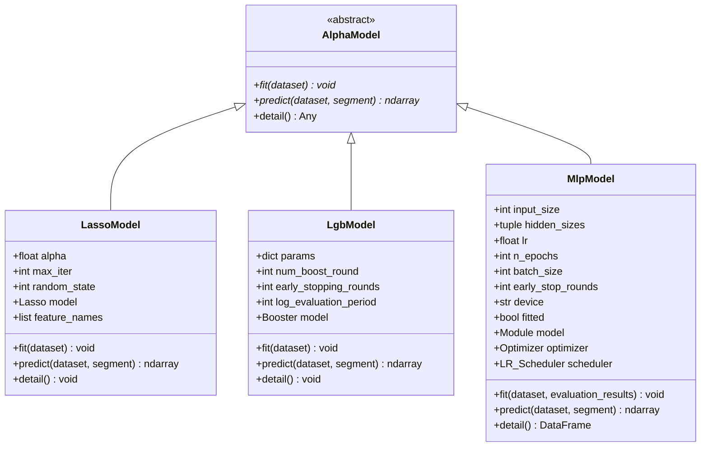

**图表来源**
- [vnpy/alpha/model/template.py](file://vnpy/alpha/model/template.py#L9-L31)
- [vnpy/alpha/model/models/lasso_model.py](file://vnpy/alpha/model/models/lasso_model.py#L13-L140)
- [vnpy/alpha/model/models/lgb_model.py](file://vnpy/alpha/model/models/lgb_model.py#L12-L171)
- [vnpy/alpha/model/models/mlp_model.py](file://vnpy/alpha/model/models/mlp_model.py#L22-L684)

**章节来源**
- [vnpy/alpha/model/template.py](file://vnpy/alpha/model/template.py#L9-L31)
- [vnpy/alpha/model/models/lasso_model.py](file://vnpy/alpha/model/models/lasso_model.py#L13-L140)
- [vnpy/alpha/model/models/lgb_model.py](file://vnpy/alpha/model/models/lgb_model.py#L12-L171)
- [vnpy/alpha/model/models/mlp_model.py](file://vnpy/alpha/model/models/mlp_model.py#L22-L684)

### AlphaStrategy - 策略模板

AlphaStrategy提供了策略开发的基础框架，支持回测和实盘交易的统一接口。

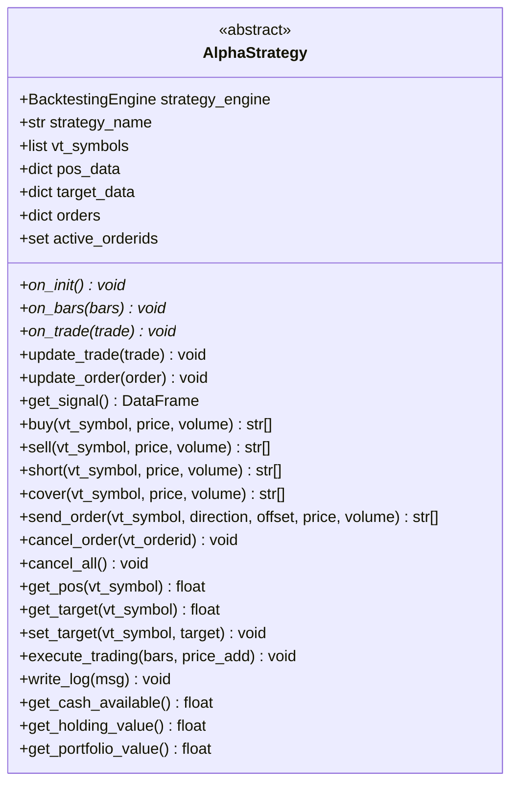

**图表来源**
- [vnpy/alpha/strategy/template.py](file://vnpy/alpha/strategy/template.py#L15-L206)

**章节来源**
- [vnpy/alpha/strategy/template.py](file://vnpy/alpha/strategy/template.py#L15-L206)

## 架构概览

Alpha模块采用分层架构设计，各层职责明确，耦合度低，便于扩展和维护。

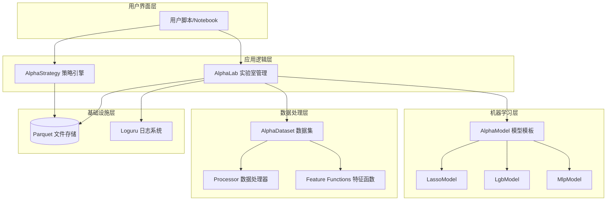

**图表来源**
- [vnpy/alpha/lab.py](file://vnpy/alpha/lab.py#L20-L50)
- [vnpy/alpha/dataset/template.py](file://vnpy/alpha/dataset/template.py#L23-L50)
- [vnpy/alpha/model/template.py](file://vnpy/alpha/model/template.py#L9-L31)

## 详细组件分析

### 数据集模块

数据集模块是Alpha模块的核心，提供了完整的数据处理管道和特征工程能力。

#### 表达式计算系统

表达式计算系统是数据集模块的核心创新，支持基于字符串表达式的特征计算。

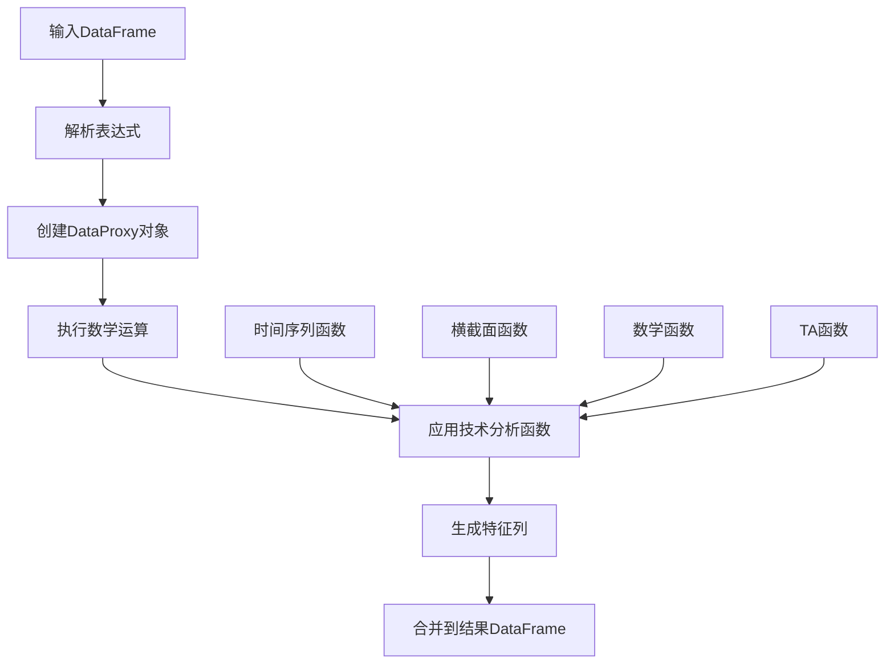

**图表来源**
- [vnpy/alpha/dataset/utility.py](file://vnpy/alpha/dataset/utility.py#L203-L255)

#### 数据处理器

数据处理器提供了一系列标准化的数据预处理功能：

| 处理器类型 | 功能描述 | 应用场景 |
|-----------|----------|----------|
| drop_na | 删除缺失值行 | 数据清洗，提高模型质量 |
| fill_na | 填充缺失值 | 处理停牌或数据不完整情况 |
| cs_norm | 横截面标准化 | 不同股票间的特征可比性 |
| ts_norm | 时间序列标准化 | 控制时变趋势影响 |
| robust_zscore_norm | 稳健Z-Score标准化 | 抗异常值影响 |
| cs_rank_norm | 横截面排名标准化 | 排序稳定性 |

**章节来源**
- [vnpy/alpha/dataset/processor.py](file://vnpy/alpha/dataset/processor.py#L9-L202)

### 模型模块

模型模块提供了标准化的机器学习框架，支持多种算法的统一训练和评估。

#### 预定义数据集

模块内置了两个经典的Alpha因子数据集：

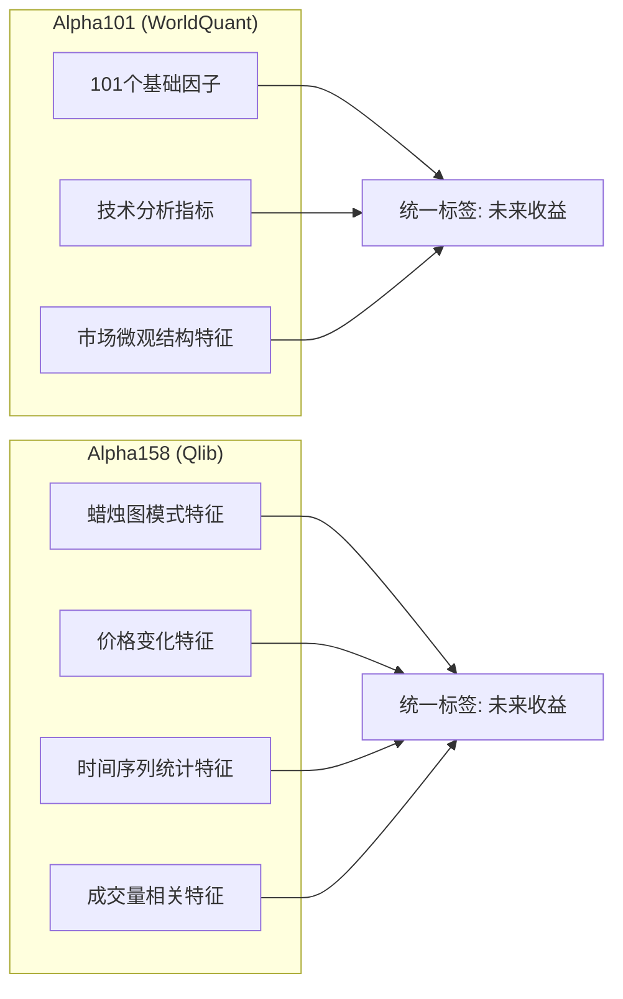

**图表来源**
- [vnpy/alpha/dataset/datasets/alpha_101.py](file://vnpy/alpha/dataset/datasets/alpha_101.py#L6-L331)
- [vnpy/alpha/dataset/datasets/alpha_158.py](file://vnpy/alpha/dataset/datasets/alpha_158.py#L6-L131)

**章节来源**
- [vnpy/alpha/dataset/datasets/alpha_101.py](file://vnpy/alpha/dataset/datasets/alpha_101.py#L6-L331)
- [vnpy/alpha/dataset/datasets/alpha_158.py](file://vnpy/alpha/dataset/datasets/alpha_158.py#L6-L131)

### 策略模块

策略模块提供了完整的策略开发和回测框架。

#### 回测引擎工作流程

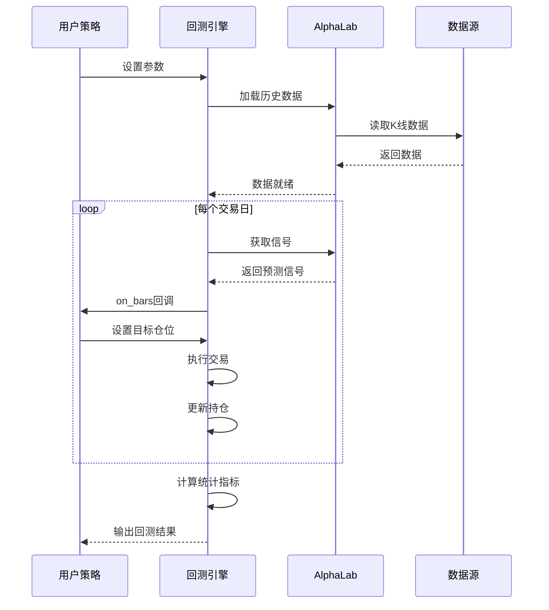

**图表来源**
- [vnpy/alpha/strategy/backtesting.py](file://vnpy/alpha/strategy/backtesting.py#L150-L169)

**章节来源**
- [vnpy/alpha/strategy/backtesting.py](file://vnpy/alpha/strategy/backtesting.py#L22-L800)

### 示例策略分析

以EquityDemoStrategy为例，展示策略开发的最佳实践：

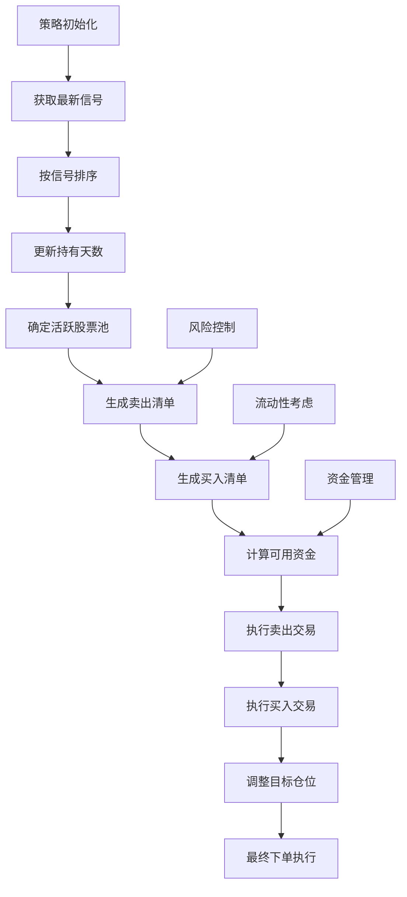

**图表来源**
- [vnpy/alpha/strategy/strategies/equity_demo_strategy.py](file://vnpy/alpha/strategy/strategies/equity_demo_strategy.py#L38-L102)

**章节来源**
- [vnpy/alpha/strategy/strategies/equity_demo_strategy.py](file://vnpy/alpha/strategy/strategies/equity_demo_strategy.py#L12-L102)

## 依赖关系分析

Alpha模块的依赖关系清晰，遵循单一职责原则和开闭原则。

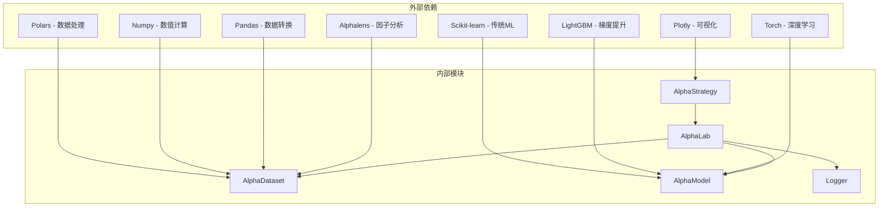

**图表来源**
- [vnpy/alpha/dataset/template.py](file://vnpy/alpha/dataset/template.py#L8-L14)
- [vnpy/alpha/model/models/lasso_model.py](file://vnpy/alpha/model/models/lasso_model.py#L1-L10)
- [vnpy/alpha/model/models/lgb_model.py](file://vnpy/alpha/model/models/lgb_model.py#L1-L9)

**章节来源**
- [vnpy/alpha/dataset/template.py](file://vnpy/alpha/dataset/template.py#L8-L14)
- [vnpy/alpha/model/models/lasso_model.py](file://vnpy/alpha/model/models/lasso_model.py#L1-L10)
- [vnpy/alpha/model/models/lgb_model.py](file://vnpy/alpha/model/models/lgb_model.py#L1-L9)

## 性能考虑

### 并行计算优化

Alpha模块在数据处理阶段采用了多进程并行计算，显著提升了大规模数据处理效率。

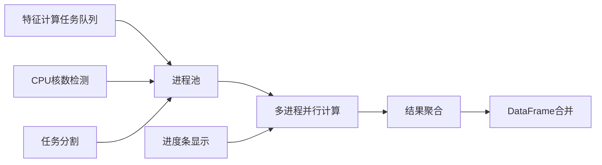

**图表来源**
- [vnpy/alpha/dataset/template.py](file://vnpy/alpha/dataset/template.py#L103-L118)

### 内存管理策略

- **延迟加载**：使用Polars的惰性计算特性，减少内存占用
- **分块处理**：对大数据集进行分块处理，避免内存溢出
- **缓存机制**：使用LRU缓存机制缓存常用数据

### I/O优化

- **Parquet格式**：使用Parquet作为默认存储格式，支持列式存储和压缩
- **批量操作**：支持批量数据读写，减少I/O次数
- **索引优化**：自动建立时间索引，加速查询操作

## 故障排除指南

### 常见问题及解决方案

| 问题类型 | 症状描述 | 可能原因 | 解决方案 |
|---------|----------|----------|----------|
| 数据加载失败 | 文件不存在或格式错误 | 路径配置错误或数据格式不匹配 | 检查文件路径和数据格式 |
| 特征计算异常 | 表达式语法错误或函数未定义 | 表达式语法错误或自定义函数未注册 | 验证表达式语法和函数注册 |
| 模型训练失败 | 收敛困难或过拟合 | 数据质量问题或超参数设置不当 | 检查数据质量和调整超参数 |
| 回测结果异常 | 交易信号与预期不符 | 策略逻辑错误或参数设置问题 | 调试策略逻辑和参数配置 |

### 调试技巧

1. **日志分析**：利用Loguru的日志系统查看详细的执行过程
2. **中间结果检查**：在关键节点输出中间结果进行验证
3. **小规模测试**：先用小数据集验证逻辑正确性
4. **逐步调试**：将复杂流程分解为简单步骤逐一调试

**章节来源**
- [vnpy/alpha/logger.py](file://vnpy/alpha/logger.py#L1-L13)

## 结论

vnpy.alpha机器学习模块为量化研究人员提供了一个功能完整、架构清晰的开发平台。通过统一的数据管理、灵活的特征工程和标准化的模型框架，研究人员可以专注于算法创新和策略开发。

模块的主要优势包括：
- **完整的工具链**：从数据获取到策略回测的全流程支持
- **高性能计算**：基于Polars的高效数据处理和并行计算
- **灵活的扩展性**：清晰的接口设计支持自定义算法和策略
- **完善的监控**：详细的日志和可视化支持

对于初学者，建议从简单的Alpha101数据集开始，逐步掌握特征工程和模型训练的基本流程。对于有经验的研究人员，可以利用模块的扩展接口开发自己的算法和策略。

## 附录

### 使用示例

#### 数据准备示例

```python
# 创建AlphaLab实例
lab = AlphaLab("./alpha_lab")

# 下载指数成分股数据
components = get_index_components("000300.SSE", start_date, end_date)
lab.save_component_data("000300.SSE", components)

# 下载K线数据
for symbol in component_symbols:
    bars = datafeed.query_bar_history(HistoryRequest(symbol, Exchange, start, end, Interval.DAILY))
    lab.save_bar_data(bars)
```

#### 特征工程示例

```python
# 创建Alpha101数据集
dataset = Alpha101(df, train_period, valid_period, test_period)

# 添加自定义特征
dataset.add_feature("my_feature", "ts_mean(close, 20) / ts_mean(close, 5) - 1")

# 设置标签
dataset.set_label("ts_delay(close, -5) / close - 1")

# 准备数据
dataset.prepare_data(max_workers=8)
```

#### 模型训练示例

```python
# 创建LGB模型
model = LgbModel(
    learning_rate=0.1,
    num_leaves=31,
    num_boost_round=1000,
    early_stopping_rounds=50
)

# 训练模型
model.fit(dataset)

# 预测
predictions = model.predict(dataset, Segment.TEST)

# 查看特征重要性
model.detail()
```

#### 策略回测示例

```python
# 创建回测引擎
engine = BacktestingEngine(lab)

# 设置参数
engine.set_parameters(
    vt_symbols=symbols,
    interval=Interval.DAILY,
    start=start_date,
    end=end_date,
    capital=1000000
)

# 添加策略
engine.add_strategy(EquityDemoStrategy, strategy_setting, signal_df)

# 运行回测
engine.load_data()
engine.run_backtesting()

# 计算统计指标
results = engine.calculate_statistics()
engine.show_chart()
```

### 最佳实践建议

1. **数据质量优先**：确保数据的完整性和准确性，定期检查数据质量
2. **特征工程系统化**：建立标准化的特征工程流程，避免过拟合
3. **模型选择策略化**：根据问题特点选择合适的算法，不要盲目追求复杂度
4. **回测严谨性**：使用多阶段回测验证模型稳定性
5. **风险管理**：在策略中加入适当的风险控制机制
6. **版本管理**：对数据、特征和模型进行版本管理，便于追踪和复现