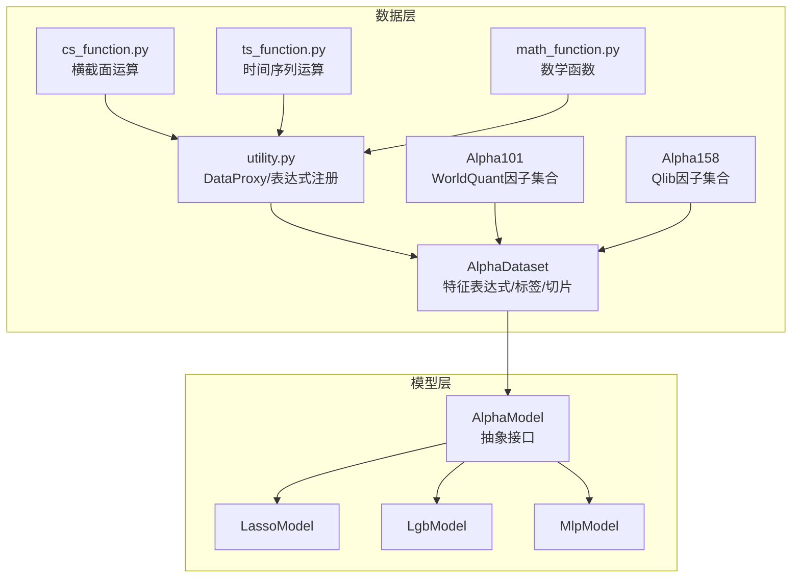
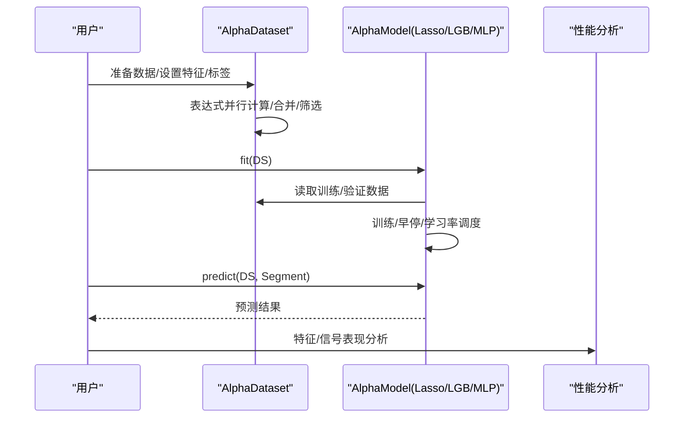
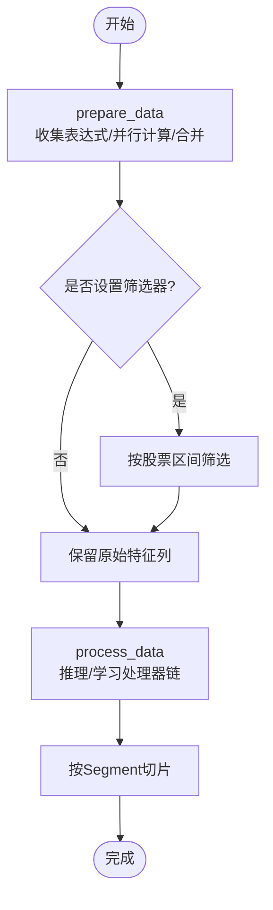
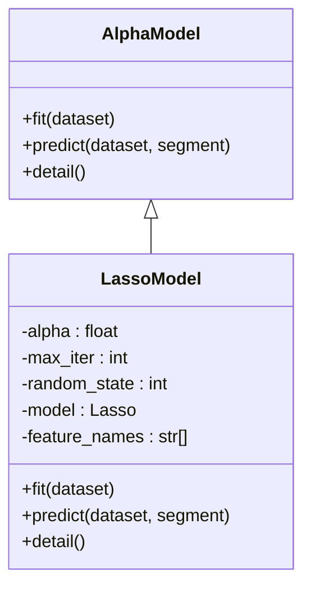
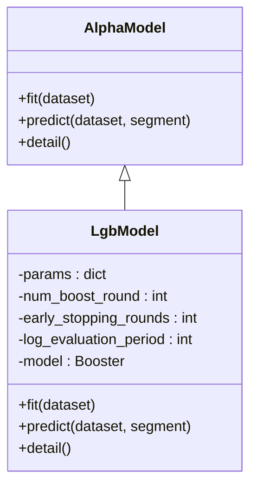
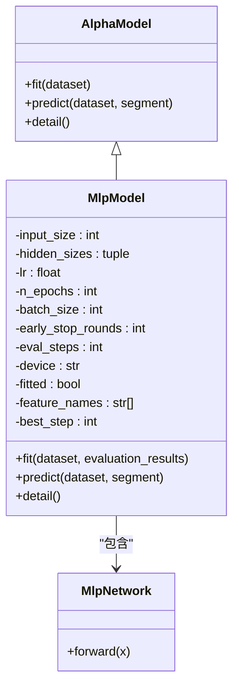
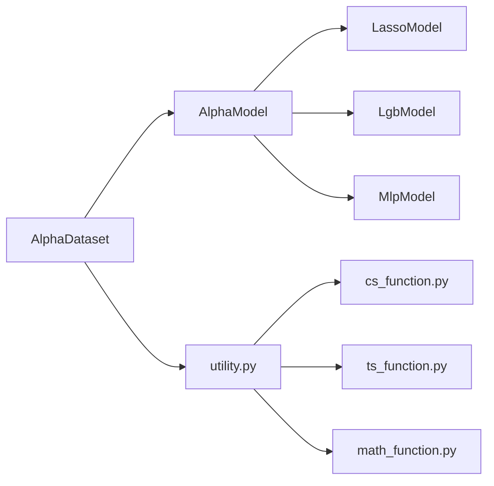

# Alpha模型模块

<cite>
**本文引用的文件**
- [vnpy/alpha/dataset/template.py](file://vnpy/alpha/dataset/template.py)
- [vnpy/alpha/model/template.py](file://vnpy/alpha/model/template.py)
- [vnpy/alpha/model/models/lasso_model.py](file://vnpy/alpha/model/models/lasso_model.py)
- [vnpy/alpha/model/models/lgb_model.py](file://vnpy/alpha/model/models/lgb_model.py)
- [vnpy/alpha/model/models/mlp_model.py](file://vnpy/alpha/model/models/mlp_model.py)
- [vnpy/alpha/dataset/__init__.py](file://vnpy/alpha/dataset/__init__.py)
- [vnpy/alpha/model/__init__.py](file://vnpy/alpha/model/__init__.py)
- [vnpy/alpha/dataset/utility.py](file://vnpy/alpha/dataset/utility.py)
- [vnpy/alpha/dataset/cs_function.py](file://vnpy/alpha/dataset/cs_function.py)
- [vnpy/alpha/dataset/ts_function.py](file://vnpy/alpha/dataset/ts_function.py)
- [vnpy/alpha/dataset/math_function.py](file://vnpy/alpha/dataset/math_function.py)
- [vnpy/alpha/dataset/datasets/alpha_101.py](file://vnpy/alpha/dataset/datasets/alpha_101.py)
- [vnpy/alpha/dataset/datasets/alpha_158.py](file://vnpy/alpha/dataset/datasets/alpha_158.py)
- [tests/test_alpha101.py](file://tests/test_alpha101.py)
- [tests/alpha/test_dataproxy.py](file://tests/alpha/test_dataproxy.py)
</cite>

## 目录
1. [简介](#简介)
2. [项目结构](#项目结构)
3. [核心组件](#核心组件)
4. [架构总览](#架构总览)
5. [详细组件分析](#详细组件分析)
6. [依赖关系分析](#依赖关系分析)
7. [性能与优化](#性能与优化)
8. [故障排查指南](#故障排查指南)
9. [结论](#结论)
10. [附录：开发与部署示例](#附录开发与部署示例)

## 简介
本技术文档面向Alpha模型模块，系统性阐述基于模板类的标准化训练框架与三类代表性模型（Lasso回归、LightGBM、多层感知机）的实现细节与算法原理。文档覆盖数据准备与特征工程、模型训练流程、交叉验证与超参数调优策略、模型评估与性能优化、过拟合处理方法，并提供从算法实现到模型应用的完整开发与部署指导，帮助机器学习研究员快速构建与落地Alpha因子预测模型。

## 项目结构
Alpha模块采用“数据集模板 + 模型模板 + 具体模型实现”的分层设计：
- 数据层：AlphaDataset模板负责特征表达式计算、跨时序/跨股票归一化、标签生成、数据切片与可视化分析。
- 模型层：AlphaModel模板定义fit/predict接口，具体模型在该模板下实现训练与推理。
- 工具层：提供表达式解析、时间序列/横截面函数库、数学函数库等。

图表来源
- [vnpy/alpha/dataset/template.py](file://vnpy/alpha/dataset/template.py#L23-L306)
- [vnpy/alpha/model/template.py](file://vnpy/alpha/model/template.py#L9-L31)
- [vnpy/alpha/model/models/lasso_model.py](file://vnpy/alpha/model/models/lasso_model.py#L13-L140)
- [vnpy/alpha/model/models/lgb_model.py](file://vnpy/alpha/model/models/lgb_model.py#L12-L171)
- [vnpy/alpha/model/models/mlp_model.py](file://vnpy/alpha/model/models/mlp_model.py#L22-L684)
- [vnpy/alpha/dataset/datasets/alpha_101.py](file://vnpy/alpha/dataset/datasets/alpha_101.py#L6-L331)
- [vnpy/alpha/dataset/datasets/alpha_158.py](file://vnpy/alpha/dataset/datasets/alpha_158.py#L6-L131)

章节来源
- [vnpy/alpha/dataset/template.py](file://vnpy/alpha/dataset/template.py#L23-L306)
- [vnpy/alpha/model/template.py](file://vnpy/alpha/model/template.py#L9-L31)

## 核心组件
- AlphaDataset：统一的数据准备与特征工程入口，支持表达式/函数组合、并行计算、跨段切片、性能分析。
- AlphaModel：模型抽象接口，约束fit与predict行为，便于扩展新模型。
- 具体模型：LassoModel、LgbModel、MlpModel分别对应线性稀疏建模、梯度提升树、深度神经网络。

章节来源
- [vnpy/alpha/dataset/template.py](file://vnpy/alpha/dataset/template.py#L23-L306)
- [vnpy/alpha/model/template.py](file://vnpy/alpha/model/template.py#L9-L31)
- [vnpy/alpha/model/models/lasso_model.py](file://vnpy/alpha/model/models/lasso_model.py#L13-L140)
- [vnpy/alpha/model/models/lgb_model.py](file://vnpy/alpha/model/models/lgb_model.py#L12-L171)
- [vnpy/alpha/model/models/mlp_model.py](file://vnpy/alpha/model/models/mlp_model.py#L22-L684)

## 架构总览
Alpha模块遵循“数据-模型-评估”闭环：
- 数据准备：通过AlphaDataset加载原始行情/因子表，按表达式生成特征与标签，支持过滤与并行计算。
- 模型训练：各模型实现fit/predict，统一从AlphaDataset读取训练/验证/测试数据。
- 模型评估：提供特征与信号表现分析接口，结合Alphalens进行多维度回测分析。
- 可视化与诊断：支持特征重要性、损失曲线、信号分布等可视化输出。

图表来源
- [vnpy/alpha/dataset/template.py](file://vnpy/alpha/dataset/template.py#L90-L194)
- [vnpy/alpha/model/models/lasso_model.py](file://vnpy/alpha/model/models/lasso_model.py#L40-L110)
- [vnpy/alpha/model/models/lgb_model.py](file://vnpy/alpha/model/models/lgb_model.py#L84-L147)
- [vnpy/alpha/model/models/mlp_model.py](file://vnpy/alpha/model/models/mlp_model.py#L137-L408)

## 详细组件分析

### AlphaDataset：数据准备与特征工程
- 功能要点
  - 表达式/函数组合：支持字符串表达式与Polars表达式两种方式，自动并行计算。
  - 跨段管理：训练/验证/测试时间段分离，支持按时间切片查询。
  - 处理器链：推理/学习阶段可注入预处理器（如缺失值填充、标准化、去极值等）。
  - 性能分析：内置特征与信号表现分析接口，对接Alphalens生成全量分析图谱。
- 关键流程
  - prepare_data：收集特征表达式，启动多进程并行计算，合并结果，执行筛选与排序。
  - process_data：按任务类型（推理/学习）依次应用处理器。
  - fetch_*：按Segment返回对应数据子集。
  - show_feature_performance/show_signal_performance：基于Alphalens生成评分与收益分析。

图表来源
- [vnpy/alpha/dataset/template.py](file://vnpy/alpha/dataset/template.py#L90-L194)

章节来源
- [vnpy/alpha/dataset/template.py](file://vnpy/alpha/dataset/template.py#L23-L306)
- [vnpy/alpha/dataset/utility.py](file://vnpy/alpha/dataset/utility.py#L19-L286)
- [vnpy/alpha/dataset/cs_function.py](file://vnpy/alpha/dataset/cs_function.py#L10-L65)
- [vnpy/alpha/dataset/ts_function.py](file://vnpy/alpha/dataset/ts_function.py#L12-L330)
- [vnpy/alpha/dataset/math_function.py](file://vnpy/alpha/dataset/math_function.py#L10-L168)

### AlphaModel：模型抽象接口
- 规范
  - fit(dataset)：从AlphaDataset中读取训练/验证数据，完成模型训练。
  - predict(dataset, segment)：对指定Segment进行预测，返回数组。
  - detail()：输出模型细节（如特征重要性、参数统计等）。
- 设计意义
  - 统一训练/预测接口，便于替换与扩展不同算法。

章节来源
- [vnpy/alpha/model/template.py](file://vnpy/alpha/model/template.py#L9-L31)

### Lasso回归模型：LassoModel
- 算法原理
  - L1正则线性回归，具备特征选择能力，适合高维稀疏特征场景。
- 实现要点
  - 训练：合并训练/验证数据，去重排序后转为NumPy矩阵，调用sklearn Lasso训练。
  - 预测：按推理数据顺序提取特征，调用predict得到标量序列。
  - 特征重要性：输出非零系数及其绝对值排序，便于特征筛选。
- 超参数
  - alpha（正则强度）、max_iter（最大迭代）、random_state（随机种子）。

图表来源
- [vnpy/alpha/model/template.py](file://vnpy/alpha/model/template.py#L9-L31)
- [vnpy/alpha/model/models/lasso_model.py](file://vnpy/alpha/model/models/lasso_model.py#L13-L140)

章节来源
- [vnpy/alpha/model/models/lasso_model.py](file://vnpy/alpha/model/models/lasso_model.py#L13-L140)

### LightGBM模型：LgbModel
- 算法原理
  - 基于决策树的梯度提升框架，支持高效训练与早停，适合结构化特征与大规模样本。
- 实现要点
  - 训练：将训练/验证数据转换为LightGBM Dataset，设置回调（早停、日志）。
  - 预测：按推理数据顺序提取特征，调用predict得到标量序列。
  - 特征重要性：提供split/gain两种指标的可视化。
- 超参数
  - 学习率、叶子数、训练轮数、早停轮数、日志周期、随机种子。

图表来源
- [vnpy/alpha/model/template.py](file://vnpy/alpha/model/template.py#L9-L31)
- [vnpy/alpha/model/models/lgb_model.py](file://vnpy/alpha/model/models/lgb_model.py#L12-L171)

章节来源
- [vnpy/alpha/model/models/lgb_model.py](file://vnpy/alpha/model/models/lgb_model.py#L12-L171)

### 多层感知机模型：MlpModel
- 算法原理
  - 多层前馈神经网络，支持Dropout/BatchNorm/激活函数，具备非线性拟合能力。
- 实现要点
  - 训练：随机小批量、早停、ReduceLROnPlateau学习率调度；定期记录训练/验证损失。
  - 预测：分批推理，避免显存溢出。
  - 特征重要性：基于输入扰动的标准差变化衡量特征重要性。
- 超参数
  - 输入维度、隐藏层规模、学习率、训练轮数、批大小、早停轮数、评估步长、优化器、权重衰减、设备、随机种子。

图表来源
- [vnpy/alpha/model/template.py](file://vnpy/alpha/model/template.py#L9-L31)
- [vnpy/alpha/model/models/mlp_model.py](file://vnpy/alpha/model/models/mlp_model.py#L22-L684)

章节来源
- [vnpy/alpha/model/models/mlp_model.py](file://vnpy/alpha/model/models/mlp_model.py#L22-L684)

### 数据集与因子集合
- Alpha101：封装WorldQuant 101个经典因子表达式，统一设置标签为未来收益。
- Alpha158：封装Qlib常用因子族（K线形态、价格变化、时间序列统计、成交量统计等），统一设置标签为未来收益。

章节来源
- [vnpy/alpha/dataset/datasets/alpha_101.py](file://vnpy/alpha/dataset/datasets/alpha_101.py#L6-L331)
- [vnpy/alpha/dataset/datasets/alpha_158.py](file://vnpy/alpha/dataset/datasets/alpha_158.py#L6-L131)

## 依赖关系分析
- 模块导出
  - 数据集：AlphaDataset、Segment、工具函数与处理器。
  - 模型：AlphaModel。
- 内部依赖
  - AlphaModel被具体模型继承；AlphaDataset内部依赖utility与各类函数库。
  - 具体模型依赖外部库（sklearn、lightgbm、torch）。

图表来源
- [vnpy/alpha/model/template.py](file://vnpy/alpha/model/template.py#L9-L31)
- [vnpy/alpha/model/models/lasso_model.py](file://vnpy/alpha/model/models/lasso_model.py#L13-L140)
- [vnpy/alpha/model/models/lgb_model.py](file://vnpy/alpha/model/models/lgb_model.py#L12-L171)
- [vnpy/alpha/model/models/mlp_model.py](file://vnpy/alpha/model/models/mlp_model.py#L22-L684)
- [vnpy/alpha/dataset/template.py](file://vnpy/alpha/dataset/template.py#L23-L306)
- [vnpy/alpha/dataset/utility.py](file://vnpy/alpha/dataset/utility.py#L19-L286)

章节来源
- [vnpy/alpha/dataset/__init__.py](file://vnpy/alpha/dataset/__init__.py#L1-L31)
- [vnpy/alpha/model/__init__.py](file://vnpy/alpha/model/__init__.py#L1-L7)

## 性能与优化
- 计算效率
  - AlphaDataset使用多进程并行计算表达式，显著缩短特征生成时间。
  - MlpModel采用分批推理与设备迁移，避免显存不足。
- 过拟合控制
  - LassoModel：L1正则天然具备特征选择与稀疏性。
  - LgbModel：早停回调防止过拟合。
  - MlpModel：Dropout/BatchNorm/早停/学习率调度综合控制。
- 数据质量
  - 推荐在AlphaDataset中加入缺失值填充、无穷值替换、横截面/时序标准化等处理器。
- 评估与可视化
  - 使用show_feature_performance与show_signal_performance对接Alphalens生成评分与收益分析图谱。

[本节为通用建议，无需特定文件引用]

## 故障排查指南
- 常见问题
  - 模型未训练即预测：检查fit是否调用或fitted标志位。
  - 数据形状不匹配：确认特征列名与顺序一致，注意时间/股票索引排序。
  - NaN/无穷值导致异常：在AlphaDataset中添加缺失值/无穷值处理处理器。
  - 训练不收敛/震荡：调整学习率、增加早停轮数、检查特征缩放。
- 定位手段
  - 使用detail()输出模型关键信息（参数、特征数量、设备等）。
  - 对比训练/验证损失曲线，判断是否过拟合。
  - 利用特征重要性/系数绝对值排序，识别无效特征。

章节来源
- [vnpy/alpha/model/models/lasso_model.py](file://vnpy/alpha/model/models/lasso_model.py#L96-L110)
- [vnpy/alpha/model/models/lgb_model.py](file://vnpy/alpha/model/models/lgb_model.py#L134-L147)
- [vnpy/alpha/model/models/mlp_model.py](file://vnpy/alpha/model/models/mlp_model.py#L400-L408)

## 结论
Alpha模型模块以模板化设计实现了从特征工程到模型训练与评估的完整流水线。Lasso、LightGBM与MLP三种模型覆盖线性稀疏、树集成与深度非线性的典型场景，配合AlphaDataset的表达式与处理器体系，能够高效生成高质量特征并稳定训练模型。通过早停、正则与标准化等策略，可有效缓解过拟合并提升泛化性能。建议在实际项目中结合业务需求选择合适模型，并充分利用可视化与性能分析工具持续优化。

[本节为总结性内容，无需特定文件引用]

## 附录：开发与部署示例

### 示例一：使用Alpha101数据集与Lasso模型
- 步骤
  - 构造Alpha101实例，设置训练/验证/测试期。
  - 添加特征表达式与标签，调用prepare_data生成特征矩阵。
  - 创建LassoModel实例，fit(dataset)训练，predict(dataset, Segment)预测。
  - 使用detail()查看特征重要性，必要时结合show_feature_performance分析单特征表现。

章节来源
- [vnpy/alpha/dataset/datasets/alpha_101.py](file://vnpy/alpha/dataset/datasets/alpha_101.py#L6-L331)
- [vnpy/alpha/model/models/lasso_model.py](file://vnpy/alpha/model/models/lasso_model.py#L40-L110)
- [vnpy/alpha/dataset/template.py](file://vnpy/alpha/dataset/template.py#L195-L271)

### 示例二：使用Alpha158数据集与LightGBM模型
- 步骤
  - 构造Alpha158实例，设置训练/验证/测试期。
  - 调用prepare_data生成特征，fit(dataset)训练，predict(dataset, Segment)预测。
  - 使用detail()输出特征重要性图，观察split/gain指标。

章节来源
- [vnpy/alpha/dataset/datasets/alpha_158.py](file://vnpy/alpha/dataset/datasets/alpha_158.py#L6-L131)
- [vnpy/alpha/model/models/lgb_model.py](file://vnpy/alpha/model/models/lgb_model.py#L84-L147)
- [vnpy/alpha/dataset/template.py](file://vnpy/alpha/dataset/template.py#L195-L271)

### 示例三：使用Alpha101数据集与MLP模型
- 步骤
  - 构造Alpha101实例，设置训练/验证/测试期。
  - 调用prepare_data生成特征，fit(dataset)训练，predict(dataset, Segment)预测。
  - 使用detail()输出模型参数与特征重要性DataFrame，结合训练日志评估收敛情况。

章节来源
- [vnpy/alpha/dataset/datasets/alpha_101.py](file://vnpy/alpha/dataset/datasets/alpha_101.py#L6-L331)
- [vnpy/alpha/model/models/mlp_model.py](file://vnpy/alpha/model/models/mlp_model.py#L137-L408)
- [vnpy/alpha/dataset/template.py](file://vnpy/alpha/dataset/template.py#L195-L271)

### 测试与验证
- 单元测试
  - Alpha101表达式测试：覆盖多个因子表达式的正确性与输出列存在性。
  - DataProxy运算测试：验证代理对象的四则运算、比较运算与类型转换。
- 建议
  - 在本地运行测试用例，确保表达式与函数库工作正常。

章节来源
- [tests/test_alpha101.py](file://tests/test_alpha101.py#L69-L677)
- [tests/alpha/test_dataproxy.py](file://tests/alpha/test_dataproxy.py#L40-L107)