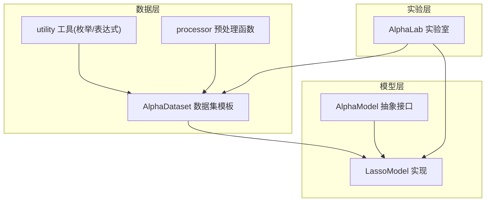
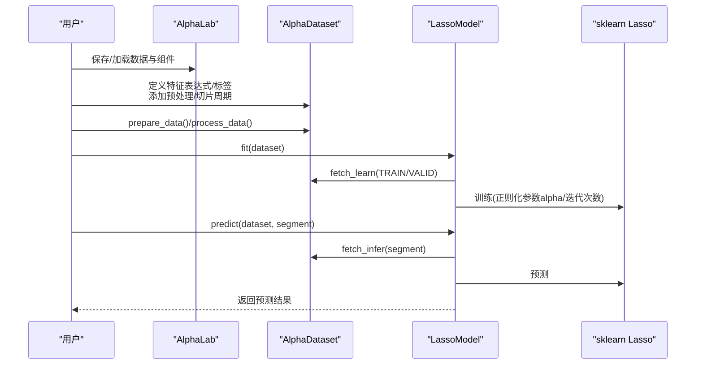
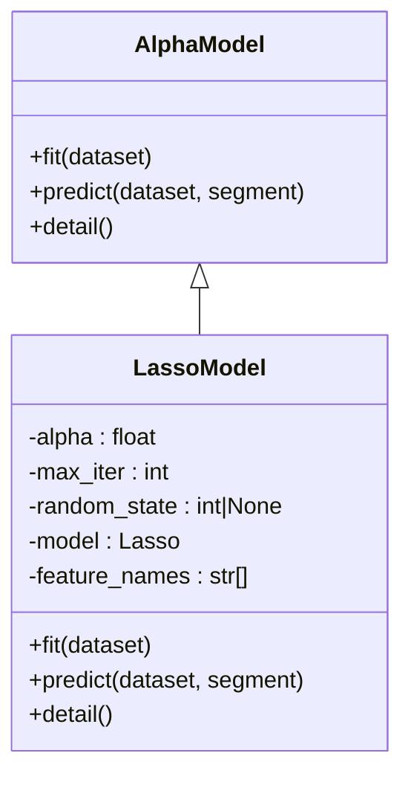
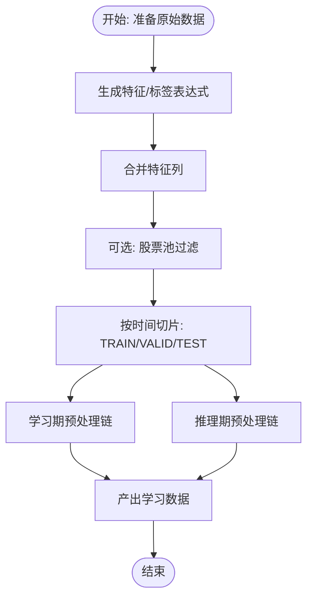
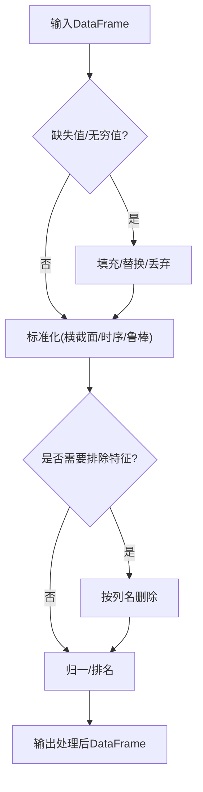
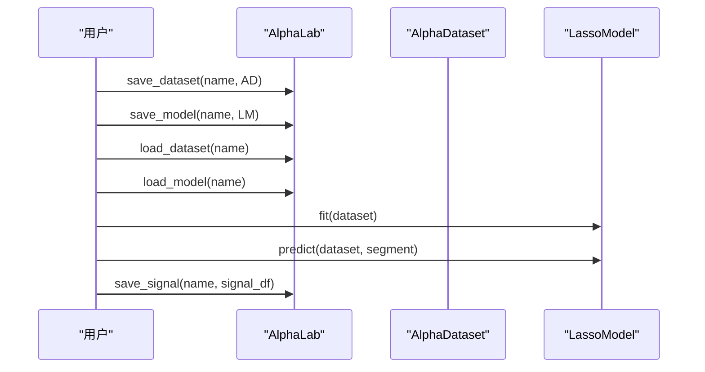
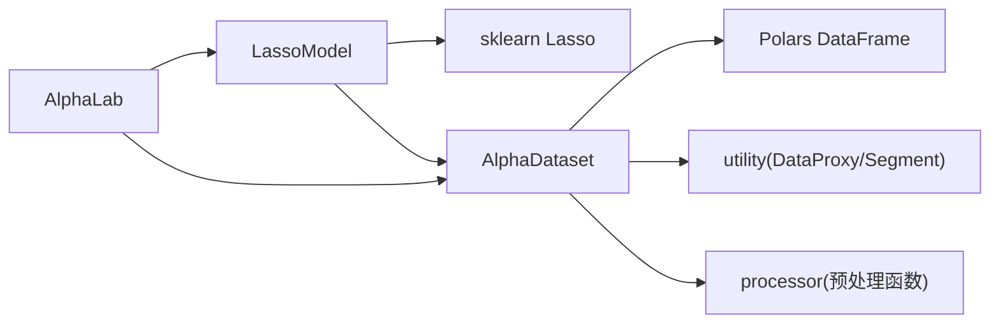
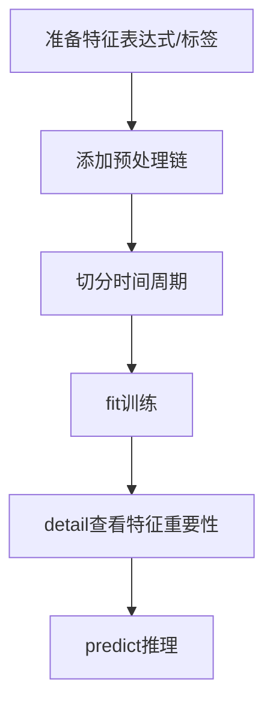

# Lasso回归模型

<cite>
**本文引用的文件**
- [vnpy/alpha/model/models/lasso_model.py](file://vnpy/alpha/model/models/lasso_model.py)
- [vnpy/alpha/model/template.py](file://vnpy/alpha/model/template.py)
- [vnpy/alpha/dataset/template.py](file://vnpy/alpha/dataset/template.py)
- [vnpy/alpha/dataset/utility.py](file://vnpy/alpha/dataset/utility.py)
- [vnpy/alpha/dataset/processor.py](file://vnpy/alpha/dataset/processor.py)
- [vnpy/alpha/lab.py](file://vnpy/alpha/lab.py)
- [tests/test_alpha101.py](file://tests/test_alpha101.py)
- [examples/alpha_research/download_data_rq.ipynb](file://examples/alpha_research/download_data_rq.ipynb)
</cite>

## 目录
1. [引言](#引言)
2. [项目结构](#项目结构)
3. [核心组件](#核心组件)
4. [架构总览](#架构总览)
5. [详细组件分析](#详细组件分析)
6. [依赖关系分析](#依赖关系分析)
7. [性能与稳定性考量](#性能与稳定性考量)
8. [故障排查指南](#故障排查指南)
9. [结论](#结论)
10. [附录：使用与优化指南](#附录使用与优化指南)

## 引言
本技术文档围绕vnpy项目中的Lasso回归模型展开，系统阐述其在Alpha因子预测中的数学原理、正则化机制、特征选择能力与工程实现。文档从算法原理、参数配置、训练流程、预测方法、过拟合控制、参数调优策略到性能评估方法进行完整覆盖，并结合项目中的数据集模板、处理器与实验示例，给出可操作的实践建议，帮助量化研究人员构建稳健的线性回归建模方案。

## 项目结构
Lasso模型位于Alpha子系统中，采用“模板类 + 具体实现”的分层设计：
- 模型层：定义AlphaModel抽象接口，LassoModel继承该接口并实现fit/predict/detail等方法
- 数据层：AlphaDataset负责特征表达式生成、标签设置、时序切片与学习/推理数据准备
- 处理器层：提供缺失值处理、标准化、去极值等通用预处理函数
- 实验层：AlphaLab负责数据加载/保存、模型持久化、信号输出与回测分析辅助

图表来源
- [vnpy/alpha/model/template.py](file://vnpy/alpha/model/template.py#L9-L31)
- [vnpy/alpha/model/models/lasso_model.py](file://vnpy/alpha/model/models/lasso_model.py#L13-L140)
- [vnpy/alpha/dataset/template.py](file://vnpy/alpha/dataset/template.py#L23-L306)
- [vnpy/alpha/dataset/utility.py](file://vnpy/alpha/dataset/utility.py#L280-L286)
- [vnpy/alpha/dataset/processor.py](file://vnpy/alpha/dataset/processor.py#L1-L202)
- [vnpy/alpha/lab.py](file://vnpy/alpha/lab.py#L20-L481)

章节来源
- [vnpy/alpha/model/models/lasso_model.py](file://vnpy/alpha/model/models/lasso_model.py#L1-L140)
- [vnpy/alpha/model/template.py](file://vnpy/alpha/model/template.py#L1-L31)
- [vnpy/alpha/dataset/template.py](file://vnpy/alpha/dataset/template.py#L1-L306)
- [vnpy/alpha/dataset/utility.py](file://vnpy/alpha/dataset/utility.py#L1-L286)
- [vnpy/alpha/dataset/processor.py](file://vnpy/alpha/dataset/processor.py#L1-L202)
- [vnpy/alpha/lab.py](file://vnpy/alpha/lab.py#L1-L481)

## 核心组件
- AlphaModel抽象基类：定义fit/predict接口与detail可选扩展点
- LassoModel：基于sklearn Lasso实现的线性回归+L1正则化，支持特征重要性输出
- AlphaDataset：统一的特征/标签生成、时序切片、学习/推理数据管理
- DataProxy/表达式工具：通过字符串或Polars表达式生成复杂因子
- 预处理处理器：缺失值填充、无穷值替换、横截面/时序标准化、去极值等
- AlphaLab：数据与模型的持久化、信号输出与辅助分析

章节来源
- [vnpy/alpha/model/template.py](file://vnpy/alpha/model/template.py#L9-L31)
- [vnpy/alpha/model/models/lasso_model.py](file://vnpy/alpha/model/models/lasso_model.py#L13-L140)
- [vnpy/alpha/dataset/template.py](file://vnpy/alpha/dataset/template.py#L23-L306)
- [vnpy/alpha/dataset/utility.py](file://vnpy/alpha/dataset/utility.py#L19-L286)
- [vnpy/alpha/dataset/processor.py](file://vnpy/alpha/dataset/processor.py#L1-L202)
- [vnpy/alpha/lab.py](file://vnpy/alpha/lab.py#L20-L481)

## 架构总览
下图展示Lasso模型在Alpha研究流水线中的位置与交互关系。

图表来源
- [vnpy/alpha/lab.py](file://vnpy/alpha/lab.py#L389-L451)
- [vnpy/alpha/dataset/template.py](file://vnpy/alpha/dataset/template.py#L90-L194)
- [vnpy/alpha/model/models/lasso_model.py](file://vnpy/alpha/model/models/lasso_model.py#L40-L110)

## 详细组件分析

### LassoModel类分析
- 继承关系：实现AlphaModel接口，具备fit/predict/detail三件套
- 关键字段：alpha、max_iter、random_state；训练后持有model与feature_names
- 训练流程：合并训练/验证样本、去重排序、提取特征矩阵与标签向量、调用sklearn Lasso训练
- 预测流程：按排序后的索引提取特征矩阵，调用predict返回数值结果
- 特征重要性：输出非零系数并按绝对值排序，过滤极小系数

图表来源
- [vnpy/alpha/model/template.py](file://vnpy/alpha/model/template.py#L9-L31)
- [vnpy/alpha/model/models/lasso_model.py](file://vnpy/alpha/model/models/lasso_model.py#L13-L140)

章节来源
- [vnpy/alpha/model/models/lasso_model.py](file://vnpy/alpha/model/models/lasso_model.py#L13-L140)

### AlphaDataset与数据准备
- 特征表达式：支持字符串表达式与Polars表达式两种方式，统一通过工具函数计算
- 标签设置：通过表达式生成label列，最终置于DataFrame末列
- 学习/推理分离：learn_df与infer_df可分别施加不同预处理策略
- 时间切片：按Segment枚举指定训练/验证/测试区间
- 性能分析：提供特征与信号的Alphalens可视化辅助

图表来源
- [vnpy/alpha/dataset/template.py](file://vnpy/alpha/dataset/template.py#L90-L194)
- [vnpy/alpha/dataset/utility.py](file://vnpy/alpha/dataset/utility.py#L203-L255)

章节来源
- [vnpy/alpha/dataset/template.py](file://vnpy/alpha/dataset/template.py#L23-L306)
- [vnpy/alpha/dataset/utility.py](file://vnpy/alpha/dataset/utility.py#L19-L286)

### 预处理与特征工程
- 缺失值处理：丢弃含NA的行或按列填充
- 无穷值处理：按股票维度替换为均值
- 标准化：横截面/时序/鲁棒Z-Score、分位归一
- 排除特征：按列名删除不需要的特征
- 排序归一：横截面rank归一

图表来源
- [vnpy/alpha/dataset/processor.py](file://vnpy/alpha/dataset/processor.py#L9-L202)

章节来源
- [vnpy/alpha/dataset/processor.py](file://vnpy/alpha/dataset/processor.py#L1-L202)

### AlphaLab与实验流程
- 数据存储：按日线/分钟线/成分股权重等分类保存
- 模型持久化：支持保存/加载AlphaDataset与AlphaModel
- 信号输出：将预测结果写入parquet，便于后续回测分析

图表来源
- [vnpy/alpha/lab.py](file://vnpy/alpha/lab.py#L389-L481)

章节来源
- [vnpy/alpha/lab.py](file://vnpy/alpha/lab.py#L20-L481)

## 依赖关系分析
- LassoModel依赖sklearn Lasso作为底层求解器，内部不直接暴露求解细节
- AlphaDataset依赖Polars进行高性能表达式计算与数据处理
- DataProxy通过表达式注册机制，将自定义函数注入到表达式执行上下文
- 预处理函数以纯函数形式组合，便于流水线化与复用

图表来源
- [vnpy/alpha/model/models/lasso_model.py](file://vnpy/alpha/model/models/lasso_model.py#L1-L10)
- [vnpy/alpha/dataset/template.py](file://vnpy/alpha/dataset/template.py#L1-L21)
- [vnpy/alpha/dataset/utility.py](file://vnpy/alpha/dataset/utility.py#L19-L286)
- [vnpy/alpha/dataset/processor.py](file://vnpy/alpha/dataset/processor.py#L1-L202)
- [vnpy/alpha/lab.py](file://vnpy/alpha/lab.py#L20-L481)

章节来源
- [vnpy/alpha/model/models/lasso_model.py](file://vnpy/alpha/model/models/lasso_model.py#L1-L10)
- [vnpy/alpha/dataset/template.py](file://vnpy/alpha/dataset/template.py#L1-L21)
- [vnpy/alpha/dataset/utility.py](file://vnpy/alpha/dataset/utility.py#L19-L286)
- [vnpy/alpha/dataset/processor.py](file://vnpy/alpha/dataset/processor.py#L1-L202)
- [vnpy/alpha/lab.py](file://vnpy/alpha/lab.py#L20-L481)

## 性能与稳定性考量
- 计算效率
  - 表达式并行：AlphaDataset在prepare_data阶段使用多进程池并行计算特征
  - 数据类型与索引：使用Polars进行向量化计算，避免Python循环
- 稳健性
  - 缺失值/无穷值处理：提供多种策略，防止异常传播至下游
  - 标准化：鲁棒Z-Score可抑制极端值影响
- 可扩展性
  - 预处理链可插拔，学习期与推理期可分别施加不同规则
  - DataProxy支持自定义函数注册，便于扩展复杂因子

章节来源
- [vnpy/alpha/dataset/template.py](file://vnpy/alpha/dataset/template.py#L103-L117)
- [vnpy/alpha/dataset/processor.py](file://vnpy/alpha/dataset/processor.py#L80-L185)
- [vnpy/alpha/dataset/utility.py](file://vnpy/alpha/dataset/utility.py#L13-L17)

## 故障排查指南
- 模型未训练即预测
  - 现象：抛出“模型尚未训练”错误
  - 原因：predict前未调用fit
  - 处理：确保先fit(dataset)，再predict
- 数据维度不一致
  - 现象：训练/预测时报形状不匹配
  - 原因：特征列名在训练与推理阶段不一致
  - 处理：统一特征生成逻辑，保证列名稳定
- 过拟合/欠拟合
  - 现象：验证集表现差或泛化弱
  - 原因：alpha过大导致过度收缩，或过小导致欠正则化
  - 处理：结合验证集误差曲线调整alpha
- 极端值与缺失值
  - 现象：系数不稳定或预测异常
  - 处理：启用无穷值替换与缺失值填充，必要时使用鲁棒标准化

章节来源
- [vnpy/alpha/model/models/lasso_model.py](file://vnpy/alpha/model/models/lasso_model.py#L96-L109)
- [vnpy/alpha/dataset/processor.py](file://vnpy/alpha/dataset/processor.py#L9-L19)
- [vnpy/alpha/dataset/processor.py](file://vnpy/alpha/dataset/processor.py#L80-L99)

## 结论
vnpy中的Lasso模型以清晰的分层架构实现了从特征工程到模型训练与预测的完整闭环。通过AlphaDataset与DataProxy，用户可以快速构建复杂的Alpha因子体系；通过AlphaLab，可将模型与数据进行持久化管理。结合鲁棒的预处理与标准化策略，Lasso在高维稀疏特征场景下具备良好的特征选择与泛化能力，适合用于Alpha因子预测的基准建模与特征筛选。

## 附录：使用与优化指南

### 数学原理与正则化机制
- 目标函数：最小二乘损失 + L1正则项
- 作用机制：L1正则促使部分系数精确收缩至零，实现自动特征选择
- 适用场景：高维稀疏特征、噪声较多、需解释性强的线性模型

### 参数配置与调优
- alpha（正则强度）
  - 调整范围：通常在1e-4 ~ 1e-1之间尝试，结合验证集误差曲线
  - 建议策略：网格搜索或随机搜索，固定max_iter与random_state
- max_iter（最大迭代数）
  - 建议：默认1000已足够；若收敛困难，适当增大
- random_state（随机种子）
  - 建议：固定以保证结果可复现

### 训练流程
- 使用AlphaDataset定义特征表达式与标签
- 添加预处理链（缺失值/无穷值/标准化）
- 切分训练/验证/测试周期
- 调用LassoModel.fit训练
- 输出detail查看特征重要性

图表来源
- [vnpy/alpha/dataset/template.py](file://vnpy/alpha/dataset/template.py#L58-L94)
- [vnpy/alpha/model/models/lasso_model.py](file://vnpy/alpha/model/models/lasso_model.py#L40-L73)
- [vnpy/alpha/model/models/lasso_model.py](file://vnpy/alpha/model/models/lasso_model.py#L112-L140)

### 预测方法
- 输入：AlphaDataset与Segment（TRAIN/VALID/TEST）
- 输出：预测数值数组
- 注意：必须先fit，否则会抛出未训练异常

章节来源
- [vnpy/alpha/model/models/lasso_model.py](file://vnpy/alpha/model/models/lasso_model.py#L75-L110)

### 过拟合控制方法
- 正则化强度：通过alpha控制L1强度
- 数据质量：使用鲁棒标准化与缺失值/无穷值处理
- 交叉验证：在验证集上观察误差变化趋势，选择最优alpha

章节来源
- [vnpy/alpha/dataset/processor.py](file://vnpy/alpha/dataset/processor.py#L153-L185)
- [vnpy/alpha/dataset/processor.py](file://vnpy/alpha/dataset/processor.py#L9-L19)

### 性能评估方法
- 特征表现：利用Alphalens进行因子分箱IC、分组收益等分析
- 信号表现：将预测信号写入AlphaLab并生成全量分析图谱

章节来源
- [vnpy/alpha/dataset/template.py](file://vnpy/alpha/dataset/template.py#L195-L272)
- [vnpy/alpha/lab.py](file://vnpy/alpha/lab.py#L453-L466)

### Alpha因子预测的应用场景与优势
- 场景：多因子框架中的线性基准模型、特征筛选与解释
- 优势：可解释性强、训练稳定、易于部署与监控

章节来源
- [tests/test_alpha101.py](file://tests/test_alpha101.py#L69-L677)
- [examples/alpha_research/download_data_rq.ipynb](file://examples/alpha_research/download_data_rq.ipynb#L1-L195)