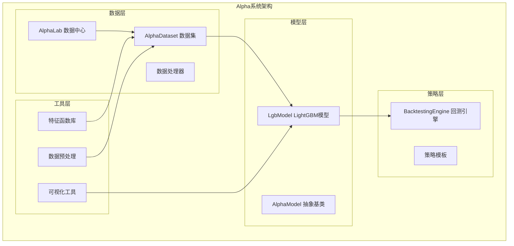
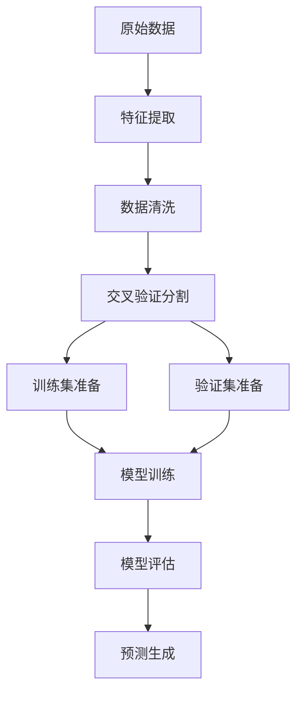
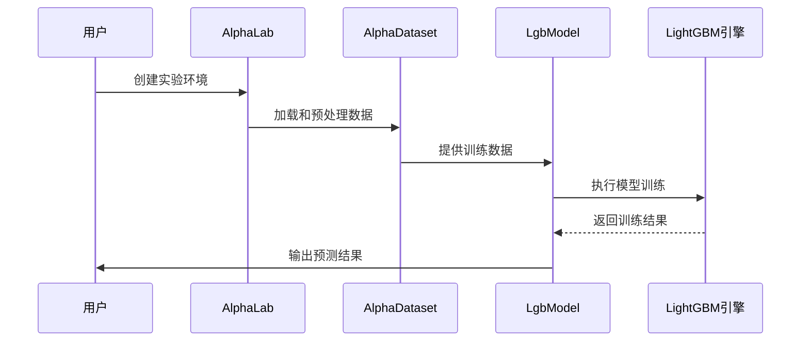
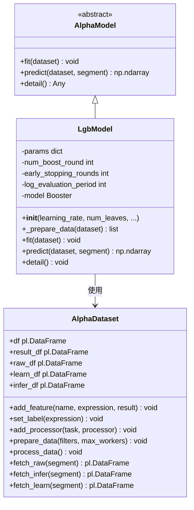
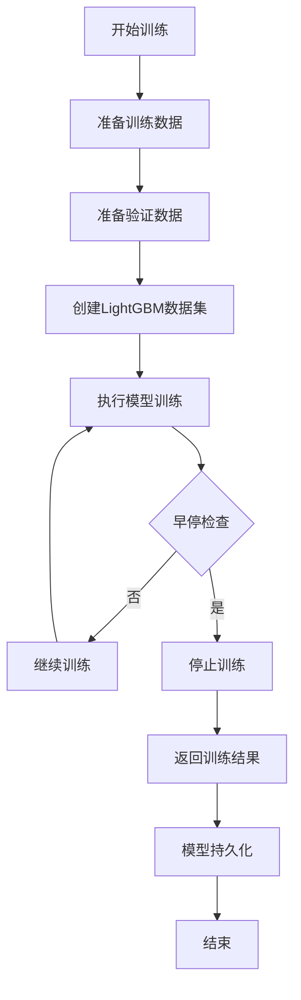
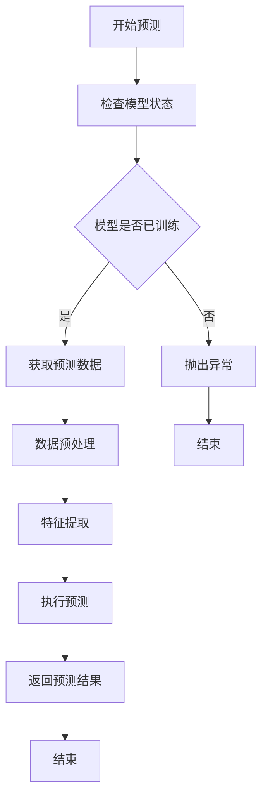
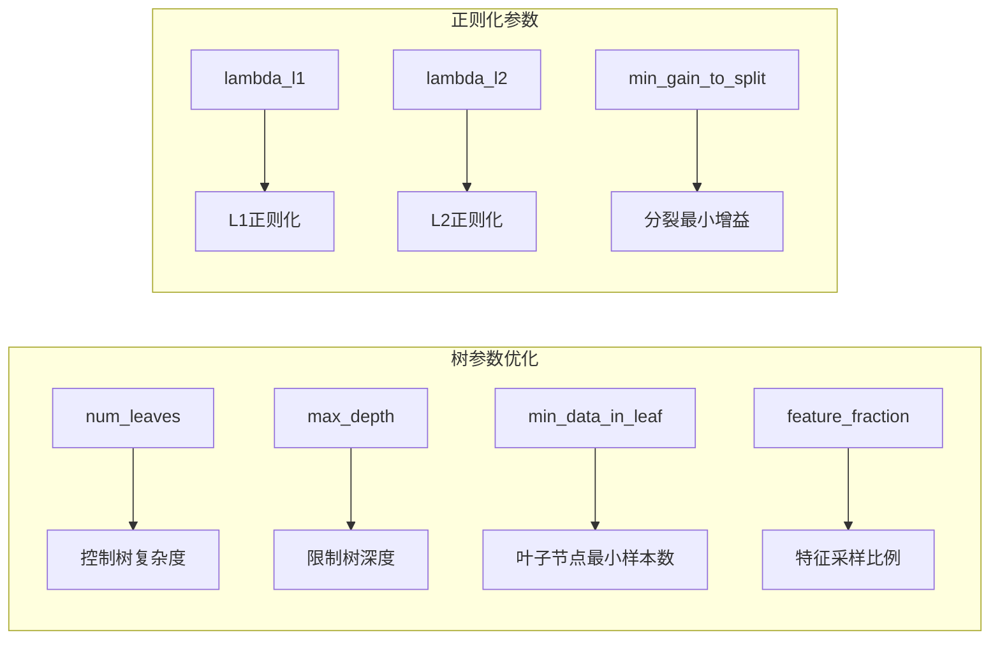
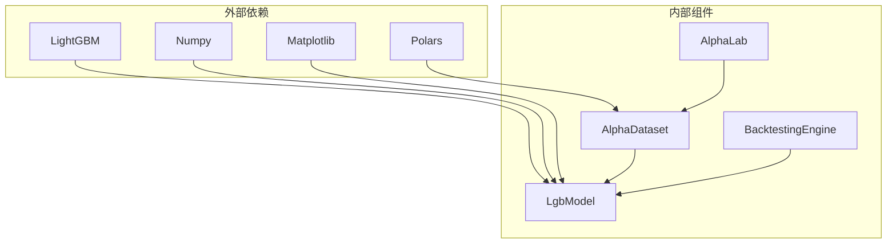
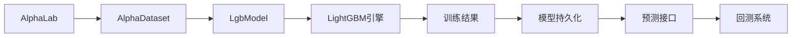

# LightGBM模型

<cite>
**本文档引用的文件**
- [lgb_model.py](file://vnpy/alpha/model/models/lgb_model.py)
- [template.py](file://vnpy/alpha/model/template.py)
- [processor.py](file://vnpy/alpha/dataset/processor.py)
- [template.py](file://vnpy/alpha/dataset/template.py)
- [utility.py](file://vnpy/alpha/dataset/utility.py)
- [math_function.py](file://vnpy/alpha/dataset/math_function.py)
- [lab.py](file://vnpy/alpha/lab.py)
- [backtesting.py](file://vnpy/alpha/strategy/backtesting.py)
- [research_workflow_lgb.ipynb](file://examples/alpha_research/research_workflow_lgb.ipynb)
- [download_data_rq.ipynb](file://examples/alpha_research/download_data_rq.ipynb)
</cite>

## 目录
1. [引言](#引言)
2. [项目结构](#项目结构)
3. [核心组件](#核心组件)
4. [架构概览](#架构概览)
5. [详细组件分析](#详细组件分析)
6. [依赖关系分析](#依赖关系分析)
7. [性能考虑](#性能考虑)
8. [故障排除指南](#故障排除指南)
9. [结论](#结论)
10. [附录](#附录)

## 引言

本文件为vn.py框架中的LightGBM梯度提升模型技术文档，专注于Alpha因子建模场景下的高性能实现。LightGBM作为梯度提升框架的代表，在量化交易中具有以下优势：

- **高效性能**：基于直方图的决策树构建算法，支持大规模数据处理
- **准确性优势**：通过GOSS和EFB算法实现更精确的梯度估计
- **内存优化**：采用leaf-wise生长策略，减少内存占用
- **并行计算**：支持多线程并行训练，加速模型收敛

该实现针对Alpha因子建模进行了专门优化，包括特征工程、数据预处理、模型训练和预测等完整流程。

## 项目结构

基于vn.py框架的整体架构，LightGBM模型位于alpha子系统中，采用模块化设计：



**图表来源**
- [lgb_model.py](file://vnpy/alpha/model/models/lgb_model.py#L12-L52)
- [template.py](file://vnpy/alpha/model/template.py#L9-L31)
- [lab.py](file://vnpy/alpha/lab.py#L20-L50)

**章节来源**
- [lgb_model.py](file://vnpy/alpha/model/models/lgb_model.py#L1-L171)
- [template.py](file://vnpy/alpha/model/template.py#L1-L31)
- [lab.py](file://vnpy/alpha/lab.py#L1-L481)

## 核心组件

### LgbModel 主要特性

LightGBM模型实现了完整的梯度提升框架，具备以下核心功能：

#### 参数配置
- **学习率控制**：可调节的学习率参数，平衡收敛速度和稳定性
- **树复杂度**：通过num_leaves控制决策树的复杂度
- **训练轮数**：num_boost_round限制最大训练轮数
- **早停机制**：early_stopping_rounds防止过拟合
- **日志输出**：log_evaluation_period控制训练日志频率

#### 数据处理流程


**图表来源**
- [lgb_model.py](file://vnpy/alpha/model/models/lgb_model.py#L53-L82)
- [template.py](file://vnpy/alpha/dataset/template.py#L90-L194)

#### 训练回调机制
- **早停回调**：自动监控验证集性能，防止过拟合
- **日志回调**：定期输出训练进度和性能指标
- **自定义回调**：支持扩展其他训练监控功能

**章节来源**
- [lgb_model.py](file://vnpy/alpha/model/models/lgb_model.py#L15-L52)
- [lgb_model.py](file://vnpy/alpha/model/models/lgb_model.py#L84-L111)

## 架构概览

LightGBM模型在整个Alpha系统中的位置和交互关系：



**图表来源**
- [lgb_model.py](file://vnpy/alpha/model/models/lgb_model.py#L84-L111)
- [lab.py](file://vnpy/alpha/lab.py#L389-L437)

### 系统集成点

#### 数据接口
- **AlphaDataset**：提供统一的数据访问接口
- **数据预处理**：支持多种数据清洗和标准化方法
- **特征工程**：内置丰富的特征计算函数库

#### 模型接口
- **AlphaModel抽象**：定义统一的模型接口规范
- **训练流程**：标准化的模型训练和评估流程
- **预测接口**：支持批量预测和单条预测

**章节来源**
- [template.py](file://vnpy/alpha/model/template.py#L9-L31)
- [template.py](file://vnpy/alpha/dataset/template.py#L23-L57)

## 详细组件分析

### LgbModel 类设计



**图表来源**
- [lgb_model.py](file://vnpy/alpha/model/models/lgb_model.py#L12-L52)
- [template.py](file://vnpy/alpha/model/template.py#L9-L31)
- [template.py](file://vnpy/alpha/dataset/template.py#L23-L57)

#### 训练流程详解



**图表来源**
- [lgb_model.py](file://vnpy/alpha/model/models/lgb_model.py#L84-L111)

#### 预测流程分析



**图表来源**
- [lgb_model.py](file://vnpy/alpha/model/models/lgb_model.py#L113-L147)

**章节来源**
- [lgb_model.py](file://vnpy/alpha/model/models/lgb_model.py#L12-L171)

### 数据处理管道

#### 特征工程组件

LightGBM模型的数据处理能力体现在以下几个方面：

##### 数据清洗
- **缺失值处理**：支持删除和填充两种策略
- **无穷值处理**：使用分组均值替换无穷大值
- **异常值检测**：提供鲁棒的异常值识别和处理

##### 数据标准化
- **横截面标准化**：按时间维度进行特征标准化
- **时间序列标准化**：支持滚动窗口的时序标准化
- **稳健标准化**：使用中位数和MAD替代均值和标准差

##### 特征选择
- **相关性分析**：自动识别冗余特征
- **信息增益**：基于信息增益的特征重要性评估
- **递归特征消除**：支持逐步特征选择

**章节来源**
- [processor.py](file://vnpy/alpha/dataset/processor.py#L9-L202)
- [utility.py](file://vnpy/alpha/dataset/utility.py#L19-L286)

### 模型参数优化

#### 学习率策略

学习率是影响模型性能的关键超参数：

| 学习率范围 | 收敛特性 | 过拟合风险 | 训练速度 |
|------------|----------|------------|----------|
| 0.01-0.05  | 稳定收敛 | 低 | 较慢 |
| 0.05-0.1   | 快速收敛 | 中等 | 中等 |
| 0.1-0.3    | 极快收敛 | 高 | 快 |

#### 树参数调优



**图表来源**
- [lgb_model.py](file://vnpy/alpha/model/models/lgb_model.py#L40-L45)

**章节来源**
- [lgb_model.py](file://vnpy/alpha/model/models/lgb_model.py#L15-L49)

## 依赖关系分析

### 组件耦合度

LightGBM模型与各组件的依赖关系：



**图表来源**
- [lgb_model.py](file://vnpy/alpha/model/models/lgb_model.py#L1-L9)
- [lab.py](file://vnpy/alpha/lab.py#L1-L17)

### 数据流依赖



**图表来源**
- [lab.py](file://vnpy/alpha/lab.py#L389-L437)
- [lgb_model.py](file://vnpy/alpha/model/models/lgb_model.py#L84-L111)

**章节来源**
- [lgb_model.py](file://vnpy/alpha/model/models/lgb_model.py#L1-L9)
- [lab.py](file://vnpy/alpha/lab.py#L1-L481)

## 性能考虑

### 训练性能优化

#### 内存管理
- **数据类型优化**：使用适当的数值类型减少内存占用
- **批处理策略**：合理设置批处理大小平衡内存和速度
- **垃圾回收**：及时释放不需要的对象引用

#### 计算效率
- **并行计算**：利用多核CPU进行并行训练
- **特征缓存**：缓存计算结果避免重复计算
- **增量训练**：支持增量学习处理新数据

### 预测性能优化

#### 推理加速
- **模型压缩**：通过特征选择和模型剪枝减少推理时间
- **批处理预测**：批量处理提高吞吐量
- **内存映射**：使用内存映射文件处理大数据集

#### 实时性要求
- **模型量化**：将浮点模型转换为整数量化模型
- **特征缓存**：缓存常用的特征计算结果
- **异步处理**：使用异步I/O提高数据加载效率

## 故障排除指南

### 常见问题诊断

#### 训练问题
- **过拟合**：检查early_stopping_rounds设置和正则化参数
- **欠拟合**：增加num_leaves或调整学习率
- **收敛缓慢**：检查学习率设置和特征质量

#### 数据问题
- **内存不足**：优化数据类型和减少特征维度
- **数据不一致**：检查数据预处理步骤和缺失值处理
- **特征工程错误**：验证特征计算逻辑和边界条件

#### 预测问题
- **预测结果异常**：检查模型版本和数据预处理一致性
- **性能下降**：分析推理路径和缓存命中率

### 调试技巧

#### 日志分析
- **训练日志**：监控训练损失和验证损失的变化趋势
- **性能指标**：跟踪关键性能指标如AUC、准确率等
- **内存使用**：监控内存使用情况避免内存泄漏

#### 参数调试
- **网格搜索**：系统性地搜索最优参数组合
- **学习曲线**：分析学习曲线识别过拟合和欠拟合
- **特征重要性**：分析特征重要性识别噪声特征

**章节来源**
- [lgb_model.py](file://vnpy/alpha/model/models/lgb_model.py#L149-L171)
- [processor.py](file://vnpy/alpha/dataset/processor.py#L9-L202)

## 结论

LightGBM模型在vn.py框架中提供了完整的Alpha因子建模解决方案，具有以下特点：

### 技术优势
- **高性能**：基于直方图的决策树算法，支持大规模数据处理
- **高准确性**：GOSS和EFB算法实现更精确的梯度估计
- **易用性**：统一的API接口和丰富的配置选项
- **可扩展性**：模块化设计支持功能扩展和定制

### 应用价值
- **量化交易**：为量化策略开发提供强大的机器学习基础
- **特征工程**：内置丰富的特征计算和数据处理功能
- **模型管理**：完善的模型存储和版本管理机制
- **性能监控**：全面的训练监控和性能评估工具

该实现为量化交易开发者提供了高性能的非线性建模解决方案，能够有效提升Alpha因子的预测精度和稳定性。

## 附录

### 完整训练示例

基于示例工作流的完整训练流程：

```python
# 1. 数据准备
lab = AlphaLab("./lab/csi300")
component_symbols = lab.load_component_symbols(index_symbol, start, end)
df = lab.load_bar_df(component_symbols, interval, start, end, extended_days)

# 2. 数据集构建
dataset = Alpha158(
    df,
    train_period=("2008-01-01", "2014-12-31"),
    valid_period=("2015-01-01", "2016-12-31"),
    test_period=("2017-01-01", "2020-8-31")
)

# 3. 数据预处理
dataset.add_processor("learn", partial(process_drop_na, names=["label"]))
dataset.add_processor("learn", partial(process_cs_norm, names=["label"], method="zscore"))

# 4. 特征计算
dataset.prepare_data(filters, max_workers=6)

# 5. 模型训练
model = LgbModel(
    learning_rate=0.1,
    num_leaves=31,
    num_boost_round=1000,
    early_stopping_rounds=50
)
model.fit(dataset)

# 6. 模型评估
model.detail()
```

### 交叉验证方法

支持多种交叉验证策略：

- **时间序列分割**：保持时间顺序的交叉验证
- **滚动窗口验证**：动态调整训练和验证窗口
- **分层抽样**：确保各类别在验证集中均匀分布

### 特征重要性分析

```python
# 获取特征重要性
importance_split = lgb_model.model.feature_importance(importance_type='split')
importance_gain = lgb_model.model.feature_importance(importance_type='gain')

# 可视化特征重要性
lgb.plot_importance(model, max_num_features=50, importance_type='split')
lgb.plot_importance(model, max_num_features=50, importance_type='gain')
```

**章节来源**
- [research_workflow_lgb.ipynb](file://examples/alpha_research/research_workflow_lgb.ipynb#L1-L581)
- [lgb_model.py](file://vnpy/alpha/model/models/lgb_model.py#L149-L171)