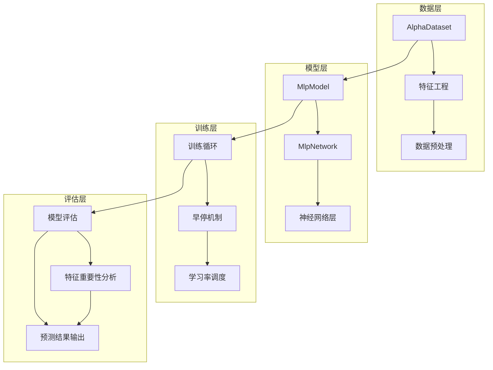
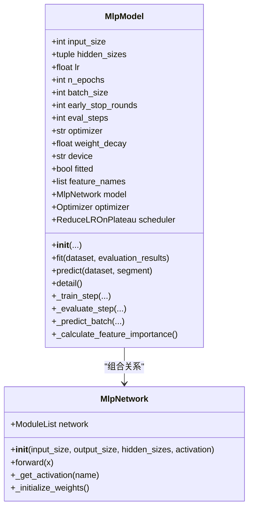
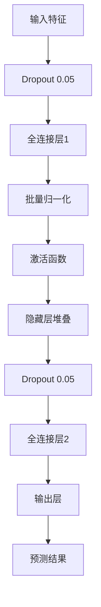
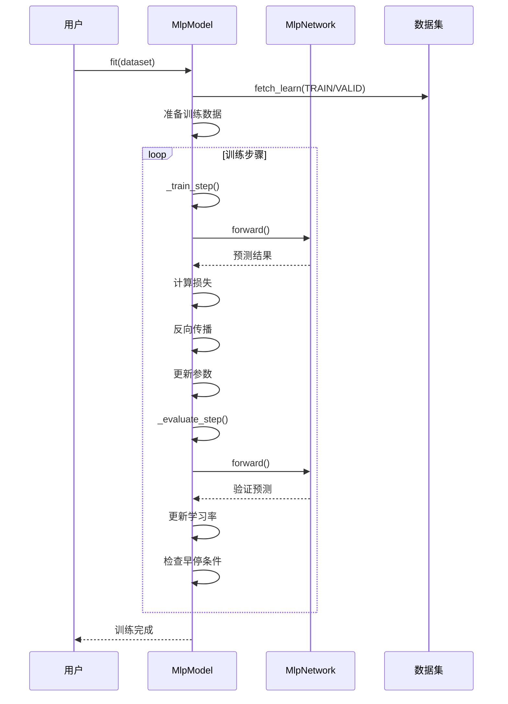
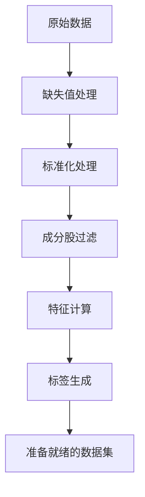
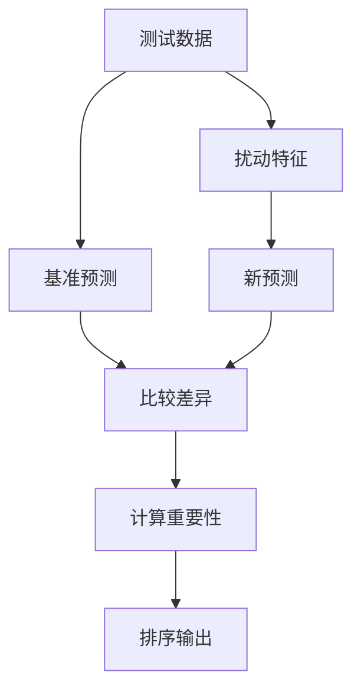
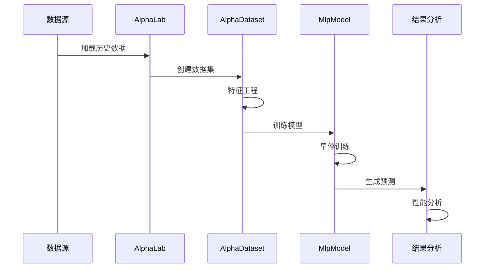
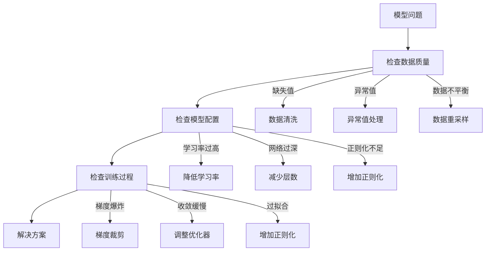

# 多层感知机模型

<cite>
**本文档引用的文件**
- [mlp_model.py](file://vnpy/alpha/model/models/mlp_model.py)
- [template.py](file://vnpy/alpha/model/template.py)
- [processor.py](file://vnpy/alpha/dataset/processor.py)
- [template.py](file://vnpy/alpha/dataset/template.py)
- [utility.py](file://vnpy/alpha/dataset/utility.py)
- [research_workflow_mlp.ipynb](file://examples/alpha_research/research_workflow_mlp.ipynb)
- [math_function.py](file://vnpy/alpha/dataset/math_function.py)
- [ts_function.py](file://vnpy/alpha/dataset/ts_function.py)
- [__init__.py](file://vnpy/alpha/__init__.py)
</cite>

## 目录
1. [项目概述](#项目概述)
2. [系统架构](#系统架构)
3. [核心组件分析](#核心组件分析)
4. [算法原理详解](#算法原理详解)
5. [网络架构设计](#网络架构设计)
6. [训练流程分析](#训练流程分析)
7. [特征工程与数据处理](#特征工程与数据处理)
8. [模型评估与优化](#模型评估与优化)
9. [实际应用示例](#实际应用示例)
10. [性能优化建议](#性能优化建议)
11. [故障排除指南](#故障排除指南)
12. [总结与展望](#总结与展望)

## 项目概述

多层感知机（Multi-Layer Perceptron, MLP）是深度学习领域中最基础且重要的神经网络模型之一。本项目基于PyTorch实现了完整的MLP模型，专门用于Alpha因子预测任务，具备以下核心特性：

- **完整的机器学习管道**：从特征工程到模型训练、评估的全流程支持
- **灵活的网络架构**：可配置的层数、节点数量和激活函数
- **先进的训练策略**：早停机制、学习率调度、正则化等
- **Alpha因子专用优化**：针对金融时间序列数据的特殊需求进行优化

该模型在vn.py量化研究框架中扮演着核心角色，为量化投资策略提供了强大的非线性建模能力。

## 系统架构



**图表来源**
- [mlp_model.py](file://vnpy/alpha/model/models/mlp_model.py#L22-L136)
- [template.py](file://vnpy/alpha/dataset/template.py#L23-L194)

系统采用分层架构设计，确保了各组件之间的松耦合和高内聚性。

## 核心组件分析

### MlpModel 类

MlpModel是整个MLP模型的核心控制器，负责模型的整体管理和协调工作。



**图表来源**
- [mlp_model.py](file://vnpy/alpha/model/models/mlp_model.py#L22-L136)
- [mlp_model.py](file://vnpy/alpha/model/models/mlp_model.py#L553-L684)

### AlphaModel 抽象基类

AlphaModel定义了所有Alpha模型的标准接口，确保不同模型之间的一致性和互操作性。

**章节来源**
- [template.py](file://vnpy/alpha/model/template.py#L9-L31)

## 算法原理详解

### 前馈神经网络架构

MLP采用标准的前馈神经网络架构，具有以下特点：

1. **输入层**：接收原始特征向量
2. **隐藏层**：通过多个全连接层实现非线性变换
3. **输出层**：产生单值预测结果
4. **激活函数**：在每个隐藏层后应用激活函数



**图表来源**
- [mlp_model.py](file://vnpy/alpha/model/models/mlp_model.py#L596-L612)

### 反向传播训练原理

模型采用反向传播算法进行训练，具体流程如下：

1. **前向传播**：计算网络输出和损失
2. **反向传播**：计算梯度
3. **参数更新**：根据优化器规则更新权重
4. **周期评估**：定期评估验证集性能

**章节来源**
- [mlp_model.py](file://vnpy/alpha/model/models/mlp_model.py#L224-L262)
- [mlp_model.py](file://vnpy/alpha/model/models/mlp_model.py#L264-L327)

## 网络架构设计

### 层次化设计

网络架构采用层次化设计，支持灵活的层数和节点配置：

```mermaid
graph LR
subgraph "输入层"
IS[输入尺寸: input_size]
end
subgraph "隐藏层"
H1[隐藏层1: hidden_sizes[0]]
H2[隐藏层2: hidden_sizes[1]]
Hn[隐藏层n: hidden_sizes[n-1]]
end
subgraph "输出层"
OS[输出尺寸: 1]
end
IS --> H1 --> H2 --> Hn --> OS
```

**图表来源**
- [mlp_model.py](file://vnpy/alpha/model/models/mlp_model.py#L593-L612)

### 权重初始化策略

采用Kaiming初始化方法，特别适用于LeakyReLU激活函数：

- **初始化类型**：Kaiming Normal
- **参数设置**：negative_slope=0.1, mode="fan_in", nonlinearity="leaky_relu"
- **目的**：缓解梯度消失问题，加速收敛

**章节来源**
- [mlp_model.py](file://vnpy/alpha/model/models/mlp_model.py#L646-L665)

### 正则化技术

实施多层次正则化策略以防止过拟合：

1. **Dropout**：0.05的随机失活率
2. **L2正则化**：可配置的权重衰减系数
3. **早停机制**：基于验证集性能的自动停止

## 训练流程分析

### 完整训练循环



**图表来源**
- [mlp_model.py](file://vnpy/alpha/model/models/mlp_model.py#L137-L223)
- [mlp_model.py](file://vnpy/alpha/model/models/mlp_model.py#L224-L327)

### 学习率调度策略

采用ReduceLROnPlateau策略，在验证损失不再改善时自动降低学习率：

- **监控指标**：验证损失
- **调整因子**：0.5
- **等待轮数**：10
- **阈值**：0.0001
- **最小学习率**：0.00001

**章节来源**
- [mlp_model.py](file://vnpy/alpha/model/models/mlp_model.py#L124-L135)

## 特征工程与数据处理

### Alpha因子数据处理

系统提供了完整的Alpha因子数据处理流水线：



**图表来源**
- [template.py](file://vnpy/alpha/dataset/template.py#L90-L173)

### 数据预处理功能

系统支持多种数据预处理方法：

1. **缺失值处理**：删除、填充、跨截面均值填充
2. **异常值处理**：无穷大值替换
3. **标准化方法**：Z-Score、鲁棒标准化、时间序列标准化
4. **特征选择**：基于统计学的特征筛选

**章节来源**
- [processor.py](file://vnpy/alpha/dataset/processor.py#L9-L202)

### Alpha因子计算引擎

提供强大的Alpha因子计算能力：

- **数学运算符**：比较、逻辑、算术运算
- **时间序列函数**：滚动窗口统计、回归分析
- **横截面函数**：排名、标准化、缩放
- **技术分析函数**：RSI、ATR等经典指标

**章节来源**
- [math_function.py](file://vnpy/alpha/dataset/math_function.py#L10-L168)
- [ts_function.py](file://vnpy/alpha/dataset/ts_function.py#L12-L330)

## 模型评估与优化

### 特征重要性分析

实现基于扰动的特征重要性评估：



**图表来源**
- [mlp_model.py](file://vnpy/alpha/model/models/mlp_model.py#L458-L490)

### 模型性能评估

提供全面的模型性能评估指标：

- **损失函数**：均方误差(MSE)
- **特征重要性**：基于扰动的统计分析
- **训练状态**：学习率、批次大小、设备信息
- **参数统计**：总参数量、层数、节点数

**章节来源**
- [mlp_model.py](file://vnpy/alpha/model/models/mlp_model.py#L428-L490)

## 实际应用示例

### Alpha因子预测完整流程

基于示例笔记本文件，展示完整的Alpha因子预测工作流程：



**图表来源**
- [research_workflow_mlp.ipynb](file://examples/alpha_research/research_workflow_mlp.ipynb#L1-L484)

### 超参数调优指南

推荐的超参数设置策略：

| 参数类别 | 推荐范围 | 默认值 | 说明 |
|---------|---------|--------|------|
| 学习率(lr) | 0.0001-0.01 | 0.001 | 影响收敛速度和稳定性 |
| 批次大小(batch_size) | 1000-4000 | 2000 | 内存与效率平衡 |
| 隐藏层 | (128,64) | (256,) | 根据数据复杂度调整 |
| 早停轮数 | 30-100 | 50 | 防止过拟合 |
| Dropout | 0.05-0.3 | 0.05 | 正则化强度 |

**章节来源**
- [research_workflow_mlp.ipynb](file://examples/alpha_research/research_workflow_mlp.ipynb#L1-L484)

## 性能优化建议

### 训练性能优化

1. **GPU加速**：优先使用CUDA设备
2. **混合精度训练**：在支持的硬件上启用
3. **批处理优化**：根据内存调整批次大小
4. **数据加载优化**：使用多进程并行处理

### 模型性能优化

1. **网络深度适配**：根据特征维度调整层数
2. **激活函数选择**：LeakyReLU适合深度网络
3. **正则化强度**：根据过拟合程度调整
4. **学习率策略**：动态调整学习率

### 内存管理优化

- **梯度检查**：检测梯度爆炸问题
- **权重共享**：在可能的情况下共享参数
- **及时释放**：及时清理不需要的中间变量

## 故障排除指南

### 常见问题诊断



### 调试工具

1. **梯度检查**：检测梯度异常
2. **损失可视化**：监控训练过程
3. **特征重要性分析**：理解模型决策
4. **预测结果分析**：验证模型性能

**章节来源**
- [mlp_model.py](file://vnpy/alpha/model/models/mlp_model.py#L410-L427)

## 总结与展望

### 技术优势总结

1. **完整的Alpha因子预测解决方案**：从数据处理到模型部署的全流程支持
2. **灵活的网络架构**：可配置的层数、节点数量和激活函数
3. **先进的训练策略**：早停、学习率调度、正则化等
4. **专业的金融数据处理**：针对Alpha因子的特殊需求优化

### 应用前景

MLP模型在量化投资领域的应用前景广阔：

- **因子挖掘**：发现新的Alpha因子
- **策略优化**：提升交易策略收益
- **风险管理**：识别潜在风险因素
- **市场预测**：预测市场走势和波动

### 发展方向

1. **集成学习**：结合其他机器学习算法
2. **强化学习**：引入在线学习机制
3. **可解释性**：增强模型的可解释性
4. **实时预测**：支持流式数据处理

该MLP模型为深度学习研究者提供了一个灵活、高效的神经网络建模框架，特别适用于Alpha因子预测这一专业应用场景。