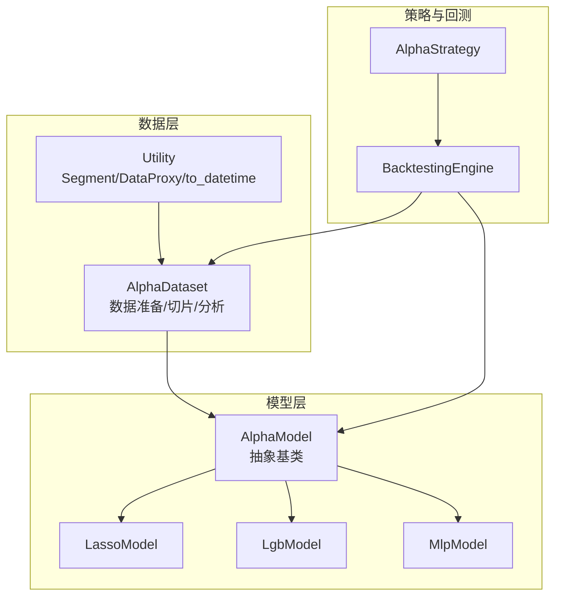
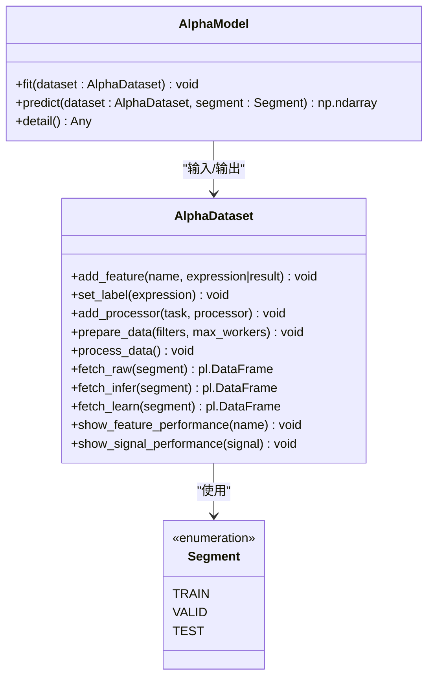
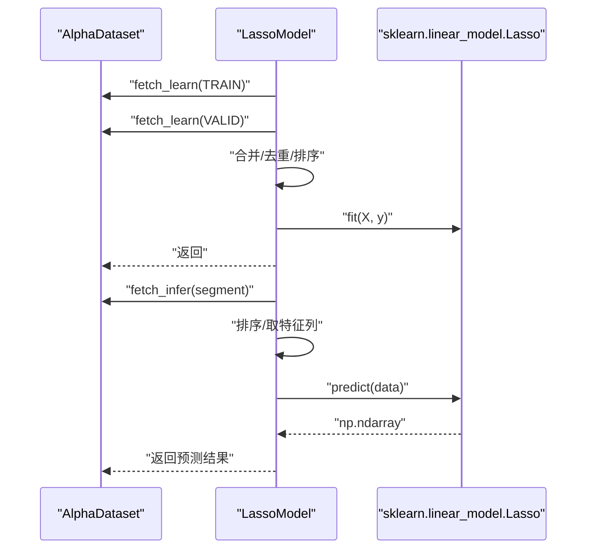
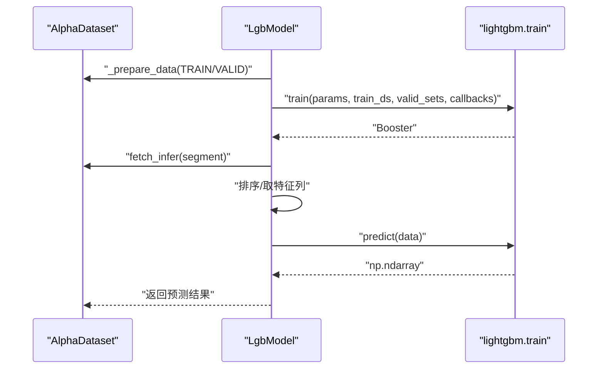
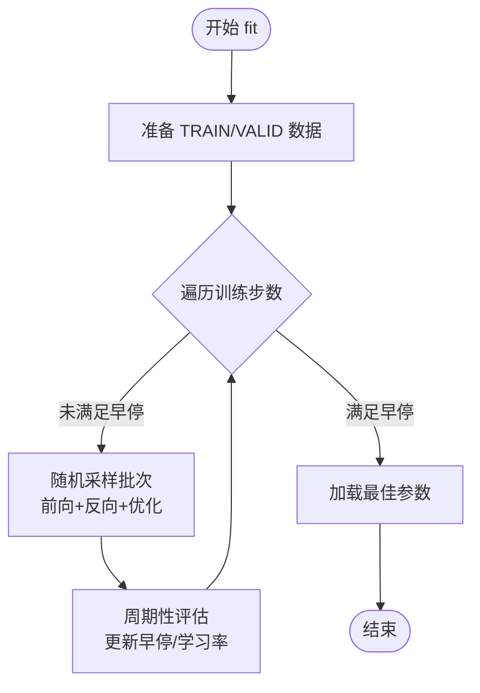
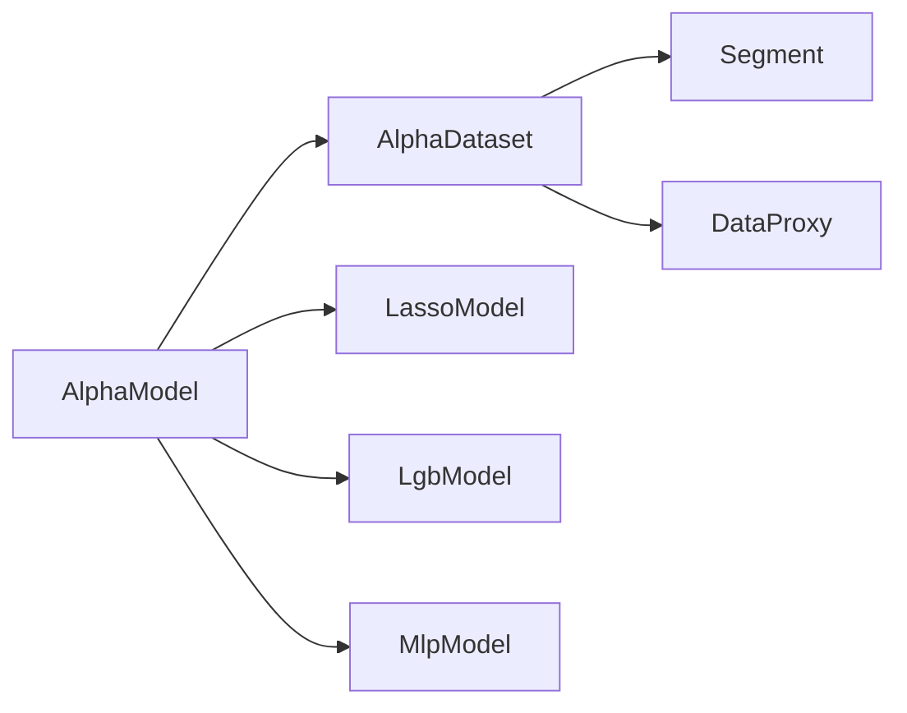

# 模型模板系统

<cite>
**本文引用的文件列表**
- [vnpy/alpha/model/template.py](file://vnpy/alpha/model/template.py)
- [vnpy/alpha/dataset/template.py](file://vnpy/alpha/dataset/template.py)
- [vnpy/alpha/dataset/utility.py](file://vnpy/alpha/dataset/utility.py)
- [vnpy/alpha/model/models/lasso_model.py](file://vnpy/alpha/model/models/lasso_model.py)
- [vnpy/alpha/model/models/lgb_model.py](file://vnpy/alpha/model/models/lgb_model.py)
- [vnpy/alpha/model/models/mlp_model.py](file://vnpy/alpha/model/models/mlp_model.py)
- [vnpy/alpha/__init__.py](file://vnpy/alpha/__init__.py)
- [vnpy/alpha/strategy/backtesting.py](file://vnpy/alpha/strategy/backtesting.py)
- [vnpy/alpha/strategy/template.py](file://vnpy/alpha/strategy/template.py)
</cite>

## 目录
1. [简介](#简介)
2. [项目结构](#项目结构)
3. [核心组件](#核心组件)
4. [架构总览](#架构总览)
5. [组件详解](#组件详解)
6. [依赖关系分析](#依赖关系分析)
7. [性能与可扩展性](#性能与可扩展性)
8. [故障排查指南](#故障排查指南)
9. [结论](#结论)
10. [附录](#附录)

## 简介
本技术文档围绕 Alpha 模型模板系统，系统化阐述 AlphaModel 抽象基类的设计理念、标准化接口规范与实现约束，并结合 Lasso、LightGBM、MLP 三种具体模型实现，给出 fit()、predict()、detail() 的实现要求、类型注解规范、返回值约定与使用范式。文档同时覆盖模型继承体系、接口一致性保障、扩展性设计以及自定义模型开发指南、最佳实践与常见问题解决方案，帮助机器学习开发者快速构建标准化的 Alpha 模型开发框架。

## 项目结构
Alpha 模板系统位于 vnpy.alpha 子模块中，主要由以下层次构成：
- 数据层：AlphaDataset 提供统一的数据准备、切片与分析能力，支持表达式特征计算、多进程并行处理、时间区间查询等。
- 模型层：AlphaModel 抽象基类定义训练、预测与详情输出的统一接口；具体模型（Lasso、LightGBM、MLP）实现该接口。
- 工具与枚举：Segment 枚举用于划分训练/验证/测试区间；DataProxy 支持表达式语法糖；to_datetime 提供时间转换工具。
- 策略与回测：AlphaStrategy 与 BacktestingEngine 提供策略接入 Alpha 模型的回测框架。

图表来源
- [vnpy/alpha/dataset/template.py](file://vnpy/alpha/dataset/template.py#L23-L306)
- [vnpy/alpha/dataset/utility.py](file://vnpy/alpha/dataset/utility.py#L280-L286)
- [vnpy/alpha/model/template.py](file://vnpy/alpha/model/template.py#L9-L31)
- [vnpy/alpha/model/models/lasso_model.py](file://vnpy/alpha/model/models/lasso_model.py#L13-L140)
- [vnpy/alpha/model/models/lgb_model.py](file://vnpy/alpha/model/models/lgb_model.py#L12-L171)
- [vnpy/alpha/model/models/mlp_model.py](file://vnpy/alpha/model/models/mlp_model.py#L22-L684)
- [vnpy/alpha/strategy/backtesting.py](file://vnpy/alpha/strategy/backtesting.py#L22-L200)
- [vnpy/alpha/strategy/template.py](file://vnpy/alpha/strategy/template.py#L15-L206)

章节来源
- [vnpy/alpha/dataset/template.py](file://vnpy/alpha/dataset/template.py#L23-L306)
- [vnpy/alpha/dataset/utility.py](file://vnpy/alpha/dataset/utility.py#L280-L286)
- [vnpy/alpha/model/template.py](file://vnpy/alpha/model/template.py#L9-L31)
- [vnpy/alpha/__init__.py](file://vnpy/alpha/__init__.py#L1-L19)

## 核心组件
- AlphaModel 抽象基类：定义 fit()、predict()、detail() 三个核心方法，确保所有模型具备一致的训练、预测与详情输出接口。
- AlphaDataset：封装数据准备、特征表达式计算、按 Segment 切片、原始/推理/学习数据三态管理、性能分析工具等。
- Segment 枚举：统一 TRAIN/VALID/TEST 区间语义。
- DataProxy：提供表达式语法糖，支持与标量/另一 DataProxy 的四则运算、比较运算与类型规范化。
- 具体模型：LassoModel、LgbModel、MlpModel 分别基于 scikit-learn、LightGBM、PyTorch 实现 AlphaModel 接口。

章节来源
- [vnpy/alpha/model/template.py](file://vnpy/alpha/model/template.py#L9-L31)
- [vnpy/alpha/dataset/template.py](file://vnpy/alpha/dataset/template.py#L23-L306)
- [vnpy/alpha/dataset/utility.py](file://vnpy/alpha/dataset/utility.py#L280-L286)

## 架构总览
AlphaModel 抽象基类通过 AlphaDataset 输入，面向不同算法实现统一接口。AlphaDataset 负责特征表达式计算、数据清洗与分段切片；模型在训练阶段读取学习数据，预测阶段读取推理数据，detail 输出模型内部信息或可视化。

图表来源
- [vnpy/alpha/model/template.py](file://vnpy/alpha/model/template.py#L9-L31)
- [vnpy/alpha/dataset/template.py](file://vnpy/alpha/dataset/template.py#L23-L306)
- [vnpy/alpha/dataset/utility.py](file://vnpy/alpha/dataset/utility.py#L280-L286)

## 组件详解

### AlphaModel 抽象基类
- 设计理念
  - 以“训练-预测-详情”三段式接口统一不同算法族，屏蔽底层实现差异。
  - detail() 默认返回空，允许子类按需输出日志、DataFrame 或图像。
- 方法规范
  - fit(dataset): 在给定 AlphaDataset 上进行训练，不返回值。
  - predict(dataset, segment): 基于指定 Segment 返回预测数组。
  - detail(): 输出模型详情，返回 Any 类型，便于扩展。
- 类型注解与返回约定
  - 参数类型：dataset: AlphaDataset；segment: Segment。
  - 返回类型：fit(): None；predict(): np.ndarray；detail(): Any。
  - 异常：子类应在未训练状态下抛出明确错误（如 ValueError），避免后续 predict 失败。

章节来源
- [vnpy/alpha/model/template.py](file://vnpy/alpha/model/template.py#L9-L31)

### AlphaDataset 数据模板
- 数据生命周期
  - prepare_data(): 并行计算表达式特征，生成 result_df；合并外部特征结果；按 label 是否存在调整列顺序；生成 raw_df。
  - process_data(): 应用 infer_processors 生成 infer_df；根据 process_type 决定是否将 infer_df 复制为 learn_df，再应用 learn_processors。
- 数据切片
  - fetch_raw/fetch_infer/fetch_learn: 基于 Segment 时间范围查询，返回 pl.DataFrame。
- 性能分析
  - show_feature_performance(name): 对单个特征进行分位表现分析。
  - show_signal_performance(signal): 对信号序列进行分位表现分析。
- 关键工具
  - add_feature/set_label/add_processor: 动态注册特征表达式、标签表达式与预处理函数。
  - query_by_time/calculate_feature: 时间过滤与表达式计算辅助函数。

章节来源
- [vnpy/alpha/dataset/template.py](file://vnpy/alpha/dataset/template.py#L23-L306)

### Segment 枚举与 DataProxy 表达式语法
- Segment
  - TRAIN/VALID/TEST 三段式划分，配合 AlphaDataset 的时间区间字典 data_periods 使用。
- DataProxy
  - 提供与标量/另一 DataProxy 的四则运算与比较运算，自动规范化为 Int32 比较结果。
  - calculate_by_expression/calculate_by_polars 支持表达式字符串与 Polars Expr 的特征计算。

章节来源
- [vnpy/alpha/dataset/utility.py](file://vnpy/alpha/dataset/utility.py#L280-L286)
- [vnpy/alpha/dataset/utility.py](file://vnpy/alpha/dataset/utility.py#L19-L286)

### 具体模型实现

#### LassoModel
- 训练流程
  - 合并 TRAIN/VALID 作为学习数据，去重排序后提取特征名与标签。
  - 使用 Lasso 训练，fit_intercept=False，copy_X=False。
- 预测流程
  - 检查模型是否存在；对 infer 数据排序后按特征列预测，返回 np.ndarray。
- 详情输出
  - 输出非零系数特征，按绝对值降序，打印特征重要性。

图表来源
- [vnpy/alpha/model/models/lasso_model.py](file://vnpy/alpha/model/models/lasso_model.py#L40-L110)
- [vnpy/alpha/dataset/template.py](file://vnpy/alpha/dataset/template.py#L174-L193)

章节来源
- [vnpy/alpha/model/models/lasso_model.py](file://vnpy/alpha/model/models/lasso_model.py#L13-L140)

#### LgbModel
- 训练流程
  - _prepare_data: 分别从 TRAIN/VALID 获取学习数据，构造 LightGBM Dataset。
  - 使用 lgb.train 进行训练，支持早停与日志回调。
- 预测流程
  - 检查模型是否存在；对 infer 数据排序后预测，返回 np.ndarray。
- 详情输出
  - 可视化特征重要性（split/gain）两张图。

图表来源
- [vnpy/alpha/model/models/lgb_model.py](file://vnpy/alpha/model/models/lgb_model.py#L53-L147)
- [vnpy/alpha/dataset/template.py](file://vnpy/alpha/dataset/template.py#L174-L193)

章节来源
- [vnpy/alpha/model/models/lgb_model.py](file://vnpy/alpha/model/models/lgb_model.py#L12-L171)

#### MlpModel
- 训练流程
  - 准备 TRAIN/VALID 数据，转为 Tensor 并移动至指定设备。
  - 批量训练，周期性评估，早停与学习率调度。
- 预测流程
  - 检查 fitted 标记；对 infer 数据分批预测，聚合为 np.ndarray。
- 详情输出
  - 输出模型基础信息与参数量；计算特征重要性 DataFrame。

图表来源
- [vnpy/alpha/model/models/mlp_model.py](file://vnpy/alpha/model/models/mlp_model.py#L137-L223)

章节来源
- [vnpy/alpha/model/models/mlp_model.py](file://vnpy/alpha/model/models/mlp_model.py#L22-L684)

## 依赖关系分析
- AlphaModel 与 AlphaDataset：模型通过 AlphaDataset 的 fetch_* 接口获取数据，实现训练与预测的解耦。
- Segment：贯穿数据准备与预测阶段，确保训练/验证/测试区间一致。
- DataProxy：在 AlphaDataset.prepare_data 中被调用，支撑表达式特征的动态计算。
- 具体模型：各自依赖第三方库（sklearn/LightGBM/torch），但对外保持 AlphaModel 接口一致。

图表来源
- [vnpy/alpha/model/template.py](file://vnpy/alpha/model/template.py#L9-L31)
- [vnpy/alpha/dataset/template.py](file://vnpy/alpha/dataset/template.py#L23-L306)
- [vnpy/alpha/dataset/utility.py](file://vnpy/alpha/dataset/utility.py#L280-L286)
- [vnpy/alpha/model/models/lasso_model.py](file://vnpy/alpha/model/models/lasso_model.py#L13-L140)
- [vnpy/alpha/model/models/lgb_model.py](file://vnpy/alpha/model/models/lgb_model.py#L12-L171)
- [vnpy/alpha/model/models/mlp_model.py](file://vnpy/alpha/model/models/mlp_model.py#L22-L684)

章节来源
- [vnpy/alpha/model/template.py](file://vnpy/alpha/model/template.py#L9-L31)
- [vnpy/alpha/dataset/template.py](file://vnpy/alpha/dataset/template.py#L23-L306)
- [vnpy/alpha/dataset/utility.py](file://vnpy/alpha/dataset/utility.py#L280-L286)

## 性能与可扩展性
- 并行特征计算：AlphaDataset.prepare_data 使用多进程池并行计算表达式特征，提升大规模数据准备效率。
- 设备与批处理：MlpModel 支持 GPU/CPU 自动切换与大批次分块预测，减少内存峰值。
- 早停与调度：MlpModel 采用早停与学习率调度，防止过拟合并加速收敛。
- 可扩展点
  - 新增模型：只需继承 AlphaModel 并实现 fit/predict/detail。
  - 新增特征：通过 AlphaDataset.add_feature 与表达式语法注册新特征。
  - 新增预处理：通过 AlphaDataset.add_processor 注册 infer/learn 阶段处理器。

章节来源
- [vnpy/alpha/dataset/template.py](file://vnpy/alpha/dataset/template.py#L90-L173)
- [vnpy/alpha/model/models/mlp_model.py](file://vnpy/alpha/model/models/mlp_model.py#L137-L223)

## 故障排查指南
- 训练前未准备数据
  - 症状：predict 报错或返回异常。
  - 处理：确保先调用 AlphaDataset.prepare_data/process_data，再进行模型训练与预测。
- 未训练即预测
  - 症状：LassoModel/LgbModel/MlpModel 在 predict 前抛出 ValueError。
  - 处理：先执行模型的 fit()，再进行 predict()。
- 特征缺失或列名不匹配
  - 症状：模型输入维度不一致或报错。
  - 处理：确认 AlphaDataset.add_feature 已正确注册特征，且列名与模型期望一致。
- 多进程环境限制
  - 症状：Windows 下 spawn 上下文相关问题。
  - 处理：遵循 multiprocessing 的跨平台限制，必要时调整 max_workers 或使用其他上下文。

章节来源
- [vnpy/alpha/model/models/lasso_model.py](file://vnpy/alpha/model/models/lasso_model.py#L96-L110)
- [vnpy/alpha/model/models/lgb_model.py](file://vnpy/alpha/model/models/lgb_model.py#L134-L147)
- [vnpy/alpha/model/models/mlp_model.py](file://vnpy/alpha/model/models/mlp_model.py#L400-L408)

## 结论
AlphaModel 抽象基类提供了统一的模型开发接口，结合 AlphaDataset 的数据准备与切片能力，形成“表达式特征 + 标准化模型”的 Alpha 开发流水线。通过 Lasso、LightGBM、MLP 的实现示例，开发者可以快速理解接口规范与最佳实践，并在此基础上扩展新的模型与特征，构建稳健、可维护的 Alpha 模型体系。

## 附录

### AlphaModel 接口规范速查
- fit(dataset: AlphaDataset) -> None
  - 输入：AlphaDataset
  - 行为：在 TRAIN/VALID 上训练，保存内部状态
  - 异常：未准备数据或参数非法时抛出
- predict(dataset: AlphaDataset, segment: Segment) -> np.ndarray
  - 输入：AlphaDataset 与 Segment
  - 行为：返回预测数组
  - 异常：未训练时抛出
- detail() -> Any
  - 行为：输出模型详情（日志/DataFrame/图像等）
  - 默认：返回空

章节来源
- [vnpy/alpha/model/template.py](file://vnpy/alpha/model/template.py#L12-L30)

### 自定义模型开发指南
- 继承与实现
  - 继承 AlphaModel，实现 fit()/predict()/detail()。
  - 在 fit() 中使用 dataset.fetch_learn() 获取学习数据；在 predict() 中使用 dataset.fetch_infer() 获取推理数据。
- 数据准备
  - 在 AlphaDataset 上注册特征与标签，调用 prepare_data/process_data 完成数据管线。
- 可视化与报告
  - detail() 可输出 DataFrame 或图像，便于分析特征重要性或训练过程。
- 最佳实践
  - 明确早停与评估策略，避免过拟合。
  - 统一设备与批处理策略，提升预测吞吐。
  - 严格区分 TRAIN/VALID/TEST 区间，确保评估无泄漏。

章节来源
- [vnpy/alpha/model/models/lasso_model.py](file://vnpy/alpha/model/models/lasso_model.py#L40-L140)
- [vnpy/alpha/model/models/lgb_model.py](file://vnpy/alpha/model/models/lgb_model.py#L84-L171)
- [vnpy/alpha/model/models/mlp_model.py](file://vnpy/alpha/model/models/mlp_model.py#L137-L684)