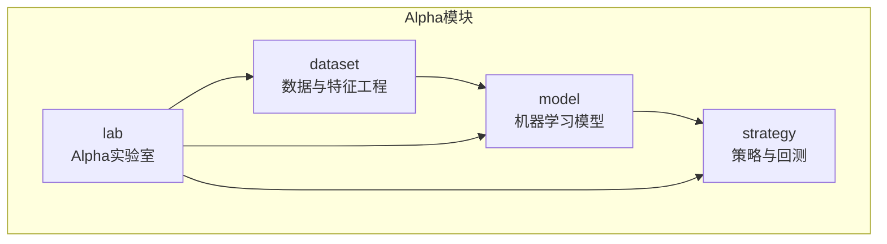
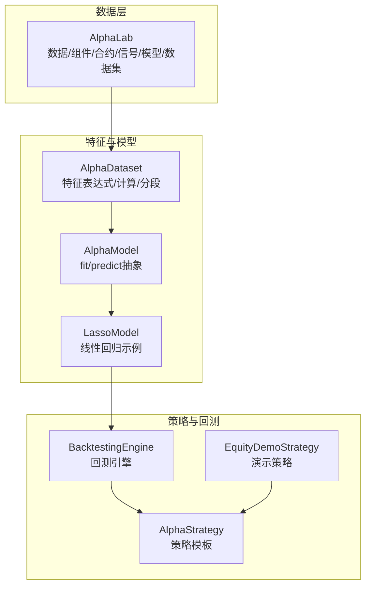
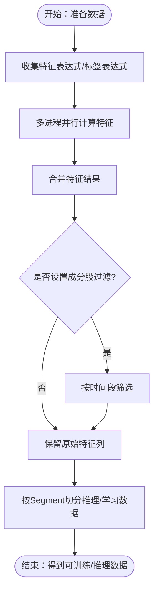
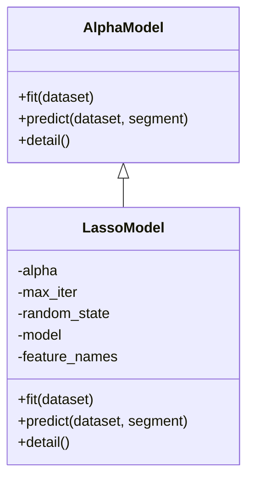
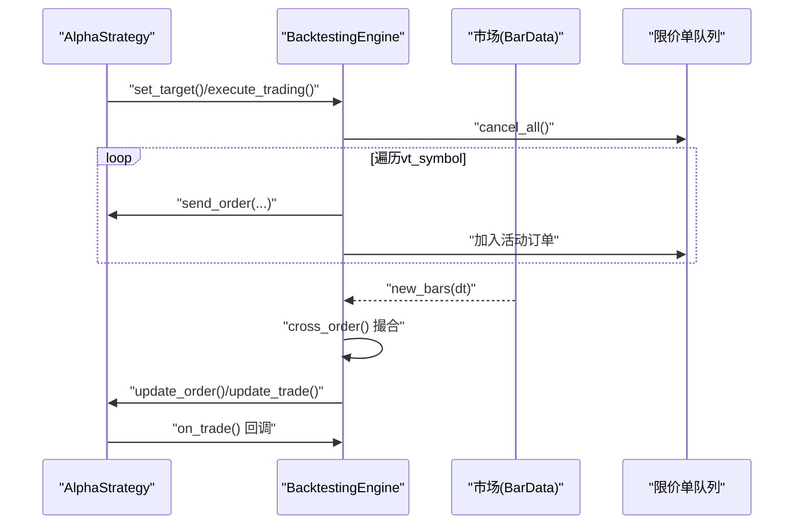
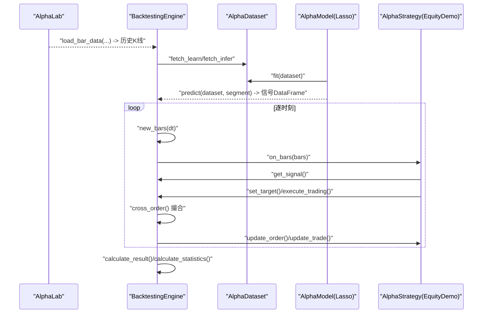
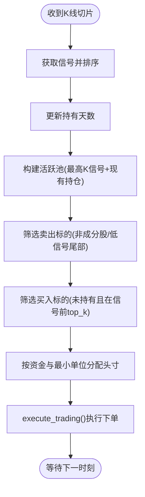
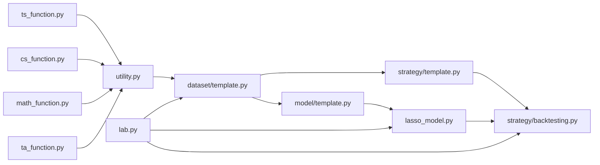

# Alpha策略模块

<cite>
**本文引用的文件**
- [vnpy/alpha/__init__.py](file://vnpy/alpha/__init__.py)
- [vnpy/alpha/dataset/template.py](file://vnpy/alpha/dataset/template.py)
- [vnpy/alpha/dataset/utility.py](file://vnpy/alpha/dataset/utility.py)
- [vnpy/alpha/dataset/ts_function.py](file://vnpy/alpha/dataset/ts_function.py)
- [vnpy/alpha/dataset/cs_function.py](file://vnpy/alpha/dataset/cs_function.py)
- [vnpy/alpha/dataset/math_function.py](file://vnpy/alpha/dataset/math_function.py)
- [vnpy/alpha/dataset/ta_function.py](file://vnpy/alpha/dataset/ta_function.py)
- [vnpy/alpha/dataset/processor.py](file://vnpy/alpha/dataset/processor.py)
- [vnpy/alpha/dataset/datasets/alpha_101.py](file://vnpy/alpha/dataset/datasets/alpha_101.py)
- [vnpy/alpha/model/template.py](file://vnpy/alpha/model/template.py)
- [vnpy/alpha/model/models/lasso_model.py](file://vnpy/alpha/model/models/lasso_model.py)
- [vnpy/alpha/strategy/template.py](file://vnpy/alpha/strategy/template.py)
- [vnpy/alpha/strategy/backtesting.py](file://vnpy/alpha/strategy/backtesting.py)
- [vnpy/alpha/strategy/strategies/equity_demo_strategy.py](file://vnpy/alpha/strategy/strategies/equity_demo_strategy.py)
- [vnpy/alpha/lab.py](file://vnpy/alpha/lab.py)
</cite>

## 目录
1. [引言](#引言)
2. [项目结构](#项目结构)
3. [核心组件](#核心组件)
4. [架构总览](#架构总览)
5. [详细组件分析](#详细组件分析)
6. [依赖关系分析](#依赖关系分析)
7. [性能考量](#性能考量)
8. [故障排查指南](#故障排查指南)
9. [结论](#结论)
10. [附录](#附录)

## 引言
本技术文档面向量化策略开发者，系统性介绍Alpha策略模块的设计与实现，覆盖以下关键主题：
- AlphaStrategy模板类的设计原则与策略开发框架
- 回测引擎BacktestingEngine的实现机制、数据接口与交易模拟
- 策略模板的标准接口、信号生成机制与风险管理
- 演示策略EquityDemoStrategy的实现细节与使用示例
- 策略开发最佳实践、性能优化建议与实盘部署指导

目标是帮助读者从概念验证到实盘应用，构建稳定、可扩展、可复用的Alpha策略体系。

## 项目结构
Alpha策略模块位于vnpy/alpha目录下，按“数据处理/特征工程”、“模型学习”、“策略执行/回测”、“实验室工具”四个层次组织，形成完整的Alpha研究流水线。

**章节来源**
- [vnpy/alpha/__init__.py](file://vnpy/alpha/__init__.py#L1-L19)

## 核心组件
- AlphaDataset：特征工厂与数据管线，支持表达式/Polars表达式特征计算、跨时序/跨截面操作、数据清洗与分段（训练/验证/测试）管理。
- AlphaModel：模型抽象，统一fit/predict接口，便于替换不同算法。
- AlphaStrategy：策略模板，定义策略生命周期回调、订单/交易更新、目标仓位与执行、资金与头寸查询等。
- BacktestingEngine：回测引擎，负责数据加载、逐K回放、订单撮合、每日损益计算、统计指标与可视化。
- AlphaLab：Alpha实验室，提供数据持久化/加载、组件过滤、合约参数、信号/模型/数据集存取。
- 演示策略EquityDemoStrategy：多因子信号驱动的多股票多头组合策略示例。

**章节来源**
- [vnpy/alpha/dataset/template.py](file://vnpy/alpha/dataset/template.py#L23-L306)
- [vnpy/alpha/model/template.py](file://vnpy/alpha/model/template.py#L9-L31)
- [vnpy/alpha/strategy/template.py](file://vnpy/alpha/strategy/template.py#L15-L206)
- [vnpy/alpha/strategy/backtesting.py](file://vnpy/alpha/strategy/backtesting.py#L22-L945)
- [vnpy/alpha/lab.py](file://vnpy/alpha/lab.py#L20-L481)
- [vnpy/alpha/strategy/strategies/equity_demo_strategy.py](file://vnpy/alpha/strategy/strategies/equity_demo_strategy.py#L12-L102)

## 架构总览
Alpha策略模块采用“特征工程-模型学习-策略执行-回测评估”的闭环设计。数据通过AlphaLab加载与缓存，经AlphaDataset生成特征与标签，AlphaModel进行拟合与预测，策略基于信号生成交易指令，BacktestingEngine完成订单撮合与损益统计。

**图示来源**
- [vnpy/alpha/lab.py](file://vnpy/alpha/lab.py#L20-L481)
- [vnpy/alpha/dataset/template.py](file://vnpy/alpha/dataset/template.py#L23-L306)
- [vnpy/alpha/model/template.py](file://vnpy/alpha/model/template.py#L9-L31)
- [vnpy/alpha/model/models/lasso_model.py](file://vnpy/alpha/model/models/lasso_model.py#L13-L140)
- [vnpy/alpha/strategy/backtesting.py](file://vnpy/alpha/strategy/backtesting.py#L22-L945)
- [vnpy/alpha/strategy/template.py](file://vnpy/alpha/strategy/template.py#L15-L206)
- [vnpy/alpha/strategy/strategies/equity_demo_strategy.py](file://vnpy/alpha/strategy/strategies/equity_demo_strategy.py#L12-L102)

## 详细组件分析

### AlphaDataset：特征工厂与数据管线
- 设计要点
  - 支持表达式与Polars表达式两种特征计算方式，统一通过DataProxy封装，提供丰富的时序/横截面/数学/TA运算符。
  - 提供add_feature/set_label/add_processor接口，灵活拼装特征与标签；支持按Segment（训练/验证/测试）分段取数。
  - 数据准备阶段并行计算特征表达式，支持按时间窗口筛选与按成分股过滤，输出标准化的原始/推理/学习数据集。
- 关键流程
  - 表达式注册与计算：register_functions注入自定义函数；calculate_by_expression/calculate_by_polars执行表达式。
  - 特征并行计算：prepare_data内部以多进程并行计算，提升大规模特征生成效率。
  - 绩效分析：show_feature_performance/show_signal_performance对接alphalens进行单因子/信号表现分析。

**图示来源**
- [vnpy/alpha/dataset/template.py](file://vnpy/alpha/dataset/template.py#L90-L194)
- [vnpy/alpha/dataset/utility.py](file://vnpy/alpha/dataset/utility.py#L13-L17)
- [vnpy/alpha/dataset/utility.py](file://vnpy/alpha/dataset/utility.py#L203-L255)

**章节来源**
- [vnpy/alpha/dataset/template.py](file://vnpy/alpha/dataset/template.py#L23-L306)
- [vnpy/alpha/dataset/utility.py](file://vnpy/alpha/dataset/utility.py#L19-L286)
- [vnpy/alpha/dataset/ts_function.py](file://vnpy/alpha/dataset/ts_function.py#L12-L330)
- [vnpy/alpha/dataset/cs_function.py](file://vnpy/alpha/dataset/cs_function.py#L10-L65)
- [vnpy/alpha/dataset/math_function.py](file://vnpy/alpha/dataset/math_function.py#L10-L168)
- [vnpy/alpha/dataset/ta_function.py](file://vnpy/alpha/dataset/ta_function.py#L24-L44)
- [vnpy/alpha/dataset/processor.py](file://vnpy/alpha/dataset/processor.py#L9-L202)

### AlphaModel与LassoModel：模型抽象与线性回归示例
- AlphaModel定义了fit与predict两个抽象方法，统一不同算法的训练与预测接口。
- LassoModel以AlphaDataset为输入，合并训练与验证数据进行拟合，使用训练特征列生成预测向量，并提供特征重要性输出。

**图示来源**
- [vnpy/alpha/model/template.py](file://vnpy/alpha/model/template.py#L9-L31)
- [vnpy/alpha/model/models/lasso_model.py](file://vnpy/alpha/model/models/lasso_model.py#L13-L140)

**章节来源**
- [vnpy/alpha/model/template.py](file://vnpy/alpha/model/template.py#L9-L31)
- [vnpy/alpha/model/models/lasso_model.py](file://vnpy/alpha/model/models/lasso_model.py#L40-L111)

### AlphaStrategy：策略模板与交易接口
- 生命周期回调：on_init/on_bars/on_trade由策略实现，引擎在回测过程中按时间片调用。
- 订单与交易：提供buy/sell/short/cover/send_order/cancel_order/cancel_all等便捷方法；内部通过BacktestingEngine转发。
- 仓位与目标：维护pos_data/target_data，支持execute_trading根据目标与当前头寸差额下单，考虑价格滑点与对锁逻辑。
- 资金与估值：get_cash_available/get_holding_value/get_portfolio_value用于风控与再平衡。

**图示来源**
- [vnpy/alpha/strategy/template.py](file://vnpy/alpha/strategy/template.py#L74-L132)
- [vnpy/alpha/strategy/template.py](file://vnpy/alpha/strategy/template.py#L133-L186)
- [vnpy/alpha/strategy/backtesting.py](file://vnpy/alpha/strategy/backtesting.py#L579-L617)
- [vnpy/alpha/strategy/backtesting.py](file://vnpy/alpha/strategy/backtesting.py#L619-L708)

**章节来源**
- [vnpy/alpha/strategy/template.py](file://vnpy/alpha/strategy/template.py#L15-L206)

### BacktestingEngine：回测引擎与交易模拟
- 参数与数据加载：set_parameters设置标的、周期、资金、费率等；load_data按vt_symbol批量加载BarData并建立历史映射。
- 回放与撮合：run_backtesting遍历时间序列，new_bars推送K线，cross_order按涨跌停与对手价撮合，生成TradeData并更新资金与持仓。
- 结果与统计：calculate_result按日归集交易，计算每日盈亏；calculate_statistics产出收益、回撤、夏普等指标；show_chart/show_performance可视化。
- 信号接入：get_signal按当前datetime从外部传入的信号表中提取当日信号，供策略使用。

**图示来源**
- [vnpy/alpha/strategy/backtesting.py](file://vnpy/alpha/strategy/backtesting.py#L70-L169)
- [vnpy/alpha/strategy/backtesting.py](file://vnpy/alpha/strategy/backtesting.py#L170-L226)
- [vnpy/alpha/strategy/backtesting.py](file://vnpy/alpha/strategy/backtesting.py#L228-L402)
- [vnpy/alpha/strategy/backtesting.py](file://vnpy/alpha/strategy/backtesting.py#L440-L560)
- [vnpy/alpha/strategy/backtesting.py](file://vnpy/alpha/strategy/backtesting.py#L709-L722)

**章节来源**
- [vnpy/alpha/strategy/backtesting.py](file://vnpy/alpha/strategy/backtesting.py#L22-L945)

### AlphaLab：数据与资产中心
- 数据存储：save_bar_data/load_bar_data/load_bar_df支持日线/分钟线Parquet存取与范围过滤。
- 组件与过滤：save_component_data/load_component_data/load_component_symbols/load_component_filters支持指数成分股时间窗过滤。
- 合约参数：add_contract_setting/load_contract_setttings提供交易费率、乘数、最小变动单位等。
- 信号/模型/数据集：save/load/remove/list系列方法管理信号表、模型与数据集。

**章节来源**
- [vnpy/alpha/lab.py](file://vnpy/alpha/lab.py#L51-L154)
- [vnpy/alpha/lab.py](file://vnpy/alpha/lab.py#L156-L243)
- [vnpy/alpha/lab.py](file://vnpy/alpha/lab.py#L245-L347)
- [vnpy/alpha/lab.py](file://vnpy/alpha/lab.py#L349-L481)

### 演示策略EquityDemoStrategy：多因子信号驱动的多股票多头组合
- 初始化：记录持有天数，写日志。
- 信号与排序：get_signal()取最新信号，按signal降序排列。
- 仓位管理：
  - 卖出：剔除非成分股权重、持有期不足不卖、按最低信号区间择机减仓。
  - 买入：在未持有的候选中按top_k选择，按可用资金与最小交易单位分配。
- 执行：execute_trading根据目标与当前头寸差额下单，考虑滑点与对锁逻辑。
- 风险控制：cash_ratio限制资金利用率，min_days避免频繁交易，min_commission/费率估算交易成本。

**图示来源**
- [vnpy/alpha/strategy/strategies/equity_demo_strategy.py](file://vnpy/alpha/strategy/strategies/equity_demo_strategy.py#L38-L102)

**章节来源**
- [vnpy/alpha/strategy/strategies/equity_demo_strategy.py](file://vnpy/alpha/strategy/strategies/equity_demo_strategy.py#L12-L102)

## 依赖关系分析
- 模块内聚与耦合
  - AlphaDataset与各类函数模块（ts/cs/math/ta）解耦，通过DataProxy与表达式接口连接，便于扩展新算子。
  - AlphaModel与AlphaDataset解耦，通过Segment与列名约定进行数据交互。
  - BacktestingEngine与AlphaStrategy通过策略接口解耦，策略仅依赖信号与下单接口。
- 外部依赖
  - Polars用于高性能数据处理与表达式计算。
  - Scipy/TALib用于统计与技术分析。
  - Plotly/alphalens用于可视化与因子分析。

**图示来源**
- [vnpy/alpha/dataset/ts_function.py](file://vnpy/alpha/dataset/ts_function.py#L12-L330)
- [vnpy/alpha/dataset/cs_function.py](file://vnpy/alpha/dataset/cs_function.py#L10-L65)
- [vnpy/alpha/dataset/math_function.py](file://vnpy/alpha/dataset/math_function.py#L10-L168)
- [vnpy/alpha/dataset/ta_function.py](file://vnpy/alpha/dataset/ta_function.py#L24-L44)
- [vnpy/alpha/dataset/utility.py](file://vnpy/alpha/dataset/utility.py#L203-L255)
- [vnpy/alpha/dataset/template.py](file://vnpy/alpha/dataset/template.py#L23-L306)
- [vnpy/alpha/model/template.py](file://vnpy/alpha/model/template.py#L9-L31)
- [vnpy/alpha/model/models/lasso_model.py](file://vnpy/alpha/model/models/lasso_model.py#L40-L111)
- [vnpy/alpha/strategy/template.py](file://vnpy/alpha/strategy/template.py#L15-L206)
- [vnpy/alpha/strategy/backtesting.py](file://vnpy/alpha/strategy/backtesting.py#L22-L945)
- [vnpy/alpha/lab.py](file://vnpy/alpha/lab.py#L20-L481)

**章节来源**
- [vnpy/alpha/dataset/template.py](file://vnpy/alpha/dataset/template.py#L23-L306)
- [vnpy/alpha/model/template.py](file://vnpy/alpha/model/template.py#L9-L31)
- [vnpy/alpha/strategy/backtesting.py](file://vnpy/alpha/strategy/backtesting.py#L22-L945)
- [vnpy/alpha/lab.py](file://vnpy/alpha/lab.py#L20-L481)

## 性能考量
- 特征计算
  - 使用多进程并行计算表达式特征，显著缩短大规模特征生成时间。
  - Polars滚动/分组/窗口操作在内存与速度上优于纯Python实现。
- 数据加载
  - Parquet格式压缩存储，按符号与时间索引快速过滤。
  - load_bar_df支持扩展天数与归一化，减少重复计算。
- 回测执行
  - 逐时刻回放，订单撮合在K线级别完成，保证时序一致性。
  - 可视化与统计在回测结束后集中计算，避免实时开销。
- 建议
  - 对高频信号与长序列场景，优先使用Polars表达式而非Python循环。
  - 合理设置并行度与内存阈值，避免进程间争用。
  - 在策略中尽量减少每时刻的IO与全局状态访问。

[本节为通用性能建议，无需特定文件引用]

## 故障排查指南
- 信号缺失
  - 现象：get_signal返回空或日志提示找不到对应datetime的信号。
  - 排查：确认信号表保存路径与命名一致；检查datetime对齐与时区处理。
- 订单未成交
  - 现象：限价单长时间未成交。
  - 排查：检查涨跌停限制、价格精度round_to、滑点price_add；确认合约费率与最小变动单位。
- 资金不足
  - 现象：下单失败或资金变为负。
  - 排查：核对cash_ratio、最小交易单位与手续费；检查execute_trading中的头寸差额计算。
- 组件过滤异常
  - 现象：成分股过滤后样本过少。
  - 排查：检查load_component_filters生成的时间窗是否正确；确认vt_symbol命名一致性。

**章节来源**
- [vnpy/alpha/strategy/backtesting.py](file://vnpy/alpha/strategy/backtesting.py#L709-L722)
- [vnpy/alpha/strategy/backtesting.py](file://vnpy/alpha/strategy/backtesting.py#L619-L708)
- [vnpy/alpha/lab.py](file://vnpy/alpha/lab.py#L301-L347)

## 结论
Alpha策略模块通过清晰的分层设计与强大的特征工程能力，提供了从因子研发到策略回测的一体化方案。策略模板与回测引擎解耦良好，便于快速迭代与扩展。结合演示策略与AlphaLab的数据管理能力，开发者可以高效地完成从概念验证到实盘部署的全流程工作。

[本节为总结性内容，无需特定文件引用]

## 附录

### Alpha101数据集：101个世界因子
- 通过Alpha101类在构造函数中一次性声明全部101个因子表达式，并设置label为未来收益。
- 适合快速验证因子有效性与信号稳定性。

**章节来源**
- [vnpy/alpha/dataset/datasets/alpha_101.py](file://vnpy/alpha/dataset/datasets/alpha_101.py#L6-L331)

### 策略开发最佳实践
- 信号生成
  - 使用表达式语言与DataProxy组合，避免显式循环；必要时使用Polars表达式。
  - 先做横截面标准化与去极值，再做时序标准化，降低异常值影响。
- 风险管理
  - 设置最小持有期与换仓频率上限，避免过度交易。
  - 控制单合约与总仓位集中度，结合止损/止盈与最大回撤控制。
- 回测规范
  - 明确训练/验证/测试划分，避免数据泄露。
  - 使用多折验证与滚动窗口评估，关注稳定性指标。
- 实盘部署
  - 将信号表与模型版本化管理，确保可追溯。
  - 建立监控告警与日志审计，定期校准滑点与手续费。

[本节为通用实践建议，无需特定文件引用]