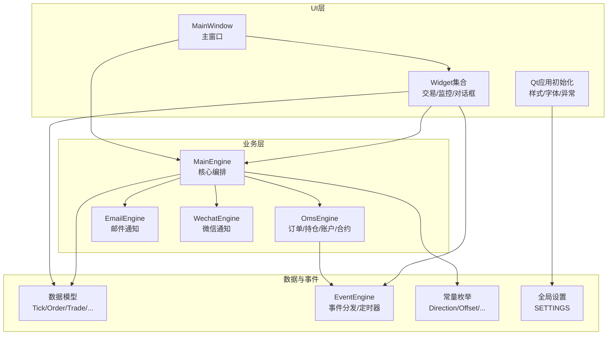
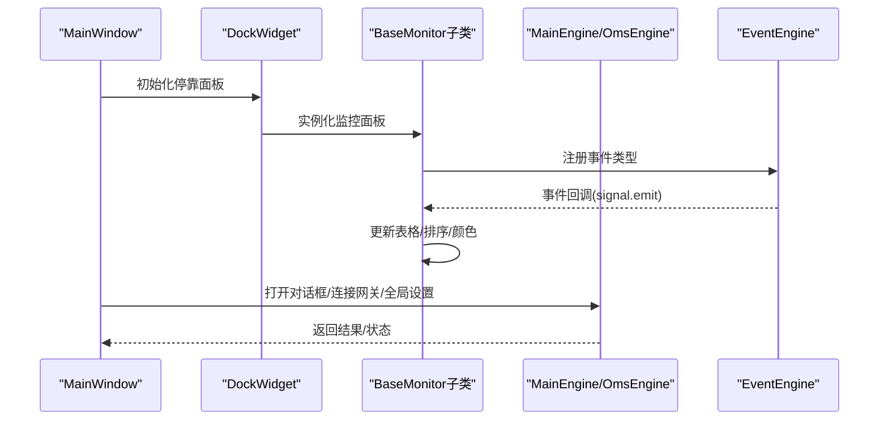
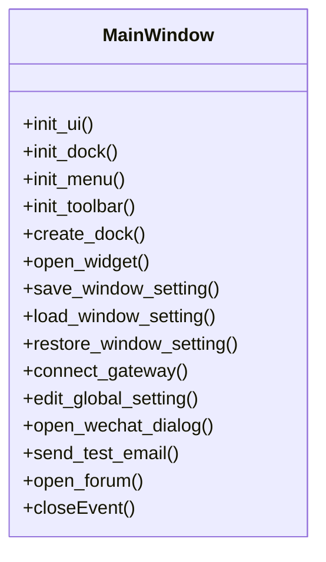
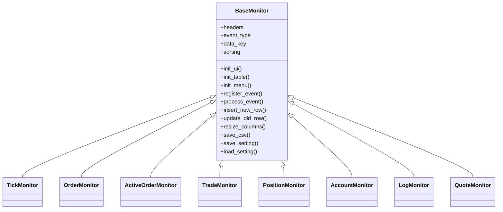
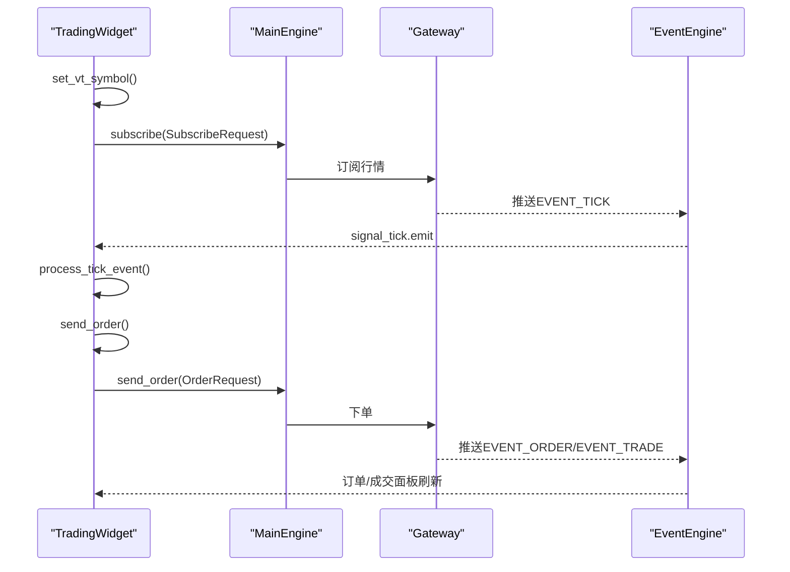
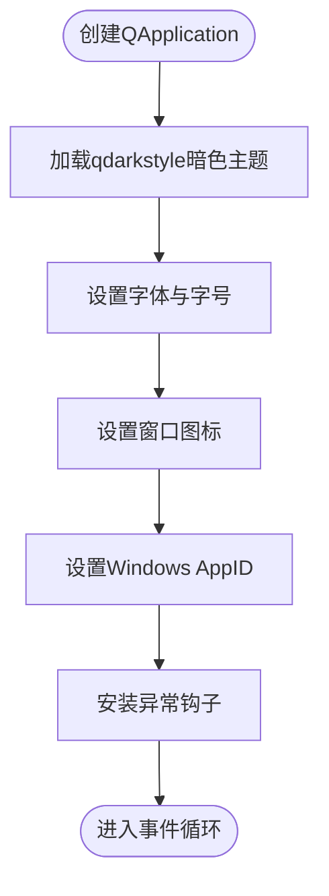
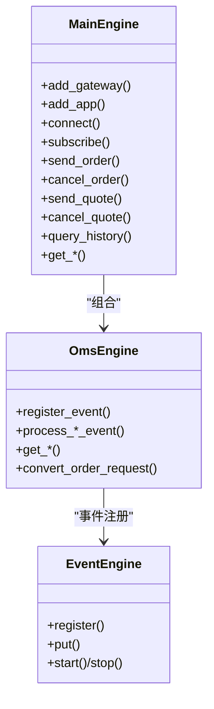
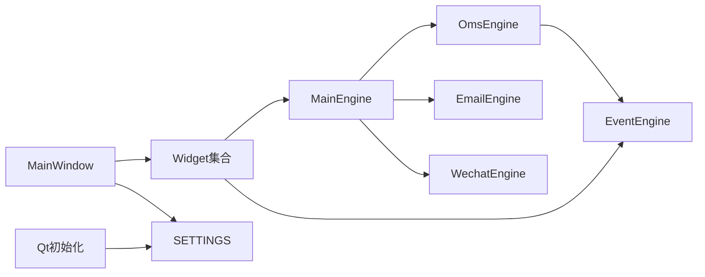

# GUI应用程序

<cite>
**本文引用的文件**
- [vnpy/trader/ui/mainwindow.py](file://vnpy/trader/ui/mainwindow.py)
- [vnpy/trader/ui/widget.py](file://vnpy/trader/ui/widget.py)
- [vnpy/trader/ui/qt.py](file://vnpy/trader/ui/qt.py)
- [vnpy/trader/engine.py](file://vnpy/trader/engine.py)
- [vnpy/trader/object.py](file://vnpy/trader/object.py)
- [vnpy/trader/constant.py](file://vnpy/trader/constant.py)
- [vnpy/trader/setting.py](file://vnpy/trader/setting.py)
- [vnpy/event/engine.py](file://vnpy/event/engine.py)
- [examples/veighna_trader/run.py](file://examples/veighna_trader/run.py)
- [vnpy/trader/utility.py](file://vnpy/trader/utility.py)
</cite>

## 目录
1. [简介](#简介)
2. [项目结构](#项目结构)
3. [核心组件](#核心组件)
4. [架构总览](#架构总览)
5. [详细组件分析](#详细组件分析)
6. [依赖关系分析](#依赖关系分析)
7. [性能考量](#性能考量)
8. [故障排查指南](#故障排查指南)
9. [结论](#结论)
10. [附录](#附录)

## 简介
本文件面向需要开发量化交易GUI应用的开发者，系统性解析VeighNa的GUI应用程序设计与实现，重点覆盖：
- 主窗口的布局与交互架构
- 交易界面、监控面板与设置管理的实现细节
- PySide6框架的使用与自定义控件开发方法
- 界面定制化示例与用户体验优化建议

目标是帮助读者快速理解并复用VeighNa的UI设计思想，构建稳定、可扩展、易维护的量化交易桌面应用。

## 项目结构
VeighNa的GUI位于vnpy/trader/ui目录下，采用“事件驱动 + 分层模块”的组织方式：
- ui/mainwindow.py：主窗口，负责菜单、工具栏、停靠面板的初始化与生命周期管理
- ui/widget.py：通用UI控件与监控面板（订单、成交、持仓、账户、日志等）
- ui/qt.py：Qt应用初始化、样式、字体、图标、异常捕获与展示
- engine.py：核心引擎（MainEngine、OmsEngine、EmailEngine、WechatEngine）与业务逻辑编排
- object.py：基础数据模型（Tick、Order、Trade、Position、Account、Contract、Quote等）
- constant.py：枚举常量（Direction、Offset、Status、OrderType、Exchange等）
- setting.py：全局配置项
- event/engine.py：事件驱动框架（事件分发、定时器）
- examples/veighna_trader/run.py：示例入口，演示如何集成Gateway与App

图表来源
- [vnpy/trader/ui/mainwindow.py](file://vnpy/trader/ui/mainwindow.py#L40-L100)
- [vnpy/trader/ui/widget.py](file://vnpy/trader/ui/widget.py#L241-L417)
- [vnpy/trader/ui/qt.py](file://vnpy/trader/ui/qt.py#L21-L71)
- [vnpy/trader/engine.py](file://vnpy/trader/engine.py#L81-L167)
- [vnpy/event/engine.py](file://vnpy/event/engine.py#L33-L88)
- [vnpy/trader/object.py](file://vnpy/trader/object.py#L17-L81)
- [vnpy/trader/constant.py](file://vnpy/trader/constant.py#L10-L72)
- [vnpy/trader/setting.py](file://vnpy/trader/setting.py#L11-L44)

章节来源
- [vnpy/trader/ui/mainwindow.py](file://vnpy/trader/ui/mainwindow.py#L40-L100)
- [vnpy/trader/ui/widget.py](file://vnpy/trader/ui/widget.py#L241-L417)
- [vnpy/trader/ui/qt.py](file://vnpy/trader/ui/qt.py#L21-L71)
- [vnpy/trader/engine.py](file://vnpy/trader/engine.py#L81-L167)
- [vnpy/event/engine.py](file://vnpy/event/engine.py#L33-L88)
- [vnpy/trader/object.py](file://vnpy/trader/object.py#L17-L81)
- [vnpy/trader/constant.py](file://vnpy/trader/constant.py#L10-L72)
- [vnpy/trader/setting.py](file://vnpy/trader/setting.py#L11-L44)

## 核心组件
- 主窗口MainWindow：负责菜单、工具栏、停靠面板的初始化与窗口状态持久化；提供打开通用对话框、连接网关、全局设置编辑、微信通知等功能入口
- 基础控件与监控面板：基于QTableWidget的BaseMonitor及其子类（TickMonitor、OrderMonitor、TradeMonitor、PositionMonitor、AccountMonitor、LogMonitor、ActiveOrderMonitor、QuoteMonitor），统一事件驱动的数据更新流程
- 交易控件TradingWidget：提供手动下单、全撤、深度行情展示、从监控面板双击填充表单等能力
- Qt应用初始化qt.create_qapp：统一设置暗色主题、字体、图标、异常捕获与提示
- 引擎层：MainEngine编排各功能引擎（Oms、Email、Wechat），提供事件分发与业务操作接口

章节来源
- [vnpy/trader/ui/mainwindow.py](file://vnpy/trader/ui/mainwindow.py#L40-L100)
- [vnpy/trader/ui/widget.py](file://vnpy/trader/ui/widget.py#L241-L417)
- [vnpy/trader/ui/widget.py](file://vnpy/trader/ui/widget.py#L704-L1064)
- [vnpy/trader/ui/qt.py](file://vnpy/trader/ui/qt.py#L21-L71)
- [vnpy/trader/engine.py](file://vnpy/trader/engine.py#L81-L167)

## 架构总览
VeighNa GUI采用“事件驱动 + 控件抽象”的架构模式：
- 事件驱动：EventEngine统一调度，各监控面板通过注册事件类型接收数据更新
- 控件抽象：BaseMonitor封装表格初始化、右键菜单、列宽保存/恢复、CSV导出、排序开关等通用行为
- 业务编排：MainEngine聚合网关、引擎与应用，提供统一的下单、撤单、订阅、查询等接口
- UI定制：通过QSettings持久化窗口布局与列宽；通过qdarkstyle统一暗色主题；通过SETTINGS统一字体与全局配置

图表来源
- [vnpy/trader/ui/mainwindow.py](file://vnpy/trader/ui/mainwindow.py#L67-L96)
- [vnpy/trader/ui/widget.py](file://vnpy/trader/ui/widget.py#L298-L330)
- [vnpy/event/engine.py](file://vnpy/event/engine.py#L105-L128)
- [vnpy/trader/engine.py](file://vnpy/trader/engine.py#L384-L393)

## 详细组件分析

### 主窗口MainWindow
- 职责
  - 初始化窗口标题、停靠面板、工具栏、菜单
  - 窗口状态持久化（几何尺寸、停靠布局）
  - 动态加载应用模块的UI部件
  - 提供连接网关、全局设置、微信通知、帮助菜单等入口
- 关键流程
  - init_dock：创建交易、行情、委托、活动委托、成交、日志、资金、持仓等面板，并进行tab分组
  - init_menu：动态生成“系统”、“功能”、“帮助”菜单，支持连接多个网关、打开应用面板、全局设置、微信通知、合约查询、测试邮件、社区论坛、关于
  - init_toolbar：创建工具栏，设置按钮大小与间距
  - open_widget：按名称缓存并显示/执行对话框
  - save/load/restore_window_setting：通过QSettings持久化窗口布局

图表来源
- [vnpy/trader/ui/mainwindow.py](file://vnpy/trader/ui/mainwindow.py#L40-L348)

章节来源
- [vnpy/trader/ui/mainwindow.py](file://vnpy/trader/ui/mainwindow.py#L40-L100)
- [vnpy/trader/ui/mainwindow.py](file://vnpy/trader/ui/mainwindow.py#L190-L228)
- [vnpy/trader/ui/mainwindow.py](file://vnpy/trader/ui/mainwindow.py#L283-L348)

### 基础控件与监控面板（BaseMonitor及其子类）
- BaseMonitor
  - 统一表格初始化、右键菜单（调整列宽、保存数据）、事件注册、插入/更新行、列宽持久化
  - headers定义列名、显示文本、单元格类型、是否更新
- 子类职责
  - TickMonitor：行情快照，按vt_symbol去重，实时更新买卖盘与最新价
  - Order/ActiveOrder/Trade/Position/Account/Log/Quote：分别映射对应事件类型，按data_key定位行，支持双击撤单/撤销报价
- 单元格类型
  - BaseCell、EnumCell、DirectionCell、BidCell、AskCell、PnlCell、TimeCell、DateCell、MsgCell：按数据类型与语义设置文本与颜色

图表来源
- [vnpy/trader/ui/widget.py](file://vnpy/trader/ui/widget.py#L241-L417)
- [vnpy/trader/ui/widget.py](file://vnpy/trader/ui/widget.py#L419-L610)

章节来源
- [vnpy/trader/ui/widget.py](file://vnpy/trader/ui/widget.py#L241-L417)
- [vnpy/trader/ui/widget.py](file://vnpy/trader/ui/widget.py#L419-L610)

### 交易控件TradingWidget
- 功能
  - 手动下单：选择交易所/代码/名称/方向/开平/类型/价格/数量/接口
  - 全撤：一键撤销所有活动委托
  - 行情深度展示：买/卖1-5档价格与量，最新价与涨跌幅
  - 自动订阅：根据输入符号与交易所订阅行情
  - 双击联动：从“行情/持仓”面板双击自动填充交易表单
- 关键流程
  - set_vt_symbol：生成vt_symbol，查询合约信息，更新gateway与精度，订阅行情
  - send_order：构造OrderRequest并调用MainEngine.send_order
  - cancel_all：遍历活动委托并逐个撤单
  - process_tick_event：更新深度标签，支持“价格随行情更新”勾选

图表来源
- [vnpy/trader/ui/widget.py](file://vnpy/trader/ui/widget.py#L915-L1024)
- [vnpy/trader/ui/widget.py](file://vnpy/trader/ui/widget.py#L868-L914)
- [vnpy/trader/engine.py](file://vnpy/trader/engine.py#L244-L264)

章节来源
- [vnpy/trader/ui/widget.py](file://vnpy/trader/ui/widget.py#L704-L1064)
- [vnpy/trader/ui/widget.py](file://vnpy/trader/ui/widget.py#L915-L1024)
- [vnpy/trader/engine.py](file://vnpy/trader/engine.py#L244-L264)

### Qt应用初始化与异常处理（qt.create_qapp）
- 设置暗色主题（qdarkstyle）、字体、图标
- Windows平台设置AppID
- 全局异常捕获：主线程与后台线程异常均通过ExceptionWidget弹窗展示堆栈
- 应用启动入口由examples/veighna_trader/run.py调用

图表来源
- [vnpy/trader/ui/qt.py](file://vnpy/trader/ui/qt.py#L21-L71)

章节来源
- [vnpy/trader/ui/qt.py](file://vnpy/trader/ui/qt.py#L21-L71)
- [examples/veighna_trader/run.py](file://examples/veighna_trader/run.py#L38-L82)

### 引擎层与数据模型
- MainEngine：添加网关、应用，初始化各功能引擎，提供统一的下单/撤单/订阅/查询接口
- OmsEngine：事件注册与数据聚合（ticks/orders/trades/positions/accounts/contracts/quotes），维护活跃委托/报价字典
- 数据模型：TickData、OrderData、TradeData、PositionData、AccountData、ContractData、QuoteData等，统一vt_symbol命名规范
- 常量枚举：Direction、Offset、Status、OrderType、Exchange、Product、OptionType、Interval等

图表来源
- [vnpy/trader/engine.py](file://vnpy/trader/engine.py#L81-L167)
- [vnpy/trader/engine.py](file://vnpy/trader/engine.py#L360-L588)
- [vnpy/event/engine.py](file://vnpy/event/engine.py#L33-L88)

章节来源
- [vnpy/trader/engine.py](file://vnpy/trader/engine.py#L81-L167)
- [vnpy/trader/engine.py](file://vnpy/trader/engine.py#L360-L588)
- [vnpy/trader/object.py](file://vnpy/trader/object.py#L17-L81)
- [vnpy/trader/constant.py](file://vnpy/trader/constant.py#L10-L72)

## 依赖关系分析
- UI层对引擎层的依赖：MainWindow与各监控面板通过MainEngine访问数据与执行业务操作
- 事件驱动：各监控面板通过EventEngine注册事件处理器，实现无耦合的数据更新
- 配置与资源：Qt应用初始化依赖SETTINGS与图标路径；窗口布局依赖QSettings持久化
- 对话框与设置：ConnectDialog、GlobalDialog、WechatDialog分别负责网关连接、全局配置、微信通知绑定

图表来源
- [vnpy/trader/ui/mainwindow.py](file://vnpy/trader/ui/mainwindow.py#L40-L100)
- [vnpy/trader/ui/widget.py](file://vnpy/trader/ui/widget.py#L241-L417)
- [vnpy/trader/ui/qt.py](file://vnpy/trader/ui/qt.py#L21-L71)
- [vnpy/trader/engine.py](file://vnpy/trader/engine.py#L81-L167)
- [vnpy/event/engine.py](file://vnpy/event/engine.py#L33-L88)
- [vnpy/trader/setting.py](file://vnpy/trader/setting.py#L11-L44)

章节来源
- [vnpy/trader/ui/mainwindow.py](file://vnpy/trader/ui/mainwindow.py#L40-L100)
- [vnpy/trader/ui/widget.py](file://vnpy/trader/ui/widget.py#L241-L417)
- [vnpy/trader/ui/qt.py](file://vnpy/trader/ui/qt.py#L21-L71)
- [vnpy/trader/engine.py](file://vnpy/trader/engine.py#L81-L167)
- [vnpy/event/engine.py](file://vnpy/event/engine.py#L33-L88)
- [vnpy/trader/setting.py](file://vnpy/trader/setting.py#L11-L44)

## 性能考量
- 表格更新策略
  - BaseMonitor在处理事件时临时禁用排序，避免频繁排序导致的性能抖动，结束后再启用
  - 列宽调整使用ResizeToContents，建议在批量导入数据后再一次性调整，减少多次布局计算
- 事件频率与渲染
  - TickMonitor按vt_symbol去重更新，避免重复行插入
  - TradingWidget仅在vt_symbol变化时订阅行情，降低网络与事件压力
- 线程与异常
  - 后台线程异常通过异常钩子统一捕获并弹窗，避免崩溃；建议在业务线程中尽量使用信号槽与事件机制，避免直接阻塞UI线程

章节来源
- [vnpy/trader/ui/widget.py](file://vnpy/trader/ui/widget.py#L306-L330)
- [vnpy/trader/ui/widget.py](file://vnpy/trader/ui/widget.py#L915-L957)
- [vnpy/trader/ui/qt.py](file://vnpy/trader/ui/qt.py#L46-L69)

## 故障排查指南
- 异常弹窗
  - 全局异常钩子会在主线程与后台线程抛出异常时弹出异常详情，便于定位问题
- 日志与通知
  - MainEngine.write_log用于记录系统日志；EmailEngine与WechatEngine提供通知通道
- 常见问题
  - 网关连接失败：检查ConnectDialog中的参数与网关默认配置；确认已通过MainEngine.add_gateway正确注册
  - 表格不刷新：确认EventEngine已启动且监控面板已注册相应事件类型
  - 微信绑定失败：检查WechatWorker的两阶段绑定流程（二维码请求与首条消息等待），查看错误提示

章节来源
- [vnpy/trader/ui/qt.py](file://vnpy/trader/ui/qt.py#L46-L69)
- [vnpy/trader/engine.py](file://vnpy/trader/engine.py#L168-L188)
- [vnpy/trader/ui/widget.py](file://vnpy/trader/ui/widget.py#L1307-L1373)

## 结论
VeighNa的GUI应用以事件驱动为核心，通过抽象的BaseMonitor与丰富的监控面板实现数据可视化，结合MainEngine统一编排业务逻辑，辅以Qt初始化与异常处理，形成一套稳定、可扩展的桌面交易界面方案。开发者可在此基础上快速扩展新的监控面板、对话框与功能模块，同时保持一致的交互体验与性能表现。

## 附录

### PySide6使用与自定义控件开发要点
- 使用QSettings持久化窗口布局与列宽，确保用户偏好不丢失
- 通过QTableWidget与QTableWidgetItem实现表格控件，结合QHeaderView进行列宽管理
- 事件驱动：使用QtCore.Signal与EventEngine.register实现解耦更新
- 对话框：继承QDialog，使用QFormLayout/QVBoxLayout组织控件，必要时使用QScrollArea提升长列表可读性
- 异常处理：全局安装异常钩子，统一弹窗展示错误堆栈

章节来源
- [vnpy/trader/ui/widget.py](file://vnpy/trader/ui/widget.py#L404-L417)
- [vnpy/trader/ui/widget.py](file://vnpy/trader/ui/widget.py#L1231-L1305)
- [vnpy/trader/ui/qt.py](file://vnpy/trader/ui/qt.py#L46-L69)

### 界面定制化示例
- 修改主题与字体：通过SETTINGS中的font.family与font.size调整
- 自定义列宽：监控面板支持右键菜单“调整列宽”，并持久化到QSettings
- 窗口布局：主窗口支持保存/恢复布局，适配不同分辨率与多屏环境

章节来源
- [vnpy/trader/setting.py](file://vnpy/trader/setting.py#L11-L44)
- [vnpy/trader/ui/widget.py](file://vnpy/trader/ui/widget.py#L363-L368)
- [vnpy/trader/ui/mainwindow.py](file://vnpy/trader/ui/mainwindow.py#L297-L322)

### 用户体验优化建议
- 表格排序：默认开启排序但避免频繁更新时的性能问题，建议在批量更新时临时禁用排序
- 行为反馈：对关键操作（如撤单、全撤、测试邮件、微信绑定）提供即时提示与确认
- 键盘快捷键：为常用操作（如全撤、保存数据）增加快捷键或上下文菜单
- 多语言：利用国际化模块对菜单、提示文本进行本地化

章节来源
- [vnpy/trader/ui/widget.py](file://vnpy/trader/ui/widget.py#L306-L330)
- [vnpy/trader/ui/mainwindow.py](file://vnpy/trader/ui/mainwindow.py#L101-L189)