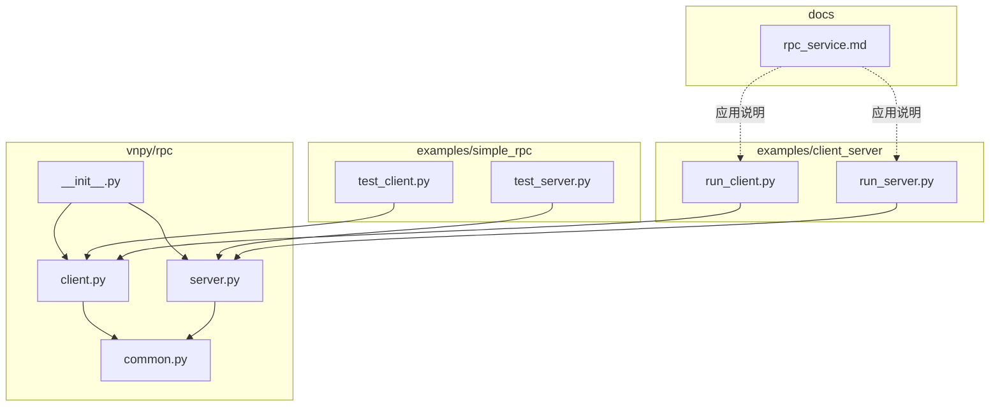
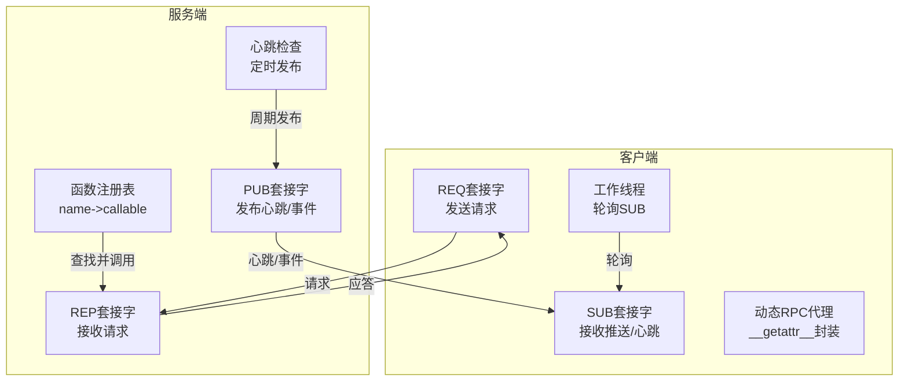
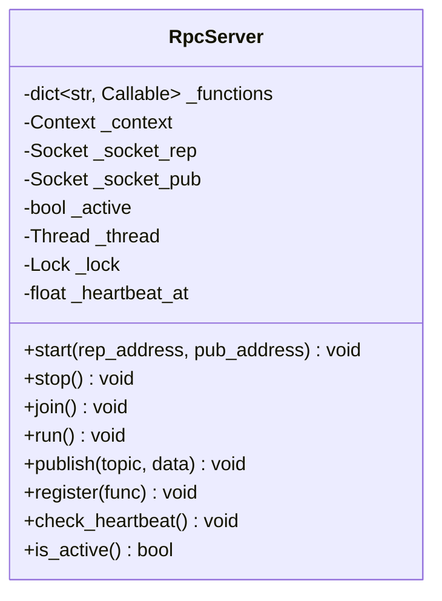
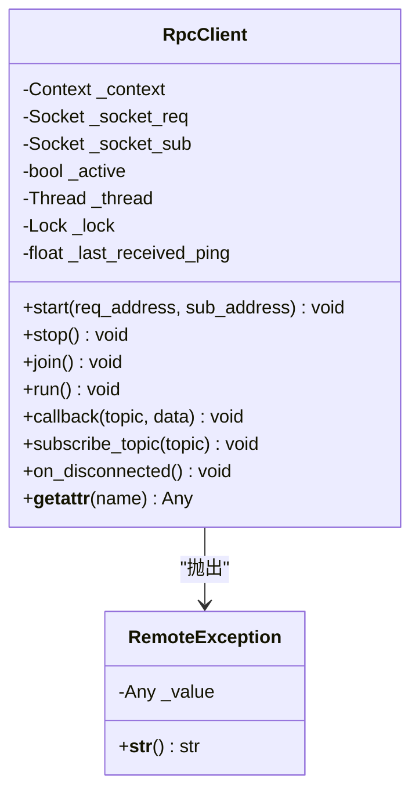
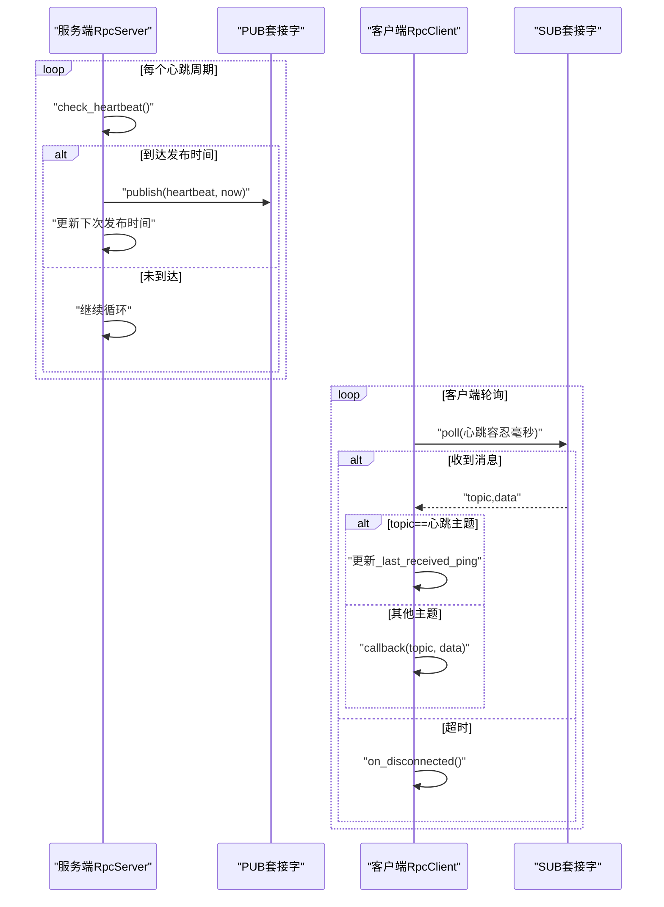
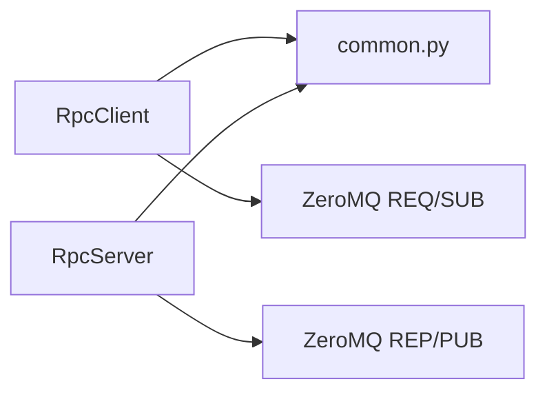

# RPC分布式通信

<cite>
**本文引用的文件**
- [vnpy/rpc/__init__.py](file://vnpy/rpc/__init__.py)
- [vnpy/rpc/client.py](file://vnpy/rpc/client.py)
- [vnpy/rpc/server.py](file://vnpy/rpc/server.py)
- [vnpy/rpc/common.py](file://vnpy/rpc/common.py)
- [examples/simple_rpc/test_server.py](file://examples/simple_rpc/test_server.py)
- [examples/simple_rpc/test_client.py](file://examples/simple_rpc/test_client.py)
- [examples/client_server/run_server.py](file://examples/client_server/run_server.py)
- [examples/client_server/run_client.py](file://examples/client_server/run_client.py)
- [docs/community/app/rpc_service.md](file://docs/community/app/rpc_service.md)
</cite>

## 目录
1. [引言](#引言)
2. [项目结构](#项目结构)
3. [核心组件](#核心组件)
4. [架构总览](#架构总览)
5. [详细组件分析](#详细组件分析)
6. [依赖关系分析](#依赖关系分析)
7. [性能考虑](#性能考虑)
8. [故障排查指南](#故障排查指南)
9. [结论](#结论)
10. [附录](#附录)

## 引言
本文件面向需要构建分布式量化系统的开发者，系统性解析VeighNa RPC分布式通信子系统的设计与实现。文档覆盖服务端启动流程、客户端连接管理、通信协议、心跳机制、错误处理与重连策略，并给出分布式部署最佳实践与性能优化建议。同时提供可直接复用的代码示例路径，帮助在实际项目中快速落地进程间通信。

## 项目结构
RPC子系统位于vnpy/rpc目录，提供基础的客户端与服务端实现；examples/simple_rpc展示了最小可用示例；examples/client_server展示了与vnpy_rpcservice集成的完整用法；rpc_service.md提供了RpcService应用模块的使用说明。

**图表来源**
- [vnpy/rpc/__init__.py](file://vnpy/rpc/__init__.py#L1-L9)
- [vnpy/rpc/client.py](file://vnpy/rpc/client.py#L1-L170)
- [vnpy/rpc/server.py](file://vnpy/rpc/server.py#L1-L141)
- [vnpy/rpc/common.py](file://vnpy/rpc/common.py#L1-L11)
- [examples/simple_rpc/test_server.py](file://examples/simple_rpc/test_server.py#L1-L39)
- [examples/simple_rpc/test_client.py](file://examples/simple_rpc/test_client.py#L1-L35)
- [examples/client_server/run_server.py](file://examples/client_server/run_server.py#L1-L74)
- [examples/client_server/run_client.py](file://examples/client_server/run_client.py#L1-L28)
- [docs/community/app/rpc_service.md](file://docs/community/app/rpc_service.md#L1-L111)

**章节来源**
- [vnpy/rpc/__init__.py](file://vnpy/rpc/__init__.py#L1-L9)
- [vnpy/rpc/client.py](file://vnpy/rpc/client.py#L1-L170)
- [vnpy/rpc/server.py](file://vnpy/rpc/server.py#L1-L141)
- [vnpy/rpc/common.py](file://vnpy/rpc/common.py#L1-L11)
- [examples/simple_rpc/test_server.py](file://examples/simple_rpc/test_server.py#L1-L39)
- [examples/simple_rpc/test_client.py](file://examples/simple_rpc/test_client.py#L1-L35)
- [examples/client_server/run_server.py](file://examples/client_server/run_server.py#L1-L74)
- [examples/client_server/run_client.py](file://examples/client_server/run_client.py#L1-L28)
- [docs/community/app/rpc_service.md](file://docs/community/app/rpc_service.md#L1-L111)

## 核心组件
- RpcServer：基于ZeroMQ REQ/REP与PUB/SUB模式，提供函数注册、请求处理、事件发布与心跳推送。
- RpcClient：基于REQ与SUB，提供动态远程过程调用、订阅主题、心跳检测与断线回调。
- 公共常量：心跳主题、心跳间隔与容忍度。
- 示例与应用：简单示例与与vnpy_rpcservice集成的完整用法。

**章节来源**
- [vnpy/rpc/server.py](file://vnpy/rpc/server.py#L11-L141)
- [vnpy/rpc/client.py](file://vnpy/rpc/client.py#L29-L170)
- [vnpy/rpc/common.py](file://vnpy/rpc/common.py#L8-L11)
- [examples/simple_rpc/test_server.py](file://examples/simple_rpc/test_server.py#L6-L39)
- [examples/simple_rpc/test_client.py](file://examples/simple_rpc/test_client.py#L6-L35)
- [examples/client_server/run_server.py](file://examples/client_server/run_server.py#L37-L74)
- [examples/client_server/run_client.py](file://examples/client_server/run_client.py#L9-L28)

## 架构总览
RPC系统采用“请求-应答”与“发布-订阅”双通道：
- 请求-应答通道：客户端通过REQ发送请求，服务端通过REP接收并执行注册函数，返回结果或异常栈。
- 发布-订阅通道：服务端周期性发布心跳，客户端订阅并维护心跳状态；服务端也可向客户端推送业务事件。

**图表来源**
- [vnpy/rpc/server.py](file://vnpy/rpc/server.py#L14-L141)
- [vnpy/rpc/client.py](file://vnpy/rpc/client.py#L32-L170)
- [vnpy/rpc/common.py](file://vnpy/rpc/common.py#L8-L11)

## 详细组件分析

### 服务端RpcServer
- 组件职责
  - 管理ZeroMQ上下文与套接字（REP/REQ、PUB/SUB）。
  - 注册可远程调用的函数，按名称分发执行。
  - 提供publish接口向客户端推送事件。
  - 周期性检查并发布心跳，维持服务端活跃状态。
- 关键流程
  - 启动：绑定REP与PUB地址，启动工作线程，初始化心跳时间戳。
  - 运行：轮询REP套接字，接收请求后查找注册函数执行，返回结果或异常栈；同时检查并发布心跳。
  - 停止：关闭套接字，等待线程退出。
- 数据结构与复杂度
  - 函数注册表为字典，按名称查找O(1)，平均调用开销主要受序列化与网络延迟影响。
- 错误处理
  - 执行异常捕获并返回异常栈字符串，便于客户端定位问题。
- 性能要点
  - 使用poll控制阻塞等待，避免忙轮询。
  - 发布操作加锁，确保多线程安全。

**图表来源**
- [vnpy/rpc/server.py](file://vnpy/rpc/server.py#L11-L141)

**章节来源**
- [vnpy/rpc/server.py](file://vnpy/rpc/server.py#L14-L141)

### 客户端RpcClient
- 组件职责
  - 管理ZeroMQ上下文与套接字（REQ/SUB）。
  - 通过动态代理实现远程过程调用（RPC），支持超时控制。
  - 订阅主题，处理服务端推送与心跳。
  - 心跳检测：若超过容忍时间未收到心跳，触发断线回调。
  - 生命周期管理：start/connect、stop/join。
- 关键流程
  - 启动：连接REQ与SUB地址，启动工作线程，记录最近心跳时间。
  - 运行：轮询SUB，处理心跳与业务消息；对心跳超时触发断线回调。
  - 动态RPC：__getattr__生成dorpc，发送请求并等待应答，根据返回值抛出异常或返回结果。
- 错误处理
  - 超时：REQ轮询无数据则抛出远程异常。
  - 远程异常：服务端返回失败时，携带异常栈字符串。
  - 断线：心跳超时打印提示信息。
- 性能要点
  - LRU缓存代理方法，减少重复构造。
  - TCP_KEEPALIVE参数提升长连接稳定性。

**图表来源**
- [vnpy/rpc/client.py](file://vnpy/rpc/client.py#L29-L170)

**章节来源**
- [vnpy/rpc/client.py](file://vnpy/rpc/client.py#L32-L170)

### 通信协议与地址
- ZeroMQ地址格式：协议前缀+地址，如tcp://host:port或ipc://path。
- 服务端提供两类地址：
  - 请求-应答：用于客户端发起的同步调用。
  - 广播/推送：用于服务端主动向客户端推送事件与心跳。
- 推荐使用TCP协议，可在本机与网络环境通用；Linux下可选IPC以降低延迟。

**章节来源**
- [docs/community/app/rpc_service.md](file://docs/community/app/rpc_service.md#L44-L74)

### 心跳机制
- 主题与参数：心跳主题、心跳间隔、容忍时间。
- 服务端：周期性检查当前时间是否到达下次心跳发布时间，到达则发布心跳并更新下次发布时间。
- 客户端：轮询订阅消息，若收到心跳则更新最近心跳时间；若超过容忍时间未收到心跳，则触发断线回调。

**图表来源**
- [vnpy/rpc/server.py](file://vnpy/rpc/server.py#L129-L141)
- [vnpy/rpc/client.py](file://vnpy/rpc/client.py#L128-L170)
- [vnpy/rpc/common.py](file://vnpy/rpc/common.py#L8-L11)

**章节来源**
- [vnpy/rpc/server.py](file://vnpy/rpc/server.py#L129-L141)
- [vnpy/rpc/client.py](file://vnpy/rpc/client.py#L128-L170)
- [vnpy/rpc/common.py](file://vnpy/rpc/common.py#L8-L11)

### 错误处理与重连策略
- 超时与异常
  - 客户端RPC调用超时：抛出远程异常，包含超时信息。
  - 服务端执行异常：捕获异常并返回异常栈字符串，客户端收到后同样抛出远程异常。
- 断线与恢复
  - 客户端心跳超时触发断线回调，建议在此处触发重连逻辑（重新连接REQ/SUB、重新订阅主题）。
  - 服务端在停止时关闭套接字，客户端应感知断线并进行重连。
- 最佳实践
  - 在断线回调中实现指数退避重连，避免雪崩式重试。
  - 对关键业务请求增加重试与幂等设计，结合唯一请求ID与去重机制。

**章节来源**
- [vnpy/rpc/client.py](file://vnpy/rpc/client.py#L61-L86)
- [vnpy/rpc/server.py](file://vnpy/rpc/server.py#L102-L110)
- [vnpy/rpc/client.py](file://vnpy/rpc/client.py#L164-L170)

### 分布式部署最佳实践
- 地址规划
  - 请求-应答与广播/推送使用不同端口，便于防火墙与负载均衡配置。
  - 服务端可绑定内网IP或0.0.0.0，客户端通过内网或公网访问，取决于部署拓扑。
- 网络与协议
  - 优先使用TCP协议，跨平台兼容性好；Linux下可评估IPC以降低延迟。
  - 合理设置TCP_KEEPALIVE参数，提升长连接稳定性。
- 可靠性
  - 客户端实现断线检测与自动重连，重连时重新订阅主题。
  - 服务端对异常进行日志记录与告警，避免异常传播导致崩溃。
- 扩展性
  - 多实例部署时，通过负载均衡或服务发现机制分配客户端连接。
  - 将心跳与业务事件分离，避免业务事件阻塞心跳通道。

**章节来源**
- [docs/community/app/rpc_service.md](file://docs/community/app/rpc_service.md#L44-L74)
- [vnpy/rpc/client.py](file://vnpy/rpc/client.py#L43-L47)
- [vnpy/rpc/server.py](file://vnpy/rpc/server.py#L53-L55)

### 性能优化建议
- 事件与RPC分离
  - 将高频心跳与低频业务请求分离至不同主题，避免SUB轮询被大量业务事件阻塞。
- 轮询与超时
  - 服务端对REP轮询设置合理超时，避免长时间阻塞。
  - 客户端对SUB轮询使用心跳容忍时间作为超时阈值，及时触发断线检测。
- 序列化与传输
  - 使用PyObj序列化，保持简洁高效；避免过大对象频繁传输。
- 线程与锁
  - 服务端发布操作加锁，保证多线程安全；尽量缩短临界区。
- 资源清理
  - 正确关闭套接字与退出线程，避免资源泄漏。

**章节来源**
- [vnpy/rpc/server.py](file://vnpy/rpc/server.py#L88-L110)
- [vnpy/rpc/client.py](file://vnpy/rpc/client.py#L132-L147)

### 代码示例与使用指引
- 最小示例（服务端）
  - 继承RpcServer，注册可调用函数，启动并周期性发布业务事件。
  - 示例路径：[examples/simple_rpc/test_server.py](file://examples/simple_rpc/test_server.py#L6-L39)
- 最小示例（客户端）
  - 继承RpcClient，实现回调函数，订阅主题，启动后发起RPC调用。
  - 示例路径：[examples/simple_rpc/test_client.py](file://examples/simple_rpc/test_client.py#L6-L35)
- 与RpcService集成（服务端）
  - 在主引擎中添加RpcServiceApp，连接交易接口后启动RPC服务。
  - 示例路径：[examples/client_server/run_server.py](file://examples/client_server/run_server.py#L37-L74)
- 与RpcService集成（客户端）
  - 在主引擎中添加RpcGateway与策略应用，启动图形界面。
  - 示例路径：[examples/client_server/run_client.py](file://examples/client_server/run_client.py#L9-L28)

**章节来源**
- [examples/simple_rpc/test_server.py](file://examples/simple_rpc/test_server.py#L6-L39)
- [examples/simple_rpc/test_client.py](file://examples/simple_rpc/test_client.py#L6-L35)
- [examples/client_server/run_server.py](file://examples/client_server/run_server.py#L37-L74)
- [examples/client_server/run_client.py](file://examples/client_server/run_client.py#L9-L28)

## 依赖关系分析
- 模块耦合
  - client与server均依赖common中的心跳常量，形成松耦合。
  - client与server各自持有独立的ZeroMQ上下文与套接字，职责清晰。
- 外部依赖
  - ZeroMQ（zmq）：提供REQ/REP与PUB/SUB套接字模型。
  - Python标准库：threading、time、functools.lru_cache、typing等。
- 潜在风险
  - 心跳容忍过短可能导致网络抖动引发误判；需结合实际网络环境调整。
  - 客户端未实现自动重连时，心跳超时仅打印提示，无法自动恢复。

**图表来源**
- [vnpy/rpc/client.py](file://vnpy/rpc/client.py#L1-L10)
- [vnpy/rpc/server.py](file://vnpy/rpc/server.py#L1-L10)
- [vnpy/rpc/common.py](file://vnpy/rpc/common.py#L1-L11)

**章节来源**
- [vnpy/rpc/client.py](file://vnpy/rpc/client.py#L1-L10)
- [vnpy/rpc/server.py](file://vnpy/rpc/server.py#L1-L10)
- [vnpy/rpc/common.py](file://vnpy/rpc/common.py#L1-L11)

## 性能考虑
- I/O模型
  - 使用ZeroMQ的异步I/O模型，避免阻塞主线程。
- 轮询策略
  - 服务端对REP轮询设置超时，客户端对SUB轮询使用心跳容忍时间，平衡实时性与CPU占用。
- 序列化
  - PyObj序列化简洁高效，适合Python生态内的进程间通信。
- 线程与锁
  - 服务端发布加锁，确保并发安全；客户端RPC调用使用锁保护发送与接收，避免竞态。
- 网络参数
  - TCP_KEEPALIVE参数提升长连接稳定性，减少因中间设备回收连接导致的断线。

**章节来源**
- [vnpy/rpc/server.py](file://vnpy/rpc/server.py#L88-L110)
- [vnpy/rpc/client.py](file://vnpy/rpc/client.py#L43-L47)
- [vnpy/rpc/client.py](file://vnpy/rpc/client.py#L69-L86)

## 故障排查指南
- 无法建立连接
  - 检查服务端地址绑定与客户端连接地址是否一致。
  - 确认防火墙与端口放通。
- RPC调用超时
  - 增大客户端调用timeout参数。
  - 检查服务端是否繁忙或存在阻塞操作。
- 心跳丢失
  - 查看客户端断线回调是否触发，确认网络质量与丢包率。
  - 调整心跳容忍时间以适配网络延迟。
- 异常栈返回
  - 服务端捕获异常并返回异常栈，客户端收到后抛出远程异常，便于定位问题。
- 资源泄漏
  - 确保正确调用stop与join，关闭套接字并等待线程退出。

**章节来源**
- [vnpy/rpc/client.py](file://vnpy/rpc/client.py#L61-L86)
- [vnpy/rpc/server.py](file://vnpy/rpc/server.py#L102-L110)
- [vnpy/rpc/client.py](file://vnpy/rpc/client.py#L164-L170)

## 结论
VeighNa RPC子系统以ZeroMQ为基础，提供了简洁可靠的请求-应答与发布-订阅通信模型。通过心跳机制与断线回调，能够有效检测并应对网络异常。配合RpcService应用模块，可实现跨进程、跨网络的分布式量化系统。建议在生产环境中完善自动重连、异常监控与资源清理机制，并结合网络与协议特性进行针对性优化。

## 附录
- 常用术语
  - REQ/REP：请求-应答模式，用于同步RPC调用。
  - PUB/SUB：发布-订阅模式，用于事件与心跳推送。
  - 心跳容忍：客户端容忍的最大无响应时间。
- 参考文档
  - RpcService应用模块使用说明：[docs/community/app/rpc_service.md](file://docs/community/app/rpc_service.md#L1-L111)