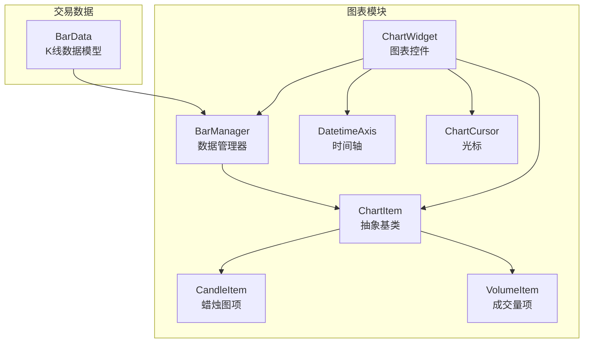
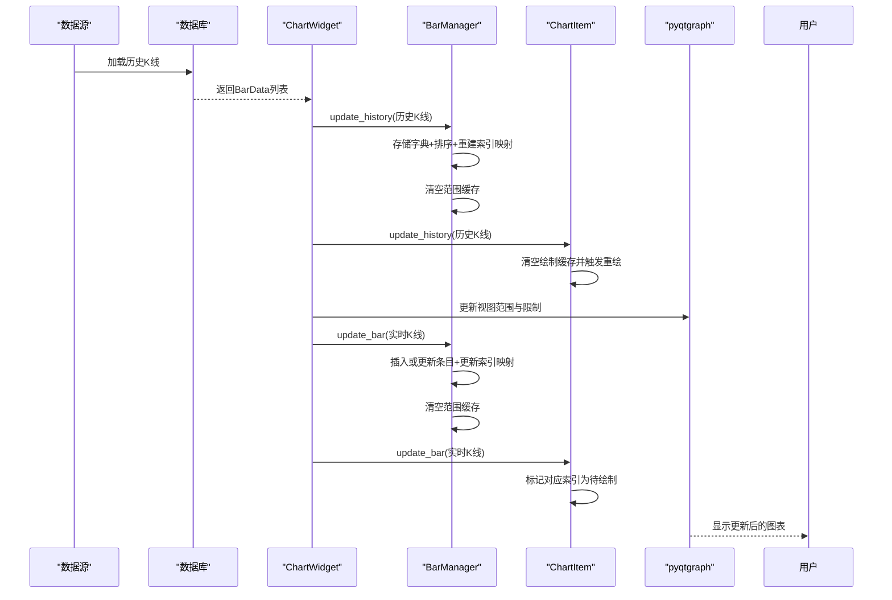
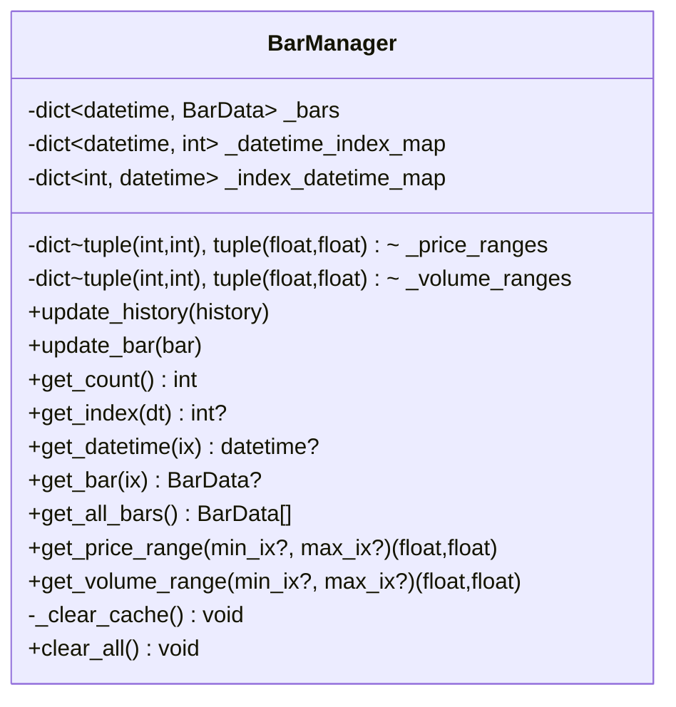
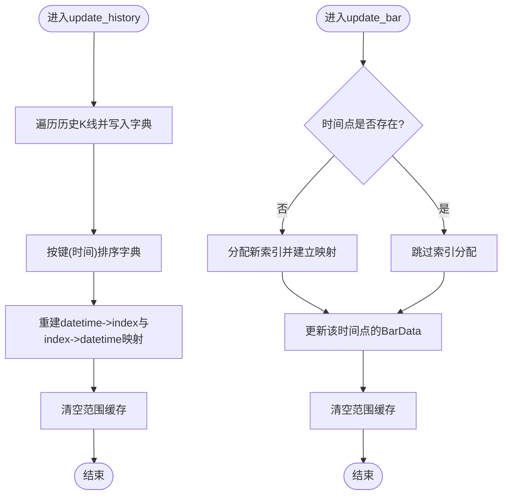
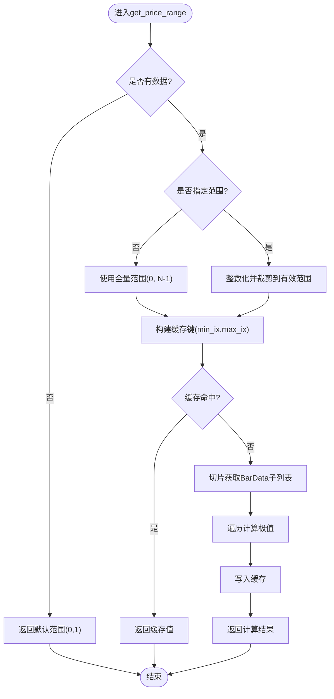
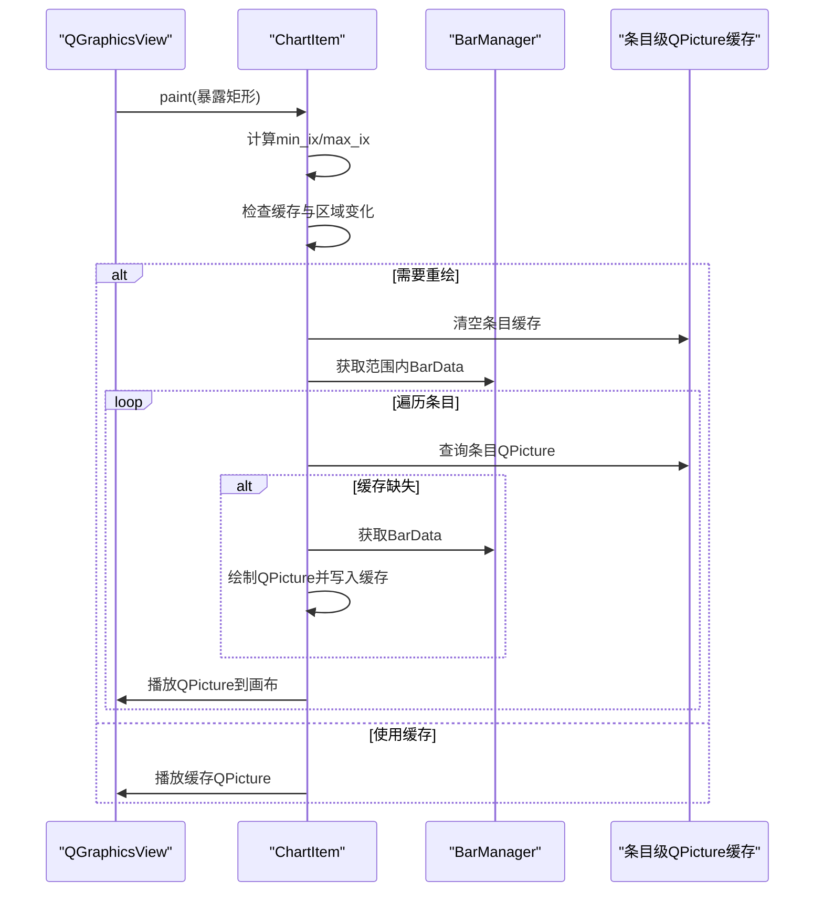
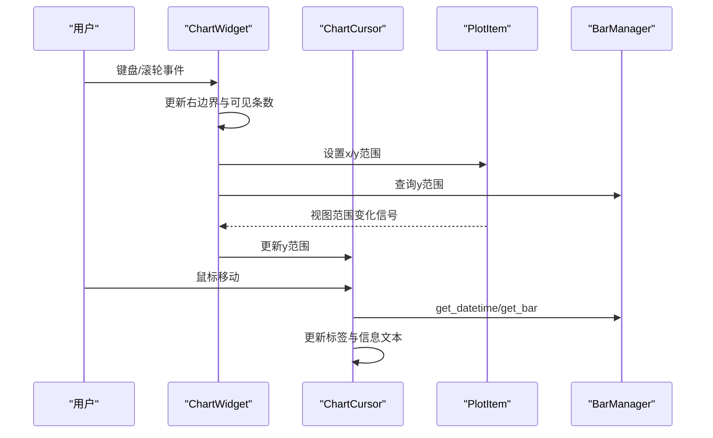
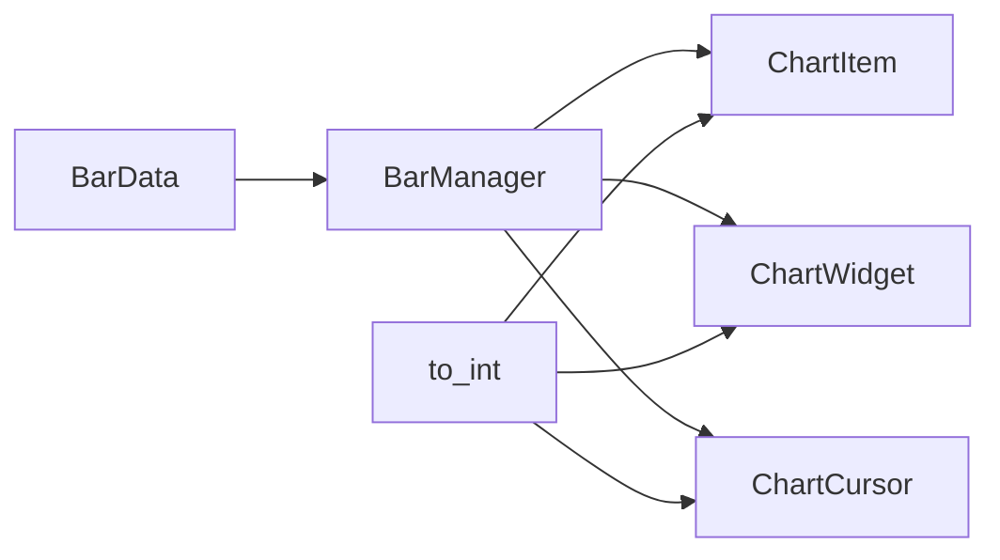

# BarManager数据管理

<cite>
**本文档引用的文件**
- [vnpy/chart/manager.py](file://vnpy/chart/manager.py)
- [vnpy/chart/base.py](file://vnpy/chart/base.py)
- [vnpy/chart/item.py](file://vnpy/chart/item.py)
- [vnpy/chart/widget.py](file://vnpy/chart/widget.py)
- [vnpy/trader/object.py](file://vnpy/trader/object.py)
- [examples/candle_chart/run.py](file://examples/candle_chart/run.py)
</cite>

## 目录
1. [简介](#简介)
2. [项目结构](#项目结构)
3. [核心组件](#核心组件)
4. [架构总览](#架构总览)
5. [详细组件分析](#详细组件分析)
6. [依赖关系分析](#依赖关系分析)
7. [性能考量](#性能考量)
8. [故障排查指南](#故障排查指南)
9. [结论](#结论)
10. [附录](#附录)

## 简介
本文件面向BarManager数据管理组件，系统性阐述其在图表数据管理中的核心作用与设计原理。重点覆盖历史数据的存储、索引与访问机制，数据更新流程（update_history与update_bar），数据边界处理、内存管理与性能优化策略，并给出数据结构设计、索引算法与缓存机制的深入解析，以及最佳实践与常见问题解决方案。

## 项目结构
本节概览与BarManager直接相关的模块组织与职责分工：
- 数据模型：BarData定义了K线条目的字段结构
- 图表管理器：BarManager负责数据存储、索引映射与范围查询缓存
- 图表项：CandleItem/VoluemItem基于BarManager提供的数据进行绘制
- 图表控件：ChartWidget协调数据更新、视图范围与交互
- 基础工具：to_int等辅助函数确保索引计算的稳定性

**图表来源**
- [vnpy/chart/manager.py](file://vnpy/chart/manager.py#L9-L171)
- [vnpy/chart/item.py](file://vnpy/chart/item.py#L12-L334)
- [vnpy/chart/widget.py](file://vnpy/chart/widget.py#L20-L557)
- [vnpy/trader/object.py](file://vnpy/trader/object.py#L87-L108)

**章节来源**
- [vnpy/chart/manager.py](file://vnpy/chart/manager.py#L1-L171)
- [vnpy/chart/item.py](file://vnpy/chart/item.py#L1-L334)
- [vnpy/chart/widget.py](file://vnpy/chart/widget.py#L1-L557)
- [vnpy/trader/object.py](file://vnpy/trader/object.py#L87-L108)

## 核心组件
- BarManager：维护历史K线数据、建立时间到索引的双向映射、缓存价格与成交量范围，提供高效的数据访问与范围查询能力
- ChartItem：抽象图表项基类，负责按需绘制与缓存QPicture，仅重绘可见区域以提升性能
- CandleItem/VolumeItem：具体图表项，基于BarManager提供的数据绘制蜡烛图与成交量柱
- ChartWidget：图表容器，协调数据更新、视图范围与交互事件
- BarData：K线数据结构，包含时间戳、开盘/最高/最低/收盘价与成交量等字段

**章节来源**
- [vnpy/chart/manager.py](file://vnpy/chart/manager.py#L9-L171)
- [vnpy/chart/item.py](file://vnpy/chart/item.py#L12-L334)
- [vnpy/chart/widget.py](file://vnpy/chart/widget.py#L20-L557)
- [vnpy/trader/object.py](file://vnpy/trader/object.py#L87-L108)

## 架构总览
下图展示从数据源到渲染管线的整体流程，以及BarManager在其中的关键位置。

**图表来源**
- [vnpy/chart/widget.py](file://vnpy/chart/widget.py#L155-L181)
- [vnpy/chart/manager.py](file://vnpy/chart/manager.py#L21-L56)
- [vnpy/chart/item.py](file://vnpy/chart/item.py#L74-L98)

**章节来源**
- [vnpy/chart/widget.py](file://vnpy/chart/widget.py#L155-L181)
- [vnpy/chart/manager.py](file://vnpy/chart/manager.py#L21-L56)
- [vnpy/chart/item.py](file://vnpy/chart/item.py#L74-L98)

## 详细组件分析

### BarManager数据结构与索引设计
- 内部存储
  - _bars：以datetime为键的有序字典，保证按时间顺序存储
  - _datetime_index_map：datetime到整数索引的映射，O(1)查找
  - _index_datetime_map：整数索引到datetime的映射，支持反向查询
  - _price_ranges/_volume_ranges：范围查询缓存，键为(min_ix, max_ix)，值为(min, max)
- 关键方法
  - update_history：批量更新历史数据，重建索引映射并清空缓存
  - update_bar：单条更新，若新增时间点则分配新索引
  - get_*系列：提供计数、索引/时间互查、按索引取条目、全量列表
  - get_price_range/get_volume_range：按索引范围计算价格/成交量范围并缓存结果
  - _clear_cache：清空范围缓存
  - clear_all：清空所有数据与映射

**图表来源**
- [vnpy/chart/manager.py](file://vnpy/chart/manager.py#L9-L171)

**章节来源**
- [vnpy/chart/manager.py](file://vnpy/chart/manager.py#L9-L171)

### 数据更新流程：update_history与update_bar
- update_history
  - 将传入的历史K线全部写入字典
  - 对字典按键排序，确保内部顺序一致
  - 重新生成双向索引映射
  - 清空范围缓存，避免脏数据影响后续查询
- update_bar
  - 若该时间点不存在，则为其分配新索引并建立映射
  - 更新该时间点对应的BarData
  - 清空范围缓存

**图表来源**
- [vnpy/chart/manager.py](file://vnpy/chart/manager.py#L21-L56)

**章节来源**
- [vnpy/chart/manager.py](file://vnpy/chart/manager.py#L21-L56)

### 范围查询与缓存机制
- get_price_range/get_volume_range
  - 若未指定范围，默认使用全量数据
  - 将索引转换为整数并限制最大值不超过总数
  - 以(min_ix, max_ix)作为键查询缓存，命中则直接返回
  - 未命中时，截取对应范围的BarData列表，遍历计算极值并写入缓存
- 缓存失效策略
  - 每次update_history/update_bar后清空缓存，确保后续查询的正确性

**图表来源**
- [vnpy/chart/manager.py](file://vnpy/chart/manager.py#L93-L153)

**章节来源**
- [vnpy/chart/manager.py](file://vnpy/chart/manager.py#L93-L153)

### 绘制与缓存：ChartItem的QPicture缓存
- 可见区域重绘优化
  - 仅重绘当前可视范围内的条目，避免全量重绘
  - 使用QPicture缓存每个条目的绘制结果，减少重复绘制开销
- 更新策略
  - update_history：清空条目级缓存并触发重绘
  - update_bar：标记对应索引为待绘制并触发重绘
- 边界处理
  - 在paint中根据暴露矩形计算最小/最大索引，避免越界访问

**图表来源**
- [vnpy/chart/item.py](file://vnpy/chart/item.py#L107-L158)

**章节来源**
- [vnpy/chart/item.py](file://vnpy/chart/item.py#L107-L158)

### 交互与视图联动：ChartWidget与ChartCursor
- 视图控制
  - update_history/update_bar后更新PlotItem的范围限制与可见范围
  - 键盘与滚轮事件控制横向移动与缩放
- 光标联动
  - ChartCursor监听鼠标移动，计算当前索引与Y坐标
  - 同步显示各PlotItem的垂直/水平线与标签
  - 根据当前索引从BarManager获取BarData并格式化信息文本

**图表来源**
- [vnpy/chart/widget.py](file://vnpy/chart/widget.py#L182-L322)
- [vnpy/chart/widget.py](file://vnpy/chart/widget.py#L423-L510)

**章节来源**
- [vnpy/chart/widget.py](file://vnpy/chart/widget.py#L182-L322)
- [vnpy/chart/widget.py](file://vnpy/chart/widget.py#L423-L510)

## 依赖关系分析
- BarManager依赖BarData类型定义
- ChartItem依赖BarManager进行数据访问与范围查询
- ChartWidget依赖BarManager进行数据更新与范围限制设置
- ChartCursor依赖BarManager进行索引与时间转换
- to_int工具函数用于索引整数化，确保索引计算稳定

**图表来源**
- [vnpy/trader/object.py](file://vnpy/trader/object.py#L87-L108)
- [vnpy/chart/manager.py](file://vnpy/chart/manager.py#L9-L171)
- [vnpy/chart/item.py](file://vnpy/chart/item.py#L12-L334)
- [vnpy/chart/widget.py](file://vnpy/chart/widget.py#L20-L557)
- [vnpy/chart/base.py](file://vnpy/chart/base.py#L19-L21)

**章节来源**
- [vnpy/trader/object.py](file://vnpy/trader/object.py#L87-L108)
- [vnpy/chart/base.py](file://vnpy/chart/base.py#L19-L21)

## 性能考量
- 时间复杂度
  - update_history：O(n log n)用于排序，O(n)用于重建映射与缓存清理
  - update_bar：O(1)平均时间插入/更新，O(1)映射更新
  - get_price_range/get_volume_range：首次调用O(k)扫描k个条目，后续缓存命中O(1)
- 空间复杂度
  - O(n)存储所有BarData
  - O(n)索引映射
  - O(m)范围查询缓存，m为不同(min_ix,max_ix)组合数量
- 优化策略
  - 条目级QPicture缓存：仅重绘可见区域，避免全量重绘
  - 范围查询缓存：对同一窗口的极值复用计算结果
  - 整数化索引：统一使用to_int确保索引计算稳定，避免浮点误差
  - 批量更新：update_history一次性重建索引，减少多次小更新带来的开销

[本节提供通用指导，无需特定文件来源]

## 故障排查指南
- 现象：get_price_range/get_volume_range返回异常范围
  - 排查：确认update_history/update_bar后已触发缓存清理；检查索引边界是否越界
  - 处理：在调用范围查询前确保数据已完整更新并完成索引重建
- 现象：图表不刷新或绘制卡顿
  - 排查：检查update_history/update_bar是否正确调用；确认条目级缓存是否被清空
  - 处理：调用update_history时清空条目缓存；update_bar时标记对应索引为待绘制
- 现象：索引越界或None返回
  - 排查：确认传入索引经to_int转换且在有效范围内
  - 处理：在调用get_datetime/get_bar前进行边界检查与整数化
- 现象：光标信息不显示或错误
  - 排查：确认ChartCursor与BarManager的索引同步；检查get_bar返回值
  - 处理：确保update_bar后BarManager已更新映射；在光标移动回调中正确调用get_datetime/get_bar

**章节来源**
- [vnpy/chart/manager.py](file://vnpy/chart/manager.py#L63-L85)
- [vnpy/chart/item.py](file://vnpy/chart/item.py#L107-L158)
- [vnpy/chart/widget.py](file://vnpy/chart/widget.py#L423-L510)

## 结论
BarManager通过紧凑的数据结构与高效的索引映射，为图表渲染提供了稳定可靠的数据基础。配合ChartItem的条目级缓存与ChartWidget的视图联动，实现了高性能的可视化体验。合理使用范围查询缓存与批量更新接口，可在大数据量场景下保持流畅的交互性能。

[本节为总结性内容，无需特定文件来源]

## 附录

### 最佳实践
- 批量加载：优先使用update_history一次性加载历史数据，随后再逐条推送实时数据
- 实时更新：使用update_bar推送最新K线，确保索引映射与缓存及时更新
- 范围查询：在需要频繁查询的场景下，尽量复用同一窗口范围的查询结果
- 内存管理：在切换品种或周期时，调用clear_all释放内存并重建索引映射
- 索引安全：始终使用to_int进行索引转换，避免浮点误差导致的越界

### 常见问题与解决方案
- 问：为什么get_price_range在第一次调用后很快？
  - 答：范围查询缓存命中，后续调用O(1)返回
- 问：如何避免全量重绘导致的卡顿？
  - 答：依赖ChartItem的可见区域重绘与条目级QPicture缓存
- 问：如何处理时间戳不连续的历史数据？
  - 答：update_history会按时间排序，确保内部顺序一致；如需严格索引连续，可自行补齐缺失时间点

**章节来源**
- [vnpy/chart/manager.py](file://vnpy/chart/manager.py#L93-L153)
- [vnpy/chart/item.py](file://vnpy/chart/item.py#L107-L158)
- [vnpy/chart/widget.py](file://vnpy/chart/widget.py#L155-L181)