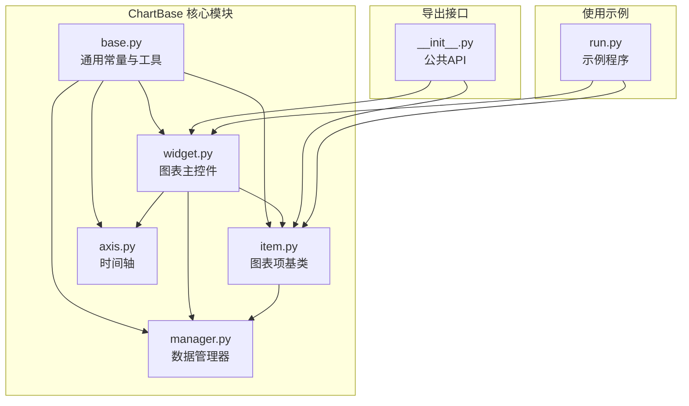
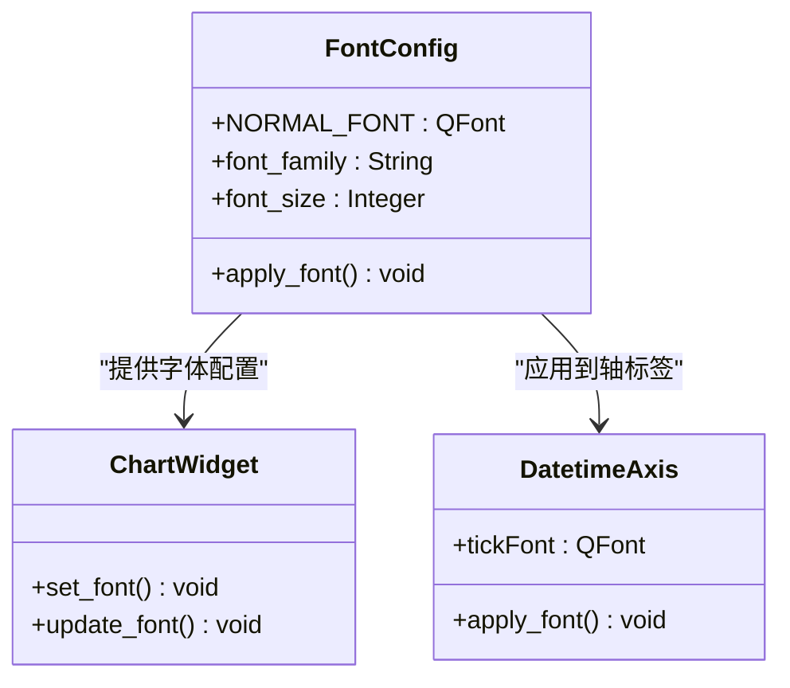
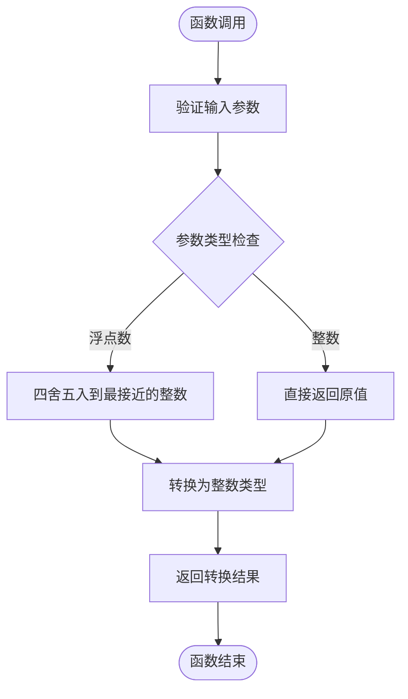
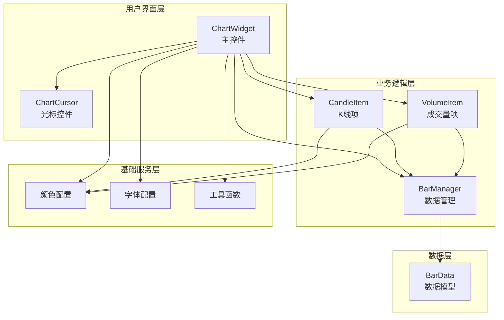
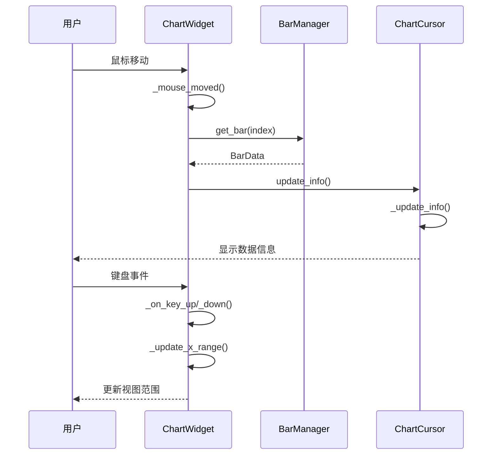
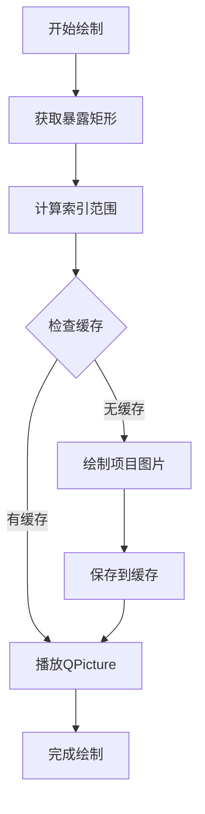
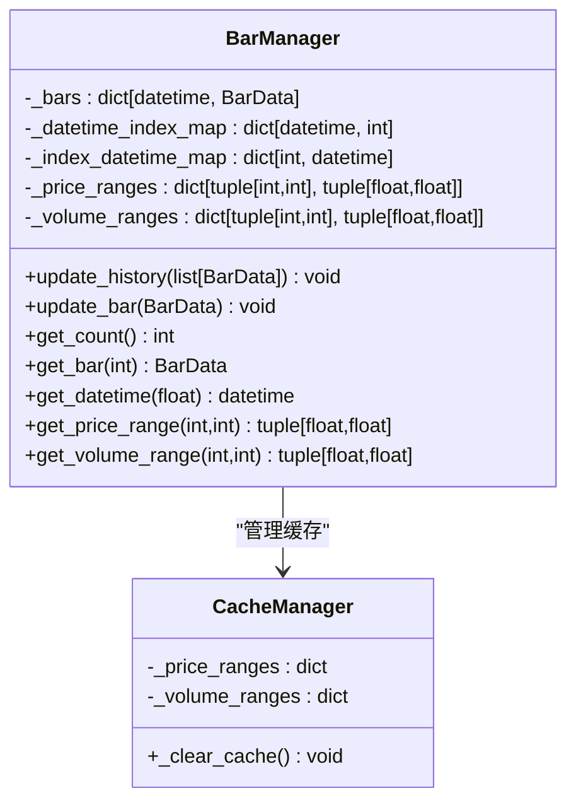
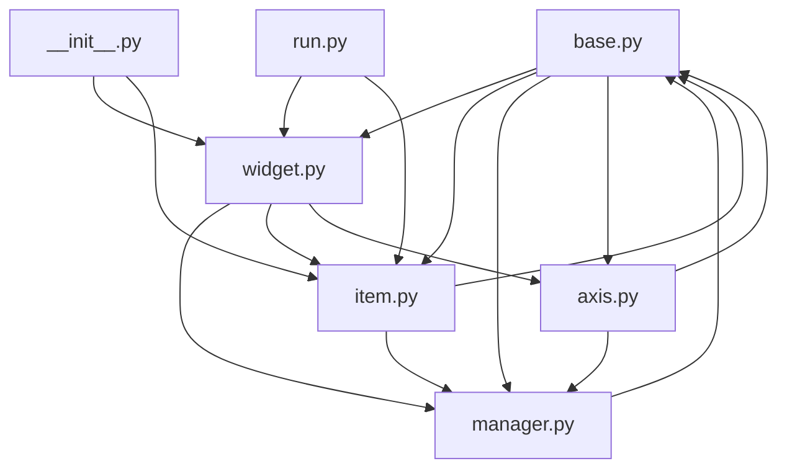
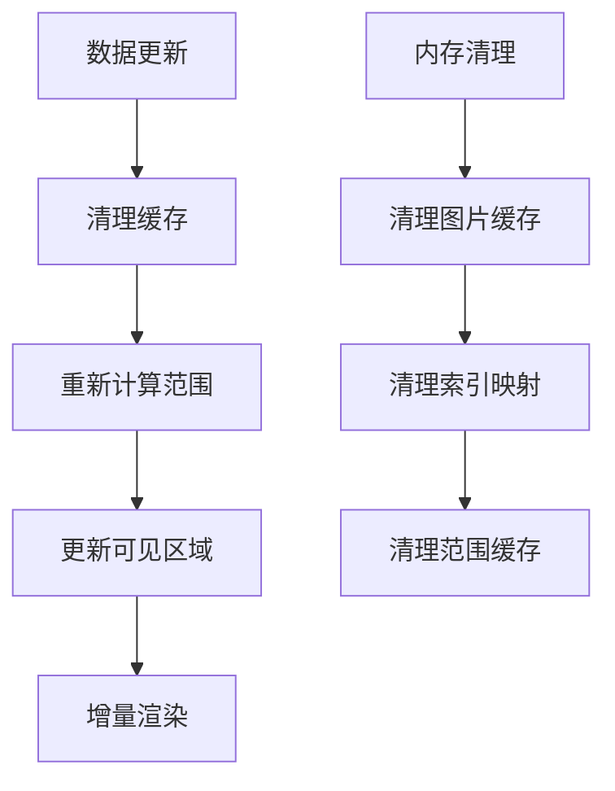

# ChartBase基础组件

<cite>
**本文档引用的文件**
- [vnpy/chart/base.py](file://vnpy/chart/base.py)
- [vnpy/chart/__init__.py](file://vnpy/chart/__init__.py)
- [vnpy/chart/widget.py](file://vnpy/chart/widget.py)
- [vnpy/chart/manager.py](file://vnpy/chart/manager.py)
- [vnpy/chart/item.py](file://vnpy/chart/item.py)
- [vnpy/chart/axis.py](file://vnpy/chart/axis.py)
- [examples/candle_chart/run.py](file://examples/candle_chart/run.py)
</cite>

## 目录
1. [简介](#简介)
2. [项目结构](#项目结构)
3. [核心组件](#核心组件)
4. [架构概览](#架构概览)
5. [详细组件分析](#详细组件分析)
6. [依赖关系分析](#依赖关系分析)
7. [性能考虑](#性能考虑)
8. [故障排除指南](#故障排除指南)
9. [结论](#结论)

## 简介

ChartBase是vnpy量化交易框架中的基础图表组件库，提供了构建高性能、可定制的金融图表界面的核心功能。该组件库基于PyQtGraph开发，专注于K线图、成交量图等金融数据可视化场景，具有以下特点：

- **统一的颜色配置系统**：定义了标准的颜色常量，确保视觉一致性
- **高效的渲染机制**：通过图片缓存和增量更新优化性能
- **灵活的扩展性**：支持自定义图表项和主题定制
- **完整的交互功能**：提供鼠标、键盘、滚轮等多种交互方式

## 项目结构

ChartBase基础组件采用模块化设计，主要包含以下核心文件：

**图表来源**
- [vnpy/chart/base.py](file://vnpy/chart/base.py#L1-L22)
- [vnpy/chart/widget.py](file://vnpy/chart/widget.py#L1-L557)
- [vnpy/chart/manager.py](file://vnpy/chart/manager.py#L1-L171)
- [vnpy/chart/item.py](file://vnpy/chart/item.py#L1-L334)
- [vnpy/chart/axis.py](file://vnpy/chart/axis.py#L1-L45)

**章节来源**
- [vnpy/chart/__init__.py](file://vnpy/chart/__init__.py#L1-L10)
- [vnpy/chart/base.py](file://vnpy/chart/base.py#L1-L22)

## 核心组件

### 颜色配置系统

ChartBase定义了一套完整的颜色配置体系，用于确保图表的视觉一致性和可读性：

| 颜色常量 | RGB值 | 用途 | 视觉效果 |
|---------|-------|------|----------|
| WHITE_COLOR | (255, 255, 255) | 背景、标签文字 | 高对比度白色 |
| BLACK_COLOR | (0, 0, 0) | 基础文本、边框 | 深色背景 |
| GREY_COLOR | (100, 100, 100) | 边框、次要元素 | 中性灰色 |
| UP_COLOR | (255, 75, 75) | 上涨K线、看涨指标 | 红色警示 |
| DOWN_COLOR | (0, 255, 255) | 下跌K线、看跌指标 | 青色对比 |
| CURSOR_COLOR | (255, 245, 162) | 光标、提示框背景 | 明亮黄色 |

### 字体配置

**图表来源**
- [vnpy/chart/base.py](file://vnpy/chart/base.py#L16-L16)
- [vnpy/chart/axis.py](file://vnpy/chart/axis.py#L19-L20)

### 工具函数

#### 数值转换函数 `to_int`

`to_int`函数是ChartBase的核心工具函数，专门处理浮点数到整数的转换：

**图表来源**
- [vnpy/chart/base.py](file://vnpy/chart/base.py#L19-L21)
- [vnpy/chart/manager.py](file://vnpy/chart/manager.py#L73-L73)

**章节来源**
- [vnpy/chart/base.py](file://vnpy/chart/base.py#L19-L21)
- [vnpy/chart/manager.py](file://vnpy/chart/manager.py#L72-L85)

## 架构概览

ChartBase采用分层架构设计，各层职责明确，耦合度低：

**图表来源**
- [vnpy/chart/widget.py](file://vnpy/chart/widget.py#L20-L557)
- [vnpy/chart/manager.py](file://vnpy/chart/manager.py#L9-L171)
- [vnpy/chart/item.py](file://vnpy/chart/item.py#L12-L334)

## 详细组件分析

### ChartWidget 主控件

ChartWidget是ChartBase的核心组件，负责管理整个图表界面：

#### 主要功能特性

1. **多图层管理**：支持多个独立的图表区域
2. **数据绑定**：与BarManager建立数据连接
3. **交互控制**：处理鼠标、键盘、滚轮事件
4. **布局管理**：自动调整图表布局和尺寸

#### 关键属性说明

| 属性名称 | 类型 | 默认值 | 描述 |
|---------|------|--------|------|
| MIN_BAR_COUNT | int | 100 | 最小显示条目数 |
| _manager | BarManager | None | 数据管理器实例 |
| _plots | dict | {} | 图表区域字典 |
| _items | dict | {} | 图表项字典 |
| _cursor | ChartCursor | None | 光标控件实例 |

#### 交互流程

**图表来源**
- [vnpy/chart/widget.py](file://vnpy/chart/widget.py#L237-L322)
- [vnpy/chart/widget.py](file://vnpy/chart/widget.py#L423-L447)

**章节来源**
- [vnpy/chart/widget.py](file://vnpy/chart/widget.py#L20-L322)

### ChartItem 图表项基类

ChartItem是所有图表项的抽象基类，提供了统一的渲染框架：

#### 绘制机制

**图表来源**
- [vnpy/chart/item.py](file://vnpy/chart/item.py#L107-L157)

#### 颜色配置应用

图表项通过以下方式应用颜色配置：

1. **K线颜色**：根据涨跌状态选择UP_COLOR或DOWN_COLOR
2. **成交量颜色**：与K线颜色保持一致
3. **背景颜色**：使用BLACK_COLOR作为默认背景
4. **边框颜色**：使用GREY_COLOR确保清晰边界

**章节来源**
- [vnpy/chart/item.py](file://vnpy/chart/item.py#L12-L166)

### BarManager 数据管理器

BarManager负责管理历史数据和实时数据流：

#### 数据结构设计

**图表来源**
- [vnpy/chart/manager.py](file://vnpy/chart/manager.py#L9-L171)

#### 性能优化策略

1. **索引映射**：建立双向索引映射，O(1)时间复杂度访问
2. **范围缓存**：缓存价格和成交量范围，避免重复计算
3. **增量更新**：只更新变化的数据，减少重绘开销

**章节来源**
- [vnpy/chart/manager.py](file://vnpy/chart/manager.py#L9-L171)

### DatetimeAxis 时间轴

DatetimeAxis继承自PyQtGraph的AxisItem，专门处理时间刻度显示：

#### 时间格式化规则

| 时间间隔 | 显示格式 | 使用场景 |
|---------|---------|----------|
| 包含小时 | "%Y-%m-%d\n%H:%M:%S" | 分钟级图表 |
| 仅日期 | "%Y-%m-%d" | 日线及以上图表 |
| 无刻度 | "" | 刻度间距过小 |

**章节来源**
- [vnpy/chart/axis.py](file://vnpy/chart/axis.py#L22-L44)

## 依赖关系分析

ChartBase组件间的依赖关系清晰明确，遵循单一职责原则：

**图表来源**
- [vnpy/chart/base.py](file://vnpy/chart/base.py#L1-L22)
- [vnpy/chart/widget.py](file://vnpy/chart/widget.py#L8-L14)
- [vnpy/chart/item.py](file://vnpy/chart/item.py#L8-L9)
- [vnpy/chart/manager.py](file://vnpy/chart/manager.py#L6-L6)

### 外部依赖

ChartBase主要依赖以下外部库：

| 依赖库 | 版本要求 | 用途 |
|-------|---------|------|
| PyQtGraph | >= 0.12.0 | 图形渲染引擎 |
| Qt | >= 5.15.0 | GUI框架 |
| Python | >= 3.8 | 运行环境 |

**章节来源**
- [vnpy/chart/widget.py](file://vnpy/chart/widget.py#L3-L5)
- [vnpy/chart/item.py](file://vnpy/chart/item.py#L3-L3)

## 性能考虑

### 渲染优化

ChartBase采用了多种性能优化策略：

1. **增量绘制**：只重绘可见区域内的数据
2. **图片缓存**：将绘制结果缓存为QPicture对象
3. **范围限制**：动态计算可视范围，避免全量重绘

### 内存管理

**图表来源**
- [vnpy/chart/manager.py](file://vnpy/chart/manager.py#L155-L171)
- [vnpy/chart/item.py](file://vnpy/chart/item.py#L159-L165)

## 故障排除指南

### 常见问题及解决方案

#### 颜色显示异常

**问题描述**：图表颜色显示不正确或与预期不符

**可能原因**：
1. 颜色配置被意外修改
2. Qt版本兼容性问题
3. 显示器色彩设置影响

**解决步骤**：
1. 检查颜色常量定义是否正确
2. 验证Qt版本兼容性
3. 调整显示器色彩设置

#### 性能问题

**问题描述**：图表响应缓慢或卡顿

**可能原因**：
1. 数据量过大导致渲染压力
2. 缓存机制失效
3. 频繁的全量重绘

**优化建议**：
1. 启用增量更新机制
2. 合理设置MIN_BAR_COUNT
3. 定期清理缓存数据

#### 交互功能异常

**问题描述**：鼠标、键盘操作无响应

**排查步骤**：
1. 检查事件绑定是否正常
2. 验证坐标转换逻辑
3. 确认视图范围设置

**章节来源**
- [vnpy/chart/widget.py](file://vnpy/chart/widget.py#L237-L322)
- [vnpy/chart/manager.py](file://vnpy/chart/manager.py#L155-L171)

## 结论

ChartBase基础组件为vnpy提供了强大而灵活的图表可视化能力。其设计特点包括：

1. **标准化配置**：统一的颜色和字体配置确保视觉一致性
2. **高效渲染**：通过缓存和增量更新优化性能
3. **模块化设计**：清晰的层次结构便于扩展和维护
4. **完整功能**：涵盖数据管理、渲染、交互等各个方面

对于开发者而言，ChartBase不仅是一个现成的图表组件库，更是一个优秀的架构范例，展示了如何在Python环境中构建高性能的图形界面应用。通过理解和掌握这些设计模式，开发者可以更好地进行二次开发和功能扩展。