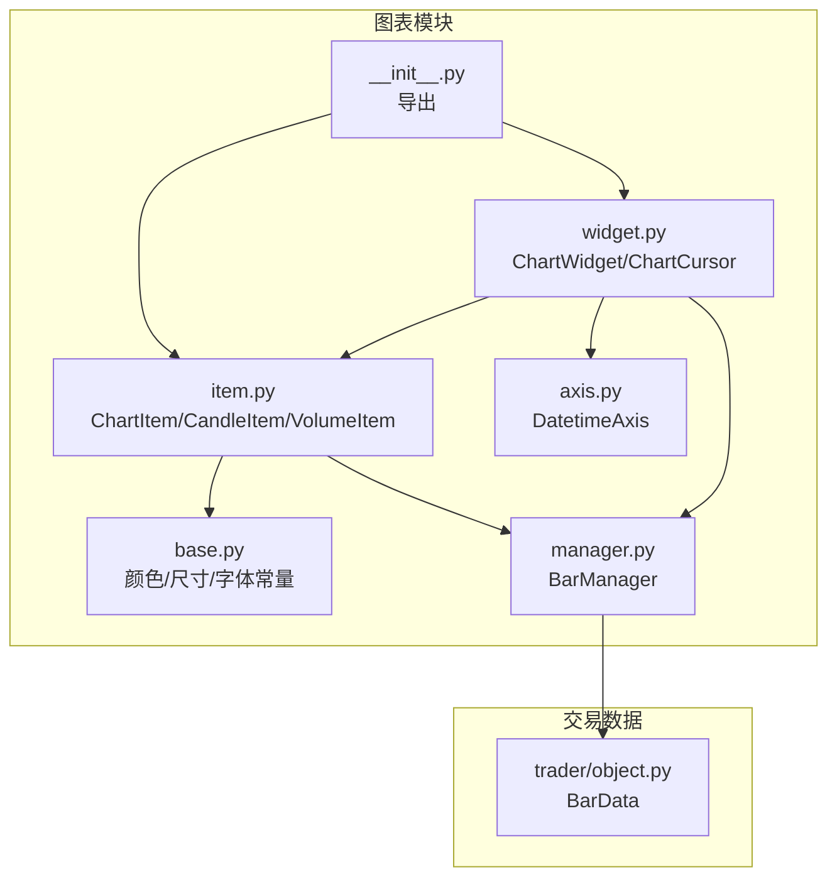
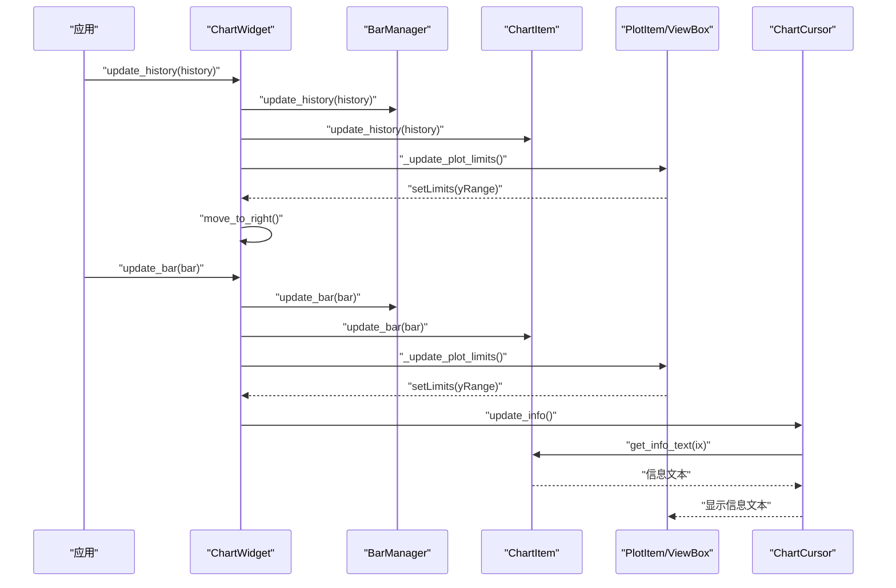
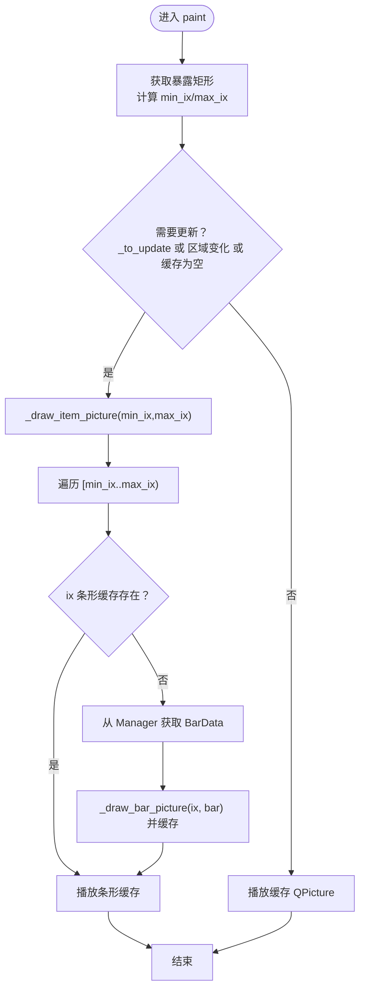
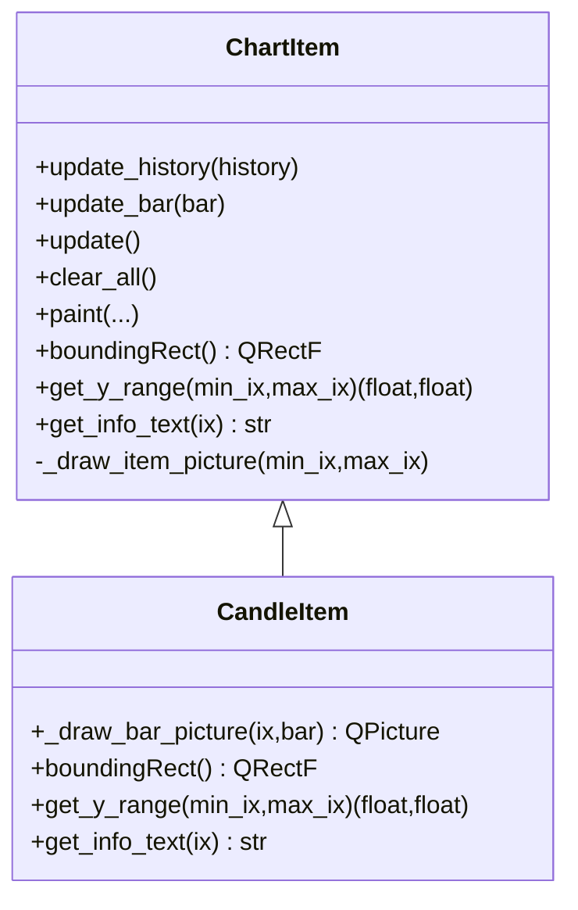
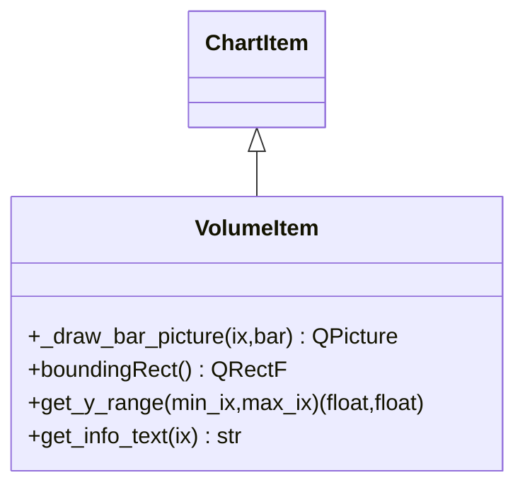
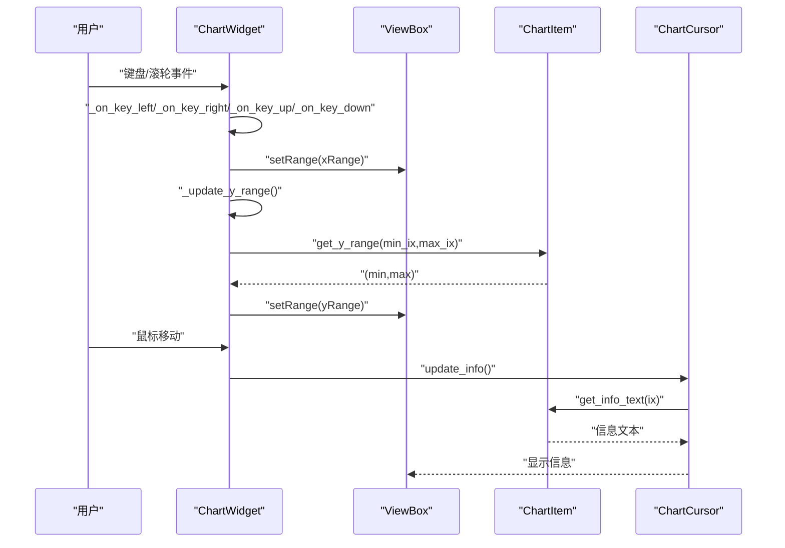
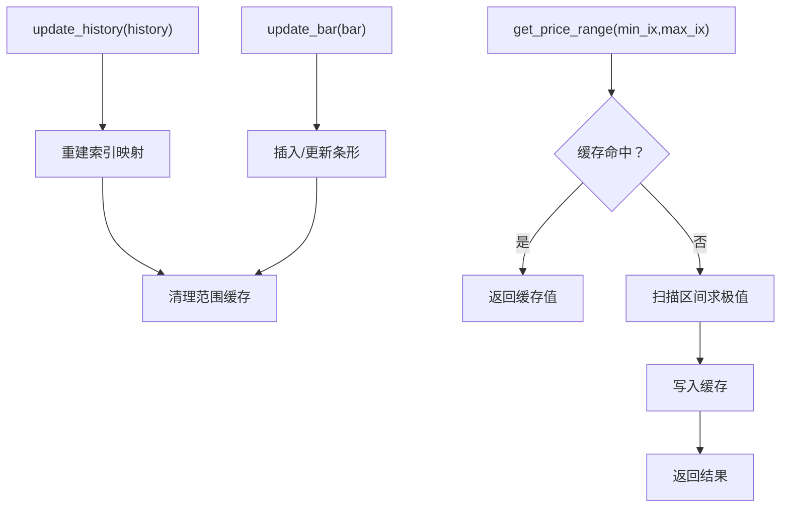
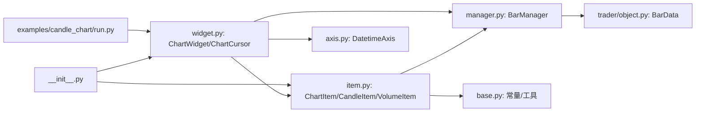

# ChartItem图表项

<cite>
**本文引用的文件列表**
- [vnpy/chart/base.py](file://vnpy/chart/base.py)
- [vnpy/chart/item.py](file://vnpy/chart/item.py)
- [vnpy/chart/widget.py](file://vnpy/chart/widget.py)
- [vnpy/chart/manager.py](file://vnpy/chart/manager.py)
- [vnpy/chart/axis.py](file://vnpy/chart/axis.py)
- [vnpy/chart/__init__.py](file://vnpy/chart/__init__.py)
- [vnpy/trader/object.py](file://vnpy/trader/object.py)
- [examples/candle_chart/run.py](file://examples/candle_chart/run.py)
</cite>

## 目录
1. [简介](#简介)
2. [项目结构](#项目结构)
3. [核心组件](#核心组件)
4. [架构总览](#架构总览)
5. [详细组件分析](#详细组件分析)
6. [依赖关系分析](#依赖关系分析)
7. [性能考量](#性能考量)
8. [故障排查指南](#故障排查指南)
9. [结论](#结论)
10. [附录：自定义图表项开发指南](#附录自定义图表项开发指南)

## 简介
本文件围绕ChartItem图表项组件，系统性地阐述其设计理念、继承体系、生命周期管理、渲染机制与样式定制，并给出get_y_range方法的实现原理与自定义图表项的开发指南。同时覆盖K线、成交量、技术指标等不同图表项的实现差异与最佳实践，帮助开发者在VeighNa的图表系统中高效扩展与定制。

## 项目结构
图表模块位于vnpy/chart目录下，主要由以下文件构成：
- 基础常量与工具：base.py
- 图表项基类与内置项：item.py（ChartItem、CandleItem、VolumeItem）
- 图表容器与交互：widget.py（ChartWidget、ChartCursor）
- 数据管理：manager.py（BarManager）
- 时间轴：axis.py（DatetimeAxis）
- 导出入口：__init__.py
- 示例：examples/candle_chart/run.py

**图示来源**
- [vnpy/chart/base.py](file://vnpy/chart/base.py#L1-L22)
- [vnpy/chart/item.py](file://vnpy/chart/item.py#L1-L334)
- [vnpy/chart/widget.py](file://vnpy/chart/widget.py#L1-L557)
- [vnpy/chart/manager.py](file://vnpy/chart/manager.py#L1-L171)
- [vnpy/chart/axis.py](file://vnpy/chart/axis.py#L1-L45)
- [vnpy/chart/__init__.py](file://vnpy/chart/__init__.py#L1-L10)
- [vnpy/trader/object.py](file://vnpy/trader/object.py#L87-L109)

**章节来源**
- [vnpy/chart/base.py](file://vnpy/chart/base.py#L1-L22)
- [vnpy/chart/item.py](file://vnpy/chart/item.py#L1-L334)
- [vnpy/chart/widget.py](file://vnpy/chart/widget.py#L1-L557)
- [vnpy/chart/manager.py](file://vnpy/chart/manager.py#L1-L171)
- [vnpy/chart/axis.py](file://vnpy/chart/axis.py#L1-L45)
- [vnpy/chart/__init__.py](file://vnpy/chart/__init__.py#L1-L10)
- [vnpy/trader/object.py](file://vnpy/trader/object.py#L87-L109)

## 核心组件
- ChartItem：抽象基类，定义所有图表项必须实现的方法与通用渲染流程，支持按需缓存绘制结果以提升性能。
- CandleItem：K线实现，根据开盘/收盘价格决定涨跌颜色，绘制影线与实体。
- VolumeItem：成交量实现，按涨跌采用不同颜色绘制矩形柱体。
- ChartWidget：图表容器，负责布局、视图联动、滚动缩放、游标显示与数据更新。
- BarManager：数据管理器，维护BarData索引、缓存价格/成交量范围并提供查询接口。
- DatetimeAxis：时间轴，将索引转换为日期时间字符串。
- ChartCursor：鼠标/键盘交互游标，显示垂直/水平线、坐标标签与各图表项信息文本。

**章节来源**
- [vnpy/chart/item.py](file://vnpy/chart/item.py#L12-L166)
- [vnpy/chart/item.py](file://vnpy/chart/item.py#L168-L334)
- [vnpy/chart/widget.py](file://vnpy/chart/widget.py#L20-L322)
- [vnpy/chart/manager.py](file://vnpy/chart/manager.py#L9-L171)
- [vnpy/chart/axis.py](file://vnpy/chart/axis.py#L10-L45)
- [vnpy/chart/widget.py](file://vnpy/chart/widget.py#L324-L557)

## 架构总览
ChartWidget通过PlotItem组织多个图表区域，每个区域可挂载一个或多个ChartItem。BarManager统一管理历史数据与索引映射，ChartItem基于QPicture缓存绘制结果，仅重绘可见区域，从而实现高性能渲染。ChartCursor响应用户输入，实时更新各图表项的信息文本。

**图示来源**
- [vnpy/chart/widget.py](file://vnpy/chart/widget.py#L155-L181)
- [vnpy/chart/widget.py](file://vnpy/chart/widget.py#L182-L223)
- [vnpy/chart/widget.py](file://vnpy/chart/widget.py#L324-L557)
- [vnpy/chart/item.py](file://vnpy/chart/item.py#L67-L72)

## 详细组件分析

### ChartItem抽象基类与生命周期
- 初始化：构造函数接收BarManager，准备画笔/画刷、缓存字典、更新标记位，并启用“仅重绘可见区域”的优化标志。
- 生命周期管理：
  - update_history：清空条形缓存，触发全量重绘。
  - update_bar：根据BarData的时间戳定位索引，标记该条形需要重新绘制，触发局部重绘。
  - update：若已加入场景，则设置更新标记并请求场景刷新。
  - clear_all：清空缓存并重绘。
- 渲染流程：
  - paint：计算可见区间，若需要更新则调用_draw_item_picture生成整体QPicture，再播放到绘制器。
  - _draw_item_picture：遍历可见区间，对未缓存的条形调用子类的_draw_bar_picture绘制并缓存；最后播放缓存的QPicture。
- 抽象方法（子类必须实现）：
  - _draw_bar_picture：绘制单个条形的QPicture。
  - boundingRect：返回包围盒。
  - get_y_range：返回给定X范围内的Y轴范围。
  - get_info_text：返回游标悬停时的文本信息。

**图示来源**
- [vnpy/chart/item.py](file://vnpy/chart/item.py#L107-L157)

**章节来源**
- [vnpy/chart/item.py](file://vnpy/chart/item.py#L12-L166)

### CandleItem（K线）
- 绘制逻辑：根据收盘价与开盘价决定涨跌颜色，绘制影线与实体；当开盘/收盘相等时以水平线表示。
- 包围盒：使用BarManager的价格范围。
- Y轴范围：委托BarManager的get_price_range。
- 信息文本：展示日期、时间、开盘、最高、最低、收盘等字段。

**图示来源**
- [vnpy/chart/item.py](file://vnpy/chart/item.py#L168-L266)

**章节来源**
- [vnpy/chart/item.py](file://vnpy/chart/item.py#L168-L266)

### VolumeItem（成交量）
- 绘制逻辑：按涨跌采用不同颜色绘制矩形柱体，底部对齐零轴。
- 包围盒：使用BarManager的成交量范围。
- Y轴范围：委托BarManager的get_volume_range。
- 信息文本：展示成交量数值。

**图示来源**
- [vnpy/chart/item.py](file://vnpy/chart/item.py#L268-L334)

**章节来源**
- [vnpy/chart/item.py](file://vnpy/chart/item.py#L268-L334)

### ChartWidget（图表容器）
- Plot区域管理：add_plot创建PlotItem，设置右轴、隐藏左轴、启用下采样、链接X轴。
- 图表项挂载：add_item实例化具体ChartItem并添加到指定PlotItem。
- 数据更新：update_history与update_bar同步BarManager与各ChartItem，并更新视图限制。
- 视图联动：_update_y_range根据当前X范围计算各PlotItem的Y范围；_update_plot_limits设置整体Y范围。
- 交互：键盘事件与滚轮事件控制左右移动与缩放；鼠标移动事件驱动ChartCursor更新。

**图示来源**
- [vnpy/chart/widget.py](file://vnpy/chart/widget.py#L182-L223)
- [vnpy/chart/widget.py](file://vnpy/chart/widget.py#L224-L322)
- [vnpy/chart/widget.py](file://vnpy/chart/widget.py#L324-L557)

**章节来源**
- [vnpy/chart/widget.py](file://vnpy/chart/widget.py#L20-L322)
- [vnpy/chart/widget.py](file://vnpy/chart/widget.py#L324-L557)

### BarManager（数据管理）
- 数据结构：以datetime为键存储BarData，维护datetime↔index双向映射。
- 范围缓存：缓存指定索引区间的最小/最大价格与成交量，避免重复计算。
- 查询接口：get_bar/get_datetime/get_index、get_all_bars、get_price_range、get_volume_range。
- 更新策略：update_history重建索引与缓存；update_bar增量更新并清理缓存。

**图示来源**
- [vnpy/chart/manager.py](file://vnpy/chart/manager.py#L21-L171)

**章节来源**
- [vnpy/chart/manager.py](file://vnpy/chart/manager.py#L9-L171)

### DatetimeAxis（时间轴）
- 将索引转换为日期时间字符串，按刻度间距控制显示密度；有小时信息时显示完整时间。

**章节来源**
- [vnpy/chart/axis.py](file://vnpy/chart/axis.py#L10-L45)

### ChartCursor（游标）
- 线条与标签：为每个PlotItem创建垂直/水平线与右侧Y轴标签，以及顶部信息框。
- 鼠标移动：定位当前X/Y，切换对应PlotItem的水平线显示，更新标签与信息框。
- 键盘移动：左右移动时自动更新Y为对应BarData的收盘价并刷新显示。

**章节来源**
- [vnpy/chart/widget.py](file://vnpy/chart/widget.py#L324-L557)

## 依赖关系分析
- ChartItem依赖BarManager进行数据访问与范围查询，依赖base.py中的颜色/尺寸常量。
- ChartWidget依赖item.py中的ChartItem子类、manager.py中的BarManager、axis.py中的DatetimeAxis。
- BarManager依赖trader/object.py中的BarData。
- 示例程序examples/candle_chart/run.py演示了ChartWidget的典型用法。

**图示来源**
- [vnpy/chart/item.py](file://vnpy/chart/item.py#L1-L334)
- [vnpy/chart/widget.py](file://vnpy/chart/widget.py#L1-L557)
- [vnpy/chart/manager.py](file://vnpy/chart/manager.py#L1-L171)
- [vnpy/chart/axis.py](file://vnpy/chart/axis.py#L1-L45)
- [vnpy/chart/__init__.py](file://vnpy/chart/__init__.py#L1-L10)
- [vnpy/trader/object.py](file://vnpy/trader/object.py#L87-L109)
- [examples/candle_chart/run.py](file://examples/candle_chart/run.py#L1-L44)

**章节来源**
- [vnpy/chart/item.py](file://vnpy/chart/item.py#L1-L334)
- [vnpy/chart/widget.py](file://vnpy/chart/widget.py#L1-L557)
- [vnpy/chart/manager.py](file://vnpy/chart/manager.py#L1-L171)
- [vnpy/chart/axis.py](file://vnpy/chart/axis.py#L1-L45)
- [vnpy/chart/__init__.py](file://vnpy/chart/__init__.py#L1-L10)
- [vnpy/trader/object.py](file://vnpy/trader/object.py#L87-L109)
- [examples/candle_chart/run.py](file://examples/candle_chart/run.py#L1-L44)

## 性能考量
- 可见区域优先：通过ItemUsesExtendedStyleOption与exposedRect仅重绘可见区间，显著降低CPU/GPU压力。
- QPicture缓存：条形级与整体级缓存减少重复绘制开销，更新时仅失效相应缓存。
- 下采样：PlotItem启用“peak”模式下采样，保证大数据量下的流畅缩放。
- 范围缓存：BarManager对价格/成交量范围进行区间缓存，避免重复扫描。
- 批量更新：update_history一次性更新所有ChartItem，减少多次重绘。

[本节为通用性能建议，不直接分析特定文件]

## 故障排查指南
- 图表不显示或空白
  - 检查是否已调用update_history并传入有效BarData列表。
  - 确认add_plot与add_item的名称匹配且已添加到布局。
  - 查看BarManager是否正确建立索引映射。
- Y轴范围异常
  - 确认get_y_range实现正确返回数值范围；对于无数据时返回默认范围。
  - 检查ChartWidget的_update_y_range与_update_plot_limits调用链。
- 渲染卡顿
  - 确保update_history与update_bar只在必要时调用。
  - 避免频繁创建新的ChartItem实例，尽量复用已有实例。
- 颜色/样式不生效
  - 检查base.py中的颜色常量是否被正确使用。
  - 确认QPen/QBrush设置顺序与条件分支逻辑。

**章节来源**
- [vnpy/chart/widget.py](file://vnpy/chart/widget.py#L155-L181)
- [vnpy/chart/widget.py](file://vnpy/chart/widget.py#L182-L223)
- [vnpy/chart/manager.py](file://vnpy/chart/manager.py#L93-L153)

## 结论
ChartItem作为图表绘制的基础抽象，通过QPicture缓存与可见区域重绘实现了高性能渲染；CandleItem与VolumeItem分别覆盖了K线与成交量两类常见需求。结合ChartWidget的视图联动、BarManager的数据管理与ChartCursor的交互能力，形成了完整的可视化方案。开发者可在此基础上扩展自定义图表项，遵循get_y_range与boundingRect等约定即可无缝接入现有框架。

[本节为总结性内容，不直接分析特定文件]

## 附录：自定义图表项开发指南

### 设计理念与继承体系
- 继承关系：自定义图表项应继承ChartItem，实现四个抽象方法：_draw_bar_picture、boundingRect、get_y_range、get_info_text。
- 数据访问：通过构造函数注入的BarManager获取BarData与索引映射，必要时调用get_price_range/get_volume_range等范围查询。
- 渲染策略：优先使用QPicture缓存，按需绘制单个条形，整体播放至QPainter。

**章节来源**
- [vnpy/chart/item.py](file://vnpy/chart/item.py#L44-L72)
- [vnpy/chart/manager.py](file://vnpy/chart/manager.py#L76-L91)

### 生命周期管理
- 初始化：保存BarManager引用，准备画笔/画刷，启用可见区域优化。
- 数据更新：
  - update_history：清空缓存并触发重绘。
  - update_bar：定位索引并标记该条形缓存失效。
  - update：在场景中时设置更新标记并请求场景刷新。
- 清理：clear_all清空缓存并重绘，便于重新加载数据。

**章节来源**
- [vnpy/chart/item.py](file://vnpy/chart/item.py#L74-L106)
- [vnpy/chart/item.py](file://vnpy/chart/item.py#L159-L165)

### get_y_range实现原理
- 作用：返回给定X范围内的Y轴显示范围，用于PlotItem的setRange(yRange)。
- 实现要点：
  - 若未指定范围，默认使用全量数据范围。
  - 对于K线：委托BarManager.get_price_range。
  - 对于成交量：委托BarManager.get_volume_range。
  - 对于技术指标：可基于指标序列的滑动窗口极值计算并缓存。
- 性能建议：利用BarManager的区间缓存，避免重复扫描。

**章节来源**
- [vnpy/chart/item.py](file://vnpy/chart/item.py#L58-L65)
- [vnpy/chart/item.py](file://vnpy/chart/item.py#L226-L233)
- [vnpy/chart/item.py](file://vnpy/chart/item.py#L313-L320)
- [vnpy/chart/manager.py](file://vnpy/chart/manager.py#L93-L153)

### 不同类型图表项的实现差异
- K线（CandleItem）
  - 颜色：涨跌采用不同颜色；实体高度与位置由开盘/收盘决定。
  - 包围盒：使用价格范围。
  - 信息文本：展示时间与OHLC。
- 成交量（VolumeItem）
  - 颜色：涨跌采用不同颜色；柱体高度为成交量。
  - 包围盒：使用成交量范围。
  - 信息文本：展示成交量。
- 技术指标（示例思路）
  - 数据源：来自外部指标计算结果（如均线、MACD、布林带）。
  - 绘制：折线/柱状/区域，使用多条QPen/QBrush。
  - 包围盒：基于指标序列的极值范围。
  - 信息文本：展示指标值与时间。

**章节来源**
- [vnpy/chart/item.py](file://vnpy/chart/item.py#L168-L266)
- [vnpy/chart/item.py](file://vnpy/chart/item.py#L268-L334)

### 渲染机制、颜色配置与样式定制
- 渲染机制：QPicture缓存+整体播放，条形级缓存避免重复绘制。
- 颜色配置：通过base.py中的UP_COLOR/DOWN_COLOR等常量统一管理；子类在绘制前设置QPen/QBrush。
- 样式定制：
  - 线宽：PEN_WIDTH。
  - K线宽度：BAR_WIDTH。
  - 字体与轴宽：NORMAL_FONT、AXIS_WIDTH。
  - 可扩展：在子类中增加参数或使用配置对象。

**章节来源**
- [vnpy/chart/base.py](file://vnpy/chart/base.py#L4-L16)
- [vnpy/chart/item.py](file://vnpy/chart/item.py#L24-L34)
- [vnpy/chart/axis.py](file://vnpy/chart/axis.py#L19-L20)

### 完整示例与最佳实践
- 示例参考：examples/candle_chart/run.py展示了如何创建ChartWidget、添加Plot区域、挂载CandleItem与VolumeItem、添加游标、批量更新历史数据与增量更新单根K线。
- 最佳实践：
  - 使用update_history一次性加载历史数据，随后使用update_bar增量推送。
  - 自定义图表项应尽量复用颜色与尺寸常量，保持视觉一致性。
  - 在get_y_range中处理边界情况（空数据、越界索引），确保返回合法范围。
  - 合理使用下采样与缓存，避免大数据量下的卡顿。

**章节来源**
- [examples/candle_chart/run.py](file://examples/candle_chart/run.py#L1-L44)
- [vnpy/chart/widget.py](file://vnpy/chart/widget.py#L155-L181)
- [vnpy/chart/widget.py](file://vnpy/chart/widget.py#L182-L223)