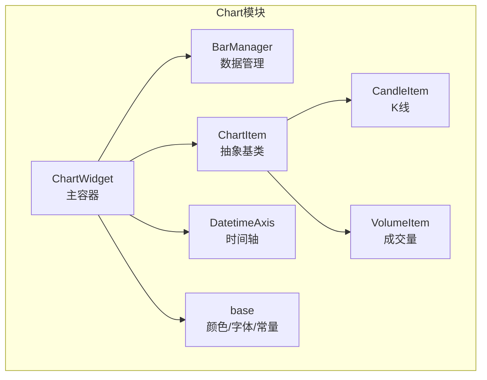
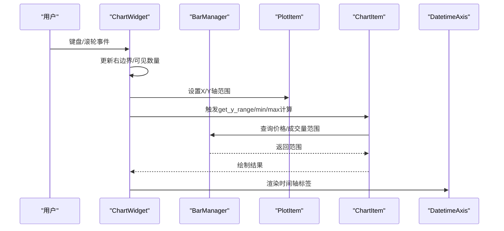
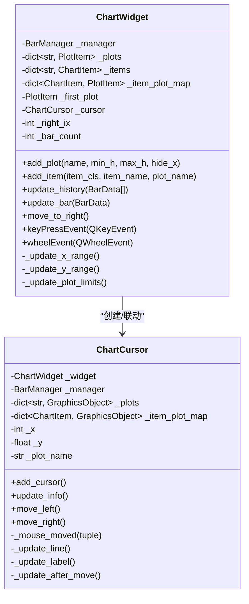
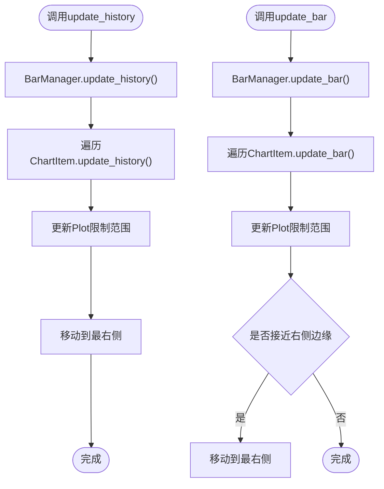
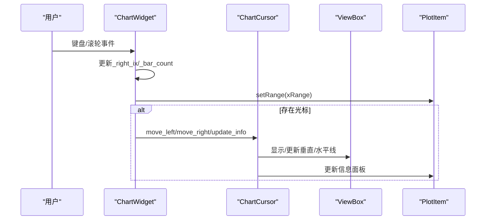
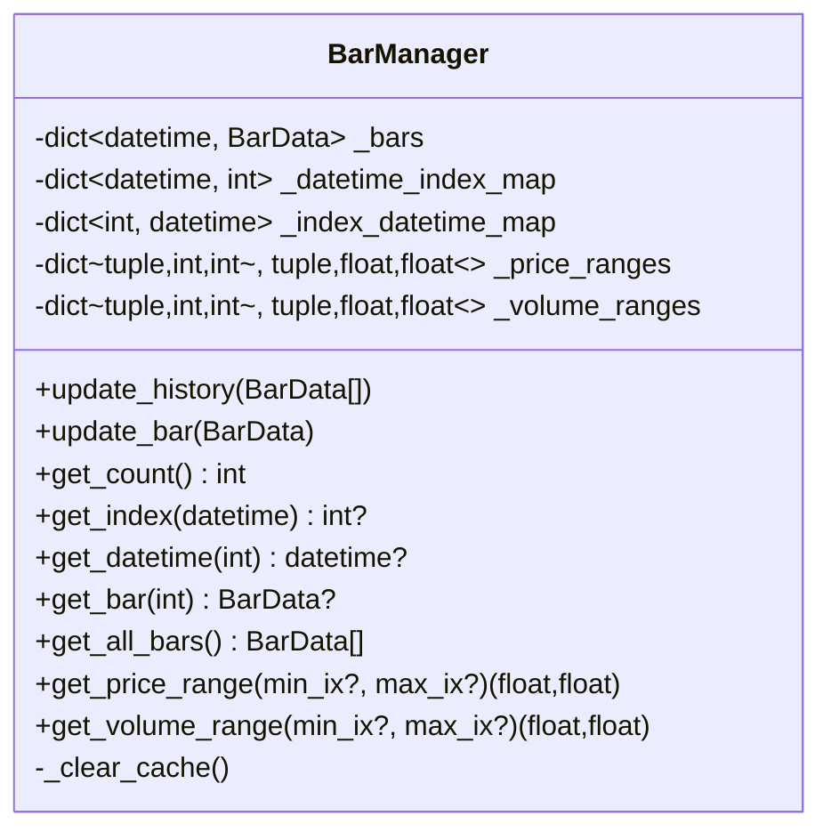
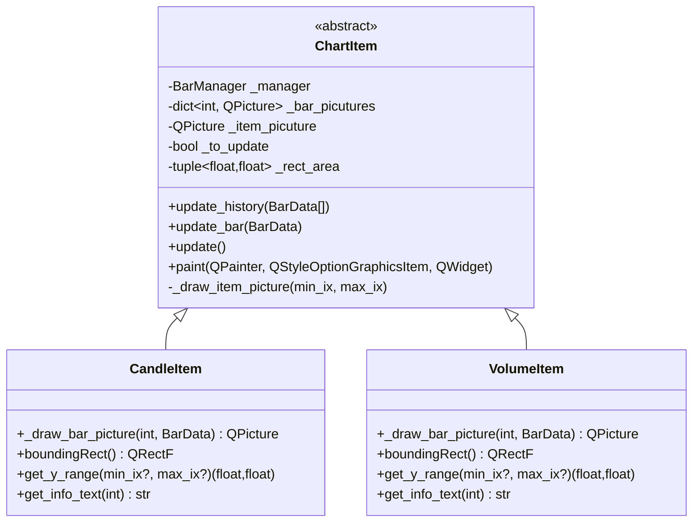
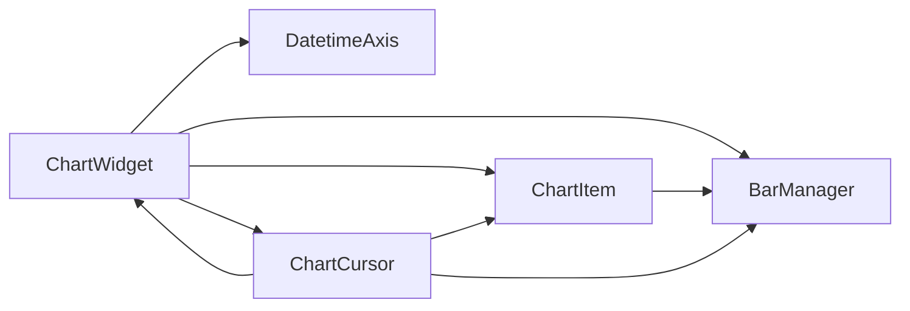

# ChartWidget组件

<cite>
**本文引用的文件**
- [widget.py](file://vnpy/chart/widget.py)
- [base.py](file://vnpy/chart/base.py)
- [manager.py](file://vnpy/chart/manager.py)
- [item.py](file://vnpy/chart/item.py)
- [axis.py](file://vnpy/chart/axis.py)
- [__init__.py](file://vnpy/chart/__init__.py)
- [run.py](file://examples/candle_chart/run.py)
</cite>

## 目录
1. [简介](#简介)
2. [项目结构](#项目结构)
3. [核心组件](#核心组件)
4. [架构总览](#架构总览)
5. [详细组件分析](#详细组件分析)
6. [依赖关系分析](#依赖关系分析)
7. [性能考虑](#性能考虑)
8. [故障排查指南](#故障排查指南)
9. [结论](#结论)
10. [附录：使用示例与最佳实践](#附录使用示例与最佳实践)

## 简介
本文件面向ChartWidget组件的技术文档，系统性阐述其作为图表主容器的设计架构与核心功能。内容涵盖：
- 图表区域的创建与管理（add_plot）
- 图表项的添加与管理（add_item）
- 数据更新机制（update_history、update_bar）
- 交互功能（键盘导航、鼠标滚轮缩放、光标联动）
- 布局管理、坐标轴设置
- 性能优化策略
- 完整使用示例与最佳实践

## 项目结构
ChartWidget位于vnpy/chart子模块中，围绕pyqtgraph构建，采用“管理器-视图-项”的分层设计：
- ChartWidget：主容器，负责布局、交互、滚动与缩放控制
- BarManager：数据管理器，维护时间序列数据与索引映射
- ChartItem/CandleItem/VolumeItem：绘图项，负责按需绘制与缓存
- DatetimeAxis：自定义X轴，将索引转换为日期时间标签
- base：颜色、字体、常量配置

**图表来源**
- [widget.py](file://vnpy/chart/widget.py#L20-L557)
- [manager.py](file://vnpy/chart/manager.py#L9-L171)
- [item.py](file://vnpy/chart/item.py#L12-L334)
- [axis.py](file://vnpy/chart/axis.py#L10-L45)
- [base.py](file://vnpy/chart/base.py#L1-L22)

**章节来源**
- [widget.py](file://vnpy/chart/widget.py#L1-L557)
- [manager.py](file://vnpy/chart/manager.py#L1-L171)
- [item.py](file://vnpy/chart/item.py#L1-L334)
- [axis.py](file://vnpy/chart/axis.py#L1-L45)
- [base.py](file://vnpy/chart/base.py#L1-L22)

## 核心组件
- ChartWidget：继承自pyqtgraph.PlotWidget，提供多Plot区域、数据管理、交互控制、光标联动等能力
- BarManager：维护BarData字典、时间到索引映射、索引到时间映射，并提供价格/成交量范围查询与缓存
- ChartItem/CandleItem/VolumeItem：基于GraphicsObject的可绘制项，支持历史批量更新、单条更新、按需重绘与缓存
- DatetimeAxis：AxisItem实现，将索引渲染为日期时间字符串
- base：统一的颜色、字体、宽度等视觉参数

**章节来源**
- [widget.py](file://vnpy/chart/widget.py#L20-L557)
- [manager.py](file://vnpy/chart/manager.py#L9-L171)
- [item.py](file://vnpy/chart/item.py#L12-L334)
- [axis.py](file://vnpy/chart/axis.py#L10-L45)
- [base.py](file://vnpy/chart/base.py#L1-L22)

## 架构总览
ChartWidget通过布局管理多个PlotItem，每个PlotItem绑定一个DatetimeAxis作为X轴；数据由BarManager集中管理，ChartItem在需要时从BarManager取数并绘制。交互事件（键盘、滚轮）驱动ChartWidget内部状态变更，进而更新X/Y轴范围与光标信息。

**图表来源**
- [widget.py](file://vnpy/chart/widget.py#L237-L322)
- [manager.py](file://vnpy/chart/manager.py#L93-L153)
- [axis.py](file://vnpy/chart/axis.py#L22-L44)

**章节来源**
- [widget.py](file://vnpy/chart/widget.py#L237-L322)
- [manager.py](file://vnpy/chart/manager.py#L93-L153)
- [axis.py](file://vnpy/chart/axis.py#L22-L44)

## 详细组件分析

### ChartWidget：图表主容器
职责与关键点：
- 布局管理：使用GraphicsLayout组织多个PlotItem，支持最小高度、最大高度、隐藏X轴
- 数据管理：持有BarManager实例，提供update_history/update_bar接口
- 交互控制：重写keyPressEvent/wheelEvent，支持左右移动、缩放、自动跟随右侧
- 光标联动：ChartCursor在鼠标移动时同步各PlotItem的垂直/水平线与信息面板
- Y轴范围动态更新：监听首个PlotItem的X轴变化，按当前可视区间计算各ChartItem的Y轴范围

**图表来源**
- [widget.py](file://vnpy/chart/widget.py#L20-L557)

**章节来源**
- [widget.py](file://vnpy/chart/widget.py#L20-L557)

#### add_plot：创建与管理图表区域
- 创建PlotItem并注入DatetimeAxis作为底部X轴
- 隐藏左侧Y轴，显示右侧Y轴，启用反走样与下采样
- 链接首个PlotItem的X轴到其他PlotItem，保证横向滚动同步
- 设置最小/最大高度与是否隐藏X轴
- 连接ViewBox的X范围变化信号以动态更新Y轴范围

**章节来源**
- [widget.py](file://vnpy/chart/widget.py#L62-L113)

#### add_item：添加图表项
- 实例化具体ChartItem并注册到管理字典
- 将ChartItem添加到指定PlotItem
- 建立ChartItem到PlotItem的映射，用于后续Y轴范围计算与信息展示

**章节来源**
- [widget.py](file://vnpy/chart/widget.py#L114-L130)

#### 数据更新机制：update_history 与 update_bar
- update_history：批量导入历史数据，触发BarManager与所有ChartItem的历史更新，刷新限制范围并自动滚动至最右侧
- update_bar：单条数据更新，触发BarManager与所有ChartItem的单条更新，刷新限制范围；当接近右侧边缘时自动滚动

**图表来源**
- [widget.py](file://vnpy/chart/widget.py#L155-L181)
- [manager.py](file://vnpy/chart/manager.py#L21-L56)

**章节来源**
- [widget.py](file://vnpy/chart/widget.py#L155-L181)
- [manager.py](file://vnpy/chart/manager.py#L21-L56)

#### 交互功能：键盘、滚轮与光标
- 键盘事件：左/右移动、上/下缩放，更新右侧索引与X轴范围，必要时更新光标位置与信息
- 滚轮事件：向上放大、向下缩小，逻辑同键盘上键
- 光标联动：ChartCursor监听场景鼠标移动，定位到对应PlotItem，显示垂直/水平线与信息面板；支持逐格移动并同步Y值

**图表来源**
- [widget.py](file://vnpy/chart/widget.py#L237-L322)
- [widget.py](file://vnpy/chart/widget.py#L324-L557)

**章节来源**
- [widget.py](file://vnpy/chart/widget.py#L237-L322)
- [widget.py](file://vnpy/chart/widget.py#L324-L557)

### BarManager：数据管理器
职责与关键点：
- 维护BarData字典、时间索引映射、索引时间映射
- 提供get_price_range/get_volume_range，带缓存避免重复计算
- 支持update_history（排序+重建索引）与update_bar（增量更新）

**图表来源**
- [manager.py](file://vnpy/chart/manager.py#L9-L171)

**章节来源**
- [manager.py](file://vnpy/chart/manager.py#L9-L171)

### ChartItem/CandleItem/VolumeItem：绘图项
职责与关键点：
- ChartItem：抽象基类，定义update_history/update_bar/update/paint等生命周期；采用QPicture缓存与按需重绘，仅绘制可见区域
- CandleItem：绘制K线蜡烛图，区分涨跌颜色
- VolumeItem：绘制成交量柱状图，涨跌颜色不同
- get_info_text：为光标信息面板提供文本

**图表来源**
- [item.py](file://vnpy/chart/item.py#L12-L334)

**章节来源**
- [item.py](file://vnpy/chart/item.py#L12-L334)

### DatetimeAxis：时间轴
职责与关键点：
- 继承AxisItem，重写tickStrings，将索引转换为日期时间字符串
- 根据间隔决定显示格式（仅日期或含时间）

**章节来源**
- [axis.py](file://vnpy/chart/axis.py#L10-L45)

## 依赖关系分析
- ChartWidget依赖BarManager进行数据管理，依赖ChartItem进行绘制，依赖DatetimeAxis提供X轴标签
- ChartItem依赖BarManager获取数据范围与单条BarData
- ChartCursor依赖ChartWidget/BarManager/PlotItem集合进行光标联动

**图表来源**
- [widget.py](file://vnpy/chart/widget.py#L20-L557)
- [manager.py](file://vnpy/chart/manager.py#L9-L171)
- [item.py](file://vnpy/chart/item.py#L12-L334)
- [axis.py](file://vnpy/chart/axis.py#L10-L45)

**章节来源**
- [widget.py](file://vnpy/chart/widget.py#L20-L557)
- [manager.py](file://vnpy/chart/manager.py#L9-L171)
- [item.py](file://vnpy/chart/item.py#L12-L334)
- [axis.py](file://vnpy/chart/axis.py#L10-L45)

## 性能考虑
- 可视区域绘制：ChartItem.paint仅绘制暴露矩形内的条目，避免全量重绘
- 条目级缓存：按索引缓存QPicture，减少重复绘制成本
- 下采样：PlotItem启用“峰值”下采样，提升大数据量下的渲染性能
- 范围缓存：BarManager对价格/成交量范围查询进行缓存，避免重复扫描
- 同步X轴：多PlotItem共享X轴范围，减少重复计算与布局抖动

**章节来源**
- [item.py](file://vnpy/chart/item.py#L107-L157)
- [widget.py](file://vnpy/chart/widget.py#L78-L95)
- [manager.py](file://vnpy/chart/manager.py#L155-L160)

## 故障排查指南
- 图表不显示数据：检查是否已调用update_history或update_bar，确认BarManager中有数据
- X轴标签异常：确认DatetimeAxis正确注入到PlotItem的底部轴
- 缩放无效：检查PlotItem的setMouseEnabled(x=True,y=False)，确保X轴可拖动
- 光标不显示：确认已调用add_cursor()，且鼠标在有效区域内移动
- 性能问题：大量数据时优先使用update_history一次性加载，避免频繁update_bar；必要时增大MIN_BAR_COUNT以减少频繁重绘

**章节来源**
- [widget.py](file://vnpy/chart/widget.py#L42-L113)
- [widget.py](file://vnpy/chart/widget.py#L237-L322)
- [axis.py](file://vnpy/chart/axis.py#L22-L44)

## 结论
ChartWidget通过清晰的分层设计与高效的渲染策略，提供了高性能、易扩展的图表容器。其核心优势在于：
- 多Plot区域与联动X轴的布局管理
- 基于BarManager的数据中心化管理
- ChartItem按需绘制与缓存机制
- 交互事件驱动的实时更新与光标联动

## 附录：使用示例与最佳实践

### 使用示例
以下示例演示了如何创建ChartWidget、添加K线与成交量、加载历史数据并持续更新最新数据。

- 示例路径：[run.py](file://examples/candle_chart/run.py#L1-L44)

步骤概览：
1. 创建ChartWidget实例
2. 添加两个Plot区域：K线与成交量
3. 注册CandleItem与VolumeItem到对应Plot
4. 添加光标
5. 加载历史数据并update_history
6. 循环调用update_bar推送新数据

最佳实践：
- 初始化阶段先add_plot再add_item，确保布局与映射建立
- 历史数据建议一次性update_history，随后使用update_bar增量推送
- 对于高频数据流，可结合定时器或事件驱动触发update_bar
- 需要自动跟随最新数据时，在update_bar后调用move_to_right
- 如需隐藏X轴标签，可在add_plot时设置hide_x_axis=True

**章节来源**
- [run.py](file://examples/candle_chart/run.py#L1-L44)
- [widget.py](file://vnpy/chart/widget.py#L62-L130)
- [widget.py](file://vnpy/chart/widget.py#L155-L181)