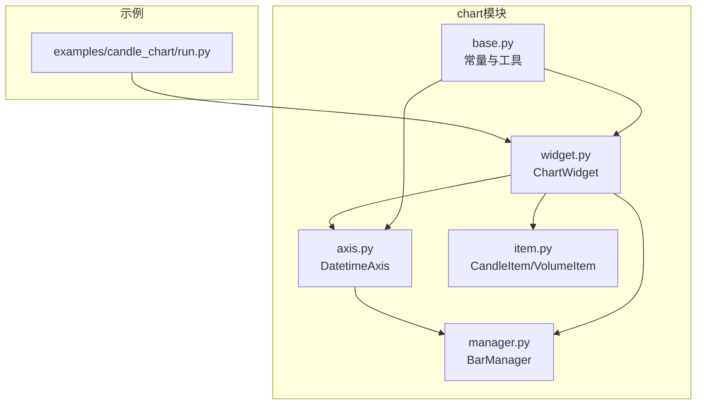
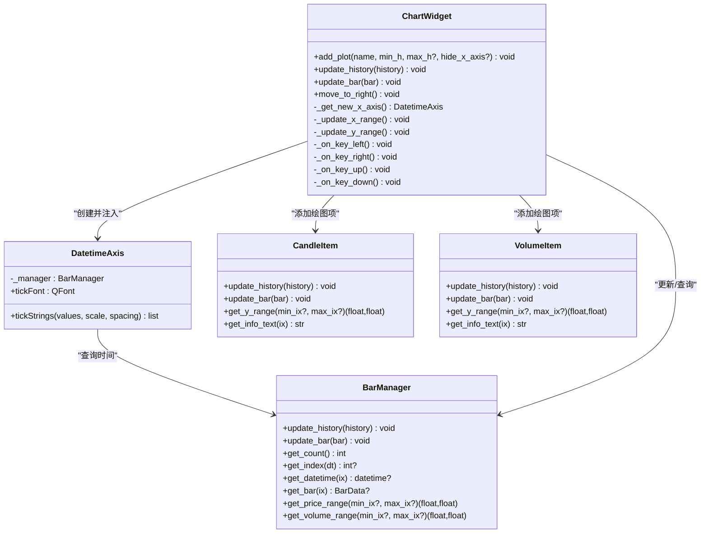
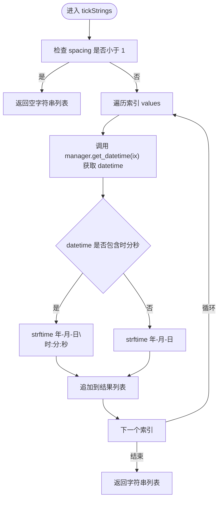
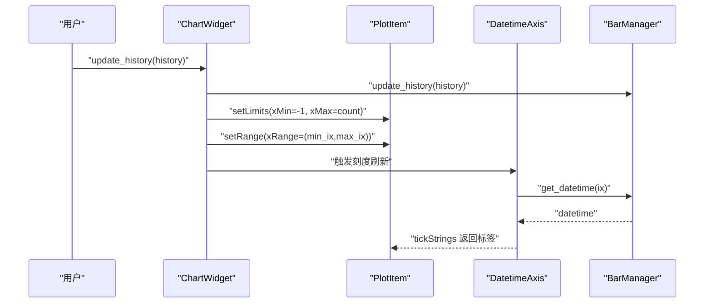
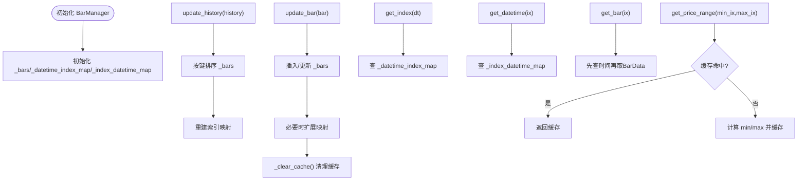
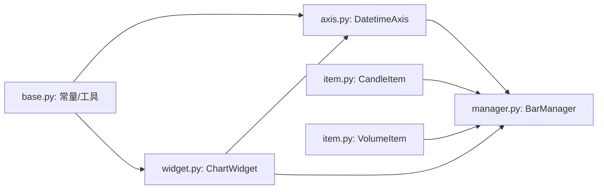

# DatetimeAxis坐标轴

<cite>
**本文引用的文件列表**
- [axis.py](file://vnpy/chart/axis.py)
- [widget.py](file://vnpy/chart/widget.py)
- [manager.py](file://vnpy/chart/manager.py)
- [base.py](file://vnpy/chart/base.py)
- [item.py](file://vnpy/chart/item.py)
- [run.py](file://examples/candle_chart/run.py)
</cite>

## 目录
1. [简介](#简介)
2. [项目结构](#项目结构)
3. [核心组件](#核心组件)
4. [架构总览](#架构总览)
5. [组件详解](#组件详解)
6. [依赖关系分析](#依赖关系分析)
7. [性能考量](#性能考量)
8. [故障排查指南](#故障排查指南)
9. [结论](#结论)
10. [附录](#附录)

## 简介
DatetimeAxis是vnpy图表系统中的时间轴组件，负责将时间序列数据的索引映射为人类可读的时间字符串标签。它基于pyqtgraph的AxisItem扩展，与BarManager配合，实现时间戳到索引的双向映射，支撑K线图、成交量图等时间序列图表的坐标轴显示与交互。

## 项目结构
- chart模块提供图表绘制与交互能力，其中axis.py定义了DatetimeAxis，widget.py提供ChartWidget容器与交互逻辑，manager.py维护时间序列数据与索引映射，base.py提供通用颜色与字体常量，item.py提供K线与成交量等绘图项。
- 示例程序examples/candle_chart/run.py展示了如何在ChartWidget中添加带DatetimeAxis的X轴并加载历史数据。

**图表来源**
- [axis.py](file://vnpy/chart/axis.py#L10-L45)
- [widget.py](file://vnpy/chart/widget.py#L20-L113)
- [manager.py](file://vnpy/chart/manager.py#L9-L171)
- [base.py](file://vnpy/chart/base.py#L1-L22)
- [item.py](file://vnpy/chart/item.py#L12-L334)
- [run.py](file://examples/candle_chart/run.py#L1-L44)

**章节来源**
- [axis.py](file://vnpy/chart/axis.py#L1-L45)
- [widget.py](file://vnpy/chart/widget.py#L1-L113)
- [manager.py](file://vnpy/chart/manager.py#L1-L171)
- [base.py](file://vnpy/chart/base.py#L1-L22)
- [item.py](file://vnpy/chart/item.py#L1-L334)
- [run.py](file://examples/candle_chart/run.py#L1-L44)

## 核心组件
- DatetimeAxis：继承自pyqtgraph.AxisItem，重写tickStrings方法，将索引转换为日期/时间字符串；设置轴线宽度与刻度字体。
- BarManager：维护BarData字典、时间到索引映射、索引到时间映射，提供索引查询与范围缓存。
- ChartWidget：图表容器，负责创建PlotItem并注入DatetimeAxis作为底部X轴，提供滚动、缩放、键盘与滚轮交互。
- CandleItem/VolumeItem：基于ChartItem的绘图项，使用BarManager提供的索引范围与数据进行绘制与信息展示。

**章节来源**
- [axis.py](file://vnpy/chart/axis.py#L10-L45)
- [manager.py](file://vnpy/chart/manager.py#L9-L171)
- [widget.py](file://vnpy/chart/widget.py#L20-L322)
- [item.py](file://vnpy/chart/item.py#L12-L334)

## 架构总览
DatetimeAxis与ChartWidget、BarManager协同工作：
- ChartWidget在创建PlotItem时注入DatetimeAxis作为底部X轴。
- DatetimeAxis通过BarManager将索引转换为datetime对象，并按是否包含时分秒决定标签格式。
- 用户交互（键盘、滚轮）由ChartWidget处理，更新可见区间与滚动位置，进而影响X轴标签密度与显示。

**图表来源**
- [axis.py](file://vnpy/chart/axis.py#L10-L45)
- [widget.py](file://vnpy/chart/widget.py#L20-L322)
- [manager.py](file://vnpy/chart/manager.py#L9-L171)
- [item.py](file://vnpy/chart/item.py#L12-L334)

## 组件详解

### DatetimeAxis：时间轴格式化与显示
- 初始化：接收BarManager实例，设置轴线宽度与刻度字体。
- tickStrings：将传入的索引列表转换为时间字符串列表。当刻度间距小于1时返回空字符串占位；否则根据datetime对象的小时字段判断是否包含时分秒，分别采用“年-月-日”或“年-月-日\n时:分:秒”的换行格式。
- 与BarManager协作：通过get_datetime(ix)将索引映射为datetime对象，再进行格式化输出。

**图表来源**
- [axis.py](file://vnpy/chart/axis.py#L22-L44)
- [manager.py](file://vnpy/chart/manager.py#L63-L85)

**章节来源**
- [axis.py](file://vnpy/chart/axis.py#L10-L45)
- [manager.py](file://vnpy/chart/manager.py#L63-L85)

### ChartWidget：坐标轴绑定与交互
- X轴注入：_get_new_x_axis返回DatetimeAxis实例并注入到PlotItem底部。
- 数据绑定：update_history/update_bar调用BarManager更新数据，随后更新绘图项与视图范围。
- 交互处理：键盘左右移动、上下滚轮缩放，内部通过_update_x_range/_update_y_range更新视图范围；move_to_right将视图移动至最右侧。
- Y轴联动：多个PlotItem共享X轴，Y轴范围根据各绘图项的get_y_range动态计算。

**图表来源**
- [widget.py](file://vnpy/chart/widget.py#L155-L181)
- [widget.py](file://vnpy/chart/widget.py#L182-L205)
- [axis.py](file://vnpy/chart/axis.py#L22-L44)
- [manager.py](file://vnpy/chart/manager.py#L21-L41)

**章节来源**
- [widget.py](file://vnpy/chart/widget.py#L53-L113)
- [widget.py](file://vnpy/chart/widget.py#L155-L181)
- [widget.py](file://vnpy/chart/widget.py#L182-L205)
- [widget.py](file://vnpy/chart/widget.py#L237-L322)

### BarManager：时间戳转换、索引映射与缓存
- 数据结构：维护BarData字典、时间到索引映射、索引到时间映射；提供价格与成交量范围缓存。
- 更新策略：update_history按时间排序重建索引映射；update_bar按需插入新时间点并更新映射。
- 查询接口：get_datetime根据索引返回datetime；get_index根据datetime返回索引；get_bar根据索引返回BarData。
- 范围缓存：get_price_range/get_volume_range在指定范围内缓存最小最大值，避免重复计算。

**图表来源**
- [manager.py](file://vnpy/chart/manager.py#L21-L56)
- [manager.py](file://vnpy/chart/manager.py#L63-L85)
- [manager.py](file://vnpy/chart/manager.py#L93-L122)
- [manager.py](file://vnpy/chart/manager.py#L124-L153)

**章节来源**
- [manager.py](file://vnpy/chart/manager.py#L9-L171)

### 绘图项与Y轴范围联动
- CandleItem/VolumeItem继承自ChartItem，使用BarManager的get_price_range/get_volume_range确定Y轴范围。
- 绘制时仅重绘可见区域，提升性能；get_info_text在光标悬停时提供文本信息。

**章节来源**
- [item.py](file://vnpy/chart/item.py#L168-L266)
- [item.py](file://vnpy/chart/item.py#L268-L334)

### 示例：在ChartWidget中启用DatetimeAxis
- 示例程序创建ChartWidget，添加绘图区与绘图项，并调用add_cursor启用十字光标。
- X轴通过ChartWidget自动注入DatetimeAxis，无需额外配置。

**章节来源**
- [run.py](file://examples/candle_chart/run.py#L21-L27)

## 依赖关系分析
- DatetimeAxis依赖BarManager进行时间戳到索引的查询。
- ChartWidget依赖DatetimeAxis进行X轴显示，并依赖BarManager进行数据更新与范围计算。
- CandleItem/VolumeItem依赖BarManager进行数据访问与范围缓存。
- base.py提供通用颜色与字体常量，被axis.py与widget.py引用。

**图表来源**
- [axis.py](file://vnpy/chart/axis.py#L10-L45)
- [widget.py](file://vnpy/chart/widget.py#L20-L113)
- [manager.py](file://vnpy/chart/manager.py#L9-L171)
- [item.py](file://vnpy/chart/item.py#L12-L334)
- [base.py](file://vnpy/chart/base.py#L1-L22)

**章节来源**
- [axis.py](file://vnpy/chart/axis.py#L1-L45)
- [widget.py](file://vnpy/chart/widget.py#L1-L113)
- [manager.py](file://vnpy/chart/manager.py#L1-L171)
- [item.py](file://vnpy/chart/item.py#L1-L334)
- [base.py](file://vnpy/chart/base.py#L1-L22)

## 性能考量
- 可见区域重绘：ChartItem在paint中仅重绘暴露矩形内的条目，避免全量重绘。
- 范围缓存：BarManager对价格与成交量范围进行缓存，减少重复计算。
- 视图更新：ChartWidget在交互时仅更新可见区间与Y轴范围，避免不必要的重绘。
- 字体与轴宽：统一字体与轴线宽度常量，减少重复构造开销。

最佳实践建议
- 数据更新：优先使用update_history一次性加载历史数据，再使用update_bar增量更新，减少多次setLimits/setRange带来的重绘。
- 缩放策略：合理设置MIN_BAR_COUNT与缩放比例，避免过密或过疏的刻度导致渲染压力。
- 字体大小：根据屏幕分辨率与显示密度调整NORMAL_FONT大小，平衡可读性与渲染性能。
- 绘图项数量：在单个PlotItem中合并相关指标，减少PlotItem数量与链接开销。

[本节为通用性能指导，不直接分析特定文件，故无章节来源]

## 故障排查指南
- 时间标签为空：检查spacing是否小于1，或确认BarManager中是否存在对应索引的时间戳。
- 时间标签异常：确认BarManager的索引映射是否正确重建（update_history后）。
- 交互无效：确认ChartWidget的视图范围未被外部强制限制，或PlotItem未被禁用鼠标交互。
- Y轴范围异常：检查各绘图项的get_y_range实现与BarManager的范围缓存是否一致。

**章节来源**
- [axis.py](file://vnpy/chart/axis.py#L22-L44)
- [manager.py](file://vnpy/chart/manager.py#L21-L41)
- [widget.py](file://vnpy/chart/widget.py#L93-L106)

## 结论
DatetimeAxis通过与BarManager的紧密协作，将时间序列索引转换为清晰的时间标签，支撑K线与成交量等图表的X轴显示。ChartWidget提供完整的交互与视图管理，结合绘图项的可见区域重绘与范围缓存，实现高性能的时间序列可视化。通过合理的配置与最佳实践，可在大数据量场景下保持流畅的用户体验。

[本节为总结性内容，不直接分析特定文件，故无章节来源]

## 附录

### 配置与定制化要点
- 时间格式：tickStrings根据datetime是否包含时分秒决定格式，无需额外配置。
- 字体与轴宽：通过base.py中的常量统一设置，便于全局定制。
- 刻度密度：由pyqtgraph根据当前视图范围自动计算，可通过调整bar_count与视图范围间接控制。

**章节来源**
- [axis.py](file://vnpy/chart/axis.py#L22-L44)
- [base.py](file://vnpy/chart/base.py#L15-L16)
- [widget.py](file://vnpy/chart/widget.py#L196-L205)