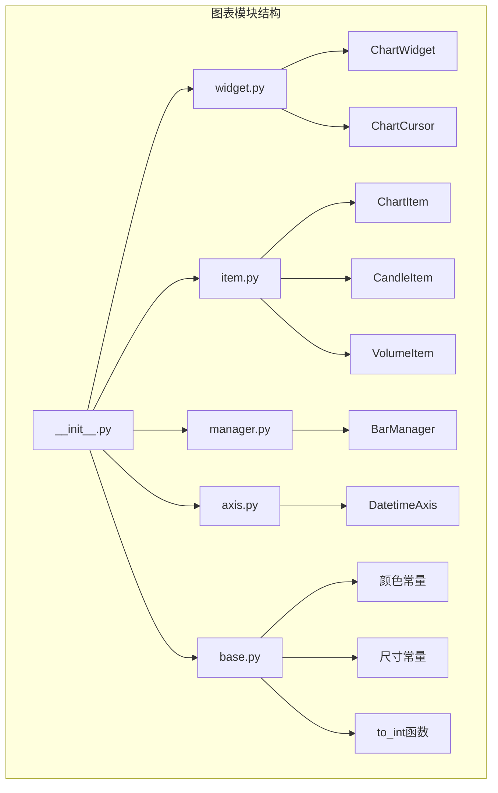
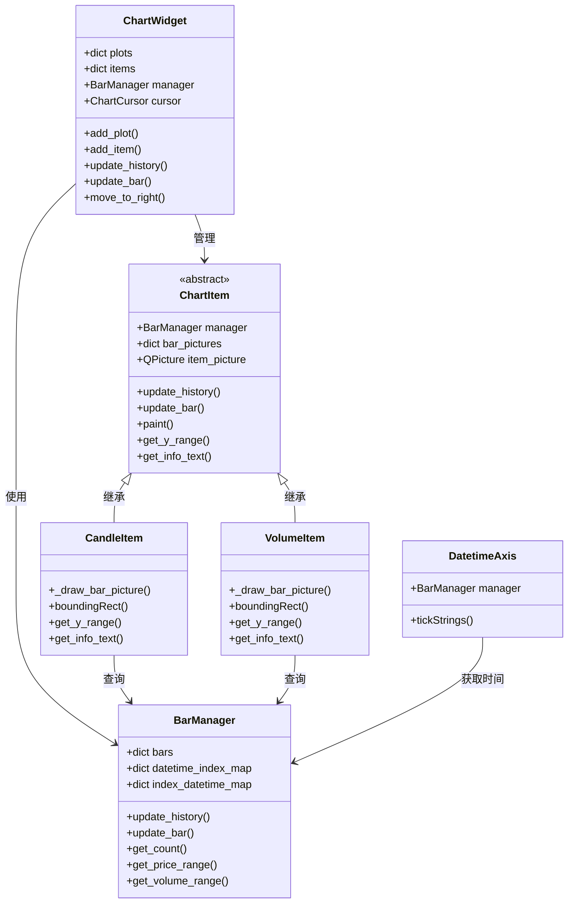
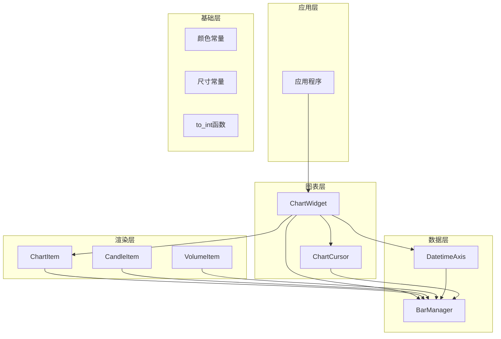
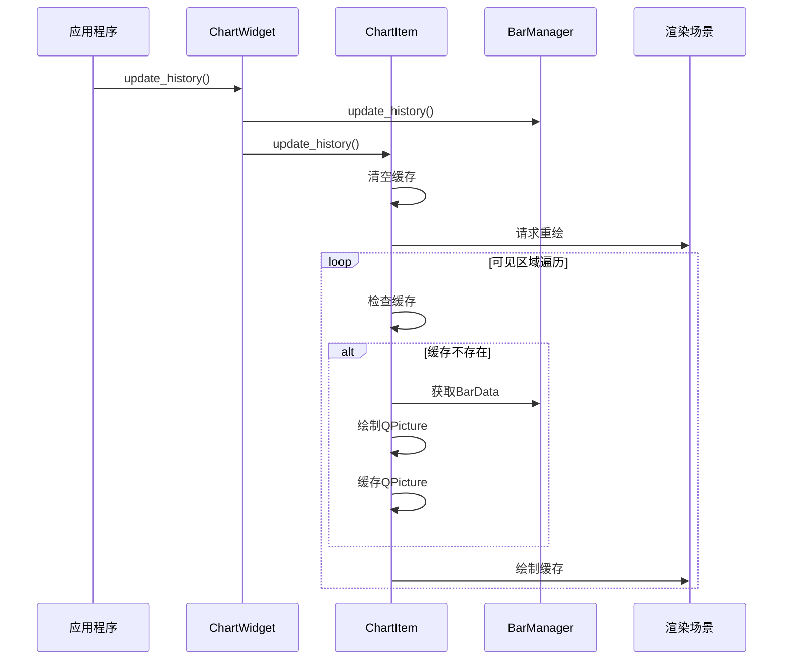
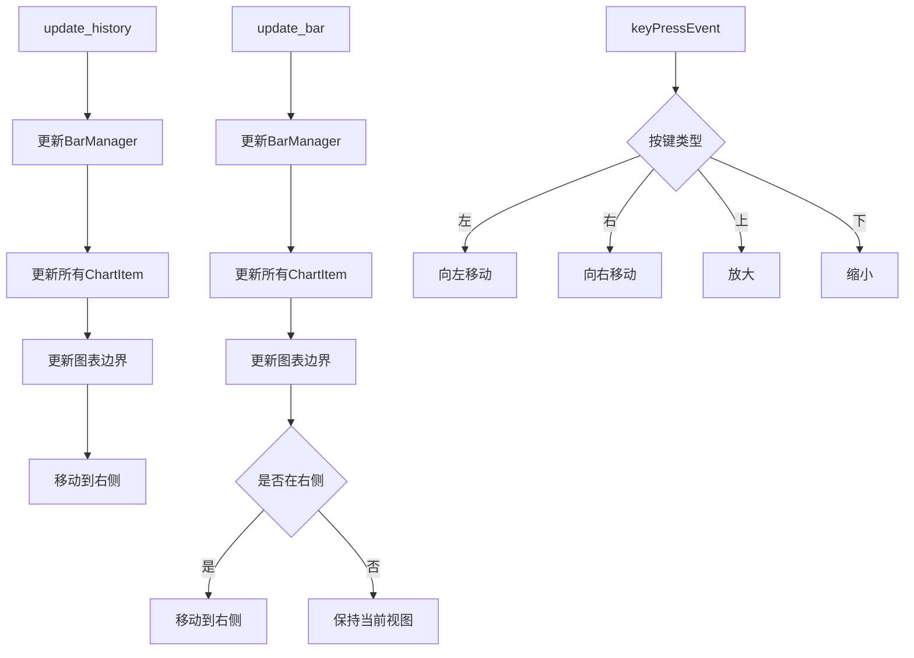
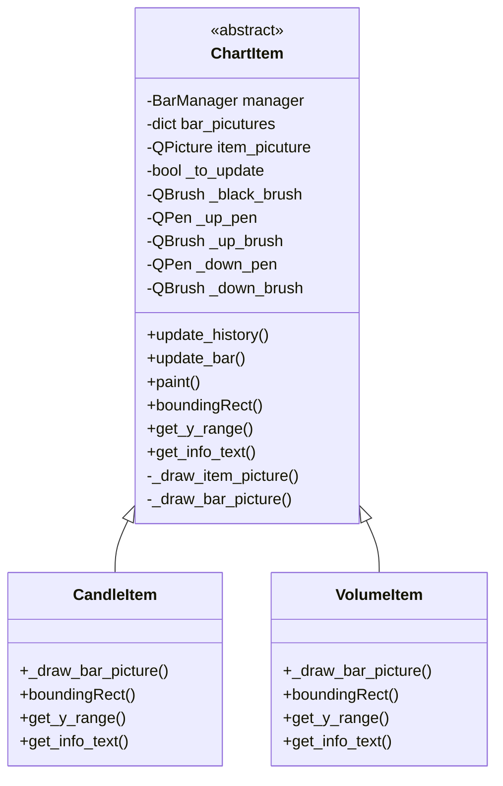
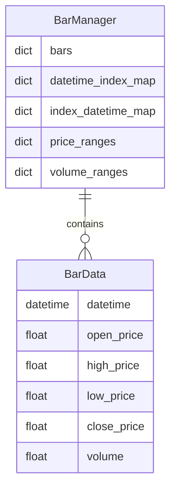
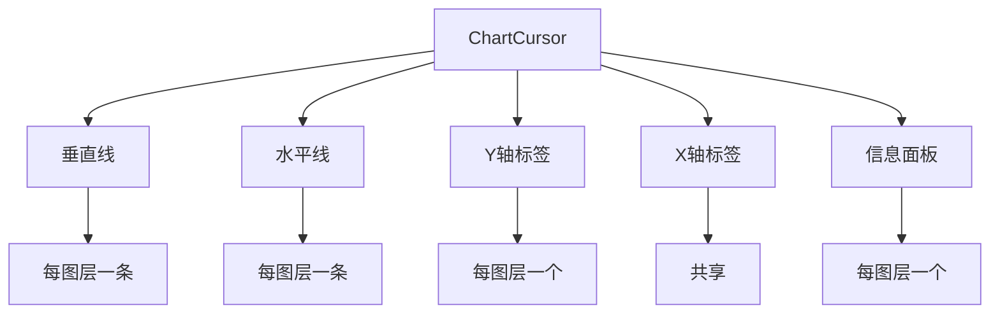
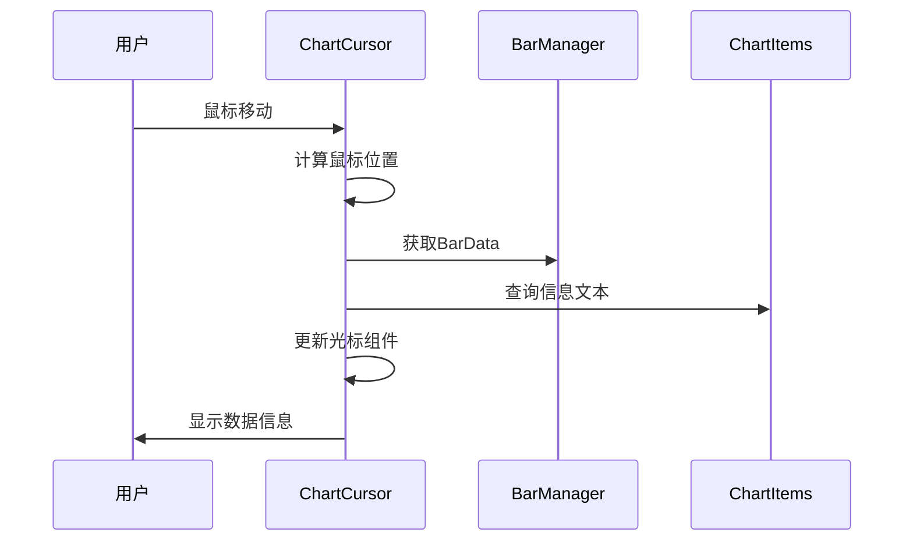
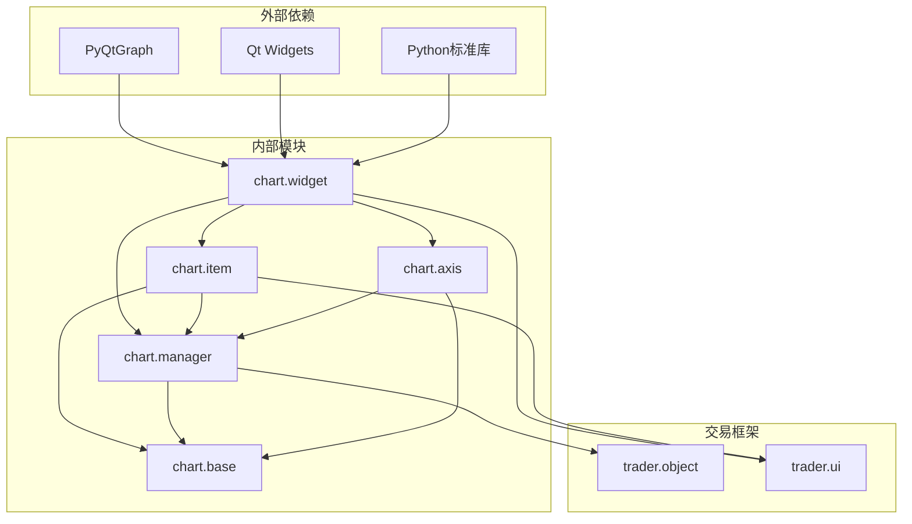

# 图表可视化模块

<cite>
**本文档引用的文件**
- [vnpy/chart/__init__.py](file://vnpy/chart/__init__.py)
- [vnpy/chart/base.py](file://vnpy/chart/base.py)
- [vnpy/chart/widget.py](file://vnpy/chart/widget.py)
- [vnpy/chart/manager.py](file://vnpy/chart/manager.py)
- [vnpy/chart/item.py](file://vnpy/chart/item.py)
- [vnpy/chart/axis.py](file://vnpy/chart/axis.py)
- [examples/candle_chart/run.py](file://examples/candle_chart/run.py)
</cite>

## 目录
1. [简介](#简介)
2. [项目结构](#项目结构)
3. [核心组件](#核心组件)
4. [架构概览](#架构概览)
5. [详细组件分析](#详细组件分析)
6. [依赖关系分析](#依赖关系分析)
7. [性能考虑](#性能考虑)
8. [故障排除指南](#故障排除指南)
9. [结论](#结论)
10. [附录](#附录)

## 简介

VeighNa图表可视化模块是一个基于PyQtGraph的高性能K线图表系统，专为量化交易应用设计。该模块提供了完整的图表渲染机制，包括K线图、成交量图、自定义图表项以及交互功能。模块采用事件驱动架构，支持实时数据更新和用户交互操作。

该模块的核心优势在于其高效的渲染机制和灵活的扩展性，能够处理大量历史数据并提供流畅的用户体验。通过精心设计的缓存策略和增量更新机制，模块能够在保持高帧率的同时处理数千条K线数据。

## 项目结构

图表模块采用清晰的分层架构，每个组件都有明确的职责分工：



**图表来源**
- [vnpy/chart/__init__.py](file://vnpy/chart/__init__.py#L1-L10)
- [vnpy/chart/widget.py](file://vnpy/chart/widget.py#L20-L557)
- [vnpy/chart/item.py](file://vnpy/chart/item.py#L12-L334)
- [vnpy/chart/manager.py](file://vnpy/chart/manager.py#L9-L171)
- [vnpy/chart/axis.py](file://vnpy/chart/axis.py#L10-L45)

**章节来源**
- [vnpy/chart/__init__.py](file://vnpy/chart/__init__.py#L1-L10)
- [vnpy/chart/base.py](file://vnpy/chart/base.py#L1-L22)

## 核心组件

图表模块由以下核心组件构成：

### 主要组件职责

1. **ChartWidget**: 图表主容器，负责布局管理和用户交互
2. **ChartItem**: 图表项基类，定义绘制接口和缓存机制
3. **BarManager**: 数据管理器，维护时间序列数据和索引映射
4. **DatetimeAxis**: 自定义坐标轴，处理时间刻度显示
5. **ChartCursor**: 光标系统，提供交互式数据查询

### 组件关系图



**图表来源**
- [vnpy/chart/widget.py](file://vnpy/chart/widget.py#L20-L557)
- [vnpy/chart/item.py](file://vnpy/chart/item.py#L12-L334)
- [vnpy/chart/manager.py](file://vnpy/chart/manager.py#L9-L171)
- [vnpy/chart/axis.py](file://vnpy/chart/axis.py#L10-L45)

**章节来源**
- [vnpy/chart/widget.py](file://vnpy/chart/widget.py#L20-L557)
- [vnpy/chart/item.py](file://vnpy/chart/item.py#L12-L334)
- [vnpy/chart/manager.py](file://vnpy/chart/manager.py#L9-L171)
- [vnpy/chart/axis.py](file://vnpy/chart/axis.py#L10-L45)

## 架构概览

图表模块采用分层架构设计，确保各组件职责清晰且松耦合：



**图表来源**
- [vnpy/chart/widget.py](file://vnpy/chart/widget.py#L20-L557)
- [vnpy/chart/item.py](file://vnpy/chart/item.py#L12-L334)
- [vnpy/chart/manager.py](file://vnpy/chart/manager.py#L9-L171)
- [vnpy/chart/axis.py](file://vnpy/chart/axis.py#L10-L45)

### 渲染机制

模块采用高效的增量渲染机制，通过QPicture缓存避免重复绘制：



**图表来源**
- [vnpy/chart/widget.py](file://vnpy/chart/widget.py#L155-L181)
- [vnpy/chart/item.py](file://vnpy/chart/item.py#L74-L157)
- [vnpy/chart/manager.py](file://vnpy/chart/manager.py#L21-L56)

**章节来源**
- [vnpy/chart/widget.py](file://vnpy/chart/widget.py#L155-L181)
- [vnpy/chart/item.py](file://vnpy/chart/item.py#L74-L157)
- [vnpy/chart/manager.py](file://vnpy/chart/manager.py#L21-L56)

## 详细组件分析

### ChartWidget - 图表主容器

ChartWidget是图表系统的核心控制器，负责管理整个图表的生命周期和用户交互。

#### 关键特性

1. **多图层管理**: 支持多个独立的图表区域，每个区域可以显示不同类型的数据
2. **实时数据更新**: 提供历史数据加载和实时数据更新接口
3. **键盘鼠标交互**: 支持键盘导航和鼠标缩放操作
4. **光标系统**: 集成交互式光标，提供数据查询功能

#### 核心方法分析



**图表来源**
- [vnpy/chart/widget.py](file://vnpy/chart/widget.py#L155-L322)

#### 交互机制

ChartWidget实现了完整的用户交互系统：

- **键盘导航**: 方向键控制图表平移，滚轮控制缩放
- **鼠标操作**: 鼠标拖拽进行平移，滚轮进行缩放
- **自动滚动**: 实时数据更新时自动滚动到最新位置

**章节来源**
- [vnpy/chart/widget.py](file://vnpy/chart/widget.py#L24-L322)

### ChartItem - 图表项基类

ChartItem是所有图表元素的抽象基类，定义了统一的绘制接口和缓存机制。

#### 设计模式

模块采用GraphicsObject模式，通过QPicture缓存实现高效渲染：



**图表来源**
- [vnpy/chart/item.py](file://vnpy/chart/item.py#L12-L334)

#### 缓存策略

ChartItem实现了两级缓存机制：

1. **条形缓存**: 每个数据点的绘制结果缓存
2. **整体缓存**: 当前可视区域的完整绘制缓存

这种设计确保了只有可见区域内的数据被重新绘制，大大提高了渲染效率。

**章节来源**
- [vnpy/chart/item.py](file://vnpy/chart/item.py#L12-L157)

### BarManager - 数据管理器

BarManager负责维护时间序列数据的完整生命周期管理。

#### 数据结构设计



**图表来源**
- [vnpy/chart/manager.py](file://vnpy/chart/manager.py#L9-L171)

#### 性能优化

BarManager通过以下机制优化性能：

1. **索引映射**: 维护双向索引，支持O(1)的时间查找
2. **范围缓存**: 缓存价格和成交量范围，避免重复计算
3. **增量更新**: 只清理受影响的缓存区域

**章节来源**
- [vnpy/chart/manager.py](file://vnpy/chart/manager.py#L9-L171)

### DatetimeAxis - 时间轴

DatetimeAxis是自定义的坐标轴组件，专门处理时间序列数据的显示。

#### 时间格式化

轴标签根据时间粒度动态调整显示格式：

- **无小时信息**: 显示日期 "YYYY-MM-DD"
- **有小时信息**: 显示完整时间 "YYYY-MM-DD\nHH:MM:SS"

#### 性能考虑

轴渲染采用延迟计算策略，只在需要时才进行时间格式转换。

**章节来源**
- [vnpy/chart/axis.py](file://vnpy/chart/axis.py#L10-L45)

### ChartCursor - 交互光标

ChartCursor提供完整的交互式数据查询功能。

#### 光标组件



**图表来源**
- [vnpy/chart/widget.py](file://vnpy/chart/widget.py#L324-L557)

#### 交互流程



**图表来源**
- [vnpy/chart/widget.py](file://vnpy/chart/widget.py#L423-L510)

**章节来源**
- [vnpy/chart/widget.py](file://vnpy/chart/widget.py#L324-L557)

## 依赖关系分析

图表模块的依赖关系清晰且层次分明：



**图表来源**
- [vnpy/chart/widget.py](file://vnpy/chart/widget.py#L1-L15)
- [vnpy/chart/item.py](file://vnpy/chart/item.py#L1-L10)
- [vnpy/chart/manager.py](file://vnpy/chart/manager.py#L1-L7)

### 循环依赖检查

经过分析，模块间不存在循环依赖：
- widget依赖item、manager、axis、base
- item依赖manager、base
- manager依赖base
- axis依赖manager、base
- 所有依赖都是单向的

**章节来源**
- [vnpy/chart/widget.py](file://vnpy/chart/widget.py#L1-L15)
- [vnpy/chart/item.py](file://vnpy/chart/item.py#L1-L10)
- [vnpy/chart/manager.py](file://vnpy/chart/manager.py#L1-L7)
- [vnpy/chart/axis.py](file://vnpy/chart/axis.py#L1-L8)

## 性能考虑

图表模块在设计时充分考虑了性能优化：

### 渲染优化

1. **增量绘制**: 只重绘可见区域内的数据
2. **QPicture缓存**: 将绘制结果缓存为QPicture对象
3. **条形缓存**: 每个数据点单独缓存，避免重复计算

### 内存管理

1. **智能缓存**: 只缓存当前可视区域的数据
2. **及时清理**: 数据更新时清理相关缓存
3. **内存回收**: 定期清理不再使用的缓存

### 数据结构优化

1. **双向索引**: 支持O(1)的时间戳到索引转换
2. **范围缓存**: 缓存价格和成交量范围，避免重复计算
3. **增量更新**: 只更新受影响的数据

## 故障排除指南

### 常见问题

#### 图表不显示数据

**可能原因**:
1. BarManager没有数据
2. 图表项未正确添加
3. 坐标轴范围设置错误

**解决方案**:
1. 确保先调用update_history()再添加图表项
2. 检查add_item()的参数是否正确
3. 验证BarData的时间戳顺序

#### 性能问题

**可能原因**:
1. 数据量过大
2. 频繁的全量重绘
3. 缓存未正确使用

**解决方案**:
1. 使用update_bar()替代update_history()进行实时更新
2. 确保ChartItem正确实现缓存机制
3. 调整MIN_BAR_COUNT参数

#### 交互问题

**可能原因**:
1. 光标未启用
2. 事件处理冲突
3. 坐标轴链接问题

**解决方案**:
1. 调用add_cursor()启用光标
2. 检查父类事件处理
3. 确保所有图表使用相同的X轴

**章节来源**
- [vnpy/chart/widget.py](file://vnpy/chart/widget.py#L155-L322)
- [vnpy/chart/item.py](file://vnpy/chart/item.py#L74-L157)

## 结论

VeighNa图表可视化模块是一个设计精良的高性能图表系统，具有以下特点：

1. **架构清晰**: 分层设计确保了良好的可维护性和扩展性
2. **性能优异**: 通过多重缓存机制实现高效的渲染
3. **功能完整**: 提供了从基础K线图到高级交互功能的完整解决方案
4. **易于使用**: 简洁的API设计降低了使用门槛

该模块特别适合需要实时图表显示的量化交易应用，能够处理大量历史数据并提供流畅的用户体验。通过合理的配置和使用，开发者可以快速构建专业的图表界面。

## 附录

### 使用示例

#### 基础K线图示例

```python
# 创建图表
widget = ChartWidget()

# 添加图表区域
widget.add_plot("candle", hide_x_axis=True)
widget.add_plot("volume", maximum_height=200)

# 添加图表项
widget.add_item(CandleItem, "candle", "candle")
widget.add_item(VolumeItem, "volume", "volume")

# 添加光标
widget.add_cursor()

# 加载历史数据
widget.update_history(bars)

# 启动实时更新
timer.timeout.connect(lambda: widget.update_bar(new_bar))
```

#### 自定义图表项

要创建自定义图表项，需要继承ChartItem并实现以下方法：

1. `_draw_bar_picture()`: 绘制单个数据点
2. `boundingRect()`: 返回包围盒
3. `get_y_range()`: 计算Y轴范围
4. `get_info_text()`: 生成光标信息文本

**章节来源**
- [examples/candle_chart/run.py](file://examples/candle_chart/run.py#L9-L44)
- [vnpy/chart/item.py](file://vnpy/chart/item.py#L44-L72)