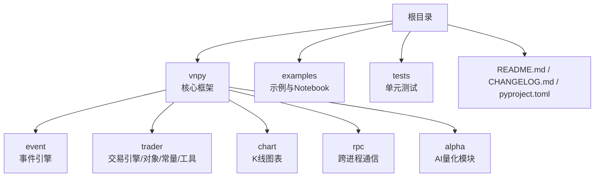
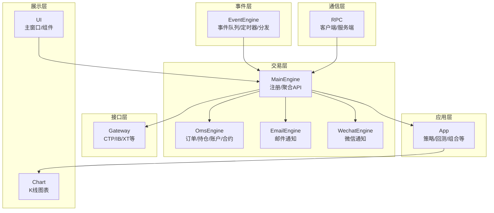
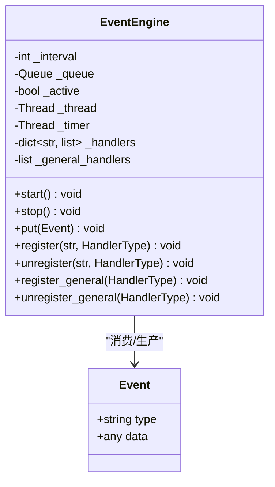
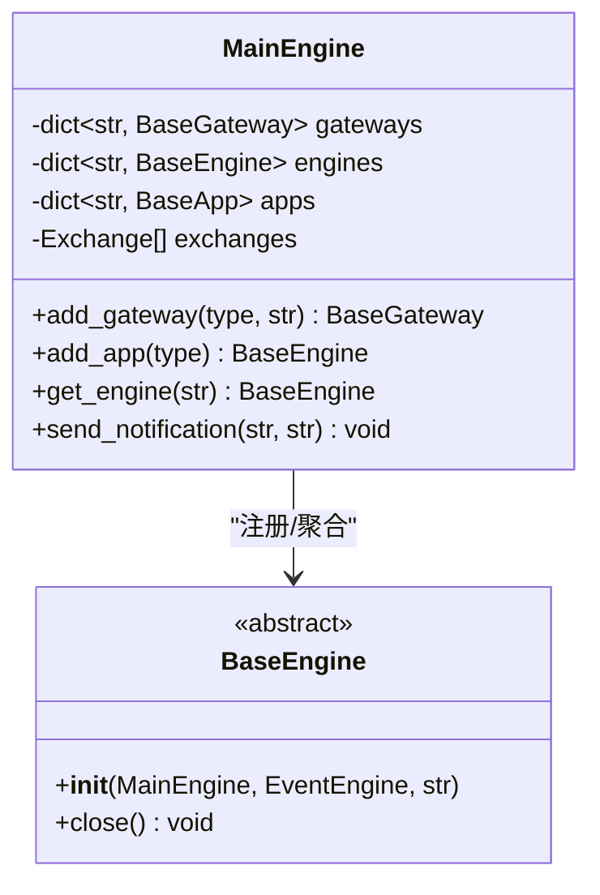
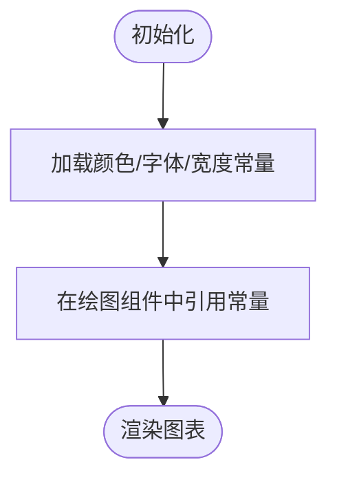
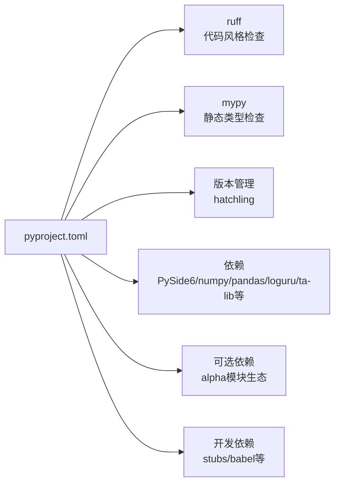

# 代码贡献指南

<cite>
**本文引用的文件**
- [README.md](file://README.md)
- [CHANGELOG.md](file://CHANGELOG.md)
- [pyproject.toml](file://pyproject.toml)
- [vnpy/__init__.py](file://vnpy/__init__.py)
- [vnpy/event/engine.py](file://vnpy/event/engine.py)
- [vnpy/trader/engine.py](file://vnpy/trader/engine.py)
- [vnpy/chart/base.py](file://vnpy/chart/base.py)
- [install.sh](file://install.sh)
- [install.bat](file://install.bat)
</cite>

## 目录
1. [简介](#简介)
2. [项目结构](#项目结构)
3. [核心组件](#核心组件)
4. [架构总览](#架构总览)
5. [详细组件分析](#详细组件分析)
6. [依赖分析](#依赖分析)
7. [性能考虑](#性能考虑)
8. [故障排查指南](#故障排查指南)
9. [结论](#结论)
10. [附录](#附录)

## 简介
本指南面向希望参与VeighNa量化交易框架开发的贡献者，提供从提交第一个Issue到最终合并Pull Request的完整流程说明；明确代码风格、命名约定、注释规范；解释代码审查流程与标准；给出开发环境搭建与IDE配置建议；并说明贡献者协议与许可证要求。

VeighNa是基于Python的开源量化交易系统开发框架，采用事件驱动架构，提供多市场交易接口、策略引擎、回测与可视化等能力。项目使用GitHub进行协作，遵循严格的代码质量与审查流程。

## 项目结构
仓库采用“核心框架 + 示例与测试 + 配置”的组织方式：
- vnpy：核心框架代码，包含事件驱动引擎、交易引擎、UI、图表、RPC等模块
- examples：示例脚本与Notebook，涵盖回测、数据录制、简单RPC等
- tests：单元测试与Alpha相关测试
- 根目录配置：README、变更日志、安装脚本、项目配置文件

**章节来源**
- [README.md](file://README.md#L1-L343)
- [CHANGELOG.md](file://CHANGELOG.md#L1-L800)

## 核心组件
- 事件驱动引擎：负责事件分发、定时器与线程管理，是系统异步与解耦的关键
- 交易引擎：负责网关、应用、引擎的注册与生命周期管理，提供统一API
- 图表模块：提供高性能K线显示与交互
- RPC模块：提供跨进程通信能力
- Alpha模块：面向AI量化的数据集、模型与策略开发

这些组件共同构成VeighNa的可扩展架构，贡献者应关注模块职责与接口契约，避免破坏性变更。

**章节来源**
- [vnpy/event/engine.py](file://vnpy/event/engine.py#L1-L146)
- [vnpy/trader/engine.py](file://vnpy/trader/engine.py#L81-L200)
- [vnpy/chart/base.py](file://vnpy/chart/base.py#L1-L22)

## 架构总览
VeighNa采用事件驱动架构，事件引擎负责事件队列与分发，交易引擎负责注册网关与应用，图表与RPC模块提供可视化与跨进程通信能力。

**图示来源**
- [vnpy/event/engine.py](file://vnpy/event/engine.py#L33-L146)
- [vnpy/trader/engine.py](file://vnpy/trader/engine.py#L81-L200)

## 详细组件分析

### 事件引擎（EventEngine）
- 职责：事件队列、事件分发、定时器线程、通用处理器注册
- 关键点：线程安全、处理器去重、通用处理器广播
- 贡献要点：新增事件类型需在统一位置集中定义，避免分散常量

**图示来源**
- [vnpy/event/engine.py](file://vnpy/event/engine.py#L16-L146)

**章节来源**
- [vnpy/event/engine.py](file://vnpy/event/engine.py#L1-L146)

### 交易引擎（MainEngine）
- 职责：注册网关与应用、初始化功能引擎、统一API暴露
- 关键点：引擎聚合、功能API绑定、通知通道（邮件/微信）
- 贡献要点：新增功能引擎需在初始化阶段注册，确保API可用

**图示来源**
- [vnpy/trader/engine.py](file://vnpy/trader/engine.py#L81-L200)

**章节来源**
- [vnpy/trader/engine.py](file://vnpy/trader/engine.py#L81-L200)

### 图表模块（Chart）
- 职责：颜色、字体、宽度等视觉配置与工具函数
- 贡献要点：颜色与样式常量集中管理，避免魔法值

**图示来源**
- [vnpy/chart/base.py](file://vnpy/chart/base.py#L1-L22)

**章节来源**
- [vnpy/chart/base.py](file://vnpy/chart/base.py#L1-L22)

## 依赖分析
项目使用统一的包配置文件管理依赖与工具链，核心依赖包括事件驱动、GUI、绘图、时序分析、日志等；开发与测试依赖通过可选组管理。

**图示来源**
- [pyproject.toml](file://pyproject.toml#L1-L124)

**章节来源**
- [pyproject.toml](file://pyproject.toml#L1-L124)

## 性能考虑
- 事件驱动与线程模型：事件队列与定时器线程分离，避免阻塞
- 图表渲染：按需绘制与缓存策略，减少首次渲染开销
- 数据处理：优先使用向量化与批处理（如Polars/NumPy/Pandas）
- I/O与网络：异步客户端与连接池，避免阻塞主线程

[本节为通用指导，无需具体文件分析]

## 故障排查指南
- 安装失败：检查系统与Python版本，参考安装脚本与依赖版本
- 依赖冲突：使用项目提供的安装脚本，避免手动修改依赖
- 事件未触发：确认事件类型常量一致、处理器已注册
- 图表异常：核对颜色与字体常量、坐标轴范围

**章节来源**
- [install.sh](file://install.sh#L1-L41)
- [install.bat](file://install.bat#L1-L16)
- [vnpy/event/engine.py](file://vnpy/event/engine.py#L1-L146)
- [vnpy/chart/base.py](file://vnpy/chart/base.py#L1-L22)

## 结论
VeighNa通过清晰的模块划分与事件驱动架构，为量化开发者提供了稳定、可扩展的开发平台。贡献者应遵循统一的代码风格与审查流程，确保高质量与可维护性。

[本节为总结，无需具体文件分析]

## 附录

### 一、贡献流程（从Issue到PR合并）
- 讨论与规划
  - 新功能或重大重构：先创建Issue进行讨论
  - 小改进（文档、Bug修复）：可直接提交PR
- Fork与分支
  - Fork仓库到个人账号
  - 从dev分支创建特性分支进行开发
- 提交与审查
  - 本地通过代码风格与类型检查
  - 提交PR，等待审查与反馈
  - 根据审查意见迭代修改
- 合并
  - 通过审查后由维护者合并

**章节来源**
- [README.md](file://README.md#L309-L327)

### 二、代码风格与质量工具
- 代码风格检查：使用ruff，项目根目录执行检查与自动修复
- 静态类型检查：使用mypy，检查类型注解与可选性
- 依赖与工具：统一在配置文件中管理

**章节来源**
- [README.md](file://README.md#L328-L332)
- [pyproject.toml](file://pyproject.toml#L89-L124)

### 三、命名约定与注释规范
- 命名约定
  - 类型：大驼峰（如EventEngine）
  - 函数/变量：小驼峰（如send_notification）
  - 常量：全大写（如EVENT_TIMER）
- 注释规范
  - 模块与类：使用多行字符串（docstring）
  - 函数：简明描述用途、参数与返回值
  - 复杂逻辑：添加必要注释说明设计意图与边界条件

**章节来源**
- [vnpy/event/engine.py](file://vnpy/event/engine.py#L1-L146)
- [vnpy/trader/engine.py](file://vnpy/trader/engine.py#L81-L200)

### 四、开发环境搭建与IDE配置建议
- 系统与Python
  - 支持Windows 11+/Server 2022+、Ubuntu 22.04+、macOS
  - 推荐Python 3.10–3.13，使用项目提供的安装脚本
- 依赖安装
  - 使用安装脚本自动处理ta-lib与本地语言环境
- IDE建议
  - 启用ruff与mypy集成，实时提示风格与类型问题
  - 配置自动格式化（如ruff fix），保持一致性

**章节来源**
- [README.md](file://README.md#L228-L254)
- [install.sh](file://install.sh#L1-L41)
- [install.bat](file://install.bat#L1-L16)

### 五、贡献者协议与许可证
- 许可证：MIT
- 贡献者需同意遵守项目行为准则与社区规范

**章节来源**
- [vnpy/__init__.py](file://vnpy/__init__.py#L1-L25)
- [README.md](file://README.md#L335-L338)

### 六、版本与变更记录
- 变更记录包含版本号、新增、调整与修复内容，有助于理解当前状态与潜在影响

**章节来源**
- [CHANGELOG.md](file://CHANGELOG.md#L1-L800)