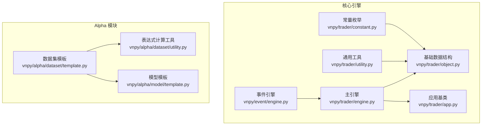
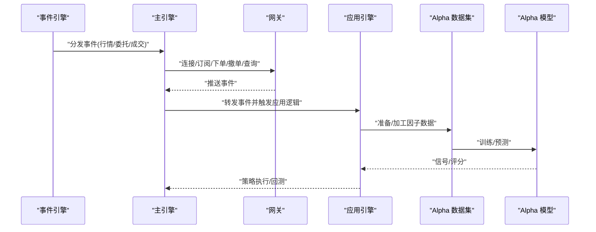
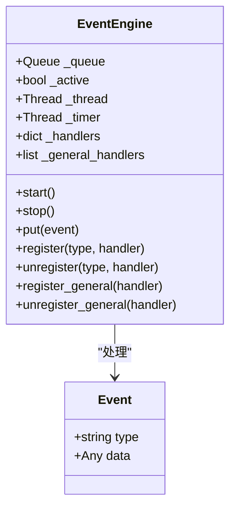
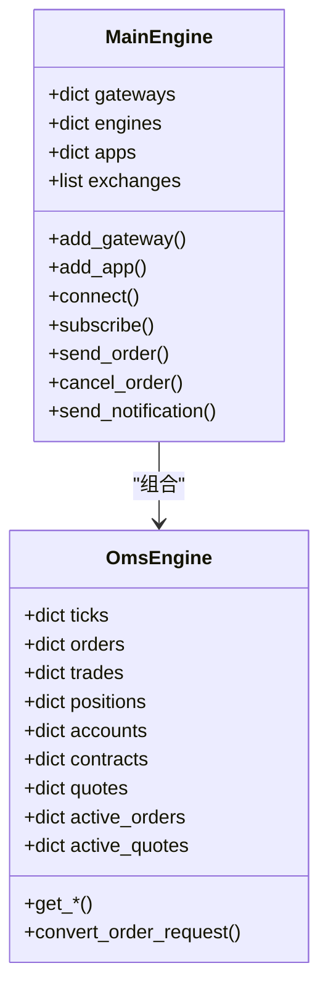
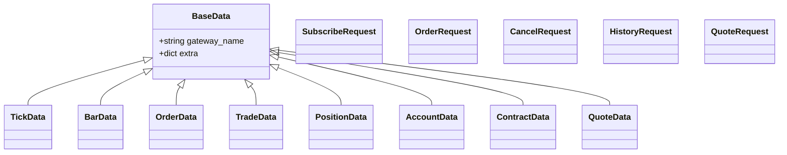
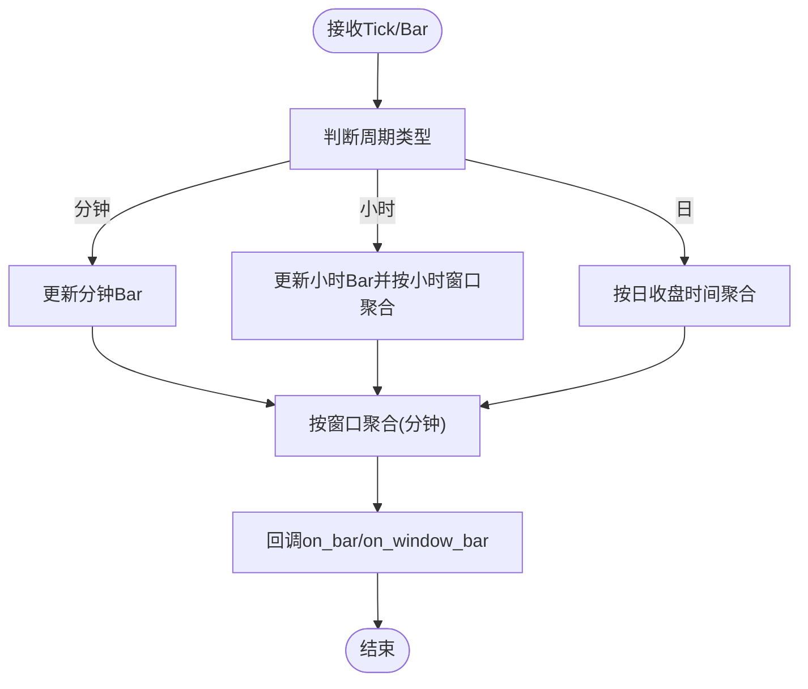
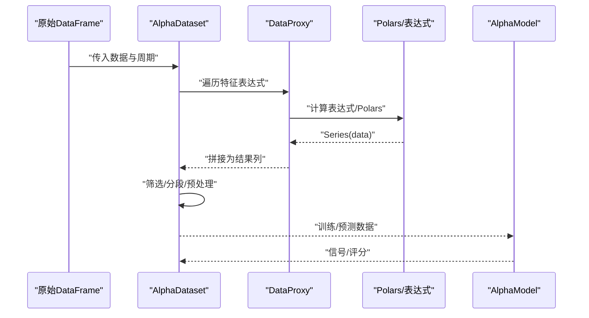
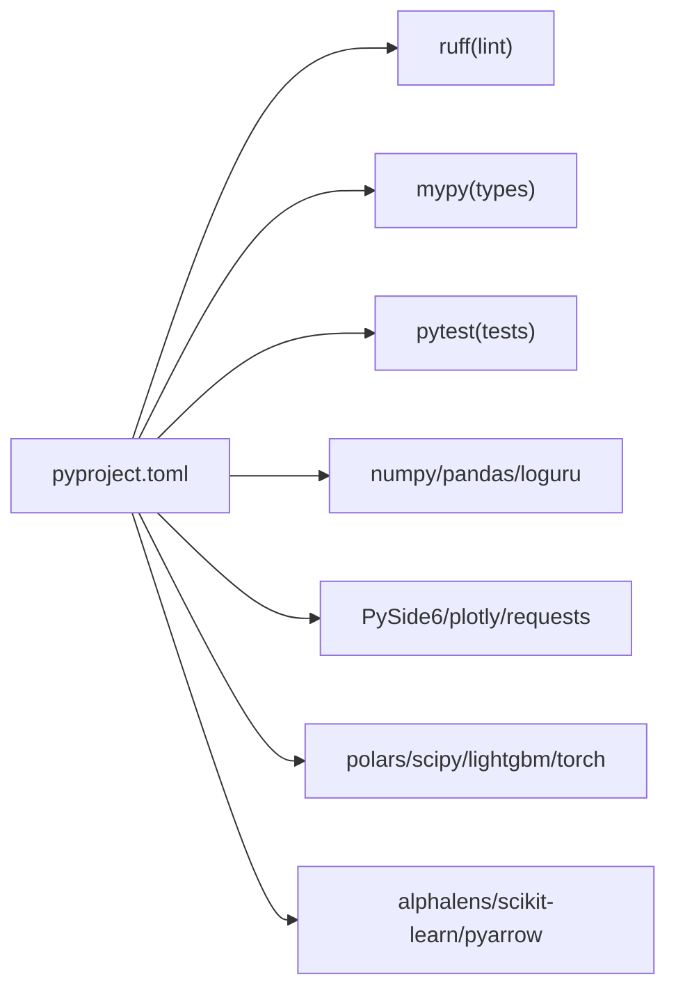

# 开发指南

<cite>
**本文引用的文件列表**
- [README.md](file://README.md)
- [CHANGELOG.md](file://CHANGELOG.md)
- [pyproject.toml](file://pyproject.toml)
- [vnpy/__init__.py](file://vnpy/__init__.py)
- [vnpy/event/engine.py](file://vnpy/event/engine.py)
- [vnpy/trader/engine.py](file://vnpy/trader/engine.py)
- [vnpy/trader/object.py](file://vnpy/trader/object.py)
- [vnpy/trader/utility.py](file://vnpy/trader/utility.py)
- [vnpy/trader/constant.py](file://vnpy/trader/constant.py)
- [vnpy/trader/app.py](file://vnpy/trader/app.py)
- [vnpy/alpha/dataset/template.py](file://vnpy/alpha/dataset/template.py)
- [vnpy/alpha/dataset/utility.py](file://vnpy/alpha/dataset/utility.py)
- [vnpy/alpha/model/template.py](file://vnpy/alpha/model/template.py)
- [tests/test_alpha101.py](file://tests/test_alpha101.py)
</cite>

## 目录
1. [简介](#简介)
2. [项目结构](#项目结构)
3. [核心组件](#核心组件)
4. [架构总览](#架构总览)
5. [详细组件分析](#详细组件分析)
6. [依赖关系分析](#依赖关系分析)
7. [性能考虑](#性能考虑)
8. [故障排查指南](#故障排查指南)
9. [结论](#结论)
10. [附录](#附录)

## 简介
本开发指南面向希望参与 VeighNa 量化交易框架开发或进行二次开发的工程师，系统阐述代码贡献流程、开发规范、测试策略、质量保证体系、扩展开发方法与最佳实践、代码审查标准、性能优化指导以及调试与问题诊断方法。文档以仓库现有代码为依据，结合配置文件与变更日志，给出可操作的开发指引。

## 项目结构
VeighNa 采用模块化组织，核心围绕“事件驱动引擎 + 主引擎 + 应用模块 + Alpha 模块”的架构展开；同时提供 Alpha 因子工程、模型训练与策略回测的完整工作流。

**图表来源**
- [vnpy/event/engine.py](file://vnpy/event/engine.py#L33-L146)
- [vnpy/trader/engine.py](file://vnpy/trader/engine.py#L81-L324)
- [vnpy/trader/object.py](file://vnpy/trader/object.py#L17-L428)
- [vnpy/trader/utility.py](file://vnpy/trader/utility.py#L166-L486)
- [vnpy/trader/constant.py](file://vnpy/trader/constant.py#L10-L161)
- [vnpy/trader/app.py](file://vnpy/trader/app.py#L10-L22)
- [vnpy/alpha/dataset/template.py](file://vnpy/alpha/dataset/template.py#L23-L306)
- [vnpy/alpha/dataset/utility.py](file://vnpy/alpha/dataset/utility.py#L19-L286)
- [vnpy/alpha/model/template.py](file://vnpy/alpha/model/template.py#L9-L31)

**章节来源**
- [README.md](file://README.md#L1-L343)
- [pyproject.toml](file://pyproject.toml#L1-L124)

## 核心组件
- 事件驱动引擎：提供事件分发、定时事件与线程安全队列，是整个系统异步与解耦的基础。
- 主引擎：集中管理网关、应用引擎、通知通道（邮件/微信），并提供统一的交易接口入口。
- 基础数据结构：统一的 Tick/Bar/Order/Trade/Position/Account/Contract/Quote 等数据对象，确保跨模块一致的数据契约。
- 通用工具：K线合成器、数组管理器、数值处理与取整工具等，支撑策略与回测。
- Alpha 模块：数据集模板（表达式/Polars 计算、分段划分、预处理管线）、数据代理（表达式 DSL）、模型模板（训练/预测接口）。

**章节来源**
- [vnpy/event/engine.py](file://vnpy/event/engine.py#L33-L146)
- [vnpy/trader/engine.py](file://vnpy/trader/engine.py#L81-L324)
- [vnpy/trader/object.py](file://vnpy/trader/object.py#L17-L428)
- [vnpy/trader/utility.py](file://vnpy/trader/utility.py#L166-L486)
- [vnpy/alpha/dataset/template.py](file://vnpy/alpha/dataset/template.py#L23-L306)
- [vnpy/alpha/dataset/utility.py](file://vnpy/alpha/dataset/utility.py#L19-L286)
- [vnpy/alpha/model/template.py](file://vnpy/alpha/model/template.py#L9-L31)

## 架构总览
下图展示了从事件驱动到主引擎、再到应用与 Alpha 工作流的整体交互。

**图表来源**
- [vnpy/event/engine.py](file://vnpy/event/engine.py#L33-L146)
- [vnpy/trader/engine.py](file://vnpy/trader/engine.py#L81-L324)
- [vnpy/alpha/dataset/template.py](file://vnpy/alpha/dataset/template.py#L90-L194)
- [vnpy/alpha/model/template.py](file://vnpy/alpha/model/template.py#L9-L31)

## 详细组件分析

### 事件驱动引擎
- 职责：事件队列、处理器注册、定时事件、线程生命周期管理。
- 关键点：事件类型与通用处理器分离；定时器线程与事件处理线程分离；避免重复注册。

**图表来源**
- [vnpy/event/engine.py](file://vnpy/event/engine.py#L16-L146)

**章节来源**
- [vnpy/event/engine.py](file://vnpy/event/engine.py#L33-L146)

### 主引擎与订单管理引擎
- 主引擎职责：事件引擎初始化、网关/应用注册、统一交易入口、通知通道（邮件/微信）。
- 订单管理引擎职责：聚合 Tick/Order/Trade/Position/Account/Contract/Quote，维护活跃委托/报价，提供查询与转换接口。

**图表来源**
- [vnpy/trader/engine.py](file://vnpy/trader/engine.py#L81-L324)

**章节来源**
- [vnpy/trader/engine.py](file://vnpy/trader/engine.py#L81-L324)

### 基础数据结构与常量
- 数据结构：Tick/Bar/Order/Trade/Position/Account/Contract/Quote 及请求对象，统一 vt_symbol/vt_orderid/vt_tradeid 等标识。
- 常量：Direction/Offset/Status/Product/OrderType/OptionType/Exchange/Currency/Interval 等枚举。

**图表来源**
- [vnpy/trader/object.py](file://vnpy/trader/object.py#L17-L428)

**章节来源**
- [vnpy/trader/object.py](file://vnpy/trader/object.py#L17-L428)
- [vnpy/trader/constant.py](file://vnpy/trader/constant.py#L10-L161)

### 通用工具：K线合成与技术指标
- BarGenerator：支持分钟/小时/日周期合成，支持 N 分钟/小时窗口聚合。
- ArrayManager：基于 numpy+ta-lib 的技术指标容器，提供 SMA/EMA/KAMA/WMA/APO/CMO/PPO/ROC/ROCR/ROCP/TRIX/STD 等。

**图表来源**
- [vnpy/trader/utility.py](file://vnpy/trader/utility.py#L166-L486)

**章节来源**
- [vnpy/trader/utility.py](file://vnpy/trader/utility.py#L166-L486)

### Alpha 模块：数据集与表达式计算
- AlphaDataset：表达式/Polars 双通道计算、分段划分（训练/验证/测试）、预处理管线、性能分析。
- DataProxy：表达式 DSL 的数据代理，支持 + - * / // % ** 与比较运算，统一返回 Int32 结果以适配比较语义。
- 模型模板：统一 fit/predict/detail 接口，便于不同算法无缝替换。

**图表来源**
- [vnpy/alpha/dataset/template.py](file://vnpy/alpha/dataset/template.py#L90-L194)
- [vnpy/alpha/dataset/utility.py](file://vnpy/alpha/dataset/utility.py#L19-L286)
- [vnpy/alpha/model/template.py](file://vnpy/alpha/model/template.py#L9-L31)

**章节来源**
- [vnpy/alpha/dataset/template.py](file://vnpy/alpha/dataset/template.py#L23-L306)
- [vnpy/alpha/dataset/utility.py](file://vnpy/alpha/dataset/utility.py#L19-L286)
- [vnpy/alpha/model/template.py](file://vnpy/alpha/model/template.py#L9-L31)

## 依赖关系分析
- 项目使用 pyproject.toml 统一配置，核心依赖包括 PySide6、numpy、pandas、ta-lib、loguru、plotly、requests 等。
- Alpha 子模块额外依赖 polars、scipy、alphalens、scikit-learn、lightgbm、torch、pyarrow 等。
- 工具链：ruff（lint）、mypy（类型检查）、pytest（测试）。

**图表来源**
- [pyproject.toml](file://pyproject.toml#L25-L124)

**章节来源**
- [pyproject.toml](file://pyproject.toml#L1-L124)

## 性能考虑
- 事件引擎：事件队列与定时器分离线程，避免阻塞；线程安全与空闲等待。
- Alpha 表达式计算：支持多进程并行计算特征，使用 Polars 执行表达式以提升吞吐。
- K线合成：分钟/小时/日聚合逻辑避免重复计算，窗口聚合按需触发回调。
- 数据处理：ArrayManager 使用 numpy 数组与 ta-lib 指标，减少 Python 层循环。

**章节来源**
- [vnpy/event/engine.py](file://vnpy/event/engine.py#L33-L146)
- [vnpy/alpha/dataset/template.py](file://vnpy/alpha/dataset/template.py#L103-L118)
- [vnpy/trader/utility.py](file://vnpy/trader/utility.py#L166-L486)

## 故障排查指南
- 事件未到达：确认事件类型是否已注册；检查通用处理器是否被意外移除。
- 订单状态异常：核对 OmsEngine 中活跃订单集合更新逻辑；检查 OffsetConverter 是否正确更新。
- Alpha 表达式报错：检查 DataProxy 比较运算返回类型是否为 Int32；确认表达式函数是否通过 register_functions 注册。
- 测试失败：参考测试用例对极端值/空值/边界值的覆盖，定位计算与清洗环节。

**章节来源**
- [vnpy/event/engine.py](file://vnpy/event/engine.py#L111-L146)
- [vnpy/trader/engine.py](file://vnpy/trader/engine.py#L360-L588)
- [vnpy/alpha/dataset/utility.py](file://vnpy/alpha/dataset/utility.py#L36-L48)
- [tests/test_alpha101.py](file://tests/test_alpha101.py#L1-L677)

## 结论
VeighNa 以事件驱动为核心，通过主引擎与应用引擎解耦交易流程，配合 Alpha 模块形成从因子工程到模型训练与回测的闭环。遵循统一的数据契约、严格的类型与风格检查、完善的测试策略，有助于高质量扩展与二次开发。

## 附录

### 代码贡献流程与规范
- Issue 与 PR 流程：先开 Issue 讨论，再 Fork/分支/PR，遵循 ruff 与 mypy 规范。
- 提交前检查：ruff 检查、mypy 类型检查、pytest 单元测试通过。
- 变更记录：参考变更日志，确保版本号与兼容性说明清晰。

**章节来源**
- [README.md](file://README.md#L309-L339)
- [pyproject.toml](file://pyproject.toml#L89-L124)
- [CHANGELOG.md](file://CHANGELOG.md#L1-L800)

### 测试策略与质量保证
- 单元测试：pytest 驱动，覆盖 Alpha 表达式计算与极端值处理。
- 静态检查：ruff 与 mypy，确保风格与类型一致性。
- 集成验证：通过示例与回测模块验证端到端流程。

**章节来源**
- [tests/test_alpha101.py](file://tests/test_alpha101.py#L1-L677)
- [pyproject.toml](file://pyproject.toml#L89-L124)

### 扩展开发方法与最佳实践
- 新增应用：继承 BaseApp，定义 app_name/engine_class/widget_name/icon_name。
- 新增网关：实现订阅/下单/撤单/查询历史等接口，注册到 MainEngine。
- Alpha 因子：使用 DataProxy/Polars 表达式编写，必要时通过 register_functions 注册自定义函数。
- 性能优化：优先使用多进程并行与 Polars 表达式；避免在事件循环中执行阻塞操作。

**章节来源**
- [vnpy/trader/app.py](file://vnpy/trader/app.py#L10-L22)
- [vnpy/alpha/dataset/utility.py](file://vnpy/alpha/dataset/utility.py#L13-L17)
- [vnpy/alpha/dataset/template.py](file://vnpy/alpha/dataset/template.py#L81-L89)

### 代码审查标准
- 代码风格：ruff 全量检查，避免 error/warning。
- 类型标注：mypy 全量检查，禁用不完整定义与未注释装饰器。
- 可读性：命名清晰、模块职责单一、异常路径明确、日志级别恰当。
- 兼容性：遵循版本与依赖约束，避免破坏性变更。

**章节来源**
- [pyproject.toml](file://pyproject.toml#L89-L124)

### 调试技巧与问题诊断
- 事件追踪：在事件引擎中注册通用处理器，打印事件类型与数据摘要。
- 订单状态：在 OmsEngine 中断点或日志记录活跃订单集合变化。
- Alpha 表达式：分步计算，先用 Polars 表达式验证，再迁移到字符串表达式。
- 性能瓶颈：使用多进程并行与窗口聚合，避免在主线程做重型计算。

**章节来源**
- [vnpy/event/engine.py](file://vnpy/event/engine.py#L132-L146)
- [vnpy/trader/engine.py](file://vnpy/trader/engine.py#L360-L588)
- [vnpy/alpha/dataset/template.py](file://vnpy/alpha/dataset/template.py#L103-L118)