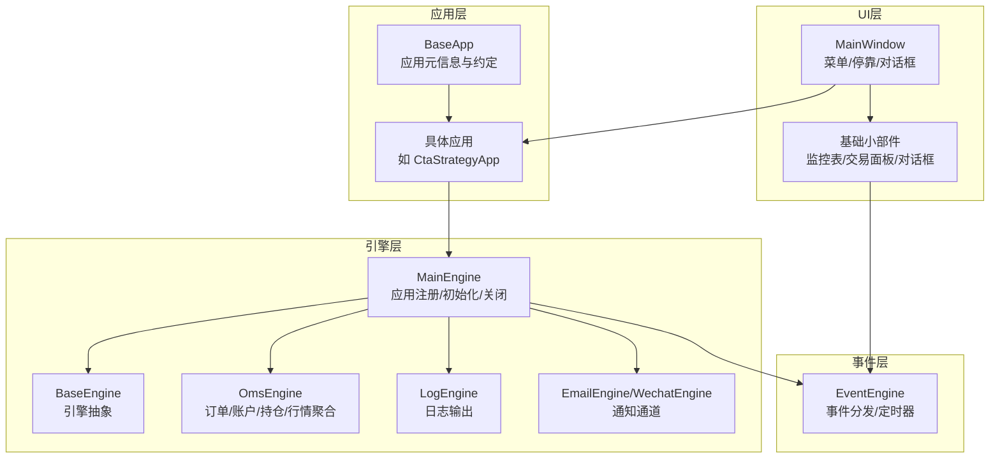
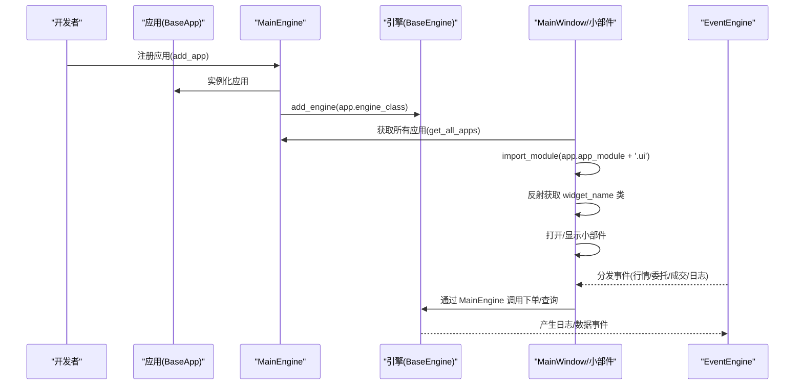
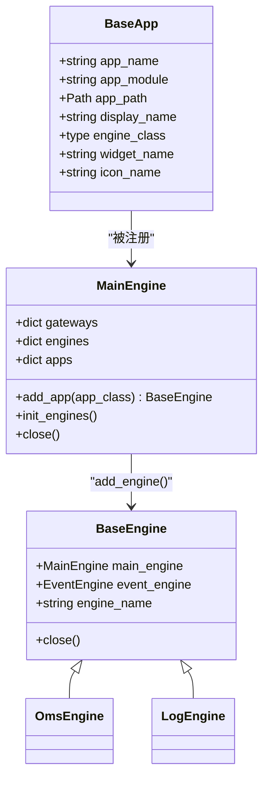
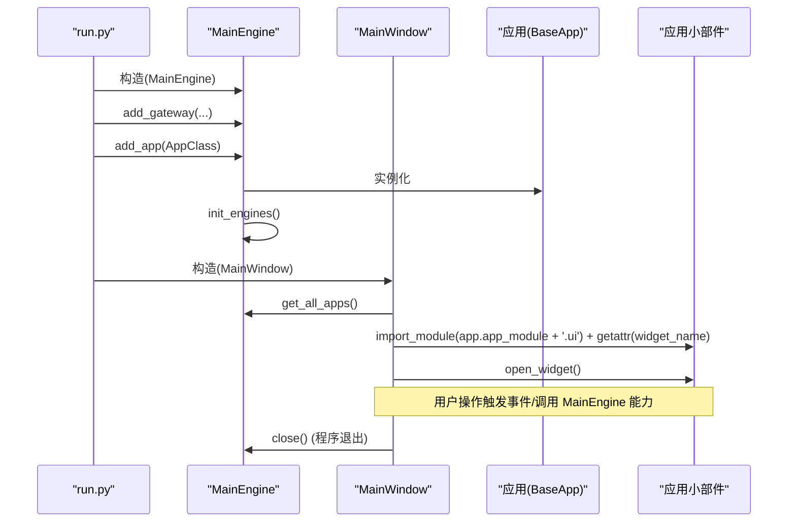
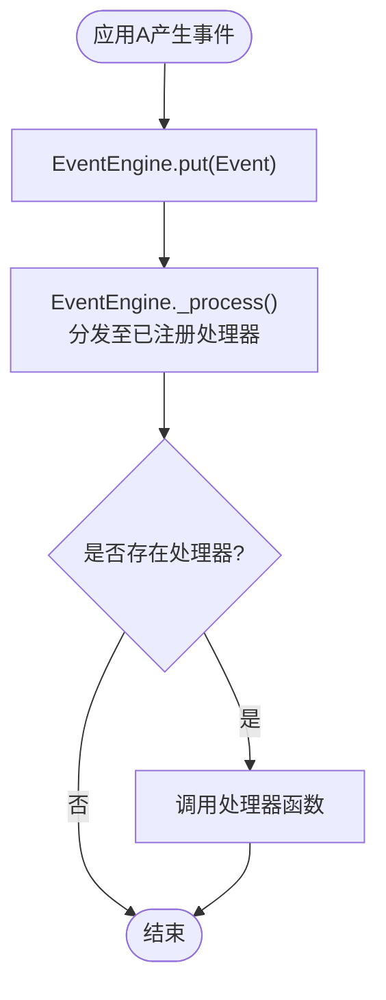
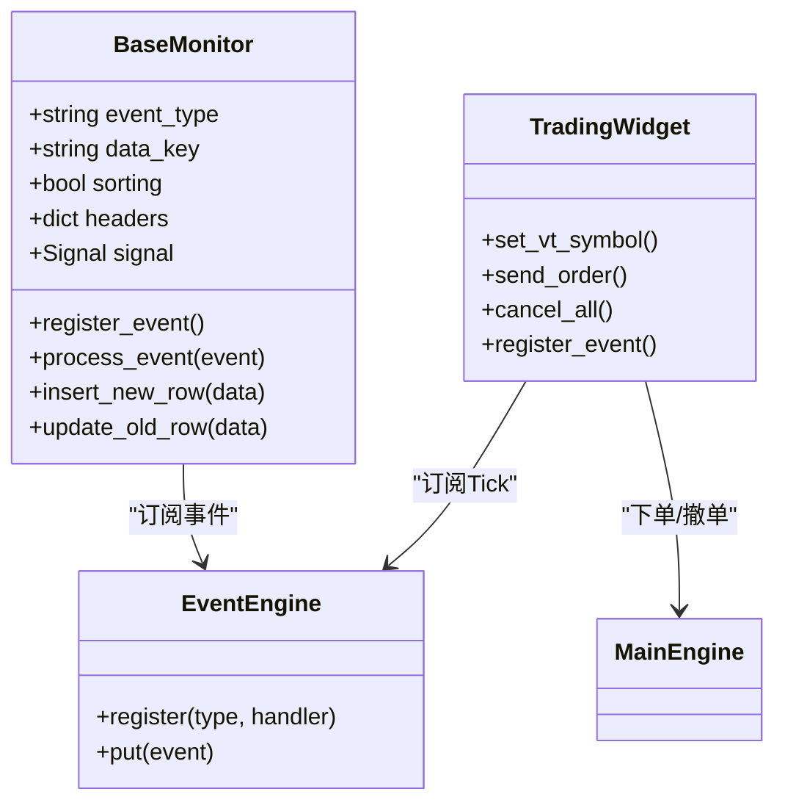
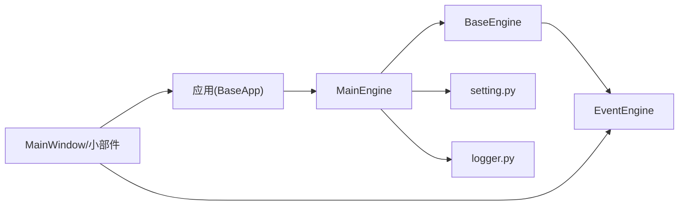

# 应用开发

<cite>
**本文引用的文件**
- [vnpy/trader/app.py](file://vnpy/trader/app.py)
- [vnpy/trader/engine.py](file://vnpy/trader/engine.py)
- [vnpy/event/engine.py](file://vnpy/event/engine.py)
- [vnpy/trader/ui/mainwindow.py](file://vnpy/trader/ui/mainwindow.py)
- [vnpy/trader/ui/widget.py](file://vnpy/trader/ui/widget.py)
- [vnpy/trader/setting.py](file://vnpy/trader/setting.py)
- [vnpy/trader/logger.py](file://vnpy/trader/logger.py)
- [vnpy/trader/object.py](file://vnpy/trader/object.py)
- [examples/veighna_trader/run.py](file://examples/veighna_trader/run.py)
</cite>

## 目录
1. [简介](#简介)
2. [项目结构](#项目结构)
3. [核心组件](#核心组件)
4. [架构总览](#架构总览)
5. [组件详解](#组件详解)
6. [依赖关系分析](#依赖关系分析)
7. [性能与可维护性建议](#性能与可维护性建议)
8. [故障排查指南](#故障排查指南)
9. [结论](#结论)
10. [附录：开发实操清单](#附录开发实操清单)

## 简介
本指南面向希望基于 VeighNa 框架开发“应用（App）”的工程师，系统阐述 BaseApp 抽象类的实现要求、生命周期管理、应用注册与启动流程、应用间通信与数据共享、UI 组件开发规范与事件处理模式，并给出配置管理、日志记录、异常处理的最佳实践。文档同时提供自定义交易应用、风控应用、监控应用的开发示例思路与参考路径，帮助开发者从需求分析到应用发布形成完整闭环。

## 项目结构
VeighNa 的应用体系围绕“主引擎 MainEngine + 引擎集合 + 应用集合 + UI 菜单/窗口”展开。应用通过继承 BaseApp 描述自身元信息（名称、模块、图标、关联引擎与 UI 小部件），由 MainEngine 在启动时统一注册并初始化对应引擎；UI 层通过菜单动态加载各应用的小部件，实现功能模块化与可插拔。

图表来源
- [vnpy/trader/app.py](file://vnpy/trader/app.py#L10-L22)
- [vnpy/trader/engine.py](file://vnpy/trader/engine.py#L81-L167)
- [vnpy/event/engine.py](file://vnpy/event/engine.py#L33-L146)
- [vnpy/trader/ui/mainwindow.py](file://vnpy/trader/ui/mainwindow.py#L40-L189)
- [vnpy/trader/ui/widget.py](file://vnpy/trader/ui/widget.py#L241-L305)

章节来源
- [vnpy/trader/app.py](file://vnpy/trader/app.py#L10-L22)
- [vnpy/trader/engine.py](file://vnpy/trader/engine.py#L81-L167)
- [vnpy/event/engine.py](file://vnpy/event/engine.py#L33-L146)
- [vnpy/trader/ui/mainwindow.py](file://vnpy/trader/ui/mainwindow.py#L40-L189)
- [vnpy/trader/ui/widget.py](file://vnpy/trader/ui/widget.py#L241-L305)

## 核心组件
- BaseApp：应用抽象类，定义应用名、模块、路径、显示名、引擎类、UI 小部件类名、图标名等关键字段，作为应用注册与 UI 加载的契约。
- BaseEngine：引擎抽象类，统一注入 MainEngine、EventEngine 与引擎名，提供 close 钩子。
- MainEngine：平台核心，负责事件引擎初始化、网关/引擎/应用注册、全局能力暴露（如获取行情、下单、查询历史等）、优雅关闭。
- EventEngine：事件驱动内核，负责事件队列、分发、通用处理器、定时器。
- UI 主窗口与基础小部件：MainWindow 动态构建菜单项并按需打开应用小部件；BaseMonitor 等小部件封装事件绑定、表格渲染、右键菜单、CSV 导出等。

章节来源
- [vnpy/trader/app.py](file://vnpy/trader/app.py#L10-L22)
- [vnpy/trader/engine.py](file://vnpy/trader/engine.py#L59-L79)
- [vnpy/trader/engine.py](file://vnpy/trader/engine.py#L81-L167)
- [vnpy/event/engine.py](file://vnpy/event/engine.py#L33-L146)
- [vnpy/trader/ui/mainwindow.py](file://vnpy/trader/ui/mainwindow.py#L40-L189)
- [vnpy/trader/ui/widget.py](file://vnpy/trader/ui/widget.py#L241-L305)

## 架构总览
下图展示应用开发与运行的关键交互：应用通过 MainEngine 注册，MainEngine 初始化对应引擎；UI 通过菜单导入应用模块并实例化其小部件；事件在 EventEngine 中流转，驱动 UI 更新与业务逻辑执行。

图表来源
- [vnpy/trader/engine.py](file://vnpy/trader/engine.py#L128-L136)
- [vnpy/trader/ui/mainwindow.py](file://vnpy/trader/ui/mainwindow.py#L128-L139)
- [vnpy/event/engine.py](file://vnpy/event/engine.py#L105-L119)

章节来源
- [vnpy/trader/engine.py](file://vnpy/trader/engine.py#L128-L136)
- [vnpy/trader/ui/mainwindow.py](file://vnpy/trader/ui/mainwindow.py#L128-L139)
- [vnpy/event/engine.py](file://vnpy/event/engine.py#L105-L119)

## 组件详解

### BaseApp 抽象类与实现要求
- 必填字段
  - app_name：应用唯一标识，用于引擎与 UI 映射
  - app_module：应用模块字符串，用于 import_module(app_module + ".ui")
  - app_path：应用绝对路径（通常由框架解析）
  - display_name：菜单中显示名称
  - engine_class：应用对应的引擎类（实现 BaseEngine）
  - widget_name：应用 UI 小部件类名（位于 app_module.ui 模块）
  - icon_name：应用图标资源名
- 生命周期
  - 注册阶段：MainEngine.add_app(app_class) 实例化应用并注册其引擎
  - 初始化阶段：MainEngine.init_engines() 会添加日志引擎与 OMS 引擎等
  - 关闭阶段：MainEngine.close() 先停止事件引擎，再依次调用各引擎与网关的 close()

图表来源
- [vnpy/trader/app.py](file://vnpy/trader/app.py#L10-L22)
- [vnpy/trader/engine.py](file://vnpy/trader/engine.py#L59-L79)
- [vnpy/trader/engine.py](file://vnpy/trader/engine.py#L81-L167)

章节来源
- [vnpy/trader/app.py](file://vnpy/trader/app.py#L10-L22)
- [vnpy/trader/engine.py](file://vnpy/trader/engine.py#L59-L79)
- [vnpy/trader/engine.py](file://vnpy/trader/engine.py#L81-L167)

### 应用注册、初始化与启动流程
- 注册应用
  - 调用 MainEngine.add_app(app_class)，实例化应用并存入 apps 字典
  - 同时通过 add_engine(app.engine_class) 创建并注册对应引擎
- 初始化引擎
  - MainEngine.init_engines() 默认注册日志引擎与 OMS 引擎，并将常用查询/转换能力暴露给上层
- 启动 UI
  - MainWindow 从 MainEngine.get_all_apps() 获取应用列表，动态导入 app_module.ui 并反射获取 widget_name
  - 用户点击菜单项后，MainWindow.open_widget(widget_class) 实例化并展示小部件
- 停止流程
  - MainWindow.closeEvent() 依次关闭已打开的小部件、保存窗口设置、调用 MainEngine.close()
  - MainEngine.close() 先停止事件引擎，再依次调用引擎与网关的 close()

图表来源
- [examples/veighna_trader/run.py](file://examples/veighna_trader/run.py#L38-L82)
- [vnpy/trader/engine.py](file://vnpy/trader/engine.py#L128-L167)
- [vnpy/trader/ui/mainwindow.py](file://vnpy/trader/ui/mainwindow.py#L128-L139)

章节来源
- [examples/veighna_trader/run.py](file://examples/veighna_trader/run.py#L38-L82)
- [vnpy/trader/engine.py](file://vnpy/trader/engine.py#L128-L167)
- [vnpy/trader/ui/mainwindow.py](file://vnpy/trader/ui/mainwindow.py#L128-L139)

### 应用间通信与数据共享
- 事件驱动
  - 各应用引擎通过 EventEngine.register(event_type, handler) 订阅事件
  - 通过 EventEngine.put(Event) 发布事件，实现跨引擎解耦通信
- 数据共享
  - OmsEngine 提供统一的数据聚合与查询接口（如 get_tick/get_order/get_position/get_account/get_contract/get_all_*）
  - 应用可通过 MainEngine 暴露的能力进行数据访问，避免直接耦合
- 通知通道
  - 日志事件通过 LogEngine 输出到控制台与文件
  - EmailEngine/WechatEngine 提供异步通知能力，支持批量消息队列与线程安全

图表来源
- [vnpy/event/engine.py](file://vnpy/event/engine.py#L66-L79)
- [vnpy/trader/engine.py](file://vnpy/trader/engine.py#L384-L393)

章节来源
- [vnpy/event/engine.py](file://vnpy/event/engine.py#L66-L79)
- [vnpy/trader/engine.py](file://vnpy/trader/engine.py#L384-L393)

### UI 组件开发规范与事件处理模式
- 基础小部件
  - BaseMonitor：封装事件注册、表格初始化、右键菜单、列宽调整、CSV 导出、设置持久化
  - TradingWidget：封装手动交易区域、交易所/代码/方向/开平/类型/价格/数量/接口选择、下单/撤单
- 事件绑定
  - BaseMonitor.register_event() 将信号与事件类型绑定，使用 event_engine.register(event_type, signal.emit)
  - 处理函数 process_event() 根据 data_key 决定插入新行或更新旧行
- 交互与数据流
  - 用户在 TradingWidget 输入参数，调用 MainEngine.send_order()/cancel_order()
  - OmsEngine 接收并更新内部状态，通过事件引擎推送日志/委托/成交/持仓等事件
  - 相关 Monitor 小部件接收事件并刷新表格

图表来源
- [vnpy/trader/ui/widget.py](file://vnpy/trader/ui/widget.py#L241-L305)
- [vnpy/trader/ui/widget.py](file://vnpy/trader/ui/widget.py#L704-L723)
- [vnpy/event/engine.py](file://vnpy/event/engine.py#L111-L119)

章节来源
- [vnpy/trader/ui/widget.py](file://vnpy/trader/ui/widget.py#L241-L305)
- [vnpy/trader/ui/widget.py](file://vnpy/trader/ui/widget.py#L704-L723)
- [vnpy/event/engine.py](file://vnpy/event/engine.py#L111-L119)

### 自定义应用开发示例思路
- 自定义交易应用
  - 定义应用类，继承 BaseApp，填写 app_name、app_module、display_name、engine_class、widget_name、icon_name
  - 实现交易引擎（继承 BaseEngine），在 __init__ 中注册所需事件处理器，实现下单/撤单/策略调度等逻辑
  - 在 app_module/ui 中提供交易小部件，绑定 TradingWidget 或自定义表格
  - 在 run.py 中调用 main_engine.add_app(YourApp)
- 自定义风控应用
  - 定义风控引擎，订阅订单/成交/账户等事件，实现风控规则判断与拦截
  - 通过 EventEngine.put(Event) 发布风控告警事件，交由日志/通知引擎处理
- 自定义监控应用
  - 定义监控小部件，继承 BaseMonitor，设置 event_type/data_key/headers
  - 在 __init__ 中调用 register_event()，实现特定数据的可视化展示

章节来源
- [vnpy/trader/app.py](file://vnpy/trader/app.py#L10-L22)
- [vnpy/trader/engine.py](file://vnpy/trader/engine.py#L59-L79)
- [vnpy/trader/ui/widget.py](file://vnpy/trader/ui/widget.py#L241-L305)
- [examples/veighna_trader/run.py](file://examples/veighna_trader/run.py#L62-L77)

### 配置管理、日志记录与异常处理最佳实践
- 配置管理
  - 全局配置 SETTINGS 位于 vt_setting.json，默认值在 setting.py 中定义
  - 使用 load_json/save_json 进行配置读写；应用可在 __init__ 中读取自身配置
- 日志记录
  - logger 使用 loguru，支持控制台与文件输出，级别由 SETTINGS 控制
  - 日志事件通过 EVENT_LOG 推送，LogEngine.process_log_event() 统一处理
- 异常处理
  - EmailEngine/WechatEngine 在发送失败时通过 MainEngine.write_log() 记录错误堆栈
  - UI 层对用户输入进行类型校验（如 QLineEdit 的 QIntValidator/QDoubleValidator）

章节来源
- [vnpy/trader/setting.py](file://vnpy/trader/setting.py#L11-L44)
- [vnpy/trader/logger.py](file://vnpy/trader/logger.py#L22-L56)
- [vnpy/trader/engine.py](file://vnpy/trader/engine.py#L325-L358)
- [vnpy/trader/ui/widget.py](file://vnpy/trader/ui/widget.py#L611-L702)

## 依赖关系分析
- 应用层依赖引擎层：应用通过 MainEngine 注册并获得引擎实例
- 引擎层依赖事件层：引擎通过 EventEngine 订阅/发布事件
- UI 层依赖应用层与事件层：通过菜单导入应用模块，反射加载小部件；通过事件驱动更新界面
- 配置与日志贯穿各层：setting.py 与 logger.py 为全局配置与日志提供基础设施

图表来源
- [vnpy/trader/app.py](file://vnpy/trader/app.py#L10-L22)
- [vnpy/trader/engine.py](file://vnpy/trader/engine.py#L81-L167)
- [vnpy/event/engine.py](file://vnpy/event/engine.py#L33-L146)
- [vnpy/trader/ui/mainwindow.py](file://vnpy/trader/ui/mainwindow.py#L40-L189)
- [vnpy/trader/setting.py](file://vnpy/trader/setting.py#L11-L44)
- [vnpy/trader/logger.py](file://vnpy/trader/logger.py#L22-L56)

章节来源
- [vnpy/trader/app.py](file://vnpy/trader/app.py#L10-L22)
- [vnpy/trader/engine.py](file://vnpy/trader/engine.py#L81-L167)
- [vnpy/event/engine.py](file://vnpy/event/engine.py#L33-L146)
- [vnpy/trader/ui/mainwindow.py](file://vnpy/trader/ui/mainwindow.py#L40-L189)
- [vnpy/trader/setting.py](file://vnpy/trader/setting.py#L11-L44)
- [vnpy/trader/logger.py](file://vnpy/trader/logger.py#L22-L56)

## 性能与可维护性建议
- 事件处理
  - 在 BaseMonitor 中禁用排序后再更新，减少不必要的重排，提高大表格刷新性能
  - 对高频事件（如 Tick）采用去抖/节流策略，避免 UI 卡顿
- 引擎设计
  - 将计算密集型任务放入独立线程或进程，仅通过事件引擎传递结果
  - 合理拆分引擎职责，避免一个引擎承担过多功能
- UI 交互
  - 使用延迟加载与懒加载策略，仅在首次打开时实例化小部件
  - 对用户输入进行即时校验，减少无效请求
- 配置与日志
  - 将敏感配置（如邮箱凭据、微信凭据）置于独立 JSON 文件，避免硬编码
  - 控制日志级别与输出目标，生产环境建议关闭控制台输出

[本节为通用建议，不直接分析具体文件]

## 故障排查指南
- 应用未出现在菜单
  - 检查 app_module 是否正确，确保存在 app_module/ui.py 且包含 widget_name 类
  - 确认 app_name 唯一，MainEngine.get_all_apps() 能返回该应用
- UI 小部件无法打开
  - 检查 MainWindow.open_widget() 中的反射是否成功
  - 确保小部件构造函数签名与 MainWindow.create_dock/open_widget 一致
- 事件不更新
  - 检查 BaseMonitor.register_event() 是否正确绑定 event_type
  - 确认 EventEngine 已启动（MainEngine.__init__ 中已 start）
- 下单/撤单无响应
  - 检查网关是否已连接，MainEngine.get_gateway 返回非空
  - 查看日志中是否有错误堆栈（MainEngine.write_log）
- 邮件/微信通知失败
  - 检查配置文件（vt_setting.json 与 wechat_setting.json）是否正确
  - 查看 EmailEngine/WechatEngine 的错误日志

章节来源
- [vnpy/trader/ui/mainwindow.py](file://vnpy/trader/ui/mainwindow.py#L128-L139)
- [vnpy/trader/ui/widget.py](file://vnpy/trader/ui/widget.py#L298-L305)
- [vnpy/event/engine.py](file://vnpy/event/engine.py#L89-L96)
- [vnpy/trader/engine.py](file://vnpy/trader/engine.py#L234-L297)
- [vnpy/trader/engine.py](file://vnpy/trader/engine.py#L590-L655)
- [vnpy/trader/engine.py](file://vnpy/trader/engine.py#L657-L800)

## 结论
通过遵循 BaseApp 的契约、利用 MainEngine 的注册与初始化机制、采用事件驱动的 UI 更新模式，开发者可以快速构建可插拔、可扩展、易维护的交易应用。配合完善的配置与日志体系、健壮的异常处理与通知通道，能够满足从策略交易到风控监控再到可视化监控的多样化场景。

[本节为总结，不直接分析具体文件]

## 附录：开发实操清单
- 定义应用类
  - 填写 app_name、app_module、display_name、engine_class、widget_name、icon_name
  - 在 app_module/ui 中提供小部件类
- 实现引擎
  - 继承 BaseEngine，在 __init__ 中注册事件处理器
  - 通过 MainEngine 暴露的能力完成下单/查询/转换等
- UI 开发
  - 继承 BaseMonitor 或 TradingWidget，设置 headers/event_type/data_key
  - 在 register_event() 中绑定事件，实现 process_event 刷新
- 注册与运行
  - 在 run.py 中调用 main_engine.add_app(YourApp)
  - 启动 MainWindow，验证菜单与小部件加载
- 配置与日志
  - 在 vt_setting.json 中配置日志、邮件、数据库等
  - 使用 logger 记录关键事件，使用 EVENT_LOG 推送日志
- 测试与发布
  - 编写单元测试覆盖事件处理与 UI 交互
  - 打包应用模块，提供安装与部署说明

章节来源
- [vnpy/trader/app.py](file://vnpy/trader/app.py#L10-L22)
- [vnpy/trader/engine.py](file://vnpy/trader/engine.py#L59-L79)
- [vnpy/trader/ui/widget.py](file://vnpy/trader/ui/widget.py#L241-L305)
- [examples/veighna_trader/run.py](file://examples/veighna_trader/run.py#L62-L77)
- [vnpy/trader/setting.py](file://vnpy/trader/setting.py#L11-L44)
- [vnpy/trader/logger.py](file://vnpy/trader/logger.py#L22-L56)