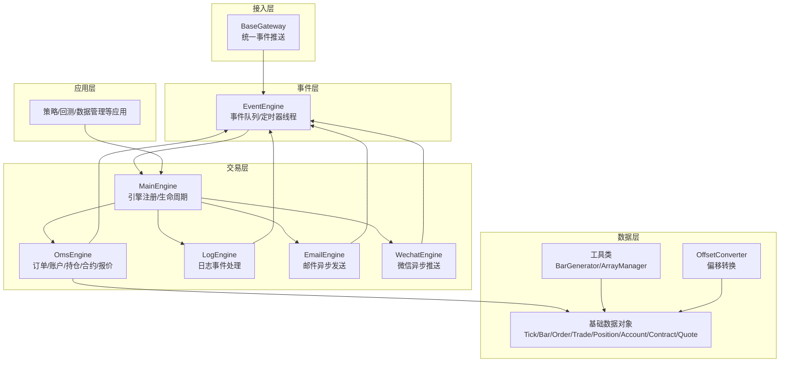
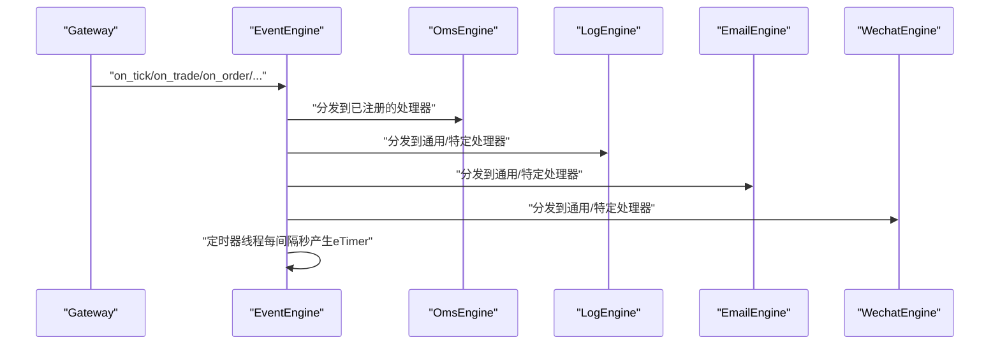
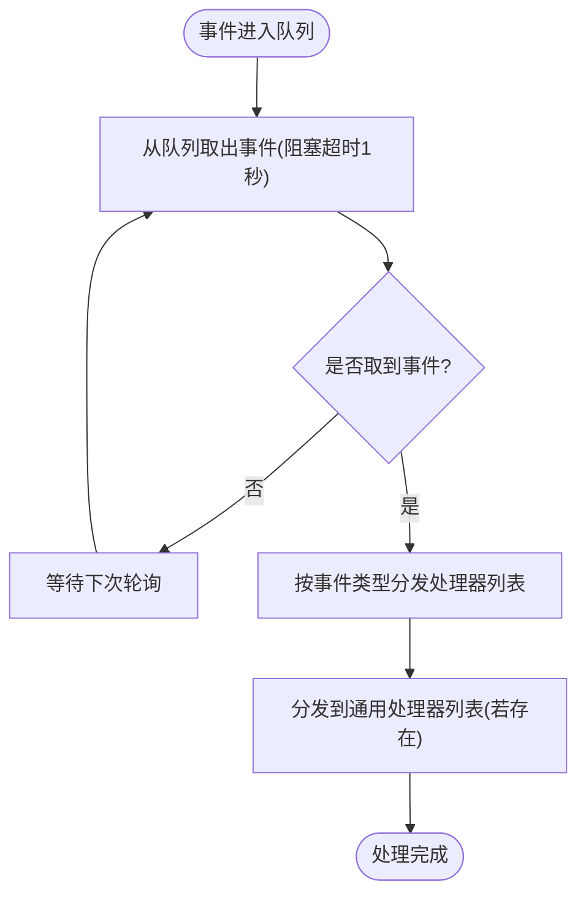
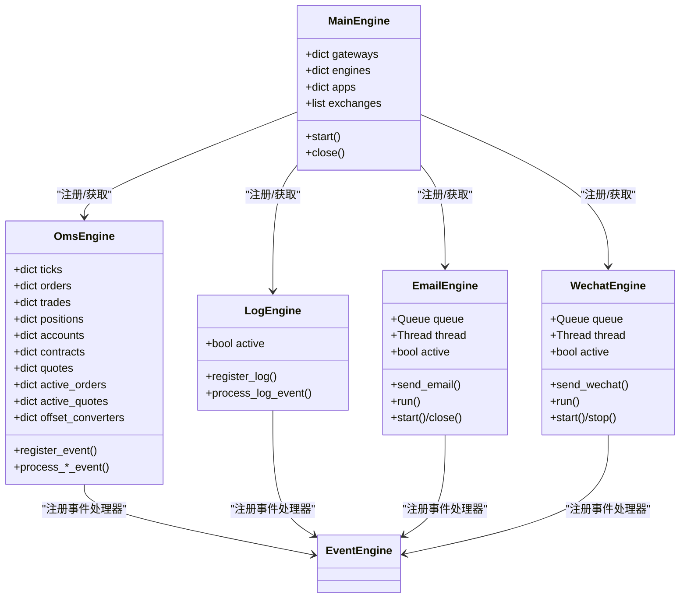
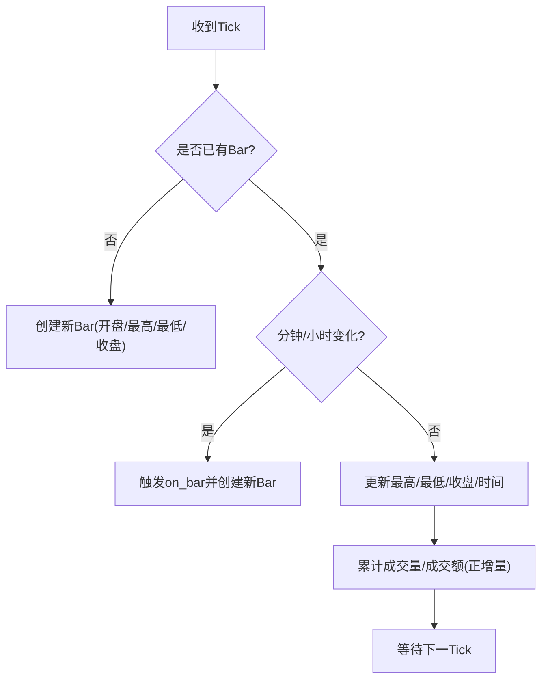
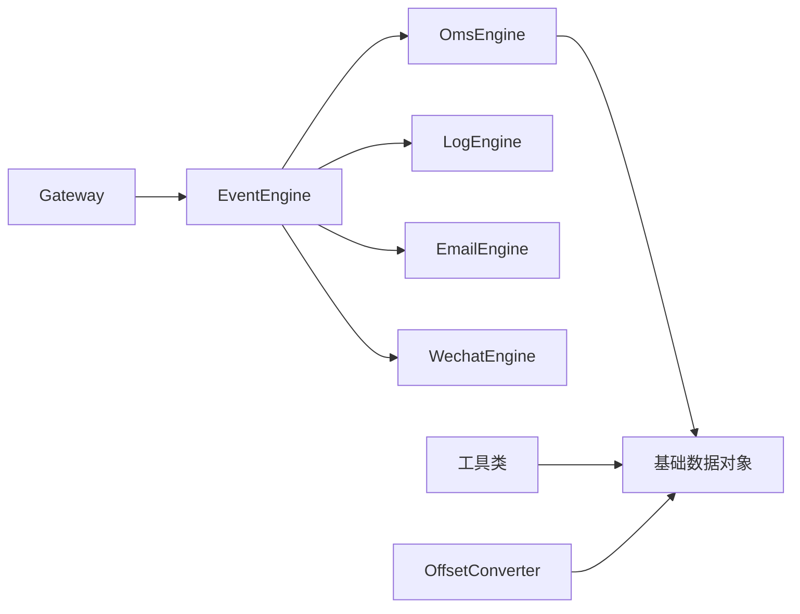

# 性能优化

<cite>
**本文引用的文件列表**
- [vnpy/event/engine.py](file://vnpy/event/engine.py)
- [vnpy/trader/engine.py](file://vnpy/trader/engine.py)
- [vnpy/trader/object.py](file://vnpy/trader/object.py)
- [vnpy/trader/utility.py](file://vnpy/trader/utility.py)
- [vnpy/trader/converter.py](file://vnpy/trader/converter.py)
- [vnpy/trader/event.py](file://vnpy/trader/event.py)
- [vnpy/trader/gateway.py](file://vnpy/trader/gateway.py)
- [vnpy/rpc/common.py](file://vnpy/rpc/common.py)
- [vnpy/trader/logger.py](file://vnpy/trader/logger.py)
- [examples/no_ui/run.py](file://examples/no_ui/run.py)
- [examples/veighna_trader/run.py](file://examples/veighna_trader/run.py)
</cite>

## 目录
1. [引言](#引言)
2. [项目结构](#项目结构)
3. [核心组件](#核心组件)
4. [架构总览](#架构总览)
5. [详细组件分析](#详细组件分析)
6. [依赖关系分析](#依赖关系分析)
7. [性能考量与优化建议](#性能考量与优化建议)
8. [故障排查指南](#故障排查指南)
9. [结论](#结论)
10. [附录](#附录)

## 引言
本指南面向VeighNa量化交易框架的性能优化需求，聚焦事件驱动架构下的性能瓶颈识别与优化方法，覆盖内存管理、垃圾回收、资源释放、算法与数据结构选择、并发处理、缓存与批处理、异步操作、性能监控与基准测试、以及生产环境调优与故障排查。文档从代码级到系统级提供可操作的优化建议，并重点讲解事件引擎、数据处理效率与内存占用控制等关键技术。

## 项目结构
VeighNa采用模块化设计，核心围绕事件引擎、交易引擎、网关层与应用层展开。事件引擎负责跨组件解耦与异步分发；交易引擎承载订单、账户、持仓等业务状态；网关层对接外部市场数据与交易通道；应用层（如策略、回测）基于事件与数据进行业务逻辑处理。

图表来源
- [vnpy/event/engine.py](file://vnpy/event/engine.py#L33-L146)
- [vnpy/trader/engine.py](file://vnpy/trader/engine.py#L81-L324)
- [vnpy/trader/object.py](file://vnpy/trader/object.py#L17-L428)
- [vnpy/trader/utility.py](file://vnpy/trader/utility.py#L166-L486)
- [vnpy/trader/converter.py](file://vnpy/trader/converter.py#L17-L403)
- [vnpy/trader/gateway.py](file://vnpy/trader/gateway.py#L33-L159)

章节来源
- [vnpy/event/engine.py](file://vnpy/event/engine.py#L1-L146)
- [vnpy/trader/engine.py](file://vnpy/trader/engine.py#L1-L839)

## 核心组件
- 事件引擎：基于队列与两个线程（事件处理与定时器），支持通用处理器与按类型处理器注册，提供高性能的事件分发。
- 交易引擎：MainEngine统一管理各功能引擎（日志、订单、邮件、微信），并负责生命周期与资源释放。
- 数据对象：使用dataclass定义的轻量数据载体，便于序列化与内存复用。
- 工具类：BarGenerator用于K线合成，ArrayManager基于NumPy数组进行高效技术指标计算。
- 偏移转换：OffsetConverter根据合约规则与持仓状态进行开平仓/锁仓/净仓转换。
- 网关：BaseGateway统一事件推送，确保回调非阻塞与线程安全。

章节来源
- [vnpy/event/engine.py](file://vnpy/event/engine.py#L33-L146)
- [vnpy/trader/engine.py](file://vnpy/trader/engine.py#L59-L324)
- [vnpy/trader/object.py](file://vnpy/trader/object.py#L17-L428)
- [vnpy/trader/utility.py](file://vnpy/trader/utility.py#L166-L800)
- [vnpy/trader/converter.py](file://vnpy/trader/converter.py#L17-L403)
- [vnpy/trader/gateway.py](file://vnpy/trader/gateway.py#L33-L159)

## 架构总览
事件驱动是VeighNa的核心，事件引擎在独立线程中消费队列事件，定时器线程周期性生成“eTimer”事件。各引擎通过事件类型进行解耦，避免直接耦合带来的性能与扩展问题。

图表来源
- [vnpy/event/engine.py](file://vnpy/event/engine.py#L55-L87)
- [vnpy/trader/gateway.py](file://vnpy/trader/gateway.py#L86-L158)
- [vnpy/trader/engine.py](file://vnpy/trader/engine.py#L325-L358)

## 详细组件分析

### 事件引擎（EventEngine）
- 设计要点
  - 使用队列存储事件，线程安全；事件处理线程与定时器线程分离，降低竞争。
  - 支持按事件类型与通用处理器注册，事件到达后先按类型分发，再分发给通用处理器。
  - 定时器线程按固定间隔产生“eTimer”，用于周期性任务。
- 性能关注点
  - 队列阻塞超时设置为1秒，避免长时间阻塞导致停止信号无法及时响应。
  - 处理器列表为默认字典+列表，查找成本低；通用处理器仅在存在时遍历。
  - 注册/注销去重，避免重复注册导致的重复处理。
- 优化建议
  - 控制事件类型数量与处理器数量，避免过多分支导致处理链过长。
  - 将高频事件处理器保持轻量，必要时拆分为多个小处理器或引入批处理。
  - 对通用处理器进行限流或过滤，减少对特定类型事件的无谓处理。

图表来源
- [vnpy/event/engine.py](file://vnpy/event/engine.py#L55-L87)

章节来源
- [vnpy/event/engine.py](file://vnpy/event/engine.py#L33-L146)

### 交易引擎（MainEngine/OmsEngine/日志/邮件/微信）
- MainEngine
  - 负责引擎注册、生命周期管理、事件引擎启动与关闭。
  - 提供连接、订阅、下单、撤单、查询历史等入口，统一写日志事件。
- OmsEngine
  - 维护各类数据字典（最新tick、订单、成交、持仓、账户、合约、报价）。
  - 维护活跃订单/报价集合，按状态更新。
  - 通过事件类型注册处理器，处理来自网关的数据。
- 日志/邮件/微信引擎
  - 日志：注册日志事件处理器，按级别输出。
  - 邮件：异步线程+队列，避免阻塞主线程。
  - 微信：异步线程+队列，支持限流与去抖。

图表来源
- [vnpy/trader/engine.py](file://vnpy/trader/engine.py#L81-L324)
- [vnpy/trader/engine.py](file://vnpy/trader/engine.py#L325-L588)
- [vnpy/trader/engine.py](file://vnpy/trader/engine.py#L590-L655)
- [vnpy/trader/engine.py](file://vnpy/trader/engine.py#L657-L800)

章节来源
- [vnpy/trader/engine.py](file://vnpy/trader/engine.py#L81-L839)

### 数据对象与工具类
- 数据对象
  - 使用dataclass定义，字段明确，便于序列化与内存复用；vt_symbol等标识符在__post_init__中生成，避免重复计算。
- BarGenerator
  - 从tick合成分钟K线，支持窗口聚合（x分钟/小时/日）；对volume/turnover采用增量累加，避免重复计算。
- ArrayManager
  - 基于NumPy数组滑窗，提供多种技术指标（SMA/EMA/KAMA/WMA等），通过talib加速计算。

图表来源
- [vnpy/trader/utility.py](file://vnpy/trader/utility.py#L204-L261)

章节来源
- [vnpy/trader/object.py](file://vnpy/trader/object.py#L17-L428)
- [vnpy/trader/utility.py](file://vnpy/trader/utility.py#L166-L486)

### 偏移转换（OffsetConverter）
- 根据合约属性与交易所规则，将下单请求转换为符合市场的开平仓组合。
- 支持锁仓、净仓、上期所/INE特殊规则等，保证合规与风控。

章节来源
- [vnpy/trader/converter.py](file://vnpy/trader/converter.py#L17-L403)

### 网关（BaseGateway）
- 统一事件推送接口，确保回调非阻塞与线程安全。
- 自动重连、查询账户/持仓/订单/成交/合约等，保证初始状态一致。

章节来源
- [vnpy/trader/gateway.py](file://vnpy/trader/gateway.py#L33-L159)

## 依赖关系分析
- 事件引擎被所有引擎依赖，是系统中枢；网关通过事件引擎向系统注入数据。
- OmsEngine持有大量字典，是数据热点；应关注其访问模式与内存增长。
- 工具类（BarGenerator/ArrayManager）依赖第三方库（NumPy/talib），需注意版本兼容与性能差异。
- 日志/邮件/微信引擎通过队列与线程实现异步，避免阻塞事件循环。

图表来源
- [vnpy/trader/gateway.py](file://vnpy/trader/gateway.py#L86-L158)
- [vnpy/event/engine.py](file://vnpy/event/engine.py#L55-L87)
- [vnpy/trader/engine.py](file://vnpy/trader/engine.py#L325-L588)

章节来源
- [vnpy/trader/engine.py](file://vnpy/trader/engine.py#L81-L324)
- [vnpy/trader/object.py](file://vnpy/trader/object.py#L17-L428)
- [vnpy/trader/utility.py](file://vnpy/trader/utility.py#L166-L486)
- [vnpy/trader/converter.py](file://vnpy/trader/converter.py#L17-L403)

## 性能考量与优化建议

### 事件引擎优化
- 事件类型与处理器数量控制
  - 事件类型过多会增加查找与分发成本；建议合并语义相近的事件类型或引入命名空间前缀。
  - 处理器数量应限制在合理范围，避免链式处理过长。
- 定时器粒度与频率
  - 定时器间隔越短，CPU占用越高；根据业务需要调整间隔，避免不必要的高频轮询。
- 队列容量与阻塞策略
  - 队列阻塞超时为1秒，可在高吞吐场景下评估是否需要更短超时或批量出队策略。
- 通用处理器与特定处理器
  - 通用处理器仅在确有需要时启用，避免对所有事件进行二次处理。

章节来源
- [vnpy/event/engine.py](file://vnpy/event/engine.py#L42-L103)

### 内存管理与垃圾回收
- 数据对象复用
  - dataclass对象频繁创建与销毁会增加GC压力；尽量复用不变对象或使用对象池（视业务场景）。
- 字典与集合的清理
  - OmsEngine维护大量字典，建议定期清理无效键（如非活跃订单/报价），防止内存泄漏。
- 数组与滑窗
  - ArrayManager使用NumPy数组滑窗，注意数组大小与内存占用；在高并发场景下可考虑分片或共享内存。
- 日志/邮件/微信队列
  - 队列长度应受控，避免堆积导致内存膨胀；可配置最大队列长度与丢弃策略。

章节来源
- [vnpy/trader/object.py](file://vnpy/trader/object.py#L17-L428)
- [vnpy/trader/engine.py](file://vnpy/trader/engine.py#L360-L588)
- [vnpy/trader/utility.py](file://vnpy/trader/utility.py#L488-L800)

### 并发处理与线程模型
- 线程分离
  - 事件处理线程与定时器线程分离，降低竞争；确保处理器内部无阻塞操作。
- 网关回调
  - 网关回调必须非阻塞，避免阻塞事件引擎线程；将耗时逻辑放入后台线程或队列。
- 异步引擎
  - 邮件与微信引擎采用独立线程+队列，避免阻塞事件循环；注意线程安全与优雅停机。

章节来源
- [vnpy/trader/gateway.py](file://vnpy/trader/gateway.py#L33-L159)
- [vnpy/trader/engine.py](file://vnpy/trader/engine.py#L590-L800)

### 缓存策略与批处理
- 缓存热点数据
  - OmsEngine中的字典为热点数据，建议结合LRU或定期清理策略，避免无限增长。
- 批量处理
  - 对高频事件（如Tick）可采用批量聚合后再处理，减少处理器调用次数。
- 合成K线批处理
  - BarGenerator在分钟切换时触发on_bar，可将多个Bar合并为窗口事件，减少回调次数。

章节来源
- [vnpy/trader/engine.py](file://vnpy/trader/engine.py#L360-L588)
- [vnpy/trader/utility.py](file://vnpy/trader/utility.py#L166-L486)

### 异步操作与资源释放
- 异步发送
  - 邮件与微信通过队列与线程异步发送，避免阻塞事件循环；注意异常处理与日志记录。
- 资源释放
  - MainEngine在关闭时先停止事件引擎，再依次关闭各引擎与网关，确保有序释放。
  - 网关需实现自动重连与资源清理，避免连接泄漏。

章节来源
- [vnpy/trader/engine.py](file://vnpy/trader/engine.py#L310-L324)
- [vnpy/trader/engine.py](file://vnpy/trader/engine.py#L590-L800)
- [vnpy/trader/gateway.py](file://vnpy/trader/gateway.py#L160-L273)

### 性能监控与基准测试
- 指标建议
  - 事件队列长度、事件处理耗时、处理器执行耗时分布、定时器延迟、内存占用、GC次数与耗时。
- 基准测试
  - 使用示例脚本（如无UI运行）模拟真实交易场景，统计吞吐量与延迟。
  - 在不同数据规模与处理器数量下进行压测，定位瓶颈。
- 压力测试
  - 模拟高并发Tick/订单/成交事件，观察事件引擎与各处理器的负载情况。
- 生产监控
  - 结合日志与外部监控系统，持续跟踪关键指标，异常时告警并自动降级。

章节来源
- [examples/no_ui/run.py](file://examples/no_ui/run.py#L56-L95)
- [examples/veighna_trader/run.py](file://examples/veighna_trader/run.py#L38-L82)

### 生产环境调优与故障排查
- 调优要点
  - 合理设置事件引擎间隔与处理器数量；控制日志级别与输出目标，避免I/O成为瓶颈。
  - 对高频处理器进行限流与去抖，避免重复处理。
  - 网关侧做好限速与重试策略，避免上游限流或熔断。
- 故障排查
  - 事件积压：检查处理器是否阻塞、是否存在过多通用处理器、队列超时设置是否合理。
  - 内存泄漏：检查OmsEngine字典是否清理、队列是否堆积、日志/邮件/微信线程是否正常退出。
  - 定时器异常：确认定时器线程未被阻塞，事件引擎停止顺序正确。

章节来源
- [vnpy/trader/logger.py](file://vnpy/trader/logger.py#L1-L56)
- [vnpy/rpc/common.py](file://vnpy/rpc/common.py#L1-L11)

## 故障排查指南
- 事件积压
  - 现象：事件队列长度持续增长，事件处理延迟升高。
  - 排查：检查处理器是否阻塞、通用处理器是否过多、事件类型是否冗余。
- 定时器不生效
  - 现象：定时器事件未按时产生。
  - 排查：确认事件引擎已启动、定时器线程未被阻塞、间隔参数正确。
- 内存增长
  - 现象：内存持续上涨，GC频繁。
  - 排查：检查OmsEngine字典是否清理、队列是否堆积、日志/邮件/微信线程是否退出。
- 网关回调阻塞
  - 现象：事件引擎卡顿。
  - 排查：确认网关回调非阻塞、耗时逻辑异步化、避免在回调中进行网络I/O。

章节来源
- [vnpy/event/engine.py](file://vnpy/event/engine.py#L55-L103)
- [vnpy/trader/gateway.py](file://vnpy/trader/gateway.py#L86-L158)
- [vnpy/trader/engine.py](file://vnpy/trader/engine.py#L310-L324)

## 结论
VeighNa的事件驱动架构提供了良好的解耦与扩展能力，但高性能运行依赖于合理的事件类型设计、处理器优化、内存与GC控制、并发模型与异步化策略。通过本指南的优化建议与故障排查方法，可在开发与生产环境中显著提升系统稳定性与性能表现。

## 附录
- 示例运行脚本可用于基准测试与压力测试，建议在不同配置下对比指标，定位瓶颈。
- 生产部署建议开启合适的日志级别与输出目标，避免I/O成为瓶颈；同时建立监控与告警体系。

章节来源
- [examples/no_ui/run.py](file://examples/no_ui/run.py#L56-L95)
- [examples/veighna_trader/run.py](file://examples/veighna_trader/run.py#L38-L82)