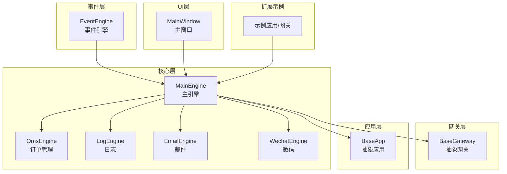
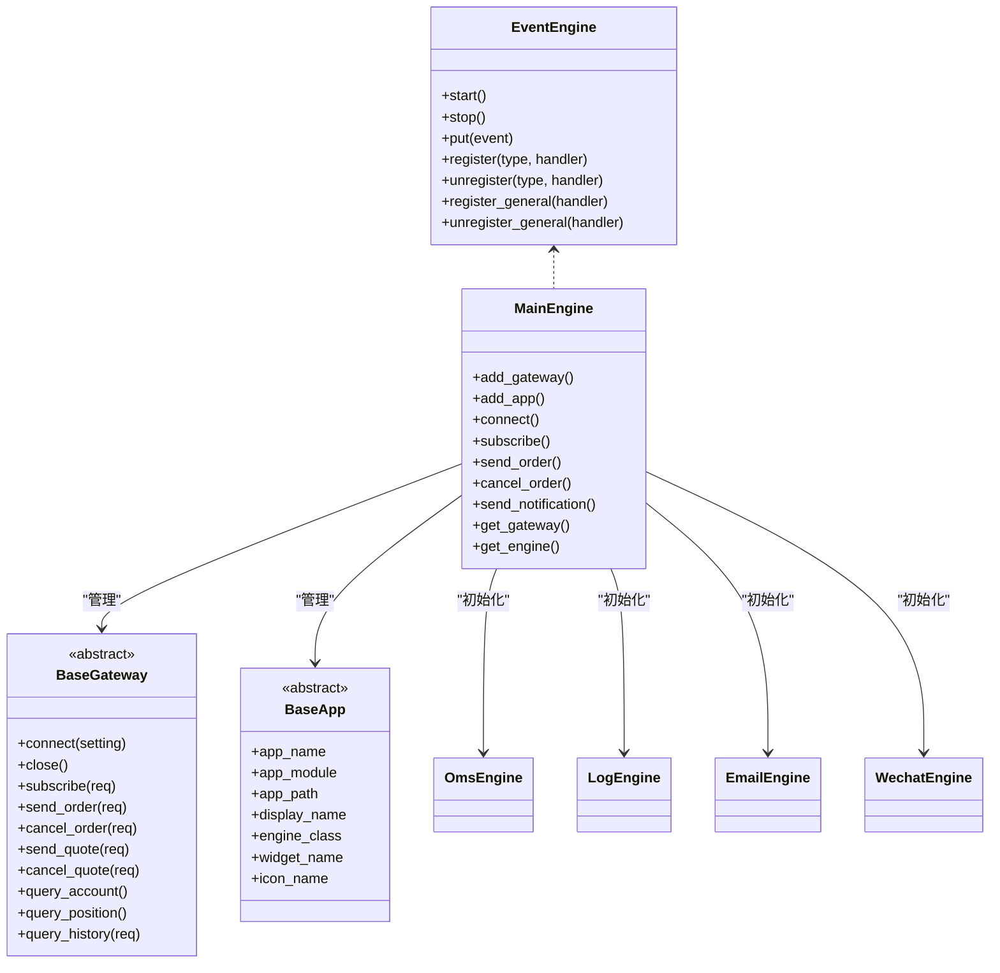
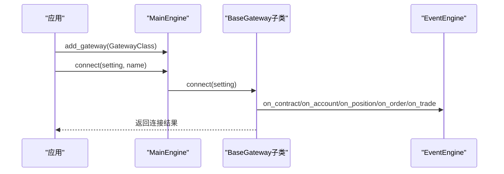
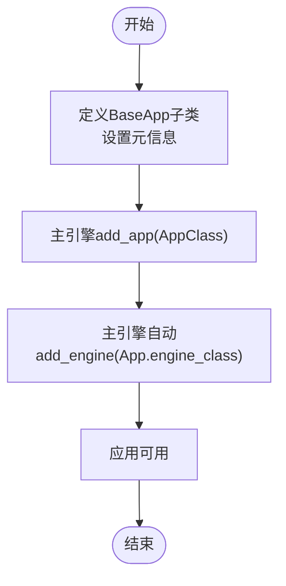
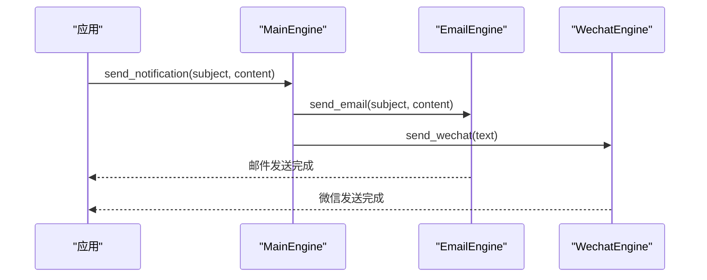
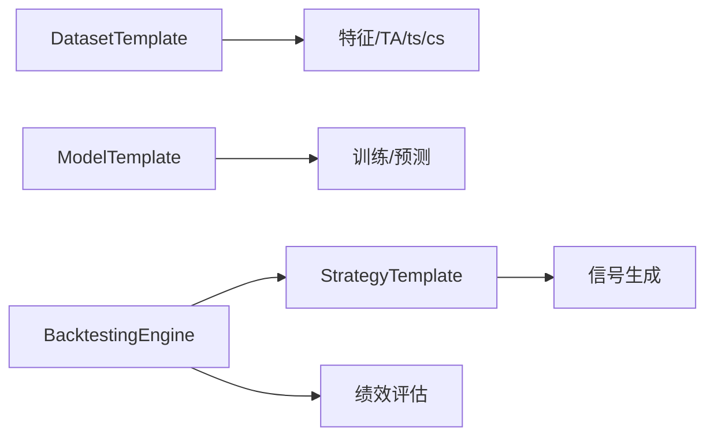
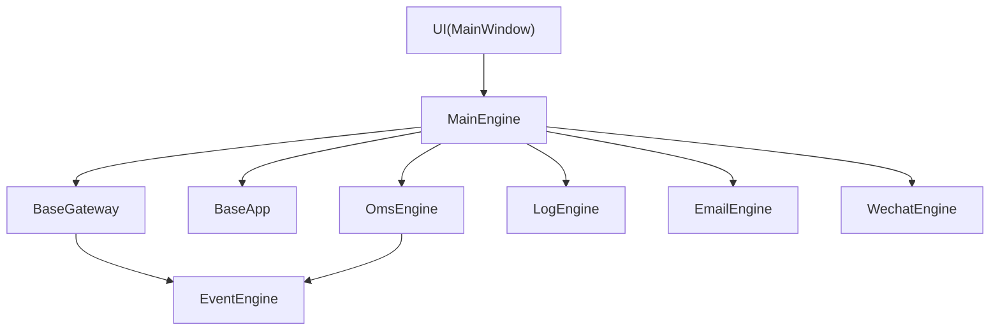

# 扩展开发

<cite>
**本文引用的文件**
- [vnpy\trader\gateway.py](file://vnpy/trader/gateway.py)
- [vnpy\trader\app.py](file://vnpy/trader/app.py)
- [vnpy\trader\engine.py](file://vnpy/trader/engine.py)
- [vnpy\trader\object.py](file://vnpy/trader/object.py)
- [vnpy\trader\event.py](file://vnpy/trader/event.py)
- [vnpy\event\engine.py](file://vnpy/event/engine.py)
- [vnpy\trader\constant.py](file://vnpy/trader/constant.py)
- [vnpy\trader\converter.py](file://vnpy/trader/converter.py)
- [vnpy\trader\setting.py](file://vnpy/trader/setting.py)
- [vnpy\trader\ui\mainwindow.py](file://vnpy/trader/ui/mainwindow.py)
- [vnpy\trader\ui\qt.py](file://vnpy/trader/ui/qt.py)
- [vnpy\trader\ui\widget.py](file://vnpy/trader/ui/widget.py)
- [vnpy\alpha\strategy\template.py](file://vnpy/alpha/strategy/template.py)
- [vnpy\alpha\strategy\backtesting.py](file://vnpy/alpha/strategy/backtesting.py)
- [vnpy\alpha\dataset\template.py](file://vnpy/alpha/dataset/template.py)
- [vnpy\alpha\model\template.py](file://vnpy/alpha/model/template.py)
- [vnpy\chart\manager.py](file://vnpy/chart/manager.py)
- [vnpy\chart\widget.py](file://vnpy/chart/widget.py)
- [vnpy\rpc\client.py](file://vnpy/rpc/client.py)
- [vnpy\rpc\server.py](file://vnpy/rpc/server.py)
- [vnpy\rpc\common.py](file://vnpy/rpc/common.py)
- [examples\veighna_trader\run.py](file://examples/veighna_trader/run.py)
</cite>

## 目录
1. [引言](#引言)
2. [项目结构](#项目结构)
3. [核心组件](#核心组件)
4. [架构总览](#架构总览)
5. [组件详解与扩展实践](#组件详解与扩展实践)
6. [依赖关系分析](#依赖关系分析)
7. [性能与内存优化](#性能与内存优化)
8. [故障排查指南](#故障排查指南)
9. [结论](#结论)
10. [附录](#附录)

## 引言
本指南面向希望在VeighNa量化交易框架上进行扩展开发的工程师，系统讲解如何开发新的交易网关、应用模块与功能扩展；解释框架的插件化架构与扩展点设计；给出自定义策略、数据源接入、通知服务扩展的完整示例；阐述事件驱动架构下的扩展模式；并总结性能优化与内存管理的最佳实践，以及第三方库集成与兼容性注意事项。文档同时提供从概念设计到生产部署的完整流程建议。

## 项目结构
VeighNa采用分层+插件化的组织方式：
- 事件驱动内核：事件引擎负责事件分发与定时器
- 核心引擎：主引擎聚合各功能引擎（如订单管理、日志、邮件、微信）
- 网关层：抽象网关类统一接入不同交易系统
- 应用层：抽象应用类统一承载业务功能模块
- UI层：基于Qt的图形界面
- Alpha/策略/图表/RPC等子模块按功能域拆分

**图示来源**
- [vnpy\event\engine.py](file://vnpy/event/engine.py#L33-L146)
- [vnpy\trader\engine.py](file://vnpy/trader/engine.py#L81-L324)
- [vnpy\trader\gateway.py](file://vnpy/trader/gateway.py#L33-L273)
- [vnpy\trader\app.py](file://vnpy/trader/app.py#L10-L22)
- [vnpy\trader\ui\mainwindow.py](file://vnpy/trader/ui/mainwindow.py)

**章节来源**
- [vnpy\event\engine.py](file://vnpy/event/engine.py#L1-L146)
- [vnpy\trader\engine.py](file://vnpy/trader/engine.py#L81-L324)
- [vnpy\trader\gateway.py](file://vnpy/trader/gateway.py#L33-L273)
- [vnpy\trader\app.py](file://vnpy/trader/app.py#L10-L22)

## 核心组件
- 事件引擎：提供事件队列、处理器注册、通用处理器、定时器
- 主引擎：集中管理网关、引擎、应用，暴露统一API
- 抽象网关：定义连接、订阅、下单、撤单、历史查询等接口
- 抽象应用：定义应用元信息与引擎绑定
- 数据对象：统一的市场、订单、账户、合约等数据模型
- 常量枚举：方向、开平、状态、产品、交易所、周期等
- 转换器：根据合约规则转换订单请求（锁仓/净仓/上期所特殊）

**章节来源**
- [vnpy\event\engine.py](file://vnpy/event/engine.py#L33-L146)
- [vnpy\trader\engine.py](file://vnpy/trader/engine.py#L81-L324)
- [vnpy\trader\gateway.py](file://vnpy/trader/gateway.py#L33-L273)
- [vnpy\trader\app.py](file://vnpy/trader/app.py#L10-L22)
- [vnpy\trader\object.py](file://vnpy/trader/object.py#L17-L428)
- [vnpy\trader\constant.py](file://vnpy/trader/constant.py#L10-L161)
- [vnpy\trader\converter.py](file://vnpy/trader/converter.py#L17-L403)

## 架构总览
VeighNa采用“事件驱动 + 插件化”的架构。事件引擎作为中枢，主引擎聚合各类功能引擎；网关负责对接外部交易系统；应用模块封装业务逻辑；UI通过主引擎交互。

**图示来源**
- [vnpy\event\engine.py](file://vnpy/event/engine.py#L33-L146)
- [vnpy\trader\engine.py](file://vnpy/trader/engine.py#L81-L324)
- [vnpy\trader\gateway.py](file://vnpy/trader/gateway.py#L33-L273)
- [vnpy\trader\app.py](file://vnpy/trader/app.py#L10-L22)

## 组件详解与扩展实践

### 交易网关扩展：开发新网关
目标：实现一个新的交易网关以接入某交易系统。

要点与约束
- 线程安全：所有方法需线程安全，避免共享可变状态
- 非阻塞：所有方法必须非阻塞
- 自动重连：连接断开后自动重连
- 回调规范：向事件引擎推送事件，回调参数为不可变数据对象
- 必须实现的方法：connect、close、subscribe、send_order、cancel_order、query_account、query_position、query_history
- 可选增强：send_quote、cancel_quote

扩展步骤
1) 定义默认名称、默认配置、支持的交易所列表
2) 实现抽象方法，完成连接、订阅、下单、撤单、查询
3) 在回调中构造数据对象并通过on_event推送
4) 在connect中先查询合约、账户、持仓、委托、成交，再写日志
5) 在主引擎中注册并启动

**图示来源**
- [vnpy\trader\engine.py](file://vnpy/trader/engine.py#L110-L127)
- [vnpy\trader\gateway.py](file://vnpy/trader/gateway.py#L160-L273)

**章节来源**
- [vnpy\trader\gateway.py](file://vnpy/trader/gateway.py#L33-L273)
- [vnpy\trader\engine.py](file://vnpy/trader/engine.py#L110-L127)

### 应用模块扩展：开发新应用
目标：新增一个业务应用模块（如策略、回测、数据管理）。

要点
- 继承BaseApp，设置app_name、app_module、display_name、engine_class、widget_name、icon_name
- 在主引擎中通过add_app注册，主引擎会自动创建对应引擎实例
- UI侧通过app_name与菜单/窗口关联

**图示来源**
- [vnpy\trader\app.py](file://vnpy/trader/app.py#L10-L22)
- [vnpy\trader\engine.py](file://vnpy/trader/engine.py#L128-L136)

**章节来源**
- [vnpy\trader\app.py](file://vnpy/trader/app.py#L10-L22)
- [vnpy\trader\engine.py](file://vnpy/trader/engine.py#L128-L136)

### 功能扩展：通知服务（邮件/微信）
目标：扩展或自定义通知通道。

要点
- 邮件：EmailEngine通过SMTP异步发送，支持队列与线程
- 微信：WechatEngine支持凭据绑定、消息队列、限速与去抖
- 主引擎提供统一入口：send_notification

**图示来源**
- [vnpy\trader\engine.py](file://vnpy/trader/engine.py#L176-L188)
- [vnpy\trader\engine.py](file://vnpy/trader/engine.py#L590-L655)
- [vnpy\trader\engine.py](file://vnpy/trader/engine.py#L657-L800)

**章节来源**
- [vnpy\trader\engine.py](file://vnpy/trader/engine.py#L590-L800)

### Alpha/策略/数据集/模型扩展
目标：在Alpha域扩展数据处理、建模与策略。

要点
- 数据集：继承数据集模板，实现特征工程、TA函数等
- 模型：继承模型模板，实现训练/预测
- 策略：继承策略模板，实现信号生成与下单逻辑
- 回测：使用回测引擎进行策略验证

**图示来源**
- [vnpy\alpha\dataset\template.py](file://vnpy/alpha/dataset/template.py)
- [vnpy\alpha\model\template.py](file://vnpy/alpha/model/template.py)
- [vnpy\alpha\strategy\template.py](file://vnpy/alpha/strategy/template.py)
- [vnpy\alpha\strategy\backtesting.py](file://vnpy/alpha/strategy/backtesting.py)

**章节来源**
- [vnpy\alpha\dataset\template.py](file://vnpy/alpha/dataset/template.py)
- [vnpy\alpha\model\template.py](file://vnpy/alpha/model/template.py)
- [vnpy\alpha\strategy\template.py](file://vnpy/alpha/strategy/template.py)
- [vnpy\alpha\strategy\backtesting.py](file://vnpy/alpha/strategy/backtesting.py)

### 图表扩展：K线/叠加指标
目标：在图表模块中添加新的显示项或指标。

要点
- 使用图表管理器与Widget进行渲染
- 通过事件驱动更新数据

**章节来源**
- [vnpy\chart\manager.py](file://vnpy/chart/manager.py)
- [vnpy\chart\widget.py](file://vnpy/chart/widget.py)

### RPC扩展：远程过程调用
目标：通过RPC实现跨进程/跨机通信。

要点
- 客户端/服务端/公共模块分离
- 通过事件或直接调用进行数据/命令传递

**章节来源**
- [vnpy\rpc\client.py](file://vnpy/rpc/client.py)
- [vnpy\rpc\server.py](file://vnpy/rpc/server.py)
- [vnpy\rpc\common.py](file://vnpy/rpc/common.py)

### UI扩展：窗口与控件
目标：为应用添加自定义界面。

要点
- 继承基础控件类，实现业务面板
- 通过主窗口集成

**章节来源**
- [vnpy\trader\ui\widget.py](file://vnpy/trader/ui/widget.py)
- [vnpy\trader\ui\qt.py](file://vnpy/trader/ui/qt.py)
- [vnpy\trader\ui\mainwindow.py](file://vnpy/trader/ui/mainwindow.py)

## 依赖关系分析
- 网关与事件引擎：网关通过事件引擎推送行情/订单/成交等事件
- 主引擎与网关/应用：主引擎统一注册、启动与调度
- 订单管理引擎：订阅并缓存各类数据，提供查询接口
- 通知引擎：邮件与微信作为独立引擎运行
- UI与主引擎：主窗口通过主引擎访问网关与引擎能力

**图示来源**
- [vnpy\trader\gateway.py](file://vnpy/trader/gateway.py#L86-L158)
- [vnpy\trader\engine.py](file://vnpy/trader/engine.py#L81-L324)
- [vnpy\event\engine.py](file://vnpy/event/engine.py#L33-L146)

**章节来源**
- [vnpy\trader\engine.py](file://vnpy/trader/engine.py#L81-L324)
- [vnpy\trader\gateway.py](file://vnpy/trader/gateway.py#L86-L158)
- [vnpy\event\engine.py](file://vnpy/event/engine.py#L33-L146)

## 性能与内存优化
- 事件驱动与非阻塞
  - 网关与引擎均需非阻塞，避免阻塞事件线程
  - 使用队列与线程池处理耗时任务
- 内存管理
  - 数据对象为不可变快照，避免共享可变状态
  - 订单/成交/持仓字典仅保留活跃数据，及时清理
- 缓存与索引
  - OmsEngine按vt_symbol/vt_orderid等键快速检索
  - 合约维度建立偏移转换器，减少重复计算
- I/O与网络
  - 网关侧批量订阅、合理心跳与重连策略
  - 邮件/微信异步发送，避免主线程阻塞
- 并发与锁
  - 避免在事件回调中持有全局锁
  - 使用不可变数据结构降低锁竞争

[本节为通用指导，无需特定文件来源]

## 故障排查指南
- 连接问题
  - 检查网关默认配置与连接参数
  - 查看日志事件是否正确推送
- 订单/成交缺失
  - 确认on_order/on_trade等回调是否触发
  - 检查OmsEngine是否注册相应事件
- 通知失败
  - 邮件：检查SMTP配置与网络
  - 微信：检查凭据绑定与发送间隔
- UI无响应
  - 确保事件引擎正常启动与停止
  - 检查主线程与UI线程分离

**章节来源**
- [vnpy\trader\engine.py](file://vnpy/trader/engine.py#L168-L188)
- [vnpy\trader\engine.py](file://vnpy/trader/engine.py#L590-L655)
- [vnpy\trader\engine.py](file://vnpy/trader/engine.py#L657-L800)
- [vnpy\event\engine.py](file://vnpy/event/engine.py#L89-L104)

## 结论
VeighNa通过事件驱动与插件化架构实现了高度解耦与可扩展性。开发者只需遵循抽象接口与线程/非阻塞约束，即可快速接入新网关、扩展应用模块与功能。配合统一的数据模型、订单转换器与通知引擎，可在保证性能与稳定性的同时，灵活满足复杂交易场景需求。

[本节为总结，无需特定文件来源]

## 附录

### 从概念到生产的完整流程
- 设计阶段：明确网关/应用职责、数据流、事件边界
- 开发阶段：实现抽象类、编写事件回调、接入配置与日志
- 集成阶段：在主引擎中注册，接入UI与菜单
- 测试阶段：单元测试+回测验证+压力测试
- 部署阶段：打包配置文件、第三方库版本锁定、监控与告警

**章节来源**
- [examples\veighna_trader\run.py](file://examples/veighna_trader/run.py#L38-L87)
- [vnpy\trader\engine.py](file://vnpy/trader/engine.py#L138-L167)
- [vnpy\trader\setting.py](file://vnpy/trader/setting.py#L11-L44)