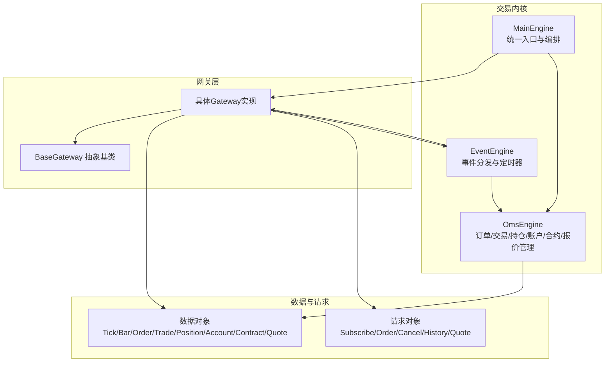
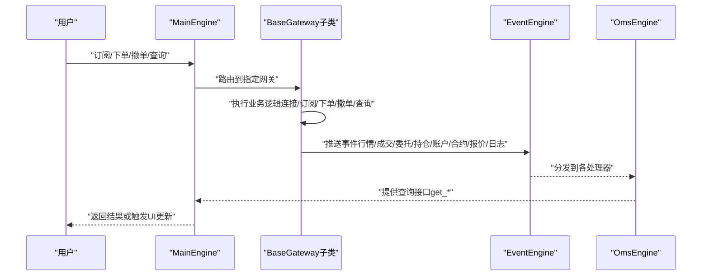
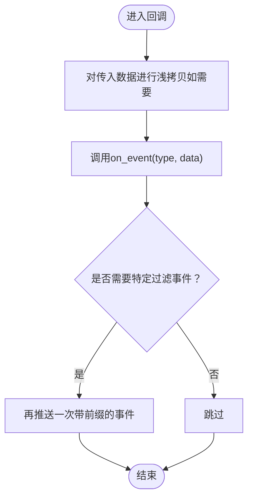
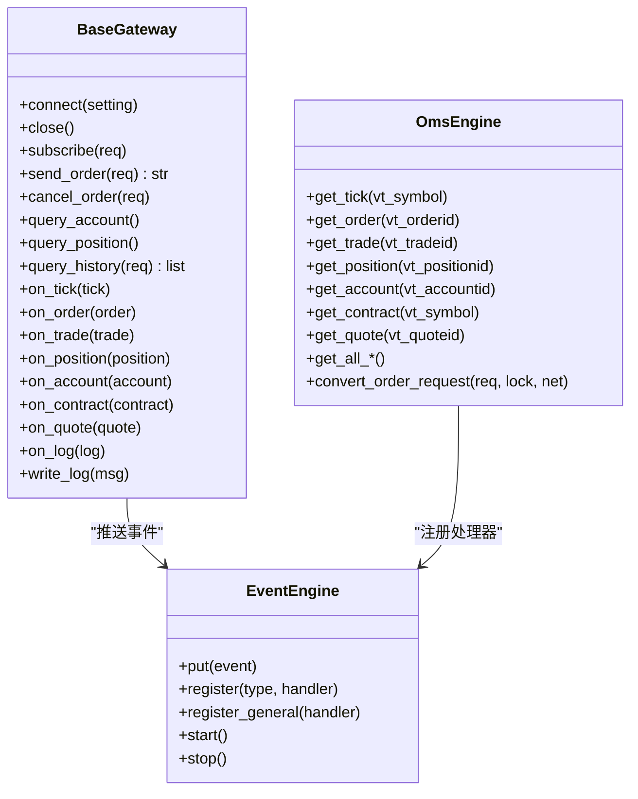

# 网关开发

<cite>
**本文引用的文件**
- [vnpy/trader/gateway.py](file://vnpy/trader/gateway.py)
- [vnpy/trader/object.py](file://vnpy/trader/object.py)
- [vnpy/trader/engine.py](file://vnpy/trader/engine.py)
- [vnpy/event/engine.py](file://vnpy/event/engine.py)
- [vnpy/trader/constant.py](file://vnpy/trader/constant.py)
- [vnpy/trader/setting.py](file://vnpy/trader/setting.py)
</cite>

## 目录
1. [引言](#引言)
2. [项目结构](#项目结构)
3. [核心组件](#核心组件)
4. [架构总览](#架构总览)
5. [详细组件分析](#详细组件分析)
6. [依赖关系分析](#依赖关系分析)
7. [性能考虑](#性能考虑)
8. [故障排查指南](#故障排查指南)
9. [结论](#结论)
10. [附录](#附录)

## 引言
本指南面向希望基于VeighNa框架开发“网关（Gateway）”的开发者，系统阐述BaseGateway抽象基类的设计原则与实现要求，明确交易、行情、账户三大接口的开发规范，并给出REST与WebSocket接入的实践路径。文档同时覆盖心跳与重连策略、错误处理、数据订阅、批量下单/撤单、事件推送机制、线程安全设计、数据对象封装等关键技术点，帮助开发者完成从接口对接到功能测试的完整闭环。

## 项目结构
VeighNa的网关体系围绕以下模块协同工作：
- 基类与数据模型：BaseGateway、各类数据对象（Tick/Order/Trade/Position/Account/Contract/Quote/Bar）、请求对象（Subscribe/Order/Cancel/History/Quote）
- 事件驱动：Event/EventEngine负责跨线程事件分发与定时器
- 核心引擎：MainEngine协调各Gateway与功能引擎（如OmsEngine），提供统一入口
- 常量与设置：Direction/Offset/Status/OrderType/Exchange等枚举，全局设置读取

图表来源
- [vnpy/trader/engine.py](file://vnpy/trader/engine.py#L81-L324)
- [vnpy/trader/gateway.py](file://vnpy/trader/gateway.py#L33-L273)
- [vnpy/event/engine.py](file://vnpy/event/engine.py#L33-L146)
- [vnpy/trader/object.py](file://vnpy/trader/object.py#L17-L428)

章节来源
- [vnpy/trader/engine.py](file://vnpy/trader/engine.py#L81-L324)
- [vnpy/trader/gateway.py](file://vnpy/trader/gateway.py#L33-L273)
- [vnpy/event/engine.py](file://vnpy/event/engine.py#L33-L146)
- [vnpy/trader/object.py](file://vnpy/trader/object.py#L17-L428)

## 核心组件
- BaseGateway：定义网关必须实现的方法与回调，提供通用事件推送能力；要求线程安全、非阻塞、自动重连、回调数据不可变
- 数据对象：封装市场、订单、交易、持仓、账户、合约、报价、K线等数据结构，统一vt_symbol/vt_orderid等命名规范
- 请求对象：封装订阅、下单、撤单、历史查询、报价等请求参数
- MainEngine：注册网关、转发用户指令至对应网关、汇总查询接口、启动/关闭资源
- Event/EventEngine：事件队列、处理器注册、定时器事件

章节来源
- [vnpy/trader/gateway.py](file://vnpy/trader/gateway.py#L33-L273)
- [vnpy/trader/object.py](file://vnpy/trader/object.py#L17-L428)
- [vnpy/trader/engine.py](file://vnpy/trader/engine.py#L81-L324)
- [vnpy/event/engine.py](file://vnpy/event/engine.py#L33-L146)

## 架构总览
下图展示从用户调用到网关执行再到事件回推的端到端流程。

图表来源
- [vnpy/trader/engine.py](file://vnpy/trader/engine.py#L234-L308)
- [vnpy/trader/gateway.py](file://vnpy/trader/gateway.py#L86-L158)
- [vnpy/event/engine.py](file://vnpy/event/engine.py#L105-L146)

章节来源
- [vnpy/trader/engine.py](file://vnpy/trader/engine.py#L234-L308)
- [vnpy/trader/gateway.py](file://vnpy/trader/gateway.py#L86-L158)
- [vnpy/event/engine.py](file://vnpy/event/engine.py#L105-L146)

## 详细组件分析

### BaseGateway抽象基类设计与实现要求
- 设计原则
  - 线程安全：所有方法需线程安全，避免共享可变状态
  - 非阻塞：所有公开方法不得阻塞事件线程
  - 自动重连：连接断开后应自动尝试重连
  - 回调数据不可变：传递给回调的数据对象不应被修改
- 必须实现的方法
  - 连接/关闭：connect(setting)、close()
  - 行情接口：subscribe(SubscribeRequest)
  - 交易接口：send_order(OrderRequest)、cancel_order(CancelRequest)
  - 账户接口：query_account()、query_position()
  - 可选接口：send_quote/quote_cancel/query_history
- 事件推送
  - on_tick/on_trade/on_order/on_position/on_account/on_contract/on_quote/on_log
  - write_log用于记录日志事件
- 默认配置与支持交易所
  - default_setting：默认连接参数字典
  - default_name：默认网关名称
  - exchanges：该网关支持的交易所列表

章节来源
- [vnpy/trader/gateway.py](file://vnpy/trader/gateway.py#L33-L273)

### 数据对象与请求对象
- 数据对象
  - TickData/BarData：行情与K线
  - OrderData/TradeData：委托与成交
  - PositionData：持仓
  - AccountData：账户
  - ContractData：合约
  - QuoteData：报价
  - 统一vt_symbol/vt_orderid/vt_tradeid/vt_accountid命名规则
- 请求对象
  - SubscribeRequest：订阅请求
  - OrderRequest：下单请求（含方向、类型、价格、数量、开平）
  - CancelRequest：撤单请求
  - HistoryRequest：历史数据请求
  - QuoteRequest：报价请求
- 关键行为
  - 订单/报价对象提供is_active判断活跃状态
  - 订单/报价对象提供create_cancel_request便捷方法

章节来源
- [vnpy/trader/object.py](file://vnpy/trader/object.py#L17-L428)

### 事件推送机制与线程安全
- 事件推送
  - BaseGateway通过on_event将事件放入EventEngine队列
  - 支持通用事件与特定vt_symbol/vt_orderid过滤事件
- 线程安全
  - 所有公开方法必须线程安全
  - 不要在回调中修改传入数据对象，必要时使用浅拷贝
- 定时器与心跳
  - EventEngine内置定时器事件，可用于心跳与周期性任务
  - 网关应在连接建立后按需启动心跳任务

图表来源
- [vnpy/trader/gateway.py](file://vnpy/trader/gateway.py#L86-L158)
- [vnpy/event/engine.py](file://vnpy/event/engine.py#L105-L146)

章节来源
- [vnpy/trader/gateway.py](file://vnpy/trader/gateway.py#L86-L158)
- [vnpy/event/engine.py](file://vnpy/event/engine.py#L105-L146)

### 交易接口开发规范
- 下单
  - 将OrderRequest转换为OrderData，分配唯一orderid（实例作用域内唯一）
  - 发送成功：Status.SUBMITTING；发送失败：Status.REJECTED
  - 推送on_order并返回vt_orderid
- 撤单
  - 发送撤单请求至服务器
- 批量下单/撤单
  - 在应用层将多个OrderRequest/ClearRequest拆分为多次send_order/cancel_order调用
  - 或在网关层聚合请求，但需保证每笔委托/报价的唯一标识与状态一致
- 报价接口
  - send_quote/cancel_quote按订单模式实现，返回vt_quoteid并推送on_quote

章节来源
- [vnpy/trader/gateway.py](file://vnpy/trader/gateway.py#L189-L246)
- [vnpy/trader/object.py](file://vnpy/trader/object.py#L321-L356)
- [vnpy/trader/object.py](file://vnpy/trader/object.py#L391-L428)

### 行情接口开发规范
- 订阅
  - 实现subscribe(SubscribeRequest)，建立与行情源的订阅通道
  - 推送on_tick以驱动UI与策略
- 心跳与重连
  - 使用EventEngine定时器触发心跳
  - 心跳失败则标记断线并触发重连流程
- 多市场/多品种
  - 依据Exchange枚举区分不同交易所
  - 通过vt_symbol进行事件过滤

章节来源
- [vnpy/trader/gateway.py](file://vnpy/trader/gateway.py#L189-L194)
- [vnpy/event/engine.py](file://vnpy/event/engine.py#L80-L87)
- [vnpy/trader/constant.py](file://vnpy/trader/constant.py#L82-L140)

### 账户接口开发规范
- 查询
  - query_account：账户余额/可用/冻结
  - query_position：持仓明细
- 推送
  - on_account/on_position以驱动界面与风控
- 一致性
  - 账户与持仓数据需与委托/成交事件保持一致

章节来源
- [vnpy/trader/gateway.py](file://vnpy/trader/gateway.py#L248-L260)
- [vnpy/trader/object.py](file://vnpy/trader/object.py#L201-L216)
- [vnpy/trader/object.py](file://vnpy/trader/object.py#L179-L198)

### REST API与WebSocket接入示例
- REST接入
  - 在connect中初始化HTTP客户端，完成认证与参数校验
  - 在query_history中实现历史K线拉取
  - 在query_account/query_position中实现账户与持仓查询
- WebSocket接入
  - 在connect中建立WS连接，注册消息解析器
  - 在订阅/下单/撤单中通过WS发送命令
  - 在心跳定时器中发送ping，接收pong并统计延迟
- 重连策略
  - 指数退避+抖动，最大重试次数限制
  - 断线检测：心跳超时、WS断开、HTTP错误码
  - 重连后恢复订阅与委托状态

章节来源
- [vnpy/trader/gateway.py](file://vnpy/trader/gateway.py#L160-L180)
- [vnpy/trader/gateway.py](file://vnpy/trader/gateway.py#L262-L266)
- [vnpy/event/engine.py](file://vnpy/event/engine.py#L80-L87)

### 错误处理与日志
- 写日志
  - 使用write_log统一推送日志事件
- 错误分类
  - 参数错误：立即返回REJECTED并写日志
  - 网络错误：触发重连，等待恢复
  - 业务拒绝：根据服务端返回码映射到Status.REJECTED/Status.CANCELLED
- 典型场景
  - 订单重复提交：去重并返回相同vt_orderid
  - 撤单不存在：记录警告并忽略后续状态变更

章节来源
- [vnpy/trader/gateway.py](file://vnpy/trader/gateway.py#L153-L158)
- [vnpy/trader/engine.py](file://vnpy/trader/engine.py#L168-L174)

### 配置参数设计与验证
- 默认配置
  - default_setting：定义连接所需参数（地址、端口、账号、密码、渠道号等）
  - default_name：网关默认名称
  - exchanges：支持的交易所集合
- 参数校验
  - 在connect中对必填项进行校验
  - 对参数范围进行检查（如价格/数量精度）
  - 将非法参数写日志并拒绝连接
- 动态加载
  - MainEngine.get_default_setting用于向UI展示默认配置

章节来源
- [vnpy/trader/gateway.py](file://vnpy/trader/gateway.py#L72-L79)
- [vnpy/trader/gateway.py](file://vnpy/trader/gateway.py#L268-L273)
- [vnpy/trader/engine.py](file://vnpy/trader/engine.py#L207-L214)

### 从接口对接到功能测试的完整流程
- 准备阶段
  - 明确目标交易所/平台的REST/WebSocket协议
  - 设计default_setting与exchanges
- 开发阶段
  - 实现connect/close与subscribe/send_order/cancel_order
  - 实现query_account/query_position/query_history
  - 实现心跳与重连
  - 编写单元测试覆盖正常/异常路径
- 集成阶段
  - 在MainEngine中注册网关
  - 使用OmsEngine提供的查询接口验证数据一致性
  - 观察EventEngine分发的事件是否正确
- 测试阶段
  - 单品种/多品种行情订阅
  - 多笔委托/撤单/成交回放
  - 断线重连与状态恢复
  - 日志与告警验证

章节来源
- [vnpy/trader/engine.py](file://vnpy/trader/engine.py#L110-L126)
- [vnpy/trader/engine.py](file://vnpy/trader/engine.py#L234-L308)
- [vnpy/trader/engine.py](file://vnpy/trader/engine.py#L360-L588)

## 依赖关系分析
- BaseGateway依赖
  - 事件引擎：EventEngine
  - 数据对象：TickData/OrderData/TradeData/PositionData/AccountData/ContractData/QuoteData/BarData
  - 请求对象：SubscribeRequest/OrderRequest/CancelRequest/HistoryRequest/QuoteRequest
  - 常量：Direction/Offset/Status/OrderType/Exchange
- MainEngine依赖
  - 各功能引擎：LogEngine/OmsEngine/EmailEngine/WechatEngine
  - Gateway注册与路由
- EventEngine
  - 事件队列、处理器注册、定时器线程

图表来源
- [vnpy/trader/gateway.py](file://vnpy/trader/gateway.py#L33-L273)
- [vnpy/event/engine.py](file://vnpy/event/engine.py#L33-L146)
- [vnpy/trader/engine.py](file://vnpy/trader/engine.py#L360-L588)

章节来源
- [vnpy/trader/gateway.py](file://vnpy/trader/gateway.py#L33-L273)
- [vnpy/event/engine.py](file://vnpy/event/engine.py#L33-L146)
- [vnpy/trader/engine.py](file://vnpy/trader/engine.py#L360-L588)

## 性能考虑
- 非阻塞与线程安全
  - 所有公开方法不得阻塞事件线程
  - 使用线程池或异步I/O处理网络请求
- 事件吞吐
  - 合理设置EventEngine间隔，避免过多定时器事件
  - 将高频行情事件批处理或去抖
- 内存与对象复用
  - 避免频繁创建大对象，必要时复用或缓存
- 状态管理
  - OmsEngine维护活跃委托/报价集合，减少无效查询

## 故障排查指南
- 无法连接
  - 检查default_setting参数与网络连通性
  - 查看write_log输出的错误信息
- 订单状态异常
  - 核对send_order流程：是否正确设置Status与vt_orderid
  - 检查后续on_order推送是否覆盖
- 行情不更新
  - 确认subscribe是否成功，心跳是否正常
  - 检查vt_symbol格式是否匹配
- 账户/持仓不一致
  - 对比query_account/query_position与on_account/on_position推送
  - 核对vt_accountid/vt_positionid命名规则

章节来源
- [vnpy/trader/gateway.py](file://vnpy/trader/gateway.py#L153-L158)
- [vnpy/trader/engine.py](file://vnpy/trader/engine.py#L360-L588)

## 结论
通过遵循BaseGateway的设计约束与VeighNa的事件驱动架构，开发者可以快速、稳定地实现各类交易接口网关。关键在于：严格的线程安全与非阻塞设计、完善的事件推送与状态管理、健壮的心跳与重连策略、清晰的配置与参数校验。结合本文的流程与最佳实践，可在较短时间内完成从接口对接到功能测试的全链路交付。

## 附录
- 常用枚举参考
  - 方向/开平/状态/订单类型/产品/交易所/时间粒度
- 全局设置
  - 日志级别、邮件、数据库等配置项

章节来源
- [vnpy/trader/constant.py](file://vnpy/trader/constant.py#L10-L161)
- [vnpy/trader/setting.py](file://vnpy/trader/setting.py#L11-L44)