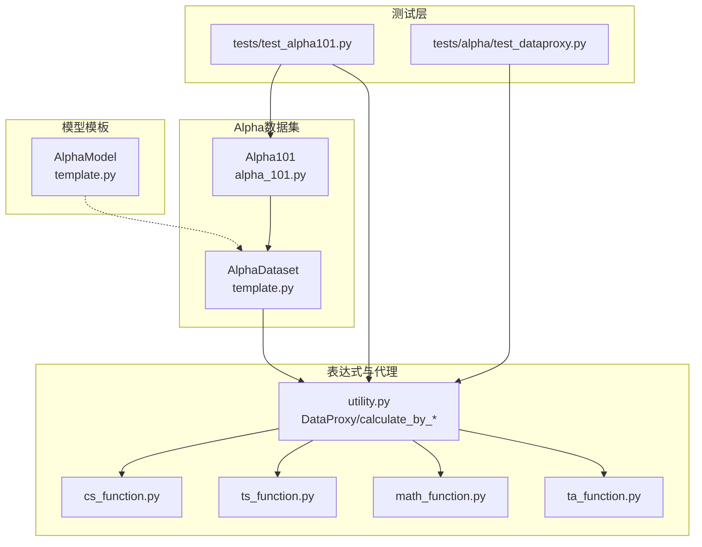
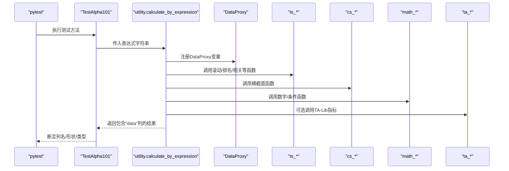
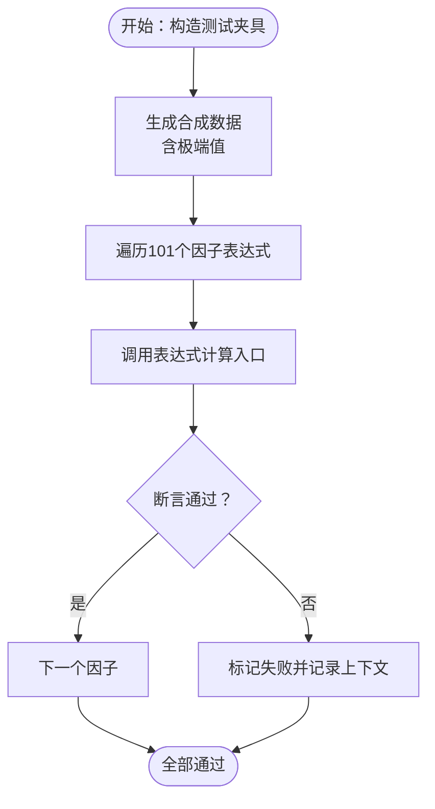
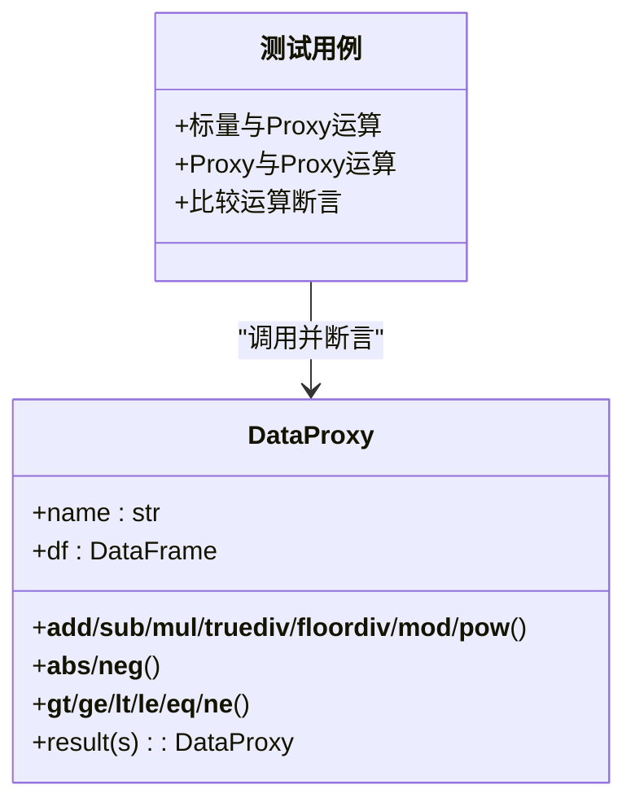
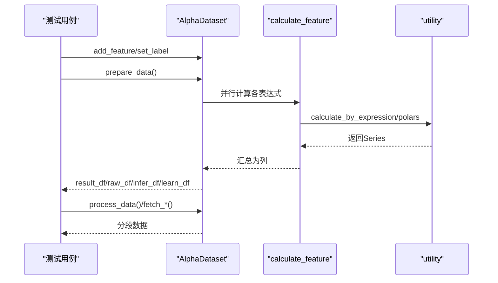
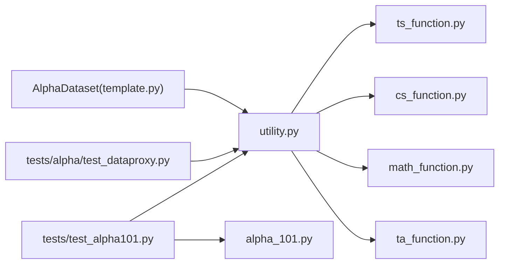

# 测试策略

<cite>
**本文引用的文件**
- [tests/test_alpha101.py](file://tests/test_alpha101.py)
- [tests/alpha/test_dataproxy.py](file://tests/alpha/test_dataproxy.py)
- [vnpy/alpha/dataset/template.py](file://vnpy/alpha/dataset/template.py)
- [vnpy/alpha/dataset/utility.py](file://vnpy/alpha/dataset/utility.py)
- [vnpy/alpha/dataset/cs_function.py](file://vnpy/alpha/dataset/cs_function.py)
- [vnpy/alpha/dataset/ts_function.py](file://vnpy/alpha/dataset/ts_function.py)
- [vnpy/alpha/dataset/math_function.py](file://vnpy/alpha/dataset/math_function.py)
- [vnpy/alpha/dataset/ta_function.py](file://vnpy/alpha/dataset/ta_function.py)
- [vnpy/alpha/dataset/datasets/alpha_101.py](file://vnpy/alpha/dataset/datasets/alpha_101.py)
- [vnpy/alpha/model/template.py](file://vnpy/alpha/model/template.py)
- [examples/alpha_research/download_data_rq.ipynb](file://examples/alpha_research/download_data_rq.ipynb)
- [README.md](file://README.md)
- [pyproject.toml](file://pyproject.toml)
</cite>

## 目录
1. [引言](#引言)
2. [项目结构](#项目结构)
3. [核心组件](#核心组件)
4. [架构总览](#架构总览)
5. [详细组件分析](#详细组件分析)
6. [依赖分析](#依赖分析)
7. [性能考虑](#性能考虑)
8. [故障排查指南](#故障排查指南)
9. [结论](#结论)
10. [附录](#附录)

## 引言
本测试策略文档面向VeighNa量化交易框架的vnpy.alpha模块，聚焦于Alpha因子工程链路的测试体系设计与落地实践。文档覆盖单元测试、集成测试、回归测试、Alpha因子专项验证、测试数据生成策略、测试环境配置、测试覆盖率与质量门禁、性能与压力测试、持续集成与自动化测试流程，并提供开发者编写高质量测试用例的最佳实践。

## 项目结构
vnpy.alpha模块围绕“数据集（dataset）—模型（model）—策略（strategy）—实验室（lab）”的流水线展开，其中dataset负责因子表达式计算与特征工程，model负责训练与预测，strategy基于模型信号进行交易，lab串联全流程并提供可视化分析。测试覆盖主要集中在dataset与utility层，确保表达式解析、代理计算、时序/横截面操作、数学与技术分析函数的正确性与鲁棒性。

图示来源
- [tests/test_alpha101.py](file://tests/test_alpha101.py#L1-L677)
- [tests/alpha/test_dataproxy.py](file://tests/alpha/test_dataproxy.py#L1-L107)
- [vnpy/alpha/dataset/template.py](file://vnpy/alpha/dataset/template.py#L23-L306)
- [vnpy/alpha/dataset/datasets/alpha_101.py](file://vnpy/alpha/dataset/datasets/alpha_101.py#L6-L331)
- [vnpy/alpha/dataset/utility.py](file://vnpy/alpha/dataset/utility.py#L19-L286)
- [vnpy/alpha/dataset/cs_function.py](file://vnpy/alpha/dataset/cs_function.py#L10-L65)
- [vnpy/alpha/dataset/ts_function.py](file://vnpy/alpha/dataset/ts_function.py#L12-L330)
- [vnpy/alpha/dataset/math_function.py](file://vnpy/alpha/dataset/math_function.py#L10-L168)
- [vnpy/alpha/dataset/ta_function.py](file://vnpy/alpha/dataset/ta_function.py#L12-L44)
- [vnpy/alpha/model/template.py](file://vnpy/alpha/model/template.py#L9-L31)

章节来源
- [README.md](file://README.md#L31-L71)

## 核心组件
- 表达式与代理计算
  - DataProxy：封装列数据为可运算对象，支持二元/一元运算、比较、幂等系列操作，统一输出包含datetime、vt_symbol与data三列的DataFrame。
  - calculate_by_expression/calculate_by_polars：将表达式字符串或Polars表达式转换为数值序列，返回标准结构。
- 时间序列与横截面函数
  - ts_*：滚动窗口、排名、协整、残差、相关性、线性衰减等。
  - cs_*：横截面内的rank、mean、std、sum、scale等。
  - math_*：最小/最大、log、abs、sign、pow、条件选择quesval/quesval2等。
  - ta_*：基于TA-Lib的RSI、ATR等技术指标。
- 数据集模板
  - AlphaDataset：统一特征表达式注册、并行计算、过滤与分段取数、性能分析与信号分析。
  - Alpha101：内置WorldQuant 101因子表达式清单，设置标签表达式。
- 模型模板
  - AlphaModel：抽象训练与预测接口，便于不同算法统一接入。

章节来源
- [vnpy/alpha/dataset/utility.py](file://vnpy/alpha/dataset/utility.py#L19-L286)
- [vnpy/alpha/dataset/cs_function.py](file://vnpy/alpha/dataset/cs_function.py#L10-L65)
- [vnpy/alpha/dataset/ts_function.py](file://vnpy/alpha/dataset/ts_function.py#L12-L330)
- [vnpy/alpha/dataset/math_function.py](file://vnpy/alpha/dataset/math_function.py#L10-L168)
- [vnpy/alpha/dataset/ta_function.py](file://vnpy/alpha/dataset/ta_function.py#L12-L44)
- [vnpy/alpha/dataset/template.py](file://vnpy/alpha/dataset/template.py#L23-L306)
- [vnpy/alpha/dataset/datasets/alpha_101.py](file://vnpy/alpha/dataset/datasets/alpha_101.py#L6-L331)
- [vnpy/alpha/model/template.py](file://vnpy/alpha/model/template.py#L9-L31)

## 架构总览
下图展示了从测试用例到表达式计算与特征工程的整体调用链路，强调测试对核心计算模块的依赖与验证目标。

图示来源
- [tests/test_alpha101.py](file://tests/test_alpha101.py#L69-L677)
- [vnpy/alpha/dataset/utility.py](file://vnpy/alpha/dataset/utility.py#L203-L256)
- [vnpy/alpha/dataset/ts_function.py](file://vnpy/alpha/dataset/ts_function.py#L12-L330)
- [vnpy/alpha/dataset/cs_function.py](file://vnpy/alpha/dataset/cs_function.py#L10-L65)
- [vnpy/alpha/dataset/math_function.py](file://vnpy/alpha/dataset/math_function.py#L10-L168)
- [vnpy/alpha/dataset/ta_function.py](file://vnpy/alpha/dataset/ta_function.py#L12-L44)

## 详细组件分析

### Alpha101因子测试策略
- 目标与范围
  - 验证101个因子表达式的语法正确性与计算稳定性；确保每个表达式在构造DataFrame后能生成名为"data"的标准列。
  - 使用统一的测试夹具生成包含极端值（NaN、零成交量、极小价格等）的合成数据，检验表达式在异常场景下的健壮性。
- 测试方法
  - 每个因子对应一个测试方法，直接调用表达式计算入口，断言结果包含"data"列。
  - 使用模块级fixture生成跨时间与跨股票的合成数据，避免外部依赖。
- 关键断言
  - 列名一致性：确保输出包含["datetime","vt_symbol","data"]。
  - 形状一致性：与输入行数一致。
  - 类型一致性：数值型，无异常类型。
- 回归与演进
  - 当新增因子或修改表达式时，需补充对应测试方法，保持101因子测试矩阵完整。
  - 对缺失/不可实现因子（如涉及市值/行业去中心化等）应保留占位测试并标注原因。

图示来源
- [tests/test_alpha101.py](file://tests/test_alpha101.py#L9-L677)
- [vnpy/alpha/dataset/datasets/alpha_101.py](file://vnpy/alpha/dataset/datasets/alpha_101.py#L24-L331)

章节来源
- [tests/test_alpha101.py](file://tests/test_alpha101.py#L69-L677)
- [vnpy/alpha/dataset/datasets/alpha_101.py](file://vnpy/alpha/dataset/datasets/alpha_101.py#L6-L331)

### DataProxy与运算符测试策略
- 目标与范围
  - 验证DataProxy对标量与另一DataProxy的四则运算、幂运算、取反、绝对值等一元/二元运算的正确性与类型一致性。
  - 验证比较运算返回Int32类型并与预期布尔逻辑一致。
- 测试方法
  - 构造小型确定性数据帧，分别测试标量与Proxy之间的运算、Proxy与Proxy之间的运算。
  - 对比较运算断言输出列类型为Int32，值与逻辑期望一致。
- 关键断言
  - 结果列结构：["datetime","vt_symbol","data"]。
  - 比较结果类型：Int32。
  - 数值精度：使用数值断言而非字面相等，容忍浮点误差。

图示来源
- [tests/alpha/test_dataproxy.py](file://tests/alpha/test_dataproxy.py#L1-L107)
- [vnpy/alpha/dataset/utility.py](file://vnpy/alpha/dataset/utility.py#L19-L201)

章节来源
- [tests/alpha/test_dataproxy.py](file://tests/alpha/test_dataproxy.py#L40-L107)
- [vnpy/alpha/dataset/utility.py](file://vnpy/alpha/dataset/utility.py#L19-L201)

### AlphaDataset与特征工程测试策略
- 目标与范围
  - 验证特征注册、表达式并行计算、结果拼接、过滤与分段取数、性能分析与信号分析等流程。
  - 验证多进程并行计算的稳定性与结果一致性。
- 测试方法
  - 使用小规模数据与少量特征表达式，验证prepare_data/process_data的完整路径。
  - 验证fetch_raw/fetch_infer/fetch_learn在指定时间段内的取数正确性。
  - 验证show_feature_performance/show_signal_performance的输入格式与调用可达性。
- 关键断言
  - 并行计算后结果列包含所有注册特征与标签。
  - 分段取数边界与排序一致性。
  - 性能分析接口调用不抛异常（具体数值不在单元测试中断言）。

图示来源
- [vnpy/alpha/dataset/template.py](file://vnpy/alpha/dataset/template.py#L90-L194)
- [vnpy/alpha/dataset/template.py](file://vnpy/alpha/dataset/template.py#L289-L306)
- [vnpy/alpha/dataset/utility.py](file://vnpy/alpha/dataset/utility.py#L203-L265)

章节来源
- [vnpy/alpha/dataset/template.py](file://vnpy/alpha/dataset/template.py#L90-L194)
- [vnpy/alpha/dataset/template.py](file://vnpy/alpha/dataset/template.py#L289-L306)

### 模型模板测试策略
- 目标与范围
  - 验证AlphaModel抽象接口的契约：fit与predict签名正确、detail可选实现。
  - 为具体模型（如Lasso/LightGBM/MLP）提供最小可用测试骨架，确保与AlphaDataset/Segment协作的接口稳定。
- 测试方法
  - 编写Mock子类实现fit/predict，验证调用路径与参数传递。
  - 验证Segment枚举在数据分段取数中的作用。

章节来源
- [vnpy/alpha/model/template.py](file://vnpy/alpha/model/template.py#L9-L31)

## 依赖分析
- 测试对核心模块的耦合
  - tests/test_alpha101.py强依赖utility.calculate_by_expression与Alpha101表达式清单。
  - tests/alpha/test_dataproxy.py强依赖utility.DataProxy与ts/cs/math/ta函数族。
  - AlphaDataset依赖utility与各函数模块，形成自洽的表达式执行闭环。
- 外部依赖
  - polars、scipy、alphalens、TA-Lib等为表达式计算与性能分析提供基础能力。
- 循环依赖规避
  - utility中通过局部导入避免全局命名空间污染，降低循环导入风险。

图示来源
- [tests/test_alpha101.py](file://tests/test_alpha101.py#L1-L10)
- [tests/alpha/test_dataproxy.py](file://tests/alpha/test_dataproxy.py#L1-L6)
- [vnpy/alpha/dataset/utility.py](file://vnpy/alpha/dataset/utility.py#L1-L20)
- [vnpy/alpha/dataset/ts_function.py](file://vnpy/alpha/dataset/ts_function.py#L1-L10)
- [vnpy/alpha/dataset/cs_function.py](file://vnpy/alpha/dataset/cs_function.py#L1-L7)
- [vnpy/alpha/dataset/math_function.py](file://vnpy/alpha/dataset/math_function.py#L1-L7)
- [vnpy/alpha/dataset/ta_function.py](file://vnpy/alpha/dataset/ta_function.py#L1-L9)
- [vnpy/alpha/dataset/template.py](file://vnpy/alpha/dataset/template.py#L14-L20)

章节来源
- [pyproject.toml](file://pyproject.toml#L44-L53)

## 性能考虑
- 并行计算与资源
  - AlphaDataset在prepare_data阶段使用多进程池并行计算表达式，测试中应控制表达式数量与数据规模，避免过度占用CPU与内存。
- I/O与中间结果
  - 表达式计算过程会产生大量中间列，测试应关注内存峰值与列拼接效率。
- 性能回归基线
  - 建议在CI中对关键表达式计算路径增加耗时阈值告警，防止回归。
- 压力测试建议
  - 使用更大规模合成数据（如数千股票×数年日频）与更多表达式组合，评估并行池与滚动窗口的极限。
  - 针对ts_*中的滚动函数（如ts_rank、ts_slope、ts_rsquare）进行窗口大小敏感性测试。

[本节为通用指导，无需特定文件引用]

## 故障排查指南
- 表达式语法错误
  - 现象：断言失败或计算入口抛出异常。
  - 排查：确认表达式字符串中变量名与输入列一致；检查括号匹配与函数参数顺序。
- 极端值导致的NaN/Inf
  - 现象：结果出现空值或无穷大。
  - 排查：在测试数据中显式注入NaN/0/volume为0等场景，验证表达式是否具备稳健处理能力。
- 比较运算类型不符
  - 现象：比较结果非Int32或断言失败。
  - 排查：确认DataProxy比较运算的类型归一化逻辑已被调用。
- 多进程并行问题
  - 现象：并行计算卡死或结果不一致。
  - 排查：检查进程池参数与表达式副作用；必要时降级为串行验证。

章节来源
- [tests/alpha/test_dataproxy.py](file://tests/alpha/test_dataproxy.py#L27-L38)
- [vnpy/alpha/dataset/utility.py](file://vnpy/alpha/dataset/utility.py#L36-L47)
- [vnpy/alpha/dataset/template.py](file://vnpy/alpha/dataset/template.py#L108-L118)

## 结论
通过覆盖表达式计算、代理运算、特征工程与模型接口的测试矩阵，可以有效保障vnpy.alpha模块在Alpha因子开发与工程化落地中的正确性与稳定性。建议在持续集成中引入单元测试、回归测试与性能基线监控，配合完善的测试数据生成策略与质量门禁，确保代码演进的质量与可追溯性。

## 附录

### 测试数据生成策略
- 合成数据生成
  - 使用固定随机种子与时间序列构造，确保测试可重复。
  - 在特定日期/股票位置注入极端值（NaN、零成交量、极小价格），验证表达式健壮性。
- 实际数据接入
  - 示例Notebook演示如何从RQData下载指数成分与行情数据，可用于集成测试或回归测试的真实市场数据验证。
- 数据规模与多样性
  - 建议至少覆盖“小规模（分钟级/日频短周期）+中规模（日频长周期）+压力级（多股票/多周期）”。

章节来源
- [tests/test_alpha101.py](file://tests/test_alpha101.py#L9-L57)
- [examples/alpha_research/download_data_rq.ipynb](file://examples/alpha_research/download_data_rq.ipynb#L15-L153)

### 测试环境配置
- 依赖安装
  - alpha可选依赖（polars、scipy、alphalens、scikit-learn、lightgbm、torch、pyarrow）建议在测试环境中启用，以覆盖完整表达式与分析能力。
- 工具链
  - pytest用于执行测试；ruff与mypy用于代码风格与类型检查，可在CI中作为质量门禁。
- 并行与隔离
  - 建议在CI中限制并行度，避免资源争用；对多进程计算使用独立进程空间。

章节来源
- [pyproject.toml](file://pyproject.toml#L44-L53)
- [pyproject.toml](file://pyproject.toml#L89-L124)
- [README.md](file://README.md#L330-L332)

### 测试覆盖率与质量门禁
- 覆盖率目标
  - 建议核心表达式计算与代理运算模块达到较高覆盖率（如>80%），关键路径（ts_*、cs_*、math_*）接近100%。
- 质量门禁
  - CI中强制执行mypy与ruff检查；对表达式计算与特征工程关键路径增加耗时阈值告警。
  - 对Alpha101全因子矩阵保持回归测试通过。

章节来源
- [pyproject.toml](file://pyproject.toml#L103-L124)
- [tests/test_alpha101.py](file://tests/test_alpha101.py#L69-L677)

### 持续集成与自动化测试流程
- 触发策略
  - PR与主干推送触发完整测试矩阵；夜间或定时任务执行压力测试。
- 步骤建议
  - 安装依赖 → 运行pytest → 生成覆盖率报告 → 上传报告 → 性能基线对比 → 失败告警。
- 可视化
  - 将性能分析与特征表现分析的图表输出纳入Artifacts，便于回归评审。

章节来源
- [README.md](file://README.md#L13-L14)

### Alpha因子测试最佳实践
- 表达式设计
  - 避免对零值/负值的非法运算；对可能产生NaN/Inf的环节进行显式保护。
- 测试用例组织
  - 为每个因子提供独立测试方法；对边界条件（极值、空值、窗口不足）单独覆盖。
- 可重复性
  - 使用固定随机种子与确定性数据生成；避免依赖系统时间或外部状态。
- 文档化
  - 对不可实现因子（如缺失字段）在测试中明确标注原因，保留回归基线。

章节来源
- [tests/test_alpha101.py](file://tests/test_alpha101.py#L9-L57)
- [vnpy/alpha/dataset/datasets/alpha_101.py](file://vnpy/alpha/dataset/datasets/alpha_101.py#L167-L192)