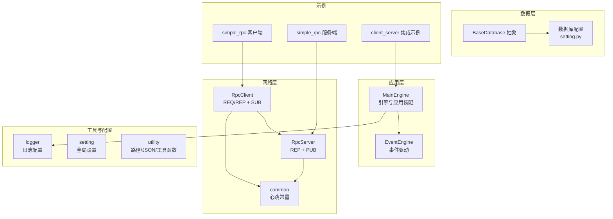
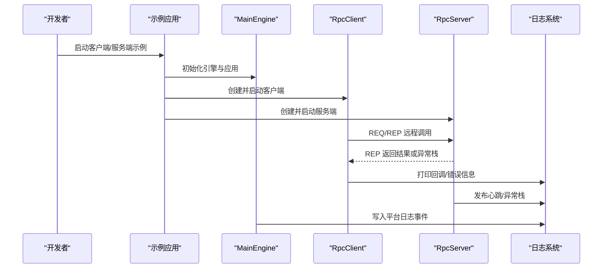
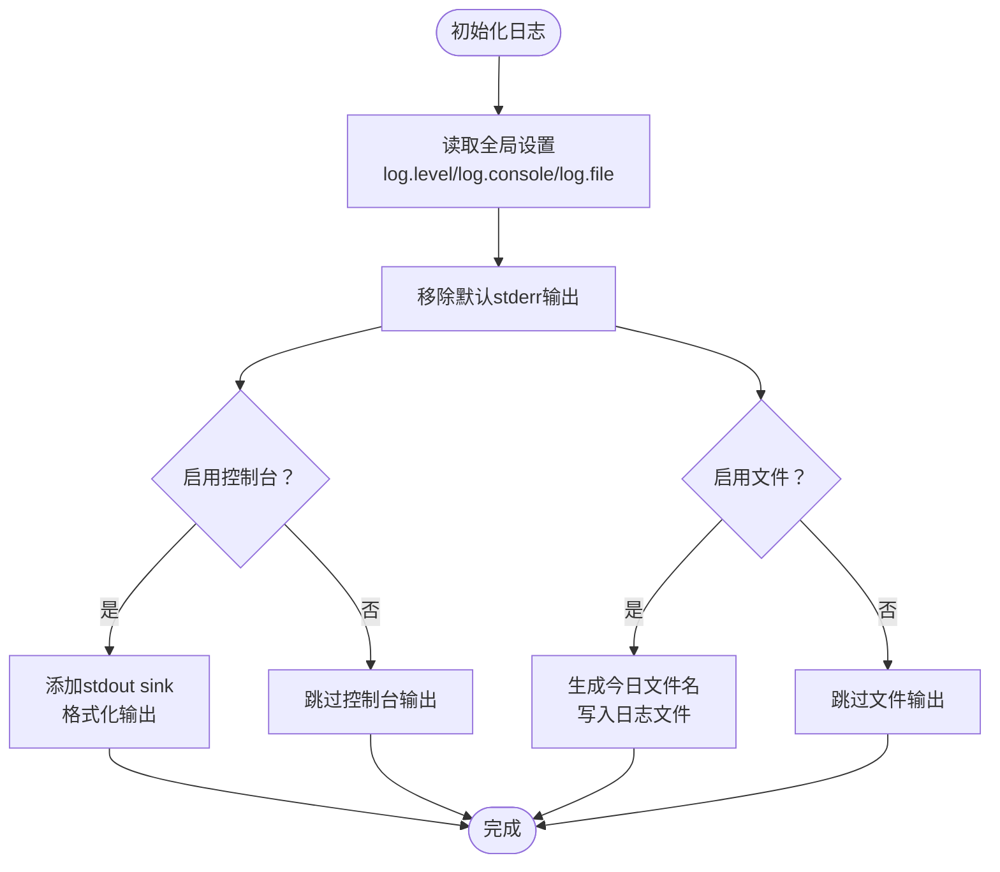
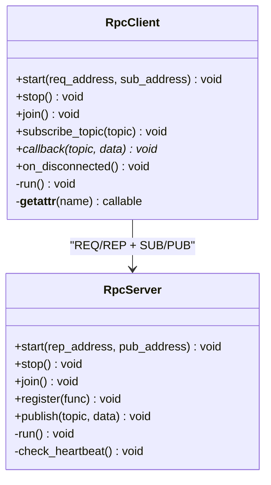
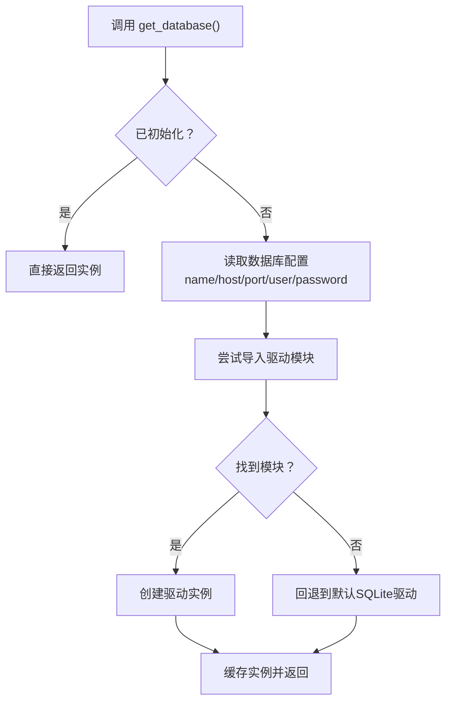
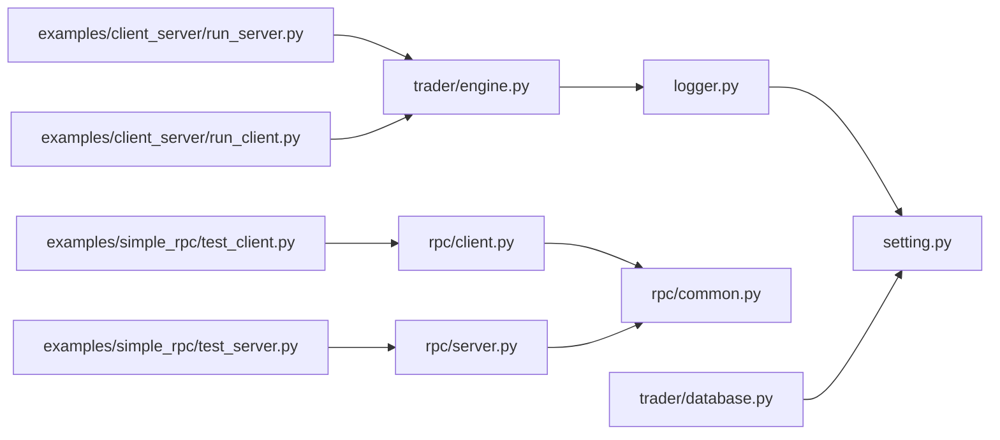

# 调试指南

<cite>
**本文引用的文件**
- [vnpy/trader/logger.py](file://vnpy/trader/logger.py)
- [vnpy/rpc/client.py](file://vnpy/rpc/client.py)
- [vnpy/rpc/server.py](file://vnpy/rpc/server.py)
- [vnpy/rpc/common.py](file://vnpy/rpc/common.py)
- [vnpy/trader/setting.py](file://vnpy/trader/setting.py)
- [vnpy/trader/utility.py](file://vnpy/trader/utility.py)
- [vnpy/trader/engine.py](file://vnpy/trader/engine.py)
- [vnpy/trader/database.py](file://vnpy/trader/database.py)
- [examples/simple_rpc/test_client.py](file://examples/simple_rpc/test_client.py)
- [examples/simple_rpc/test_server.py](file://examples/simple_rpc/test_server.py)
- [examples/client_server/run_server.py](file://examples/client_server/run_server.py)
- [examples/client_server/run_client.py](file://examples/client_server/run_client.py)
</cite>

## 目录
1. [简介](#简介)
2. [项目结构](#项目结构)
3. [核心组件](#核心组件)
4. [架构总览](#架构总览)
5. [详细组件分析](#详细组件分析)
6. [依赖关系分析](#依赖关系分析)
7. [性能考虑](#性能考虑)
8. [故障排查指南](#故障排查指南)
9. [结论](#结论)
10. [附录](#附录)

## 简介
本指南面向VeighNa量化交易框架的开发者与运维人员，系统性地梳理从开发到生产的调试方法与工具，覆盖日志系统、断点调试、变量检查、调用栈分析、网络通信（RPC）、数据库连接等关键领域，并提供常见问题的诊断思路与性能分析建议。文档以仓库中实际代码为依据，配合可视化图示帮助快速定位问题并完成根因分析。

## 项目结构
VeighNa采用模块化分层设计：
- 应用层：MainEngine负责引擎与应用装配，事件驱动贯穿始终
- 网络层：基于ZeroMQ的RPC客户端/服务端实现请求-应答与发布-订阅
- 数据层：抽象数据库接口，按配置动态加载具体驱动
- 工具与配置：统一的日志、设置、路径与通用工具函数
- 示例：提供最小可运行的RPC客户端/服务端示例与集成示例

图表来源
- [vnpy/trader/engine.py](file://vnpy/trader/engine.py#L81-L200)
- [vnpy/rpc/client.py](file://vnpy/rpc/client.py#L29-L170)
- [vnpy/rpc/server.py](file://vnpy/rpc/server.py#L11-L141)
- [vnpy/rpc/common.py](file://vnpy/rpc/common.py#L8-L11)
- [vnpy/trader/database.py](file://vnpy/trader/database.py#L136-L160)
- [vnpy/trader/setting.py](file://vnpy/trader/setting.py#L11-L44)
- [vnpy/trader/logger.py](file://vnpy/trader/logger.py#L22-L56)
- [examples/simple_rpc/test_client.py](file://examples/simple_rpc/test_client.py#L1-L35)
- [examples/simple_rpc/test_server.py](file://examples/simple_rpc/test_server.py#L1-L39)
- [examples/client_server/run_server.py](file://examples/client_server/run_server.py#L1-L74)
- [examples/client_server/run_client.py](file://examples/client_server/run_client.py#L1-L28)

章节来源
- [vnpy/trader/engine.py](file://vnpy/trader/engine.py#L81-L200)
- [vnpy/trader/logger.py](file://vnpy/trader/logger.py#L22-L56)
- [vnpy/trader/setting.py](file://vnpy/trader/setting.py#L11-L44)
- [vnpy/trader/database.py](file://vnpy/trader/database.py#L136-L160)
- [vnpy/rpc/client.py](file://vnpy/rpc/client.py#L29-L170)
- [vnpy/rpc/server.py](file://vnpy/rpc/server.py#L11-L141)
- [vnpy/rpc/common.py](file://vnpy/rpc/common.py#L8-L11)
- [examples/simple_rpc/test_client.py](file://examples/simple_rpc/test_client.py#L1-L35)
- [examples/simple_rpc/test_server.py](file://examples/simple_rpc/test_server.py#L1-L39)
- [examples/client_server/run_server.py](file://examples/client_server/run_server.py#L1-L74)
- [examples/client_server/run_client.py](file://examples/client_server/run_client.py#L1-L28)

## 核心组件
- 日志系统：基于Loguru，支持控制台与文件输出、可配置级别与格式、默认gateway_name扩展字段
- RPC通信：客户端/服务端分别封装REQ/REP与SUB/PUB，内置心跳检测与超时处理
- 数据库接口：抽象类定义存取方法，按配置动态加载驱动，默认SQLite
- 设置与路径：集中管理日志、数据库、邮件等全局参数；提供用户目录与临时目录路径
- 主引擎：事件驱动、引擎注册、应用装配、通知与日志事件派发

章节来源
- [vnpy/trader/logger.py](file://vnpy/trader/logger.py#L22-L56)
- [vnpy/trader/setting.py](file://vnpy/trader/setting.py#L11-L44)
- [vnpy/trader/utility.py](file://vnpy/trader/utility.py#L38-L118)
- [vnpy/trader/engine.py](file://vnpy/trader/engine.py#L81-L200)
- [vnpy/trader/database.py](file://vnpy/trader/database.py#L52-L160)
- [vnpy/rpc/client.py](file://vnpy/rpc/client.py#L29-L170)
- [vnpy/rpc/server.py](file://vnpy/rpc/server.py#L11-L141)

## 架构总览
下图展示从应用启动到RPC交互与日志输出的关键路径，便于理解调试切入点与数据流。

图表来源
- [examples/simple_rpc/test_client.py](file://examples/simple_rpc/test_client.py#L24-L35)
- [examples/simple_rpc/test_server.py](file://examples/simple_rpc/test_server.py#L27-L39)
- [vnpy/rpc/client.py](file://vnpy/rpc/client.py#L61-L86)
- [vnpy/rpc/server.py](file://vnpy/rpc/server.py#L95-L111)
- [vnpy/trader/logger.py](file://vnpy/trader/logger.py#L22-L56)
- [vnpy/trader/engine.py](file://vnpy/trader/engine.py#L168-L175)

## 详细组件分析

### 日志系统（Loguru）
- 配置要点
  - 输出目标：控制台与文件可独立开关
  - 级别：由全局设置决定
  - 格式：包含时间、级别、扩展字段gateway_name与消息体
  - 默认扩展：初始化时注入gateway_name
- 使用建议
  - 开发阶段提高日志级别，生产阶段根据需要降低
  - 在网关/应用中通过扩展字段区分来源
  - 文件轮转可通过外部工具或替换sink实现（当前实现按日期生成文件名）

图表来源
- [vnpy/trader/logger.py](file://vnpy/trader/logger.py#L36-L56)
- [vnpy/trader/setting.py](file://vnpy/trader/setting.py#L15-L19)

章节来源
- [vnpy/trader/logger.py](file://vnpy/trader/logger.py#L22-L56)
- [vnpy/trader/setting.py](file://vnpy/trader/setting.py#L15-L19)

### RPC通信（客户端/服务端）
- 客户端
  - REQ套接字用于请求-应答；SUB套接字用于订阅推送
  - 心跳容忍：超过阈值触发断连提示
  - 异常：远程异常封装为自定义异常类型
- 服务端
  - REP套接字响应请求；PUB套接字发布消息
  - 心跳：按间隔发布心跳主题
  - 错误：捕获异常并返回堆栈字符串
- 常见调试点
  - 地址绑定/连接失败
  - 请求超时与响应异常
  - 心跳丢失导致断连
  - 订阅主题是否正确

图表来源
- [vnpy/rpc/client.py](file://vnpy/rpc/client.py#L29-L170)
- [vnpy/rpc/server.py](file://vnpy/rpc/server.py#L11-L141)
- [vnpy/rpc/common.py](file://vnpy/rpc/common.py#L8-L11)

章节来源
- [vnpy/rpc/client.py](file://vnpy/rpc/client.py#L29-L170)
- [vnpy/rpc/server.py](file://vnpy/rpc/server.py#L11-L141)
- [vnpy/rpc/common.py](file://vnpy/rpc/common.py#L8-L11)

### 数据库接口
- 抽象接口定义了保存/加载/删除/概览等方法
- 按配置动态导入驱动模块，未找到时回退至SQLite
- 时间转换：按数据库时区进行转换

图表来源
- [vnpy/trader/database.py](file://vnpy/trader/database.py#L136-L160)
- [vnpy/trader/setting.py](file://vnpy/trader/setting.py#L31-L38)

章节来源
- [vnpy/trader/database.py](file://vnpy/trader/database.py#L52-L160)
- [vnpy/trader/setting.py](file://vnpy/trader/setting.py#L31-L38)

### 主引擎与事件系统
- MainEngine负责引擎与应用的注册、事件引擎启动、工作目录切换
- 提供write_log方法向事件系统派发日志事件
- 作为日志输出的汇聚点，便于统一收集与展示

章节来源
- [vnpy/trader/engine.py](file://vnpy/trader/engine.py#L81-L200)

## 依赖关系分析
- 组件耦合
  - 日志系统被多模块复用，耦合度低、内聚度高
  - RPC客户端/服务端通过公共常量共享心跳策略
  - 数据库接口通过配置解耦具体驱动
  - 主引擎作为中枢协调各子系统
- 外部依赖
  - ZeroMQ用于RPC通信
  - Loguru用于日志
  - JSON/文件系统用于配置持久化
  - 可选第三方驱动（如MySQL/PostgreSQL）通过模块导入机制接入

图表来源
- [vnpy/trader/logger.py](file://vnpy/trader/logger.py#L8-L19)
- [vnpy/trader/setting.py](file://vnpy/trader/setting.py#L11-L44)
- [vnpy/rpc/client.py](file://vnpy/rpc/client.py#L8-L9)
- [vnpy/rpc/server.py](file://vnpy/rpc/server.py#L8-L9)
- [vnpy/rpc/common.py](file://vnpy/rpc/common.py#L8-L11)
- [vnpy/trader/database.py](file://vnpy/trader/database.py#L146-L159)
- [vnpy/trader/engine.py](file://vnpy/trader/engine.py#L46-L53)
- [examples/simple_rpc/test_client.py](file://examples/simple_rpc/test_client.py#L1-L35)
- [examples/simple_rpc/test_server.py](file://examples/simple_rpc/test_server.py#L1-L39)
- [examples/client_server/run_server.py](file://examples/client_server/run_server.py#L1-L74)
- [examples/client_server/run_client.py](file://examples/client_server/run_client.py#L1-L28)

## 性能考虑
- 日志开销
  - 控制台输出在高频场景可能成为瓶颈，建议仅在开发阶段开启
  - 文件写入建议结合外部轮转工具，避免单文件过大
- RPC通信
  - 心跳间隔与容忍度需平衡网络抖动与资源消耗
  - 大批量请求建议分批或异步化，避免阻塞事件循环
- 数据库
  - 批量写入优于逐条插入
  - 合理索引与查询条件可显著降低查询成本
- 事件驱动
  - 避免在事件回调中执行耗时操作，必要时拆分为后台任务

## 故障排查指南

### 开发环境调试
- 断点调试
  - 在示例脚本入口设置断点，逐步进入RpcClient/RpcServer构造与start流程
  - 在主引擎初始化处观察引擎与应用注册情况
- 变量检查
  - 检查日志配置项：log.level、log.console、log.file
  - 检查数据库配置项：database.name、database.host、database.port、database.user、database.password
- 调用栈分析
  - 服务端异常会返回堆栈字符串，优先查看堆栈定位异常位置
  - 客户端超时异常包含请求详情，便于核对参数与地址

章节来源
- [examples/simple_rpc/test_client.py](file://examples/simple_rpc/test_client.py#L24-L35)
- [examples/simple_rpc/test_server.py](file://examples/simple_rpc/test_server.py#L27-L39)
- [vnpy/rpc/client.py](file://vnpy/rpc/client.py#L73-L78)
- [vnpy/rpc/server.py](file://vnpy/rpc/server.py#L106-L107)
- [vnpy/trader/setting.py](file://vnpy/trader/setting.py#L15-L38)

### 生产环境调试
- 日志策略
  - 降低日志级别，减少I/O压力
  - 将日志输出到文件，结合系统轮转工具
  - 关注异常堆栈与心跳断连提示
- 网络通信
  - 校验地址与端口可达性
  - 观察心跳是否持续，断连后检查网络与防火墙
- 数据库
  - 核对驱动模块是否可用，必要时回退SQLite验证链路
  - 关注时区转换与查询性能

章节来源
- [vnpy/trader/logger.py](file://vnpy/trader/logger.py#L36-L56)
- [vnpy/rpc/common.py](file://vnpy/rpc/common.py#L8-L11)
- [vnpy/trader/database.py](file://vnpy/trader/database.py#L150-L159)

### 网络通信调试（RPC）
- 常见问题
  - 地址绑定失败：确认端口占用与权限
  - 请求超时：检查客户端超时设置与服务端处理耗时
  - 心跳断连：检查网络质量与容忍度设置
- 排查步骤
  - 先用最小示例验证服务端可监听、客户端可连接
  - 使用服务端publish功能验证SUB通路
  - 在客户端回调中打印收到的消息，确认主题订阅正确

章节来源
- [examples/simple_rpc/test_client.py](file://examples/simple_rpc/test_client.py#L24-L35)
- [examples/simple_rpc/test_server.py](file://examples/simple_rpc/test_server.py#L27-L39)
- [vnpy/rpc/client.py](file://vnpy/rpc/client.py#L132-L147)
- [vnpy/rpc/server.py](file://vnpy/rpc/server.py#L129-L141)

### 数据库连接调试
- 常见问题
  - 驱动模块缺失：自动回退SQLite
  - 连接参数错误：核对host/port/user/password
- 排查步骤
  - 通过get_database()返回实例判断驱动加载成功
  - 执行简单保存/加载验证链路
  - 关注时区转换逻辑对时间字段的影响

章节来源
- [vnpy/trader/database.py](file://vnpy/trader/database.py#L136-L160)
- [vnpy/trader/setting.py](file://vnpy/trader/setting.py#L31-L38)

### 常见问题与根因
- RPC调用无响应
  - 检查服务端是否已start并绑定地址
  - 核对客户端请求超时与服务端处理耗时
- 心跳断连频繁
  - 调整容忍度或优化网络
- 日志不输出
  - 检查log.console与log.file开关
  - 确认日志级别高于过滤阈值
- 数据库无法写入
  - 检查驱动模块与连接参数
  - 验证表结构与权限

章节来源
- [vnpy/rpc/client.py](file://vnpy/rpc/client.py#L73-L78)
- [vnpy/rpc/server.py](file://vnpy/rpc/server.py#L106-L107)
- [vnpy/trader/logger.py](file://vnpy/trader/logger.py#L36-L56)
- [vnpy/trader/database.py](file://vnpy/trader/database.py#L150-L159)

## 结论
本指南基于VeighNa现有实现，提供了从日志、RPC、数据库到事件系统的调试方法与流程建议。建议在开发阶段充分利用断点与日志，在生产阶段以配置与外部工具保障稳定性与可观测性。遇到问题时，遵循“先最小化复现、再逐步扩大范围”的原则，结合本文提供的图示与路径定位根因。

## 附录

### 日志配置清单
- log.active：是否激活日志
- log.level：日志级别
- log.console：是否输出到控制台
- log.file：是否输出到文件

章节来源
- [vnpy/trader/setting.py](file://vnpy/trader/setting.py#L15-L19)
- [vnpy/trader/logger.py](file://vnpy/trader/logger.py#L36-L56)

### RPC心跳与超时
- 心跳主题与间隔
- 心跳容忍（断连阈值）
- 客户端请求超时

章节来源
- [vnpy/rpc/common.py](file://vnpy/rpc/common.py#L8-L11)
- [vnpy/rpc/client.py](file://vnpy/rpc/client.py#L62-L78)
- [vnpy/rpc/server.py](file://vnpy/rpc/server.py#L129-L141)

### 数据库配置清单
- database.name：驱动名称
- database.host/port/user/password：连接参数
- database.timezone：数据库时区

章节来源
- [vnpy/trader/setting.py](file://vnpy/trader/setting.py#L31-L38)
- [vnpy/trader/database.py](file://vnpy/trader/database.py#L14-L22)