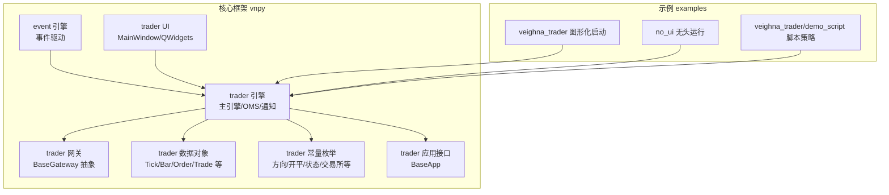
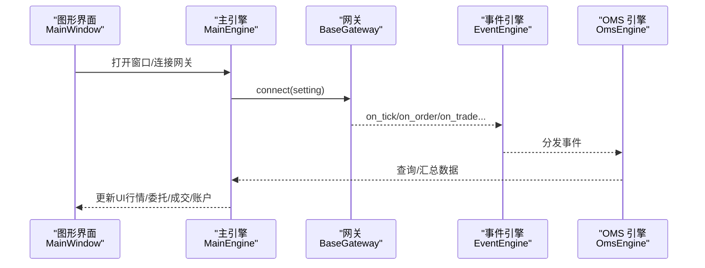
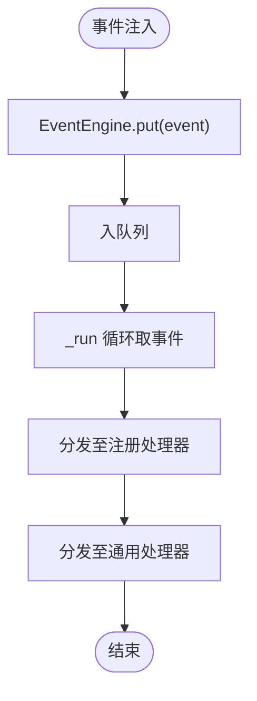
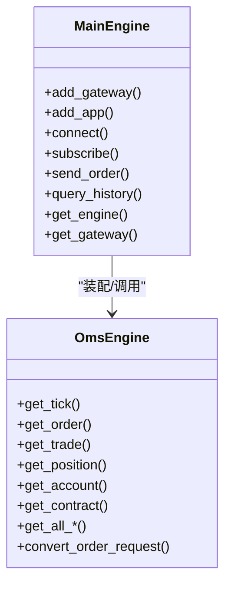
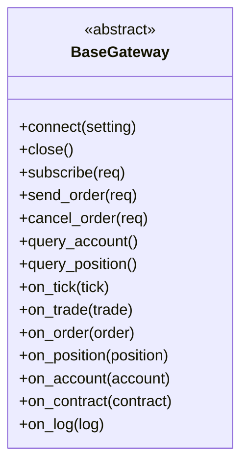
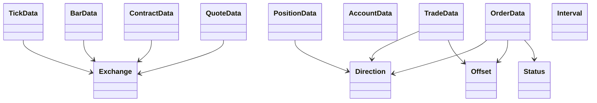
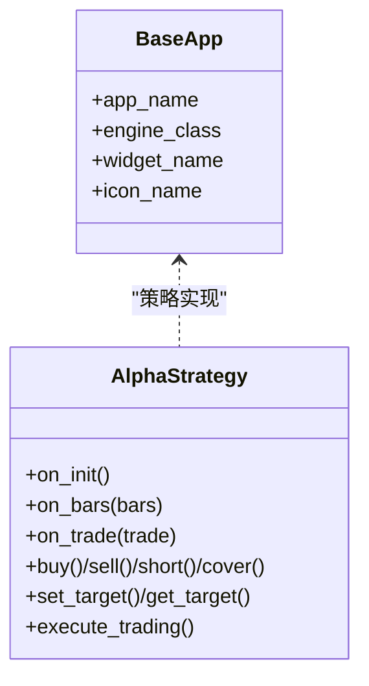
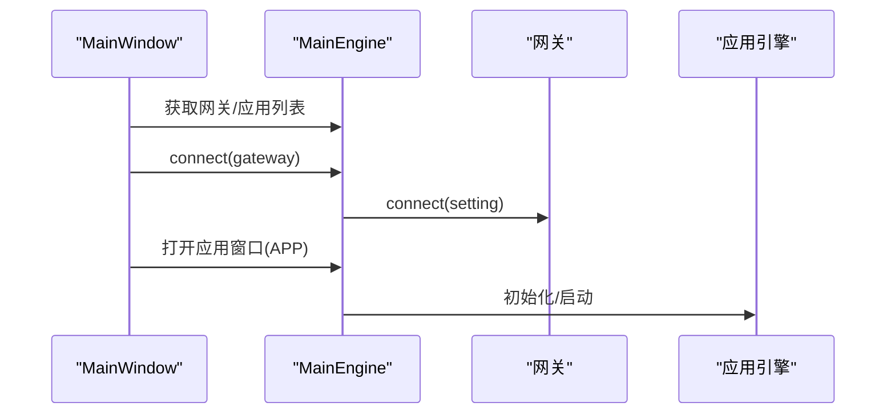
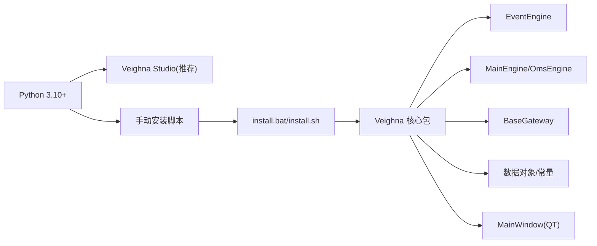

# 快速开始

<cite>
**本文引用的文件列表**
- [README.md](file://README.md)
- [install.bat](file://install.bat)
- [install.sh](file://install.sh)
- [vnpy/__init__.py](file://vnpy/__init__.py)
- [vnpy/event/engine.py](file://vnpy/event/engine.py)
- [vnpy/trader/engine.py](file://vnpy/trader/engine.py)
- [vnpy/trader/gateway.py](file://vnpy/trader/gateway.py)
- [vnpy/trader/object.py](file://vnpy/trader/object.py)
- [vnpy/trader/constant.py](file://vnpy/trader/constant.py)
- [vnpy/trader/app.py](file://vnpy/trader/app.py)
- [vnpy/trader/ui/mainwindow.py](file://vnpy/trader/ui/mainwindow.py)
- [examples/veighna_trader/run.py](file://examples/veighna_trader/run.py)
- [examples/veighna_trader/demo_script.py](file://examples/veighna_trader/demo_script.py)
- [examples/no_ui/run.py](file://examples/no_ui/run.py)
- [vnpy/alpha/strategy/template.py](file://vnpy/alpha/strategy/template.py)
</cite>

## 目录
1. [简介](#简介)
2. [项目结构](#项目结构)
3. [核心组件](#核心组件)
4. [架构总览](#架构总览)
5. [详细组件解析](#详细组件解析)
6. [依赖关系分析](#依赖关系分析)
7. [性能与稳定性建议](#性能与稳定性建议)
8. [常见问题与故障排除](#常见问题与故障排除)
9. [结论](#结论)
10. [附录：从零到一的完整示例](#附录从零到一的完整示例)

## 简介
VeighNa 是一套基于 Python 的开源量化交易系统开发框架，具备事件驱动架构、多网关接入、策略引擎、回测与可视化等能力。本“快速开始”旨在帮助初学者在最短时间内完成环境准备、安装与首次运行，并理解事件驱动、网关接口等基础概念，随后提供一个可直接运行的完整示例，最后给出常见问题与排错建议。

## 项目结构
仓库采用分层+模块化的组织方式：
- 核心框架位于 vnpy 目录，包含事件引擎、交易引擎、网关抽象、UI、常量与数据对象等
- 示例位于 examples 目录，覆盖图形化启动、无头运行、脚本策略、Alpha 投研等
- 平台安装脚本位于根目录，提供 Windows、Linux/macOS 的一键安装

图示来源
- [vnpy/event/engine.py](file://vnpy/event/engine.py#L33-L146)
- [vnpy/trader/engine.py](file://vnpy/trader/engine.py#L81-L324)
- [vnpy/trader/gateway.py](file://vnpy/trader/gateway.py#L33-L273)
- [vnpy/trader/object.py](file://vnpy/trader/object.py#L17-L200)
- [vnpy/trader/constant.py](file://vnpy/trader/constant.py#L10-L161)
- [vnpy/trader/app.py](file://vnpy/trader/app.py#L10-L22)
- [vnpy/trader/ui/mainwindow.py](file://vnpy/trader/ui/mainwindow.py#L40-L200)
- [examples/veighna_trader/run.py](file://examples/veighna_trader/run.py#L38-L87)
- [examples/no_ui/run.py](file://examples/no_ui/run.py#L56-L126)
- [examples/veighna_trader/demo_script.py](file://examples/veighna_trader/demo_script.py#L6-L42)

章节来源
- [README.md](file://README.md#L228-L270)

## 核心组件
- 事件引擎 EventEngine：负责事件分发、定时器、线程安全处理
- 主引擎 MainEngine：聚合网关、应用引擎、统一对外接口
- 网关抽象 BaseGateway：统一交易接口接入规范
- 数据对象与常量：标准化 Tick/Bar/Order/Trade/Position/Account 等数据结构与枚举
- 应用接口 BaseApp：策略/回测/数据管理等模块的统一入口
- UI 主窗口 MainWindow：图形化交易面板

章节来源
- [vnpy/event/engine.py](file://vnpy/event/engine.py#L33-L146)
- [vnpy/trader/engine.py](file://vnpy/trader/engine.py#L81-L324)
- [vnpy/trader/gateway.py](file://vnpy/trader/gateway.py#L33-L273)
- [vnpy/trader/object.py](file://vnpy/trader/object.py#L17-L200)
- [vnpy/trader/constant.py](file://vnpy/trader/constant.py#L10-L161)
- [vnpy/trader/app.py](file://vnpy/trader/app.py#L10-L22)
- [vnpy/trader/ui/mainwindow.py](file://vnpy/trader/ui/mainwindow.py#L40-L200)

## 架构总览
VeighNa 采用“事件驱动 + 网关抽象 + 应用引擎”的分层架构。事件引擎贯穿始终，所有数据流（行情、委托、成交、账户、日志等）均以事件形式在引擎中流转；主引擎负责装配网关与应用引擎，并提供统一的查询与下单接口；UI 通过主引擎与事件引擎交互，呈现实时数据与操作面板。

图示来源
- [vnpy/trader/ui/mainwindow.py](file://vnpy/trader/ui/mainwindow.py#L40-L200)
- [vnpy/trader/engine.py](file://vnpy/trader/engine.py#L81-L324)
- [vnpy/trader/gateway.py](file://vnpy/trader/gateway.py#L86-L158)
- [vnpy/event/engine.py](file://vnpy/event/engine.py#L33-L146)

## 详细组件解析

### 事件驱动引擎 EventEngine
- 职责：事件队列、处理器注册、定时器事件、线程安全
- 关键点：put 注入事件，内部线程循环分发；支持通用处理器与特定类型处理器

图示来源
- [vnpy/event/engine.py](file://vnpy/event/engine.py#L55-L88)
- [vnpy/event/engine.py](file://vnpy/event/engine.py#L105-L146)

章节来源
- [vnpy/event/engine.py](file://vnpy/event/engine.py#L33-L146)

### 主引擎 MainEngine 与 OMS 引擎
- MainEngine：装配事件引擎、网关、应用引擎；提供统一的 connect/subscribe/send_order/query_history 等接口
- OmsEngine：订阅并缓存 Tick/Order/Trade/Position/Account/Contract/Quote，维护活跃委托/报价集合，提供查询接口

图示来源
- [vnpy/trader/engine.py](file://vnpy/trader/engine.py#L81-L324)
- [vnpy/trader/engine.py](file://vnpy/trader/engine.py#L360-L588)

章节来源
- [vnpy/trader/engine.py](file://vnpy/trader/engine.py#L81-L324)

### 网关接口 BaseGateway
- 规范：必须实现 connect/close/subscribe/send_order/cancel_order/query_account/query_position 等方法
- 事件推送：on_tick/on_trade/on_order/on_position/on_account/on_contract/on_log 等
- 线程安全：要求方法非阻塞、自动重连、回调数据不可变

图示来源
- [vnpy/trader/gateway.py](file://vnpy/trader/gateway.py#L33-L273)

章节来源
- [vnpy/trader/gateway.py](file://vnpy/trader/gateway.py#L33-L273)

### 数据对象与常量
- 数据对象：TickData/BarData/OrderData/TradeData/PositionData/AccountData/ContractData/QuoteData 等
- 常量枚举：Direction/Offset/Status/Product/OrderType/OptionType/Exchange/Interval/Currency 等

图示来源
- [vnpy/trader/object.py](file://vnpy/trader/object.py#L17-L200)
- [vnpy/trader/constant.py](file://vnpy/trader/constant.py#L10-L161)

章节来源
- [vnpy/trader/object.py](file://vnpy/trader/object.py#L17-L200)
- [vnpy/trader/constant.py](file://vnpy/trader/constant.py#L10-L161)

### 应用接口 BaseApp 与 Alpha 策略模板
- BaseApp：定义 app_name/engine_class/widget_name/icon_name 等元信息
- AlphaStrategy：提供 on_init/on_bars/on_trade 生命周期钩子，封装 buy/sell/short/cover 等下单与目标仓位管理

图示来源
- [vnpy/trader/app.py](file://vnpy/trader/app.py#L10-L22)
- [vnpy/alpha/strategy/template.py](file://vnpy/alpha/strategy/template.py#L15-L200)

章节来源
- [vnpy/trader/app.py](file://vnpy/trader/app.py#L10-L22)
- [vnpy/alpha/strategy/template.py](file://vnpy/alpha/strategy/template.py#L15-L200)

### 图形化主窗口 MainWindow
- 职责：菜单/工具栏/停靠面板（行情、委托、成交、账户、持仓、日志等）
- 与主引擎交互：连接网关、打开应用窗口、全局设置、微信通知、帮助

图示来源
- [vnpy/trader/ui/mainwindow.py](file://vnpy/trader/ui/mainwindow.py#L40-L200)
- [examples/veighna_trader/run.py](file://examples/veighna_trader/run.py#L38-L87)

章节来源
- [vnpy/trader/ui/mainwindow.py](file://vnpy/trader/ui/mainwindow.py#L40-L200)
- [examples/veighna_trader/run.py](file://examples/veighna_trader/run.py#L38-L87)

## 依赖关系分析
- 安装与运行依赖：Python 3.10+，VeighNa Studio 发行版（推荐）或手动安装
- 事件引擎依赖：collections、queue、threading、time、typing
- 主引擎依赖：EventEngine、BaseGateway、BaseApp、数据对象与常量、设置与日志
- UI 依赖：PyQt5/6（QtWidgets/QtCore/QtGui），与主引擎耦合

图示来源
- [README.md](file://README.md#L228-L270)
- [install.bat](file://install.bat#L1-L16)
- [install.sh](file://install.sh#L1-L41)
- [vnpy/event/engine.py](file://vnpy/event/engine.py#L33-L146)
- [vnpy/trader/engine.py](file://vnpy/trader/engine.py#L81-L324)
- [vnpy/trader/gateway.py](file://vnpy/trader/gateway.py#L33-L273)
- [vnpy/trader/object.py](file://vnpy/trader/object.py#L17-L200)
- [vnpy/trader/ui/mainwindow.py](file://vnpy/trader/ui/mainwindow.py#L40-L200)

章节来源
- [README.md](file://README.md#L228-L270)
- [install.bat](file://install.bat#L1-L16)
- [install.sh](file://install.sh#L1-L41)

## 性能与稳定性建议
- 事件驱动：避免在事件回调中执行耗时操作，尽量将 IO 或 CPU 密集任务放入独立线程
- 网关实现：确保方法非阻塞、自动重连、回调数据不可变
- UI 与事件：主线程仅做 UI 更新，数据处理与网络 IO 放在后台线程
- 日志与通知：合理配置日志级别与输出位置，避免频繁磁盘写入

[本节为通用建议，不直接分析具体文件]

## 常见问题与故障排除
- 安装失败（Linux/macOS）：确认系统满足 Python 3.10+、64 位；必要时先安装 ta-lib 依赖后再安装 VeighNa
- 无法启动图形界面：检查 PyQt5/6 是否安装；确认 Veighna Studio 已正确安装
- 连接网关失败：核对网关配置项（用户名、密码、服务器地址等）；查看日志输出
- 无行情/无成交：确认已订阅合约；检查事件引擎是否正常运行
- 无法下单：检查订单参数（方向、开平、价格、数量）与交易所限制；确认账户资金充足

章节来源
- [README.md](file://README.md#L228-L270)
- [install.sh](file://install.sh#L13-L41)
- [vnpy/trader/engine.py](file://vnpy/trader/engine.py#L234-L308)

## 结论
通过本指南，您已了解 VeighNa 的核心架构、基础组件与运行方式，并掌握了从环境准备到首次运行的全流程。建议在掌握事件驱动与网关接口的基础上，逐步尝试策略引擎与 Alpha 模块，以构建更复杂的量化交易系统。

[本节为总结性内容，不直接分析具体文件]

## 附录：从零到一的完整示例

### 步骤一：环境准备与安装
- 推荐使用 Veighna Studio（Windows/Linux/macOS），内置 VeighNa 与 Veighna Station，无需手动安装
- 若选择手动安装：在项目根目录运行对应安装脚本（Windows 使用 install.bat，Linux 使用 install.sh）

章节来源
- [README.md](file://README.md#L228-L270)
- [install.bat](file://install.bat#L1-L16)
- [install.sh](file://install.sh#L1-L41)

### 步骤二：图形化启动（Veighna Studio）
- 启动 Veighna Station，登录后点击“Veighna Trader”，即可打开图形界面
- 在图形界面中连接网关、订阅行情、打开策略应用

章节来源
- [README.md](file://README.md#L256-L270)

### 步骤三：无头运行（命令行）
- 在任意目录创建 run.py，参考示例文件路径：
  - [examples/no_ui/run.py](file://examples/no_ui/run.py#L56-L126)
- 在该目录下打开终端，运行：python run.py

章节来源
- [examples/no_ui/run.py](file://examples/no_ui/run.py#L56-L126)

### 步骤四：图形化启动（自定义 run.py）
- 参考示例文件路径：
  - [examples/veighna_trader/run.py](file://examples/veighna_trader/run.py#L38-L87)
- 在该目录下打开终端，运行：python run.py

章节来源
- [examples/veighna_trader/run.py](file://examples/veighna_trader/run.py#L38-L87)

### 步骤五：脚本策略示例
- 参考示例文件路径：
  - [examples/veighna_trader/demo_script.py](file://examples/veighna_trader/demo_script.py#L6-L42)
- 该脚本展示了如何订阅行情、查询合约、轮询日志输出

章节来源
- [examples/veighna_trader/demo_script.py](file://examples/veighna_trader/demo_script.py#L6-L42)

### 步骤六：基础概念速览
- 事件驱动：事件引擎负责事件分发与定时器
  - [vnpy/event/engine.py](file://vnpy/event/engine.py#L33-L146)
- 网关接口：统一接入不同交易系统的接口规范
  - [vnpy/trader/gateway.py](file://vnpy/trader/gateway.py#L33-L273)
- 数据对象与常量：标准化交易数据结构与枚举
  - [vnpy/trader/object.py](file://vnpy/trader/object.py#L17-L200)
  - [vnpy/trader/constant.py](file://vnpy/trader/constant.py#L10-L161)
- 主引擎与 OMS：统一对外接口与数据汇总
  - [vnpy/trader/engine.py](file://vnpy/trader/engine.py#L81-L324)

章节来源
- [vnpy/event/engine.py](file://vnpy/event/engine.py#L33-L146)
- [vnpy/trader/gateway.py](file://vnpy/trader/gateway.py#L33-L273)
- [vnpy/trader/object.py](file://vnpy/trader/object.py#L17-L200)
- [vnpy/trader/constant.py](file://vnpy/trader/constant.py#L10-L161)
- [vnpy/trader/engine.py](file://vnpy/trader/engine.py#L81-L324)