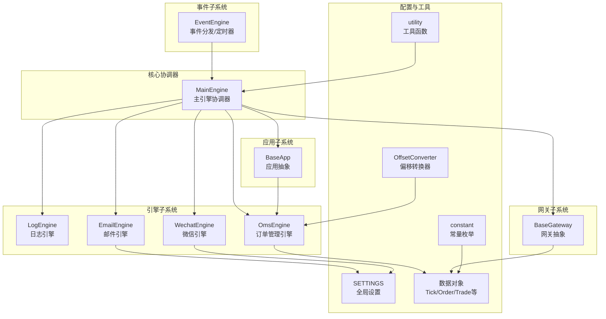
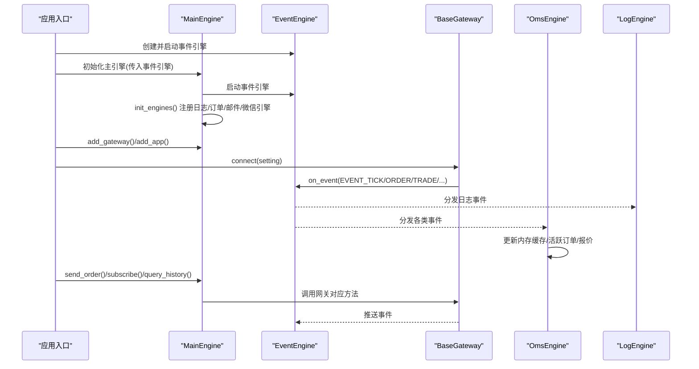
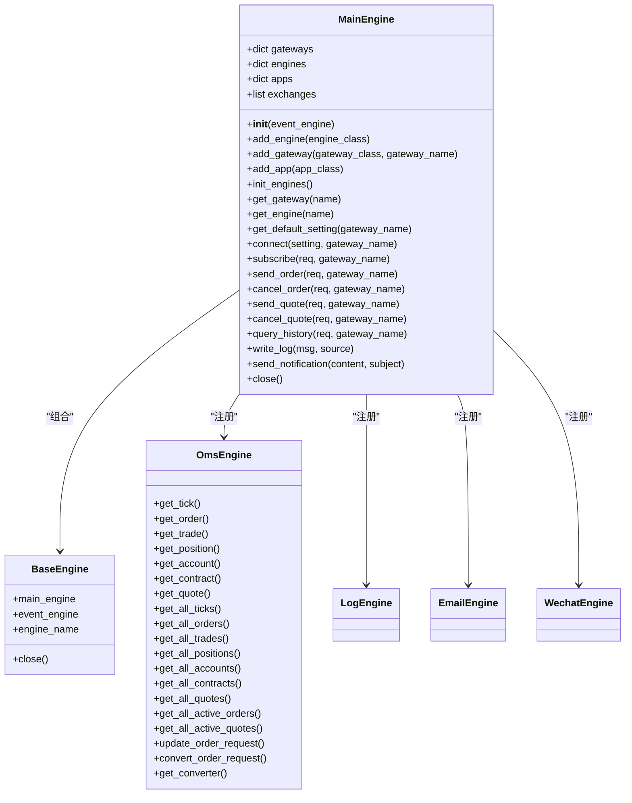
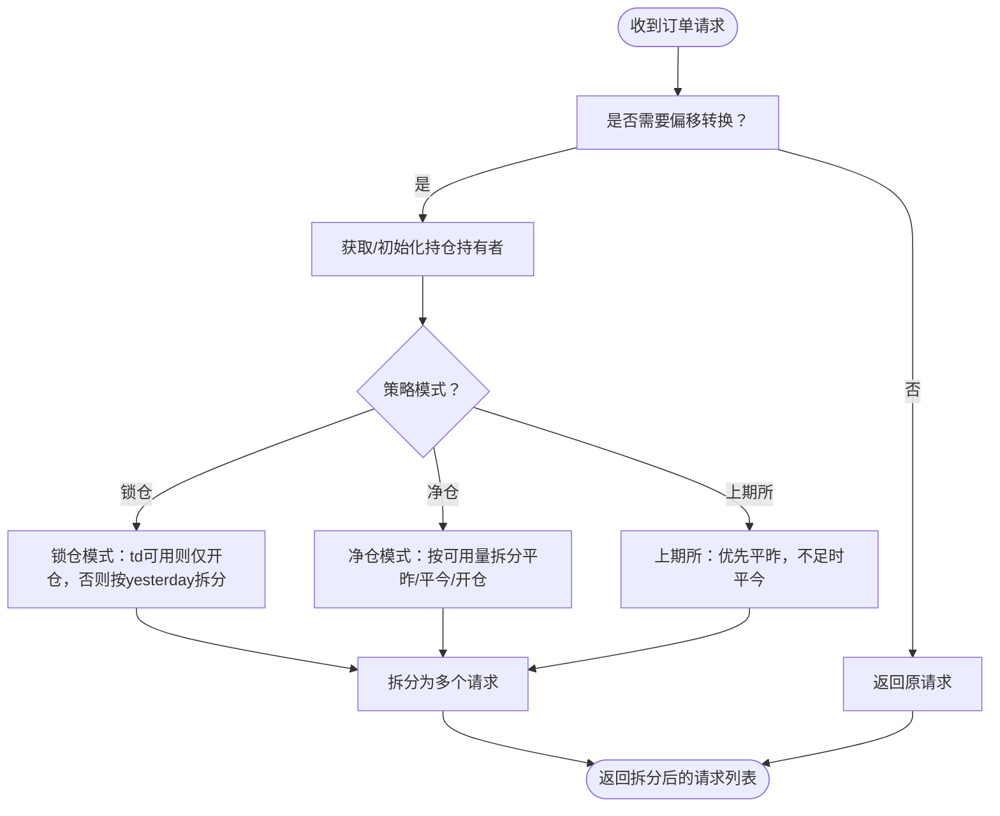
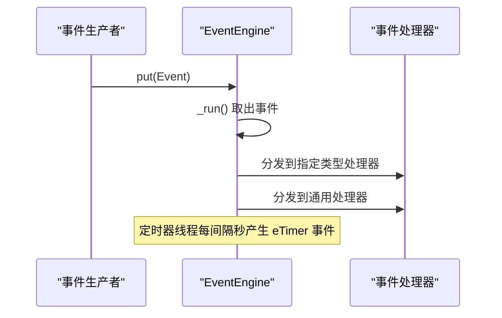
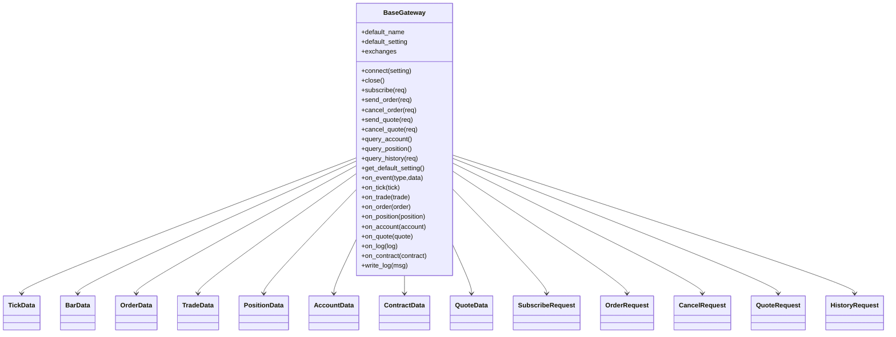
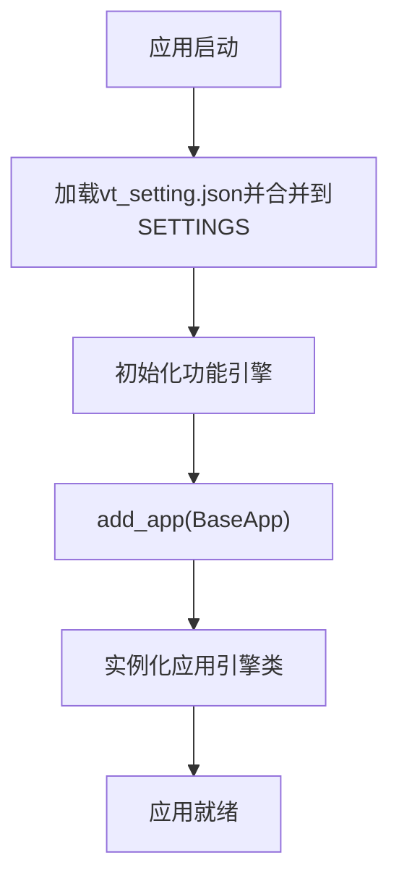
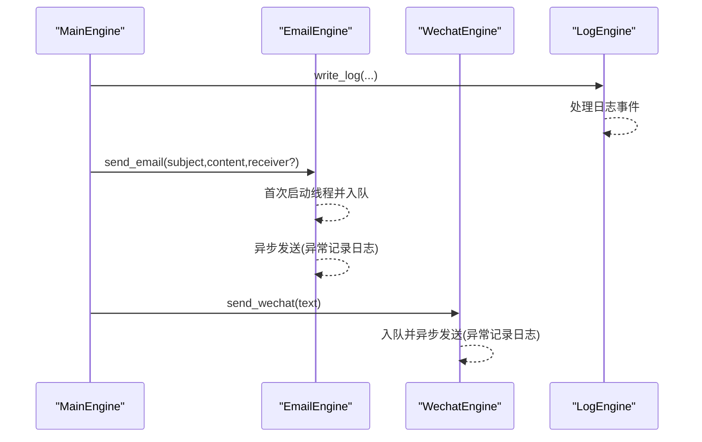
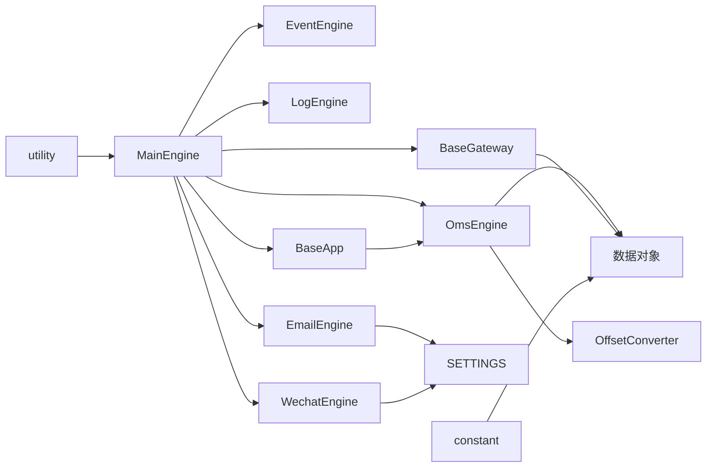
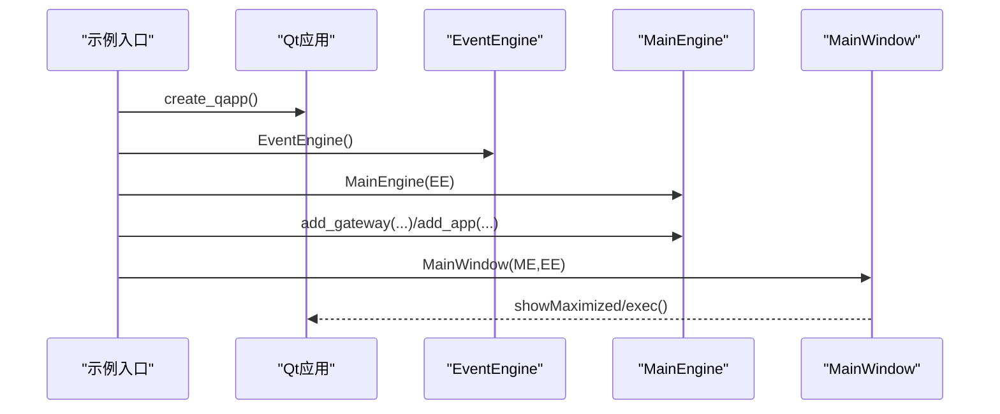

# 主引擎协调器

<cite>
**本文档引用的文件**
- [vnpy/trader/engine.py](file://vnpy/trader/engine.py)
- [vnpy/event/engine.py](file://vnpy/event/engine.py)
- [vnpy/trader/gateway.py](file://vnpy/trader/gateway.py)
- [vnpy/trader/app.py](file://vnpy/trader/app.py)
- [vnpy/trader/setting.py](file://vnpy/trader/setting.py)
- [vnpy/trader/object.py](file://vnpy/trader/object.py)
- [vnpy/trader/converter.py](file://vnpy/trader/converter.py)
- [vnpy/trader/utility.py](file://vnpy/trader/utility.py)
- [vnpy/trader/constant.py](file://vnpy/trader/constant.py)
- [examples/veighna_trader/run.py](file://examples/veighna_trader/run.py)
</cite>

## 目录
1. [简介](#简介)
2. [项目结构](#项目结构)
3. [核心组件](#核心组件)
4. [架构总览](#架构总览)
5. [详细组件分析](#详细组件分析)
6. [依赖关系分析](#依赖关系分析)
7. [性能考量](#性能考量)
8. [故障排查指南](#故障排查指南)
9. [结论](#结论)
10. [附录](#附录)

## 简介
本文件面向VeighNa框架的主引擎协调器（MainEngine），系统性阐述其作为交易平台核心协调器的设计理念与实现细节。重点覆盖：
- 各功能模块的初始化顺序与生命周期管理
- 应用程序（App）的加载机制、配置管理与动态卸载
- 设置管理（Setting）的持久化机制与配置项校验
- 主引擎如何协调事件引擎、网关接口、数据库连接等核心组件
- 系统启动流程、优雅关闭机制与异常处理策略
- 扩展与自定义应用开发指导

## 项目结构
VeighNa采用分层+模块化的组织方式，核心围绕“事件驱动”和“插件式应用”展开：
- 事件子系统：提供跨线程事件分发与定时器能力
- 网关子系统：抽象统一的交易接口接入层
- 引擎子系统：以引擎为单位封装业务功能（如订单管理、通知等）
- 应用子系统：可插拔的功能模块（策略、回测、数据管理等）
- 配置与工具：全局设置、通用工具函数、常量枚举

图表来源
- [vnpy/trader/engine.py](file://vnpy/trader/engine.py#L81-L101)
- [vnpy/event/engine.py](file://vnpy/event/engine.py#L33-L104)
- [vnpy/trader/gateway.py](file://vnpy/trader/gateway.py#L33-L85)
- [vnpy/trader/app.py](file://vnpy/trader/app.py#L10-L22)
- [vnpy/trader/setting.py](file://vnpy/trader/setting.py#L11-L44)
- [vnpy/trader/object.py](file://vnpy/trader/object.py#L17-L428)
- [vnpy/trader/converter.py](file://vnpy/trader/converter.py#L310-L403)
- [vnpy/trader/utility.py](file://vnpy/trader/utility.py#L38-L118)
- [vnpy/trader/constant.py](file://vnpy/trader/constant.py#L10-L161)

章节来源
- [vnpy/trader/engine.py](file://vnpy/trader/engine.py#L81-L101)
- [vnpy/event/engine.py](file://vnpy/event/engine.py#L33-L104)

## 核心组件
- 主引擎（MainEngine）：负责事件引擎初始化、功能引擎注册、网关与应用的添加、对外API封装、日志与通知、优雅关闭等
- 基础引擎（BaseEngine）：所有功能引擎的抽象基类，提供与主引擎、事件引擎的关联
- 订单管理引擎（OmsEngine）：集中存储与管理市场数据、订单、成交、持仓、账户、合约、报价等，提供查询与转换能力
- 日志引擎（LogEngine）：订阅日志事件并输出到控制台或文件
- 邮件引擎（EmailEngine）：异步队列发送邮件
- 微信引擎（WechatEngine）：异步队列发送微信消息，支持绑定、解绑、持久化配置
- 网关（BaseGateway）：抽象统一的交易接口，负责事件推送、连接、订阅、下单、历史数据查询等
- 应用（BaseApp）：抽象应用，定义应用元信息与引擎类型
- 设置（SETTINGS）：全局配置字典，支持从JSON文件加载与合并
- 数据对象（object）：统一的数据模型（Tick、Order、Trade、Position、Account、Contract、Quote等）
- 偏移转换器（OffsetConverter）：根据合约属性与策略模式（锁仓/净仓/上期所特殊规则）进行订单拆分与转换
- 工具函数（utility）：路径管理、JSON读写、价格取整、K线生成器等
- 常量枚举（constant）：方向、开平、状态、产品、订单类型、期权类型、交易所、币种、周期等

章节来源
- [vnpy/trader/engine.py](file://vnpy/trader/engine.py#L59-L108)
- [vnpy/trader/engine.py](file://vnpy/trader/engine.py#L325-L588)
- [vnpy/trader/engine.py](file://vnpy/trader/engine.py#L590-L655)
- [vnpy/trader/engine.py](file://vnpy/trader/engine.py#L657-L839)
- [vnpy/trader/gateway.py](file://vnpy/trader/gateway.py#L33-L273)
- [vnpy/trader/app.py](file://vnpy/trader/app.py#L10-L22)
- [vnpy/trader/setting.py](file://vnpy/trader/setting.py#L11-L44)
- [vnpy/trader/object.py](file://vnpy/trader/object.py#L17-L428)
- [vnpy/trader/converter.py](file://vnpy/trader/converter.py#L310-L403)
- [vnpy/trader/utility.py](file://vnpy/trader/utility.py#L38-L118)
- [vnpy/trader/constant.py](file://vnpy/trader/constant.py#L10-L161)

## 架构总览
主引擎在初始化时：
- 创建或接收事件引擎并启动
- 切换工作目录至用户目录
- 初始化功能引擎（日志、订单管理、邮件、微信）

对外API通过主引擎方法暴露，内部通过事件引擎进行解耦。网关通过事件引擎向主引擎推送数据；应用通过主引擎获取功能引擎实例。

图表来源
- [vnpy/trader/engine.py](file://vnpy/trader/engine.py#L86-L101)
- [vnpy/trader/engine.py](file://vnpy/trader/engine.py#L138-L167)
- [vnpy/event/engine.py](file://vnpy/event/engine.py#L89-L104)
- [vnpy/trader/gateway.py](file://vnpy/trader/gateway.py#L86-L158)
- [vnpy/trader/engine.py](file://vnpy/trader/engine.py#L384-L393)

章节来源
- [vnpy/trader/engine.py](file://vnpy/trader/engine.py#L86-L101)
- [vnpy/trader/engine.py](file://vnpy/trader/engine.py#L138-L167)
- [vnpy/event/engine.py](file://vnpy/event/engine.py#L89-L104)
- [vnpy/trader/gateway.py](file://vnpy/trader/gateway.py#L86-L158)

## 详细组件分析

### 主引擎（MainEngine）设计与实现
- 初始化与生命周期
  - 接收外部事件引擎或创建内置事件引擎并启动
  - 切换工作目录至用户目录
  - 初始化功能引擎（日志、订单管理、邮件、微信）
  - 提供网关与应用的注册、查询、连接、订阅、下单、撤单、历史查询等统一入口
  - 关闭时先停止事件引擎，再依次关闭各引擎与网关，确保资源有序释放

- 功能引擎注册与代理方法
  - 订单管理引擎提供大量查询与转换方法（如获取最新Tick、订单、成交、持仓、账户、合约、报价；活跃订单/报价集合；偏移转换器获取与订单请求转换）
  - 将这些方法直接挂到主引擎实例上，便于外部调用

- 通知与日志
  - 写日志：构造日志事件并投递到事件引擎
  - 发送通知：通过邮件与微信引擎同时推送

- 网关与应用管理
  - add_gateway：实例化网关并收集其支持的交易所列表
  - add_app：实例化应用并为其创建对应的引擎
  - get_gateway/get_engine：按名称检索组件
  - get_default_setting：获取网关默认配置

- 关闭流程
  - 停止事件引擎
  - 调用各引擎close
  - 调用各网关close

图表来源
- [vnpy/trader/engine.py](file://vnpy/trader/engine.py#L81-L324)
- [vnpy/trader/engine.py](file://vnpy/trader/engine.py#L325-L588)
- [vnpy/trader/engine.py](file://vnpy/trader/engine.py#L590-L655)
- [vnpy/trader/engine.py](file://vnpy/trader/engine.py#L657-L839)

章节来源
- [vnpy/trader/engine.py](file://vnpy/trader/engine.py#L81-L324)
- [vnpy/trader/engine.py](file://vnpy/trader/engine.py#L325-L588)
- [vnpy/trader/engine.py](file://vnpy/trader/engine.py#L590-L655)
- [vnpy/trader/engine.py](file://vnpy/trader/engine.py#L657-L839)

### 订单管理引擎（OmsEngine）与偏移转换器（OffsetConverter）
- 订单管理引擎职责
  - 订阅事件：Tick、Order、Trade、Position、Account、Contract、Quote
  - 维护内存缓存：各类型数据的字典与活跃集合
  - 维护偏移转换器映射：按网关名建立转换器
  - 提供查询接口：获取最新数据、全量列表、活跃集合
  - 订单请求转换：根据策略模式（锁仓/净仓/上期所）拆分订单请求

- 偏移转换器逻辑
  - 按合约是否为“净持仓模式”决定是否需要转换
  - 对不同交易所（如上期所）采用不同的平仓优先级
  - 支持锁仓（仅能开仓）、净仓（先平昨再平今/按规则拆分）、上期所特殊规则

图表来源
- [vnpy/trader/converter.py](file://vnpy/trader/converter.py#L367-L388)
- [vnpy/trader/converter.py](file://vnpy/trader/converter.py#L202-L240)
- [vnpy/trader/converter.py](file://vnpy/trader/converter.py#L242-L307)
- [vnpy/trader/converter.py](file://vnpy/trader/converter.py#L168-L200)

章节来源
- [vnpy/trader/engine.py](file://vnpy/trader/engine.py#L360-L588)
- [vnpy/trader/converter.py](file://vnpy/trader/converter.py#L310-L403)

### 事件引擎（EventEngine）与事件分发
- 事件模型
  - 事件类型字符串用于路由
  - 通用处理器可接收所有类型的事件
  - 定时器事件每间隔秒数产生一次

- 生命周期
  - start：启动事件处理线程与定时器线程
  - stop：停止事件处理与定时器线程，等待线程结束
  - put/register/unregister/register_general/unregister_general：事件队列与处理器注册

图表来源
- [vnpy/event/engine.py](file://vnpy/event/engine.py#L55-L88)
- [vnpy/event/engine.py](file://vnpy/event/engine.py#L89-L104)
- [vnpy/event/engine.py](file://vnpy/event/engine.py#L111-L146)

章节来源
- [vnpy/event/engine.py](file://vnpy/event/engine.py#L33-L146)

### 网关（BaseGateway）与数据对象
- 网关职责
  - 连接、订阅、下单、撤单、历史查询
  - 通过事件引擎推送Tick、Order、Trade、Position、Account、Contract、Log等事件
  - 提供默认配置与支持的交易所列表

- 数据对象
  - 统一vt_symbol命名规范（symbol.exchange）
  - 各类数据对象包含基础字段与派生字段（如vt_orderid、vt_tradeid、vt_positionid等）
  - 订单/报价提供状态判断与取消请求构造

图表来源
- [vnpy/trader/gateway.py](file://vnpy/trader/gateway.py#L33-L273)
- [vnpy/trader/object.py](file://vnpy/trader/object.py#L29-L428)

章节来源
- [vnpy/trader/gateway.py](file://vnpy/trader/gateway.py#L33-L273)
- [vnpy/trader/object.py](file://vnpy/trader/object.py#L17-L428)

### 应用（BaseApp）与设置（SETTINGS）
- 应用抽象
  - 定义应用名称、模块、路径、显示名、引擎类、界面控件名、图标名等元信息
  - 主引擎通过add_app创建应用并为其注册对应引擎

- 设置管理
  - 全局设置字典包含字体、日志、邮件、数据源、数据库等配置
  - 从JSON文件加载并合并，支持运行时修改与持久化
  - 邮件引擎与微信引擎均依赖该设置进行初始化与发送

图表来源
- [vnpy/trader/setting.py](file://vnpy/trader/setting.py#L11-L44)
- [vnpy/trader/engine.py](file://vnpy/trader/engine.py#L128-L136)
- [vnpy/trader/engine.py](file://vnpy/trader/engine.py#L138-L167)

章节来源
- [vnpy/trader/app.py](file://vnpy/trader/app.py#L10-L22)
- [vnpy/trader/setting.py](file://vnpy/trader/setting.py#L11-L44)
- [vnpy/trader/engine.py](file://vnpy/trader/engine.py#L128-L136)
- [vnpy/trader/engine.py](file://vnpy/trader/engine.py#L138-L167)

### 通知与日志（EmailEngine/WechatEngine/LogEngine）
- 日志引擎
  - 根据设置启用/禁用
  - 订阅日志事件并输出到控制台/文件

- 邮件引擎
  - 异步线程+队列发送
  - 首次发送时启动线程
  - 使用SMTP_SSL发送，异常记录日志

- 微信引擎
  - 支持绑定/解绑、持久化配置
  - 异步线程+队列发送，支持去重与节流
  - 会话过期自动停止并记录日志

图表来源
- [vnpy/trader/engine.py](file://vnpy/trader/engine.py#L168-L188)
- [vnpy/trader/engine.py](file://vnpy/trader/engine.py#L325-L358)
- [vnpy/trader/engine.py](file://vnpy/trader/engine.py#L590-L655)
- [vnpy/trader/engine.py](file://vnpy/trader/engine.py#L657-L839)

章节来源
- [vnpy/trader/engine.py](file://vnpy/trader/engine.py#L168-L188)
- [vnpy/trader/engine.py](file://vnpy/trader/engine.py#L325-L358)
- [vnpy/trader/engine.py](file://vnpy/trader/engine.py#L590-L655)
- [vnpy/trader/engine.py](file://vnpy/trader/engine.py#L657-L839)

## 依赖关系分析
- 主引擎对事件引擎的强依赖：事件引擎贯穿所有组件通信
- 订单管理引擎对数据对象与偏移转换器的依赖：维护状态与转换逻辑
- 网关对事件引擎与数据对象的依赖：事件推送与数据构造
- 应用对订单管理引擎的依赖：通过主引擎获取引擎实例
- 设置对工具函数的依赖：JSON读写与路径管理

图表来源
- [vnpy/trader/engine.py](file://vnpy/trader/engine.py#L81-L324)
- [vnpy/trader/engine.py](file://vnpy/trader/engine.py#L325-L588)
- [vnpy/trader/engine.py](file://vnpy/trader/engine.py#L590-L655)
- [vnpy/trader/engine.py](file://vnpy/trader/engine.py#L657-L839)
- [vnpy/trader/gateway.py](file://vnpy/trader/gateway.py#L33-L273)
- [vnpy/trader/app.py](file://vnpy/trader/app.py#L10-L22)
- [vnpy/trader/setting.py](file://vnpy/trader/setting.py#L11-L44)
- [vnpy/trader/object.py](file://vnpy/trader/object.py#L17-L428)
- [vnpy/trader/converter.py](file://vnpy/trader/converter.py#L310-L403)
- [vnpy/trader/utility.py](file://vnpy/trader/utility.py#L38-L118)
- [vnpy/trader/constant.py](file://vnpy/trader/constant.py#L10-L161)

章节来源
- [vnpy/trader/engine.py](file://vnpy/trader/engine.py#L81-L324)
- [vnpy/trader/gateway.py](file://vnpy/trader/gateway.py#L33-L273)
- [vnpy/trader/app.py](file://vnpy/trader/app.py#L10-L22)
- [vnpy/trader/setting.py](file://vnpy/trader/setting.py#L11-L44)
- [vnpy/trader/object.py](file://vnpy/trader/object.py#L17-L428)
- [vnpy/trader/converter.py](file://vnpy/trader/converter.py#L310-L403)
- [vnpy/trader/utility.py](file://vnpy/trader/utility.py#L38-L118)
- [vnpy/trader/constant.py](file://vnpy/trader/constant.py#L10-L161)

## 性能考量
- 事件驱动与无阻塞：所有网关方法要求非阻塞，避免阻塞事件线程
- 异步发送：邮件与微信通过独立线程与队列，避免主线程阻塞
- 内存缓存：订单管理引擎在内存中维护全量与活跃集合，查询复杂度低
- 价格取整与K线生成：提供高效的价格取整与数组管理，减少重复计算
- 线程安全：网关需保证线程安全，避免共享可变状态

## 故障排查指南
- 网关未找到
  - 现象：日志提示找不到底层接口
  - 排查：确认网关名称正确且已通过add_gateway添加
  - 参考：主引擎get_gateway与write_log

- 引擎未找到
  - 现象：日志提示找不到引擎
  - 排查：确认引擎名称正确且已通过add_engine或init_engines注册
  - 参考：主引擎get_engine与init_engines

- 邮件发送失败
  - 现象：异常栈被记录到日志
  - 排查：检查SMTP服务器、端口、用户名、密码配置
  - 参考：邮件引擎run与send_email

- 微信推送失败/会话过期
  - 现象：记录失败日志并自动停止
  - 排查：重新扫码绑定，检查凭证与用户ID
  - 参考：微信引擎run与send_wechat

- 订单转换异常
  - 现象：订单拆分不符合预期
  - 排查：确认合约net_position属性、交易所类型、策略模式（锁仓/净仓/上期所）
  - 参考：偏移转换器convert_order_request

章节来源
- [vnpy/trader/engine.py](file://vnpy/trader/engine.py#L189-L205)
- [vnpy/trader/engine.py](file://vnpy/trader/engine.py#L189-L205)
- [vnpy/trader/engine.py](file://vnpy/trader/engine.py#L637-L641)
- [vnpy/trader/engine.py](file://vnpy/trader/engine.py#L822-L834)
- [vnpy/trader/converter.py](file://vnpy/trader/converter.py#L367-L388)

## 结论
主引擎协调器通过事件驱动与插件化架构，实现了对网关、应用、引擎的统一管理与解耦协作。其关键特性包括：
- 清晰的初始化顺序与生命周期管理
- 事件驱动的松耦合通信
- 可扩展的应用与引擎体系
- 完备的通知与日志能力
- 面向多交易所与多策略模式的订单转换机制

## 附录

### 系统启动流程（示例）
- 创建事件引擎并启动
- 实例化主引擎并初始化功能引擎
- 添加网关与应用
- 启动UI或进入循环执行

图表来源
- [examples/veighna_trader/run.py](file://examples/veighna_trader/run.py#L38-L82)
- [vnpy/trader/engine.py](file://vnpy/trader/engine.py#L86-L101)

章节来源
- [examples/veighna_trader/run.py](file://examples/veighna_trader/run.py#L38-L82)
- [vnpy/trader/engine.py](file://vnpy/trader/engine.py#L86-L101)

### 优雅关闭机制
- 停止事件引擎，防止新事件进入
- 依次调用各引擎与网关的close方法
- 等待线程结束，确保资源释放

章节来源
- [vnpy/trader/engine.py](file://vnpy/trader/engine.py#L310-L324)

### 扩展与自定义应用开发指导
- 开发步骤
  - 定义应用类，继承BaseApp，填写元信息
  - 定义应用引擎类，继承BaseEngine，实现业务逻辑
  - 在入口中通过MainEngine.add_app注册应用
  - 如需UI，提供widget_name与icon_name

- 注意事项
  - 引擎需在MainEngine.init_engines中注册
  - 订阅所需事件类型，避免阻塞
  - 使用主引擎提供的查询与转换能力

章节来源
- [vnpy/trader/app.py](file://vnpy/trader/app.py#L10-L22)
- [vnpy/trader/engine.py](file://vnpy/trader/engine.py#L102-L108)
- [vnpy/trader/engine.py](file://vnpy/trader/engine.py#L138-L167)