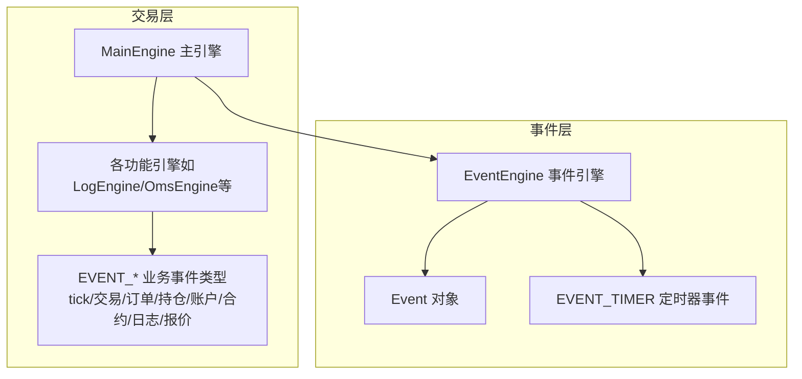
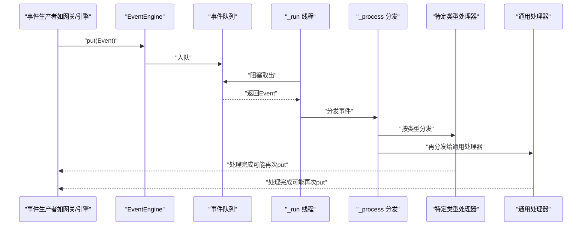
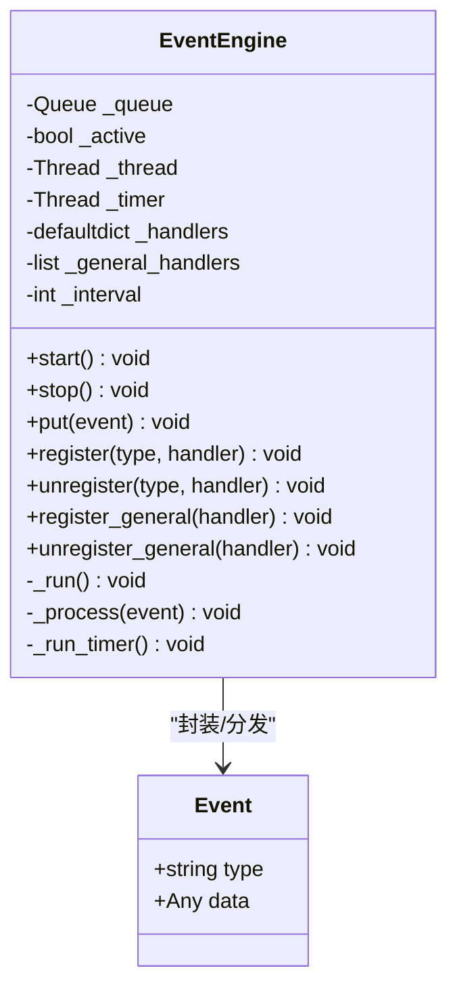
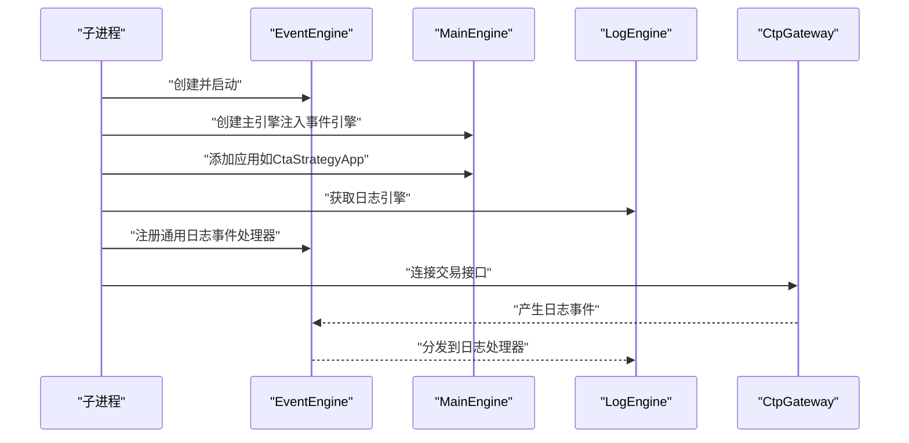
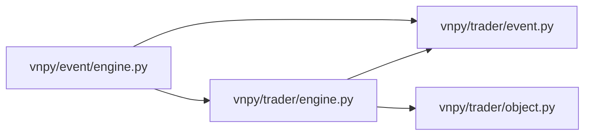

# 事件驱动架构

<cite>
**本文引用的文件**
- [vnpy/event/engine.py](file://vnpy/event/engine.py)
- [vnpy/event/__init__.py](file://vnpy/event/__init__.py)
- [vnpy/trader/event.py](file://vnpy/trader/event.py)
- [vnpy/trader/object.py](file://vnpy/trader/object.py)
- [vnpy/trader/engine.py](file://vnpy/trader/engine.py)
- [examples/no_ui/run.py](file://examples/no_ui/run.py)
</cite>

## 目录
1. [引言](#引言)
2. [项目结构](#项目结构)
3. [核心组件](#核心组件)
4. [架构总览](#架构总览)
5. [组件详解](#组件详解)
6. [依赖关系分析](#依赖关系分析)
7. [性能考量](#性能考量)
8. [故障排查指南](#故障排查指南)
9. [结论](#结论)
10. [附录](#附录)

## 引言
本文件系统性阐述VeighNa框架的事件驱动架构，重点围绕事件引擎（EventEngine）的设计理念与实现细节展开，涵盖事件对象（Event）结构、事件队列的异步处理、线程安全保障、事件注册/注销机制、通用处理器与特定类型处理器的差异及适用场景、定时器事件的生成与时间间隔配置，并结合框架内实际使用示例，给出组件间通信的最佳实践与常见问题排查建议。

## 项目结构
事件驱动相关的核心代码集中在vnpy/event与vnpy/trader两个子包中：
- vnpy/event：事件引擎与事件对象定义，提供事件分发、定时器、线程管理等基础能力
- vnpy/trader：交易平台层，定义各类业务事件类型常量，并在引擎初始化与组件交互中广泛使用事件进行解耦

图表来源
- [vnpy/event/engine.py](file://vnpy/event/engine.py#L13-L146)
- [vnpy/trader/event.py](file://vnpy/trader/event.py#L5-L15)
- [vnpy/trader/engine.py](file://vnpy/trader/engine.py#L81-L200)

章节来源
- [vnpy/event/engine.py](file://vnpy/event/engine.py#L1-L146)
- [vnpy/event/__init__.py](file://vnpy/event/__init__.py#L1-L9)
- [vnpy/trader/event.py](file://vnpy/trader/event.py#L1-L15)
- [vnpy/trader/engine.py](file://vnpy/trader/engine.py#L81-L200)

## 核心组件
- 事件对象（Event）
  - 结构：包含事件类型字符串与数据载荷，用于承载任意业务数据
  - 用途：作为事件引擎分发的基本单元
- 事件引擎（EventEngine）
  - 职责：维护事件队列、分发事件到已注册处理器、按间隔生成定时器事件、管理线程生命周期
  - 关键字段：事件队列、活跃标志、工作线程、定时器线程、按类型分组的处理器列表、通用处理器列表
  - 关键方法：启动/停止、入队（put）、注册/注销（特定类型与通用）、内部处理流程（_process）
- 事件类型常量
  - 定义：交易层统一定义了多种业务事件类型（如tick、trade、order、position、account、contract、log、quote），并导出定时器事件常量
- 主引擎（MainEngine）
  - 职责：聚合网关、引擎与应用，统一初始化事件引擎并启动，负责跨组件事件派发（如写日志）

章节来源
- [vnpy/event/engine.py](file://vnpy/event/engine.py#L16-L146)
- [vnpy/event/__init__.py](file://vnpy/event/__init__.py#L1-L9)
- [vnpy/trader/event.py](file://vnpy/trader/event.py#L5-L15)
- [vnpy/trader/engine.py](file://vnpy/trader/engine.py#L81-L200)

## 架构总览
事件驱动架构通过事件引擎实现“生产者-消费者”解耦：各组件可向事件引擎投递事件，事件引擎根据事件类型分发给对应处理器；同时，定时器线程周期性产生定时事件，供周期性任务使用。交易层通过统一的事件类型常量与主引擎，将日志、订单、行情等业务事件串联起来。

图表来源
- [vnpy/event/engine.py](file://vnpy/event/engine.py#L55-L88)

章节来源
- [vnpy/event/engine.py](file://vnpy/event/engine.py#L33-L146)

## 组件详解

### 事件对象（Event）
- 设计要点
  - 类型字段：字符串标识事件类别，决定分发路径
  - 数据字段：任意类型，承载业务数据（如数据类实例、字典等）
- 复杂度与性能
  - 读取/写入均为O(1)，内存占用低，适合高频事件流
- 使用建议
  - 将事件数据封装为轻量、可序列化的对象，避免在事件中传递大对象

章节来源
- [vnpy/event/engine.py](file://vnpy/event/engine.py#L16-L27)

### 事件引擎（EventEngine）
- 线程模型
  - 工作线程：从队列取出事件并调用分发逻辑
  - 定时器线程：按固定间隔休眠后生成定时器事件并入队
  - 停止时确保两线程join，避免资源泄漏
- 事件分发
  - 先按事件类型分发给特定类型处理器
  - 再分发给通用处理器（监听所有类型的处理器）
- 注册/注销机制
  - 特定类型处理器：按事件类型维护列表，去重注册
  - 通用处理器：独立列表，支持对所有事件生效
- 线程安全
  - 事件队列为线程安全队列
  - 列表操作未加锁，但注册/注销仅在引擎启动前或受控环境下进行，运行期通过put入队避免竞争
- 定时器事件
  - 默认间隔1秒，可通过构造参数调整
  - 生成固定类型常量的事件对象并入队

图表来源
- [vnpy/event/engine.py](file://vnpy/event/engine.py#L33-L146)

章节来源
- [vnpy/event/engine.py](file://vnpy/event/engine.py#L33-L146)

### 事件类型与业务集成
- 事件类型常量
  - 交易层集中定义了tick、trade、order、position、account、contract、log、quote等事件类型
  - 导出定时器事件常量，便于跨模块共享
- 主引擎中的事件使用
  - 写日志：构造日志数据对象，封装为事件后入队
  - 初始化与组件装配：主引擎统一启动事件引擎，供各功能引擎订阅

章节来源
- [vnpy/trader/event.py](file://vnpy/trader/event.py#L5-L15)
- [vnpy/trader/engine.py](file://vnpy/trader/engine.py#L81-L200)

### 实战示例：日志事件订阅
示例展示了如何在子进程中创建事件引擎与主引擎，注册日志事件处理器，并在连接交易接口后启动策略。该示例体现了事件引擎在组件间解耦通信中的关键作用。

图表来源
- [examples/no_ui/run.py](file://examples/no_ui/run.py#L56-L95)
- [vnpy/event/engine.py](file://vnpy/event/engine.py#L89-L146)
- [vnpy/trader/engine.py](file://vnpy/trader/engine.py#L81-L200)

章节来源
- [examples/no_ui/run.py](file://examples/no_ui/run.py#L56-L95)

## 依赖关系分析
- 模块耦合
  - vnpy/event：事件引擎独立模块，提供通用事件分发能力
  - vnpy/trader：业务层依赖事件引擎，定义事件类型常量并使用事件进行组件通信
- 关键依赖链
  - MainEngine依赖EventEngine并启动之
  - 各功能引擎通过EventEngine注册/注销处理器
  - 业务事件类型常量由交易层统一导出，供上层应用使用

图表来源
- [vnpy/event/engine.py](file://vnpy/event/engine.py#L1-L146)
- [vnpy/trader/engine.py](file://vnpy/trader/engine.py#L1-L200)
- [vnpy/trader/event.py](file://vnpy/trader/event.py#L1-L15)
- [vnpy/trader/object.py](file://vnpy/trader/object.py#L1-L428)

章节来源
- [vnpy/event/engine.py](file://vnpy/event/engine.py#L1-L146)
- [vnpy/trader/engine.py](file://vnpy/trader/engine.py#L1-L200)
- [vnpy/trader/event.py](file://vnpy/trader/event.py#L1-L15)
- [vnpy/trader/object.py](file://vnpy/trader/object.py#L1-L428)

## 性能考量
- 事件队列与分发
  - 使用线程安全队列，避免锁竞争；分发采用列表遍历，复杂度O(N)（N为处理器数量）
- 定时器开销
  - 定时器线程以固定间隔休眠并入队，开销极低；可通过调整间隔平衡实时性与CPU占用
- 处理器数量控制
  - 过多处理器会增加分发成本；建议按职责拆分引擎，减少单次事件的处理链路
- 数据对象大小
  - 避免在事件中传递大对象；必要时传递引用或标识符，由处理器按需加载

## 故障排查指南
- 事件未被处理
  - 检查是否正确注册处理器（特定类型或通用）
  - 确认事件类型字符串一致且拼写正确
- 处理器重复注册
  - 引擎已内置去重逻辑；若出现异常行为，检查注册时机与上下文
- 定时器事件不触发
  - 确认事件引擎已启动；检查间隔设置与线程状态
- 线程未退出
  - 调用停止方法后等待线程join；确认无阻塞在I/O或长耗时操作
- 日志事件未输出
  - 检查日志引擎是否正确注册；确认日志级别与输出配置

章节来源
- [vnpy/event/engine.py](file://vnpy/event/engine.py#L89-L146)
- [examples/no_ui/run.py](file://examples/no_ui/run.py#L56-L95)

## 结论
VeighNa的事件驱动架构以简洁高效的事件引擎为核心，通过事件类型分发与通用处理器机制，实现了组件间的松耦合通信。配合定时器事件与统一的业务事件类型常量，交易层能够以事件为纽带组织起日志、行情、订单、策略等复杂流程。实践中应关注处理器数量、事件数据规模与线程生命周期管理，以获得稳定与高性能的运行效果。

## 附录
- 事件类型一览（来自交易层）
  - tick、trade、order、position、account、contract、log、quote
  - 定时器事件常量（统一导出）
- 数据对象（与事件配合使用）
  - TickData、BarData、OrderData、TradeData、PositionData、AccountData、ContractData、LogData、QuoteData等

章节来源
- [vnpy/trader/event.py](file://vnpy/trader/event.py#L5-L15)
- [vnpy/trader/object.py](file://vnpy/trader/object.py#L17-L428)