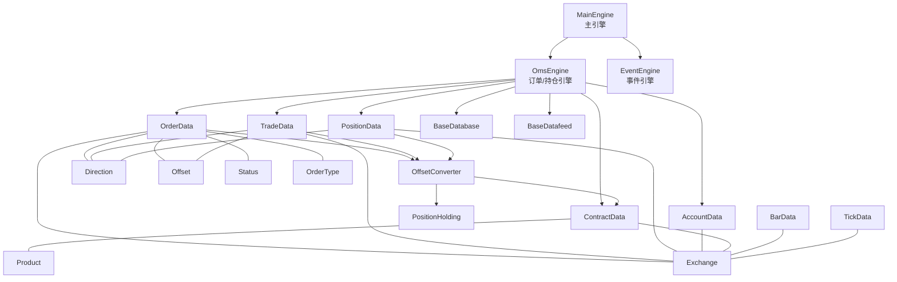
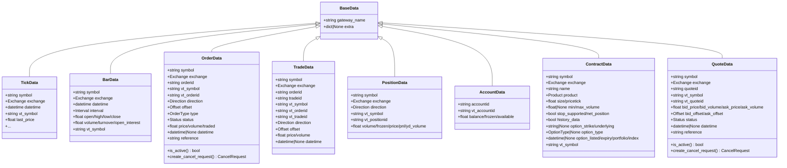
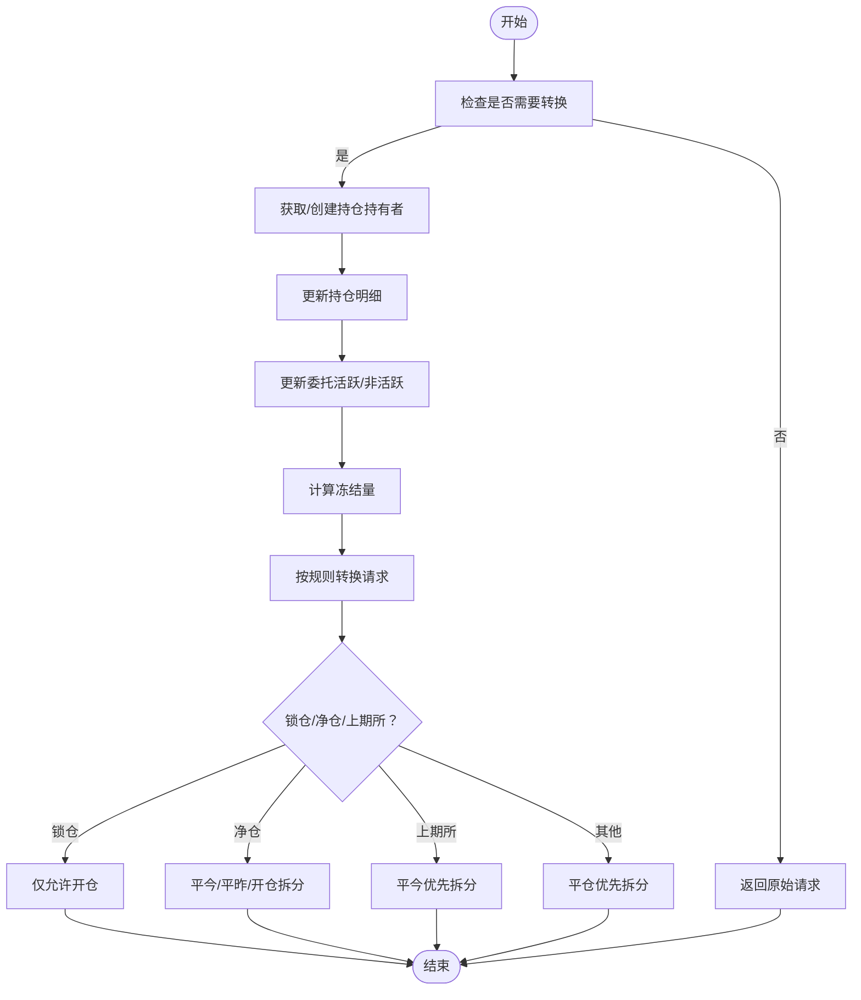
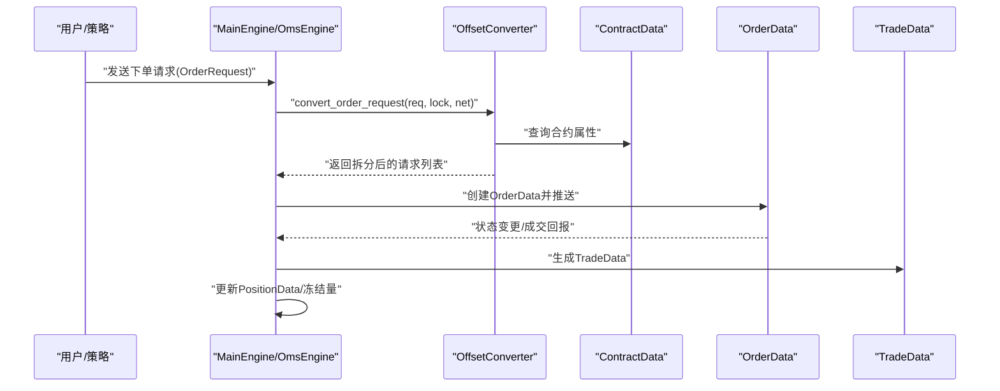
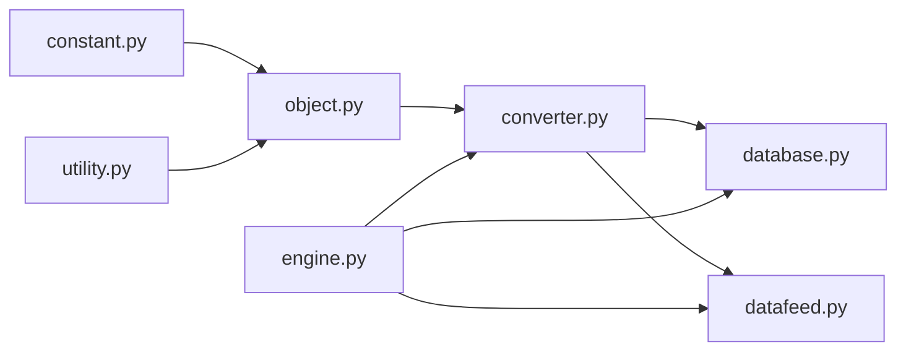

# 数据模型系统

<cite>
**本文引用的文件**
- [vnpy/trader/object.py](file://vnpy/trader/object.py)
- [vnpy/trader/constant.py](file://vnpy/trader/constant.py)
- [vnpy/trader/converter.py](file://vnpy/trader/converter.py)
- [vnpy/trader/database.py](file://vnpy/trader/database.py)
- [vnpy/trader/datafeed.py](file://vnpy/trader/datafeed.py)
- [vnpy/trader/engine.py](file://vnpy/trader/engine.py)
- [vnpy/trader/utility.py](file://vnpy/trader/utility.py)
</cite>

## 目录
1. [引言](#引言)
2. [项目结构](#项目结构)
3. [核心组件](#核心组件)
4. [架构总览](#架构总览)
5. [详细组件分析](#详细组件分析)
6. [依赖关系分析](#依赖关系分析)
7. [性能考量](#性能考量)
8. [故障排查指南](#故障排查指南)
9. [结论](#结论)
10. [附录](#附录)

## 引言
本文件系统性梳理 VeighNa 框架的数据模型体系，围绕基础数据类 BaseData 的设计理念与继承体系展开，详解 TickData、BarData、OrderData、TradeData、PositionData、AccountData、ContractData、QuoteData 等核心数据对象的结构与业务语义；阐明常量系统 Direction、Offset、Status 等的标准化价值与使用方式；解释 Converter（OffsetConverter 与 PositionHolding）在不同市场规则下的订单/持仓转换与冻结逻辑；并给出扩展方法、序列化机制与性能优化策略，以及最佳实践与常见陷阱。

## 项目结构
数据模型相关代码主要集中在 vnpy/trader 子包内，核心文件如下：
- object.py：定义基础数据类 BaseData 及各类数据对象（行情、K线、订单、成交、持仓、账户、合约、报价、请求等）
- constant.py：定义方向、开平、状态、产品、价格类型、交易所、币种、周期等枚举常量
- converter.py：实现订单偏移转换器 OffsetConverter 与持仓持有者 PositionHolding，处理不同交易所的平仓优先级与锁仓/净仓逻辑
- database.py：抽象数据库接口 BaseDatabase，提供 BarOverview/TickOverview 等概览数据结构
- datafeed.py：抽象数据源接口 BaseDatafeed，提供历史数据查询能力
- engine.py：主引擎 MainEngine 汇聚各引擎与服务，暴露统一数据访问入口
- utility.py：提供 vt_symbol 生成与解析、价格对齐、时区工具等通用能力

```mermaid
graph TB
subgraph "数据模型层"
BaseData["BaseData<br/>基础数据类"]
TickData["TickData<br/>Tick行情"]
BarData["BarData<br/>K线"]
OrderData["OrderData<br/>委托"]
TradeData["TradeData<br/>成交"]
PositionData["PositionData<br/>持仓"]
AccountData["AccountData<br/>账户"]
ContractData["ContractData<br/>合约"]
QuoteData["QuoteData<br/>报价"]
ReqSub["SubscribeRequest<br/>订阅请求"]
ReqOrder["OrderRequest<br/>下单请求"]
ReqCancel["CancelRequest<br/>撤单请求"]
ReqHist["HistoryRequest<br/>历史请求"]
ReqQuote["QuoteRequest<br/>报价请求"]
end
subgraph "常量系统"
Direction["Direction<br/>方向"]
Offset["Offset<br/>开平"]
Status["Status<br/>状态"]
Product["Product<br/>产品"]
OrderType["OrderType<br/>价格类型"]
Exchange["Exchange<br/>交易所"]
Interval["Interval<br/>周期"]
end
subgraph "转换与存储"
Converter["OffsetConverter<br/>偏移转换器"]
PosHold["PositionHolding<br/>持仓持有者"]
DB["BaseDatabase<br/>数据库接口"]
DF["BaseDatafeed<br/>数据源接口"]
end
BaseData --> TickData
BaseData --> BarData
BaseData --> OrderData
BaseData --> TradeData
BaseData --> PositionData
BaseData --> AccountData
BaseData --> ContractData
BaseData --> QuoteData
TickData --- Direction
TickData --- Exchange
BarData --- Exchange
OrderData --- Direction
OrderData --- Offset
OrderData --- Status
OrderData --- OrderType
OrderData --- Exchange
TradeData --- Direction
TradeData --- Offset
TradeData --- Exchange
PositionData --- Direction
PositionData --- Exchange
AccountData --- Exchange
ContractData --- Product
ContractData --- Exchange
QuoteData --- Direction
QuoteData --- Offset
QuoteData --- Status
QuoteData --- Exchange
ReqOrder --- Direction
ReqOrder --- Offset
ReqOrder --- OrderType
ReqOrder --- Exchange
ReqCancel --- Exchange
ReqHist --- Exchange
ReqHist --- Interval
ReqSub --- Exchange
ReqQuote --- Offset
ReqQuote --- Exchange
Converter --> PosHold
Converter --> ContractData
Converter --> OrderData
Converter --> TradeData
Converter --> OrderRequest
DB --- BarData
DB --- TickData
DF --- BarData
DF --- TickData
```

图表来源
- [vnpy/trader/object.py](file://vnpy/trader/object.py#L17-L428)
- [vnpy/trader/constant.py](file://vnpy/trader/constant.py#L10-L161)
- [vnpy/trader/converter.py](file://vnpy/trader/converter.py#L17-L403)
- [vnpy/trader/database.py](file://vnpy/trader/database.py#L25-L160)
- [vnpy/trader/datafeed.py](file://vnpy/trader/datafeed.py#L10-L69)

章节来源
- [vnpy/trader/object.py](file://vnpy/trader/object.py#L17-L428)
- [vnpy/trader/constant.py](file://vnpy/trader/constant.py#L10-L161)
- [vnpy/trader/converter.py](file://vnpy/trader/converter.py#L17-L403)
- [vnpy/trader/database.py](file://vnpy/trader/database.py#L25-L160)
- [vnpy/trader/datafeed.py](file://vnpy/trader/datafeed.py#L10-L69)

## 核心组件
本节聚焦基础数据类 BaseData 的设计理念与继承体系，以及各类数据对象的字段、类型约束与验证机制。

- 基础数据类 BaseData
  - 设计理念：所有数据对象均需携带网关标识 gateway_name，并可选地保留额外扩展字段 extra（字典形式），便于跨网关兼容与扩展。
  - 字段与约束：gateway_name 必填；extra 默认为 None，且标记为不可显式传入（由内部初始化）。
  - 作用：作为所有业务数据对象的基类，统一 vt_symbol 生成与跨模块传递。

- 行情类
  - TickData：包含最新价、成交量、持仓变化、五档买卖价与量、涨停/跌停、本地时间等字段；通过 __post_init__ 自动生成 vt_symbol。
  - BarData：包含周期 interval、开盘/最高/最低/收盘价、成交量/成交额/持仓变化等；同样在 __post_init__ 中生成 vt_symbol。

- 委托与成交类
  - OrderData：包含 symbol/exchange/orderid、方向/开平、价格/数量/已成交、状态、引用信息、时间戳等；__post_init__ 生成 vt_symbol 与 vt_orderid，并提供 is_active 判断与取消请求构造。
  - TradeData：包含成交编号、方向/开平、价格/数量、时间戳；__post_init__ 生成 vt_symbol/vt_orderid/vt_tradeid。

- 持仓与账户类
  - PositionData：包含 symbol/exchange/direction、总量/冻结量/均价/浮动盈亏/昨仓；__post_init__ 生成 vt_symbol 与 vt_positionid。
  - AccountData：包含账户编号、余额/冻结；__post_init__ 计算可用资金与 vt_accountid。

- 合约与报价类
  - ContractData：包含产品类型、合约乘数/最小变动价位、最小/最大下单量、是否支持止损、是否净仓模式、是否提供历史数据等；__post_init__ 生成 vt_symbol。
  - QuoteData：包含报价编号、bid/ask 价与量、开平、状态、引用信息；__post_init__ 生成 vt_symbol/vt_quoteid，并提供 is_active 与取消请求构造。

- 请求类
  - SubscribeRequest：订阅行情请求，生成 vt_symbol。
  - OrderRequest：下单请求，生成 vt_symbol，并提供 create_order_data 工具方法。
  - CancelRequest：撤单请求，生成 vt_symbol。
  - HistoryRequest：历史数据请求，生成 vt_symbol。
  - QuoteRequest：报价请求，生成 vt_symbol，并提供 create_quote_data 工具方法。

章节来源
- [vnpy/trader/object.py](file://vnpy/trader/object.py#L17-L428)

## 架构总览
数据模型在系统中的位置与交互如下：
- 常量系统为所有数据对象提供标准化的枚举值，确保跨模块一致的语义表达。
- 数据对象通过 BaseData 统一承载网关标识与 vt_symbol，保证跨网关与跨模块的唯一性与可追溯性。
- Converter 在订单层面根据合约属性与交易所规则进行偏移转换，确保下单符合市场要求。
- Database/Datafeed 抽象了数据的持久化与历史数据获取，数据对象作为输入输出载体。
- Engine 层汇聚各类能力，提供统一查询与转换接口。

图表来源
- [vnpy/trader/engine.py](file://vnpy/trader/engine.py#L81-L200)
- [vnpy/trader/converter.py](file://vnpy/trader/converter.py#L310-L403)
- [vnpy/trader/database.py](file://vnpy/trader/database.py#L52-L160)
- [vnpy/trader/datafeed.py](file://vnpy/trader/datafeed.py#L10-L69)
- [vnpy/trader/object.py](file://vnpy/trader/object.py#L17-L428)
- [vnpy/trader/constant.py](file://vnpy/trader/constant.py#L10-L161)

## 详细组件分析

### 基础数据类与继承体系
- 设计要点
  - 使用 dataclass 简化字段声明与默认值管理，统一 __post_init__ 生成 vt_symbol/vt_* 标识，降低重复代码。
  - 所有对象均继承 BaseData，确保跨模块一致性与可扩展性。
- 关键字段与类型
  - 时间字段统一为 datetime 类型，便于排序与计算。
  - 数值字段采用 float，配合 utility 中的价格对齐工具进行精度控制。
  - 枚举字段来自 constant.py，保证语义标准化。

图表来源
- [vnpy/trader/object.py](file://vnpy/trader/object.py#L17-L428)

章节来源
- [vnpy/trader/object.py](file://vnpy/trader/object.py#L17-L428)

### 常量系统（Direction、Offset、Status 等）
- 标准化价值
  - 统一方向（多/空/净）、开平（开/平/平今/平昨）、状态（提交中/未成交/部分成交/全部成交/已撤销/拒单）等语义，避免字符串拼写差异导致的错误。
  - 支持本地化显示文本，提升界面友好度。
- 使用方法
  - 在数据对象中以枚举类型字段出现，如 OrderData 的 direction/offset/status。
  - 在业务逻辑中通过枚举比较与分支判断，确保行为一致。

章节来源
- [vnpy/trader/constant.py](file://vnpy/trader/constant.py#L10-L161)

### 数据转换器（OffsetConverter 与 PositionHolding）
- 设计目标
  - 针对不同交易所与合约模式（净仓/锁仓/普通）自动拆分/合并订单请求，满足平仓优先级与可用仓位限制。
- 核心流程
  - 更新：接收 PositionData/OrderData/TradeData，维护 PositionHolding 内部的总仓、td/yd 明细与冻结量。
  - 计算冻结：遍历活跃委托，按开平与方向累计冻结量，并校正不超过可用量。
  - 转换：根据合约属性与锁仓/净仓开关，将 OrderRequest 拆分为多个子请求或保持不变。
- 关键规则
  - 上期所/国际能源交易中心（SHFE/INE）：平仓优先使用“平今”，不足再用“平昨”。
  - 其他交易所：平仓优先使用“平仓”，若为锁仓则强制“开仓”。
  - 冻结量校正：当计算出的冻结超过可用量时，优先从“平今”扣减，不足再从“平昨”扣减。

图表来源
- [vnpy/trader/converter.py](file://vnpy/trader/converter.py#L310-L403)

章节来源
- [vnpy/trader/converter.py](file://vnpy/trader/converter.py#L17-L403)

### 数据对象的业务含义与字段设计
- TickData：用于高频行情快照，字段覆盖最新价、成交量、买卖盘口与涨跌停限制，适合实时风控与信号触发。
- BarData：用于技术分析与回测，字段覆盖 OHLCV 与持仓变化，interval 标识周期。
- OrderData：记录委托生命周期，含状态机与取消请求生成，支撑订单管理与风控。
- TradeData：记录成交细节，支持按开平统计收益与风控。
- PositionData：记录单腿持仓，区分 td/yd 并跟踪冻结与浮动盈亏。
- AccountData：记录账户资金状况，计算可用资金。
- ContractData：记录合约参数与市场特性，决定转换器行为与下单规则。
- QuoteData：记录报价状态与可撤单能力，支持报价引擎。

章节来源
- [vnpy/trader/object.py](file://vnpy/trader/object.py#L29-L428)

### 请求对象与数据转换链路
- 订单请求链路
  - OrderRequest → create_order_data → OrderData → 订单引擎 → 委托回报 → TradeData/OrderData 更新 → PositionData 更新 → 冻结量调整
- 历史数据链路
  - HistoryRequest → BaseDatafeed.query_bar_history/tick_history → BarData/TickData 列表
- 数据存储链路
  - BarData/TickData → BaseDatabase.save_bar_data/save_tick_data → 持久化

图表来源
- [vnpy/trader/converter.py](file://vnpy/trader/converter.py#L367-L389)
- [vnpy/trader/object.py](file://vnpy/trader/object.py#L321-L356)
- [vnpy/trader/engine.py](file://vnpy/trader/engine.py#L161-L163)

章节来源
- [vnpy/trader/converter.py](file://vnpy/trader/converter.py#L310-L403)
- [vnpy/trader/object.py](file://vnpy/trader/object.py#L321-L356)
- [vnpy/trader/engine.py](file://vnpy/trader/engine.py#L161-L163)

## 依赖关系分析
- 组件耦合
  - 数据对象强依赖常量系统（Direction/Offset/Status/Exchange/Interval/Product/OrderType），确保语义一致。
  - Converter 依赖 ContractData 与 OrderData/TradeData，形成“合约参数 → 订单转换 → 实际成交”的闭环。
  - Database/Datafeed 以数据对象为输入输出，解耦具体实现。
- 外部依赖
  - utility 提供 vt_symbol 生成/解析与价格对齐工具，贯穿数据模型使用。
  - engine 汇聚各能力，提供统一入口。

图表来源
- [vnpy/trader/constant.py](file://vnpy/trader/constant.py#L10-L161)
- [vnpy/trader/object.py](file://vnpy/trader/object.py#L17-L428)
- [vnpy/trader/converter.py](file://vnpy/trader/converter.py#L17-L403)
- [vnpy/trader/database.py](file://vnpy/trader/database.py#L52-L160)
- [vnpy/trader/datafeed.py](file://vnpy/trader/datafeed.py#L10-L69)
- [vnpy/trader/utility.py](file://vnpy/trader/utility.py#L23-L36)
- [vnpy/trader/engine.py](file://vnpy/trader/engine.py#L81-L200)

章节来源
- [vnpy/trader/constant.py](file://vnpy/trader/constant.py#L10-L161)
- [vnpy/trader/object.py](file://vnpy/trader/object.py#L17-L428)
- [vnpy/trader/converter.py](file://vnpy/trader/converter.py#L17-L403)
- [vnpy/trader/database.py](file://vnpy/trader/database.py#L52-L160)
- [vnpy/trader/datafeed.py](file://vnpy/trader/datafeed.py#L10-L69)
- [vnpy/trader/utility.py](file://vnpy/trader/utility.py#L23-L36)
- [vnpy/trader/engine.py](file://vnpy/trader/engine.py#L81-L200)

## 性能考量
- 数据结构选择
  - 使用 dataclass 减少样板代码，提升字段访问效率；合理设置默认值与可选字段，避免冗余内存占用。
- 订单转换复杂度
  - PositionHolding 内部以字典维护活跃委托，查找/删除均为平均 O(1)，整体转换流程 O(N)（N 为活跃委托数）。
- 冻结量计算
  - 通过一次遍历累计冻结并校正，避免多次扫描；对 SHFE/INE 的特殊处理为常量时间分支。
- 序列化与持久化
  - 数据对象作为数据传输载体，建议结合 JSON 序列化（参考 utility 中的 load_json/save_json）进行轻量持久化；对于大批量历史数据，优先使用 BaseDatabase 接口的批量保存/加载。
- 时区与精度
  - 使用 utility 的时区转换与价格对齐工具，减少浮点误差与跨时区问题带来的额外计算。

[本节为通用性能讨论，不直接分析具体文件]

## 故障排查指南
- vt_symbol 不匹配
  - 现象：跨网关或跨模块查询不到数据。
  - 排查：确认 symbol 与 exchange 是否一致；使用 utility.extract_vt_symbol/generate_vt_symbol 校验格式。
- 订单状态异常
  - 现象：订单长时间处于“提交中”或“未成交”。
  - 排查：检查 OrderData.status 与 ACTIVE_STATUSES；确认网关回调是否正确推送。
- 冻结量异常
  - 现象：可用仓位与实际可平量不符。
  - 排查：核对 OffsetConverter 的冻结计算逻辑；确认合约 net_position 属性与交易所是否为 SHFE/INE。
- 历史数据为空
  - 现象：query_bar_history/query_tick_history 返回空列表。
  - 排查：确认 datafeed 配置与模块导入；检查 HistoryRequest 的 symbol/exchange/interval/start/end。
- 数据库写入失败
  - 现象：save_bar_data/save_tick_data 返回失败。
  - 排查：确认数据库驱动模块存在；检查时间字段时区转换与索引。

章节来源
- [vnpy/trader/utility.py](file://vnpy/trader/utility.py#L23-L36)
- [vnpy/trader/converter.py](file://vnpy/trader/converter.py#L112-L167)
- [vnpy/trader/datafeed.py](file://vnpy/trader/datafeed.py#L15-L69)
- [vnpy/trader/database.py](file://vnpy/trader/database.py#L52-L160)

## 结论
VeighNa 的数据模型系统以 BaseData 为核心，通过标准化的常量系统与丰富的数据对象，构建了高内聚、低耦合的数据层。Converter 在不同市场规则下实现了灵活的订单转换与冻结管理，Database/Datafeed 抽象提供了可插拔的存储与数据源能力。遵循本文的最佳实践与排错方法，可在保证一致性的同时获得良好的性能与可维护性。

[本节为总结性内容，不直接分析具体文件]

## 附录

### 扩展方法
- 新增数据对象
  - 继承 BaseData，定义必要字段与默认值；在 __post_init__ 中生成 vt_symbol/vt_* 标识。
  - 若涉及订单/成交/持仓，考虑是否需要参与 OffsetConverter 的转换逻辑。
- 新增常量
  - 在 constant.py 中添加枚举项，确保与业务语义一致；如需本地化，补充本地化文本。
- 新增转换规则
  - 在 PositionHolding 或 OffsetConverter 中增加针对新交易所/新合约模式的分支逻辑，保持冻结量与可用量的一致性。

章节来源
- [vnpy/trader/object.py](file://vnpy/trader/object.py#L17-L428)
- [vnpy/trader/constant.py](file://vnpy/trader/constant.py#L10-L161)
- [vnpy/trader/converter.py](file://vnpy/trader/converter.py#L17-L403)

### 序列化机制与最佳实践
- 序列化
  - 使用 utility 中的 load_json/save_json 进行轻量持久化；对于大数据集，优先使用 BaseDatabase 的批量接口。
- 最佳实践
  - 统一使用 vt_symbol 作为跨模块键值，避免直接使用 symbol+exchange 拼接。
  - 对价格字段使用 utility.round_to/floor_to/ceil_to 对齐到 pricetick。
  - 在跨时区场景，使用 database.convert_tz 将 datetime 转换为数据库时区。
  - 订单状态判断使用 ACTIVE_STATUSES，避免硬编码状态值。

章节来源
- [vnpy/trader/utility.py](file://vnpy/trader/utility.py#L91-L147)
- [vnpy/trader/database.py](file://vnpy/trader/database.py#L17-L23)
- [vnpy/trader/object.py](file://vnpy/trader/object.py#L14-L14)