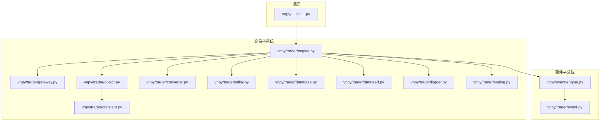
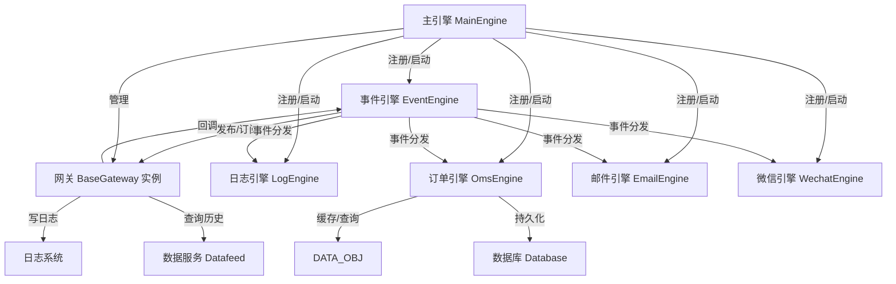
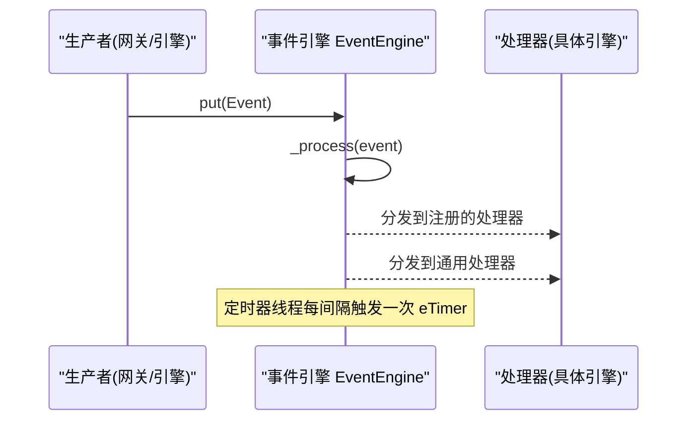
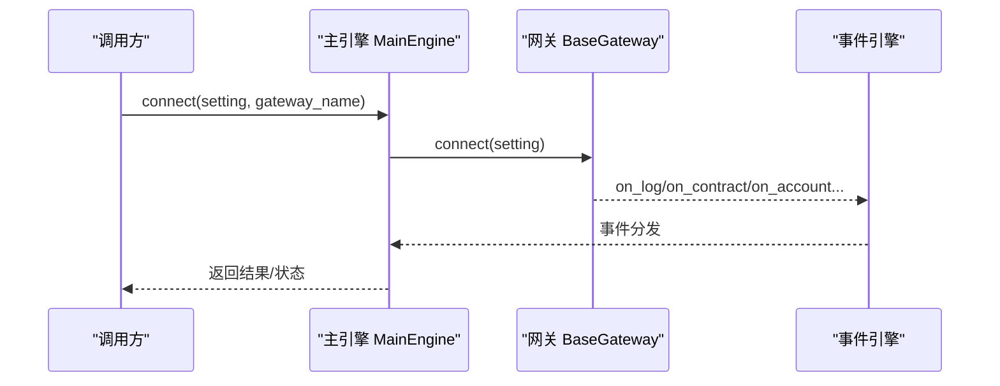
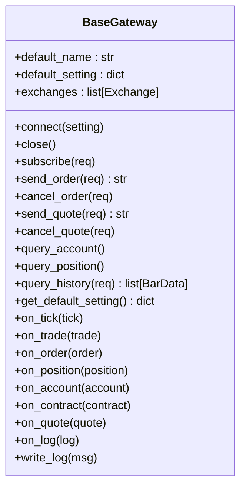
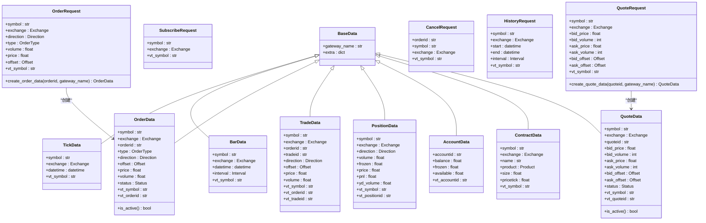
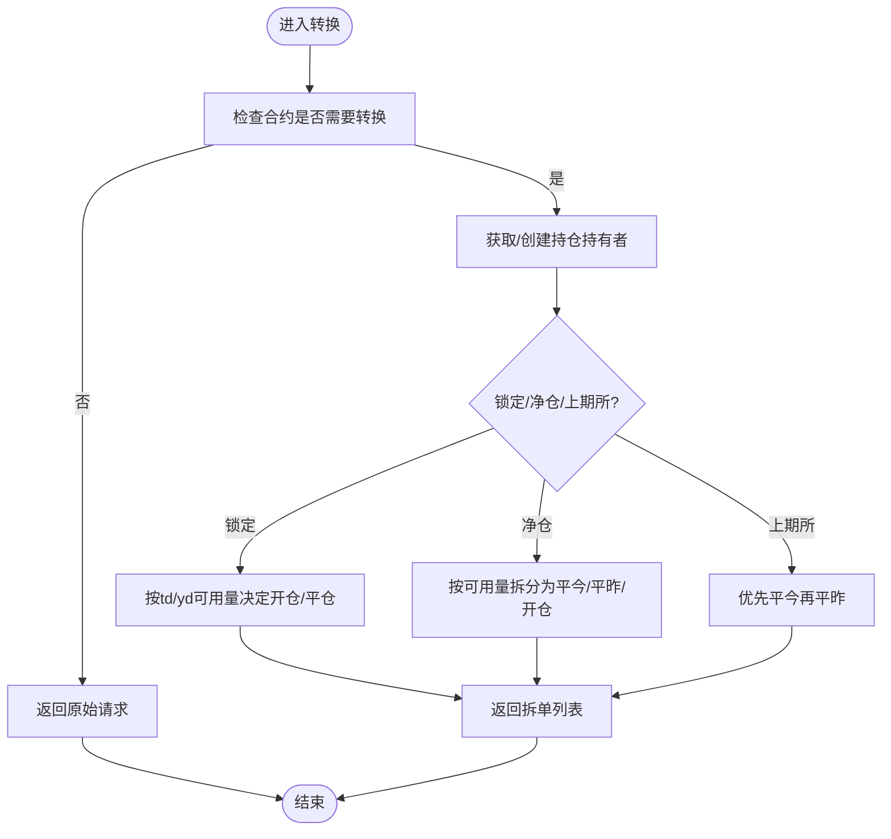
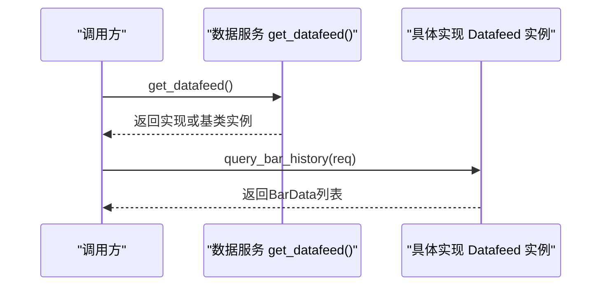
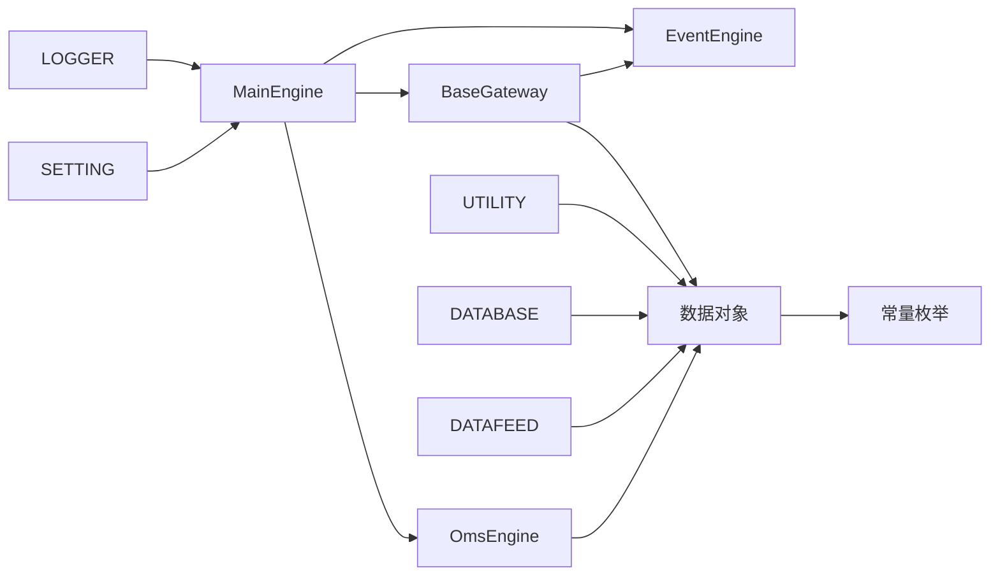

# 核心架构设计

<cite>
**本文档引用的文件**
- [vnpy\trader\engine.py](file://vnpy/trader/engine.py)
- [vnpy\event\engine.py](file://vnpy/event/engine.py)
- [vnpy\trader\gateway.py](file://vnpy/trader/gateway.py)
- [vnpy\trader\object.py](file://vnpy/trader/object.py)
- [vnpy\trader\constant.py](file://vnpy/trader/constant.py)
- [vnpy\trader\converter.py](file://vnpy/trader/converter.py)
- [vnpy\trader\event.py](file://vnpy/trader/event.py)
- [vnpy\trader\utility.py](file://vnpy/trader/utility.py)
- [vnpy\trader\database.py](file://vnpy/trader/database.py)
- [vnpy\trader\datafeed.py](file://vnpy/trader/datafeed.py)
- [vnpy\trader\logger.py](file://vnpy/trader/logger.py)
- [vnpy\trader\setting.py](file://vnpy/trader/setting.py)
- [vnpy\__init__.py](file://vnpy/__init__.py)
</cite>

## 目录
1. [引言](#引言)
2. [项目结构](#项目结构)
3. [核心组件](#核心组件)
4. [架构总览](#架构总览)
5. [详细组件分析](#详细组件分析)
6. [依赖关系分析](#依赖关系分析)
7. [性能考虑](#性能考虑)
8. [故障排查指南](#故障排查指南)
9. [结论](#结论)

## 引言
本文件面向VeighNa量化交易框架的核心架构，围绕事件驱动设计、主引擎协调机制、网关接口扩展模式、数据对象模型与类型系统进行深入解析，并通过多种架构图与流程图帮助开发者全面理解框架内部工作机制。

## 项目结构
VeighNa采用分层+模块化的组织方式：
- 顶层模块vnpy提供版本信息与基础能力
- 交易子系统vnpy/trader包含事件引擎、主引擎、网关抽象、数据对象、工具库等
- 事件子系统vnpy/event提供事件驱动基础设施
- 数据存储与数据服务通过database与datafeed抽象对接不同实现
- 日志与设置位于trader目录下，统一管理运行时行为

**图表来源**
- [vnpy\__init__.py](file://vnpy/__init__.py#L24-L25)
- [vnpy\event\engine.py](file://vnpy/event/engine.py#L33-L146)
- [vnpy\trader\engine.py](file://vnpy/trader/engine.py#L81-L324)
- [vnpy\trader\gateway.py](file://vnpy/trader/gateway.py#L33-L273)
- [vnpy\trader\object.py](file://vnpy/trader/object.py#L17-L428)
- [vnpy\trader\constant.py](file://vnpy/trader/constant.py#L10-L161)
- [vnpy\trader\converter.py](file://vnpy/trader/converter.py#L17-L403)
- [vnpy\trader\event.py](file://vnpy/trader/event.py#L7-L15)
- [vnpy\trader\utility.py](file://vnpy/trader/utility.py#L23-L118)
- [vnpy\trader\database.py](file://vnpy/trader/database.py#L52-L160)
- [vnpy\trader\datafeed.py](file://vnpy/trader/datafeed.py#L10-L69)
- [vnpy\trader\logger.py](file://vnpy/trader/logger.py#L22-L56)
- [vnpy\trader\setting.py](file://vnpy/trader/setting.py#L11-L44)

**章节来源**
- [vnpy\__init__.py](file://vnpy/__init__.py#L24-L25)
- [vnpy\event\engine.py](file://vnpy/event/engine.py#L33-L146)
- [vnpy\trader\engine.py](file://vnpy/trader/engine.py#L81-L324)

## 核心组件
- 事件引擎(EventEngine)：提供事件队列、定时器、处理器注册/注销机制，是整个平台的异步中枢
- 主引擎(MainEngine)：集中管理事件引擎、网关、功能引擎、应用，提供统一入口与协调
- 网关抽象(BaseGateway)：定义与交易所或外部系统的连接、订阅、下单、历史数据查询等接口规范
- 数据对象模型：基于dataclass的数据结构，统一vt_symbol命名规则与跨网关标识
- 类型系统：Direction/Offset/Status/Product/OrderType/Interval/Exchange等枚举构成强类型约束
- 订单转换器(OffsetConverter)：根据合约属性与持仓情况，将订单请求转换为符合交易所规则的拆单
- 工具库：vt_symbol解析/生成、价格取整、Bar/Array管理、技术指标封装等
- 数据存储与数据服务：数据库抽象与数据源抽象，支持插件化扩展
- 日志与设置：统一日志格式、级别与输出目标；全局配置项集中管理

**章节来源**
- [vnpy\event\engine.py](file://vnpy/event/engine.py#L33-L146)
- [vnpy\trader\engine.py](file://vnpy/trader/engine.py#L81-L324)
- [vnpy\trader\gateway.py](file://vnpy/trader/gateway.py#L33-L273)
- [vnpy\trader\object.py](file://vnpy/trader/object.py#L17-L428)
- [vnpy\trader\constant.py](file://vnpy/trader/constant.py#L10-L161)
- [vnpy\trader\converter.py](file://vnpy/trader/converter.py#L310-L403)
- [vnpy\trader\utility.py](file://vnpy/trader/utility.py#L23-L118)
- [vnpy\trader\database.py](file://vnpy/trader/database.py#L52-L160)
- [vnpy\trader\datafeed.py](file://vnpy/trader/datafeed.py#L10-L69)
- [vnpy\trader\logger.py](file://vnpy/trader/logger.py#L22-L56)
- [vnpy\trader\setting.py](file://vnpy/trader/setting.py#L11-L44)

## 架构总览
VeighNa采用“事件驱动 + 插件化网关 + 统一数据模型”的架构设计。事件引擎负责跨组件解耦，主引擎作为协调者聚合各类功能引擎（如日志、邮件、微信、订单管理）与网关实例，数据对象在各模块间以标准化形式传递，类型系统确保一致性与可维护性。

**图表来源**
- [vnpy\event\engine.py](file://vnpy/event/engine.py#L33-L146)
- [vnpy\trader\engine.py](file://vnpy/trader/engine.py#L81-L324)
- [vnpy\trader\gateway.py](file://vnpy/trader/gateway.py#L86-L158)
- [vnpy\trader\object.py](file://vnpy/trader/object.py#L17-L428)
- [vnpy\trader\database.py](file://vnpy/trader/database.py#L52-L160)
- [vnpy\trader\datafeed.py](file://vnpy/trader/datafeed.py#L10-L69)
- [vnpy\trader\logger.py](file://vnpy/trader/logger.py#L22-L56)

## 详细组件分析

### 事件驱动架构与事件引擎
- 设计要点
  - 使用队列承载事件，线程安全地异步处理
  - 支持按事件类型分发与通用处理器分发
  - 定时器事件用于周期性任务调度
- 关键接口
  - 注册处理器：register(type, handler)、register_general(handler)
  - 发布事件：put(event)
  - 启停控制：start()、stop()

**图表来源**
- [vnpy\event\engine.py](file://vnpy/event/engine.py#L55-L88)
- [vnpy\event\engine.py](file://vnpy/event/engine.py#L105-L146)

**章节来源**
- [vnpy\event\engine.py](file://vnpy/event/engine.py#L33-L146)

### 主引擎(MainEngine)的协调机制
- 职责
  - 初始化事件引擎并启动
  - 管理网关、功能引擎、应用
  - 提供统一API：连接、订阅、下单、撤单、查询历史等
  - 写日志与通知推送
- 关键流程
  - add_engine/add_gateway/add_app：注册并初始化组件
  - init_engines：集中初始化日志、订单、邮件、微信引擎
  - write_log/send_notification：通过事件引擎广播日志与通知

**图表来源**
- [vnpy\trader\engine.py](file://vnpy/trader/engine.py#L234-L243)
- [vnpy\trader\gateway.py](file://vnpy/trader/gateway.py#L160-L187)
- [vnpy\event\engine.py](file://vnpy/event/engine.py#L105-L146)

**章节来源**
- [vnpy\trader\engine.py](file://vnpy/trader/engine.py#L81-L324)

### 网关接口(BaseGateway)设计与扩展
- 设计原则
  - 线程安全：所有方法非阻塞、无共享可变状态
  - 回调驱动：收到数据后通过on_xxx回调上送事件
  - 自动重连：断线自动恢复
- 必须实现的方法
  - connect/close/subscribe/send_order/cancel_order/query_account/query_position/query_history
- 可选增强
  - send_quote/cancel_quote
- 扩展步骤
  - 继承BaseGateway，实现上述方法
  - 在主引擎中add_gateway注册实例
  - 通过事件引擎接收市场数据与回报

**图表来源**
- [vnpy\trader\gateway.py](file://vnpy/trader/gateway.py#L33-L273)

**章节来源**
- [vnpy\trader\gateway.py](file://vnpy/trader/gateway.py#L33-L273)

### 数据对象模型与类型系统
- 数据对象
  - 基类：BaseData，统一gateway_name与扩展字段
  - 具体对象：TickData、BarData、OrderData、TradeData、PositionData、AccountData、ContractData、QuoteData、请求对象：SubscribeRequest、OrderRequest、CancelRequest、HistoryRequest、QuoteRequest
- 命名约定
  - vt_symbol："{symbol}.{exchange.value}"，vt_orderid/ vt_tradeid/ vt_accountid/ vt_positionid等统一前缀
- 类型系统
  - 方向/偏移/状态/产品/订单类型/时间粒度/交易所/货币等枚举，保证跨模块一致

**图表来源**
- [vnpy\trader\object.py](file://vnpy/trader/object.py#L17-L428)
- [vnpy\trader\constant.py](file://vnpy/trader/constant.py#L10-L161)

**章节来源**
- [vnpy\trader\object.py](file://vnpy/trader/object.py#L17-L428)
- [vnpy\trader\constant.py](file://vnpy/trader/constant.py#L10-L161)

### 订单转换器(OffsetConverter)与复杂逻辑
- 目标
  - 针对不同交易所与合约模式，将用户请求转换为符合规则的拆单
- 关键算法
  - 持仓持有者(PositionHolding)：维护td/yd/冻结量与活跃委托映射
  - 转换策略：
    - 上期所/能源所：优先平今再平昨
    - 锁定模式：仅能开仓
    - 净仓模式：按可用量拆分为平今/平昨/开仓
- 流程图

**图表来源**
- [vnpy\trader\converter.py](file://vnpy/trader/converter.py#L367-L403)
- [vnpy\trader\converter.py](file://vnpy/trader/converter.py#L168-L308)

**章节来源**
- [vnpy\trader\converter.py](file://vnpy/trader/converter.py#L17-L403)

### 工具库与数据服务/存储抽象
- 工具库
  - vt_symbol解析/生成、价格取整、Bar/Array管理、技术指标封装
- 数据服务(Datafeed)
  - 抽象查询历史K线/Tick接口，支持按名称动态加载实现
- 数据库(Database)
  - 抽象保存/加载/删除/概览接口，支持按名称动态加载实现

**图表来源**
- [vnpy\trader\datafeed.py](file://vnpy/trader/datafeed.py#L39-L69)
- [vnpy\trader\database.py](file://vnpy/trader/database.py#L139-L160)

**章节来源**
- [vnpy\trader\utility.py](file://vnpy/trader/utility.py#L23-L118)
- [vnpy\trader\datafeed.py](file://vnpy/trader/datafeed.py#L10-L69)
- [vnpy\trader\database.py](file://vnpy/trader/database.py#L52-L160)

## 依赖关系分析
- 组件耦合
  - MainEngine对EventEngine、Gateway、Engine均存在强依赖
  - OmsEngine对EventEngine与数据对象有直接依赖
  - Gateway通过EventEngine与上层解耦
- 外部依赖
  - 日志：loguru
  - 时间：zoneinfo、datetime
  - 数值计算：numpy、talib
  - 网络：smtplib(邮件)
- 循环依赖
  - 通过模块导入延迟与类型注解避免循环

**图表来源**
- [vnpy\trader\engine.py](file://vnpy/trader/engine.py#L81-L324)
- [vnpy\event\engine.py](file://vnpy/event/engine.py#L33-L146)
- [vnpy\trader\gateway.py](file://vnpy/trader/gateway.py#L33-L273)
- [vnpy\trader\object.py](file://vnpy/trader/object.py#L17-L428)
- [vnpy\trader\constant.py](file://vnpy/trader/constant.py#L10-L161)
- [vnpy\trader\utility.py](file://vnpy/trader/utility.py#L23-L118)
- [vnpy\trader\database.py](file://vnpy/trader/database.py#L52-L160)
- [vnpy\trader\datafeed.py](file://vnpy/trader/datafeed.py#L10-L69)
- [vnpy\trader\logger.py](file://vnpy/trader/logger.py#L22-L56)
- [vnpy\trader\setting.py](file://vnpy/trader/setting.py#L11-L44)

**章节来源**
- [vnpy\trader\engine.py](file://vnpy/trader/engine.py#L81-L324)
- [vnpy\event\engine.py](file://vnpy/event/engine.py#L33-L146)
- [vnpy\trader\gateway.py](file://vnpy/trader/gateway.py#L33-L273)
- [vnpy\trader\object.py](file://vnpy/trader/object.py#L17-L428)
- [vnpy\trader\constant.py](file://vnpy/trader/constant.py#L10-L161)
- [vnpy\trader\utility.py](file://vnpy/trader/utility.py#L23-L118)
- [vnpy\trader\database.py](file://vnpy/trader/database.py#L52-L160)
- [vnpy\trader\datafeed.py](file://vnpy/trader/datafeed.py#L10-L69)
- [vnpy\trader\logger.py](file://vnpy/trader/logger.py#L22-L56)
- [vnpy\trader\setting.py](file://vnpy/trader/setting.py#L11-L44)

## 性能考虑
- 事件驱动的异步解耦降低线程阻塞风险，但需注意处理器内部耗时操作应尽快返回，避免阻塞事件线程
- 订单转换器涉及多次遍历与条件判断，建议在高频场景下缓存必要状态
- Bar/Array管理使用numpy数组，注意内存占用与批量更新策略
- 数据服务与数据库访问建议异步化或批量化，减少IO等待

## 故障排查指南
- 日志定位
  - 使用MainEngine.write_log写入日志事件，由LogEngine统一处理
  - 日志系统支持控制台与文件输出，可通过设置调整
- 常见问题
  - 网关未注册：检查MainEngine.add_gateway是否调用
  - 事件未到达：确认EventEngine.start已调用且处理器已注册
  - 订单状态异常：检查OmsEngine对事件的处理与活跃订单集合更新
  - 数据服务/数据库未配置：查看datafeed.name/database.name设置

**章节来源**
- [vnpy\trader\engine.py](file://vnpy/trader/engine.py#L168-L175)
- [vnpy\trader\logger.py](file://vnpy/trader/logger.py#L22-L56)
- [vnpy\trader\setting.py](file://vnpy/trader/setting.py#L11-L44)

## 结论
VeighNa通过事件驱动架构实现了跨组件解耦与高扩展性，主引擎作为协调者统一对接网关与功能引擎，数据对象与类型系统保障了跨模块一致性。网关抽象与插件化数据服务/存储进一步增强了平台的适配能力。开发者可在此基础上快速扩展新网关、新引擎与新数据源，构建完整的量化交易解决方案。