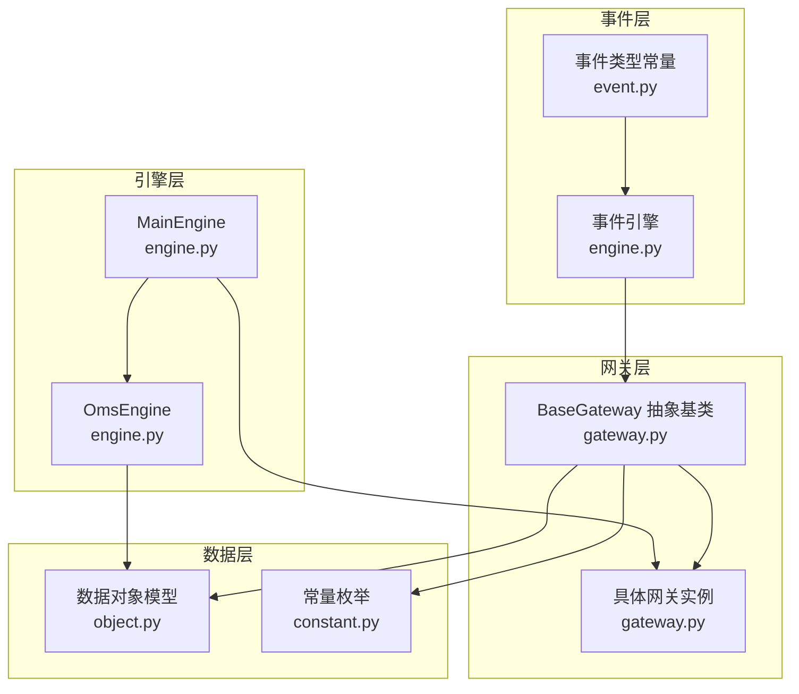
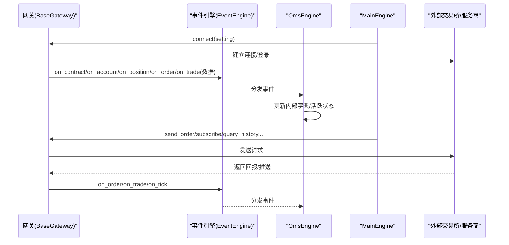
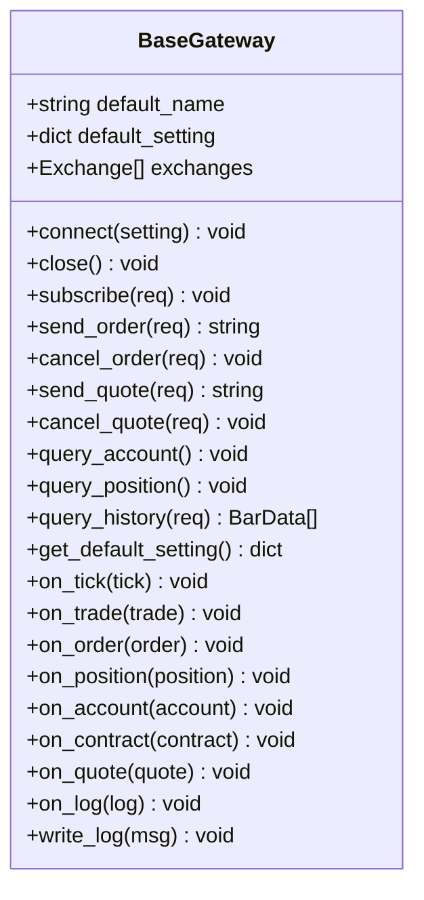
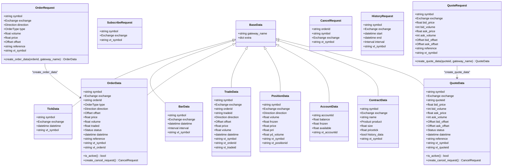
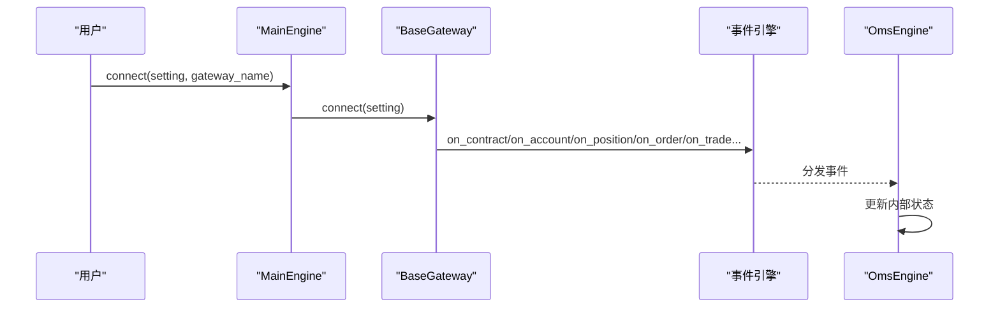
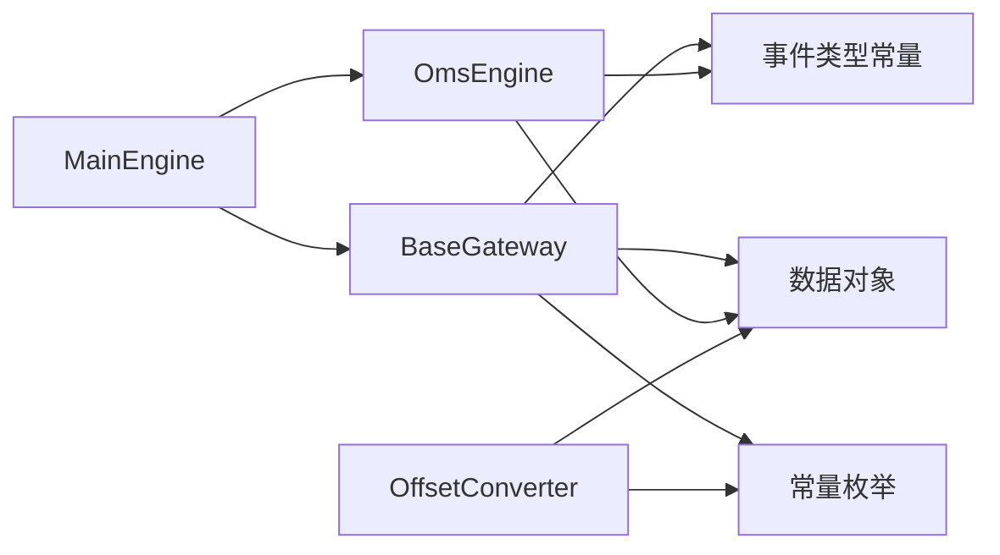

# 网关接口设计

<cite>
**本文引用的文件列表**
- [gateway.py](file://vnpy/trader/gateway.py)
- [object.py](file://vnpy/trader/object.py)
- [constant.py](file://vnpy/trader/constant.py)
- [engine.py](file://vnpy/trader/engine.py)
- [event.py](file://vnpy/trader/event.py)
- [converter.py](file://vnpy/trader/converter.py)
- [utility.py](file://vnpy/trader/utility.py)
- [run.py](file://examples/no_ui/run.py)
- [README.md](file://README.md)
</cite>

## 目录
1. [引言](#引言)
2. [项目结构](#项目结构)
3. [核心组件](#核心组件)
4. [架构总览](#架构总览)
5. [详细组件分析](#详细组件分析)
6. [依赖关系分析](#依赖关系分析)
7. [性能考量](#性能考量)
8. [故障排查指南](#故障排查指南)
9. [结论](#结论)
10. [附录](#附录)

## 引言
本文件围绕VeighNa框架的“网关接口设计”展开，系统阐述BaseGateway抽象基类的设计模式与扩展机制，统一接口规范、数据传输协议与错误处理策略；解释不同交易市场的适配方法与接口实现差异；说明常量定义（TradingType、Exchange等）的作用与标准化意义；解释数据对象模型（BarData、TickData等）的设计思路与类型系统；并提供网关开发最佳实践、性能优化技巧与调试方法，以及自定义网关开发的完整示例与常见问题解决方案。

## 项目结构
VeighNa的交易核心由“事件驱动引擎 + 网关 + 数据对象 + 引擎聚合”构成：
- 事件驱动：事件类型常量与事件引擎负责跨组件通信
- 网关：BaseGateway抽象类定义统一接口契约，具体网关实现对接不同交易所/服务商
- 数据对象：TickData、BarData、OrderData、TradeData、PositionData、AccountData、ContractData、QuoteData等
- 引擎聚合：MainEngine协调各网关与功能引擎（如OmsEngine）

图示来源
- [gateway.py](file://vnpy/trader/gateway.py#L33-L273)
- [engine.py](file://vnpy/trader/engine.py#L81-L324)
- [event.py](file://vnpy/trader/event.py#L7-L14)
- [object.py](file://vnpy/trader/object.py#L17-L428)
- [constant.py](file://vnpy/trader/constant.py#L10-L161)

章节来源
- [gateway.py](file://vnpy/trader/gateway.py#L33-L273)
- [engine.py](file://vnpy/trader/engine.py#L81-L324)
- [event.py](file://vnpy/trader/event.py#L7-L14)
- [object.py](file://vnpy/trader/object.py#L17-L428)
- [constant.py](file://vnpy/trader/constant.py#L10-L161)

## 核心组件
- BaseGateway：定义统一的连接、订阅、下单、撤单、查询、历史数据等接口契约，以及回调事件推送机制
- 数据对象：以dataclass定义的强类型数据结构，统一vt_symbol命名规范与状态管理
- 常量枚举：Direction、Offset、Status、Product、OrderType、OptionType、Exchange、Interval等
- MainEngine：负责网关注册、生命周期管理、事件分发与对外API封装
- OmsEngine：订单管理与状态聚合，维护各数据字典与活跃订单/报价集合
- OffsetConverter：基于合约与头寸的偏移转换器，处理不同市场的“今/昨/开”逻辑

章节来源
- [gateway.py](file://vnpy/trader/gateway.py#L33-L273)
- [object.py](file://vnpy/trader/object.py#L17-L428)
- [constant.py](file://vnpy/trader/constant.py#L10-L161)
- [engine.py](file://vnpy/trader/engine.py#L81-L324)
- [converter.py](file://vnpy/trader/converter.py#L310-L403)

## 架构总览
BaseGateway通过事件引擎向MainEngine/OmsEngine推送数据，OmsEngine统一存储与查询；网关侧负责与外部系统交互，遵循非阻塞、线程安全、自动重连等约束。

图示来源
- [gateway.py](file://vnpy/trader/gateway.py#L86-L158)
- [engine.py](file://vnpy/trader/engine.py#L384-L461)
- [event.py](file://vnpy/trader/event.py#L7-L14)

## 详细组件分析

### BaseGateway 抽象基类
- 设计要点
  - 抽象方法：connect、close、subscribe、send_order、cancel_order、query_account、query_position、query_history
  - 回调推送：on_tick、on_trade、on_order、on_position、on_account、on_contract、on_quote、on_log
  - 默认设置：default_name、default_setting、exchanges
  - 日志：write_log
  - 可选报价：send_quote、cancel_quote
- 线程与阻塞约束
  - 网关需线程安全、所有方法非阻塞、自动重连
  - 回调传递的数据对象应为不可变快照（避免共享可变状态）
- 事件推送
  - on_tick/on_trade/on_order/on_position/on_account/on_quote均推送通用事件+特定vt_symbol/ vt_orderid事件
  - on_log仅推送通用事件

图示来源
- [gateway.py](file://vnpy/trader/gateway.py#L33-L273)

章节来源
- [gateway.py](file://vnpy/trader/gateway.py#L33-L273)

### 数据对象模型与类型系统
- BaseData：所有数据对象的基类，统一gateway_name与extra字段
- TickData/BarData：行情与K线数据，vt_symbol统一生成
- OrderData/TradeData/PositionData/AccountData/ContractData/QuoteData：订单、成交、持仓、账户、合约、报价数据
- Request对象：SubscribeRequest、OrderRequest、CancelRequest、HistoryRequest、QuoteRequest，统一vt_symbol生成与请求到数据对象的映射
- 关键约定
  - 所有vt_symbol采用“symbol.exchange.value”的格式
  - 订单/报价/成交/账户/持仓等ID均带网关前缀，形成全局唯一标识
  - 订单状态集合ACTIVE_STATUSES用于判断是否仍处于活跃状态

图示来源
- [object.py](file://vnpy/trader/object.py#L17-L428)

章节来源
- [object.py](file://vnpy/trader/object.py#L17-L428)

### 常量定义与标准化
- 方向/开平：Direction（LONG/SHORT/NET）、Offset（NONE/OPEN/CLOSE/CLOSETODAY/CLOSEYESTERDAY）
- 状态：Status（SUBMITTING/NOTTRADED/PARTTRADED/ALLTRADED/CANCELLED/REJECTED）
- 产品类型：Product（股票/期货/期权/指数/外汇/现货/ETF/债券/权证/价差/基金/CFD/互换）
- 订单类型：OrderType（限价/市价/止损/FAK/FOK/RFQ/ETF）
- 期权类型：OptionType（看涨/看跌）
- 交易所：Exchange（覆盖全球主要交易所，含中国场内与场外、OTC、IB等）
- 时间周期：Interval（分钟/小时/日/周/TICK）
- 标准化意义
  - 统一不同市场的语义差异（如“今/昨/开”在不同交易所规则不同）
  - 为OffsetConverter提供转换依据
  - 保障vt_symbol一致性，便于跨市场统一处理

章节来源
- [constant.py](file://vnpy/trader/constant.py#L10-L161)

### MainEngine 与事件分发
- 职责
  - 注册/启动网关与功能引擎
  - 统一封装对外API：connect、subscribe、send_order、cancel_order、send_quote、cancel_quote、query_history
  - 将用户请求转发至对应网关
  - 通过事件引擎分发日志、行情、订单、成交、持仓、账户、合约、报价等事件
- 关键流程
  - add_gateway：实例化网关并收集支持的Exchange
  - get_default_setting：返回网关默认配置
  - connect/subscribe/send_order/cancel_order/send_quote/cancel_quote/query_history：代理到具体网关

图示来源
- [engine.py](file://vnpy/trader/engine.py#L234-L324)
- [event.py](file://vnpy/trader/event.py#L7-L14)

章节来源
- [engine.py](file://vnpy/trader/engine.py#L81-L324)
- [event.py](file://vnpy/trader/event.py#L7-L14)

### OmsEngine 与状态聚合
- 职责
  - 注册事件处理器，接收并存储Tick、Order、Trade、Position、Account、Contract、Quote
  - 维护活跃订单/报价集合（is_active）
  - 提供查询接口：get_tick/get_order/get_trade/get_position/get_account/get_contract/get_quote/以及全量列表
  - 与OffsetConverter协作，处理不同市场的开平逻辑
- 关键点
  - 每个数据对象以vt_*为键存储，确保全局唯一
  - 订单/报价活跃状态变更时动态维护活跃集合

章节来源
- [engine.py](file://vnpy/trader/engine.py#L360-L588)
- [converter.py](file://vnpy/trader/converter.py#L310-L403)

### OffsetConverter 与偏移转换
- 目标
  - 解决不同交易所“今/昨/开”规则差异，提供统一的下单/平仓/锁仓/净仓模式
- 核心逻辑
  - PositionHolding：维护多空头寸、冻结量、今昨分布
  - OffsetConverter：按合约与头寸状态，将原始OrderRequest转换为符合交易所规则的一组OrderRequest
  - 支持模式：lock（锁仓）、net（净仓）、SHFE/INE特殊规则、默认模式
- 适用范围
  - 仅对需要“多空双向头寸模式”的合约生效（net_position为False时）

章节来源
- [converter.py](file://vnpy/trader/converter.py#L17-L403)

### 实战示例：无UI脚本接入CTP网关
- 示例要点
  - 初始化EventEngine与MainEngine
  - 注册CtpGateway并启动策略引擎
  - connect传入网关配置
  - 通过MainEngine封装的API进行下单/订阅/查询
- 参考路径
  - [run.py](file://examples/no_ui/run.py#L56-L95)

章节来源
- [run.py](file://examples/no_ui/run.py#L56-L95)
- [README.md](file://README.md#L272-L303)

## 依赖关系分析
- BaseGateway依赖
  - 事件类型常量（EVENT_TICK、EVENT_ORDER、EVENT_TRADE、EVENT_POSITION、EVENT_ACCOUNT、EVENT_CONTRACT、EVENT_LOG、EVENT_QUOTE）
  - 数据对象（TickData、BarData、OrderData、TradeData、PositionData、AccountData、ContractData、QuoteData、LogData）
  - Request对象（SubscribeRequest、OrderRequest、CancelRequest、HistoryRequest、QuoteRequest）
  - 常量枚举（Direction、Exchange、Interval、Offset、Status、Product、OrderType、OptionType）
- MainEngine依赖
  - BaseGateway抽象类
  - 数据对象与常量枚举
  - OmsEngine与日志引擎
- OmsEngine依赖
  - 事件引擎
  - 数据对象与OffsetConverter
- OffsetConverter依赖
  - ContractData、OrderData、TradeData、PositionData、OrderRequest
  - Exchange枚举（区分SHFE/INE等特殊规则）

图示来源
- [gateway.py](file://vnpy/trader/gateway.py#L3-L30)
- [engine.py](file://vnpy/trader/engine.py#L15-L46)
- [converter.py](file://vnpy/trader/converter.py#L4-L11)

章节来源
- [gateway.py](file://vnpy/trader/gateway.py#L3-L30)
- [engine.py](file://vnpy/trader/engine.py#L15-L46)
- [converter.py](file://vnpy/trader/converter.py#L4-L11)

## 性能考量
- 非阻塞与线程安全
  - 网关所有方法必须非阻塞；回调中避免耗时操作，必要时异步处理
  - 避免共享可变状态，回调传递的对象应视为不可变快照
- 事件分发
  - 事件引擎采用队列与线程模型，尽量减少事件风暴；合理拆分事件类型
- 数据对象
  - 使用dataclass减少样板代码，vt_symbol统一生成避免重复解析
- 历史数据查询
  - query_history默认返回空列表，具体网关按需实现；注意分页与限频
- 工具函数
  - round_to/floor_to/ceil_to：价格按最小变动单位取整
  - BarGenerator：Tick/K线合成，注意分钟/小时/日K的边界处理

章节来源
- [gateway.py](file://vnpy/trader/gateway.py#L43-L48)
- [utility.py](file://vnpy/trader/utility.py#L120-L147)
- [utility.py](file://vnpy/trader/utility.py#L166-L486)

## 故障排查指南
- 常见问题
  - vt_symbol不一致：确认symbol与exchange拼接格式；确保Exchange枚举值正确
  - 订单状态异常：检查Status枚举与ACTIVE_STATUSES；关注SUBMITTING/NOTTRADED/PARTTRADED的流转
  - 偏移转换错误：核对OffsetConverter的模式（lock/net/shfe/默认）与合约net_position标志
  - 日志缺失：确认write_log调用与事件类型EVENT_LOG是否注册
  - 网关未响应：检查connect/close生命周期；确保自动重连逻辑
- 调试建议
  - 使用MainEngine.get_gateway与get_default_setting验证网关注册与默认配置
  - 通过OmsEngine.get_all_*系列方法检查数据是否入库
  - 在网关回调中打印vt_symbol与关键字段，定位数据来源

章节来源
- [engine.py](file://vnpy/trader/engine.py#L189-L226)
- [engine.py](file://vnpy/trader/engine.py#L546-L556)
- [gateway.py](file://vnpy/trader/gateway.py#L153-L158)

## 结论
VeighNa的网关接口设计以BaseGateway为核心，通过统一的事件驱动与数据模型，屏蔽不同交易所/服务商的差异，提供一致的交易与行情接入体验。配合OmsEngine的状态聚合与OffsetConverter的偏移转换，系统在多市场、多产品类型的复杂场景下仍能保持清晰的职责边界与良好的扩展性。开发者遵循非阻塞、线程安全、自动重连与vt_symbol标准化等原则，即可快速实现高质量的自定义网关。

## 附录
- 自定义网关开发清单
  - 继承BaseGateway，实现抽象方法（connect/close/subscribe/send_order/cancel_order/query_account/query_position）
  - 在connect中完成登录、查询合约/账户/持仓/订单/成交，并通过on_*回调推送
  - 实现send_quote/cancel_quote（如支持报价）
  - 实现query_history（如支持历史数据）
  - 设置default_name/default_setting/exchanges
  - 使用write_log输出关键日志
  - 在MainEngine中注册并使用
- 最佳实践
  - 严格遵守线程安全与非阻塞约束
  - 使用数据对象与Request对象，避免手工拼接vt_symbol
  - 利用OmsEngine提供的查询接口与OffsetConverter进行业务编排
  - 通过事件引擎进行日志与数据分发，避免直接耦合