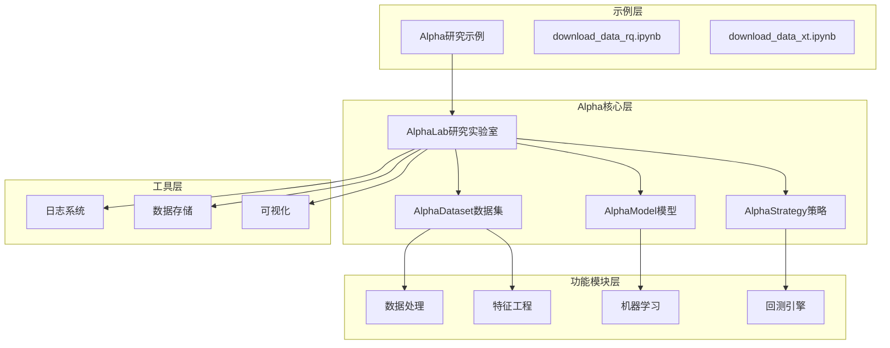
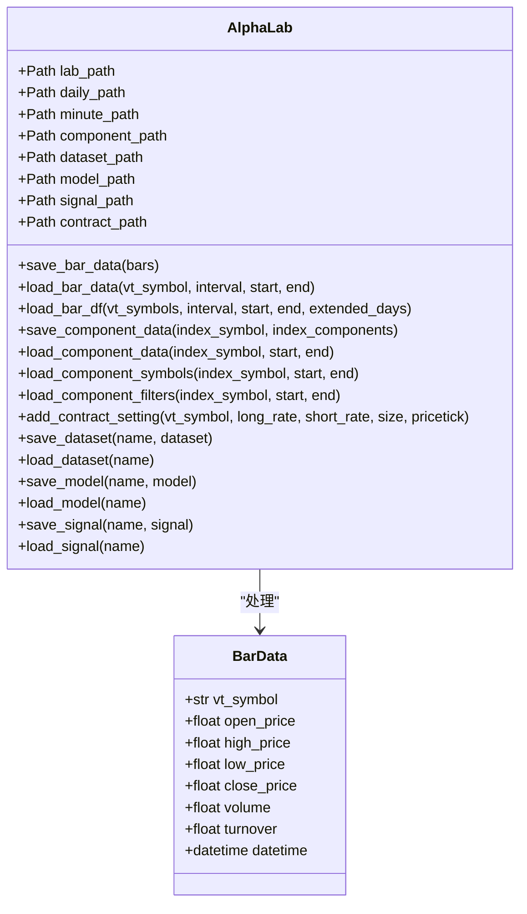
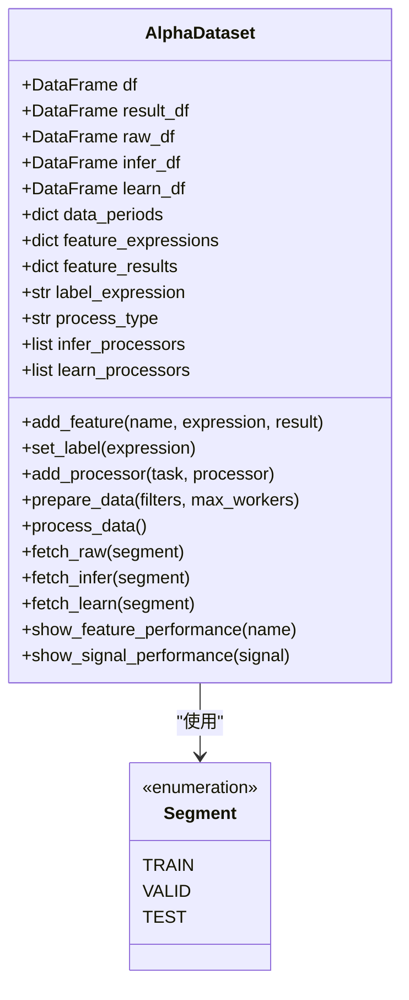
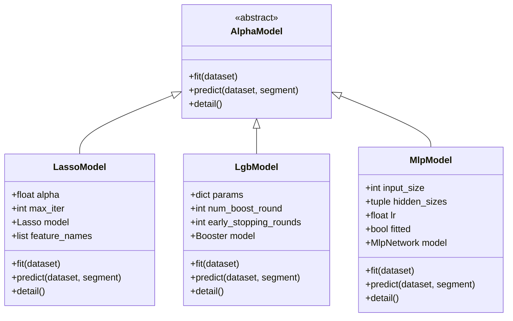
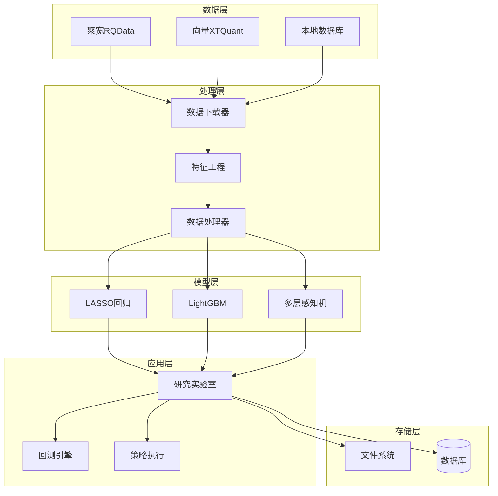
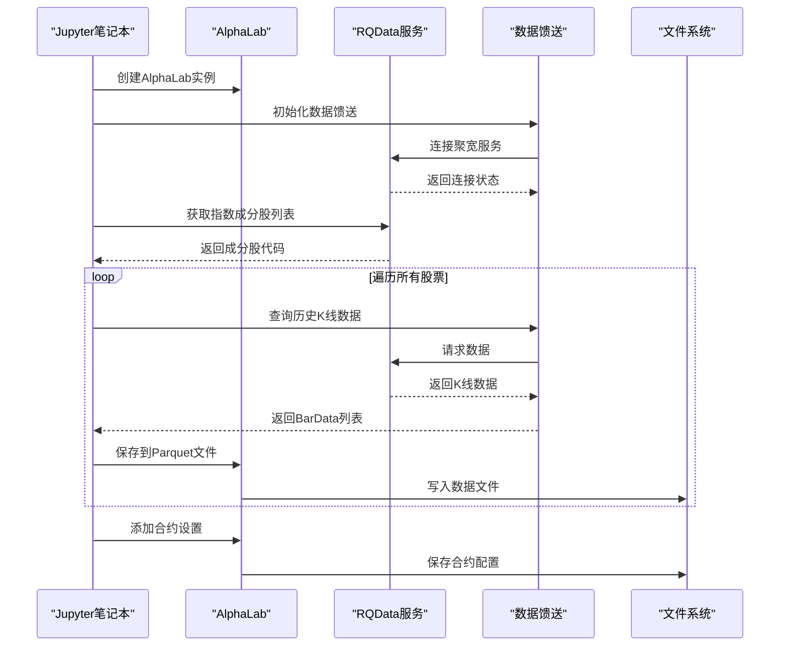
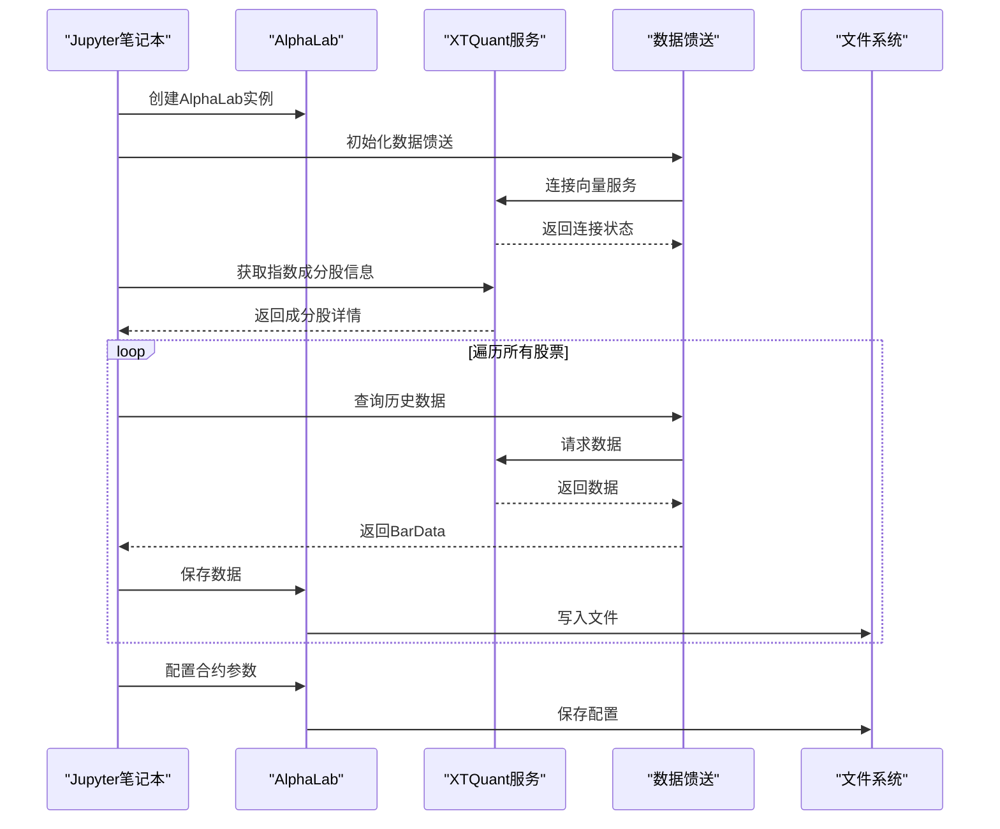
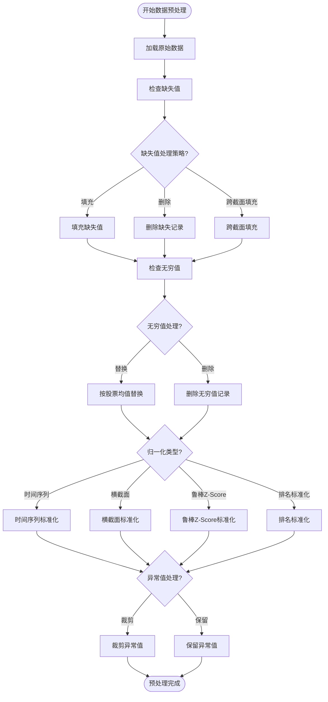
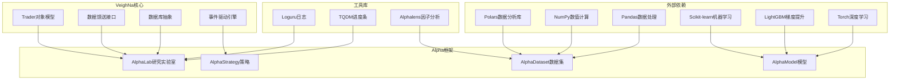

# Alpha研究示例

<cite>
**本文档引用的文件**
- [examples/alpha_research/download_data_rq.ipynb](file://examples/alpha_research/download_data_rq.ipynb)
- [examples/alpha_research/download_data_xt.ipynb](file://examples/alpha_research/download_data_xt.ipynb)
- [vnpy/alpha/__init__.py](file://vnpy/alpha/__init__.py)
- [vnpy/alpha/lab.py](file://vnpy/alpha/lab.py)
- [vnpy/alpha/logger.py](file://vnpy/alpha/logger.py)
- [vnpy/alpha/dataset/__init__.py](file://vnpy/alpha/dataset/__init__.py)
- [vnpy/alpha/model/__init__.py](file://vnpy/alpha/model/__init__.py)
- [vnpy/alpha/dataset/template.py](file://vnpy/alpha/dataset/template.py)
- [vnpy/alpha/model/template.py](file://vnpy/alpha/model/template.py)
- [vnpy/alpha/dataset/utility.py](file://vnpy/alpha/dataset/utility.py)
- [vnpy/alpha/dataset/processor.py](file://vnpy/alpha/dataset/processor.py)
- [vnpy/alpha/dataset/datasets/alpha_101.py](file://vnpy/alpha/dataset/datasets/alpha_101.py)
- [vnpy/alpha/model/models/lasso_model.py](file://vnpy/alpha/model/models/lasso_model.py)
- [vnpy/alpha/model/models/lgb_model.py](file://vnpy/alpha/model/models/lgb_model.py)
- [vnpy/alpha/model/models/mlp_model.py](file://vnpy/alpha/model/models/mlp_model.py)
</cite>

## 目录
1. [简介](#简介)
2. [项目结构](#项目结构)
3. [核心组件](#核心组件)
4. [架构概览](#架构概览)
5. [详细组件分析](#详细组件分析)
6. [依赖关系分析](#依赖关系分析)
7. [性能考虑](#性能考虑)
8. [故障排除指南](#故障排除指南)
9. [结论](#结论)
10. [附录](#附录)

## 简介

VeighNa框架的Alpha机器学习研究示例提供了一个完整的量化研究平台，专注于因子投资和机器学习在金融市场的应用。该示例包含两个主要的数据下载笔记本，展示了如何从不同的数据源获取金融数据，并提供了完整的Alpha研究工作流程。

本项目的核心价值在于：
- 提供了从数据获取到模型部署的完整研究流程
- 支持多种数据源（聚宽RQData、向量XTQuant）
- 实现了标准化的Alpha因子工程和机器学习建模
- 包含了完整的回测和性能评估工具

## 项目结构

项目采用模块化设计，主要分为以下几个层次：



**图表来源**
- [vnpy/alpha/__init__.py](file://vnpy/alpha/__init__.py#L1-L19)
- [vnpy/alpha/lab.py](file://vnpy/alpha/lab.py#L20-L50)

**章节来源**
- [vnpy/alpha/__init__.py](file://vnpy/alpha/__init__.py#L1-L19)
- [vnpy/alpha/lab.py](file://vnpy/alpha/lab.py#L20-L50)

## 核心组件

### AlphaLab研究实验室

AlphaLab是整个Alpha研究系统的核心，提供了数据管理、特征工程和模型存储的统一接口。



**图表来源**
- [vnpy/alpha/lab.py](file://vnpy/alpha/lab.py#L20-L481)

### AlphaDataset数据集模板

AlphaDataset提供了标准化的数据处理和特征工程框架，支持多种数据处理操作和特征计算。



**图表来源**
- [vnpy/alpha/dataset/template.py](file://vnpy/alpha/dataset/template.py#L23-L306)

### AlphaModel模型模板

AlphaModel定义了机器学习模型的标准接口，支持不同的算法实现。



**图表来源**
- [vnpy/alpha/model/template.py](file://vnpy/alpha/model/template.py#L9-L31)
- [vnpy/alpha/model/models/lasso_model.py](file://vnpy/alpha/model/models/lasso_model.py#L13-L140)
- [vnpy/alpha/model/models/lgb_model.py](file://vnpy/alpha/model/models/lgb_model.py#L12-L171)
- [vnpy/alpha/model/models/mlp_model.py](file://vnpy/alpha/model/models/mlp_model.py#L22-L684)

**章节来源**
- [vnpy/alpha/lab.py](file://vnpy/alpha/lab.py#L20-L481)
- [vnpy/alpha/dataset/template.py](file://vnpy/alpha/dataset/template.py#L23-L306)
- [vnpy/alpha/model/template.py](file://vnpy/alpha/model/template.py#L9-L31)

## 架构概览

Alpha研究系统的整体架构采用分层设计，从底层的数据获取到上层的策略执行形成了完整的生态链。



**图表来源**
- [examples/alpha_research/download_data_rq.ipynb](file://examples/alpha_research/download_data_rq.ipynb#L1-L195)
- [examples/alpha_research/download_data_xt.ipynb](file://examples/alpha_research/download_data_xt.ipynb#L1-L3239)

## 详细组件分析

### 数据下载与管理

#### 聚宽数据源集成

聚宽数据源提供了高质量的中国市场数据，支持分钟级和日线级别的历史数据获取。



**图表来源**
- [examples/alpha_research/download_data_rq.ipynb](file://examples/alpha_research/download_data_rq.ipynb#L50-L170)
- [vnpy/alpha/lab.py](file://vnpy/alpha/lab.py#L51-L95)

#### 向量数据源集成

向量数据源提供了更丰富的市场数据和实时行情服务。



**图表来源**
- [examples/alpha_research/download_data_xt.ipynb](file://examples/alpha_research/download_data_xt.ipynb#L63-L87)
- [vnpy/alpha/lab.py](file://vnpy/alpha/lab.py#L349-L378)

**章节来源**
- [examples/alpha_research/download_data_rq.ipynb](file://examples/alpha_research/download_data_rq.ipynb#L1-L195)
- [examples/alpha_research/download_data_xt.ipynb](file://examples/alpha_research/download_data_xt.ipynb#L1-L3239)

### 特征工程与数据处理

#### Alpha101因子体系

Alpha101提供了101个经典的技术分析因子，涵盖了动量、趋势、波动率等多个维度。

```mermaid
flowchart TD
Start([开始特征工程]) --> LoadData[加载基础数据]
LoadData --> CalcReturns[计算收益率]
CalcReturns --> Factor1[计算Alpha1]
Factor1 --> Factor2[计算Alpha2]
Factor2 --> Factor3[计算Alpha3]
Factor3 --> Factor4[计算Alpha4]
Factor4 --> Factor5[计算Alpha5]
Factor5 --> Factor6[计算Alpha6]
Factor6 --> Factor7[计算Alpha7]
Factor7 --> Factor8[计算Alpha8]
Factor8 --> Factor9[计算Alpha9]
Factor9 --> Factor10[计算Alpha10]
Factor10 --> Factor11[计算Alpha11]
Factor11 --> Factor12[计算Alpha12]
Factor12 --> Factor13[计算Alpha13]
Factor13 --> Factor14[计算Alpha14]
Factor14 --> Factor15[计算Alpha15]
Factor15 --> Factor16[计算Alpha16]
Factor16 --> Factor17[计算Alpha17]
Factor17 --> Factor18[计算Alpha18]
Factor18 --> Factor19[计算Alpha19]
Factor19 --> Factor20[计算Alpha20]
Factor20 --> Factor21[计算Alpha21]
Factor21 --> Factor22[计算Alpha22]
Factor22 --> Factor23[计算Alpha23]
Factor23 --> Factor24[计算Alpha24]
Factor24 --> Factor25[计算Alpha25]
Factor25 --> Factor26[计算Alpha26]
Factor26 --> Factor27[计算Alpha27]
Factor27 --> Factor28[计算Alpha28]
Factor28 --> Factor29[计算Alpha29]
Factor29 --> Factor30[计算Alpha30]
Factor30 --> Factor31[计算Alpha31]
Factor31 --> Factor32[计算Alpha32]
Factor32 --> Factor33[计算Alpha33]
Factor33 --> Factor34[计算Alpha34]
Factor34 --> Factor35[计算Alpha35]
Factor35 --> Factor36[计算Alpha36]
Factor36 --> Factor37[计算Alpha37]
Factor37 --> Factor38[计算Alpha38]
Factor38 --> Factor39[计算Alpha39]
Factor39 --> Factor40[计算Alpha40]
Factor40 --> Factor41[计算Alpha41]
Factor41 --> Factor42[计算Alpha42]
Factor42 --> Factor43[计算Alpha43]
Factor43 --> Factor44[计算Alpha44]
Factor44 --> Factor45[计算Alpha45]
Factor45 --> Factor46[计算Alpha46]
Factor46 --> Factor47[计算Alpha47]
Factor47 --> Factor48[计算Alpha48]
Factor48 --> Factor49[计算Alpha49]
Factor49 --> Factor50[计算Alpha50]
Factor50 --> Factor51[计算Alpha51]
Factor51 --> Factor52[计算Alpha52]
Factor52 --> Factor53[计算Alpha53]
Factor53 --> Factor54[计算Alpha54]
Factor54 --> Factor55[计算Alpha55]
Factor55 --> Factor56[计算Alpha56]
Factor56 --> Factor57[计算Alpha57]
Factor57 --> Factor58[计算Alpha58]
Factor58 --> Factor59[计算Alpha59]
Factor59 --> Factor60[计算Alpha60]
Factor60 --> Factor61[计算Alpha61]
Factor61 --> Factor62[计算Alpha62]
Factor62 --> Factor63[计算Alpha63]
Factor63 --> Factor64[计算Alpha64]
Factor64 --> Factor65[计算Alpha65]
Factor65 --> Factor66[计算Alpha66]
Factor66 --> Factor67[计算Alpha67]
Factor67 --> Factor68[计算Alpha68]
Factor68 --> Factor69[计算Alpha69]
Factor69 --> Factor70[计算Alpha70]
Factor70 --> Factor71[计算Alpha71]
Factor71 --> Factor72[计算Alpha72]
Factor72 --> Factor73[计算Alpha73]
Factor73 --> Factor74[计算Alpha74]
Factor74 --> Factor75[计算Alpha75]
Factor75 --> Factor76[计算Alpha76]
Factor76 --> Factor77[计算Alpha77]
Factor77 --> Factor78[计算Alpha78]
Factor78 --> Factor79[计算Alpha79]
Factor79 --> Factor80[计算Alpha80]
Factor80 --> Factor81[计算Alpha81]
Factor81 --> Factor82[计算Alpha82]
Factor82 --> Factor83[计算Alpha83]
Factor83 --> Factor84[计算Alpha84]
Factor84 --> Factor85[计算Alpha85]
Factor85 --> Factor86[计算Alpha86]
Factor86 --> Factor87[计算Alpha87]
Factor87 --> Factor88[计算Alpha88]
Factor88 --> Factor89[计算Alpha89]
Factor89 --> Factor90[计算Alpha90]
Factor90 --> Factor91[计算Alpha91]
Factor91 --> Factor92[计算Alpha92]
Factor92 --> Factor93[计算Alpha93]
Factor93 --> Factor94[计算Alpha94]
Factor94 --> Factor95[计算Alpha95]
Factor95 --> Factor96[计算Alpha96]
Factor96 --> Factor97[计算Alpha97]
Factor97 --> Factor98[计算Alpha98]
Factor98 --> Factor99[计算Alpha99]
Factor99 --> Factor100[计算Alpha100]
Factor100 --> Factor101[计算Alpha101]
Factor101 --> End([完成特征工程])
```



**图表来源**
- [vnpy/alpha/dataset/datasets/alpha_101.py](file://vnpy/alpha/dataset/datasets/alpha_101.py#L6-L331)

#### 数据预处理流程

数据预处理是确保模型质量的关键步骤，包括缺失值处理、异常值检测和标准化等。



**图表来源**
- [vnpy/alpha/dataset/processor.py](file://vnpy/alpha/dataset/processor.py#L9-L202)

**章节来源**
- [vnpy/alpha/dataset/datasets/alpha_101.py](file://vnpy/alpha/dataset/datasets/alpha_101.py#L6-L331)
- [vnpy/alpha/dataset/processor.py](file://vnpy/alpha/dataset/processor.py#L1-L202)

### 机器学习模型实现

#### LASSO回归模型

LASSO回归是一种线性模型，通过L1正则化实现特征选择和稀疏解。

```mermaid
classDiagram
class LassoModel {
+float alpha
+int max_iter
+Lasso model
+list feature_names
+fit(dataset)
+predict(dataset, segment)
+detail()
}
class Lasso {
+fit(X, y)
+predict(X)
+coef_ : ndarray
}
LassoModel --> Lasso : "使用"
note for LassoModel : "超参数 : \n- alpha : 正则化强度\n- max_iter : 最大迭代次数\n- random_state : 随机种子"
```

**图表来源**
- [vnpy/alpha/model/models/lasso_model.py](file://vnpy/alpha/model/models/lasso_model.py#L13-L140)

#### LightGBM集成模型

LightGBM是一个基于决策树的梯度提升框架，具有高效和准确的特点。

```mermaid
classDiagram
class LgbModel {
+dict params
+int num_boost_round
+int early_stopping_rounds
+Booster model
+_prepare_data(dataset)
+fit(dataset)
+predict(dataset, segment)
+detail()
}
class Booster {
+train(params, train_data, ...)
+predict(data)
+feature_importance(importance_type)
}
LgbModel --> Booster : "使用"
note for LgbModel : "超参数 : \n- learning_rate : 学习率\n- num_leaves : 叶子节点数\n- num_boost_round : 训练轮数\n- early_stopping_rounds : 早停轮数"
```

**图表来源**
- [vnpy/alpha/model/models/lgb_model.py](file://vnpy/alpha/model/models/lgb_model.py#L12-L171)

#### 多层感知机模型

多层感知机是一种前馈神经网络，能够学习复杂的非线性关系。

```mermaid
classDiagram
class MlpModel {
+int input_size
+tuple hidden_sizes
+float lr
+bool fitted
+MlpNetwork model
+fit(dataset, evaluation_results)
+predict(dataset, segment)
+detail()
}
class MlpNetwork {
+ModuleList network
+forward(x)
}
class AverageMeter {
+float val
+float avg
+float sum
+int count
+update(val, n)
}
MlpModel --> MlpNetwork : "使用"
MlpModel --> AverageMeter : "使用"
note for MlpModel : "超参数 : \n- input_size : 输入维度\n- hidden_sizes : 隐藏层大小\n- lr : 学习率\n- n_epochs : 训练轮数\n- batch_size : 批次大小"
```

**图表来源**
- [vnpy/alpha/model/models/mlp_model.py](file://vnpy/alpha/model/models/mlp_model.py#L22-L684)

**章节来源**
- [vnpy/alpha/model/models/lasso_model.py](file://vnpy/alpha/model/models/lasso_model.py#L13-L140)
- [vnpy/alpha/model/models/lgb_model.py](file://vnpy/alpha/model/models/lgb_model.py#L12-L171)
- [vnpy/alpha/model/models/mlp_model.py](file://vnpy/alpha/model/models/mlp_model.py#L22-L684)

## 依赖关系分析

Alpha研究系统的依赖关系体现了清晰的分层架构和模块化设计。



**图表来源**
- [vnpy/alpha/dataset/template.py](file://vnpy/alpha/dataset/template.py#L8-L14)
- [vnpy/alpha/model/models/lasso_model.py](file://vnpy/alpha/model/models/lasso_model.py#L1-L11)
- [vnpy/alpha/model/models/lgb_model.py](file://vnpy/alpha/model/models/lgb_model.py#L1-L10)
- [vnpy/alpha/model/models/mlp_model.py](file://vnpy/alpha/model/models/mlp_model.py#L1-L19)

**章节来源**
- [vnpy/alpha/dataset/template.py](file://vnpy/alpha/dataset/template.py#L1-L306)
- [vnpy/alpha/model/models/lasso_model.py](file://vnpy/alpha/model/models/lasso_model.py#L1-L140)

## 性能考虑

### 数据处理优化

Alpha系统在数据处理方面采用了多项优化策略以提高性能：

1. **并行计算**: 使用多进程池并行计算多个特征表达式
2. **内存管理**: 采用分块读取和流式处理减少内存占用
3. **数据格式**: 使用Parquet格式存储，支持列式压缩和快速查询
4. **缓存机制**: LRU缓存常用的数据组件映射

### 模型训练优化

针对不同类型的机器学习模型，系统提供了相应的优化策略：

1. **LASSO模型**: 使用坐标下降法，适合高维稀疏数据
2. **LightGBM模型**: 采用GOSS和EFB算法，处理大规模数据集
3. **MLP模型**: 实现了早停机制和学习率调度，防止过拟合

### 存储策略

系统采用了分层存储架构：
- **短期存储**: 内存中的DataFrame缓存
- **中期存储**: Parquet文件的高效持久化
- **长期存储**: JSON配置文件和pickle序列化的模型

## 故障排除指南

### 常见问题及解决方案

#### 数据下载失败

**问题症状**: 数据下载过程中出现连接超时或数据为空

**可能原因**:
1. 网络连接不稳定
2. 数据源服务不可用
3. 认证信息过期
4. 请求频率过高被限制

**解决步骤**:
1. 检查网络连接状态
2. 验证数据源服务可用性
3. 更新认证凭据
4. 降低请求频率或添加重试机制

#### 内存不足错误

**问题症状**: 在特征计算或模型训练过程中出现内存溢出

**可能原因**:
1. 数据集过大超出内存容量
2. 缺少适当的内存清理
3. 数据类型不优化

**解决步骤**:
1. 分批处理大数据集
2. 使用更高效的数据类型
3. 实施内存监控和清理机制
4. 考虑使用分布式计算

#### 模型训练不收敛

**问题症状**: 模型训练损失不下降或震荡

**可能原因**:
1. 学习率设置不当
2. 特征尺度不一致
3. 数据质量问题
4. 正则化参数不合适

**解决步骤**:
1. 调整学习率和优化器参数
2. 实施特征标准化
3. 检查并清洗数据质量
4. 优化正则化强度

**章节来源**
- [vnpy/alpha/lab.py](file://vnpy/alpha/lab.py#L51-L95)
- [vnpy/alpha/dataset/processor.py](file://vnpy/alpha/dataset/processor.py#L102-L128)

## 结论

VeighNa框架的Alpha机器学习研究示例提供了一个功能完整、架构清晰的量化研究平台。通过标准化的数据处理流程、丰富的特征工程工具和多样化的机器学习模型，研究人员可以高效地进行Alpha因子挖掘和策略开发。

该系统的主要优势包括：
- **模块化设计**: 清晰的分层架构便于维护和扩展
- **多数据源支持**: 灵活的数据接入能力
- **完整的工具链**: 从数据获取到策略部署的全流程支持
- **高性能实现**: 优化的数据处理和模型训练机制

对于初学者，建议从简单的数据下载和基础特征计算开始，逐步深入到复杂的模型训练和策略优化。对于专家用户，可以利用系统的扩展性开发自定义的特征函数和模型算法。

## 附录

### 学习路径建议

#### 初学者路径
1. **环境搭建**: 安装VeighNa框架和依赖包
2. **数据获取**: 学习使用聚宽和向量数据源
3. **基础概念**: 理解Alpha因子的基本概念
4. **特征工程**: 掌握基本的数据预处理技术
5. **简单模型**: 尝试LASSO回归等基础模型

#### 中级用户路径
1. **复杂特征**: 实现Alpha101等经典因子
2. **模型对比**: 比较不同机器学习算法的效果
3. **超参数调优**: 学习模型参数优化方法
4. **风险控制**: 集成风险管理机制
5. **回测验证**: 实施完整的策略回测

#### 专家用户路径
1. **自定义算法**: 开发创新的机器学习算法
2. **分布式计算**: 实现大规模数据处理
3. **实时交易**: 集成实盘交易功能
4. **系统优化**: 深入理解系统性能瓶颈
5. **团队协作**: 建立标准化的研究流程

### 最佳实践清单

1. **数据质量**: 始终验证数据的完整性和准确性
2. **特征选择**: 优先选择具有经济意义的特征
3. **模型验证**: 使用交叉验证和滚动窗口测试
4. **风险管理**: 实施严格的风险控制措施
5. **文档记录**: 详细记录实验过程和结果
6. **版本控制**: 使用Git管理代码和数据版本
7. **性能监控**: 建立系统性能监控机制
8. **安全考虑**: 注意数据隐私和系统安全