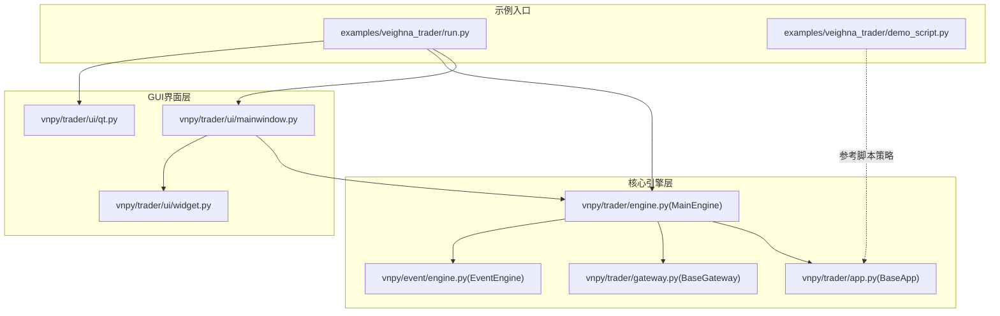
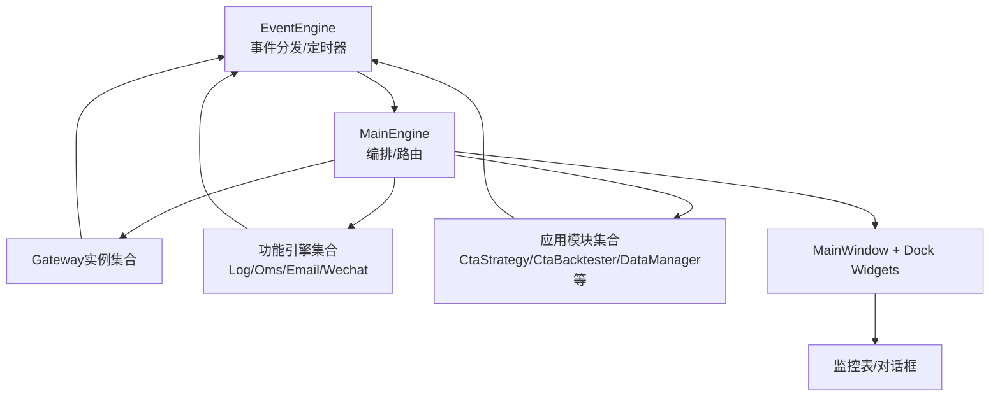
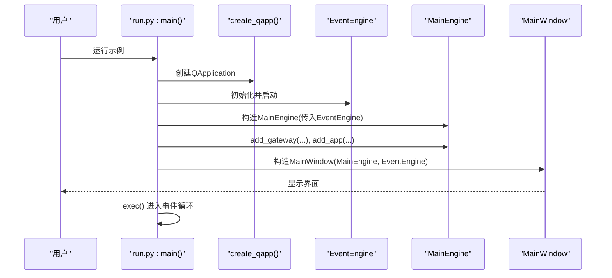
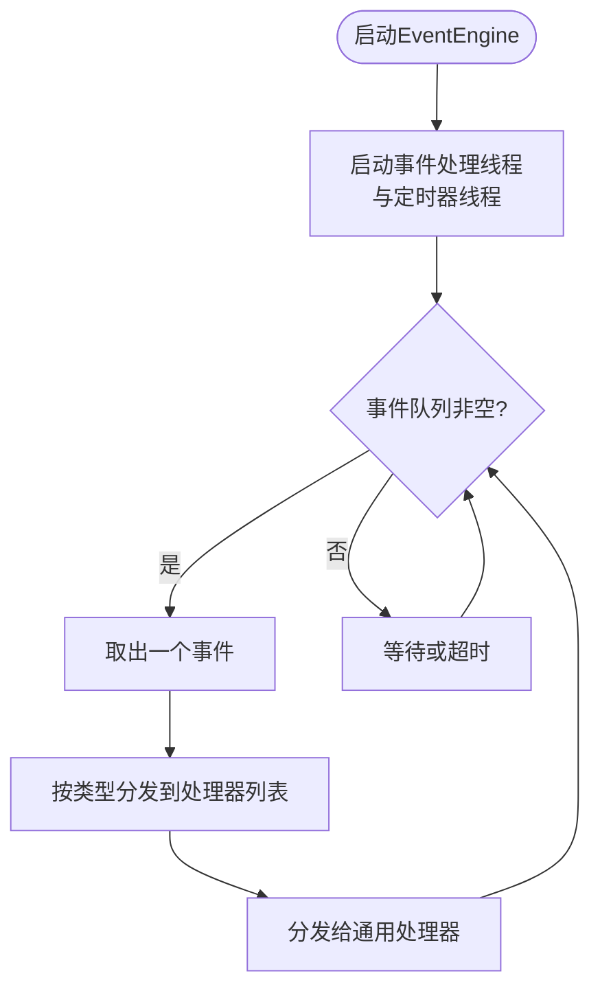
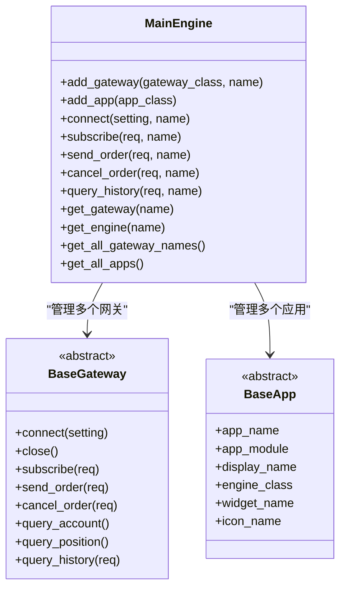
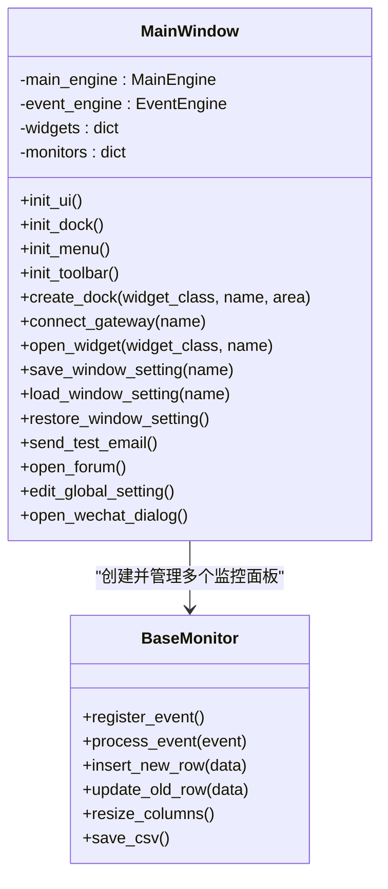
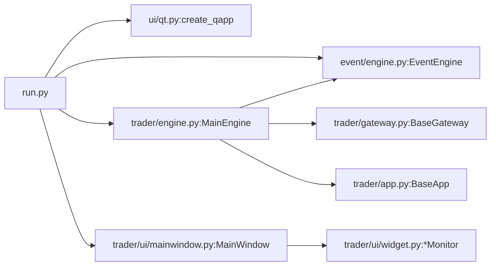

# GUI应用程序示例

<cite>
**本文引用的文件**
- [examples/veighna_trader/run.py](file://examples/veighna_trader/run.py)
- [examples/veighna_trader/demo_script.py](file://examples/veighna_trader/demo_script.py)
- [vnpy/trader/ui/mainwindow.py](file://vnpy/trader/ui/mainwindow.py)
- [vnpy/trader/engine.py](file://vnpy/trader/engine.py)
- [vnpy/event/engine.py](file://vnpy/event/engine.py)
- [vnpy/trader/gateway.py](file://vnpy/trader/gateway.py)
- [vnpy/trader/ui/qt.py](file://vnpy/trader/ui/qt.py)
- [vnpy/trader/app.py](file://vnpy/trader/app.py)
- [vnpy/trader/ui/widget.py](file://vnpy/trader/ui/widget.py)
</cite>

## 目录
1. [简介](#简介)
2. [项目结构](#项目结构)
3. [核心组件](#核心组件)
4. [架构总览](#架构总览)
5. [组件详解](#组件详解)
6. [依赖关系分析](#依赖关系分析)
7. [性能与扩展性](#性能与扩展性)
8. [故障排查指南](#故障排查指南)
9. [结论](#结论)
10. [附录：运行示例与配置建议](#附录运行示例与配置建议)

## 简介
本文件面向希望基于Veighna（vn.py）框架开发GUI量化交易界面的开发者，围绕Veighna Trader示例程序进行系统化解析。内容涵盖事件引擎初始化、主引擎配置、交易网关接入、功能应用模块集成、主窗口创建与界面布局、用户交互处理、启动流程、配置项与自定义方法，并提供常见问题解决方案与最佳实践。

## 项目结构
Veighna Trader示例位于examples/veighna_trader目录，核心入口为run.py；GUI界面由vnpy.trader.ui模块提供，核心运行时由vnpy.trader.engine与vnpy.event.engine支撑；交易网关抽象定义在vnpy.trader.gatway中，应用模块遵循vnpy.trader.app规范。

图表来源
- [examples/veighna_trader/run.py](file://examples/veighna_trader/run.py#L38-L87)
- [vnpy/trader/ui/mainwindow.py](file://vnpy/trader/ui/mainwindow.py#L40-L100)
- [vnpy/trader/engine.py](file://vnpy/trader/engine.py#L81-L137)
- [vnpy/event/engine.py](file://vnpy/event/engine.py#L33-L96)
- [vnpy/trader/gateway.py](file://vnpy/trader/gateway.py#L33-L80)
- [vnpy/trader/ui/qt.py](file://vnpy/trader/ui/qt.py#L21-L71)
- [vnpy/trader/app.py](file://vnpy/trader/app.py#L10-L22)
- [vnpy/trader/ui/widget.py](file://vnpy/trader/ui/widget.py#L241-L305)

章节来源
- [examples/veighna_trader/run.py](file://examples/veighna_trader/run.py#L1-L87)
- [vnpy/trader/ui/mainwindow.py](file://vnpy/trader/ui/mainwindow.py#L40-L100)
- [vnpy/trader/engine.py](file://vnpy/trader/engine.py#L81-L137)
- [vnpy/event/engine.py](file://vnpy/event/engine.py#L33-L96)
- [vnpy/trader/gateway.py](file://vnpy/trader/gateway.py#L33-L80)
- [vnpy/trader/ui/qt.py](file://vnpy/trader/ui/qt.py#L21-L71)
- [vnpy/trader/app.py](file://vnpy/trader/app.py#L10-L22)
- [vnpy/trader/ui/widget.py](file://vnpy/trader/ui/widget.py#L241-L305)

## 核心组件
- 事件引擎EventEngine：负责事件分发、定时器与线程管理，是整个系统的异步中枢。
- 主引擎MainEngine：集中管理网关、引擎、应用模块，提供统一的业务接口（如下单、订阅、查询）。
- 网关基类BaseGateway：定义与不同交易系统对接的标准接口与回调。
- 应用基类BaseApp：定义应用模块的元信息与引擎/界面映射。
- 主窗口MainWindow：构建菜单、停靠面板、工具栏，组织各UI组件。
- UI组件widget：提供Tick/Order/Trade/Position/Account等监控表格与对话框。
- Qt应用创建create_qapp：统一设置主题、字体、图标、异常捕获。

章节来源
- [vnpy/event/engine.py](file://vnpy/event/engine.py#L33-L96)
- [vnpy/trader/engine.py](file://vnpy/trader/engine.py#L81-L137)
- [vnpy/trader/gateway.py](file://vnpy/trader/gateway.py#L33-L80)
- [vnpy/trader/app.py](file://vnpy/trader/app.py#L10-L22)
- [vnpy/trader/ui/mainwindow.py](file://vnpy/trader/ui/mainwindow.py#L40-L100)
- [vnpy/trader/ui/widget.py](file://vnpy/trader/ui/widget.py#L241-L305)
- [vnpy/trader/ui/qt.py](file://vnpy/trader/ui/qt.py#L21-L71)

## 架构总览
Veighna Trader采用“事件驱动 + 多网关 + 多应用模块”的架构。事件引擎贯穿始终，主引擎负责编排，网关负责对接外部系统，应用模块提供功能扩展，UI层负责展示与交互。

图表来源
- [vnpy/event/engine.py](file://vnpy/event/engine.py#L33-L96)
- [vnpy/trader/engine.py](file://vnpy/trader/engine.py#L81-L137)
- [vnpy/trader/ui/mainwindow.py](file://vnpy/trader/ui/mainwindow.py#L40-L100)
- [vnpy/trader/ui/widget.py](file://vnpy/trader/ui/widget.py#L241-L305)

## 组件详解

### 启动流程与主程序
- 创建QApplication并设置样式、字体、图标与异常处理。
- 初始化事件引擎并启动。
- 构建主引擎，注册默认功能引擎（日志、订单、邮件、微信）。
- 添加所需网关与应用模块。
- 构建主窗口，最大化显示，进入事件循环。

图表来源
- [examples/veighna_trader/run.py](file://examples/veighna_trader/run.py#L38-L87)
- [vnpy/trader/ui/qt.py](file://vnpy/trader/ui/qt.py#L21-L71)
- [vnpy/event/engine.py](file://vnpy/event/engine.py#L89-L104)
- [vnpy/trader/engine.py](file://vnpy/trader/engine.py#L86-L101)
- [vnpy/trader/ui/mainwindow.py](file://vnpy/trader/ui/mainwindow.py#L45-L58)

章节来源
- [examples/veighna_trader/run.py](file://examples/veighna_trader/run.py#L38-L87)
- [vnpy/trader/ui/qt.py](file://vnpy/trader/ui/qt.py#L21-L71)
- [vnpy/event/engine.py](file://vnpy/event/engine.py#L89-L104)
- [vnpy/trader/engine.py](file://vnpy/trader/engine.py#L86-L101)
- [vnpy/trader/ui/mainwindow.py](file://vnpy/trader/ui/mainwindow.py#L45-L58)

### 事件引擎初始化与运行机制
- 定时器线程按固定间隔生成“eTimer”事件。
- 事件队列支持通用处理器与特定类型处理器注册。
- 启动后持续从队列取事件并分发到对应处理器。

图表来源
- [vnpy/event/engine.py](file://vnpy/event/engine.py#L55-L88)
- [vnpy/event/engine.py](file://vnpy/event/engine.py#L105-L146)

章节来源
- [vnpy/event/engine.py](file://vnpy/event/engine.py#L33-L96)

### 主引擎配置与网关添加
- MainEngine构造时自动启动事件引擎并初始化默认功能引擎。
- add_gateway根据网关类创建实例并登记，收集其支持的交易所。
- add_app注册应用模块并为其创建对应的引擎实例。
- 提供统一的连接、订阅、下单、撤单、历史查询等接口。

图表来源
- [vnpy/trader/engine.py](file://vnpy/trader/engine.py#L81-L137)
- [vnpy/trader/gateway.py](file://vnpy/trader/gateway.py#L33-L80)
- [vnpy/trader/app.py](file://vnpy/trader/app.py#L10-L22)

章节来源
- [vnpy/trader/engine.py](file://vnpy/trader/engine.py#L86-L137)
- [vnpy/trader/gateway.py](file://vnpy/trader/gateway.py#L81-L159)
- [vnpy/trader/app.py](file://vnpy/trader/app.py#L10-L22)

### 功能应用模块集成
- 示例中集成了CTA策略、CTA回测、数据管理等应用模块。
- 应用模块通过BaseApp声明元信息，MainEngine在add_app时创建对应引擎。
- UI侧通过菜单动态加载应用模块的界面部件。

章节来源
- [examples/veighna_trader/run.py](file://examples/veighna_trader/run.py#L20-L77)
- [vnpy/trader/app.py](file://vnpy/trader/app.py#L10-L22)
- [vnpy/trader/engine.py](file://vnpy/trader/engine.py#L128-L136)

### 主窗口创建、界面布局与用户交互
- 初始化窗口标题、停靠面板、工具栏、菜单。
- 菜单包含系统连接、功能应用、全局配置、帮助与关于。
- 停靠面板包括交易、行情、委托、活动委托、成交、日志、资金、持仓等。
- 支持窗口状态保存/恢复、双击联动更新交易面板等交互。

图表来源
- [vnpy/trader/ui/mainwindow.py](file://vnpy/trader/ui/mainwindow.py#L40-L100)
- [vnpy/trader/ui/mainwindow.py](file://vnpy/trader/ui/mainwindow.py#L283-L348)
- [vnpy/trader/ui/widget.py](file://vnpy/trader/ui/widget.py#L241-L305)

章节来源
- [vnpy/trader/ui/mainwindow.py](file://vnpy/trader/ui/mainwindow.py#L40-L100)
- [vnpy/trader/ui/mainwindow.py](file://vnpy/trader/ui/mainwindow.py#L101-L189)
- [vnpy/trader/ui/mainwindow.py](file://vnpy/trader/ui/mainwindow.py#L283-L348)
- [vnpy/trader/ui/widget.py](file://vnpy/trader/ui/widget.py#L241-L305)

### 交易网关配置与接入
- 示例展示了如何添加CTP网关，其他网关（如IB、XTP等）可按注释方式启用。
- 网关需实现连接、订阅、下单、撤单、查询账户/持仓/历史等接口。
- 网关通过事件引擎推送Tick/Order/Trade/Position/Account/Contract/Quote/Log等事件。

章节来源
- [examples/veighna_trader/run.py](file://examples/veighna_trader/run.py#L6-L60)
- [vnpy/trader/gateway.py](file://vnpy/trader/gateway.py#L160-L272)
- [vnpy/trader/engine.py](file://vnpy/trader/engine.py#L234-L308)

### 脚本策略示例（参考）
- demo_script.py演示了脚本策略的基本写法：订阅行情、查询合约、轮询行情、记录日志、受控退出。
- 适合理解脚本引擎的使用方式与事件驱动差异。

章节来源
- [examples/veighna_trader/demo_script.py](file://examples/veighna_trader/demo_script.py#L6-L42)

## 依赖关系分析
- 入口run.py依赖Qt应用创建、事件引擎、主引擎与主窗口。
- 主窗口依赖UI组件库与主引擎提供的数据与事件。
- 主引擎依赖事件引擎、网关与应用模块。
- 网关与应用模块通过事件引擎解耦。

图表来源
- [examples/veighna_trader/run.py](file://examples/veighna_trader/run.py#L1-L20)
- [vnpy/trader/ui/qt.py](file://vnpy/trader/ui/qt.py#L21-L71)
- [vnpy/event/engine.py](file://vnpy/event/engine.py#L33-L96)
- [vnpy/trader/engine.py](file://vnpy/trader/engine.py#L81-L137)
- [vnpy/trader/ui/mainwindow.py](file://vnpy/trader/ui/mainwindow.py#L40-L100)
- [vnpy/trader/ui/widget.py](file://vnpy/trader/ui/widget.py#L241-L305)
- [vnpy/trader/gateway.py](file://vnpy/trader/gateway.py#L33-L80)
- [vnpy/trader/app.py](file://vnpy/trader/app.py#L10-L22)

章节来源
- [examples/veighna_trader/run.py](file://examples/veighna_trader/run.py#L1-L20)
- [vnpy/trader/ui/mainwindow.py](file://vnpy/trader/ui/mainwindow.py#L40-L100)
- [vnpy/trader/engine.py](file://vnpy/trader/engine.py#L81-L137)

## 性能与扩展性
- 事件驱动模型避免阻塞，适合高频行情与并发任务。
- 线程安全要求：网关实现必须保证方法与共享状态的线程安全。
- 扩展点：新增网关只需实现BaseGateway接口；新增应用模块只需实现BaseApp并注册到MainEngine。
- UI组件通过信号槽与事件引擎解耦，便于替换与扩展。

[本节为通用指导，无需列出具体文件来源]

## 故障排查指南
- 网关连接失败
  - 检查网关默认参数与连接设置是否正确。
  - 查看日志输出与错误提示，确认网络连通性与账号权限。
- 下单/撤单无响应
  - 确认已成功连接目标网关并订阅相关合约。
  - 检查订单请求参数与方向/开平模式转换器配置。
- UI界面异常
  - 若出现主线程或后台线程异常，系统会弹出异常对话框，复制信息并反馈社区。
  - 检查窗口状态保存/恢复逻辑，必要时删除配置以恢复默认布局。

章节来源
- [vnpy/trader/ui/qt.py](file://vnpy/trader/ui/qt.py#L74-L126)
- [vnpy/trader/engine.py](file://vnpy/trader/engine.py#L168-L188)
- [vnpy/trader/ui/mainwindow.py](file://vnpy/trader/ui/mainwindow.py#L256-L282)

## 结论
Veighna Trader示例以清晰的事件驱动架构、可插拔的网关与应用模块、完善的GUI界面，为开发者提供了快速搭建量化交易界面的范式。通过理解事件引擎、主引擎、网关与UI组件的协作关系，开发者可以高效地接入新网关、扩展功能模块并定制个性化界面。

[本节为总结性内容，无需列出具体文件来源]

## 附录：运行示例与配置建议
- 运行步骤
  - 在examples/veighna_trader目录下执行入口脚本，即可启动完整GUI界面。
  - 首次运行建议先连接网关并订阅行情，再打开相应功能应用模块。
- 常见配置
  - 网关参数：在连接对话框中填写网关所需的用户名、密码、服务器地址等。
  - 应用模块：在“功能”菜单中选择对应应用，弹出其界面进行配置与操作。
  - UI布局：支持停靠面板自由停靠与窗口状态保存，可通过“帮助/还原窗口”恢复默认布局。
- 自定义建议
  - 新增网关：实现BaseGateway接口并在入口中注册。
  - 新增应用：实现BaseApp并在入口中注册，同时在应用模块内提供UI部件。
  - UI优化：复用BaseMonitor与常用对话框，保持一致的交互体验。

章节来源
- [examples/veighna_trader/run.py](file://examples/veighna_trader/run.py#L38-L87)
- [vnpy/trader/ui/mainwindow.py](file://vnpy/trader/ui/mainwindow.py#L101-L189)
- [vnpy/trader/ui/widget.py](file://vnpy/trader/ui/widget.py#L241-L305)